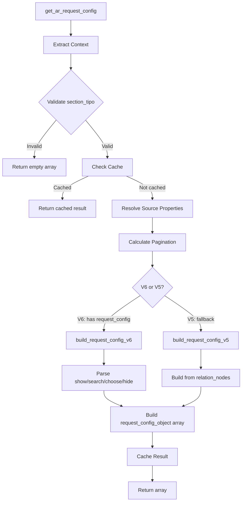

# Request Config Architecture

## Overview

The `request_config` system is Dédalo's mechanism for defining how sections and components retrieve and display their data. It bridges the ontology definition with the API requests, providing a structured way to configure:

- **What** data to display (columns, fields)
- **How** to search for records
- **Where** to get the data (section tipos, external APIs)
- **Which** elements to show or hide

## Architecture

The system is built using a modular trait-based architecture in `class.common.php`:

```
get_ar_request_config() [orchestrator]
├── trait.request_config_utils.php    # Validation, caching, pagination
├── trait.request_config_ddo.php      # DDO map processing
├── trait.request_config_v6.php       # V6 parsing (properties->source->request_config)
└── trait.request_config_v5.php       # V5 fallback (relation_nodes)
```

### Trait Responsibilities

| Trait | Responsibility | Key Methods |
|-------|----------------|-------------|
| `request_config_utils` | Validation, caching, pagination | `validate_section_tipo_model()`, `resolve_source_properties()`, `resolve_pagination_defaults()` |
| `request_config_ddo` | DDO map processing | `process_ddo_map()`, `validate_ddo_tipo()`, `resolve_ddo_self_references()` |
| `request_config_v6` | Modern config parsing | `build_request_config_v6()`, `parse_show_config()`, `parse_search_config()` |
| `request_config_v5` | Legacy fallback | `build_request_config_v5()`, `resolve_ar_related()` |

## Processing Flow



### Step-by-Step Flow

1. **Context Extraction**
   - Extract `tipo`, `section_tipo`, `section_id`, `mode`, `model`

2. **Validation**
   - Verify `section_tipo` is a valid `section` or `area*` model
   - Invalid tipos return empty array

3. **Cache Check**
   - Build cache key from context variables
   - Return cached result if available

4. **Source Properties Resolution**
   - In list mode, check for `section_list` child term
   - Use `section_list` properties if found

5. **Pagination Calculation**
   - Priority: instance pagination > properties config > defaults
   - Defaults: section edit=1, section list=10, component edit=10, component list=1

6. **Build Request Config**
   - **V6**: Parse `properties->source->request_config`
   - **V5**: Build from ontology `relation_nodes`

7. **Cache and Return**
   - Store result in static cache
   - Return array of `request_config_object`

## V6 vs V5 Configuration

### V6 Configuration (Recommended)

V6 uses explicit configuration in ontology properties:

```json
{
  "source": {
    "request_config": [
      {
        "api_engine": "dedalo",
        "type": "main",
        "sqo": {
          "section_tipo": ["numisdata3"],
          "limit": 10
        },
        "show": {
          "ddo_map": [
            {"tipo": "numisdata27", "section_tipo": "self", "parent": "self"}
          ]
        },
        "search": {
          "ddo_map": [
            {"tipo": "numisdata27", "section_tipo": "self", "parent": "self"}
          ]
        },
        "choose": {
          "ddo_map": [
            {"tipo": "numisdata27", "section_tipo": "self", "parent": "self"}
          ]
        }
      }
    ]
  }
}
```

### V5 Configuration (Legacy)

V5 uses implicit configuration from ontology structure:

- Components are children of sections
- `relation_nodes` defines what to display
- `section_list` child term defines list columns

V5 is used when `properties->source->request_config` is not defined.

## Request Config Object Structure

The `request_config_object` returned by `get_ar_request_config()`:

```typescript
interface request_config_object {
  api_engine: 'dedalo' | 'zenon' | string;  // API to use
  type: 'main' | string;                     // Config type
  sqo: {                                      // Search Query Object
    section_tipo: dd_object[];               // Target sections
    limit?: number;                          // Max records
    offset?: number;                         // Pagination offset
    filter_by_list?: object;                 // Pre-filter dropdown
    fixed_filter?: object;                   // Context-based filter
  };
  show: {                                     // Display configuration
    ddo_map: dd_object[];                    // Components to show
    sqo_config: {                            // Search configuration
      limit: number;
      offset: number;
      mode: string;
      operator: '$or' | '$and';
      full_count: boolean;
    };
    interface?: object;                      // UI controls
  };
  search?: {                                  // Search fields
    ddo_map: dd_object[];
    sqo_config?: object;
  };
  choose?: {                                  // Autocomplete selection
    ddo_map: dd_object[];
  };
  hide?: {                                    // Hidden elements
    ddo_map: dd_object[];
  };
  api_config?: object;                       // External API config
}
```

## DDO (Data Description Object)

Each item in `ddo_map` is a `dd_object`:

```typescript
interface dd_object {
  tipo: string;           // Ontology identifier
  model: string;          // Component model name
  section_tipo: string;   // Target section
  parent: string;         // Parent element tipo
  mode: string;           // Display mode
  view?: string;          // View variant
  label: string;          // Human-readable name
  permissions?: number;   // Access level (0-3)
  fixed_mode?: boolean;   // Mode is locked
  lang?: string;          // Language code
  properties?: object;    // Additional properties
}
```

### Self Resolution

The `self` keyword is a placeholder resolved at runtime:

| Property | `self` Resolves To |
|----------|-------------------|
| `section_tipo` | Current section_tipo or array of section_tipos |
| `parent` | Current element's tipo |

## Usage Examples

### Basic Section List

```json
{
  "source": {
    "request_config": [
      {
        "sqo": {
          "section_tipo": [{"value": ["numisdata3"], "source": "section"}]
        },
        "show": {
          "ddo_map": [
            {
              "tipo": "numisdata130",
              "section_tipo": "self",
              "parent": "self",
              "mode": "list"
            },
            {
              "tipo": "numisdata27",
              "section_tipo": "self",
              "parent": "self"
            }
          ],
          "sqo_config": {
            "limit": 10,
            "offset": 0
          }
        }
      }
    ]
  }
}
```

### Portal with Multiple Sections

```json
{
  "source": {
    "request_config": [
      {
        "sqo": {
          "section_tipo": [
            {"value": ["numisdata4", "numisdata5"], "source": "section"}
          ]
        },
        "show": {
          "ddo_map": [
            {
              "tipo": "rsc29",
              "section_tipo": "self",
              "parent": "self",
              "view": "thumbnail"
            }
          ]
        }
      }
    ]
  }
}
```

### Autocomplete Configuration

```json
{
  "source": {
    "request_config": [
      {
        "sqo": {
          "section_tipo": [{"value": ["hierarchy1"], "source": "hierarchy_types"}]
        },
        "show": {
          "ddo_map": [
            {"tipo": "hierarchy25", "section_tipo": "self", "parent": "self"}
          ]
        },
        "search": {
          "ddo_map": [
            {"tipo": "hierarchy25", "section_tipo": "self", "parent": "self"}
          ],
          "sqo_config": {"limit": 30}
        },
        "choose": {
          "ddo_map": [
            {"tipo": "hierarchy25", "section_tipo": "self", "parent": "self"},
            {"tipo": "hierarchy27", "section_tipo": "self", "parent": "self"}
          ],
          "fields_separator": " | "
        }
      }
    ]
  }
}
```

### External API (Zenon)

```json
{
  "source": {
    "request_config": [
      {
        "api_engine": "zenon",
        "sqo": {
          "section_tipo": [{"value": ["zenon1"], "source": "section"}]
        },
        "show": {
          "ddo_map": [
            {"tipo": "zenon5", "section_tipo": "zenon1", "parent": "self"}
          ]
        }
      }
    ]
  }
}
```

### With Fixed Filter

```json
{
  "source": {
    "request_config": [
      {
        "sqo": {
          "section_tipo": [{"value": ["numisdata4"], "source": "section"}],
          "fixed_filter": [
            {
              "source": {
                "component_tipo": "numisdata30",
                "section_tipo": "numisdata3",
                "section_id": "self"
              }
            }
          ]
        },
        "show": {
          "ddo_map": [
            {"tipo": "numisdata27", "section_tipo": "self", "parent": "self"}
          ]
        }
      }
    ]
  }
}
```

## Dynamic DDO Map (get_ddo_map)

Instead of hardcoding `ddo_map`, you can use `get_ddo_map` to fetch from another ontology term:

```json
{
  "show": {
    "get_ddo_map": {
      "model": "section_map",
      "columns": [
        {"path": ["components", "mint"]},
        {"path": ["components", "type"]}
      ]
    }
  }
}
```

This resolves the ddo_map from a `section_map` child term, useful for sharing column definitions across multiple sections.

## Pagination

### Priority Order

1. API request (`dd_core_api::$rqo->sqo->limit`)
2. Instance pagination (`$this->pagination->limit`)
3. Properties config (`request_config->show->sqo_config->limit`)
4. Mode/model defaults

### Default Limits

| Caller | Mode | Default Limit |
|--------|------|---------------|
| section | edit | 1 |
| section | list | 10 |
| component | edit | 10 |
| component | list | 1 |

### Session Override

Sections can store user preference in session, accessed through the
`section::get_session_sqo($sqo_id)` / `section::set_session_sqo($sqo_id, $sqo)`
accessors (do not touch the superglobal directly):

```php
section::set_session_sqo($sqo_id, $sqo); // $sqo->limit = 25;
```

## Construction Flow (orchestration)

`common::build_request_config()` orchestrates three named stages:

1. **RQO-derived** (`build_request_config_from_rqo`) — when the client API
   request targets this element with an explicit `show`, the config is rebuilt
   from the rqo. Client-sent ddos pass the **same validation as ontology
   configs**: whitelist scrub at the API gate
   (`request_config_object::sanitize_client_ddo_map` in
   `core/api/v1/json/index.php`), then tipo/TLD validation and permission
   filtering server-side (`common::validate_requested_ddo`).
2. **Base build** (`get_ar_request_config`) — deterministic, cacheable config
   from ontology properties (V6) or the ontology-derived default builder (V5),
   optionally overridden by a user layout preset. Preset application never
   mutates `$this->properties`: the override travels as a parameter
   (`resolve_preset_properties`).
3. **Overlay** (`overlay_request_state`) — per-call request-scoped state
   (rqo/session sqo merge) applied to the instance's private copy, never to
   the cached base.

## Caching

The base config is cached in a static array (`common::$resolved_request_properties_parsed`).

**The cache boundary is immutable**: `cache_request_config` stores a deep-cloned
snapshot and `get_cached_request_config` returns a deep clone — callers can
mutate their copy (the overlay stage does) without poisoning the shared base.

Cache key:

```
{tipo}_{section_tipo}_{external}_{mode}_{section_id}
  _u{user_id}                  // permissions/buttons are user-specific
  _pg{limit}-{offset}          // instance pagination is baked into the payload
  _rq{rqo_limit}               // API rqo limit override (when targeting this tipo)
  _ss{session_limit}           // session sqo limit (sections only)
  _v{view}                     // tm mode only (dataframe ddo view)
  _p{preset_hash}              // user layout preset builds (when applied)
```

Caching is skipped entirely (per build) when:
- `fixed_filter` is present (resolves record data, no invalidation path)
- `filter_by_list` is present (resolves a live list of values from the DB)

The cache is bounded to 1000 entries (`common::manage_cache_size`) and emptied
per request in worker mode by `common::clear()`.

## Error Contract

| Class | Cases | Behavior |
|-------|-------|----------|
| **FATAL** (throw) | v5-unsupported components (`component_relation_parent/children` without v6 config); structurally invalid `request_config` when the element is the direct API source target | Exception → API response `errors` channel |
| **DROP + WARN** | invalid tipo, inactive TLD, no permissions, malformed `get_ddo_map`, malformed client ddos | element removed; recorded in the per-instance collector |
| **DEFAULT + NOTICE** | missing `show` | default applied; recorded |

Every drop/default is recorded via `common::add_request_config_warning()`:
- always logged through `debug_log`
- counted in `metrics::$request_config_drops_total_calls`
- under `SHOW_DEBUG`, surfaced in the element context as `config_warnings`
  so an unexpectedly empty UI self-explains

## Validation and Audit

- `request_config_object::validate_config($request_config)` — pure structural
  validator (shape, tipo grammar, ddo_map sections, `get_ddo_map`); returns
  issue objects `{level, path, message}`.
- Validate-on-save: `ontology::parse_section_record_to_ontology_node` runs the
  validator (non-blocking warning) whenever saved properties contain
  `source->request_config`.
- Batch audit (CLI, cron/CI friendly — exit code 1 on errors):

```bash
php core/ontology/audit_request_config.php [--errors-only]
```

## Interface Controls

The `show->interface` property controls UI elements:

```json
{
  "show": {
    "ddo_map": [...],
    "interface": {
      "read_only": false,
      "button_add": true,
      "button_delete": true,
      "button_edit": false,
      "button_link": true,
      "tools": true,
      "show_autocomplete": true
    }
  }
}
```

## Best Practices

1. **Always use V6 configuration** for new ontology definitions
2. **Use `self` references** instead of hardcoding section_tipos
3. **Define `show`, `search`, and `choose` separately** for autocomplete components
4. **Set appropriate limits** to prevent performance issues
5. **Use `get_ddo_map`** for shared column definitions
6. **Test with different user permissions** to ensure proper filtering

## Troubleshooting

### Empty ddo_map

- Check `section_tipo` is valid
- Verify TLD is installed (`check_active_tld`)
- Ensure user has permissions (>= 1)

### Wrong section_tipo

- `self` not resolving correctly
- Check `ar_section_tipo` extraction from SQO

### Cache Issues

- `fixed_filter` disables caching
- Clear cache by changing `section_id`

### V5 Fallback

- Ensure `properties->source->request_config` is defined
- Check JSON is valid in ontology properties

## API Reference

### Main Method

```php
public function get_ar_request_config() : array
```

Returns array of `request_config_object` instances.

### Convenience Method

```php
public function get_request_config_object() : ?request_config_object
```

Returns first `request_config_object` or null.

### Related Files

- `core/common/class.common.php` - Main orchestrator
- `core/common/trait.request_config_utils.php` - Utilities
- `core/common/trait.request_config_ddo.php` - DDO processing
- `core/common/trait.request_config_v6.php` - V6 parsing
- `core/common/trait.request_config_v5.php` - V5 fallback
- `core/common/class.request_config_object.php` - Object definition
- `core/common/class.dd_object.php` - DDO definition

## Related Documentation

- [Request Query Object (RQO)](../rqo.md)
- [Search Query Object (SQO)](../sqo.md)
- [DD Object](../dd_object.md)
- [Request Config Presets](./request_config_presets.md)
