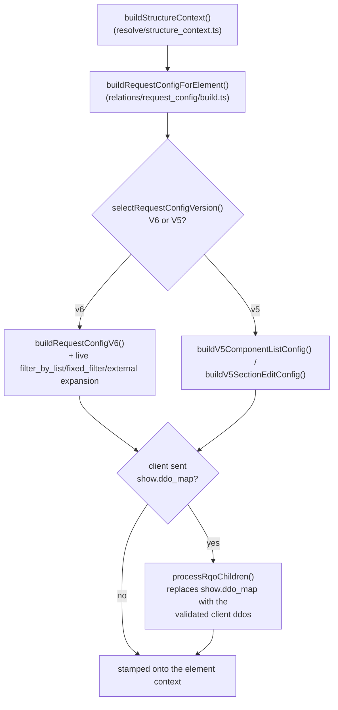

# Request Config Architecture

> PHP oracle: `./core/common/class.common.php` → `build_request_config()`,
> `./core/common/class.request_config_object.php`, `./core/common/class.dd_object.php`
> TS rewrite: `src/core/relations/request_config/{build,v6,v5,filters,external}.ts`,
> pure contract in `src/core/concepts/request_config.ts`
> (see [RELATIONS_SPEC.md](../../engineering/RELATIONS_SPEC.md) §4 and
> [STATUS.md](../../rewrite/STATUS.md) "Relations rebuild — Phase B" for the port ledger)

## Overview

The `request_config` system is Dédalo's **server-side** mechanism for defining how a section or component retrieves and displays its data. It is the configuration half of the work API: the server resolves a `request_config` per element and injects it into the element's context; the client then turns it into one or more [RQO](rqo.md)s for the actual calls. The request_config declares:

- **What** data to display (the `ddo_map` columns/fields)
- **How** to search and pick records (`search` / `choose` layouts)
- **Where** to get the data (target `section_tipo` sources, external API engines)
- **Which** elements to resolve but never render (`hide`)
- **How much** to fetch (sqo limits, pagination) and **with what UI** (interface controls)

For the wire-level message the client builds from this config, see [rqo.md](rqo.md). For copy-paste ontology JSON by scenario, see the cookbook [request_config_examples.md](request_config_examples.md).

## Architecture

PHP composes the system from traits mixed into `class.common.php`, so every section/component instance carries it. The TS rewrite is a strangler-fig module set under `src/core/relations/request_config/` (RELATIONS_SPEC.md §4), called from the horizontal read engine (`src/core/section/read.ts`) and from `src/core/resolve/structure_context.ts` rather than being a method mixed into every element instance — there is no per-instance PHP-style object carrying its own config; the build is a pure function of `(properties, context)`.

```
PHP: common::build_request_config() [3-stage orchestrator, memoized per instance]
├── common::get_ar_request_config()         # cacheable base build (V6/V5 selector)
├── trait.request_config_utils.php          # validation, caching, cache key, pagination
├── trait.request_config_ddo.php            # ddo_map / get_ddo_map / self-resolution
├── trait.request_config_v6.php             # V6: explicit properties->source->request_config
└── trait.request_config_v5.php             # V5: auto-derived fallback (active default)

TS:  relations/request_config/build.ts       # buildRequestConfigForElement() — the V6/V5 selector + entry point
├── concepts/request_config.ts               # pure contract: zod schemas + selectRequestConfigVersion()
├── relations/request_config/v6.ts           # V6 parser (ddo self-resolution, get_ddo_map, sqo.section_tipo sources)
├── relations/request_config/v5.ts           # V5: the REAL legacy ontology-graph walk (not a stub)
├── relations/request_config/filters.ts      # filter_by_list / fixed_filter live expansion
└── relations/request_config/external.ts     # non-dedalo api_engine → target section's api_config
```

### Module responsibilities

| TS module | Responsibility | Key exports |
|-------|----------------|-------------|
| `concepts/request_config.ts` | Pure contract: schemas, the v5/v6 selection rule | `requestConfigSchema`, `selectRequestConfigVersion()`, `V5_UNSUPPORTED_MODELS` |
| `relations/request_config/build.ts` | Entry point: LIST/TM section_list substitution, then V6/V5 dispatch | `buildRequestConfigForElement()`, `getElementColumnsMap()`, `findSectionListChild()` |
| `relations/request_config/v6.ts` | Explicit config parsing: ddo self-resolution, mode/label enrichment, `get_ddo_map`, the enriched `sqo.section_tipo` ddo objects | `buildRequestConfigV6()`, `resolveSqoSectionTipos()`, `buildSqoSectionTipoDdos()` |
| `relations/request_config/v5.ts` | The real ontology-relation-graph walk (component list targets + the full section edit-form tree) | `buildV5ComponentListConfig()`, `buildV5SectionEditConfig()`, `resolveVirtualEditScope()` |
| `relations/request_config/filters.ts` | Live `filter_by_list` / `fixed_filter` expansion (record/DB data, never cached) | `expandFilterByList()`, `expandFixedFilter()` |
| `relations/request_config/external.ts` | Attaches the target section's `api_config` for non-`dedalo` engines | `resolveExternalConfig()` |

Unlike PHP's per-instance memoization + static cross-request cache, every TS build is a plain async function call — there is no config-level cache to invalidate (see [Caching](#caching-and-the-cache-key) below for what that means in practice). `build.ts`, the pure-contract boundary in `concepts/request_config.ts`, and the `v6`/`v5` builders are the things to understand first; `filters.ts`/`external.ts` are the two live-expansion special cases.

## V6 vs V5 configuration

This is the most misunderstood part of the system, so read it precisely. The selection is a single line in PHP's `get_ar_request_config()` (`class.common.php`), ported verbatim as the pure `selectRequestConfigVersion()` (`src/core/concepts/request_config.ts`):

```php
if (isset($properties->source->request_config)) {
    $ar_request_query_objects = $this->build_request_config_v6($properties, $context, $pagination);
} else {
    $ar_request_query_objects = $this->build_request_config_v5($context, $pagination);
}
```

```typescript
// src/core/concepts/request_config.ts
export function selectRequestConfigVersion(properties: unknown): 'v6' | 'v5' {
  const requestConfig = (properties as { source?: { request_config?: unknown } } | null)
    ?.source?.request_config;
  return requestConfig !== undefined && requestConfig !== null ? 'v6' : 'v5';
}
```

`relations/request_config/build.ts` calls this rule and dispatches to `buildRequestConfigV6()` (`v6.ts`) or the real V5 walk (`v5.ts`) — data-driven, exactly like PHP: there is no per-model requirement, only whether the node's properties carry `source.request_config`.

### V6 — the modern explicit config (`relations/request_config/v6.ts`)

V6 is the **preferred strategy introduced in Dédalo v6**: an ontology-driven, explicit configuration. The node's `properties->source->request_config` holds a JSON **array** of config objects, each parsed into a `request_config_object`. Everything — target sections, the show/search/choose/hide layouts, sqo defaults, interface switches — is declared by hand. New ontology definitions should use V6.

A minimal V6 node (full scenarios live in the [cookbook](request_config_examples.md)):

```json
{
  "source": {
    "request_config": [
      {
        "api_engine": "dedalo",
        "type": "main",
        "sqo": { "section_tipo": [{ "value": ["numisdata3"], "source": "section" }] },
        "show": { "ddo_map": [ { "tipo": "numisdata27", "section_tipo": "self", "parent": "self" } ] }
      }
    ]
  }
}
```

### V5 — the legacy-but-active auto-derived fallback (`relations/request_config/v5.ts`)

V5 is **not dead or deprecated code**. Its PHP header calls it a "legacy fallback strategy," but it **runs automatically, on every request, for every ontology node that has no explicit `properties->source->request_config`**. It is the live default for un-migrated nodes — the majority of components in a typical ontology never declare an explicit config and are served by V5 on every read. The TS rewrite ported the REAL graph walk, not a stub — `v5.ts`'s header explicitly notes it is "load-bearing for classic simple relations" (select/radio/check_box target definitions).

Instead of reading an explicit array, V5 **derives** the display config by walking the ontology relation graph:

1. **Component list targets** (`buildV5ComponentListConfig`) — the first `section`-model node among the source's `relations` becomes the TARGET SECTION (stripped from the ddo list); `exclude_elements` marker nodes and the deprecated `dd249` security component are skipped; `component_filter`/`component_filter_master` always target the projects section (`dd153`/`dd156`) instead; a section_list child with no section node falls back to the component's main `related` section (`getMainRelatedSectionTipo`).
2. **Section edit-form tree** (`buildV5SectionEditConfig`) — for a SECTION in edit mode: a recursive ontology walk collects every `component_*`/`section_group*`/`section_tab`/`tab` descendant (excluding `component_dataframe`, which renders through its main component), honoring virtual-section resolution (`resolveVirtualEditScope` — a virtual section borrows the REAL section's children minus its first `exclude_elements` set) and per-ddo view defaults.

**The critical normalization point:** V5 wraps its derived result in **exactly the same parsed-item shape** as V6 (`api_engine:'dedalo'`, `type:'main'`, with `show`/`sqo`) and returns a **one-element array matching what V6 returns, so callers need no branching** — `build.ts` calls either builder through the same `ParsedRequestConfigItem[]` return type. Downstream code (the resolvers in `src/core/relations/`, the structure-context stamping) cannot tell whether a config came from V6 or V5.

"Migration target" in the PHP trait comments means **un-migrated nodes should eventually move to an explicit V6 config** — not that V5 is inert. The only genuinely dead corner is the explicit V5 **throw**: `component_relation_parent` and `component_relation_children` (`V5_UNSUPPORTED_MODELS`) raise an Exception forcing migration to an explicit V6 config. Everything else V5 handles silently and indefinitely.

| | V6 | V5 |
|---|---|---|
| Source | explicit `properties->source->request_config` array | derived by walking the relation graph |
| Status | preferred / modern | legacy **but active default** for un-migrated nodes |
| Output | `ParsedRequestConfigItem[]` | **same** `ParsedRequestConfigItem[]` (one element) |
| Runs when | the node declares a config | the node declares **no** config (every request) |
| Hard failure | — | throws for `component_relation_parent`/`children` |

!!! note "TS ledger"
    Per-ddo permission gating (dropping ddos with permission 0 for the current user) is not yet wired into the TS V5/V6 builders — the read path currently resolves with the harness admin principal; it lands with the broader ACL-in-relations integration (`rewrite/STATUS.md` Phase B facts). Both builders are otherwise byte-parity gated against the live PHP server (`test/parity/relation_corpus_config.test.ts`, 18/18 corpus rows; `test/unit/request_config_v5.test.ts`).

## Construction flow

PHP's `common::build_request_config()` is a 3-stage orchestrator, **memoized per instance** (`if (isset($this->request_config)) return $this->request_config;`): an RQO-derived short-circuit, a cacheable base build, and a per-call overlay. The TS rewrite keeps the same three CONCERNS but resolves them differently because of a structural architecture delta: **there is no per-instance object and no cross-request static cache to memoize into** — PHP's ~10 global static caches (needing manual `common::clear()` between requests under RoadRunner) are replaced by a single long-lived Bun process with request-scoped state (`AsyncLocalStorage`, see `src/core/resolve/request_lang.ts` for the pattern). Every `buildRequestConfigForElement()` call is a plain, stateless async function of `(properties, context)` — the cross-request state-bleed hazard PHP's cache-clone discipline exists to prevent is structurally gone, at the cost of recomputing the base build on every call (see [Caching](#caching-and-the-cache-key) below).



### Base build — V6/V5 selection (every call)

`buildRequestConfigForElement()` is the direct TS equivalent of PHP's `get_ar_request_config()`: it runs the section_list LIST-mode substitution (below), then `selectRequestConfigVersion()`, then the matching builder. There is no deterministic/cacheable-vs-live distinction at this layer — every call runs the full build; `filters.ts`'s live `filter_by_list`/`fixed_filter` expansion is simply always current rather than needing a `use_cache=false` escape hatch.

### RQO-derived narrowing (the reverse path, partial)

PHP's `build_request_config_from_rqo()` is a full short-circuit: when the client-sent RQO targets this element and carries an explicit `show`, the WHOLE config is rebuilt from the RQO and the base build never runs. The TS rewrite covers the same use case (time machine, `tool_qr`, graph view, "portal full grid in one read" — [cookbook #18](request_config_examples.md#18-portal-full-grid-in-one-read)) with a narrower mechanism: `structure_context.ts` always runs the base V6/V5 build, then — only when the request carries client children ddos (`options.rqoChildrenDdos`) — calls `processRqoChildren()` (`relations/request_config/v6.ts`) to REPLACE each parsed item's `show.ddo_map` with the client-sent ddos, each passed through the same self-resolution/mode/label enrichment pipeline as an ontology ddo. There is no separate `validate_requested_ddo()`/`consolidate_requested_ddo()` pass documented as ported yet — track this against `rewrite/STATUS.md` before relying on it for a security-sensitive client-ddo surface.

### Per-call overlay (rqo/session sqo)

PHP's `overlay_request_state()` — filling a missing `type`, merging the rqo sqo, falling back to `section::get_session_sqo()` for navigation continuity — is a session-store concern rather than a request_config-build concern in the TS rewrite; see `rewrite/STATUS.md` "sqo_session" for the session-SQO port status (ledgered: no dedicated TS session-SQO store yet).

### User layout presets

PHP's `resolve_preset_properties()` (section `dd1244`, `request_config_presets::get_request_config()`) resolves a per-user layout override BEFORE the base build, without mutating the instance. **Not yet ported** — the TS builders always resolve from the node's own ontology properties; there is no TS equivalent of `request_config_preset_hash` or the preset lookup.

## request_config_object shape

PHP's `request_config_object extends stdClass` (`class.request_config_object.php`) dispatches each input key to a matching `set_<key>()` method and **logs + skips unknown keys**; `api_config` is the only key whose `null` value is deliberately preserved. The TS rewrite models the same shape as a zod schema (`requestConfigItemSchema`, `src/core/concepts/request_config.ts`) with **`.passthrough()`** rather than a skip-and-log setter list: an unrecognized key on a parsed item is kept, not dropped or logged — the schema documents the known fields but does not police extras the way the PHP setter dispatch does.

```typescript
interface request_config_object {
  api_engine: 'dedalo' | string;   // internal engine, or an external adapter name (e.g. 'zenon')
  type: 'main' | string;           // config type ('main' is the primary one)
  sqo: {                           // query defaults (the SQO the client copies into its RQO)
    section_tipo: object[];        // target-section sources (see vocabulary below)
    fixed_filter?: object;         // context/record-derived filter (disables caching)
    filter_by_list?: object;       // live DB list pre-filter (disables caching)
    filter_by_locators?: object[];
    limit?: number;
    offset?: number;
    operator?: '$or' | '$and';
  };
  show: {                          // mandatory display context
    ddo_map?: dd_object[];         // columns/fields to show
    get_ddo_map?: object;          // OR resolve the ddo_map dynamically (see below)
    sqo_config?: object;           // display-scoped sqo tuning (limit, offset, operator, full_count)
    interface?: object;            // UI switches — see rqo.md (#show-interface) for the table
    fields_separator?: string;
    records_separator?: string;
  };
  search?: { ddo_map?: dd_object[]; get_ddo_map?: object; sqo_config?: object; };
  choose?: { ddo_map?: dd_object[]; fields_separator?: string; };
  hide?:   { ddo_map?: dd_object[]; };  // resolved server-side, never rendered
  api_config?: object | null;      // external-engine connection params (null preserved)
}
```

`show` is the mandatory display context. `search`/`choose`/`hide` are optional and share the `show` sub-shape. The `interface` switches are documented **once, canonically, in [rqo.md → `show.interface`](rqo.md#show-interface)** — do not duplicate that table here.

## dd_object (DDO) shape

PHP's `dd_object extends stdClass implements JsonSerializable` (`class.dd_object.php`) is one **Data Description Object** — a single column/field entry in a `ddo_map`. Its setter list is the authoritative field set; the most relevant fields:

The TS rewrite splits this into two schemas with different trust levels (`src/core/concepts/ddo.ts`): `ddoSchema` is a **strict whitelist** (zod's default `.strip()`, dropping anything not listed) mirroring PHP's `sanitize_client_ddo_map` — it is the security gate for any ddo a CLIENT sends (`show`/`search`/`choose` on an inbound RQO). Server-resolved ddos (the `ProcessedDdo` TS interface the V6/V5 builders emit, `relations/request_config/v6.ts`) carry a wider, open field set (an index signature keeps every enrichment field, matching PHP's permissive `stdClass`) — the whitelist only applies at the untrusted client boundary, not to what the ontology/graph-walk builders produce server-side.

```typescript
interface dd_object {
  // identity / resolution
  tipo: string;                  // ontology identifier of the element
  model?: string;                // component model name
  section_tipo?: string|string[];// target section ('self' resolves at runtime)
  parent?: string;               // parent element tipo ('self' resolves at runtime)
  parent_grouper?: string;       // grouper the element belongs to (layout grouping)
  // presentation
  label?: string; labels?: object; lang?: string;
  mode?: string; view?: string; children_view?: string;
  css?: object;                  // per-ddo style overrides (from properties.css)
  color?: string; role?: string;
  // behavior / access
  id?: string; type?: string; permissions?: number;
  buttons?: array; tools?: array;
  sortable?: boolean; autoload?: boolean;
  show_in_inspector?: boolean; show_in_component?: boolean;
  value_with_parents?: boolean;
  // data shaping
  columns_map?: array; target_sections?: array; section_map?: object;
  fields_separator?: string; records_separator?: string;
  fn?: string; data_fn?: string; parser_args?: object; data_slice?: object;
  matrix_table?: string; diffusion_tipo?: string; options?: object;
  section_filter?: array; component_filter?: array;
  request_config?: array;        // nested config (e.g. a portal's own columns)
}
```

See [dd_object.md](dd_object.md) for the per-field contract. Note `parent_grouper` (used to nest a ddo under a grouper in the layout) and `css` (per-ddo style overrides, sourced from the node's `properties.css`) — both appear in cookbook examples and are real, settable fields.

## Self-resolution and dynamic `section_tipo` sources

The ontology cannot know installation-specific tipos, so configs use placeholders resolved **server-side** before the client ever sees them.

### `self` in a ddo (`processSingleDdo` self-resolution)

TS: `processSingleDdo()` (`relations/request_config/v6.ts`), PHP: `resolve_ddo_self_references($ddo, $context)` (`trait.request_config_ddo.php`). One subtlety the TS port makes explicit that the PHP name obscures: for a normal (non-dataframe) ddo, `section_tipo: "self"` resolves to the ITEM'S resolved SQO **target** sections (the child lives at the portal's targets, not at the caller) — only `component_dataframe` resolves `self` to the caller's own section (frames live on the caller's record):

| Field | `self` resolves to |
|-------|--------------------|
| `section_tipo` | the item's resolved `sqo.section_tipo` targets — or the CALLER's own section_tipo (scalar) for `component_dataframe` |
| `parent` | `context.ownerTipo` (the current element's tipo) |

### `sqo.section_tipo` source vocabulary

The `sqo.section_tipo` is an **array of source descriptors** (`{source, value}`), resolved by `resolveSqoSectionTipos()` (`relations/request_config/v6.ts`; PHP `component_relation_common::get_request_config_section_tipo()`). The vocabulary:

| `source` | Resolves to | TS status |
|----------|-------------|-----------|
| `section` | TLD-active-checked literal section tipos in `value` (the default form) | ✅ ported (TLD-active check not yet enforced here — literal tipos pass through) |
| `self` | the caller's section_tipo array | ✅ ported |
| `hierarchy_types` | `get_hierarchy_sections_from_types()` over the hierarchy types in `value` | ✅ ported (`resolveHierarchySectionsFromTypes`) |
| `ontology_sections` | the ontology sections set for `value` | ⬜ not specially resolved yet — falls through to the generic literal-tipo branch |
| `field_value` | a **live SQO lookup** of children/hierarchy field values (record-dependent) | ⬜ not ported |

A bare string `'self'` (not wrapped in a `{source, value}` object) still resolves (the TS parser accepts plain string entries directly), unlike PHP where it is now an error. Prefer the `{source, value}` object form for parity with PHP-managed ontologies.

### `get_ddo_map` — dynamic ddo_map

Instead of hardcoding `ddo_map`, a `show`/`search`/`choose` block may carry a `get_ddo_map` directive of the form `{model: 'section_map', columns: [...]}`. TS: `resolveGetDdoMap()` (`relations/request_config/v6.ts`), reading `getSectionMapValue()` (`src/core/ontology/section_map.ts`); PHP: `resolve_get_ddo_map()` from `section::get_section_map()`. Lets multiple sections share a common column set: a component tipo seen under several target sections merges into ONE ddo whose `section_tipo` becomes the array of those sections.

```json
{
  "show": {
    "get_ddo_map": {
      "model": "section_map",
      "columns": [ { "path": ["components", "mint"] }, { "path": ["components", "type"] } ]
    }
  }
}
```

The `section_map` itself is the global scope/term map built per section. A full dynamic-ddo_map scenario is in the [cookbook](request_config_examples.md).

## `filter` vs `filter_by_list` vs `fixed_filter`

Three distinct filtering concepts that are easy to confuse:

| Key | Lives on | Meaning | TS resolver |
|-----|----------|---------|---------|
| `filter` | the **SQO** (RQO side) | the live query `WHERE` the client sends per call (search box, panel) | n/a — part of the request, not the config; see [sqo.md](sqo.md) |
| `filter_by_list` | `sqo.filter_by_list` | a pre-filter dropdown whose option values are read **live from the DB** | `expandFilterByList()` (`relations/request_config/filters.ts`) |
| `fixed_filter` | `sqo.fixed_filter` | a context/record-derived filter that varies by `section_id`, over three sources: `fixed_dato` (embedded SQO filter objects), `component_data` (multi-hop live read of the calling record's own data), `hierarchy_terms` (thesaurus-subtree section_id IN-filter) | `expandFixedFilter()` (`relations/request_config/filters.ts`) |

Both are resolved inside `buildRequestConfigV6()` (`v6.ts`) whenever the raw sqo carries the key, reading LIVE record/DB data with no cache-invalidation signal. PHP's `use_cache=false` flip on the instance has no TS equivalent to flip — since the TS build never caches (see [Caching](#caching-and-the-cache-key)), every call already re-reads this live data; the practical consequence PHP names (these configs are recomputed per request) holds trivially in TS, not as an opt-out from an otherwise-cached path.

## Pagination

PHP centralizes this in one instance method, `calculate_default_limit()` (+ `resolve_pagination_override()` layering instance/rqo limits over it). The TS rewrite reaches the **same default numbers** but from separate call sites rather than one function: `src/core/section/read.ts` applies the section-level defaults directly when the client sends no limit (`rqo.sqo.limit` absent/null); `src/core/relations/relation_core.ts`'s `ownEditLimit()`/`PORTAL_LIST_LIMIT` apply the component-level defaults for portal/relation cells. There is no single `resolve_pagination_defaults()` entry point to link to — search for `PORTAL_LIST_LIMIT` and the `rqo.sqo.limit` default branches in `section/read.ts` if you need to change these numbers.

### Limit priority (highest → lowest)

1. the RQO's own `sqo.limit` (clamped client-side by `sanitizeClientSqo`, §7.5)
2. the config's declared `sqo.limit` / `show.sqo_config.limit` (LAST request_config item wins — `ownEditLimit()`)
3. mode/model heuristic default (below)

### Default limits (verified in both PHP and TS)

| Caller | Mode | Default limit | TS location |
|--------|------|---------------|--------------|
| section | edit | 1 | `section/read.ts` |
| section | other (list, ...) | 10 | `section/read.ts` |
| component | edit | 10 | `relations/relation_core.ts` `ownEditLimit() ?? 10` |
| component | other (list, ...) | 1 | `relations/relation_core.ts` `PORTAL_LIST_LIMIT` |

### Session override

PHP stores the user's navigation limit in the PHP session, reached through `section::get_session_sqo($sqo_id)` / `section::set_session_sqo($sqo_id, $sqo)`. **Not yet ported**: the TS rewrite has no per-session SQO store (`rewrite/STATUS.md` ledgers this as "sqo_session (§6.1): needs a per-session SQO store... no session-SQO infra today") — a client that omits its filter/limit on a follow-up call does not currently get its previous navigation state replayed server-side in TS.

## Caching and the cache key

**This entire section is PHP-only and does not apply to the TS rewrite.** PHP caches the base config in a static array (`common::$resolved_request_properties_parsed`, bounded to 1000 entries, cloned in/out, emptied per request in worker mode by `common::clear()`) because building it is expensive and the same worker process serves many requests across many users. The TS server has no such cache: every `buildRequestConfigForElement()` call is a fresh, stateless computation scoped to the current request (`AsyncLocalStorage`; see the "Big architectural deltas" note in the project's rewrite spec) — there is no cache key to compute, no clone boundary to protect, and no `use_cache=false` escape hatch to trigger, because nothing is ever cached in the first place. The PHP cache-key composition below is kept for reference only (e.g. if you are reading PHP behavior for a coexistence question):

```
{tipo}_{section_tipo}_{(int)external}_{mode}_{section_id}
  _u{user_id}        // permissions/buttons are baked in and user-specific
  _pg{limit}-{offset}// instance pagination is baked into the payload
  _rq{rqo_limit}     // API rqo limit override (only when the rqo source targets this tipo)
  _ss{session_limit} // session sqo limit (sections only)
  _v{view}           // tm mode only (component_dataframe ddo view)
  _p{preset_hash}    // user layout preset builds (only when a preset is applied)
```

## Error contract, warnings and audit

PHP's three-tier contract (FATAL throw for a structural error on the direct API target or a V5-unsupported model; DROP + WARN for the same error on a non-target node or an invalid/unauthorized/inactive-TLD ddo; DEFAULT + NOTICE for a missing definition with an applicable default), collected in `$this->request_config_warnings` and surfaced as `config_warnings` only under `SHOW_DEBUG`, **is not ported to the TS rewrite as a distinct warnings channel**. The TS builders mostly DROP silently (an invalid tipo, an unresolvable node, or a missing model simply produces `null`/is filtered out of the ddo_map — see the `return null` steps in `processSingleDdo()`) without a parallel `config_warnings` collection or `SHOW_DEBUG`-gated surface; `V5_UNSUPPORTED_MODELS` (`component_relation_parent`/`children`) does throw, matching PHP's FATAL tier. If you need to debug an empty `ddo_map` against the TS server today, the practical tool is stepping through `buildRequestConfigForElement()`/`processSingleDdo()` directly rather than reading a `config_warnings` field from the response.

### Offline validation and the audit CLI

**PHP-only, not ported.** `request_config_object::validate_config()` (structural validator) and the batch CLI below have no TS equivalent yet:

```bash
php core/ontology/audit_request_config.php [--errors-only]
```

Because both servers read the same `dd_ontology` table, running the PHP auditor still validates configs the TS server will also build from — it is a legitimate CI check to keep running during the coexistence period even though the TS server cannot run it itself.

## Best practices

1. **Use V6 explicit config for new nodes.** V5 will keep serving un-migrated nodes, but explicit config is auditable and predictable — and it is the better-tested TS path (`test/parity/relation_corpus_config.test.ts`).
2. **Use `self`** for `parent` and ddo `section_tipo` rather than hardcoding installation tipos.
3. **Prefer the `{source, value}` object form** for `sqo.section_tipo` for parity with PHP (which now errors on a bare `"self"` string; the TS parser still accepts it, but do not rely on that divergence).
4. **Define `show`, `search` and `choose` separately** for autocomplete components.
5. **Prefer `get_ddo_map`** for column sets shared across sections.
6. **Let the server own limits** (`limit: null`) so the mode/model default wins; client limits are clamped anyway. Do not rely on cross-request session-limit continuity against the TS server yet (no session-SQO store — see [Session override](#session-override)).
7. **Test under multiple user permissions** — per-ddo permission gating (dropping ddos with permission 0) is a TS gap today (harness runs the admin principal); do not treat a permission-0 test as validated against the TS server until this lands.
8. **Run the PHP audit CLI in CI** to catch malformed configs before they reach users — both servers read the same ontology, so the check still protects the TS server.

## Troubleshooting

- **Empty `ddo_map`** — verify the `section_tipo` source resolves and that the node/model lookups in `processSingleDdo()` succeed; there is no `config_warnings` field to inspect on the TS server (see [Error contract](#error-contract-warnings-and-audit) above) — step through the builder directly.
- **`self` not resolving** — remember it resolves to the item's SQO TARGET sections for a normal ddo, and to the CALLER's own section only for `component_dataframe` (`processSingleDdo()`); confirm which one applies.
- **Config changes not taking effect** — there is no config-level cache in TS (see [Caching](#caching-and-the-cache-key)), so a stale value here is almost certainly upstream (ontology cache, `dd_ontology` read cache) rather than a request_config cache-key mismatch.
- **`component_relation_parent`/`children` throws** — these models are V5-unsupported in both engines; give the node an explicit V6 `request_config`.
- **Preset not applied** — user layout presets (`dd1244`) are not ported; a preset that works against PHP will be ignored by the TS server.
- **`ontology_sections`/`field_value` `sqo.section_tipo` sources resolve wrong** — these two source vocabulary entries are not specially handled in TS yet (see [the vocabulary table](#sqosection_tipo-source-vocabulary)); only `section`/`self`/`hierarchy_types` are.

## API reference

```typescript
// src/core/relations/request_config/build.ts — the entry point, start here
export async function buildRequestConfigForElement(
  ownProperties: unknown,
  context: RequestConfigContext,
): Promise<ParsedRequestConfigItem[]>

// src/core/concepts/request_config.ts — the pure V6/V5 selection rule
export function selectRequestConfigVersion(properties: unknown): 'v6' | 'v5'
```

```php
// PHP oracle, for reference
public function build_request_config() : array
public function get_ar_request_config(?object $properties_override=null) : array
public function get_request_config_object() : ?request_config_object
```

### Related files

- `src/core/relations/request_config/build.ts` — entry point: LIST-mode section_list substitution + V6/V5 selector
- `src/core/concepts/request_config.ts` — pure contract: zod schemas, `selectRequestConfigVersion`, `V5_UNSUPPORTED_MODELS`
- `src/core/relations/request_config/v6.ts` — explicit config parsing, ddo self-resolution, `get_ddo_map`
- `src/core/relations/request_config/v5.ts` — the real ontology-relation-graph walk
- `src/core/relations/request_config/filters.ts` — `filter_by_list` / `fixed_filter` live expansion
- `src/core/relations/request_config/external.ts` — non-`dedalo` engine `api_config` attachment
- `src/core/resolve/structure_context.ts` — where the parsed config gets stamped onto an element's context (and where the RQO-children narrowing happens)
- PHP oracle: `core/common/class.common.php`, `trait.request_config_{utils,ddo,v6,v5}.php`, `class.request_config_object.php` (+ `validate_config`), `class.dd_object.php`, `core/component_relation_common/class.component_relation_common.php` (`section_tipo` source resolution), `core/ontology/audit_request_config.php` (batch validation CLI, PHP-only)

## Related documentation

- [Request Query Object (RQO)](rqo.md) — the wire message the client builds from this config; canonical [`show.interface` controls table](rqo.md#show-interface)
- [Request Config Examples](request_config_examples.md) — cookbook of annotated ontology JSON by scenario
- [Search Query Object (SQO)](sqo.md) — the `filter`/`limit`/`order` carried inside the RQO
- [DD Object](dd_object.md) — per-field DDO contract
- [Ontology index](ontology/index.md) — ontology nodes, sections and the relation graph the config draws from
- [Request Config Presets](ontology/request_config_presets.md) — per-installation layout overrides (`dd1244`)
