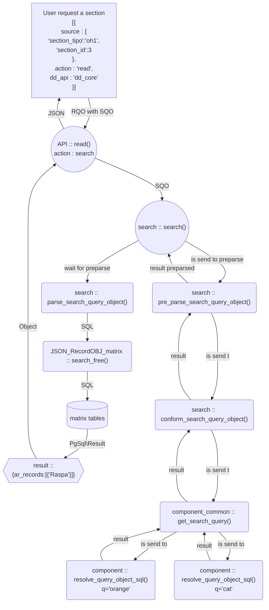

# Request Query Object

## Introduction

Request Query Object or RQO is used to create send and request data to Dédalo work API.

In versions before v6, Dédalo uses specific calls for every type of data or component, every piece of code had a `trigger` with the class of the class. This architecture made that a `component_autocomplete` will had different interface of `component_autocomplete_hi` or a `component_portal`. So any change of of a component needed to be development in the triggers of the different components with the same behavior.

In version 5 Dédalo introduce a Search Query Object, or SQO, an abstraction layer of the SQL and a standard way to create queries into the database, so, every search done by every component, section, tool, etc was unified into a common way. SQO was done thinking in Dédalo relations, and the paths of the data, SQO has a `filter`,, equivalent to to `WHERE` clause, and it has a `select` property equivalent to `SELECT` sentence into SQL.

In the first versions of the v6, the development was focused in the unification of the calls to the new API, and the first option was to use the SQO model. This way to unify the calls using SQO was quickly clearly insufficient, and the `select` property of the SQO do not meet the needs. The calls needs to define who is calling, what is request, what kind of action to do and other needs than the `SQO select` has been not design for that and RQO arise.

Therefore Request Query Object is the way to communicate client and server and use to control data flow into Dédalo.

## Request Query Object - RQO definition

> ./core/common/class.request_query_object.php

**request_query_object** `object`

!!! Note "About the main object definition and use to closure into an array to do the calls"
	Request Query Object is defined as object, but the calls of the API are multiple, is possible send multiple RQOs in one API call.
	So, every RQO need to be enclosed into an array previously to made the API call.

Request Query Object defines an object with normalized properties to create an API call.

## Request flow

Client create a RQO and call to the API doing a `fetch`, API check the user configuration, his permissions and analyze the RQO sent. If the RQO is correct, API perform the `action` defined. Every action use the RQO definition to perform the specific request, it can create components, sections, doing search, save or update data, etc.
when the `action` is done, the API sent the response to the client. Response is a standard object with the `result`, of the request, a `message` with a string result of the action and the `error` property with the issues or problems arise performing the call. Some API calls can add more properties to the response as they need.

## parameters

- **id** : `string`  *Optional* id of the API request
- **api_engine** : `string` *Optional* Engine name. `dedalo` or `zenon. If the parameter is not set, the API will use the default: 'dedalo'
- **dd_api**  : `string` *Mandatory* API class that will be used. Dédalo define 5 different classes: `dd_core_api`, `dd_tools_api`, `dd_ts_api`, `dd_utils_api` and `dd_component_xx_api` that is used by specific components. By default will use `dd_core_api`
- **action**  : `string` *Mandatory* API method that will be used (like 'get_menu')
- **source**  : `string` *Mandatory* component, section, menu, etc that made the call
    - **action** : `string` *Mandatory* API method that will be used with the source. source->action perform specific action for the caller.
- **sqo**   : `object` *Optional* Search Query Object to be used to perform BBDD queries.
- **show**  : `object` *Optional* Defines the component to be showed into sections or portals, show defines the layout of the list and the components to show into the component_portal
    - **ddo_map** `array` Defines the component chains to get context and data to be showed
    - **get_ddo_map"** : `object` *Optional* If this property is set, ddo_map will be calculated. The value is the model of the ontology term to get the ddo_map, such as `section_map`, different sections can define a component or multiple component to build common search and common columns (mint, type, es1, fr1, etc)
        - **model** : `string` Defines the ontology model to get the information
        - **path** : `array` Defines the path of properties into the object to get the information (stored into properties)
    - **fields_separator** : `string` *Optional* Defines the string between fields, used when the data need to be showed as string.
    - **records_separator** : `string` *Optional* Defines the string between records, used when the data need to be showed as string.
    - **sqo_config** `object` *Optional* Modifies SQO configuration for the show
    - **interface** : `object` *Optional* Defines the controls of the user interface elements as buttons or tools
        - **read_only** : `bool` | By default `false` | Control the edit ability of the component
        - **save_animation** : `bool` | By default `true` | Control for the green line animation when the component save his data
        - **value_buttons** : `bool` | By default `true` | Control to show or hide the buttons associated to values, as edit, remove, etc.
        - **button_add** : `bool` | By default `true`  | Control of the input interface button to add new registers
        - **button_delete** : `bool` | By default `true`  | Control for show or hide the delete button in the portal rows
        - **button_delete_link** : `bool` | By default `true`  | Control if the button for `unlink` records in the delete modal can be showed or not.
        - **button_delete_link_and_record** : `bool` | By default `true`  | Control if the button for `unlink` and `delete` records in the delete modal can be showed or not.
        - **button_link** : `bool` | By default `true`  | Control of the input interface button to link existent registers
        - **button_edit** : `bool` | By default `false`  | Control if the edit button in portals or sections can be showed
        - **button_edit_options** : `object`  Expand the  | control of the button edit with specific parameters
            - **action_mousedown** : `string` navigate|open_window | By default use `navigate` (name of function to be executed) | `navigate` option enter in edit mode in the same window, `open_window` option will open new popup window.
            - **action_contextmenu** : `string` navigate|open_window | By default use `open_window`  (name of function to be executed) | `navigate` option enter in edit mode in the same window, `open_window` option will open new popup window.
        - **button_list** : `bool` | By default `true` (ex. component_radio_button: to go to target section)
        - **tools** : `bool` | By default `true`  | Control of the input interface of the component tools
        - **button_external** : `bool` | By default `false`  | Control of the refresh button when the data of the portal is external
        - **button_fullscreen** : `bool` | By default `true`  | Control the input interface of the fullscreen
        - **button_save** :  `bool` | By default `true`  | Control the input interface of the save button
        - **button_tree** : `bool` | By default `false`  | Control of the input interface button tree
        - **show_autocomplete** : `bool` | By default `true`  | Control of the input interface for autocomplete for search records
        - **show_section_id** : `bool`  | By default `true`  | Control to show the section_id into edit buttons
- **search**  : `object` *Optional* | List of element to search (used in service_autocomplete) | When `search` is defined, will use into the `search` process instead `show` ddo_map, it will replace `show` for searches, when `choose` is not defines, `search` will used as `choose` create the choose, when these object is not sent
    - **ddo_map** `array` Defines the component chains to get the context and data to be searched
    - **get_ddo_map"** : `object` *Optional* If this property is set, ddo_map will be calculated. The value is the model of the ontology term to get the ddo_map, such as `section_map`, different sections can define a component or multiple component to build common search and common columns (mint, type, es1, fr1, etc)
    - **sqo_config** `object` *Optional* Modifies SQO configuration for the show
    - **fields_separator** : `string` *Optional* Defines the string between fields, used when the data need to be showed as string.
    - **records_separator** : `string` *Optional* Defines the string between records, used when the data need to be showed as string.
- **choose** :`object` *Optional* | List of elements for choose (used in service_autocomplete) | when choose is defined the list to pick a result in service_autocomplete wil use his ddo_map instead the `search` ddo_map or `show` ddo_map
    - **ddo_map** `array` Defines the component chains to get the context and data to be use as list of results of the search
    - **get_ddo_map"** : `object` *Optional* If this property is set, ddo_map will be calculated. The value is the model of the ontology term to get the ddo_map, such as `section_map`, different sections can define a component or multiple component to build common search and common columns (mint, type, es1, fr1, etc)
    - **fields_separator** : `string` *Optional* Defines the string between fields, used when the data need to be showed as string.
    - **records_separator** : `string` *Optional* Defines the string between records, used when the data need to be showed as string.
- **hide** :`object` *Optional* | Define a list of elements that will need to be resolved his context and his data to be used into the component. but it not showed in the user interface. Ex. `Location` [actv19](https://dedalo.dev/ontology/actv19)
    - **ddo_map** `array` Defines the component chains to get context and data to be used by the caller component
- **data**  : `object`  *Optional* | Used like pre-calculated container (datalist, pagination, etc.) to minimize cpu usage on calls to 'save'
- **prevent_lock** : `bool`| prevent PHP lock the session while the request is working. For example in 'count' calls
- **options** : `object` | For to send heterogeneous data to the API. Used by components, tools etc.
- **pretty_print** : `bool`| Output JSON as pretty_print -using whitespace to format it- from API manager

## Configuration vs Request

Request Query Object is used to call to work API and is used to define the component behavior into the ontology. Some times the RQO need to be configured to calculate the ddo_map of the section that is calling in the instance. For example to call multiple toponymy thesaurus as Spain, France, etc is not possible to defines the section_tipo because every Dédalo installation has a different

