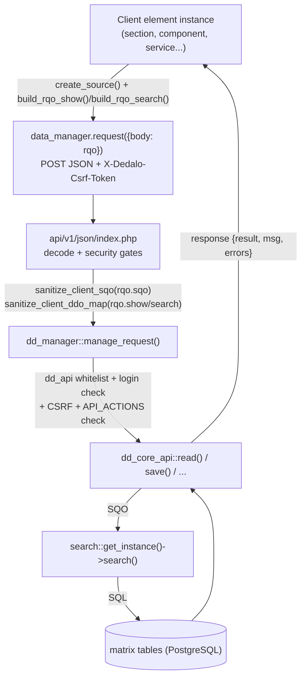

# Request Query Object (RQO)

> Class: `./core/common/class.request_query_object.php`
> API entry: `./core/api/v1/json/index.php` → `dd_manager::manage_request()`

## Overview

The Request Query Object (RQO) is the single, normalized message format used by every client→server call to the Dédalo work API. One RQO answers four questions:

| Question | RQO property |
|----------|--------------|
| **Who** is calling? | `source` (the element instance: tipo, section_tipo, section_id, mode, lang...) |
| **What** should be done? | `dd_api` (API class) + `action` (API method) + `source->action` (per-element modifier) |
| **Over which records?** | `sqo` (Search Query Object: filter, limit, offset, order) |
| **What should come back / be displayed?** | `show` / `search` / `choose` / `hide` (ddo_map layouts) |

Everything else (`data`, `options`, `prevent_lock`, `pretty_print`, `id`) is payload and transport tuning.

In one sentence:

- **Why** — one wire format for *every* component type and every operation, so the client transport, the security gate, and the dispatcher are written once instead of per-component.
- **What** — a plain JSON object (`stdClass` server-side, `class.request_query_object.php` describes it). It carries a caller identity (`source`), an action (`dd_api`+`action`), an optional query (`sqo`) and optional layout maps (`show`/`search`/`choose`/`hide`).
- **How** — the client builds it from the `request_config` the server injected into the element context, POSTs it to `api/v1/json/index.php`, the gate sanitizes the untrusted parts and `dd_manager::manage_request()` dispatches it to one `dd_*_api` method, which returns the standard envelope.

For the server-side config the client builds this from, see [request_config.md](request_config.md); for copy-paste ontology JSON and end-to-end RQO flows, see the cookbook [request_config_examples.md](request_config_examples.md). The [SQO](sqo.md) carried inside the RQO and the [DDO](dd_object.md) field set are documented separately.

## Why RQO exists

- **Before v6** every component type had its own `trigger` endpoint with its own interface. A `component_autocomplete` spoke a different dialect than `component_autocomplete_hi` or `component_portal`; any shared behavior had to be re-implemented per trigger.
- **v5 introduced the SQO** — an SQL abstraction that unified *queries* (its `filter` maps to `WHERE`, its `select` to `SELECT`), designed around Dédalo relations and data paths.
- **v6 unified the API** and first tried to use the SQO as the whole call format. It was quickly insufficient: a call also has to say *who* is calling, *what action* to perform, and *how to lay out* the result — none of which `SQO->select` was designed for.

The RQO wraps the SQO and adds the caller identity, the action dispatch and the layout maps. **SQO = the query; RQO = the request.**

## The contract at a glance

A section list view requesting its first page of records:

```json
{
	"id"     : "section_oh1_list",
	"action" : "read",
	"dd_api" : "dd_core_api",
	"prevent_lock" : true,
	"source" : {
		"typo"         : "source",
		"type"         : "section",
		"action"       : "search",
		"model"        : "section",
		"tipo"         : "oh1",
		"section_tipo" : "oh1",
		"section_id"   : null,
		"mode"         : "list",
		"lang"         : "lg-eng"
	},
	"sqo" : {
		"section_tipo" : ["oh1"],
		"filter"       : null,
		"limit"        : 10,
		"offset"       : 0,
		"order"        : [{"direction":"ASC","path":[{"component_tipo":"section_id"}]}]
	}
}
```

And the standard response envelope:

```json
{
	"result" : { "...action specific..." : "context/data, records, count, etc." },
	"msg"    : "OK. Request done successfully",
	"errors" : [],
	"debug"  : { "real_execution_time": "123 ms" }
}
```

- `result` — the action's payload (`false` on failure). Shape depends on the action: `read` returns `{context, data}`, `count` returns a number, etc.
- `msg` — human-readable outcome string.
- `errors` — array of issue strings; empty on success. Server exceptions reach the client through this channel.
- `debug` / `dedalo_last_error` — added under `SHOW_DEBUG` / when server errors were logged.

!!! note "One RQO per HTTP call"
	In Dédalo 7 the API endpoint decodes **a single RQO object** per request (`core/api/v1/json/index.php` → `dd_manager::manage_request($rqo)`). Batching several operations is done with several `fetch` calls (the client `data_manager` runs them concurrently), not by sending an array of RQOs.

## Request lifecycle


```mermaid
graph TD
	A["Client element instance<br/>(section, component, service...)"] -- "create_source() + build_rqo_show()/build_rqo_search()" --> B["data_manager.request({body: rqo})<br/>POST JSON + X-Dedalo-Csrf-Token"]
	B --> C["api/v1/json/index.php<br/>decode + security gates"]
	C -- "sanitize_client_sqo(rqo.sqo)<br/>sanitize_client_ddo_map(rqo.show/search)" --> D["dd_manager::manage_request()"]
	D -- "dd_api whitelist + login check<br/>+ CSRF + API_ACTIONS check" --> E["dd_core_api::read() / save() / ..."]
	E -- SQO --> F["search::get_instance()->search()"]
	F -- SQL --> G[("matrix tables (PostgreSQL)")]
	G --> E
	E -- "response {result, msg, errors}" --> A
```

Step by step:

1. **Build** — the element instance builds its RQO, normally from its `request_config` (injected in its context by the server; see [request_config.md](request_config.md)). The instance picks the active config object (`api_engine === 'dedalo' && type === 'main'`), deep-clones it (never mutating the cache), and fills the live state. Helpers: `create_source()`, `common.build_rqo_show()`, `common.build_rqo_search()` in `core/common/js/common.js`.
2. **Send** — `data_manager.request({body: rqo})` POSTs it as JSON (`Content-Type: application/json`, `credentials: same-origin`) with the `X-Dedalo-Csrf-Token` header, exponential-backoff retry/timeout handling and optional local-DB caching (`cache_handler:{handler:'localdb', id}`). On a `csrf_failed` rejection it refreshes the cached token and retries exactly once.
3. **Gate** (`index.php`) — runs in order: CORS check (`Access-Control-Allow-Origin` echoed only for an allowed origin), OPTIONS preflight short-circuit, `json_decode` of `php://input` with a JSON-error guard, `$_FILES`/legacy `$_REQUEST` XSS scrub (which **deliberately preserves** `rqo.sqo` and `rqo.options.sqo` so search operators survive), default `dd_api` assignment (`diffuse`/`validate`/`get_ontology_map` force `dd_diffusion_api`; otherwise `dd_core_api`), then the sanitizers: `search_query_object::sanitize_client_sqo()` strips server-only SQO fields (forces `parsed=false`, clamps `limit` to `DEDALO_SEARCH_CLIENT_MAX_LIMIT`), and `request_config_object::sanitize_client_ddo_map()` reduces the client `show.ddo_map` and `search.ddo_map` to whitelisted display fields. Finally the per-session CSRF token is minted, and `session_write_close()` runs if `prevent_lock === true`.
4. **Dispatch** — `dd_manager::manage_request()` runs its gates in order: (1) reject if there is no `action`; (2) `dd_api` whitelist check; (3) login gate (a small allowlist works without a session — see the security table); (4) CSRF gate for every action not in `CSRF_EXEMPT_ACTIONS` (constant-time `hash_equals`); (5) method validity (public **and** static, and — if the class declares an `API_ACTIONS` constant — present in it); (6) for `dd_area_maintenance_api`, maintenance-area permission ≥ 2; (7) the dispatch itself, wrapped in a `try/catch` that maps inner `permission_exception`s to a uniform `permissions_denied`.
5. **Execute** — the API class method runs the action. For data actions it instantiates the section/component identified by `source`, applies the `sqo`, resolves `show`/`search`/`choose`/`hide` ddo_maps into context+data.
6. **Respond** — the standard envelope goes back as JSON; every `dd_manager` response gets a fresh `csrf_token` appended. Top-level exceptions are captured into `errors` with a generic message (full traces stay server-side, surfaced only under `SHOW_DEBUG`).

## Properties

All properties live in `request_query_object` (`$direct_keys`): `id`, `api_engine`, `dd_api`, `action`, `source`, `sqo`, `show`, `search`, `choose`, `data`, `prevent_lock`, `options`, `pretty_print`.

**Documented as mandatory:** `dd_api`, `action`, `source` — **documented as optional:** everything else. If only a `source` is sent, the server derives the SQO and layout from the user preset or the ontology `request_config` (see *RQO and request_config* below).

!!! note "What is actually enforced"
	The "mandatory" labels are a documentation convention; the class enforces nothing. In practice the HTTP path never constructs a `request_query_object` — `index.php` operates on the raw `stdClass` from `json_decode`. The real, code-level requirements are: the dispatcher rejects a request with no `action`; `dd_api` is *defaulted* to `dd_core_api` when absent; and `read` separately requires a non-empty `source->section_tipo`. `api_engine` is always forced to `'dedalo'` on construction unless overridden. (Note also that the class declares setters only for `dd_api`, `action`, `source`, `sqo`, `show`, `search`, `choose`, `options` — there is no setter for `id`/`api_engine`/`data`/`prevent_lock`/`pretty_print`, so hydrating a full payload *through the constructor* would fatal. This never happens on the HTTP path.)

### id : `string` *Optional*

Client-side identifier of the request, echoed for correlation/debugging. Conventionally built from the caller context (e.g. `section_oh1_list`).

### api_engine : `string` *Optional, default `'dedalo'`*

Backend engine for data retrieval: `dedalo` (internal) or an external engine name such as `zenon`. External engines resolve their connection details from the target section's `api_config` properties.

### dd_api : `string` *Mandatory, default `'dd_core_api'`*

The API class that will handle the call. Only whitelisted classes are accepted (`dd_manager::manage_request`):

| Class | Purpose |
|-------|---------|
| `dd_core_api` | Core data lifecycle: read/save/create/delete/count, element contexts |
| `dd_tools_api` | Tool execution (export, import, time machine, diffusion launchers...) |
| `dd_ts_api` | Thesaurus tree operations (expand, move, indexation...) |
| `dd_utils_api` | Utilities: login context, uploads, locks, environment |
| `dd_ontology_api` | Ontology browsing/editing |
| `dd_diffusion_api` | Publishing (diffuse, validate, get_ontology_map) — auto-selected for those actions |
| `dd_area_maintenance_api` | Admin maintenance widgets |
| `dd_agent_api`, `dd_mcp_api` | Agent / MCP integrations |
| `dd_component_portal_api`, `dd_component_text_area_api`, `dd_component_av_api`, `dd_component_3d_api`, `dd_component_info` | Component-specific endpoints (pagination, transcription, media...) |

The whitelist is the exact `in_array(..., true)` set checked in `dd_manager::manage_request`; the default when `dd_api` is unset is `dd_core_api`.

The `API_ACTIONS` mechanism is **opt-in per class** (SEC-024): dispatch first requires the target method be **public AND static** (verified by reflection); *then*, only if the class declares an `API_ACTIONS` constant, the action must additionally be present in it. A class with no `API_ACTIONS` constant falls back to "any public static method is callable". This is the action-level security chokepoint — for classes that declare the constant, new API methods are unreachable until explicitly listed.

### action : `string` *Mandatory*

The API class method to execute. The complete, authoritative `dd_core_api::API_ACTIONS` list (every callable core action):

| Action | Purpose | `result` shape |
|--------|---------|----------------|
| `start` | First-load bootstrap. Resolves the URL element (section / section_tool / area_* / tool_* / component_*) to its structure context plus environment. Handles recovery mode, install-not-ready and not-logged (login context). | `{context: array, data: []}`; always also `response.environment` |
| `read` | Fetch context+data for a source element. Sub-dispatches on `source->action` (see below). Always calls `log_activity`. | `{context: array, data: array}` |
| `read_raw` | Unrendered JSONB straight from the matrix table, by `options->type` (`section` / `component` / `target_section`). Used by `tool_export`. | `result: array` of raw rows; plus `response.table` |
| `create` | Insert an empty record into a section's matrix table (counter service). Requires write (≥ 2). | `result: string` new `section_id`, or `false` |
| `duplicate` | Deep-copy a record. Two gates: section write (≥ 2) **and** `security::assert_record_in_user_scope()`. | `result: string` new `section_id`, or `false` |
| `delete` | Remove records via `sections::delete()`. Target = `sqo` (preferred, multi-record) or `source->section_id`. Section model only, write (≥ 2). | forwarded from `sections::delete()` |
| `save` | Persist component changes. Only `source->type:'component'` is implemented. | `result: {context, data}` (refreshed element) or `false` |
| `count` | `COUNT(*)` for the SQO. Forces `full_count=true`, merges the session filter, returns `0` on permission denial (no leak). | `result: {total: int}` (or `0`) |
| `get_element_context` | Structure context for one element, **no data**. `simple:true` → lightweight context. | `result: object` (context) |
| `get_section_elements_context` | Component contexts for one/more sections (filter panel, export columns). | `result: array` of component contexts |
| `get_indexation_grid` | Thesaurus indexation grid for a component in a record. Read perm asserted. | `result: object` (grid) |
| `get_environment` | Bootstrap payload (`page_globals`, `plain_vars`, labels). No-arg; also called inside `start`. | `result: {page_globals, plain_vars, get_label}` |
| `get_matrix_ontology_locator` | Maps a `source->tipo` to its target `{section_tipo, section_id}` via TLD. | `result: {section_tipo, section_id}` |
| `get_section_terms` | Batch-resolves authoritative section_map term labels for ≤ 1000 locators (graph node labels). Silent skip on unreadable. | `result: object` keyed `"{section_tipo}_{section_id}" => term` |
| `test` | No-arg diagnostic stub. | trivial |

Other `dd_*_api` classes declare their own `API_ACTIONS` (e.g. `dd_tools_api` exposes `user_tools` and `tool_request`; `dd_diffusion_api` exposes `diffuse`/`validate`/`get_ontology_map`).

### source : `object` *Mandatory*

Identity of the calling element — built client-side by `create_source()` (`core/common/js/common.js`):

| Field | Type | Notes |
|-------|------|-------|
| `typo` | `string` | Always `'source'` |
| `type` | `string` | Element type: `component`, `section`, `area`, ... (drives e.g. `save` dispatch) |
| `action` | `string` | **Modifier of the main action** for this element. E.g. `read` + `source->action: 'get_value'` returns the plain component value instead of context+data |
| `model` | `string` | Element model (`section`, `component_portal`, ...). Recalculated server-side from `tipo` when omitted |
| `tipo` | `string` | Ontology tipo of the element |
| `section_tipo` | `string` | Target section tipo (mandatory in `read`) |
| `section_id` | `string\|int\|null` | Record id; `null` for lists/new records |
| `mode` | `string` | `edit` \| `list` \| `search` \| `tm` \| ... |
| `lang` | `string` | Data language (`lg-eng`, `lg-nolan`, ...) |
| `view` | `string` | View variant (`default`, `line`, `mosaic`, ...) |
| `matrix_id`, `data_source` | optional | Time machine: address a specific matrix row / `'tm'` data source |
| `is_temporal` | `bool` optional | Temporal instances (e.g. `tool_propagate_component_data`) |
| `caller_dataframe` | `object` optional | Dataframe pairing info (see component_dataframe docs) |
| `value` | `array` optional | Values to resolve (portal in search mode) |

Component instances can extend the source via `self.source_add`, an object that `create_source()` spreads onto the source so a model can inject extra read-API keys without touching the builder. (The `component_relation_model` `ar_target_section_tipo` case is the documented example, though no shipping caller currently populates `source_add` — the consumer is live, the producer is currently dormant.)

#### `source->action` modifiers

The **top-level `action` selects the API method** (`$dd_api::{$rqo->action}($rqo)`). `source->action` is a **secondary dispatch** consumed *inside* the method. Same top-level `read`, different per-element behavior:

| `source->action` | Inside `read` routes to | Behavior |
|------------------|-------------------------|----------|
| `get_value` | `get_component_value()` | Plain rendered component value — no context, no data (components only) |
| `search` *(default)* | `build_json_rows()` → `search` | `sections` instance + SQO; section list/edit and `service_autocomplete`. Persists the SQO to the session for section edit/list/list_thesaurus |
| `related_search` | `build_json_rows()` → `related_search` | Inverse relations (sections pointing **to** the source) |
| `get_data` | `build_json_rows()` → `get_data` | Data-only for a single component/area; honors `matrix_id` / `data_source:'tm'` (time machine), pagination, `ar_target_section_tipo` |
| `resolve_data` | `build_json_rows()` → `resolve_data` | Injects a `source->value` locator array into a component and resolves it (portals in search mode) |
| `get_relation_list` | `build_json_rows()` → `get_relation_list` | Legacy relation_list path |

`save` ignores `source->action` and instead switches on **`source->type`**. Only `type:'component'` is implemented (it builds a `component_common` instance, checks `get_component_permissions() ≥ 2`, applies `data->changed_data` and saves). Any other type logs an error and returns `result:false` — there is **no** `section` save case despite older docs implying one. Within a component save, the per-item operation comes from each `changed_data[].action`: `insert`, `update`, `remove`, `set_data`, `sort_data`, `sort_by_column`, `add_new_element` (the inserting actions also recompute the pagination offset so the new item is revealed). In `search` mode the whole value replaces the datum.

### sqo : `object` *Optional*

The Search Query Object — filter (`WHERE`-equivalent), `section_tipo` targets, `limit`, `offset`, `order`, `full_count`. Full definition in [sqo.md](sqo.md) / `class.search_query_object.php`.

Security: the HTTP API is the only untrusted SQO source. `sanitize_client_sqo()` strips server-only fields (`sentence`, `params`, SQL column aliases...), forces `parsed=false` and clamps `limit` before the SQO reaches the search pipeline.

### show : `object` *Optional*

What to display and how — the layout of section lists and portal columns.

- **ddo_map** : `array` — chains of ddo objects (`{tipo, section_tipo, parent, mode, ...}`) linked by `parent` to form resolution paths. The server resolves each chain into context and data.
- **get_ddo_map** : `object` *Optional* — compute the ddo_map dynamically from the ontology instead of listing it: `{model: 'section_map', columns: [...]}`. Lets different sections share common search/columns (mint, type, etc.).
- **fields_separator** / **records_separator** : `string` — used when values are flattened to strings (e.g. `" | "`, `"<br>"`).
- **sqo_config** : `object` — display-specific SQO tuning (`operator`, `limit`, `offset`, `full_count`).
- **interface** : `object` — UI element switches. <a id="show-interface"></a>This table is the **canonical home** for the `show.interface` controls; other docs link here rather than copying it.

| Key | Default | Controls |
|-----|---------|----------|
| `read_only` | `false` | Edit ability of the component |
| `save_animation` | `true` | Green save feedback line |
| `value_buttons` | `true` | Per-value buttons (edit, remove...) |
| `button_add` | `true` | Add-new-record button |
| `button_delete` | `true` | Delete button on portal rows |
| `button_delete_link` | `true` | "Unlink" option in the delete modal |
| `button_delete_link_and_record` | `true` | "Unlink and delete" option in the delete modal |
| `button_link` | `true` | Link-existing-record button |
| `button_edit` | `false` | Edit button in portals/sections |
| `button_edit_options` | — | `{action_mousedown: 'navigate'\|'open_window', action_contextmenu: 'navigate'\|'open_window'}` |
| `button_list` | `true` | Go-to-target-section button (e.g. component_radio_button) |
| `tools` | `true` | Component tools entry |
| `button_external` | `false` | Refresh button for external portal data |
| `button_fullscreen` | `true` | Fullscreen toggle |
| `button_save` | `true` | Save button |
| `button_tree` | `false` | Tree button |
| `show_autocomplete` | `true` | Record search autocomplete |
| `show_section_id` | `true` | section_id shown in edit buttons |

### search : `object` *Optional*

Fields available to the search process (used by `service_autocomplete` and the search panel). Same sub-shape as `show` (`ddo_map`, `get_ddo_map`, `sqo_config`, separators). Fallback chain: when `search` is defined it replaces `show` for searching; when `choose` is absent, `search` also drives the result list.

### choose : `object` *Optional*

Fields shown when picking a result in `service_autocomplete`. Same sub-shape. When defined, its `ddo_map` overrides `search`/`show` for the picker list. The server resolves `choose.sqo_config.limit` with the fallback chain *choose → search/show sqo_config → 25*.

### hide : `object` *Optional*

`ddo_map` of elements whose context and data must be **resolved but not rendered** — internal values the caller component needs (e.g. `Location` [actv19](https://dedalo.dev/ontology/actv19)).

### data : `object` *Optional*

Request payload for write actions. For `save`, carries `changed_data` (the modified values); also used as pre-calculated container (datalist, pagination) to avoid recomputation.

### options : `object` *Optional*

Heterogeneous extra parameters for components and tools — e.g. upload descriptors:

```json
{
	"options": {
		"file_data": { "name": "test26_test3_1.jpg", "tmp_dir": "DEDALO_UPLOAD_TMP_DIR", "key_dir": "3d", "tmp_name": "tmp_test26_test3_1.jpg" },
		"target_dir": "posterframe"
	}
}
```

When files are POSTed without a JSON body (e.g. CKEditor image upload), `index.php` synthesizes an RQO with `action:'upload'`, `dd_api:'dd_utils_api'`, `options:{}`. It then merges `array_merge($_POST, $_GET)` into `options` (each value `safe_xss`-sanitized) and attaches each `$_FILES` entry verbatim (binary, not text). The CSRF fallback for this multipart path reads `options.csrf_token`.

### prevent_lock : `bool` *Optional*

Closes the PHP session (`session_write_close()`) before the work runs, so this request does not serialize behind — or block — other requests of the same session. Use for read-only/long calls (`count` does it by default). Never combine with actions that must write session state.

### pretty_print : `bool` *Optional*

Pretty-printed JSON response (debugging).

## Use cases and examples

### Read one record in edit mode

```json
{
	"action" : "read",
	"dd_api" : "dd_core_api",
	"source" : { "typo":"source", "type":"section", "action":"search", "model":"section",
		"tipo":"oh1", "section_tipo":"oh1", "section_id":3, "mode":"edit", "lang":"lg-eng" },
	"sqo"    : { "section_tipo":["oh1"], "limit":1, "offset":0,
		"filter_by_locators":[{"section_tipo":"oh1","section_id":3}] }
}
```

### Save a component value

```json
{
	"action" : "save",
	"dd_api" : "dd_core_api",
	"source" : { "typo":"source", "type":"component", "action":null, "model":"component_input_text",
		"tipo":"oh16", "section_tipo":"oh1", "section_id":"124", "mode":"edit", "lang":"lg-eng" },
	"data"   : { "changed_data": [ {"action":"update","key":0,"value":"Interview about..."} ] }
}
```

`save` dispatches on `source->type` (only `component` is implemented), instantiates the element and applies `data->changed_data`. `oh16` here is a `component_input_text`. The per-value operation is `changed_data[].action` (`update` shown; also `insert`, `remove`, `set_data`, `sort_data`, `sort_by_column`, `add_new_element`).

### Autocomplete search (service_autocomplete)

```json
{
	"action" : "read",
	"dd_api" : "dd_core_api",
	"source" : { "typo":"source", "type":"component", "action":"search", "model":"component_portal",
		"tipo":"rsc17", "section_tipo":"oh1", "section_id":3, "mode":"edit", "lang":"lg-eng" },
	"sqo"    : { "section_tipo":["rsc197"], "filter":{"$or":[{ "q":"smith", "path":[{ "section_tipo":"rsc197","component_tipo":"rsc85" }] }]},
		"limit":25, "offset":0 },
	"search" : { "ddo_map":[ {"tipo":"rsc85","section_tipo":"rsc197","parent":"rsc197","mode":"list"} ] },
	"choose" : { "ddo_map":[ {"tipo":"rsc85","section_tipo":"rsc197","parent":"rsc197","mode":"list"} ], "fields_separator":" | " }
}
```

Note the dispatch split: the top-level `action` is `read` (it must be in `dd_core_api::API_ACTIONS`); the *search* behavior comes from `source->action: 'search'`. Built client-side by `build_rqo_search()` from the component's `request_config` (operator default `$or`, choose limit fallback 25).

### Count without blocking the session

```json
{
	"action" : "count",
	"dd_api" : "dd_core_api",
	"prevent_lock" : true,
	"source" : { "typo":"source", "type":"section", "model":"section", "tipo":"oh1", "section_tipo":"oh1", "mode":"list" },
	"sqo"    : { "section_tipo":["oh1"], "filter": null }
}
```

### Component value only (source->action modifier)

```json
{
	"action" : "read",
	"dd_api" : "dd_core_api",
	"source" : { "typo":"source", "type":"component", "action":"get_value", "model":"component_select",
		"tipo":"oh37", "section_tipo":"oh1", "section_id":3, "mode":"list", "lang":"lg-eng" }
}
```

Same top-level `action` (`read`), different per-element behavior: `source->action:'get_value'` short-circuits to the plain value.

### Tool execution

```json
{
	"action" : "tool_request",
	"dd_api" : "dd_tools_api",
	"prevent_lock" : true,
	"source" : { "typo":"source", "type":"tool", "action":"get_export_grid", "model":"tool_export",
		"tipo":"oh1", "section_tipo":"oh1", "mode":"list" },
	"options": { "section_tipo":"oh1", "data_format":"csv", "breakdown":"default", "ar_ddo_to_export":[ "..." ] }
}
```

The generic `tool_request` action routes to `{source->model}::{source->action}(options)` — here `tool_export::get_export_grid()`. Tool methods are additionally gated by each tool's `API_ACTIONS` registration (see tools docs).

### Create a new record

```json
{
	"action" : "create",
	"dd_api" : "dd_core_api",
	"source" : { "typo":"source", "type":"section", "model":"section", "tipo":"oh1", "section_tipo":"oh1", "mode":"list" }
}
```

Inserts an empty row and returns the new id: `{"result":"128", ...}`. Requires section write (≥ 2). The canonical "new record" flow is then a `read` in edit mode filtered by that id:

```json
{
	"action" : "read",
	"dd_api" : "dd_core_api",
	"source" : { "typo":"source", "type":"section", "action":"search", "model":"section",
		"tipo":"oh1", "section_tipo":"oh1", "section_id":128, "mode":"edit", "lang":"lg-eng" },
	"sqo"    : { "section_tipo":["oh1"], "limit":1, "offset":0,
		"filter_by_locators":[{"section_tipo":"oh1","section_id":128}] }
}
```

### Duplicate a record

```json
{
	"action" : "duplicate",
	"dd_api" : "dd_core_api",
	"source" : { "typo":"source", "type":"section", "model":"section", "tipo":"oh1", "section_tipo":"oh1", "section_id":2, "mode":"list" }
}
```

Deep-copies record `2` and returns the new `section_id`. Two gates apply: section write (≥ 2) **and** `assert_record_in_user_scope()` (a write user outside the source record's project scope cannot clone it).

### Delete records (mode and flags)

```json
{
	"action" : "delete",
	"dd_api" : "dd_core_api",
	"source" : { "typo":"source", "action":"delete", "model":"section", "tipo":"oh1",
		"section_tipo":"oh1", "section_id":null, "mode":"list", "lang":"lg-eng",
		"delete_mode":"delete_record" },
	"options": { "delete_diffusion_records":true, "delete_with_children":false },
	"sqo"    : { "section_tipo":["oh1"], "filter_by_locators":[{"section_tipo":"oh1","section_id":"127"}], "limit":1 }
}
```

Target rows come from `sqo` (preferred, multi-record) or `source->section_id`. Note the placement: `delete_mode` (`delete_data` keeps the row skeleton / `delete_record` removes the whole row) lives on **`source`**, while `delete_diffusion_records` and `delete_with_children` live on **`options`**. Section model only, write (≥ 2).

### Element context without data (lazy load)

```json
{
	"action" : "get_element_context",
	"dd_api" : "dd_core_api",
	"source" : { "typo":"source", "type":"component", "model":"component_input_text",
		"tipo":"oh16", "section_tipo":"oh1", "section_id":3, "mode":"edit", "lang":"lg-eng" },
	"simple" : true
}
```

Returns only the structure context (no data) for one element — used to lazily fetch a component's context after a list renders. `simple:true` selects the lightweight context builder. Pairs with `get_section_elements_context` for the search panel's field list.

### Time-machine read (data_source: tm)

```json
{
	"action" : "read",
	"dd_api" : "dd_core_api",
	"prevent_lock" : true,
	"source" : { "typo":"source", "type":"component", "action":"get_data", "model":"component_input_text",
		"tipo":"oh16", "section_tipo":"oh1", "section_id":3, "mode":"tm", "lang":"lg-eng",
		"data_source":"tm", "matrix_id":"45012" }
}
```

`source->action:'get_data'` + `data_source:'tm'` addresses a specific historical matrix row (`matrix_id`) through the time-machine service (section `dd15`, `DEDALO_TIME_MACHINE_SECTION_TIPO`). Service models are exempt from the normal section permission gate.

### Paginated next page (session SQO continuity)

```json
{
	"action" : "read",
	"dd_api" : "dd_core_api",
	"prevent_lock" : true,
	"source" : { "typo":"source", "type":"section", "action":"search", "model":"section",
		"tipo":"oh1", "section_tipo":"oh1", "mode":"list", "lang":"lg-eng" },
	"sqo"    : { "section_tipo":["oh1"], "limit":10, "offset":10,
		"order":[{"direction":"ASC","path":[{"component_tipo":"section_id"}]}] }
}
```

Advancing `offset` requests the second page. The active filter is preserved across calls by the session SQO (`section::get_session_sqo`) — the client only needs to send the new window.

### Multi-clause search-panel filter

```json
{
	"action" : "read",
	"dd_api" : "dd_core_api",
	"source" : { "typo":"source", "type":"section", "action":"search", "model":"section",
		"tipo":"oh1", "section_tipo":"oh1", "mode":"list", "lang":"lg-eng" },
	"sqo"    : { "section_tipo":["oh1"], "limit":10, "offset":0,
		"filter":{ "$and":[
			{ "q":"interview", "path":[{"section_tipo":"oh1","component_tipo":"oh16"}] },
			{ "$or":[
				{ "q":"1975", "path":[{"section_tipo":"oh1","component_tipo":"oh25"}] },
				{ "q":"1976", "path":[{"section_tipo":"oh1","component_tipo":"oh25"}] }
			] }
		] } }
}
```

A search-panel filter with several clauses across component paths combined with `$and`/`$or`. The `filter` grammar is the SQO's — see [sqo.md](sqo.md#filter).

### Raw matrix rows for export (read_raw)

```json
{
	"action" : "read_raw",
	"dd_api" : "dd_core_api",
	"prevent_lock" : true,
	"source" : { "typo":"source", "type":"section", "model":"section", "tipo":"oh1", "section_tipo":"oh1", "mode":"list" },
	"options": { "type":"section" }
}
```

Returns unrendered JSONB straight from the matrix table — `options->type` selects `section` (full rows), `component` (one component's datum per row) or `target_section` (relation locators matching `options->tipo`). Used by `tool_export`.

### Batch term labels for a graph (get_section_terms)

```json
{
	"action" : "get_section_terms",
	"dd_api" : "dd_core_api",
	"prevent_lock" : true,
	"source" : { "typo":"source", "type":"section", "model":"section", "tipo":"oh1", "section_tipo":"oh1", "mode":"list" },
	"locators": [
		{"section_tipo":"oh1","section_id":3},
		{"section_tipo":"rsc197","section_id":12}
	]
}
```

Resolves authoritative section_map term labels for up to 1000 locators in one call (graph node labels); the result is keyed `"{section_tipo}_{section_id}" => term`. Unreadable/invalid locators are skipped silently.

## Response shapes by action

The envelope is always `{result, msg, errors, action, csrf_token}`; only the **shape of `result`** varies. Quick reference (full detail in the action table above):

| Action | `result` on success |
|--------|---------------------|
| `read` (`search`/`get_data`/...) | `{context: [...], data: [...]}` |
| `read` (`get_value`) | the plain rendered component value |
| `read_raw` | `array` of raw JSONB rows (+ `response.table`) |
| `count` | `{total: <int>}` (or `0` on permission denial) |
| `create` / `duplicate` | `<new section_id>` (string) or `false` |
| `delete` | object forwarded from `sections::delete()` |
| `save` | `{context, data}` of the refreshed element, or `false` |
| `get_element_context` | a single context `object` |
| `get_section_elements_context` | `array` of component contexts |
| `get_environment` | `{page_globals, plain_vars, get_label}` |
| `get_matrix_ontology_locator` | `{section_tipo, section_id}` |
| `get_section_terms` | `{ "<tipo>_<id>": "<term>", ... }` |

On failure `result` is `false` and `errors[]` carries a code (`Undefined method`, `invalid_api_class`, `not_logged`, `csrf_failed`, `permissions error`, `permissions_denied`). A failed `read` also clears the stale session SQO key.

## RQO and request_config

The RQO and the [request_config](request_config.md) are the two halves of the same contract:

- **request_config = configuration** (server → client). Defined in ontology `properties->source->request_config` (or user layout presets), resolved per element and injected into the element's context. It declares *what an element can request*: target sections, ddo_maps for show/search/choose/hide, sqo defaults, interface switches.
- **RQO = request** (client → server). The client builds it *from* the request_config: `build_rqo_show()`/`build_rqo_search()` copy the sqo/sqo_config/ddo_maps into a concrete call, adding the live state (current filter, page, query string).

Because the ontology cannot know installation-specific values, the request_config uses placeholders that are resolved server-side before reaching the client — `section_tipo: "self"`, `parent: "self"`, dynamic `sqo.section_tipo` sources (`section`, `hierarchy_types`, `ontology_sections`, `field_value`, `self`). By the time the client builds an RQO, those are concrete tipos. The full `section_tipo` source vocabulary and the self-resolution contract are defined in [request_config.md](request_config.md).

The reverse path also exists: when a client sends `rqo->show` (e.g. time machine, `tool_qr`, graph view, search presets — `section` instantiated with `add_show:true`), the server rebuilds the element's request_config **from the RQO** (`common::build_request_config_from_rqo`). Client-sent ddos pass the same validation as ontology configs: whitelist scrub at the API gate (`sanitize_client_ddo_map`) plus tipo/TLD/permission checks (`validate_requested_ddo`); rejected ddos are dropped and reported through the `config_warnings` channel under `SHOW_DEBUG`.

## Security model summary

The gate runs the checks **in this order** (`index.php` then `dd_manager::manage_request`):

| Order | Gate | Where | Protects |
|-------|------|-------|----------|
| 1 | CORS origin check | `index.php` | `Access-Control-Allow-Origin` echoed only for an origin in `DEDALO_CORS['allowed_origins']` (SEC-012) |
| 2 | XSS scrub | `index.php` legacy `$_REQUEST`/`$_FILES` branches | Form/query-parameter payloads (preserves `sqo`/`options.sqo` so search operators survive — SEARCH-05) |
| 3 | `sanitize_client_sqo` | `index.php` | Server-only SQO fields, unbounded limits, pre-parsed SQL (forces `parsed=false`, clamps `limit`) |
| 4 | `sanitize_client_ddo_map` | `index.php` | Injected ddo fields beyond the display whitelist — on `show.ddo_map` and `search.ddo_map` |
| 5 | `action` present | `dd_manager` | Reject a request with no action |
| 6 | dd_api whitelist | `dd_manager` | Only known API classes are instantiable (strict `in_array`) |
| 7 | Login + no-login allowlist | `dd_manager` | Session required except the no-login actions (below) |
| 8 | CSRF token | `X-Dedalo-Csrf-Token` header ↔ session token | Cross-site request forgery — constant-time `hash_equals`, except `CSRF_EXEMPT_ACTIONS` (below) |
| 9 | `API_ACTIONS` per class | each `dd_*_api` | Method must be public + static, and (if the class declares it) in `API_ACTIONS` |
| 10 | Maintenance permission | `dd_manager` | `dd_area_maintenance_api` requires maintenance-area perm ≥ 2 |
| 11 | `validate_requested_ddo` | `common` (rqo-derived config) | Invalid tipos, inactive TLDs, unauthorized elements |
| 12 | Permission checks | per action (`read`, `count`, `save`...) | Section/element access levels; inner `permission_exception` → uniform `permissions_denied` |

!!! warning "The two allowlists are NOT identical"
	**No-login actions** (work without a session): `start`, `change_lang`, `login`, `get_login_context`, `install`, `get_install_context`, `get_environment`, `get_ontology_update_info`, `get_code_update_info`, `get_server_ready_status`.

	**CSRF-exempt actions** (skip the token check): `start`, `get_environment`, `get_login_context`, `get_install_context`, `get_server_ready_status`, `get_ontology_update_info`, `get_code_update_info`, `get_diffusion_info`, `get_dedalo_files`, `read_raw`.

	The lists diverge: e.g. `change_lang`/`login`/`install` are no-login **but still require CSRF**; `read_raw`/`get_dedalo_files`/`get_diffusion_info` are CSRF-exempt **but still require login**.

!!! note "Known gaps to be aware of"
	`sanitize_client_ddo_map` scrubs `show.ddo_map` and `search.ddo_map` but **not** `choose.ddo_map`. `sanitize_client_sqo` only clamps when the SQO is an object (a non-object value passes untouched). These are documented here so callers don't over-assume coverage.

## Best practices

1. **Build RQOs from the request_config** the server injected — don't hand-craft sqo/ddo_maps in client code when the config already defines them (`build_rqo_show`/`build_rqo_search`).
2. **Always send `source` complete** (`tipo`, `section_tipo`, `mode`, `lang`): the server resolves defaults from it and `read` rejects an empty `section_tipo`.
3. **Use `prevent_lock: true`** for read-only calls that may run long (counts, exports preflight) so they don't serialize the user's session.
4. **Let the server own limits**: send `limit: null` to get the mode/model default; client limits are clamped server-side anyway.
5. **Use `source->action` modifiers** instead of new top-level actions when the behavior is a variant of read/save for one element type.
6. **New API methods must be added to `API_ACTIONS`** of their class — they are unreachable otherwise (by design).
7. **Never put credentials or server-only state in an RQO**: the object is logged in debug environments and echoed in error contexts.

## Troubleshooting

- **`Invalid action var (not found in rqo)`** — the body has no `action`; check JSON serialization of the fetch body.
- **`Error. Invalid API class`** — `dd_api` not in the whitelist (typo, or class not registered in `dd_manager`).
- **Action rejected / `Undefined method`** — the action is missing from the class's `API_ACTIONS`.
- **`Empty source 'section_tipo'`** — `read` requires it; verify `create_source()` received a fully initialized instance.
- **Empty result with no error** — likely dropped ddos (invalid tipo, inactive TLD, no permissions). Under `SHOW_DEBUG`, inspect `config_warnings` in the element context; production counts drops in `metrics`.
- **Stale list after editing** — check the session SQO (`section::get_session_sqo`) and the client local-DB cache (`cache_handler`); the navigation SQO is preserved across calls by design.
- **CSRF errors on first call** — the token is minted on `start`; ensure the bootstrap call ran and `page_globals.csrf_token` is populated. The client retries a `csrf_failed` rejection once automatically.
- **`not_logged` on an action you expected to be public** — the no-login and CSRF-exempt allowlists are *separate* (see the security table). An action can be CSRF-exempt yet still require a session (e.g. `read_raw`).
- **`save` silently did nothing** — only `source->type:'component'` is implemented; any other type returns `result:false`. Check `source->type` and that each `changed_data[].action` is a recognized operation.
- **Picker columns not scrubbed** — `sanitize_client_ddo_map` does not cover `choose.ddo_map`; don't rely on client-sent `choose` ddos being validated the way `show`/`search` are.

## Related documentation

- [request_config.md](request_config.md) — the server-side config build (traits, V6/V5, self-resolution, the `section_tipo` source vocabulary, caching, presets) that produces what the client turns into RQOs
- [request_config_examples.md](request_config_examples.md) — the ontology `request_config` JSON cookbook (section list/edit, portals, autocomplete, fixed filters, dynamic ddo_map...)
- [sqo.md](sqo.md) — the Search Query Object (filter/limit/order) carried inside the RQO
- [dd_object.md](dd_object.md) — the DDO (one ddo_map entry / column) field set
- `class.request_query_object.php` — property definitions and inline format reference
- `core/api/v1/common/class.dd_core_api.php` — the core action implementations (`API_ACTIONS`)
- `core/common/js/common.js` — client builders (`create_source`, `build_rqo_show`, `build_rqo_search`)
- `core/common/js/data_manager.js` — client transport (retries, timeout, CSRF, local cache)
