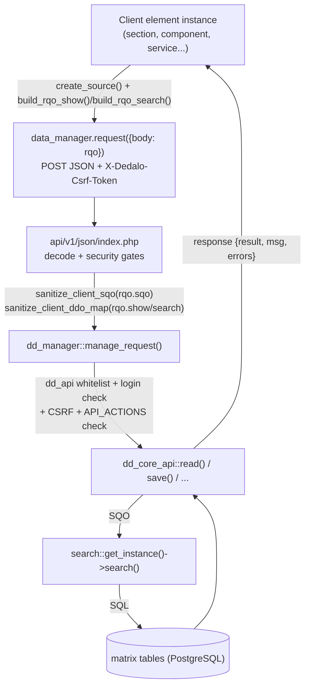

# Request Query Object (RQO)

> Class: `./core/common/class.request_query_object.php`
> API entry: `./core/api/v1/json/index.php` → `dd_manager::manage_request()`

## Overview

The Request Query Object (RQO) is the single, normalized message format used by every client→server call to the Dédalo work API. One RQO answers four questions:

| Question | RQO property |
|----------|--------------|
| **Who** is calling? | `source` (the element instance: tipo, section_tipo, section_id, mode, lang...) |
| **What** should be done? | `dd_api` (API class) + `action` (API method) + `source->action` (per-element modifier) |
| **Over which records?** | `sqo` (Search Query Object: filter, limit, offset, order) |
| **What should come back / be displayed?** | `show` / `search` / `choose` / `hide` (ddo_map layouts) |

Everything else (`data`, `options`, `prevent_lock`, `pretty_print`, `id`) is payload and transport tuning.

## Why RQO exists

- **Before v6** every component type had its own `trigger` endpoint with its own interface. A `component_autocomplete` spoke a different dialect than `component_autocomplete_hi` or `component_portal`; any shared behavior had to be re-implemented per trigger.
- **v5 introduced the SQO** — an SQL abstraction that unified *queries* (its `filter` maps to `WHERE`, its `select` to `SELECT`), designed around Dédalo relations and data paths.
- **v6 unified the API** and first tried to use the SQO as the whole call format. It was quickly insufficient: a call also has to say *who* is calling, *what action* to perform, and *how to lay out* the result — none of which `SQO->select` was designed for.

The RQO wraps the SQO and adds the caller identity, the action dispatch and the layout maps. **SQO = the query; RQO = the request.**

## The contract at a glance

A section list view requesting its first page of records:

```json
{
	"id"     : "section_oh1_list",
	"action" : "read",
	"dd_api" : "dd_core_api",
	"prevent_lock" : true,
	"source" : {
		"typo"         : "source",
		"type"         : "section",
		"action"       : "search",
		"model"        : "section",
		"tipo"         : "oh1",
		"section_tipo" : "oh1",
		"section_id"   : null,
		"mode"         : "list",
		"lang"         : "lg-eng"
	},
	"sqo" : {
		"section_tipo" : ["oh1"],
		"filter"       : null,
		"limit"        : 10,
		"offset"       : 0,
		"order"        : [{"direction":"ASC","path":[{"component_tipo":"section_id"}]}]
	}
}
```

And the standard response envelope:

```json
{
	"result" : { "...action specific..." : "context/data, records, count, etc." },
	"msg"    : "OK. Request done successfully",
	"errors" : [],
	"debug"  : { "real_execution_time": "123 ms" }
}
```

- `result` — the action's payload (`false` on failure). Shape depends on the action: `read` returns `{context, data}`, `count` returns a number, etc.
- `msg` — human-readable outcome string.
- `errors` — array of issue strings; empty on success. Server exceptions reach the client through this channel.
- `debug` / `dedalo_last_error` — added under `SHOW_DEBUG` / when server errors were logged.

!!! note "One RQO per HTTP call"
	In Dédalo 7 the API endpoint decodes **a single RQO object** per request (`core/api/v1/json/index.php` → `dd_manager::manage_request($rqo)`). Batching several operations is done with several `fetch` calls (the client `data_manager` runs them concurrently), not by sending an array of RQOs.

## Request lifecycle


```mermaid
graph TD
	A["Client element instance<br/>(section, component, service...)"] -- "create_source() + build_rqo_show()/build_rqo_search()" --> B["data_manager.request({body: rqo})<br/>POST JSON + X-Dedalo-Csrf-Token"]
	B --> C["api/v1/json/index.php<br/>decode + security gates"]
	C -- "sanitize_client_sqo(rqo.sqo)<br/>sanitize_client_ddo_map(rqo.show/search)" --> D["dd_manager::manage_request()"]
	D -- "dd_api whitelist + login check<br/>+ CSRF + API_ACTIONS check" --> E["dd_core_api::read() / save() / ..."]
	E -- SQO --> F["search::get_instance()->search()"]
	F -- SQL --> G[("matrix tables (PostgreSQL)")]
	G --> E
	E -- "response {result, msg, errors}" --> A
```

Step by step:

1. **Build** — the element instance builds its RQO, normally from its `request_config` (injected in its context by the server; see [request_config.md](request_config.md)). Helpers: `create_source()`, `common.build_rqo_show()`, `common.build_rqo_search()` in `core/common/js/common.js`.
2. **Send** — `data_manager.request({body: rqo})` POSTs it as JSON with the CSRF token header, retry/timeout handling and optional local-DB caching (`cache_handler`).
3. **Gate** — `index.php` decodes the body and scrubs the untrusted parts: `search_query_object::sanitize_client_sqo()` strips server-only SQO fields and clamps limits; `request_config_object::sanitize_client_ddo_map()` reduces client `show`/`search` ddo_maps to whitelisted display fields.
4. **Dispatch** — `dd_manager::manage_request()` validates the `dd_api` class against a whitelist, checks login (a small allowlist of actions works without a session: `start`, `login`, `get_environment`, ...), verifies the CSRF token for non-exempt actions, and confirms `action` is in the target class's `API_ACTIONS` constant.
5. **Execute** — the API class method runs the action. For data actions it instantiates the section/component identified by `source`, applies the `sqo`, resolves `show`/`search`/`choose`/`hide` ddo_maps into context+data.
6. **Respond** — the standard envelope goes back as JSON; top-level exceptions are captured into `errors` with the message (full traces stay server-side).

## Properties

All properties live in `request_query_object` (`$direct_keys`): `id`, `api_engine`, `dd_api`, `action`, `source`, `sqo`, `show`, `search`, `choose`, `data`, `prevent_lock`, `options`, `pretty_print`.

**Mandatory:** `dd_api`, `action`, `source` — **Optional:** everything else. If only a `source` is sent, the server derives the SQO and layout from the user preset or the ontology `request_config` (see *RQO and request_config* below).

### id : `string` *Optional*

Client-side identifier of the request, echoed for correlation/debugging. Conventionally built from the caller context (e.g. `section_oh1_list`).

### api_engine : `string` *Optional, default `'dedalo'`*

Backend engine for data retrieval: `dedalo` (internal) or an external engine name such as `zenon`. External engines resolve their connection details from the target section's `api_config` properties.

### dd_api : `string` *Mandatory, default `'dd_core_api'`*

The API class that will handle the call. Only whitelisted classes are accepted (`dd_manager::manage_request`):

| Class | Purpose |
|-------|---------|
| `dd_core_api` | Core data lifecycle: read/save/create/delete/count, element contexts |
| `dd_tools_api` | Tool execution (export, import, time machine, diffusion launchers...) |
| `dd_ts_api` | Thesaurus tree operations (expand, move, indexation...) |
| `dd_utils_api` | Utilities: login context, uploads, locks, environment |
| `dd_ontology_api` | Ontology browsing/editing |
| `dd_diffusion_api` | Publishing (diffuse, validate, get_ontology_map) — auto-selected for those actions |
| `dd_area_maintenance_api` | Admin maintenance widgets |
| `dd_agent_api`, `dd_mcp_api` | Agent / MCP integrations |
| `dd_component_portal_api`, `dd_component_text_area_api`, `dd_component_av_api`, `dd_component_3d_api`, `dd_component_info` | Component-specific endpoints (pagination, transcription, media...) |

Every class declares an `API_ACTIONS` constant; an `action` outside that list is rejected. This is the action-level security chokepoint — new API methods are not callable until explicitly listed.

### action : `string` *Mandatory*

The API class method to execute. `dd_core_api` actions: `start`, `read`, `read_raw`, `create`, `duplicate`, `delete`, `save`, `count`, `get_element_context`, `get_section_elements_context`, `get_indexation_grid`, `get_environment`, `get_matrix_ontology_locator`, `test`.

### source : `object` *Mandatory*

Identity of the calling element — built client-side by `create_source()` (`core/common/js/common.js`):

| Field | Type | Notes |
|-------|------|-------|
| `typo` | `string` | Always `'source'` |
| `type` | `string` | Element type: `component`, `section`, `area`, ... (drives e.g. `save` dispatch) |
| `action` | `string` | **Modifier of the main action** for this element. E.g. `read` + `source->action: 'get_value'` returns the plain component value instead of context+data |
| `model` | `string` | Element model (`section`, `component_portal`, ...). Recalculated server-side from `tipo` when omitted |
| `tipo` | `string` | Ontology tipo of the element |
| `section_tipo` | `string` | Target section tipo (mandatory in `read`) |
| `section_id` | `string\|int\|null` | Record id; `null` for lists/new records |
| `mode` | `string` | `edit` \| `list` \| `search` \| `tm` \| ... |
| `lang` | `string` | Data language (`lg-eng`, `lg-nolan`, ...) |
| `view` | `string` | View variant (`default`, `line`, `mosaic`, ...) |
| `matrix_id`, `data_source` | optional | Time machine: address a specific matrix row / `'tm'` data source |
| `is_temporal` | `bool` optional | Temporal instances (e.g. `tool_propagate_component_data`) |
| `caller_dataframe` | `object` optional | Dataframe pairing info (see component_dataframe docs) |
| `value` | `array` optional | Values to resolve (portal in search mode) |

Component instances can extend the source via `self.source_add` (e.g. `component_relation_model` adds `ar_target_section_tipo`).

### sqo : `object` *Optional*

The Search Query Object — filter (`WHERE`-equivalent), `section_tipo` targets, `limit`, `offset`, `order`, `full_count`. Full definition in [sqo.md](sqo.md) / `class.search_query_object.php`.

Security: the HTTP API is the only untrusted SQO source. `sanitize_client_sqo()` strips server-only fields (`sentence`, `params`, SQL column aliases...), forces `parsed=false` and clamps `limit` before the SQO reaches the search pipeline.

### show : `object` *Optional*

What to display and how — the layout of section lists and portal columns.

- **ddo_map** : `array` — chains of ddo objects (`{tipo, section_tipo, parent, mode, ...}`) linked by `parent` to form resolution paths. The server resolves each chain into context and data.
- **get_ddo_map** : `object` *Optional* — compute the ddo_map dynamically from the ontology instead of listing it: `{model: 'section_map', columns: [...]}`. Lets different sections share common search/columns (mint, type, etc.).
- **fields_separator** / **records_separator** : `string` — used when values are flattened to strings (e.g. `" | "`, `"<br>"`).
- **sqo_config** : `object` — display-specific SQO tuning (`operator`, `limit`, `offset`, `full_count`).
- **interface** : `object` — UI element switches:

| Key | Default | Controls |
|-----|---------|----------|
| `read_only` | `false` | Edit ability of the component |
| `save_animation` | `true` | Green save feedback line |
| `value_buttons` | `true` | Per-value buttons (edit, remove...) |
| `button_add` | `true` | Add-new-record button |
| `button_delete` | `true` | Delete button on portal rows |
| `button_delete_link` | `true` | "Unlink" option in the delete modal |
| `button_delete_link_and_record` | `true` | "Unlink and delete" option in the delete modal |
| `button_link` | `true` | Link-existing-record button |
| `button_edit` | `false` | Edit button in portals/sections |
| `button_edit_options` | — | `{action_mousedown: 'navigate'\|'open_window', action_contextmenu: 'navigate'\|'open_window'}` |
| `button_list` | `true` | Go-to-target-section button (e.g. component_radio_button) |
| `tools` | `true` | Component tools entry |
| `button_external` | `false` | Refresh button for external portal data |
| `button_fullscreen` | `true` | Fullscreen toggle |
| `button_save` | `true` | Save button |
| `button_tree` | `false` | Tree button |
| `show_autocomplete` | `true` | Record search autocomplete |
| `show_section_id` | `true` | section_id shown in edit buttons |

### search : `object` *Optional*

Fields available to the search process (used by `service_autocomplete` and the search panel). Same sub-shape as `show` (`ddo_map`, `get_ddo_map`, `sqo_config`, separators). Fallback chain: when `search` is defined it replaces `show` for searching; when `choose` is absent, `search` also drives the result list.

### choose : `object` *Optional*

Fields shown when picking a result in `service_autocomplete`. Same sub-shape. When defined, its `ddo_map` overrides `search`/`show` for the picker list. The server resolves `choose.sqo_config.limit` with the fallback chain *choose → search/show sqo_config → 25*.

### hide : `object` *Optional*

`ddo_map` of elements whose context and data must be **resolved but not rendered** — internal values the caller component needs (e.g. `Location` [actv19](https://dedalo.dev/ontology/actv19)).

### data : `object` *Optional*

Request payload for write actions. For `save`, carries `changed_data` (the modified values); also used as pre-calculated container (datalist, pagination) to avoid recomputation.

### options : `object` *Optional*

Heterogeneous extra parameters for components and tools — e.g. upload descriptors:

```json
{
	"options": {
		"file_data": { "name": "test26_test3_1.jpg", "tmp_dir": "DEDALO_UPLOAD_TMP_DIR", "key_dir": "3d", "tmp_name": "tmp_test26_test3_1.jpg" },
		"target_dir": "posterframe"
	}
}
```

When files are POSTed without a JSON body (e.g. CKEditor image upload), `index.php` synthesizes an RQO with `action:'upload'`, `dd_api:'dd_utils_api'` and the `$_FILES`/`$_POST` data in `options`.

### prevent_lock : `bool` *Optional*

Closes the PHP session (`session_write_close()`) before the work runs, so this request does not serialize behind — or block — other requests of the same session. Use for read-only/long calls (`count` does it by default). Never combine with actions that must write session state.

### pretty_print : `bool` *Optional*

Pretty-printed JSON response (debugging).

## Use cases and examples

### Read one record in edit mode

```json
{
	"action" : "read",
	"dd_api" : "dd_core_api",
	"source" : { "typo":"source", "type":"section", "action":"search", "model":"section",
		"tipo":"oh1", "section_tipo":"oh1", "section_id":3, "mode":"edit", "lang":"lg-eng" },
	"sqo"    : { "section_tipo":["oh1"], "limit":1, "offset":0,
		"filter_by_locators":[{"section_tipo":"oh1","section_id":3}] }
}
```

### Save a component value

```json
{
	"action" : "save",
	"dd_api" : "dd_core_api",
	"source" : { "typo":"source", "type":"component", "action":"update", "model":"component_input_text",
		"tipo":"oh24", "section_tipo":"oh1", "section_id":3, "mode":"edit", "lang":"lg-eng" },
	"data"   : { "changed_data": [ {"action":"update","key":0,"value":"Interview about..."} ] }
}
```

`save` dispatches on `source->type` (`component` | `section`), instantiates the element and applies `data->changed_data`.

### Autocomplete search (service_autocomplete)

```json
{
	"action" : "read",
	"dd_api" : "dd_core_api",
	"source" : { "typo":"source", "type":"component", "action":"search", "model":"component_portal",
		"tipo":"rsc17", "section_tipo":"oh1", "section_id":3, "mode":"edit", "lang":"lg-eng" },
	"sqo"    : { "section_tipo":["rsc197"], "filter":{"$or":[{ "q":"smith", "path":[{ "section_tipo":"rsc197","component_tipo":"rsc85" }] }]},
		"limit":25, "offset":0 },
	"search" : { "ddo_map":[ {"tipo":"rsc85","section_tipo":"rsc197","parent":"rsc197","mode":"list"} ] },
	"choose" : { "ddo_map":[ {"tipo":"rsc85","section_tipo":"rsc197","parent":"rsc197","mode":"list"} ], "fields_separator":" | " }
}
```

Note the dispatch split: the top-level `action` is `read` (it must be in `dd_core_api::API_ACTIONS`); the *search* behavior comes from `source->action: 'search'`. Built client-side by `build_rqo_search()` from the component's `request_config` (operator default `$or`, choose limit fallback 25).

### Count without blocking the session

```json
{
	"action" : "count",
	"dd_api" : "dd_core_api",
	"prevent_lock" : true,
	"source" : { "typo":"source", "type":"section", "model":"section", "tipo":"oh1", "section_tipo":"oh1", "mode":"list" },
	"sqo"    : { "section_tipo":["oh1"], "filter": null }
}
```

### Component value only (source->action modifier)

```json
{
	"action" : "read",
	"dd_api" : "dd_core_api",
	"source" : { "typo":"source", "type":"component", "action":"get_value", "model":"component_select",
		"tipo":"oh37", "section_tipo":"oh1", "section_id":3, "mode":"list", "lang":"lg-eng" }
}
```

Same top-level `action` (`read`), different per-element behavior: `source->action:'get_value'` short-circuits to the plain value.

### Tool execution

```json
{
	"action" : "tool_request",
	"dd_api" : "dd_tools_api",
	"prevent_lock" : true,
	"source" : { "typo":"source", "type":"tool", "action":"get_export_grid", "model":"tool_export",
		"tipo":"oh1", "section_tipo":"oh1", "mode":"list" },
	"options": { "section_tipo":"oh1", "data_format":"csv", "breakdown":"default", "ar_ddo_to_export":[ "..." ] }
}
```

The generic `tool_request` action routes to `{source->model}::{source->action}(options)` — here `tool_export::get_export_grid()`. Tool methods are additionally gated by each tool's `API_ACTIONS` registration (see tools docs).

## RQO and request_config

The RQO and the [request_config](request_config.md) are the two halves of the same contract:

- **request_config = configuration** (server → client). Defined in ontology `properties->source->request_config` (or user layout presets), resolved per element and injected into the element's context. It declares *what an element can request*: target sections, ddo_maps for show/search/choose/hide, sqo defaults, interface switches.
- **RQO = request** (client → server). The client builds it *from* the request_config: `build_rqo_show()`/`build_rqo_search()` copy the sqo/sqo_config/ddo_maps into a concrete call, adding the live state (current filter, page, query string).

Because the ontology cannot know installation-specific values, the request_config uses placeholders that are resolved server-side before reaching the client — `section_tipo: "self"`, `parent: "self"`, dynamic `sqo.section_tipo` sources (`section`, `hierarchy_types`, `self`). By the time the client builds an RQO, those are concrete tipos.

The reverse path also exists: when a client sends `rqo->show` (e.g. time machine, `tool_qr`, graph view, search presets — `section` instantiated with `add_show:true`), the server rebuilds the element's request_config **from the RQO** (`common::build_request_config_from_rqo`). Client-sent ddos pass the same validation as ontology configs: whitelist scrub at the API gate (`sanitize_client_ddo_map`) plus tipo/TLD/permission checks (`validate_requested_ddo`); rejected ddos are dropped and reported through the `config_warnings` channel under `SHOW_DEBUG`.

## Security model summary

| Gate | Where | Protects |
|------|-------|----------|
| dd_api whitelist | `dd_manager::manage_request` | Only known API classes are instantiable |
| `API_ACTIONS` per class | each `dd_*_api` | Only declared methods are callable |
| Login + no-login allowlist | `dd_manager` | Session required except bootstrap actions (`start`, `login`, `get_environment`, ...) |
| CSRF token | `X-Dedalo-Csrf-Token` header ↔ session token | Cross-site request forgery (exempt: bootstrap actions) |
| `sanitize_client_sqo` | `api/v1/json/index.php` | Server-only SQO fields, unbounded limits, pre-parsed SQL |
| `sanitize_client_ddo_map` | `api/v1/json/index.php` | Injected ddo fields beyond the display whitelist |
| `validate_requested_ddo` | `common` (rqo-derived config) | Invalid tipos, inactive TLDs, unauthorized elements |
| XSS scrub | legacy `$_REQUEST`/`$_FILES` branches | Form/query-parameter payloads |
| Permission checks | per action (`read`, `count`, `save`...) | Section/element access levels |

## Best practices

1. **Build RQOs from the request_config** the server injected — don't hand-craft sqo/ddo_maps in client code when the config already defines them (`build_rqo_show`/`build_rqo_search`).
2. **Always send `source` complete** (`tipo`, `section_tipo`, `mode`, `lang`): the server resolves defaults from it and `read` rejects an empty `section_tipo`.
3. **Use `prevent_lock: true`** for read-only calls that may run long (counts, exports preflight) so they don't serialize the user's session.
4. **Let the server own limits**: send `limit: null` to get the mode/model default; client limits are clamped server-side anyway.
5. **Use `source->action` modifiers** instead of new top-level actions when the behavior is a variant of read/save for one element type.
6. **New API methods must be added to `API_ACTIONS`** of their class — they are unreachable otherwise (by design).
7. **Never put credentials or server-only state in an RQO**: the object is logged in debug environments and echoed in error contexts.

## Troubleshooting

- **`Invalid action var (not found in rqo)`** — the body has no `action`; check JSON serialization of the fetch body.
- **`Error. Invalid API class`** — `dd_api` not in the whitelist (typo, or class not registered in `dd_manager`).
- **Action rejected / `Undefined method`** — the action is missing from the class's `API_ACTIONS`.
- **`Empty source 'section_tipo'`** — `read` requires it; verify `create_source()` received a fully initialized instance.
- **Empty result with no error** — likely dropped ddos (invalid tipo, inactive TLD, no permissions). Under `SHOW_DEBUG`, inspect `config_warnings` in the element context; production counts drops in `metrics`.
- **Stale list after editing** — check the session SQO (`section::get_session_sqo`) and the client local-DB cache (`cache_handler`); the navigation SQO is preserved across calls by design.
- **CSRF errors on first call** — the token is minted on `start`; ensure the bootstrap call ran and `page_globals.csrf_token` is populated.

## Related documentation

- [request_config.md](request_config.md) — how the server builds the configuration the client turns into RQOs
- [sqo.md](sqo.md) — the Search Query Object (filter/limit/order) carried inside the RQO
- `class.request_query_object.php` — property definitions and inline format reference
- `core/common/js/data_manager.js` — client transport (retries, timeout, CSRF, local cache)
