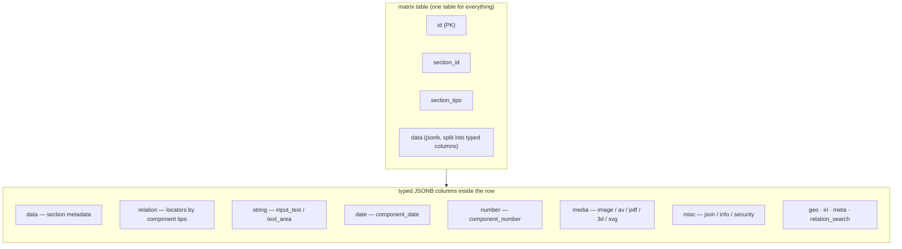
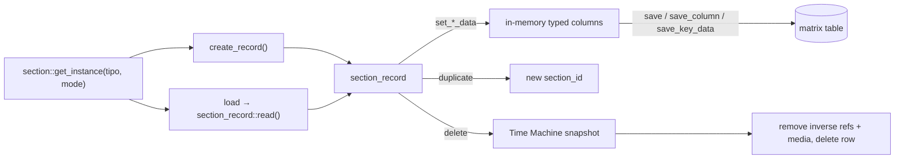
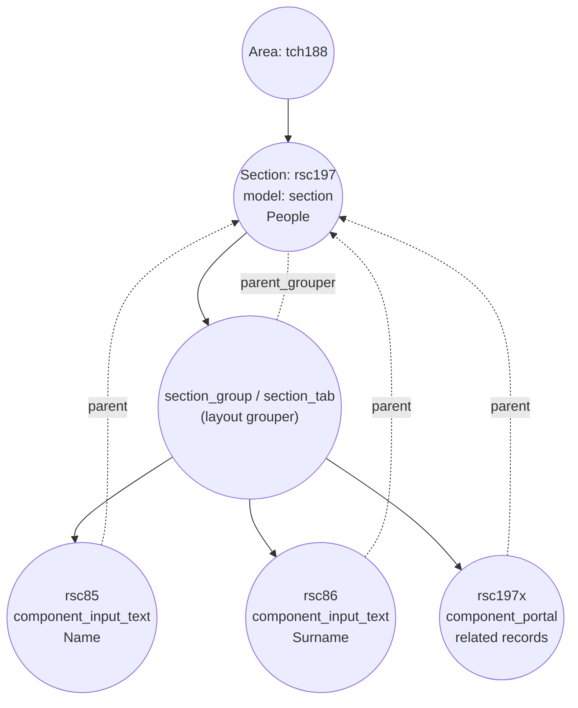

# Sections

## What a section is

In classical SQL you describe your data with **tables**: a `people` table, an
`interviews` table, a `numismatics` table, each with its own columns. Dédalo
does not work that way. Since v4 the project abandoned the per-entity SQL schema
and replaced it with a single abstraction: the **section**.

> **section** = an SQL table *with format and logic*

A section is the Dédalo equivalent of a table, but it is not a real database
table. It is a **definition in the ontology** (a node with `model: "section"`)
plus the PHP/JS logic that knows how to read, write, relate and render the
records that belong to it. All sections — `People`, `Oral History interview`,
`Coin`, the list of `Projects`, the `Users` section, even the internal
`Activity` log — live side by side in **one** physical table called `matrix`.

This is the central idea of Dédalo's data layer, and the rest of this document
unpacks it:

- a section *defines* a kind of record (the "columns" are its **component**
  children in the ontology);
- a section *owns* database access — components never touch the database
  directly, they read and write *through* the section's record;
- a section is *instantiated* from an ontology node at runtime, so changing the
  node changes the table's behavior without any code edit or schema migration.

For the wider picture of how Dédalo abstracts the database, read the
[introduction](../index.md) and the [ontology documentation](../ontology/index.md).
For the fields that live inside a section, see
[components](../components/index.md). Terms used here (tipo, model, locator,
subdata…) are collected in the [glossary](../glossary.md) and the overall design
is described in the [architecture overview](../architecture_overview.md).

---

## The matrix table model

All section records are stored in one table, `matrix`, with just **four
columns**:

| column | type | meaning |
| --- | --- | --- |
| `id` | int | The real, table-wide unique row id (the PostgreSQL primary key). |
| `section_id` | int | The record id *within its section* — unique per `section_tipo`, not table-wide. |
| `section_tipo` | text | The ontology tipo of the section the row belongs to (e.g. `rsc197`, `oh1`). |
| `data` | jsonb | The whole record payload: component values keyed by component tipo, plus the section `relations` array. |

Two different sections can both have `section_id = 1`; what disambiguates them is
`section_tipo`. The pair **`(section_tipo, section_id)`** is the logical primary
key of a record, and it is exactly the pair you pass everywhere in the code to
identify a record.

```text
| id | section_id | section_tipo | data                                                              |
|----|-----------|--------------|-------------------------------------------------------------------|
| 1  | 1         | "rsc197"     | { "section":"rsc197", "section_id":1, "rsc85":..., "rsc86":... }  |
| 2  | 1         | "oh1"        | { "section":"oh1", "section_id":1, "oh2":... }                    |
```

### What lives inside the data payload

Conceptually the `data` payload holds **component values + a global
`relations` array**:

```json
{
  "rsc85": "Alicia",
  "rsc86": "Gutierrez",
  "relations": [ /* every locator that links this record to others */ ]
}
```

Each component contributes its value under its own component tipo as the key,
and the section keeps one flat `relations` array listing every
[locator](../locator.md) that links this record to other records (related
components, portals, parents/children, filters, etc.). Relation-bearing
components read and write into this single shared array rather than each keeping
their own; this is why the section, not the component, owns the relation list
(see [`get_relations()` / `add_relation()` / `remove_relation()`](#relations-are-section-owned)).

### Storage detail: the data column is split into typed JSONB columns

The single conceptual `data` payload is, at the physical level, **distributed
across several typed JSONB columns** so PostgreSQL can index and query each data
shape efficiently. `section_record_data` declares the canonical column list and
a model→column map (`section_record_data::$column_map`):

| column | holds | example component models |
| --- | --- | --- |
| `data` | section-level metadata (label, diffusion info, created/modified, …) | the `section` node itself |
| `relation` | locators grouped by component tipo | `component_portal`, `component_select`, `component_relation_*`, `component_check_box`, `component_dataframe`, `component_filter` |
| `string` | string literals | `component_input_text`, `component_text_area`, `component_email`, `component_password` |
| `date` | normalized dates | `component_date` |
| `iri` | IRI objects `{title, uri}` | `component_iri` |
| `geo` | geo data | `component_geolocation` |
| `number` | numeric values | `component_number` |
| `media` | media references | `component_image`, `component_av`, `component_pdf`, `component_3d`, `component_svg` |
| `misc` | direct objects | `component_json`, `component_info`, `component_security_access`, `component_inverse` |
| `relation_search` | denormalized relation data for cross-parent search | (search optimisation) |
| `meta` | per-value unique identifiers / counters | string components meta |

So when you read "the `data` JSON of the record" you should picture it as the
merge of these typed columns. The `relation` column, for instance, stores
`{"oh25":[locators], "rsc197":[locators]}` keyed by the originating component
tipo, and the section's global `relations` array is assembled from it. Decoding
is **lazy**: raw JSON strings from each column are kept undecoded until the
first access (`section_record_data::ensure_decoded()`), which keeps list mode
cheap.



**Diagram — matrix-table storage model.** Every record of every section is one
row in `matrix`, identified by `(section_tipo, section_id)`. The payload the
caller sees as a single `data` object is physically spread across typed JSONB
columns (`data`, `relation`, `string`, `date`, `number`, `media`, `misc`,
`geo`, `iri`, `meta`, `relation_search`). A component's model decides which
column its value lands in via `section_record_data::$column_map`. The section is
the only object that reads and writes these columns; components ask the section
for their slice.

---

## The class family

Four PHP classes work together around the section abstraction. Knowing which is
which avoids a lot of confusion.

| class | model | role |
| --- | --- | --- |
| **`section`** | `section` | The runtime representation of one section *type* (the "table with logic"). Owns instancing, record creation/duplication/deletion, the relations API and permissions. One `section` object can iterate over many records in list mode. |
| **`section_record`** | — | The runtime representation of **one record row** in the PHP space. This is the object that actually talks to the database (`read`, `save`, `delete`, `duplicate`). It delegates the column store to `section_record_data`. |
| **`section_group`** | `section_group` | A pure **layout grouper**. It is a child node of a section under which components are visually grouped. It has no data of its own and even short-circuits `get_tools()` to return `[]`. |
| **`section_tab`** | `section_tab` | Another **layout grouper**: a tab inside a section's form. Like `section_group`, it carries no data and returns no tools. |

A fifth class, **`sections`** (plural), is not a single section: it is the
multi-record loader that, given a set of locators or a search query object,
resolves and returns many section records at once (used by list views and
portals).

### section vs section_record — who owns the database

The key separation is between `section` and `section_record`:

- **`section`** is about the *type*: which components it has, what permissions
  the current user holds over it, how to create/duplicate/delete a record, and
  the shared `relations` array.
- **`section_record`** is about *one row*: it holds `section_tipo`,
  `section_id`, a `section_record_data` instance, and the `read()` / `save()` /
  `save_column()` / `save_key_data()` / `delete()` methods that issue the actual
  database operations through a data handler (`matrix_db_manager`, or
  `matrix_activity_db_manager` for the activity table).

Components never call the database. A component resolves its value by asking the
record for its slice and persists by writing its slice back:

```php
// read one component's data from the right typed column
$section_record->get_component_data( $tipo, $column );

// write it back (still in memory)
$section_record->set_component_data( $tipo, $column, $data );

// flush to the database (one transaction)
$section_record->save_key_data( $save_path );
```

This is the meaning of *"sections own database access; components read and save
through them."* The component knows its data shape; the section/`section_record`
knows where and how it is stored. Instances are cached
(`section::$ar_section_instances`, `section_record_instances_cache`,
`section_record_data`), and all section-level static caches are purged in
`section::clear()` to avoid state bleeding across persistent-worker requests.

---

## Section lifecycle

A section participates in a full record lifecycle. The verbs below are the ones
you will see in the API and in the code.

### Instantiate — `section::get_instance()`

```php
$section = section::get_instance( $tipo, $mode );  // e.g. ('rsc197', 'list')
```

`get_instance()` first validates that the tipo's `model` really is `section`
(it refuses anything else), then returns a cached instance keyed by
`tipo + mode` (plus a dataframe suffix when called from a dataframe). Caching is
deliberately skipped for `mode = 'update'`, `mode = 'tm'`, and whenever
`cache = false` (notably **imports**, which must not reuse a cached instance).
The constructor resolves the data column name, sets up the empty
`section_records` array and pagination defaults, and calls
`load_structure_data()` to pull the section's ontology context.

### Load

A section in `list` mode loads many records; in `edit` mode it works with one.
Either way the actual data load happens lazily through `section_record`:
`load_data()` → `read()` queries the row once via the data handler, decodes the
typed columns lazily, and marks `record_in_the_database` true/false. Subsequent
reads in the same request are served from the cached `section_record_data`
instance.

### New — `section::create_record()`

```php
$section_id = $section->create_record( $options ); // returns the new section_id or false
```

Creating a record is a section-owned operation:

1. It builds the record **metadata** (`section_record::build_metadata()`) and
   the **modification data** (`build_modification_data()` — created-by user and
   date) and merges them into the values.
2. It inserts the row through `section_record::create()` (which is restricted —
   under debug it asserts that *only* `section` may call it).
3. It logs a `NEW` entry to the activity logger.
4. It resets the relevant caches by tipo (request-config presets, registered
   tools, project filters).

Newly created records are also assigned a default **project**
(`set_projects_to_new_section_record()`): the user's default project is written
into the section's `component_filter`, unless the caller (e.g. a portal) already
supplied project data, or the section has no `component_filter` at all (typical
of "list of values" sections). The `Activity` section
(`DEDALO_ACTIVITY_SECTION_TIPO`) cannot be created through this path — it is the
logger and follows a different handler.

### Save

Saving is delegated to the record:

- `section_record::save()` writes every column in one transaction
  (`data_handler::update(...)`).
- `section_record::save_column()` writes a single typed column.
- `section_record::save_key_data()` writes one component's key within a column
  and, importantly, **deletes a column when it becomes empty** so the database
  stays clean.

Each save fires `save_event()`, which invalidates the file/static caches tied to
special sections (request-config presets `dd1244`, tools register `dd1324`,
tools configuration `dd996`, profiles `dd234`).

### Duplicate — `section_record::duplicate()`

`duplicate()` clones the current record's full data into a brand-new
`section_id`, re-saving every component so each one rebuilds its own state (for
example regenerating media files for the new id and creating Time Machine
entries). It returns the new `section_id` (or `false`).

### Delete — `section_record::delete()`

Deleting is the most involved step and is record-owned:

1. A **Time Machine** record is created first (`tm_record::create()`), capturing
   the full data and verifying the saved snapshot matches before proceeding —
   every delete is a recoverable point in time.
2. Inverse references held by other records are removed
   (`remove_all_inverse_references()`), media files are moved to the deleted
   folder (`remove_section_media_files()`), and the row data is deleted, with
   diffusion records optionally propagated.

Records with `section_id < 1` are refused.



---

## Relations are section-owned

Because relations are stored once per record (not per relating component), the
relation API lives on `section`:

- `get_relations( $container = 'relations' )` — returns the record's locator
  array (empty when the record does not exist yet).
- `add_relation( $locator, $container )` — validates the locator (must be an
  object with a `type`), de-duplicates, and pushes it into the shared array.
- `remove_relation( $locator, $container )` — removes by comparing the
  identifying locator properties.
- `remove_relations_from_component_tipo( $options )` — bulk-removes every
  locator that originated from a given component tipo (with a dedicated path for
  `component_dataframe` matching via the unified `id_key` contract).

Relating components delegate to these methods; this is what keeps the single
shared `relations` array authoritative.

---

## Sections as ontology nodes

A section is born as a node in the ontology. Its node carries `model: "section"`
(resolved through `model_tipo`, e.g. `dd6` → `section`), a `tipo` made of a
**TLD + a sequential number**, a `parent` placing it in the tree (usually an
area), and the translatable `lg-*` labels:

```json
{
  "tipo": "rsc197",
  "parent": "tch188",
  "model": "section",
  "model_tipo": "dd6",
  "tld": "rsc",
  "lg-eng": "People", "lg-spa": "Personas", "lg-cat": "Persones"
}
```

`rsc197` reads as *"the 197th node of the `rsc` (Resources) TLD"*. That numeric
suffix is exactly the `section_tipo` index that ends up in the `matrix` table.

### Wiring components to a section

The section's "columns" are its **component children**. A component node points
back at the section with `parent = <section_tipo>` and is placed in the layout
under a `parent_grouper` — normally a `section_group` (or `section_tab`) so the
form has structure. When the grouper *is* the section itself, the component
sits directly under the section:

```json
[
  { "tipo": "rsc197", "model": "section", "parent": "tch188",
    "lg-eng": "People" },

  { "tipo": "rsc85", "model": "component_input_text",
    "parent": "rsc197", "parent_grouper": "rsc197",
    "lg-eng": "Name" },

  { "tipo": "rsc86", "model": "component_input_text",
    "parent": "rsc197", "parent_grouper": "rsc197",
    "lg-eng": "Surname" }
]
```

At runtime `section::get_ar_children_tipo_by_model_name_in_section()` walks the
node's recursive children and filters them by model (e.g. all
`component_*`, or all `section_group`), resolving virtual sections and
honouring `exclude_elements`. The `section`, `section_group`, `section_tab` and
`tab` models are recognised as **groupers** (`section::get_ar_grouper_models()`)
and are skipped when collecting data-bearing components.

A node's **`properties`** (a deep-cloned descriptor — clone for worker-safety,
see `ontology_node::get_properties()`) and its **`relations`** array flow
through the structure-context cache onto the `ddo`
(`request_config_ddo` does `$ddo->properties = $ontology_node->get_properties()`)
and from there into the context/subcontext the client renders. This is how
per-instance layout (CSS, label overrides, view) reaches the browser without a
code change. See the [request config](../request_config.md) docs for the full
context-building flow.



**Diagram — section → components composition.** The section node (`rsc197`) is
a child of an area. Its component children declare `parent = rsc197` (logical
ownership) and a `parent_grouper` (layout placement, usually a `section_group`
or `section_tab`). Literal components such as `rsc85`/`rsc86` store their values
in the section record's typed columns; relation-bearing components such as a
`component_portal` write locators into the record's shared `relations` array.
Groupers carry no data and produce no tools — they exist purely to organise the
form.

---

## Modes and permissions

### Modes

A section is instantiated with a **mode** that shapes what it does:

- `list` — iterate over many records matching the current filter (the default).
- `edit` — work with a single record for editing/saving.
- `search` — build search forms.
- `update`, `tm` — uncached working modes (the second is Time Machine context).

Mode is part of the instance cache key (`tipo_mode`), and `update`/`tm` are
never cached.

### Permissions

Access is enforced at the section level by `section::get_section_permissions()`,
which resolves to an integer via `common::get_permissions($tipo, $tipo)` and
caches the result on the instance. The scale is the usual Dédalo permission
ladder (roughly: `0` none, `1` read, `2` edit, higher for create/delete). The
`Activity` section is clamped to `≤ 1` so it can never be edited through the UI.
Per-record permission can also be read from `section_record::get_permissions()`.
A few other section-level switches affect behavior and rendering, e.g.
`show_inspector`, the `section_virtual`/`section_real_tipo` pair (virtual
sections store their data under a *real* section while keeping their own
ontology definition), and `is_temp` / `save_handler = 'session'` for temporary
sections that are never persisted to the database.

---

## Worked example — a "People" section

Putting it all together: a minimal People section with two literal text fields
and one relation to interviews.

### 1. Ontology nodes (the definition / the "schema")

```json
[
  { "tipo": "rsc197", "model": "section", "parent": "tch188",
    "model_tipo": "dd6", "tld": "rsc",
    "lg-eng": "People", "lg-spa": "Personas", "lg-cat": "Persones" },

  { "tipo": "rsc85", "model": "component_input_text",
    "parent": "rsc197", "parent_grouper": "rsc197",
    "lg-eng": "Name", "lg-spa": "Nombre", "lg-cat": "Nom" },

  { "tipo": "rsc86", "model": "component_input_text",
    "parent": "rsc197", "parent_grouper": "rsc197",
    "lg-eng": "Surname", "lg-spa": "Apellidos", "lg-cat": "Cognoms" },

  { "tipo": "rsc200", "model": "component_portal",
    "parent": "rsc197", "parent_grouper": "rsc197",
    "lg-eng": "Interviews", "lg-spa": "Entrevistas",
    "properties": {
      "view": "line",
      "label": { "lg-eng": "Interviews with this person" }
    } }
]
```

### 2. The stored record (the "row" in `matrix`)

One person, `section_id = 1`. Conceptually the `data` payload is:

```json
{
  "section": "rsc197",
  "section_id": 1,
  "rsc85": "Alicia",
  "rsc86": "Gutierrez",
  "relations": [
    { "type": "dd63", "section_tipo": "oh1", "section_id": 7,
      "from_component_tipo": "rsc200" }
  ]
}
```

Physically, that single payload is split across the typed columns of the
`matrix` row `(section_tipo = "rsc197", section_id = 1)`:

- the `string` column holds `{ "rsc85": ["Alicia"], "rsc86": ["Gutierrez"] }`,
- the `relation` column holds the portal's locators grouped under `rsc200`,
- the `data` column holds the section metadata (label, created/modified, …),

and the section assembles the global `relations` array from the `relation`
column when a caller asks for `get_relations()`.

### 3. What happens at runtime

```php
// instance the section type
$section = section::get_instance( 'rsc197', 'edit' );

// create a new person record
$section_id = $section->create_record();           // → e.g. 1

// the input_text components read/write their slice of the `string` column
// the component_portal writes a locator into the shared `relations` array:
$loc = new locator();
    $loc->set_type('dd63');
    $loc->set_section_tipo('oh1');
    $loc->set_section_id(7);
    $loc->set_from_component_tipo('rsc200');
$section->add_relation( $loc );

// persisting goes through the record, in one transaction
// (components call section_record::save_key_data under the hood)
```

If a curator later renames the `rsc85` label from "Name" to "Full name", that is
an **ontology** change to the node's term/properties — no schema migration, no
data rewrite, no code edit. The next request reads the new definition and the
client renders the new label. That is the whole point of the section
abstraction.

---

## See also

- [Components](../components/index.md) — the fields that live inside a section.
- [Ontology](../ontology/index.md) — how sections, components and relations are
  defined as nodes.
- [Request config](../request_config.md) — how a section's context/subcontext is
  built and delivered to the client.
- [Locator](../locator.md) — the pointer type stored in the `relations` array.
- [Glossary](../glossary.md) — definitions of tipo, model, subdata, ddo, etc.
- [Architecture overview](../architecture_overview.md) — where sections sit in
  the wider system.
