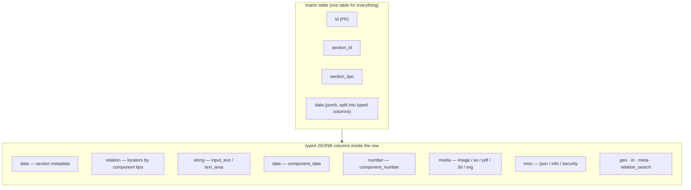
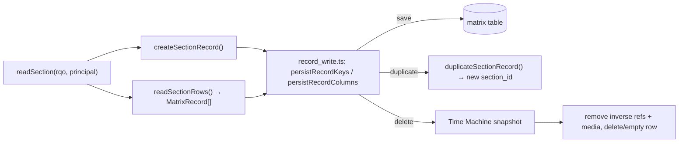
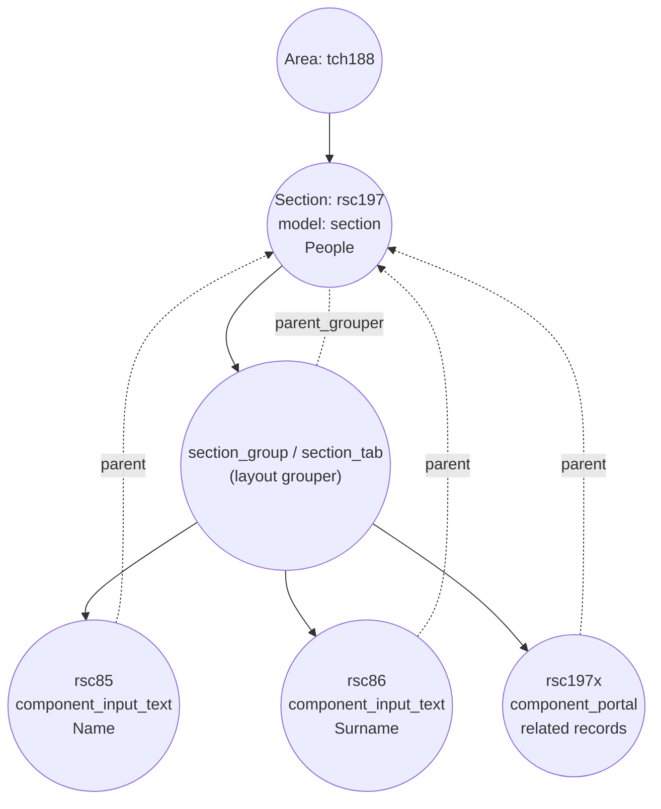

# Sections

## What a section is

In classical SQL you describe your data with **tables**: a `people` table, an
`interviews` table, a `numismatics` table, each with its own columns. Dédalo
does not work that way. Since v4 the project abandoned the per-entity SQL schema
and replaced it with a single abstraction: the **section**.

> **section** = an SQL table *with format and logic*

A section is the Dédalo equivalent of a table, but it is not a real database
table. It is a **definition in the ontology** (a node with `model: "section"`)
plus the server and client logic that knows how to read, write, relate and
render the records that belong to it. All sections — `People`, `Oral History interview`,
`Coin`, the list of `Projects`, the `Users` section, even the internal
`Activity` log — live side by side in **one** physical table called `matrix`.

This is the central idea of Dédalo's data layer, and the rest of this document
unpacks it:

- a section *defines* a kind of record (the "columns" are its **component**
  children in the ontology);
- a section *owns* database access — components never touch the database
  directly, they read and write *through* the section's record;
- a section is *instantiated* from an ontology node at runtime, so changing the
  node changes the table's behavior without any code edit or schema migration.

For the wider picture of how Dédalo abstracts the database, read the
[introduction](../index.md) and the [ontology documentation](../ontology/index.md).
For the fields that live inside a section, see
[components](../components/index.md). Terms used here (tipo, model, locator,
subdata…) are collected in the [glossary](../glossary.md) and the overall design
is described in the [architecture overview](../architecture_overview.md).

---

## The matrix table model

All section records are stored in one table, `matrix`, with just **four
columns**:

| column | type | meaning |
| --- | --- | --- |
| `id` | int | The real, table-wide unique row id (the PostgreSQL primary key). |
| `section_id` | int | The record id *within its section* — unique per `section_tipo`, not table-wide. |
| `section_tipo` | text | The ontology tipo of the section the row belongs to (e.g. `rsc197`, `oh1`). |
| `data` | jsonb | The whole record payload: component values keyed by component tipo, plus the section `relations` array. |

Two different sections can both have `section_id = 1`; what disambiguates them is
`section_tipo`. The pair **`(section_tipo, section_id)`** is the logical primary
key of a record, and it is exactly the pair you pass everywhere in the code to
identify a record.

```text
| id | section_id | section_tipo | data                                                              |
|----|-----------|--------------|-------------------------------------------------------------------|
| 1  | 1         | "rsc197"     | { "section":"rsc197", "section_id":1, "rsc85":..., "rsc86":... }  |
| 2  | 1         | "oh1"        | { "section":"oh1", "section_id":1, "oh2":... }                    |
```

### What lives inside the data payload

Conceptually the `data` payload holds **component values + a global
`relations` array**:

```json
{
  "rsc85": "Alicia",
  "rsc86": "Gutierrez",
  "relations": [ /* every locator that links this record to others */ ]
}
```

Each component contributes its value under its own component tipo as the key,
and the section keeps one flat `relations` array listing every
[locator](../locator.md) that links this record to other records (related
components, portals, parents/children, filters, etc.). Relation-bearing
components read and write into this single shared array rather than each keeping
their own; this is why the section, not the component, owns the relation list
(see [Relations are section-owned](#relations-are-section-owned)).

### Storage detail: the data column is split into typed JSONB columns

The single conceptual `data` payload is, at the physical level, **distributed
across several typed JSONB columns** so PostgreSQL can index and query each data
shape efficiently. The column list is `MATRIX_JSONB_COLUMNS`
(`src/core/db/matrix.ts`) and the model→column map is resolved by
`getColumnNameByModel()` (`src/core/ontology/resolver.ts`): component models
resolve through the component registry's `descriptor.column`, and the
non-component `section` pseudo-model through a small local map.

| column | holds | example component models |
| --- | --- | --- |
| `data` | section-level metadata (label, diffusion info, created/modified, …) | the `section` node itself |
| `relation` | locators grouped by component tipo | `component_portal`, `component_select`, `component_relation_*`, `component_check_box`, `component_dataframe`, `component_filter` |
| `string` | string literals | `component_input_text`, `component_text_area`, `component_email`, `component_password` |
| `date` | normalized dates | `component_date` |
| `iri` | IRI objects `{title, uri}` | `component_iri` |
| `geo` | geo data | `component_geolocation` |
| `number` | numeric values | `component_number` |
| `media` | media references | `component_image`, `component_av`, `component_pdf`, `component_3d`, `component_svg` |
| `misc` | direct objects | `component_json`, `component_info`, `component_security_access`, `component_inverse` |
| `relation_search` | denormalized relation data for cross-parent search | (search optimisation) |
| `meta` | per-value unique identifiers / counters | string components meta |

So when you read "the `data` JSON of the record" you should picture it as the
merge of these typed columns. The `relation` column, for instance, stores
`{"oh25":[locators], "rsc197":[locators]}` keyed by the originating component
tipo, and the section's global `relations` array is assembled from it.

There is no per-column lazy-decode step: Bun's Postgres driver parses `jsonb`
columns natively, so a `MatrixRecord` (`src/core/db/matrix.ts`) arrives already
decoded. Efficiency comes from a coarser rule instead — read the row once, pass
the decoded record down the call tree, never re-query. See
[`section_record`](section_record.md) for the full read/write API.

This page describes the typed columns from the *storage* side. For the **data
formats those columns hold** — the consolidated v7 value-item envelope
(`{id, lang?, value|locator}`), what each column's payload looks like, and a page
per data type (string, number, date, IRI, geo, media, relations, misc) — see the
[data model](../data_model/index.md).



**Diagram — matrix-table storage model.** Every record of every section is one
row in `matrix`, identified by `(section_tipo, section_id)`. The payload the
caller sees as a single `data` object is physically spread across typed JSONB
columns (`data`, `relation`, `string`, `date`, `number`, `media`, `misc`,
`geo`, `iri`, `meta`, `relation_search`). A component's model decides which
column its value lands in, via `getColumnNameByModel()`. The section layer is
the only one that reads and writes these columns; components get their slice
from it.

---

## The module family

The section abstraction is a small set of modules, not one stateful object per
row: there is no section class, no per-record middleware object, and no
per-request instance cache to purge. Knowing which module is which avoids a lot
of confusion.

| concept | model | module home | role |
| --- | --- | --- | --- |
| **section** | `section` | `src/core/concepts/section.ts` (pure contract) + `src/core/section/context.ts`, `buttons.ts`, `read.ts` (engine) | The *type* (the "table with logic"): instancing, record creation/duplication/deletion, the relations array, permissions, children resolution. |
| **section_record** | — | `src/core/concepts/section_record.ts` (contract) + `src/core/section_record/` (write chokepoint, virtual-record substitution) + `src/core/section/record/` (create/duplicate/delete/save engine) | One record **row**, addressed by `(section_tipo, section_id)` — read/write/delete/duplicate. |
| **[`section_group`](section_group.md) / [`section_tab`](section_tab.md)** | `section_group`, `section_tab` (+ legacy `section_group_div`, `tab`) | `GROUPER_MODELS` / `isGrouperModel()` in `src/core/concepts/section.ts`; stamped generically as context `type: 'grouper'` in `src/core/resolve/structure_context.ts` | Pure **layout groupers**: child nodes of a section under which components are visually grouped. They carry no data and no tools. |
| **sections** (plural) | — | `src/core/concepts/sections.ts` (envelope contract) + `src/core/section/read.ts` (`readSection`, `readSectionRows`, `deriveSectionDdoMap`) | The multi-record loader: given an SQO, resolves and returns many section records at once (list views, portals). |

!!! info "Per-page reference docs"
    This page is the conceptual overview. Each concept has its own reference:

    - **[`section`](section.md)** — the table abstraction & orchestrator (context, record creation, relations, permissions, children, search).
    - **[`section_record`](section_record.md)** — the physical per-record I/O (read/save/delete/duplicate, counters, metadata).
    - **[`sections`](sections.md)** — the plural collection helper over many records of one `section_tipo`.
    - **[`section_group`](section_group.md)** · **[`section_tab`](section_tab.md)** — the layout groupers (visual grouping and tabs inside a section's form; no data, no tools).
    - **[`section_list`](section_list.md)** — the client list view that renders many records of a `section_tipo`.

### section vs section_record — who owns the database

The separation between *type* and *row* is load-bearing:

- **section** is about the *type*: which components it has, what permissions
  the current user holds over it, how to create/duplicate/delete a record, and
  the shared `relations` array.
- **section_record** is about *one row*: the pair `(section_tipo, section_id)`,
  and the read/write/delete/duplicate operations that issue the actual database
  operations against the matrix table.

Components never call the database directly, and there is no stateful per-row
object in between. A component's value is read off a plain `MatrixRecord` struct
(`src/core/db/matrix.ts`) that is threaded explicitly through the call tree, and
it is persisted through the single write chokepoint in
`src/core/section_record/record_write.ts` (`persistRecordKeys` /
`persistRecordColumns`), which merges the component's value with the record's
modified-audit stamp (`dd197`/`dd201`) into **one** database update:

```ts
// read one component's data off the already-decoded matrix record
const value = (record.columns.string as Record<string, unknown> | null)?.[tipo];

// persist it: value + modified-audit stamp in ONE update (record_write.ts
// appends the audit writes itself — the caller does not build them)
await persistRecordKeys(
  { table, sectionTipo, sectionId },
  [{ column: 'string', key: tipo, value }],
  { userId: principal.userId },
);
```

This is the meaning of *"sections own database access; components read
and save through them."* The component knows its data shape; the write
chokepoint knows where and how it is stored.

One long-lived process serves every request, so there is deliberately **no
shared mutable record cache** to leak between them: each request runs in its own
`AsyncLocalStorage` scope, resolves what it needs, and discards it. The whole
class of "did I remember to clear the cache" bugs is absent by construction. See
[`section_record`](section_record.md) for the full API.

---

## Section lifecycle

A section participates in a full record lifecycle. The verbs below are the ones
you will see in the API and in the code. There is nothing to instance: each
request resolves a section's ontology context on demand and reads/writes plain
records.

### Read a section — `readSection()`

```ts
import { readSection } from '../section/read.ts';

const result = await readSection(rqo, principal); // rqo.mode: 'list' | 'edit' | 'search' | 'tm' | …
```

`src/core/section/read.ts` is the single entry point for both a `list` read
(many rows via `readSectionRows`) and an `edit` read (one record). There is no
tipo-keyed instance cache to size-bound or purge — a request runs to completion
and its context is discarded. Time Machine (`sqo.mode === 'tm'`) is not a
separate code path: `dd15` is served through the same generic `readSection`
(see [`section_list`](section_list.md)).

### New — `createSectionRecord()`

```ts
import { createSectionRecord } from '../section/record/create_record.ts';

const sectionId = await createSectionRecord(sectionTipo, principal.userId);
```

`src/core/section/record/create_record.ts` builds a new record's audit shape —
the `data`-column metadata (`buildRecordMetadata`), the created-by-user locator
under `dd200` and the creation date under `dd199` — and inserts the row through
the atomic counter allocator (`insertMatrixRecordWithCounter`,
`src/core/db/matrix_write.ts`). The `create` action handler
(`src/core/api/handlers/dd_core_api.ts`) is the gate: it requires
`getSectionPermissions(principal, sectionTipo) >= 2` before allocating, and
refuses a write to an area. Because the `Activity` section is one of the
`CONSULTATION_ONLY_SECTIONS` (`src/core/concepts/section.ts`, = {`dd15`, `dd542`}),
`getSectionPermissions` clamps it to `1` via `isConsultationOnlySection`, so that
one gate also refuses creating a new Activity row, with no special case needed.

!!! warning "A new record gets no default project"
    `createSectionRecord()` does **not** seed the new record's
    `component_filter` with the creating user's default project. Until a project
    is set on the record explicitly, project-scoped visibility cannot be relied
    on for records created through the API.

### Save

Saving goes through one chokepoint regardless of how many components changed:

- `persistRecordColumns()` (`src/core/section_record/record_write.ts`) — the
  whole-column write.
- `persistRecordKeys()` — one or more `{column, key}` writes in a single
  database round trip, merged with the record's modified-audit stamp
  (`buildModifiedAuditWrites`) so the component value and
  `modified_by_user`/`modified_date` land together. The key-removal rule ("a key
  whose value becomes empty is deleted") is gated by
  `test/unit/save_roundtrip.test.ts`.
- `saveComponentData()` (`src/core/section/record/save_component.ts`) is the
  per-component entry point.

Each save fires `fireSaveEvent()` (`src/core/section_record/save_event.ts`),
which invalidates the dependent special-section caches (tools register `dd1324`,
tools configuration `dd996`, profiles `dd234`, and the ontology) and fires the
RAG re-index hook.

### Duplicate — `duplicateSectionRecord()`

`src/core/section/record/duplicate_record.ts` clones the current record's full
data into a brand-new `section_id`, re-saving every component so each one
rebuilds its own state (media files regenerated for the new id, Time Machine
entries created).

### Delete — `deleteSectionRecord()`

`src/core/section/record/delete_record.ts` (`deleteSectionRecord` /
`deleteSectionData`) runs a fixed, load-bearing order:

One transaction runs, in order:

1. A **Time Machine** snapshot is taken first (`SELECT … FOR UPDATE`) — every
   delete is a recoverable point in time.
2. A Time Machine audit row is appended (state `'deleted'`).
3. Inverse references held by other records are removed (**before** the row
   delete).
4. The row is deleted (`deleteMatrixRecord`, `delete_record` mode) or emptied in
   place (`delete_data` mode, the default).
5. The RAG delete event is enqueued.

After the transaction commits: media files are moved to the deleted folder
(`removeSectionMediaFiles`), diffusion unpublish is propagated per target
(failures logged, never blocking), and the save event fires.

Records with `section_id < 1` are refused.



---

## Relations are section-owned

Because relations are stored once per record (not per relating component), a
record's locator array is a section-level concern, not a component-level one.
The write-side operations live in the relation family's own module,
`src/core/relations/save.ts` (`applyAddNewElement`, `applySortData`,
`applySortByColumn`, `deletePortalLocator`, `maintainRelationSearchIndex`),
which writes into the same `relation` typed column described above.

For this page you only need to know that the shared `relations` array is where
every relating component's locators land, and that no component keeps its own
private copy. The full relation machinery — portals, dataframes, indexation, the
unified `id_key` pairing contract — is documented under
[Components](../components/index.md).

---

## Sections as ontology nodes

A section is born as a node in the ontology. Its node carries `model: "section"`
(resolved through `model_tipo`, e.g. `dd6` → `section`), a `tipo` made of a
**TLD + a sequential number**, a `parent` placing it in the tree (usually an
area), and the translatable `lg-*` labels:

```json
{
  "tipo": "rsc197",
  "parent": "tch188",
  "model": "section",
  "model_tipo": "dd6",
  "tld": "rsc",
  "lg-eng": "People", "lg-spa": "Personas", "lg-cat": "Persones"
}
```

`rsc197` reads as *"the 197th node of the `rsc` (Resources) TLD"*. That numeric
suffix is exactly the `section_tipo` index that ends up in the `matrix` table.

### Wiring components to a section

The section's "columns" are its **component children**. A component node points
back at the section with `parent = <section_tipo>` and is placed in the layout
under a `parent_grouper` — normally a `section_group` (or `section_tab`) so the
form has structure. When the grouper *is* the section itself, the component
sits directly under the section:

```json
[
  { "tipo": "rsc197", "model": "section", "parent": "tch188",
    "lg-eng": "People" },

  { "tipo": "rsc85", "model": "component_input_text",
    "parent": "rsc197", "parent_grouper": "rsc197",
    "lg-eng": "Name" },

  { "tipo": "rsc86", "model": "component_input_text",
    "parent": "rsc197", "parent_grouper": "rsc197",
    "lg-eng": "Surname" }
]
```

At runtime the children-by-model walk is a recursive CTE
over `dd_ontology` filtered by model, following the traversal law encoded in
`traversalRecurses()` (`src/core/concepts/section.ts`): recurse through
groupers whenever any requested model name contains `'component'`, or whenever
more than one model is requested; otherwise stay first-level. The
`section_group`, `section_group_div`, `section_tab` and `tab` models are the
**groupers** (`GROUPER_MODELS` / `isGrouperModel()`, same module) and are
skipped when collecting data-bearing components.

A node's **`properties`** (deep-cloned per call with `structuredClone()` in
`src/core/resolve/structure_context.ts`, so a caller can never mutate the shared
ontology cache) and its **`relations`** array flow through the structure-context build onto the
emitted `ddo` entry and from there into the context/subcontext the client
renders. This is how per-instance layout (CSS, label overrides, view) reaches
the browser without a code change. See the [request config](../request_config.md)
docs for the full context-building flow.



**Diagram — section → components composition.** The section node (`rsc197`) is
a child of an area. Its component children declare `parent = rsc197` (logical
ownership) and a `parent_grouper` (layout placement, usually a `section_group`
or `section_tab`). Literal components such as `rsc85`/`rsc86` store their values
in the section record's typed columns; relation-bearing components such as a
`component_portal` write locators into the record's shared `relations` array.
Groupers carry no data and produce no tools — they exist purely to organise the
form.

---

## Modes and permissions

### Modes

A section read is driven by a **mode** that shapes what it does, carried on the
request (`rqo.mode`):

- `list` — iterate over many records matching the current filter (the default).
- `edit` — work with a single record for editing/saving.
- `search` — build search forms.
- `update`, `tm` — the working modes. `tm` (Time Machine) is served as a normal
  section read rather than a separate code path (see
  [`section_list`](section_list.md)).

Because there is no shared instance cache, a mode never has to be part of a
cache key — see [The module family](#the-module-family) above.

### Permissions

Access is enforced with an integer ladder (`0` none, `1` read, `2` edit, higher
for create/delete), resolved by `getSectionPermissions()`
(`src/core/security/permissions.ts`) against the pair
`(sectionTipo, sectionTipo)`. A `CONSULTATION_ONLY_SECTIONS` section
(`src/core/concepts/section.ts`, = {`dd15`, `dd542`} — Time Machine and
`Activity`) is clamped to `1` via `isConsultationOnlySection` so it
can never be edited through the UI. Virtual sections (a section that keeps its
own ontology definition but stores data under a *real* section) resolve their
real tipo through the ontology resolver's "VIRTUAL SECTION fallback"
(`src/core/ontology/resolver.ts`).

!!! note "Every section persists to the database"
    There is no session-backed or temporary section type: a section's data
    always lands in the `matrix` table. If you need scratch state, it needs a
    real section and a real record.

---

## Worked example — a "People" section

Putting it all together: a minimal People section with two literal text fields
and one relation to interviews.

### 1. Ontology nodes (the definition / the "schema")

```json
[
  { "tipo": "rsc197", "model": "section", "parent": "tch188",
    "model_tipo": "dd6", "tld": "rsc",
    "lg-eng": "People", "lg-spa": "Personas", "lg-cat": "Persones" },

  { "tipo": "rsc85", "model": "component_input_text",
    "parent": "rsc197", "parent_grouper": "rsc197",
    "lg-eng": "Name", "lg-spa": "Nombre", "lg-cat": "Nom" },

  { "tipo": "rsc86", "model": "component_input_text",
    "parent": "rsc197", "parent_grouper": "rsc197",
    "lg-eng": "Surname", "lg-spa": "Apellidos", "lg-cat": "Cognoms" },

  { "tipo": "rsc200", "model": "component_portal",
    "parent": "rsc197", "parent_grouper": "rsc197",
    "lg-eng": "Interviews", "lg-spa": "Entrevistas",
    "properties": {
      "view": "line",
      "label": { "lg-eng": "Interviews with this person" }
    } }
]
```

### 2. The stored record (the "row" in `matrix`)

One person, `section_id = 1`. Conceptually the `data` payload is:

```json
{
  "section": "rsc197",
  "section_id": 1,
  "rsc85": "Alicia",
  "rsc86": "Gutierrez",
  "relations": [
    { "type": "dd63", "section_tipo": "oh1", "section_id": 7,
      "from_component_tipo": "rsc200" }
  ]
}
```

Physically, that single payload is split across the typed columns of the
`matrix` row `(section_tipo = "rsc197", section_id = 1)`:

- the `string` column holds `{ "rsc85": ["Alicia"], "rsc86": ["Gutierrez"] }`,
- the `relation` column holds the portal's locators grouped under `rsc200`,
- the `data` column holds the section metadata (label, created/modified, …),

and the section's `relations` array is assembled from the `relation` column
whenever a caller reads it.

### 3. What happens at runtime

```ts
import { createSectionRecord } from '../section/record/create_record.ts';
import { persistRecordKeys } from '../section_record/record_write.ts';

// create a new person record
const sectionId = await createSectionRecord('rsc197', principal.userId); // → e.g. 1

// the input_text components read/write their slice of the `string` column;
// the component_portal writes a locator into the shared `relations` array —
// via the relation-family write API (src/core/relations/save.ts), not a
// `section` instance method (see "Relations are section-owned" above):
const locator = {
  type: 'dd63',
  section_tipo: 'oh1',
  section_id: 7,
  from_component_tipo: 'rsc200',
};

// persisting goes through the single write chokepoint, in ONE update
// (value + modified-audit stamp together — the chokepoint builds the audit
// writes itself from the `audit` argument):
await persistRecordKeys(
  { table: 'matrix', sectionTipo: 'rsc197', sectionId },
  [{ column: 'relation', key: 'rsc200', value: [locator] }],
  { userId: principal.userId },
);
```

If a curator later renames the `rsc85` label from "Name" to "Full name", that is
an **ontology** change to the node's term/properties — no schema migration, no
data rewrite, no code edit. The next request reads the new definition and the
client renders the new label. That is the whole point of the section
abstraction.

---

## See also

- [`section` reference](section.md) · [`section_record` reference](section_record.md) · [`sections` reference](sections.md) — the module APIs for the type, the row and the collection.
- [`section_group`](section_group.md) · [`section_tab`](section_tab.md) — the layout groupers that organise a section's form.
- [`section_list`](section_list.md) — the client list view for many records of a section.
- [Components](../components/index.md) — the fields that live inside a section.
- [Data model](../data_model/index.md) — the data formats the typed `matrix`
  columns hold: the v7 value item and a page per data type.
- [Ontology](../ontology/index.md) — how sections, components and relations are
  defined as nodes.
- [Request config](../request_config.md) — how a section's context/subcontext is
  built and delivered to the client.
- [Locator](../locator.md) — the pointer type stored in the `relations` array.
- [Glossary](../glossary.md) — definitions of tipo, model, subdata, ddo, etc.
- [Architecture overview](../architecture_overview.md) — where sections sit in
  the wider system.
