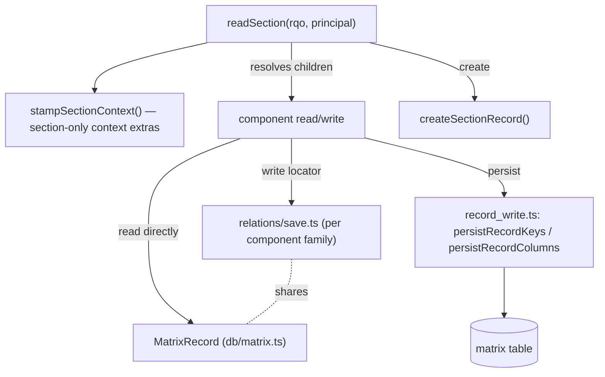

# section

> The server-side **section concept** — the runtime notion of one record *type*
> of the `matrix` table, and the module family that resolves a section's
> children, relations, permissions, metadata and search.

> See also: [Sections concept](index.md) · [section_record](section_record.md) · [sections](sections.md) · [Components](../components/index.md)

This page is the **reference** for `section`. For the conceptual model — *what
a section is*, the single `matrix` table, and the typed-JSONB storage layout —
read [Sections](index.md) first; this document does not repeat that material
at length.

!!! note "PHP class → TS modules"
    PHP's `section` (`core/section/class.section.php`, `class section extends
    common`) was one stateful object you instanced per `(tipo, mode)` via
    `section::get_instance()`. The TS rewrite keeps every *guarantee* that
    class enforced but does not keep the object: the pure contract (grouper
    registry, traversal law, audit tipos, the Activity special case) lives in
    `src/core/concepts/section.ts`; the I/O-bearing engine (context stamping,
    buttons, permissions, record lifecycle) lives in `src/core/section/`
    (`context.ts`, `buttons.ts`, `read.ts`, `record/`). There is no
    `section::get_instance()` call anywhere in the TS tree — a caller resolves
    a section's context or reads its records by calling the relevant function
    directly with a tipo, an `Rqo`, or a `Principal`.

## Role

The `section` concept is the "table with logic" idea: given a tipo, resolve
which components the section has, what permissions the current user holds over
it, how to create a record, the shared relations array, the section map and the
search query — and produce the context/data envelope the client renders. It
sits between two sibling concepts:

| concept | role |
| --- | --- |
| **`section`** *(this page)* | The section **type**: children/grouper resolution, permissions, buttons, metadata, virtual-section resolution. |
| **`sections`** | The multi-record **collection/list concept**: given an SQO, resolve and return many records of one `section_tipo` at once (list views, portals). See [`sections`](sections.md). |
| **`section_record`** | The physical **per-record I/O**: one `(section_tipo, section_id)` row, read/save/delete/duplicate. See [`section_record`](section_record.md). |

`section` does not issue SQL for record payloads itself. Persistence goes
through the write chokepoint in `src/core/section_record/record_write.ts`, and
components read their value straight off the already-decoded `MatrixRecord`
(`src/core/db/matrix.ts`) that the read engine hands down. The one payload the
section concept is uniquely responsible for describing is the **relations
array** (see [Relations](#relations-section-owned)) — though, as in PHP, the
actual mutation is performed by the relating component's own write path, not by
a generic "section" object.

## Responsibilities

- **Context.** Stamp the section-only context extras — `matrix_table`,
  `config.relation_list_tipo`, `section_map`, `buttons`, admin-path `tools` —
  onto a structure-context entry (`stampSectionContext`,
  `src/core/section/context.ts`).
- **Ontology / children.** Walk the section node's recursive children and
  filter them by model (components, buttons, list-definitions, groupers),
  recognise groupers, and resolve **virtual → real** section tipos.
- **Permissions.** Resolve the user's integer permission over the section type,
  with the `Activity` clamp.
- **Metadata.** Declare the fixed created/modified audit tipos used when a
  record is built.
- **Record lifecycle.** Create / duplicate / delete a record (delegated to
  `src/core/section/record/`, documented in full on
  [`section_record`](section_record.md)).
- **Worker hygiene.** Structurally guaranteed rather than manually maintained —
  see [The module family](index.md#the-module-family): a Bun request has
  nothing static to purge.

## Resolving a section's context

There is no `get_instance()` to call. A section's context is built as part of
the generic structure-context walk (`src/core/resolve/structure_context.ts`),
which stamps the section-only extras via `stampSectionContext` whenever the
resolved model is `'section'`:

```ts
// resolve/structure_context.ts (essence)
if (core.model === 'section') {
  await stampSectionContext(entry, { tipo, permissions, properties, principal });
}
```

```ts
// section/context.ts
export async function stampSectionContext(
  entry: StructureContextEntry,
  params: SectionStampParams,
): Promise<void> {
  entry.matrix_table = await getMatrixTableFromTipo(params.tipo);
  entry.config = { relation_list_tipo: await sectionRelationListTipo(params.tipo) };
  entry.section_map = await getSectionMap(params.tipo);
  entry.buttons = await buildSectionButtons(params.tipo, params.permissions, params.principal);
  if (params.permissions >= 3) {
    entry.tools = (await getSectionTools(params.tipo, toolConfigKeys)).tools;
  }
}
```

There is nothing analogous to PHP's size-bounded `section::$ar_section_instances`
cache (capped at 1200, trimmed by 400) to reason about — a Bun request builds
what it needs and discards it when the request ends.

## What resolving a section gives you

- **`section_tipo`** — the tipo passed to whichever function you called; there
  is no held `$tipo` property to read back.
- **Component children** — resolved on demand by a recursive `dd_ontology` CTE
  walk, gated by the traversal law in `traversalRecurses()`
  (`src/core/concepts/section.ts`, mirroring PHP's
  `get_ar_children_tipo_by_model_name_in_section()`). Components are never held
  as objects; each is resolved and its value read straight from the
  `MatrixRecord` passed down the read pipeline.
- **Permissions** — the integer permission over this section type, resolved by
  `getPermissions()` (`src/core/security/permissions.ts`) and clamped for the
  `Activity` section by `ACTIVITY_SECTION_PERMISSION_CAP`
  (`src/core/concepts/section.ts`).
- **The relations array** — the shared per-record `relation` typed column (see
  [Relations](#relations-section-owned)).
- **Metadata tipos** — the fixed audit component tipos from `AUDIT_TIPOS`
  (`src/core/concepts/section.ts`): `createdByUser` (`dd200`), `createdDate`
  (`dd199`), `modifiedByUser` (`dd197`), `modifiedDate` (`dd201`).
- **Virtual-section state** — resolved by the ontology resolver's "VIRTUAL
  SECTION fallback" (`src/core/ontology/resolver.ts`), the TS equivalent of
  PHP's `get_section_real_tipo_static()`: a virtual section keeps its own
  ontology definition while storing data under a *real* section's matrix table.

!!! note "Gaps: no held-instance API, no session SQO, no display switches"
    A few PHP `section` members have no TS equivalent yet, because the shape
    they served (a stateful instance) no longer exists or hasn't been ported:

    - `add_section_record()` / `remove_section_record()` — PHP held a
      `section_records` array on the instance; TS threads `MatrixRecord`s
      through the call explicitly instead, so there is nothing to register.
    - `get_session_sqo()` / `set_session_sqo()` / `build_sqo_id()` — the
      per-section navigation SQO PHP stored in `$_SESSION` has no TS
      equivalent (`sqo_session` is ledgered open in `rewrite/STATUS.md`).
    - `show_inspector`, `is_temp` / `save_handler = 'session'` — the
      inspector-visibility switch and session-backed temporary sections are
      not yet ported (see the [Sections concept](index.md#modes-and-permissions)
      gap note).
    - `get_diffusion_info()` / `add_diffusion_info_default()` /
      `get_publication_date()` / `get_publication_user()` — a fresh record's
      `diffusion_info` is seeded `null` (`buildRecordMetadata`,
      `src/core/section/record/create_record.ts`), but the read-side
      publication-date/user resolvers are not ported as section-level helpers.
    - `get_ar_all_section_records_unfiltered()` — no dedicated "every
      section_id, no ACL, no pagination" helper exists; callers that need this
      build their own no-limit search (see [`sections`](sections.md#the-engine--srccoresectionreadts)).

## Public API

Grouped by concern, with the real TS symbol for each PHP member that has one.

### Context & lifecycle

| PHP member | TS equivalent | purpose |
| --- | --- | --- |
| `section::get_instance()` | *(none — see note above)* | No per-tipo instance to build; call the function you need directly. |
| `stampSectionContext(entry, params)` | `src/core/section/context.ts` | Stamp the section-only context extras onto a structure-context entry. |
| `create_record($options)` | `createSectionRecord(sectionTipo, userId, now?, sectionId?)` — `src/core/section/record/create_record.ts` | Build audit metadata, insert a new row via the atomic counter allocator. Gated in `dispatch.ts`'s `create` action by `getPermissions() >= 2` (refuses the Activity section implicitly via its permission cap). |
| `clear()` | *(none needed — see [module family](index.md#the-module-family))* | Nothing static to purge; each request is isolated. |

### Relations (section-owned)

| PHP member | TS equivalent | purpose |
| --- | --- | --- |
| `get_relations($container)` | read `record.columns.relation[tipo]` directly (`MatrixRecord`, `src/core/db/matrix.ts`) | The record's locator array for one component tipo. |
| `add_relation($locator, $container)` | `src/core/relations/save.ts` (`applyAddNewElement`, per relating component) | Validate + append a locator. Not a generic section method — each relating component family (portal, dataframe, …) writes through its own save path into the same `relation` column; see `engineering/RELATIONS_SPEC.md`. |
| `remove_relation($locator, $container)` | `deletePortalLocator()` — `src/core/relations/save.ts` | Remove a locator by its identifying properties. |
| `remove_relations_from_component_tipo($options)` | *(distributed across the relation-family save paths; no single bulk-remove-by-tipo entry point documented here)* | Bulk removal is component-family-specific in the current engine. |

### Permissions

| PHP member | TS equivalent | purpose |
| --- | --- | --- |
| `get_section_permissions()` | `getPermissions(principal, sectionTipo, sectionTipo)` — `src/core/security/permissions.ts` | Resolve the integer permission, with the `Activity` clamp (`ACTIVITY_SECTION_PERMISSION_CAP`). |

### Ontology / children

| PHP member | TS equivalent | purpose |
| --- | --- | --- |
| `get_ar_children_tipo_by_model_name_in_section(...)` | recursive `dd_ontology` CTE walk, gated by `traversalRecurses()` — `src/core/concepts/section.ts` | Walk (recursively, per the traversal law) and filter children by model. |
| `get_ar_grouper_models()` | `GROUPER_MODELS` / `isGrouperModel()` — `src/core/concepts/section.ts` | The layout-grouper models that carry no data: `section_group`, `section_group_div`, `section_tab`, `tab`. |
| `get_section_real_tipo()` / `get_section_real_tipo_static()` | the "VIRTUAL SECTION fallback" in `src/core/ontology/resolver.ts` | Resolve a virtual section's real tipo. |
| `get_section_buttons_tipo()` | `buildSectionButtons(sectionTipo, permissions, principal?)` — `src/core/section/buttons.ts` | Resolve the section's permission-gated `button_*` children. |
| `get_section_map($section_tipo)` | `getSectionMap(sectionTipo)` — `src/core/ontology/section_map.ts` | The `section_map` child's properties (role→component-tipo map). |

### Search

| PHP member | TS equivalent | purpose |
| --- | --- | --- |
| `get_search_query($query_object)` / `build_sqo_id()` / `get_session_sqo()` / `set_session_sqo()` | *(out of this page's scope — see `engineering/RELATIONS_SPEC.md` / the `dedalo-search` skill; session SQO is a ledgered gap)* | Query conforming lives in the search/relations subsystems, not a section-level helper. |

### Metadata

| PHP member | TS equivalent | purpose |
| --- | --- | --- |
| `get_metadata_definition()` / `get_metadata_definition_tipos()` | `AUDIT_TIPOS` — `src/core/concepts/section.ts` | The fixed created/modified audit tipos: `createdByUser` (`dd200`), `createdDate` (`dd199`), `modifiedByUser` (`dd197`), `modifiedDate` (`dd201`). |

## How it fits with components and section_record

1. **Resolving the children.** The recursive `dd_ontology` walk filters by
   model; groupers (`GROUPER_MODELS`) carry no data and are skipped when
   collecting data-bearing components — see
   [section_group](section_group.md) / [section_tab](section_tab.md).
2. **Reading & saving a component value.** Each component reads its slice off
   the record's typed column directly and persists through
   `persistRecordKeys()` / `persistRecordColumns()`
   (`src/core/section_record/record_write.ts`) — see
   [`section_record`](section_record.md).
3. **The relations array.** Relation-bearing components write into the shared
   `relation` typed column through their own family's save path
   (`src/core/relations/save.ts` and friends), not through a generic "section"
   accessor.
4. **Worker hygiene.** No static caches to purge — see the
   [module family](index.md#the-module-family) note above.



## Examples

### Resolve a section's context and create a record

```ts
import { createSectionRecord } from '../section/record/create_record.ts';
import { getPermissions } from '../security/permissions.ts';

// 1. gate the write the same way the API dispatch does
const level = await getPermissions(principal, 'rsc197', 'rsc197');
if (level < 2) throw new Error('insufficient permissions');

// 2. create a new record; returns the new section_id
const sectionId = await createSectionRecord('rsc197', principal.userId); // e.g. 1
```

### Add and remove a relation

```ts
import { applyAddNewElement, deletePortalLocator } from '../relations/save.ts';

// add a relation through the owning component's write path (a portal here):
// creates the TARGET record (inheriting the host's project filter) and
// appends the link locator to the portal's stored items.
const added = await applyAddNewElement(
  currentItems,      // the portal's current stored items
  'oh1',              // target_section_tipo
  'rsc200',            // the portal component's own tipo (from_component_tipo)
  'rsc197',            // the HOST section_tipo
  1,                   // the HOST section_id
);
// added → { items: [...currentItems, newLocator], sectionId: newSectionId } | null

// remove a locator the same way, through the component's own delete action
const removed = await deletePortalLocator(
  principal,
  { tipo: 'rsc200', section_tipo: 'rsc197', section_id: 1 },
  { locator: { section_tipo: 'oh1', section_id: '7' } },
);
// removed → { result: <removed count>, msg: [], errors: [] }
```

!!! note "Mutations persist through the write chokepoint, not in-memory state"
    PHP's `add_relation()` / `remove_relation()` mutated the section's `$dato`
    in memory until the owning `section_record` was saved. TS has no
    equivalent in-memory staging step — each relation-family save function
    reads the current record, computes the new `relation` column value, and
    persists it through `persistRecordKeys()` in the same call.

## Related

- [Sections concept](index.md) — what a section is, the `matrix` table and the
  typed-JSONB storage model.
- [section_record](section_record.md) — the per-record physical I/O sibling.
- [sections](sections.md) — the multi-record collection/list concept.
- [Components](../components/index.md) — the fields that live inside a section.
- [Locator](../locator.md) — the pointer type stored in the relations array.
- [SQO](../sqo.md) — the search query object the read engine consumes.
