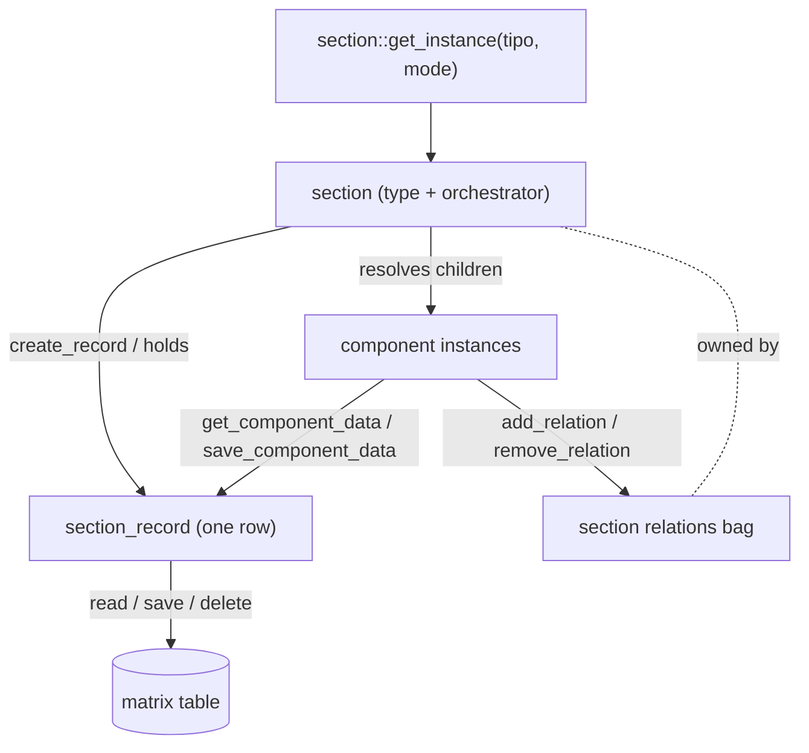

# section

> The server class `section` — the runtime object for one record *type* of the `matrix` table and the orchestrator that resolves a section's children, relations, permissions, metadata and search.

> See also: [Sections concept](index.md) · [section_record](section_record.md) · [sections](sections.md) · [Components](../components/index.md)

This page is the **class-level reference** for `section`. For the conceptual
model — *what a section is*, the single `matrix` table, and the typed-JSONB
storage layout — read [Sections](index.md) first; this document does not repeat
that material at length.

## Role

`section` (in `core/section/class.section.php`, `class section extends common`)
is the PHP runtime representation of **one section *type*** (one `section_tipo`
such as `rsc197` or `oh1`). It is the "table with logic" object: given a tipo it
resolves which components the section has, what permissions the current user
holds over it, how to create a record, the shared relations bag, the section
map and the search query — and it produces the context/data envelope the client
renders (`section_json.php`).

It sits between two sibling classes:

| class | role |
| --- | --- |
| **`section`** *(this class)* | The section **type** and orchestrator. Owns instancing, record creation, the relations API, permissions, ontology/children resolution, metadata and search. One `section` object can hold and iterate over many `section_record` instances in `list` mode. |
| **`sections`** | The multi-record **collection/list helper**: given a set of locators or a search query object it resolves and returns many records of one `section_tipo` at once (list views, portals). |
| **`section_record`** | The physical **per-record DB I/O** object: holds one `(section_tipo, section_id)` row, a `section_record_data` column store, and the `read()` / `save()` / `delete()` / `duplicate()` operations that actually touch the database. |

`section` does **not** issue SQL for record payloads. It delegates physical
persistence to `section_record`, and components in turn read and save *through*
that record. The one column `section` owns directly is the **relations bag**
(see [Relations](#relations-section-owned)).

!!! note "Inheritance"
    `section extends common`, so it inherits the shared object machinery:
    the `$tipo`, `$section_id`, `$mode`, `$lang`, `$permissions`, `$dato`,
    `$pagination` and `$uid` properties, and methods such as
    `load_structure_data()`, `get_dato()` / `set_dato()`, `get_tipo()` /
    `get_mode()`, `get_structure_context()`, `get_subdatum()` and the cache
    helper `manage_cache_size()`.

## Responsibilities

- **Lifecycle** — validate the tipo, instance (cached) one section type, create
  records, register/unregister the `section_record` instances it holds.
- **Relations bag** — own the section's single shared `relation` payload:
  read, add, remove and bulk-remove locators (the relation column is the only
  data `section` writes itself; everything else goes through `section_record`).
- **Permissions** — resolve and cache the user's integer permission over the
  section type, with the `Activity` clamp.
- **Ontology / children** — walk the section node's recursive children and
  filter them by model (components, buttons, `section_map`, …), recognise
  groupers, and resolve **virtual → real** section tipos.
- **Metadata** — declare the fixed created/modified metadata component
  definition used when a record is built.
- **Diffusion** — read/seed the section's `diffusion_info`, resolve publication
  date/user.
- **Search** — conform a query object for section-level filtering and manage the
  per-section navigation SQO stored in session.
- **Worker hygiene** — keep its static caches in `clear()` so state never bleeds
  across persistent-worker requests.

## Instantiation

```php
public static function get_instance(
    string  $tipo,                      // section ontology tipo, e.g. 'rsc197'
    string  $mode             = 'list', // 'list' | 'edit' | 'search' | 'update' | 'tm'
    bool    $cache            = true,   // reuse a cached instance when possible
    ?object $caller_dataframe = null    // set when instanced from within a dataframe
) : section|false
```

- It first resolves the tipo's `model` via `ontology_node::get_model_by_tipo()`
  and **refuses anything that is not `section`** (returns `false`, logs an
  error). It never silently builds the wrong object.
- **Caching** is keyed in the static `section::$ar_section_instances` array.
  Caching is deliberately **skipped** when `cache === false`, or when
  `mode === 'update'`, or when `mode === 'tm'` — those always return a fresh
  instance. Imports always pass `cache = false` so they never reuse a cached
  instance.
- The cache is **size-bounded**: when it grows beyond `1200` instances the
  oldest slice (the first `400`) is dropped, so a long-lived worker cannot leak
  unbounded instances.
- The private constructor sets `$lang = DEDALO_DATA_NOLAN`, resolves the data
  column name (`section_record_data::get_column_name()`), initialises the empty
  `section_records` array and pagination defaults, and calls the inherited
  `load_structure_data()` to pull the section's ontology context.

```php
// instance a section type in edit mode
$section = section::get_instance('rsc197', 'edit');
if ($section===false) {
    // tipo was not a section model, or could not be created
}
```

## What a section instance holds / resolves

- **`section_tipo`** — the section type, in the inherited `$tipo` (also via
  `get_section_tipo()`, an alias of `get_tipo()`).
- **`section_id`** — the current record id (inherited `$section_id`); empty
  until a record is created/loaded.
- **`mode`** — `list` / `edit` / `search` / `update` / `tm` (inherited
  `$mode`); part of the instance cache key.
- **`lang`** — the working language (inherited `$lang`, defaults to
  `DEDALO_DATA_NOLAN`).
- **`permissions`** — the integer permission over this section type, resolved
  and cached by `get_section_permissions()`.
- **Component children** — resolved on demand from the ontology via
  `get_ar_children_tipo_by_model_name_in_section()` /
  `get_ar_recursive_children()`. Components are *not* held as objects on the
  section; they are instanced as needed and read/save through the section's
  `section_record`.
- **The relations bag** — the shared `relations` container, read via
  `get_relations()` and mutated via `add_relation()` / `remove_relation()` /
  `remove_relations_from_component_tipo()`.
- **Metadata definition** — the fixed created/modified component descriptor from
  `get_metadata_definition()`.
- **Virtual-section state** — `section_virtual` / `section_real_tipo`, resolved
  by `get_section_real_tipo()`; a virtual section keeps its own ontology
  definition while storing data under a *real* section.
- **Storage / display switches** — `data_column_name`, `save_handler`
  (`'database'` default, `'session'` for temp sections), `is_temp`,
  `show_inspector`, the held `section_records` array.

## Public API

Grouped by concern. *static?* marks class-level (static) methods.

### Lifecycle

| method | static? | purpose |
| --- | --- | --- |
| `get_instance($tipo, $mode='list', $cache=true, $caller_dataframe=null)` | ✓ | Validate the tipo is a `section` model and return a cached (or fresh) instance. Returns `false` on failure. |
| `create_record($options=null)` | | Build metadata + modification data, insert a new row through `section_record::create()`, log a `NEW` activity entry, reset tipo-specific caches; returns the new `section_id` or `false`. The `Activity` section is refused. |
| `add_section_record($section_record)` | | Register a `section_record` in the instance's `section_records` array, keyed by its `section_id` (replaces any with the same id). |
| `remove_section_record($section_record)` | | Drop a held `section_record` by `section_id`. |
| `clear()` | ✓ | Purge the static caches (`$ar_section_instances`, `$cache_ar_children_tipo`, `$section_map_cache`) to prevent state bleed across worker requests. |

### Relations (section-owned)

| method | static? | purpose |
| --- | --- | --- |
| `get_relations($relations_container='relations')` | | Return the record's locator array from the given container (empty when the record does not exist yet). |
| `add_relation($locator, $relations_container='relations')` | | Validate the locator (must be an object with a `type`), strip the transient `paginated_key`, de-duplicate, and push it into the shared array. Returns `true` if added. |
| `remove_relation($locator, $relations_container='relations')` | | Remove by comparing identifying locator properties (`section_id`, `section_tipo`, `type`, plus any of `from_component_tipo` / `tag_id` / `component_tipo` / `section_top_tipo` / `section_top_id` present). Returns `true` if removed. |
| `remove_relations_from_component_tipo($options)` | | Bulk-remove every locator originating from a given `component_tipo`, with a dedicated `component_dataframe` match path via the unified `id_key` contract. Returns the array of deleted locators. **Does not save.** |

### Permissions

| method | static? | purpose |
| --- | --- | --- |
| `get_section_permissions()` | | Resolve the integer permission via `common::get_permissions($tipo, $tipo)`, cache it on the instance, and clamp the `Activity` section to `≤ 1` so it can never be edited. |

### Ontology / children

| method | static? | purpose |
| --- | --- | --- |
| `get_section_tipo()` | | Alias of the inherited `get_tipo()` — the section's tipo. |
| `get_section_real_tipo()` | | Resolve (and cache on the instance) the *real* tipo when this is a virtual section; sets `section_virtual` / `section_real_tipo`. |
| `get_section_real_tipo_static($section_tipo)` | ✓ | Stateless variant: returns the related real section tipo, or the same tipo when there is none. |
| `get_ar_children_tipo_by_model_name_in_section($section_tipo, $ar_model_name_required, $from_cache=true, $resolve_virtual=false, $recursive=true, $search_exact=false, $ar_tipo_exclude_elements=false, $ar_exclude_models=null)` | ✓ | The core children resolver: walk the section node's (recursive) children and filter by required model name(s), honouring virtual resolution and `exclude_elements`. Cached. |
| `get_ar_recursive_children($tipo, $ar_exclude_models=null)` | ✓ | Thin alias over `ontology_node::get_ar_recursive_children()` that excludes non-section models (`box elements`, `area`, `component_semantic_node`, plus any extra). |
| `get_ar_grouper_models()` | ✓ | The list of layout-grouper models that carry no data: `section_group`, `section_group_div`, `section_tab`, `tab`. |
| `get_section_buttons_tipo()` | | Resolve the section's button (`button_*`) tipos, merging real-section and virtual-section buttons and applying the virtual section's excluded elements. |
| `get_section_map($section_tipo)` | ✓ | Return the `properties` of the first-level `section_map` element (term/scope resolver config), trying the section as-is first and then the resolved real section. Cached. |

### Search

| method | static? | purpose |
| --- | --- | --- |
| `get_search_query($query_object)` | ✓ | Conform a query object for filtering by `section_tipo` (e.g. the thesaurus case): set the component path, resolve each sub-object through `resolve_query_object_sql()`, and return an array of query objects. |
| `build_sqo_id($tipo)` | ✓ | The single place that composes the session-SQO key for a section (currently the tipo itself). |
| `get_session_sqo($sqo_id)` | ✓ | Accessor for the per-section navigation SQO in `$_SESSION['dedalo']['config']['sqo'][$sqo_id]` (returns an object or `null`). |
| `set_session_sqo($sqo_id, $sqo)` | ✓ | Store the navigation SQO, or remove it when `null` is passed. |

### Metadata

| method | static? | purpose |
| --- | --- | --- |
| `get_metadata_definition()` | ✓ | Return the fixed metadata component descriptor: `created_by_user` (`dd200`, `component_select`), `created_date` (`dd199`, `component_date`), `modified_by_user`, `modified_date`. |
| `get_metadata_definition_tipos()` | ✓ | The list of metadata component tipos (the `tipo` of each entry above). |

### Diffusion

| method | static? | purpose |
| --- | --- | --- |
| `get_diffusion_info()` | | Read the `diffusion_info` object from the section `dato` (or `null`). |
| `add_diffusion_info_default($diffusion_element_tipo)` | | Seed a default `{date, user_id}` entry for the given diffusion element if not already present (writes through `set_dato()`); returns `true` when it set a new entry, `false` when one already existed. |
| `get_publication_date($component_tipo)` | | Resolve a localised publication date from the given date component's value. |
| `get_publication_user($component_tipo)` | | Resolve the publication user's name from the given component's value. |

### Bulk / unfiltered record access

| method | static? | purpose |
| --- | --- | --- |
| `get_ar_all_section_records_unfiltered($section_tipo)` | ✓ | Return **all** `section_id`s of a section as an array (no project/permission filter). Used by diffusion; warns on very large result sets. |
| `get_resource_all_section_records_unfiltered($section_tipo, $select='section_id')` | ✓ | The streaming variant: return the raw `PgSql\Result` to iterate with `pg_fetch_assoc()` without buffering everything in memory. |

## How it fits with components and section_record

A section is the orchestrator; the actual record I/O is `section_record`'s job,
and components only ever talk to that record — never to the database.

1. **Resolving the children.** `get_ar_children_tipo_by_model_name_in_section()`
   walks the section node's recursive children and filters by model. Groupers
   (`get_ar_grouper_models()` — `section_group`, `section_group_div`,
   `section_tab`, `tab`) carry no data and are skipped when collecting
   data-bearing components.

2. **Reading & saving a component value.** Each component instance asks the
   section's `section_record` for its slice of the right typed column
   (`section_record::get_component_data()`) and persists by writing the slice
   back (`section_record::save_component_data()` / `section_record::save()`).
   The section/`section_record` knows *where* the value is stored; the component
   knows its *shape*. This is the meaning of "sections own database access;
   components read and save through them."

3. **The relations bag.** Relation-bearing components (portal, select,
   check_box, relation_*, filter, dataframe) do **not** each keep their own
   locator list. They delegate to the section's `add_relation()` /
   `remove_relation()` / `remove_relations_from_component_tipo()`, which mutate
   the single shared `relations` container in the `dato`. This is why the
   section, not the component, owns the `relation` column.

4. **Worker hygiene.** Instances are cached statically
   (`section::$ar_section_instances`, plus `cache_ar_children_tipo` and
   `section_map_cache`). All of these are purged in `section::clear()` so a
   persistent worker does not carry one request's state into the next.



## Examples

### Instantiate a section and create a record

```php
// 1. instance the section type (refuses non-section tipos)
$section = section::get_instance('rsc197', 'edit');

// 2. create a new record; returns the new section_id (or false)
$section_id = $section->create_record(); // e.g. 1

// optionally inject initial values / force a section_id (import path)
$options = new stdClass();
$options->values     = (object)[ /* per-column data */ ];
$options->section_id = 42; // must be int; used by import processes
$forced_id = $section->create_record($options);
```

### Read, add and remove a relation

```php
$section = section::get_instance('rsc197', 'edit');

// read the current relations bag (array of locator objects)
$relations = $section->get_relations(); // container defaults to 'relations'

// add a relation (locator MUST be an object with a 'type')
$loc = new locator();
    $loc->set_type('dd63');
    $loc->set_section_tipo('oh1');
    $loc->set_section_id(7);
    $loc->set_from_component_tipo('rsc200');
$added = $section->add_relation($loc); // true if added, false if duplicate/invalid

// remove that same relation (matched by its identifying properties)
$removed = $section->remove_relation($loc); // true if removed

// bulk-remove every locator coming from one component (does NOT save)
$opts = new stdClass();
    $opts->component_tipo = 'rsc200';
$deleted = $section->remove_relations_from_component_tipo($opts);
```

!!! note "Mutations are in-memory until the record is saved"
    `add_relation()` / `remove_relation()` /
    `remove_relations_from_component_tipo()` change the section's `dato`
    relations container only. Persistence happens when the owning
    `section_record` is saved (components trigger this through the record's
    save path).

## Related

- [Sections concept](index.md) — what a section is, the `matrix` table and the
  typed-JSONB storage model.
- [section_record](section_record.md) — the per-record physical DB I/O sibling.
- [sections](sections.md) — the multi-record collection/list helper.
- [Components](../components/index.md) — the fields that live inside a section.
- [Locator](../locator.md) — the pointer type stored in the relations bag.
- [SQO](../sqo.md) — the search query object conformed by `get_search_query()`
  and stored per section via `get_session_sqo()` / `set_session_sqo()`.
