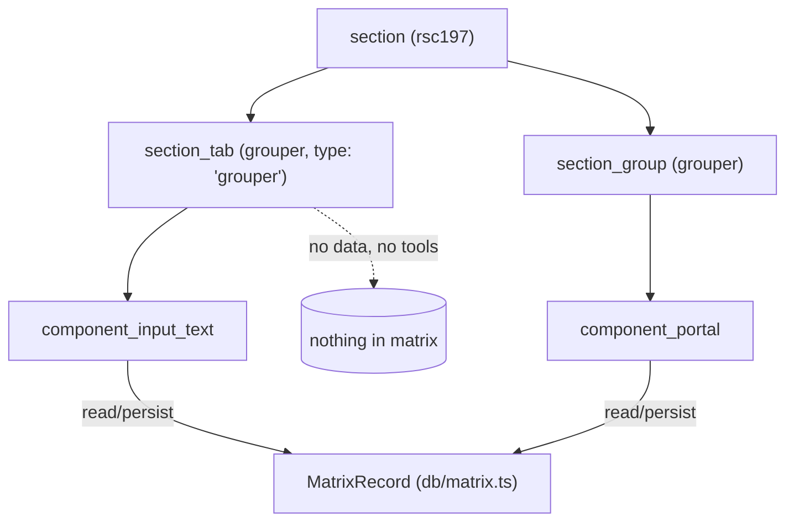

# section_tab

> The `section_tab` model — a pure **layout grouper** intended to render as a
> **tab** inside a section's edit form. It carries no data and exposes no tools.

> See also: [Sections concept](index.md) · [section](section.md) · [section_group](section_group.md) · [Components](../components/index.md)

This page is the reference for `section_tab`. For the conceptual model — what a
section is, the single `matrix` table and the typed-JSONB storage — read
[Sections](index.md) first; for the sibling layout grouper read
[section_group](section_group.md). This document does not repeat that material
at length.

As with [section_group](section_group.md), there is **no dedicated
`section_tab` module**: being a grouper is a model-level fact (`GROUPER_MODELS`
/ `isGrouperModel()`, `src/core/concepts/section.ts`), and the generic
structure-context build stamps its context the same way it stamps any other
node.

!!! warning "The tab-strip UI is not wired up"
    Read [The tab-container context is not stamped](#the-tab-container-context-is-not-stamped)
    before authoring a `section_tab` node. The model is live and resolves as a
    grouper, but the server does not yet emit the context the client needs to
    draw the clickable tab headers.

## Role

In the ontology, `section_tab` is a child node of a section under which other
elements (`section_group`s and components) are grouped. It is the tab-shaped
sibling of [`section_group`](section_group.md):

| model | role |
| --- | --- |
| **`section_group`** | A pure layout grouper that renders **inline** — a labelled block of components stacked in the form. |
| **`section_tab`** *(this page)* | A pure layout grouper meant to render as a **tab** — its children become tab panels, only one shown at a time, with per-user remembered selection. |

Both are *groupers*: they are named in `GROUPER_MODELS`
(`['section_group', 'section_group_div', 'section_tab', 'tab']`,
`src/core/concepts/section.ts`) and carry **no record data** — they hold no
`MatrixRecord` slice, write nothing to the matrix, and are skipped when a
section's children walk collects its data-bearing components (the traversal
law, `traversalRecurses()`, same module).

## The `tab` ↔ `section_tab` model remap

The ontology has **two** related model names, and only one is a first-class
model:

- `section_tab` — the canonical grouper model.
- `tab` — a legacy model, remapped to `section_tab` at model-resolution time
  by `STRUCTURAL_MODEL_REPLACEMENT_MAP`
  (`src/core/ontology/resolver.ts` — `tab: 'section_tab'`, alongside
  `section_group_div: 'section_group'`). So a node whose **stored** model is
  `tab` resolves to the *runtime* model `section_tab`.

The structure-context build (`src/core/resolve/structure_context.ts`) keeps
both facts on every entry: `model` is the resolved (remapped) name, and
`legacy_model` is the ontology's stored name when it differs. A `tab` node
therefore emits `model: 'section_tab', legacy_model: 'tab'`; a genuine
`section_tab` node emits `model: 'section_tab', legacy_model: null`.

## Responsibilities

- **Be a layout container** — declare itself in the ontology as a child of a
  section, grouping the components/groups that belong in one tab panel.
- **Carry no data** — no `MatrixRecord` slice, no read/save; excluded from the
  data-bearing component traversal (`GROUPER_MODELS`, `traversalRecurses()`).
- **Expose no tools** — because the section-only context stamp
  (`stampSectionContext`, `src/core/section/context.ts`) only runs for
  `model === 'section'`, a `section_tab` context never gets `tools`/`buttons`
  populated.
- **Build only a context** — a `section_tab` node's emitted `data` is always
  `[]`.

## Instantiation & lifecycle

There is no constructor to call: a `section_tab` node's context is produced by
the same generic structure-context build every ontology node goes through.
`isGrouperModel('section_tab')` is what tells the children-traversal walk this
node is a container to descend into rather than a data-bearing component.

## The emitted context

```json
{
    "context": [
        {
            "typo": "ddo",
            "type": "grouper",
            "tipo": "rsc12",
            "section_tipo": "rsc197",
            "model": "section_tab",
            "legacy_model": null,
            "label": "Biography",
            "permissions": 2,
            "tools": [],
            "buttons": []
        }
    ],
    "data": []
}
```

`type: 'grouper'` (`elementTypeOf()`, `src/core/resolve/structure_context.ts`)
is the same marker `section_group` gets — the client keys its wrapper CSS and
edit-mode nesting on it regardless of which grouper shape produced it.

## The tab-container context is not stamped

The client renderer (`client/dedalo/core/section_tab/js/render_section_tab.js`)
switches on `self.context.view` to decide what to draw:

- `view: 'tab'` — a **panel**: it renders nothing up front and subscribes to the
  `tab_active_<tipo>` event, becoming visible when that event fires.
- `view: 'section_tab'` — the **container**: it renders one `.tab_label` header
  per entry in `self.context.children`, wires the click handlers, publishes
  `tab_active_<tipo>` on click, and persists the selection in the local DB under
  `section_tab_<section_tipo>_<tipo>`.

**The server stamps neither.** `resolveDefaultView()`
(`src/core/resolve/structure_context.ts`) has no `section_tab` or `tab` case, so
`view` resolves to `null`; and no `children[]` array of sibling tabs is ever
built. A `section_tab` node therefore reaches the client as a generic grouper
context, and the renderer's `switch` matches neither branch — the clickable tab
strip is not drawn.

Authoring a `section_tab` today gets you a working grouper node with no tab UI.
Use [`section_group`](section_group.md) for a layout container that renders.

## How it fits with the rest of Dédalo

1. **Children resolution.** The children-traversal walk recognises
   `section_group`, `section_group_div`, `section_tab`, `tab`
   (`GROUPER_MODELS`) as containers, not data fields — skipped when collecting
   data-bearing components.
2. **Model remap.** `STRUCTURAL_MODEL_REPLACEMENT_MAP` remaps `tab` →
   `section_tab`; `legacy_model` preserves the original stored name for any
   caller that needs to distinguish the panel from the container.
3. **Context only.** Like every grouper, the only thing a `section_tab` node
   ships to the client is a context; data I/O is the job of
   [`section`](section.md) → [`section_record`](section_record.md), and field
   values come from the [components](../components/index.md) that live
   *inside* the tab.
4. **No tools.** A grouper's context never gets `tools`/`buttons` populated —
   see [Responsibilities](#responsibilities) above.



## Related

- [Sections concept](index.md) — what a section is, the `matrix` table, and the
  module family (`section` / `section_record` / `section_group` /
  `section_tab`).
- [section](section.md) — the section concept that resolves these groupers as
  children and owns record data.
- [section_group](section_group.md) — the inline-block sibling grouper (same
  no-data contract, and the one that renders today).
- [section_record](section_record.md) — the per-record I/O that actually
  stores the values rendered inside a tab.
- [Components](../components/index.md) — the data-bearing fields that live
  inside a `section_tab`.
- [Architecture overview](../architecture_overview.md) — areas → sections →
  groupers → components → data, and the server-describes / client-draws split.
