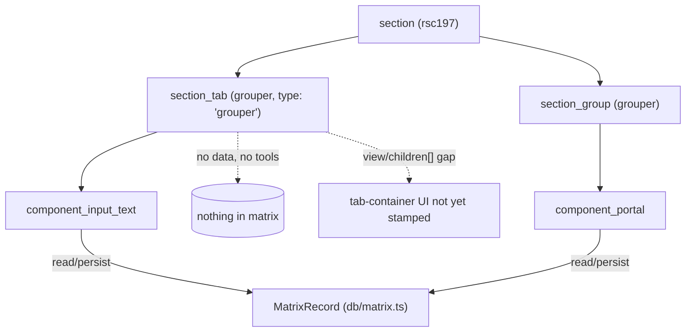

# section_tab

> The `section_tab` model — a pure **layout grouper** that renders as a **tab**
> inside a section's edit form. It carries no data and exposes no tools.

> See also: [Sections concept](index.md) · [section](section.md) · [section_group](section_group.md) · [Components](../components/index.md)

This page is the reference for `section_tab` (the model **and** its
unmodified client renderer). For the conceptual model — what a section is, the
single `matrix` table and the typed-JSONB storage — read [Sections](index.md)
first; for the sibling layout grouper read
[section_group](section_group.md). This document does not repeat that
material at length.

!!! note "PHP class → TS: no per-model class, same as section_group"
    PHP's `section_tab` (`core/section_tab/class.section_tab.php`) was a
    ~40-line shell over `common`, near-identical to `section_group`, whose only
    behaviour beyond construction was `get_tools() → []`. As with
    [section_group](section_group.md), the TS rewrite has no dedicated
    `section_tab` module: being a grouper is a model-level fact
    (`GROUPER_MODELS` / `isGrouperModel()`, `src/core/concepts/section.ts`),
    and the generic structure-context build stamps its context the same way it
    stamps any other node. See the gap noted below, though — the *tab
    container* behaviour PHP's controller added on top of the generic grouper
    context (listing sibling tabs) has not been ported yet.

## Role

In the ontology, `section_tab` is a child node of a section under which other
elements (`section_group`s and components) are grouped, and on the client it
renders as a **tab**: a clickable tab header that shows/hides one panel of the
form at a time. It is the tab-shaped sibling of
[`section_group`](section_group.md):

| model | role |
| --- | --- |
| **`section_group`** | A pure layout grouper that renders **inline** — a labelled block of components stacked in the form. |
| **`section_tab`** *(this page)* | A pure layout grouper that renders as a **tab** — its children become tab panels, only one shown at a time, with per-user remembered selection. |

Both are *groupers*: they are named in `GROUPER_MODELS`
(`['section_group', 'section_group_div', 'section_tab', 'tab']`,
`src/core/concepts/section.ts`) and carry **no record data** — they hold no
`MatrixRecord` slice, write nothing to the matrix, and are skipped when a
section's children walk collects its data-bearing components (the traversal
law, `traversalRecurses()`, same module).

## The `tab` ↔ `section_tab` model remap

One subtlety carries over unchanged from PHP. The ontology has **two** related
model names, and only one is a first-class model:

- `section_tab` — the canonical grouper model.
- `tab` — a legacy model, remapped to `section_tab` at model-resolution time
  by `STRUCTURAL_MODEL_REPLACEMENT_MAP`
  (`src/core/ontology/resolver.ts` — `tab: 'section_tab'`, alongside
  `section_group_div: 'section_group'`). So a node whose **stored** model is
  `tab` resolves to the *runtime* model `section_tab`.

The structure-context build (`src/core/resolve/structure_context.ts`) keeps
both facts on every entry: `model` is the resolved (remapped) name, and
`legacy_model` is the ontology's stored name when it differs — the direct TS
equivalent of PHP's `get_legacy_model_by_tipo()`. A `tab` node therefore emits
`model: 'section_tab', legacy_model: 'tab'`; a genuine `section_tab` node emits
`model: 'section_tab', legacy_model: null`.

## Responsibilities

- **Be a layout container** — declare itself in the ontology as a child of a
  section, grouping the components/groups that render inside one tab panel.
- **Carry no data** — no `MatrixRecord` slice, no read/save; excluded from the
  data-bearing component traversal (`GROUPER_MODELS`, `traversalRecurses()`).
- **Expose no tools** — because the section-only context stamp
  (`stampSectionContext`, `src/core/section/context.ts`) only runs for
  `model === 'section'`, a `section_tab` context never gets `tools`/`buttons`
  populated — the same guarantee PHP's `get_tools() → []` override gave.
- **Build only a context** — a `section_tab` node's emitted `data` is always
  `[]`.

## Instantiation & lifecycle

There is no constructor to call: a `section_tab` node's context is produced by
the same generic structure-context build every ontology node goes through.
`isGrouperModel('section_tab')` is what tells the children-traversal walk this
node is a container to descend into rather than a data-bearing component.

## The emitted context

```json
{
    "context": [
        {
            "typo": "ddo",
            "type": "grouper",
            "tipo": "rsc12",
            "section_tipo": "rsc197",
            "model": "section_tab",
            "legacy_model": null,
            "label": "Biography",
            "permissions": 2,
            "tools": [],
            "buttons": []
        }
    ],
    "data": []
}
```

`type: 'grouper'` (`elementTypeOf()`, `src/core/resolve/structure_context.ts`)
is the same marker `section_group` gets — the client keys its wrapper CSS and
edit-mode nesting on it regardless of which grouper shape produced it.

!!! warning "Gap: the tab-container behaviour (view + sibling children[])"
    PHP's `section_tab_json.php` controller did more than stamp a generic
    grouper context: reading the **legacy** model
    (`get_legacy_model_by_tipo`), it set `context->view = 'tab'` for a legacy
    `tab` node (a single panel that just listens for its own
    `tab_active_<tipo>` event), or `context->view = 'section_tab'` plus a
    `context->children[]` array of `{tipo, label}` for the section's other
    valid tabs (a `tab` **container** — the clickable header strip). The
    unmodified client (`render_section_tab.js`) branches on exactly that
    `context.view` / `context.children` shape to decide whether it is
    rendering a tab panel or the tab-header container.

    The TS structure-context build does not stamp `view` or `children` for a
    `section_tab`/`tab` node at all yet (`resolveDefaultView()`,
    `src/core/resolve/structure_context.ts`, has no `section_tab` case). This
    means a tabbed section's tab-header UI is **not yet functionally ported**
    on the TS server — the generic grouper context is emitted, but the
    sibling-tab enumeration and the container/panel `view` distinction PHP's
    dedicated controller built are a real gap to close.

## Client side (`section_tab.js` + `render_section_tab.js`, unchanged)

The vanilla-JS client is copied as-is; its behaviour is unaffected by the
server rewrite except insofar as the context it receives is incomplete (see
the gap above). For reference, once `view`/`children` are stamped correctly:

- **`view: 'tab'`** — nothing is rendered up front; the wrapper subscribes to
  `event_manager` topic `tab_active_<tipo>` and adds the `active` class when
  that event fires (so its panel becomes visible).
- **`view: 'section_tab'`** (the container) — for each `context.children`
  entry it creates a `.tab_label` header, wires a click handler, and on click
  publishes `tab_active_<tipo>` (showing the matching panel) and persists the
  selection to the local DB under `section_tab_<section_tipo>_<tipo>`.
- On render it restores the last-selected tab from the local DB, falling back
  to the first tab if the stored one is unavailable (hidden by permissions or
  excludes).

## How it fits with the rest of Dédalo

1. **Children resolution.** The children-traversal walk recognises
   `section_group`, `section_group_div`, `section_tab`, `tab`
   (`GROUPER_MODELS`) as containers, not data fields — skipped when collecting
   data-bearing components.
2. **Model remap.** `STRUCTURAL_MODEL_REPLACEMENT_MAP` remaps `tab` →
   `section_tab`; `legacy_model` preserves the original stored name for any
   caller that needs to distinguish the panel/container views (once that
   distinction is implemented — see the gap above).
3. **Context only.** Like every grouper, the only thing a `section_tab` node
   ships to the client is a context; data I/O is the job of
   [`section`](section.md) → [`section_record`](section_record.md), and field
   values come from the [components](../components/index.md) that live
   *inside* the tab.
4. **No tools.** A grouper's context never gets `tools`/`buttons` populated —
   see [Responsibilities](#responsibilities) above.



## Related

- [Sections concept](index.md) — what a section is, the `matrix` table, and the
  module family (`section` / `section_record` / `section_group` /
  `section_tab`).
- [section](section.md) — the section concept that resolves these groupers as
  children and owns record data.
- [section_group](section_group.md) — the inline-block sibling grouper (same
  no-data contract, same `get_tools() → []` guarantee).
- [section_record](section_record.md) — the per-record I/O that actually
  stores the values rendered inside a tab.
- [Components](../components/index.md) — the data-bearing fields that live
  inside a `section_tab`.
- [Architecture overview](../architecture_overview.md) — areas → sections →
  groupers → components → data, and the server-describes / client-draws split.
