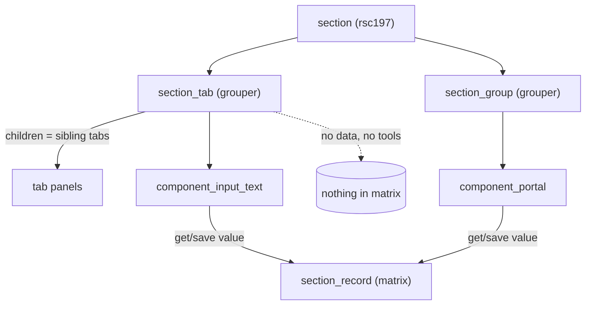

# section_tab

> The server class `section_tab` — a pure **layout grouper** that renders as a **tab** inside a section's edit form. It carries no data and exposes no tools.

> See also: [Sections concept](index.md) · [section](section.md) · [section_group](section_group.md) · [Components](../components/index.md)

This page is the reference for `section_tab` (the PHP class **and** its client
renderer). For the conceptual model — what a section is, the single `matrix`
table and the typed-JSONB storage — read [Sections](index.md) first; for the
sibling layout grouper read [section_group](section_group.md). This document does
not repeat that material at length.

## Role

`section_tab` (in `core/section_tab/class.section_tab.php`,
`class section_tab extends common`) is a **layout-only container**. In the
ontology it is a child node of a section under which other elements
(`section_group`s and components) are grouped, and on the client it renders as a
**tab** in the section's form: a clickable tab header that shows/hides one panel
of the form at a time.

It is the tab-shaped sibling of [`section_group`](section_group.md):

| class | model | role |
| --- | --- | --- |
| **`section_group`** | `section_group` | A pure layout grouper that renders **inline** — a labelled block of components stacked in the form. |
| **`section_tab`** *(this class)* | `section_tab` | A pure layout grouper that renders as a **tab** — its children become tab panels, only one shown at a time, with per-user remembered selection. |

Both are *groupers*: they are listed in `common::$groupers`
(`['section_group', 'section_group_div', 'section_tab', 'tab']`) and in
`section::get_ar_grouper_models()`. Groupers carry **no record data** — they hold
no `dato`, write nothing to the matrix, and are skipped when a section collects
its data-bearing component children. Both classes are deliberately near-identical
~40-line shells over [`common`](#); the only behaviour they add beyond
construction is short-circuiting `get_tools()` to return `[]`.

!!! note "Inheritance"
    `section_tab extends common`, so it inherits the shared object machinery:
    the `$tipo`, `$section_tipo`, `$mode`, `$lang`, `$label` properties, the
    magic `get_X()`/`set_X()` accessors, `load_structure_data()` (which pulls the
    node's ontology context on construction), `get_structure_context()` (which
    builds the `{context}` envelope) and `build_element_json_output()`. It does
    **not** add a factory, a data API, relations, permissions logic or search of
    its own.

## The `tab` ↔ `section_tab` model remap

There is one subtlety worth stating up front. The ontology has **two** related
model names, and they are *not* both first-class v7 models:

- `section_tab` — the canonical v7 grouper model.
- `tab` — a legacy model. At model-resolution time `ontology_node::get_model()`
  remaps `'tab' => 'section_tab'` (alongside other legacy remaps like
  `'section_group_div' => 'section_group'`). So **a node whose stored model is
  `tab` is instantiated as a `section_tab` PHP object** — there is no separate
  `tab` class.

The JSON controller still needs to know which of the two it started from, so it
reads the **unremapped** legacy model via
`ontology_node::get_legacy_model_by_tipo($tipo)` and branches on it to pick the
client `view` (`'tab'` vs `'section_tab'`). The comment in the controller spells
it out: *"'tab' ontology items are mapped as 'section_tab' to reduce
pollution."* In other words: one class, two views.

## Responsibilities

- **Be a layout container** — declare itself in the ontology as a child of a
  section, grouping the components/groups that render inside one tab panel.
- **Carry no data** — it holds no `dato`, performs no read/save, and is excluded
  from the data-bearing component traversal (`common::$groupers`,
  `section::get_ar_grouper_models()`).
- **Expose no tools** — `get_tools()` is overridden to return `[]` so the tools
  resolver never tries to attach section-level tools to a grouper.
- **Build only a context** — its JSON controller emits a `{context}` with an
  empty `data` array; the controller decides the client `view` and, for the
  `section_tab` view, lists the section's sibling tab children.
- **Render the tab UI on the client** — the JS module (`section_tab.js` +
  `render_section_tab.js`) builds the tab headers, wires click handling, and
  persists/restores the active tab per user via the local DB.

## Instantiation & lifecycle

`section_tab` does **not** define `get_instance()`. Like `section_group`, it is
constructed directly (it is instanced by the section build / element loader, not
by callers). Its constructor mirrors `section_group`'s exactly:

```php
public function __construct(
    $tipo,          // the section_tab ontology tipo
    $section_tipo,  // the owning section's tipo
    $mode           // 'edit' | 'list' | …
)
```

```php
// construct a section_tab grouper for the People section
$section_tab = new section_tab('rsc12', 'rsc197', 'edit');
// $section_tab->get_tools() === []  (always empty for groupers)
```

The constructor sets `$tipo`, `$section_tipo`, `$mode`, forces
`$lang = DEDALO_DATA_LANG`, and calls the inherited `load_structure_data()` to
populate `ontology_node`, `model` and `label` from the ontology. There is no
per-process instance cache for `section_tab` (it has no `get_instance()`); the
inherited `common` structure-context cache still applies to its
`get_structure_context()` output.

!!! note "No data, no `section_id`"
    Because a grouper owns no record data, no `section_id` is passed to or used
    by the constructor. A `section_tab` describes *where things go in the form*,
    not *what is stored*.

## Public API / Key methods

`section_tab` adds exactly **one** method of its own; everything else is
inherited from [`common`](#).

| method | static? | purpose |
| --- | --- | --- |
| `__construct($tipo, $section_tipo, $mode)` | | Set identity (`tipo`, `section_tipo`, `mode`, `lang = DEDALO_DATA_LANG`) and call `load_structure_data()`. |
| `get_tools()` | | **Overridden** to always return `[]` — a grouper never carries tools. (Comment in source: *"Catch get_tools call to prevent load tools sections."*) |

Inherited from `common` and used by `section_tab`'s controller:

| method | static? | purpose |
| --- | --- | --- |
| `load_structure_data()` | | Lazily pull the node's ontology context (`ontology_node`, `model`, `label`) once. |
| `get_structure_context($permissions)` | | Build the `{context}` object (tipo, properties, css, view, label, …) the client renders. |
| `get_tipo()` / `get_section_tipo()` | | Identity accessors via the magic `get_X()`. |
| `build_element_json_output($context, $data)` | ✓ | Pack `{context, data}` for the wire (data is always `[]` here). |

!!! warning "Do not invent a data API"
    `section_tab` has **no** `get_dato()`/`set_dato()`, **no** relations methods,
    **no** `create_record`, **no** permissions resolver and **no** search. Those
    belong to [`section`](section.md) / [`section_record`](section_record.md).
    The only thing `section_tab` produces is a context.

## Files & structure

```text
core/section_tab/
├── class.section_tab.php       # the PHP grouper class (~43 lines)
├── section_tab_json.php        # JSON controller: builds {context}, data = []
├── css/
│   ├── section_tab.less        # tab header + panel styling
│   └── section_tab.css.map
└── js/
    ├── section_tab.js          # client object (init, prototype wiring)
    └── render_section_tab.js   # edit-mode renderer (tab headers, active-tab state)
```

### Server: `section_tab_json.php`

Included by `common::get_json()` inside the object scope (it fails closed with a
`404` if reached directly over HTTP — SEC-026). It resolves `permissions` via
`common::get_permissions($section_tipo, $tipo)` and, when `get_context===true`
and `permissions>0`, builds the context:

```php
$current_context = $this->get_structure_context($permissions);

$legacy_model = ontology_node::get_legacy_model_by_tipo($tipo);
if ($legacy_model==='tab') {
    // legacy 'tab' node → simple tab panel
    $current_context->view = 'tab';
} else {
    // 'section_tab' node → tab *container* that lists its sibling tabs
    $current_context->view     = 'section_tab';
    $current_context->children = [];

    $ontology_node = ontology_node::get_instance($tipo);
    $children_tipo = $ontology_node->get_ar_children_of_this();

    // the valid tabs of the owning section
    $valid_tabs = section::get_ar_children_tipo_by_model_name_in_section(
        $section_tipo,
        ['section_tab','tab'],
        true, true, true, true
    );

    foreach ($children_tipo as $child_tipo) {
        if (!in_array($child_tipo, $valid_tabs)) continue;
        $current_context->children[] = (object)[
            'tipo'  => $child_tipo,
            'label' => ontology_node::get_term_by_tipo($child_tipo, DEDALO_APPLICATION_LANG)
        ];
    }
}

$data = []; // groupers never carry data
return common::build_element_json_output($context, $data);
```

So the two views differ in what the controller stamps:

| `view` | comes from | extra context | client behaviour |
| --- | --- | --- | --- |
| `'tab'` | legacy `tab` node | none | a single tab **panel**; it subscribes to its own `tab_active_<tipo>` event and shows itself when that tab is selected. |
| `'section_tab'` | `section_tab` node | `children[]` ( `{tipo, label}` of the section's valid tabs) | the tab **container**: renders one clickable header per child tab, manages which is active. |

This mirrors `section_group_json.php`, which likewise builds only a context
(branching on `context_type` for the `simple` variant and toggling `add_label`
for `section_group_div`) and returns `data = []`.

### Client: `section_tab.js` + `render_section_tab.js`

The client object (`section_tab.js`) is a plain constructor whose prototype
borrows `build`/`render`/`destroy` from `common` and `list`/`edit` from
`render_section_tab`. It holds the usual identity fields plus `context`,
`children` and `node`, and its `init(options)` copies them off the incoming ddo
(`self.label = self.context.label`). It also has a stubbed
`get_panels_status()` (reads `section_tab`/`context` from the local DB —
marked *"UNDER CONSTRUCTION"*).

`render_section_tab.prototype.edit(options)` does the real work, branching on
`self.context.view`:

- **`'tab'`** — nothing is rendered up front; the wrapper subscribes to
  `event_manager` topic `tab_active_<tipo>` and adds the `active` class when that
  event fires (so its panel becomes visible).
- **`'section_tab'`** (default) — for each `context.children` entry it creates a
  `.tab_label` header `div`, attaches a `click` handler, and on click calls the
  local `active_tab()` which:
    1. clears `active` from all sibling headers,
    2. `event_manager.publish('tab_active_'+tipo, …)` so the matching panel shows,
    3. persists the selection to the local DB under id
       `section_tab_<section_tipo>_<tipo>` (table `status`) via
       `data_manager.set_local_db_data`,
    4. marks the clicked header `active`.

  On render it restores the last-selected tab from the local DB
  (`get_local_db_data(status_id, 'status')`), falling back to the **first** tab;
  if the stored tab is unavailable (e.g. hidden by permissions/excludes) it falls
  back to the first available header, and only activates if a valid node exists
  (guarding against blocking access to the whole section).

The wrapper class string is
`wrapper_<type> <tipo> <section_tipo>_<tipo> <view> <mode>`, and any `context.css`
is applied through `set_element_css` keyed by `<section_tipo>_<tipo>.edit`.

### Styling: `section_tab.less`

Scoped under `.wrapper_grouper.section_tab.edit`. It styles the `.tab_label`
headers (inline-block, hover, and an `.active` state with the orange Dédalo top
border) and the `.tab` panels (`display: none`, becoming `display: grid` when
`.active`). So tab switching is CSS-driven by the `active` class that the JS
toggles.

## How it fits with the rest of Dédalo

`section_tab` is one of the layout primitives a section is built from. When a
section's form is assembled:

1. **Children resolution.** `section` walks its recursive ontology children
   (`section::get_ar_children_tipo_by_model_name_in_section()`,
   `get_ar_recursive_children()`). Groupers — `section_group`, `section_group_div`,
   `section_tab`, `tab` (`section::get_ar_grouper_models()`) — are recognised as
   containers, **not** data fields, so they are skipped when collecting
   data-bearing components. The controller for a `section_tab` node calls
   `get_ar_children_tipo_by_model_name_in_section($section_tipo, ['section_tab','tab'], …)`
   to find the section's *sibling* tabs and list them as `children`.

2. **Model remap.** `ontology_node::get_model()` remaps legacy `'tab'` →
   `'section_tab'`, so both kinds of node instantiate the same class; the
   controller re-reads the **legacy** model via
   `ontology_node::get_legacy_model_by_tipo()` to choose the client `view`.

3. **Context only.** Like every grouper, the only thing it ships to the client is
   a `{context}` (the description). It never touches the matrix; data I/O is the
   job of [`section`](section.md) → [`section_record`](section_record.md), and
   field values come from the [components](../components/index.md) that live
   *inside* the tab.

4. **No tools.** `get_tools()` returns `[]`, so the tools resolver
   (`common::get_tools()`) attaches nothing to a tab.



## Related

- [Sections concept](index.md) — what a section is, the `matrix` table, and the
  four-class family (`section` / `section_record` / `section_group` /
  `section_tab`).
- [section](section.md) — the section type & orchestrator that resolves these
  groupers as children and owns record data.
- [section_group](section_group.md) — the inline-block sibling grouper (same
  ~40-line shell, `get_tools()` → `[]`).
- [section_record](section_record.md) — the per-record physical DB I/O that
  actually stores the values rendered inside a tab.
- [Components](../components/index.md) — the data-bearing fields that live inside
  a `section_tab`.
- [Architecture overview](../architecture_overview.md) — areas → sections →
  groupers → components → data, and the server-describes / client-draws split.
