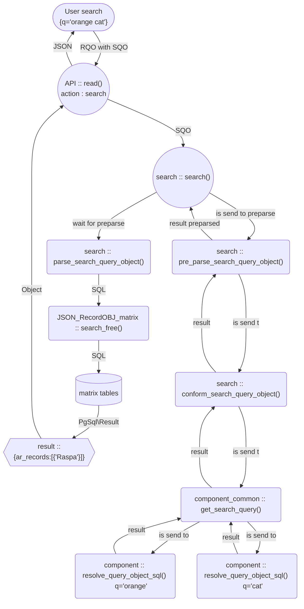
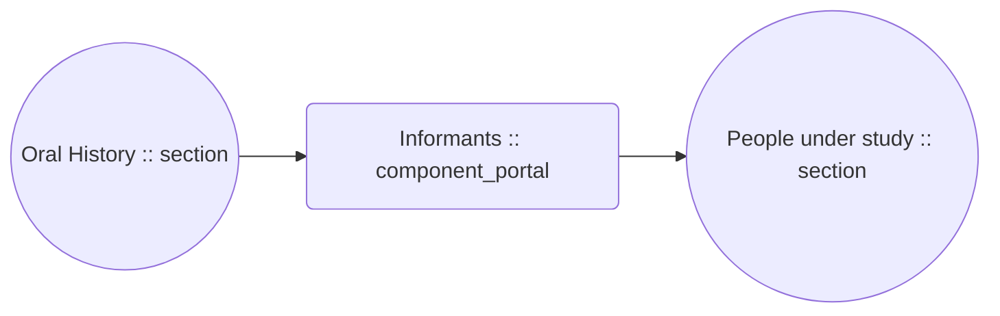
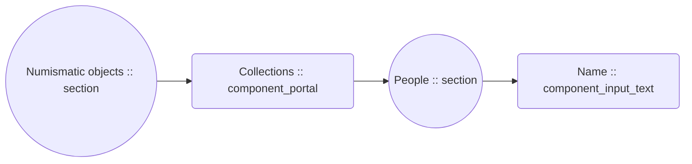

# Search Query Object

## Introduction

Search Query Object or SQO, is a JSON object definition to be used as an abstraction of classical SQL. To create a flexible system with NoSQL and dependent on Dédalo ontology, it becomes necessary to use a flexible definition of the database query. Dédalo doesn't have columns and we need to search data in the same way as classical SQL. We changed SQL model to NoSQL in v4 in 2012, at this time PostgreSQL(v9.2) introduced JSON format but with a very simple JSON query.

So we came to define a search query object, because we knew that early PostgreSQL JSON search definitions will be replaced with a more robust system. And we want to make searches compatible with ontology changes, we don't want to use predefined searches.

## Search Query Object - SQO definition

> ./core/common/class.search_query_object.php

**search_query_object** `object`

Search Query Object defines an object with normalized properties to create a database query. Dédalo SQO definition is inspired by Mango query language interface of Apache [CouchDB](https://docs.couchdb.org/en/stable/api/database/find.html).

## Search flow

Search Query Object is send as part of Request Query Object to be processed by server API, the Search Query Object is parsed by Search Class and processed by every component involve into the query, the SQO parsed will be used to create the final SQL to be sent to the DDBB. The final result will send to client in JSON format.



## Parameters

- **id** : `string` section_tipo and other params to define the unique id **optional** | ex : oh1
- **section_tipo** : `array || string` array of section_tipo or string with the section_tipo for search **mandatory** | ex : `['oh1']`
- **mode** : `string` ('edit' || 'list' || 'tm' || 'related') configure the sqo for search witch different models of matrix tables into the DDBB **optional** | ex : 'list'
- **filter** : `object` definition of the filter to be apply at search **optional**
  - **operator** : `array of objects` operator key define the operator ('\$and' || '\$or') they are identified by the use of a dollar sign (\$) prefix in the name property, array value has the arguments `objects` to be affected by operator. **mandatory**, `{"$operator": [arguments]}`
    - **q** : `string` string to search **mandatory**, ex: 'John'
    - **q_operator** : `string` operator to be applied to q ,  **optional**, ex: '<'
    - **path** : `array of objects` array of components creating a sequential path of the component to be searched,  **mandatory**, ex: `[{"section_tipo":"oh1", "component_tipo":"oh24"},{"section_tipo":"rsc197", "component_tipo":"rsc85"}]}`
    - **format** : `string` ('direct' || 'array_elements' || 'typeof' || 'column' || 'in_column' || 'function') used to change the WHERE format **optional**, ex: 'direct'
    - **use_function** : `string` if format is function use_function define the PostgreSQL function to be used. **optional**, ex: 'relations_flat_fct_st_si'
    - **q_split** : `bool` (true || false) defines if the q need to be split into multiple WHERE queries. Default : true **optional**, ex: 'false'
    - **unaccent** : `bool` (true || false) defines if the q will us the unaccent function to remove accent characters in WHERE **optional**, ex: 'false'
    - **type** : `string` ('jsonb' || 'string)  defines the type of data to be searched **optional**, ex: 'jsonb'
- **limit** : `int` records limit **optional**, ex: 10
- **offset** : `int` records offset **optional**, ex: 10
- **full_count** : `bool` (true || false) get the total records found and set the total with it **optional**, ex: true
- **order** : `array of objects` set the order of the records, every object in the array will be a column with his paths and direction **optional** `[{"direction": "ASC", "path":[{ddo},{ddo}]}]]`
  - **direction** : `string` (ASC || DESC) sort direction of the column **optional**, ex: 'DESC'
  - **path** : `array of objects` the [ddo](dd_object.md) object that defines the path of the column beginning from the main section of the filter and path of ddo to the component in related section/s. **optional** `[{"section_tipo":"oh1","component_tipo":"oh24"},{"section_tipo":"rsc197", "component_tipo":"rsc85"}]`
- **order_custom** : `object` order by specific values **optional**, ex: `[{"section_tipo": section_tipo, "column_name": column_name, "column_values": [values]}}`
  - **section_tipo** : `string` name of section to be used to be ordered **optional**
  - **column_name** : `string` name of the column to be ordered **optional**
  - **column_values** : `array` the array defines the order of the values **optional**
- **filter_by_locators** : `array of objects` set a order by locators, every object is a [locator](locator.md) and the order of the array will be respected **optional** ex : `[{"section_tipo":"oh1", "section_id":"8"},{"section_tipo":"oh1", "section_id":"3"}]`
- **allow_sub_select_by_id** : `bool` (true || false) create a sub select in the SQL query to select pass the filter and get the id to select the main section default : true **optional** .
- **children_recursive** : `bool` (true || false) filter the term of hierarchy and get the all children nodes dependents of the searched term. Default : false  **optional**
- **remove_distinct** : `bool` (true || false) remove duplicates records when the SQL query has a sub select with multiple criteria that can get duplicate records. Default : false **optional**
- **skip_projects_filter** : `bool` (true || false) remove the mandatory filter of the component_filter applied at all users except root and global admin users. Default : false **optional**
- **parsed** : `bool` (true || false) state of the sqo, it indicates if the filter was parsed by the components to add operators to the q. It's used as internal property, but is possible parse it manually and indicate this state. Default false  **optional**
- **select** : `array of objects` array of ddo with defines the SELECT parameter **DEPRECATED DO NOT USED IN V6**

### Summary

```json
id                      : 'oh1' // optional. section_tipo and other params to define the unique id
section_tipo            : ['oh1'] // array of section_tipo for search
mode                    : ('edit' || 'list' || 'tm' || 'related') // configure the sqo for search witch different models of matrix tables into the DDBB
filter                  : {
                                operator : // string ('$and' || '$or')
                                    [{
                                        q           : '2'   // string to search
                                        q_opeator   : '<'   // string || null
                                        path        : [{    // array of components creating a sequential path
                                                            section_tipo
                                                            component_tipo
                                                        }]
                                        format      : 'direct' || 'array_elements' || 'typeof' || 'column' || 'in_column' || 'function' // string, use to change the WHERE format
                                        use_function : 'relations_flat_fct_st_si' // if format is function use_function define the PostgreSQL function to be used.
                                        q_split     : true || false // bool, define if the q need to be split into multiple WHERE queries
                                        unaccent    : true || false // bool, define if the q will us the unaccent function in WHERE
                                        type        : 'jsonb' || 'string' // define the type of data to be searched
                                    }]
                            } || null
limit                   : 1 // int
offset                  : 2 // int
full_count              : (true || false || 4) // boolean or int (int disable the function for full count and get the number as total)
order                   : [{
                                direction   : (ASC || DESC) // string
                                path        : [{
                                    section_tipo
                                    component_tipo
                                }]
                            }]
order_custom            : {
                            column_name : [values]
                            }
filter_by_locators      : [{
                                section_tipo
                                component_tipo
                            }]
allow_sub_select_by_id  : (true || false) // default true
children_recursive      : (true || false) // default false
remove_distinct         : (true || false) // default false
skip_projects_filter    : (true || false) // default false
parsed                  : (true || false) // boolean, state of the sqo | default false
select                  : [{    //DEPRECATED | array of objects optional
                            section_tipo
                            component_tipo
                        }]
```

## Using SQO

Search Query Object is used to get data from database. It use section_tipo to point specific section/s to get data and it use ddo to define the properties to be searched in q.

If you want to get any person with name "Ana" the sqo will be:

``` json
{
  "section_tipo": "rsc197",
  "filter": {
    "$and": [{
        "q": "Ana",
        "path": [{
            "section_tipo": "rsc197",
            "component_tipo": "rsc85"
          }]
      }]
  }
}
```

The SQO say: search in people under study (section_tipo [rsc197](https://dedalo.dev/ontology/rsc197)) with the path to name field (component_tipo [rsc85](https://dedalo.dev/ontology/rsc85)) with the Ana text. SQO will parse the filter with the component_input_text rsc85 and will render into SQL to be used in postgreSQL:

```sql

SELECT DISTINCT ON (rs197.section_id) rs197.section_id,
rs197.section_tipo,
rs197.datos
FROM matrix AS rs197
WHERE rs197.id in (
    SELECT DISTINCT ON(rs197.section_id,rs197.section_tipo) rs197.id 
    FROM matrix AS rs197
    WHERE (
            rs197.section_tipo='rsc197') AND 
            rs197.section_id>0  AND 
            (f_unaccent(rs197.datos#>>'{components,rsc86,dato}') ~* f_unaccent('.*\[".*Ana.*'))
    ORDER BY rs197.section_id ASC
    LIMIT 10
)
ORDER BY rs197.section_id ASC
LIMIT 10;

```

## Definitions

### id

The property id is used to identify a SQO in the process to build, send and retrieve information from server.

In Dédalo API calls it's possible send multiple request and it's necessary a way to identify the original SQO with the result. The property id is used to this function.

Example: Search 'Ana' in the field name [rsc85](https://dedalo.dev/ontology/rsc85) of the section People under study [rsc197](https://dedalo.dev/ontology/rsc197)

``` json
{
  "id": "my_id_for_the_request",
  "section_tipo": "rsc197",
  "filter": {
    "$and": [{
        "q": "Ana",
        "path": [{
            "section_tipo": "rsc197",
            "component_tipo": "rsc85"
          }]
      }]
  }
}
```

### section_tipo *mandatory*

Defines the section/s of the search. It can be a string when the search is for one section or it can be array when the search is with multiple sections as toponymy search in multiple countries as Spain, France, ... (es1, fr1, ...).

Definition : `array || string` array of section_tipo or string with the section_tipo for search **mandatory** | ex : `['oh1']`

Section is a mandatory property, it define where we want to do the search, where the data is that we are looking for.
Is possible use a string or array when the section to search is only one, but it's recommendable to use always a array definition. Using the array is extensible and it's possible add new section easily.

Example with one section: Search '87C_g25' in the field Code [oh14](https://dedalo.dev/ontology/oh14) of the section Oral History [oh1](https://dedalo.dev/ontology/oh1)

```json
{
  "section_tipo": "oh1",
  "filter": {
    "$and": [{
        "q": "87C_g25",
        "path": [{
            "section_tipo": "oh1",
            "component_tipo": "oh14"
          }]
      }]
  }
}
```

Example with multiple sections: Search 'Benimamet' in the field Term [hierarchy25](https://dedalo.dev/ontology/hierarchy25) of the sections Spain es1 and France fr1

```json
{
  "section_tipo": ["es1", "fr1"],
  "filter": {
    "$and": [{
        "q": "Benimamet",
        "path": [
            {
              "section_tipo": "es1",
              "component_tipo": "hierarchy25"
            },{
              "section_tipo": "fr1",
              "component_tipo": "hierarchy25"
            }
          ]
      }]
  }
}
```

In previous example, the section_tipo is an array: `["es1", "fr1"]` with multiple sections to be searched. This kind of search could be useful to use in multiple situations, and it could be used with mixed fields, the sections has not to be equals (in these situations Dédalo do not create a UNION SQL, it will resolve as a normal WHERE statement)

#### all

In some cases is not possible to define the section_tipo to be searcher because you want to get any result in any place that match with your query. For this situations is possible to define the section_tipo as `all`. The result will be; all sections fonded with the query. Take account that the result will be not consistent, every section will have his own components(fields).

Example with multiple sections, using `all` section: Search 'Benimamet' in the field Term [hierarchy25](https://dedalo.dev/ontology/hierarchy25) of all sections.

```json
{
  "section_tipo": ["all"],
  "mode": "related",
  "filter_by_locators" : [{
    "section_tipo" : "rsc197",
    "section_id" : "2"
  }]
  }
```

the result will be a mix of data from different sections:

```json
{
  "result":[
    {
      "section_tipo" : "oh1",
      "section_id" : "2"
      "datos":{
        "components":{
          "oh16":{
            "inf": "Title",
            "dato": {
              "lg-spa": "my second interview"
            }
          }
        }
      }
    },
    {
      "section_tipo" : "rsc197",
      "section_id" : "88"
      "datos":{
        "relations":[{
          "section_tipo" : "rsc197",
          "section_id" : "2"
        }]
      }
    }
  ]
}
```

### mode

Defines what kind of search will be done, in previous versions to v6 mode was used to create the lists or the edit views of the search, but, after v6, mode property is using to define the type of the search, if the search is in time machine or regular matrix tables or if you want search in hierarchies (to get children) or you want get the relations instead to get the main section search.

Definition: `string` ('edit' || 'list' || 'tm' || 'related') configure the sqo for search witch different models of matrix tables into the DDBB **optional** | ex : 'list'

Example: give me the time machine of the Oral History section [oh1](https://dedalo.dev/ontology/oh1)

````json
{
  "section_tipo": "oh1",
  "mode": "tm",
  "order" : [{
    "direction" : "DESC",
    "path" : [
      { 
        "component_tipo" : "id" 
      }
      ]
  }]
}
````

### filter

Filter object defines the properties to be applied to the search, filter options will be interpreted in the same way than SQL WHERE clause.

Filter will be parsed by the components to apply his own rules, therefore filter has two states, parsed or not. By default filter is unparsed because when create a new sqo it's not possible to identified the operators or data forms of every component, and the filter need to be created in the same way to different situations, when the sqo is send to the Dédalo server, every component will interpreted his part of the search and parse his own part to the final format, and the filter will change to parse state.

In some cases the filter property is not necessary to be set, such as time machine searches, in these cases the sqo interprets that it is necessary to obtain all the data.

Definition: `object` definition of the filter to be apply at search **optional**

The filter is a object with at least one boolean operator as first property:

#### operator

Defines which boolean operator will be applied to the query. Operator is an array or queries objects, every query object has his own properties and the operator will be applied between every of this query objects.

Definition : `array of objects` operator key define the operator ('\$and' || '\$or') they are identified by the use of a dollar sign (\$) prefix in the name property, array value has the arguments `objects` to be affected by operator. **mandatory**, `{"$operator": [arguments]}`

!!! note "About the mandatory of the operator"
    This property is dependent of the filter. When the filter is present into the SQO the operator is mandatory, if the filter is not present it's not necessary define one operator.

The filter object need to has at least one operator defined as property of the object. By default, 'AND' operator is added as `$and` key of the filter object.

Example to search with `$and` operator :

```json
"filter":{
  "$and":[{
    "q" : "Isis"
  }]
}
```

It will be parsed as SQL WHERE sentence like:

```sql
...
  WHERE q = "Isis"
... 
```

And some other filter items could be added as objects in array, ex with `$or`operator:

```json
"filter":{
  "$or":[{
    "q" : "Isis"
  },
  {
    "q" : "Raspa"
  }]
}
```

It will be parsed as SQL WHERE sentence like:

```sql
...
  WHERE (q = 'Isis') OR (q = 'Raspa')
... 
```

And nested operators could be added:

```json
"filter":{
  "$or":[{
    "q" : "Isis"
  },
  {
    "q" : "Raspa"
  },
  {
    "$and" : [{
      "q" : "Osiris"
    }]
  }]
}
```

So nested operations will be parsed as SQL WHERE sentence like:

```sql
...
  WHERE ((q = 'Isis' OR q = 'Raspa') AND q = 'Osiris')
... 
```

!!! note "Use of q name"
    In the examples q name is used as SQL column name to better comprehension, but in real SQL parsed search, q column is not used, it need to be a component path or relation path.

##### q

Defines the value (literal or locator) to be searcher. 'q' property (as query) has two states: first, 'q' has the value that user input in the client user interface, and second one when this data was parsed after component analyze the operators to add some modifications into the literal format, or in the case of q is a locator, it will analyze to add some properties to adapt q to the user want to search foe ex: time machine or inverse mode.

Definition : `string` string to search **mandatory**, ex: 'John'

To define a filter to search 'Isis' name

```json
"filter":{
  "$and":[{
    "q" : "Isis"
  }]
}
```

When the component to search is a input type text (such as component_text_area or component_input_text) q property could has operator inside the text. Every component defines his own operators as: begins, equal, etc.

To define a filter to search any word that begins by 'Is' the operator will be: 'Is*'

```json
"filter":{
  "$and":[{
    "q" : "Is*"
  }]
}
```

##### q_operator

Defines the operator to be used in components that has not an input type text. Some components, as selects, radio buttons, or portals, etc, has not a input to write the value to search, this kind of components use a parallel input text to define the operator to be used in combination of component data, the value of this input text is set to q_operator property.

Definition : `string` operator to be applied to q ,  **optional**, ex: '<'

Example: find if the component has some value

```json
"filter":{
  "$and":[{
    "q_opeator" : "*"
  }]
}
```

Example: find if the component doesn't has any value

```json
"filter":{
  "$and":[{
    "q_opeator" : "!*"
  }]
}
```

##### path

Defines the path to the search component from current section. Sometimes the component to be searched could be linked by any portal (with a locator) so the component is not inside the current section, it's in other section and in this case SQO need follow the path to find the component. The path defines the deep into linked data sections.

Definition: `array of objects` an array of components creating a sequential path of the component to be searched,  **mandatory**, ex: `[{"section_tipo":"oh1","component_tipo":"oh24"},{"section_tipo":"rsc197", "component_tipo":"rsc85"}]}`

See this situation:



The Oral History section [rsc85](https://dedalo.dev/ontology/rsc85) is linked to People under study section [rsc197](https://dedalo.dev/ontology/rsc197) by the component Informants [oh24](https://dedalo.dev/ontology/oh24).

!!! note "SQL equivalence"
    Path is equivalent to JOIN statement into SQL, the sections are equivalent to tables and the components are the columns that linked this tables.

To search interviews of informants born in 1928 the SQO should follow previous path to locate the date of birth component [rsc89](https://dedalo.dev/ontology/rsc89).

```json
{
  "section_tipo": ["oh1"],
  "filter": {
      "$and": [
          {
              "q": [
                  {
                      "mode": "start",
                      "start": {
                          "year": 1928
                      }
                  }
              ],
              "path": [
                  {
                      "section_tipo": "oh1",
                      "component_tipo": "oh24",
                      "model": "component_portal",
                      "name": "Informants"
                  },
                  {
                      "section_tipo": "rsc197",
                      "component_tipo": "rsc89",
                      "model": "component_date",
                      "name": "Date of birth"
                  }
              ]
          }
      ]
  }
}
```

The last object of the path will be used to search the value of the query. The result data will be the interviews (in oral history section) that match with the query.

##### format

Defines the parse method to be applied to the SQO when it is transform into SQL.

SQO can be interpreted as different SQL with different uses, the format property control how will be parsed and witch kind of search perform.

Definition : `string` ('direct' || 'array_elements' || 'typeof' || 'column' || 'in_column' || 'function') used to change the WHERE format **optional**, ex: 'direct'

Example: search the id's 1 and 6 of interviews [oh1](https://dedalo.dev/ontology/oh1).

1.- format "column":

```json
{
  "section_tipo": [ "oh1" ],
  "filter": {
      "$and": [
          {
              "q": [ "1,6" ],
              "path": [
                  {
                      "section_tipo": "oh1",
                      "component_tipo": "oh62",
                      "model": "component_section_id"
                  }
              ],
              "format": "column"
          }
      ]
  }
}
```

And it will be passed:

```sql
SELECT * 
FROM matrix AS oh1
WHERE (oh1.section_tipo='oh1') AND 
  (oh1.section_id = 1 OR oh1.section_id = 6)
ORDER BY oh1.section_id ASC 
LIMIT 10
```

2.- format "in_column" the same SQO:

```json
{
  "section_tipo": [ "oh1" ],
  "filter": {
      "$and": [
          {
              "q": ["1,6"],
              "path": [
                  {
                      "section_tipo": "oh1",
                      "component_tipo": "oh62",
                      "model": "component_section_id"
                  }
              ],
              "format": "in_column"
          }
      ]
  }
}
```

And it will be passed:

```sql
SELECT *
FROM matrix AS oh1
WHERE (oh1.section_tipo='oh1') AND 
  (oh1.section_id IN(1,6))
ORDER BY oh1.section_id ASC
LIMIT 10
```

Both are valid SQL, but with different approach.

##### use_function

Defines the PostgreSQL function to be used in the query. The parameter is used in combination with [format](#format) parameter with value `function`, `format` say to the SQO that it will use a function and `use_function` defines the name of the function to be used.
The function will be applied to WHERE statement enclosing the q and the main operator.

Definition: `string` if format is function use_function define the PostgreSQL function to be used. **optional**, ex: 'relations_flat_fct_st_si'

Example: Search the types [numisdata3](https://dedalo.dev/ontology/numisdata3) with the catalog [numisdata309](https://dedalo.dev/ontology/numisdata309) value = 1.

Noramally this search will use a locator in this way:

```json
{
    "section_tipo": "numisdata300",
    "section_id": 1,
    "from_component_tipo": "numisdata309"
}
```

But in SQL is hard to index all locators because it's not static combination of properties, so, in theses cases is possible to use a flat version (string version of the locator) to speed up the search.

The previous locator to search can be flatten as: `numisdata309_numisdata300_1` And use it to search in the indexed function `relations_flat_fct_st_si` in this way:

```json
{
  "section_tipo": [ "numisdata3" ],
  "filter": {
      "$and": [
          {
              "q": "\"numisdata309_numisdata300_1\"",
              "path": [
                  {
                      "section_tipo": "numisdata3",
                      "component_tipo": "numisdata309"
                  }
              ],
              "format": "function",
              "use_function": "relations_flat_fct_st_si"
          }
      ]
  }
}
```

It will be format as SQL:

```sql
SELECT * 
FROM matrix AS nu3
WHERE (nu3.section_tipo='numisdata3') AND nu3.section_id>0  AND (
relations_flat_fct_st_si(nu3.datos)@> '["numisdata309_numisdata300_1"]')
ORDER BY nu3.section_id ASC 
LIMIT 10
```

This search is around x100 times faster than the same search with the full locator.

##### q_split

Defines if the words or the query (in [q](#q) parameter) need to be split into multiple WHERE statements. When q_split is set to true, it create multiple WHERE for every word in the query and add a AND operator between them because the words will be searched at any place of the text, be default it set in true.

Defintion : `bool` (true || false) defines if the q need to be split into multiple WHERE queries. Default : true **optional**, ex: 'false'

Example: Search the interviews [oh1](https://dedalo.dev/ontology/oh1) abstract [oh23](https://dedalo.dev/ontology/oh23) has the words "war 1939"

Look the text:

"... the Spanish Civil War ended at April 1th of 1939 ..."

With q_split set in true the search will find it.
With q_split set in false the search will not find it, because the words "war" and "1939" are not in the order to search, it has "ended at April 1th of" words in middle.

```json
{
  "section_tipo": [ "oh1" ],
  "filter": {
      "$and": [
          {
              "q": "war 1939",
              "path": [
                  {
                      "section_tipo": "oh1",
                      "component_tipo": "oh23"
                  }
              ],
              "q_split": true,
          }
      ]
  }
}
```

```sql
SELECT *
FROM matrix AS oh1
WHERE (oh1.section_tipo='oh1') AND oh1.section_id>0  AND ( (
  f_unaccent(oh1.datos#>>'{components,oh23,dato}') ~* f_unaccent('.*".*war.*') AND
  f_unaccent(oh1.datos#>>'{components,oh23,dato}') ~* f_unaccent('.*".*1939.*') 
))
ORDER BY oh1.section_id ASC
LIMIT 10
```

But when the q_split is set to false:

```json
{
  "section_tipo": [ "oh1" ],
  "filter": {
      "$and": [
          {
              "q": "war 1939",
              "path": [
                  {
                      "section_tipo": "oh1",
                      "component_tipo": "oh23"
                  }
              ],
              "q_split": false,
          }
      ]
  }
}
```

The SQL where sentence will has only 1 statement with the sentence to be search as exactly the user has input and, in these case, it do not match.

```sql
SELECT *
FROM matrix AS oh1
WHERE (oh1.section_tipo='oh1') AND oh1.section_id>0  AND ( (
  f_unaccent(oh1.datos#>>'{components,oh23,dato}') ~* f_unaccent('.*".*war 1939.*')
))
ORDER BY oh1.section_id ASC
LIMIT 10
```

##### unaccent

Defines if the unaccent function will be applied to the [q](#q). Unaccented function search without the accent and all letters will searched in lowercase (without match the case of the letter), by default text search set this parameter to true. THis function is ussed by languages as Spanish, Catalan or French that use accent letters suck as: àáäâéèëêìíïîòóöôùúüû etc.

Description: `bool` (true || false) defines if the q will us the unaccent function to remove accent characters in WHERE **optional**, ex: 'false'

Example: Search interviews [oh1](https://dedalo.dev/ontology/oh1) abstract [oh23](https://dedalo.dev/ontology/oh23) has the word `Bèl·lic`, unaccent function will match any words as `bel·lic`, `Bel·lic`, `bèl·lic`, etc.

```json
{
  "section_tipo": [ "oh1" ],
  "filter": {
      "$and": [
          {
              "q": "Bèl·lic",
              "path": [
                  {
                      "section_tipo": "oh1",
                      "component_tipo": "oh23"
                  }
              ],
              "unaccent": true
          }
      ]
  }
}
```

It will be transform to SQL as:

```sql
SELECT DISTINCT *
FROM matrix AS oh1
WHERE (oh1.section_tipo='oh1') AND oh1.section_id>0  AND 
  (f_unaccent(oh1.datos#>>'{components,oh23,dato}') ~* f_unaccent('.*".*Bèl·lic.*') )
ORDER BY oh1.section_id ASC
LIMIT 10
```

But, if we want to search exactly the word as user typed, it's possible to disable unaccent:

```json
{
  "section_tipo": [ "oh1" ],
  "filter": {
      "$and": [
          {
              "q": "Bélic",
              "path": [
                  {
                      "section_tipo": "oh1",
                      "component_tipo": "oh23"
                  }
              ],
              "unaccent": false
          }
      ]
  }
}
```

The SQL where sentence will doesn't have the unaccent function.

```sql
SELECT DISTINCT *
FROM matrix AS oh1
WHERE (oh1.section_tipo='oh1') AND oh1.section_id>0  AND 
  (oh1.datos#>>'{components,oh23,dato}' ~* '.*".*Bélic.*')
ORDER BY oh1.section_id ASC
LIMIT 10
```

##### type

Defines if the search will use json or string format into the WHERE SQL clause. In Dédalo all data is stored in JSON format, every component has his own data inside an array, but some components has a string as value and other has a object. If the component has object, such as component_date, the search will use the `json` type, but if the component has a string as value, as component_input_text, it will dicide if it will use the `jsonb` or `string` type dependent of the [q](#q).

Definition: `string` ('jsonb' || 'string)  defines the type of data to be searched **optional**, ex: 'jsonb'

Example: search interviews [oh1](https://dedalo.dev/ontology/oh1) with title [oh16](https://dedalo.dev/ontology/oh16) `mother` in jsonb format.

```json
{
 "section_tipo": ["oh1"],
    "filter": {
        "$and": [
            {
                "q": [ "mother" ],
                "path": [
                    {
                        "section_tipo": "oh1",
                        "component_tipo": "oh16"
                    }
                ],
                "type": "jsonb"
            }
        ]
    }
}
```

### limit

Defines the maximum records to get from the database. It is equivalent to LIMIT in SQL.

Definition: `int` records limit **optional**, ex: 10

Example: search the first 10 interviews [oh1](https://dedalo.dev/ontology/oh1) with title [oh16](https://dedalo.dev/ontology/oh16) `mother`.

```json
{
 "section_tipo": ["oh1"],
    "filter": {
        "$and": [
            {
                "q": [ "mother" ],
                "path": [
                    {
                        "section_tipo": "oh1",
                        "component_tipo": "oh16"
                    }
                ]
            }
        ]
    },
    "limit": 10
}
```

### offset

Defines the amount or distance is out of records to get records from the database. It is equivalent to OFFSET in SQL.
`offset` says how many records to skip before beginning to return records. `offset` 0 is the same as omitting it or with null value. It is used in combination with limit to paginate / navigate between records.

Definition: `int` records to skip **optional**, ex: 10

Example: search the next 10 interviews [oh1](https://dedalo.dev/ontology/oh1) with title [oh16](https://dedalo.dev/ontology/oh16) `mother` after the first 10 interviews that match the criteria (it will return the 11 to 20 interviews)

```json
{
 "section_tipo": ["oh1"],
    "filter": {
        "$and": [
            {
                "q": [ "mother" ],
                "path": [
                    {
                        "section_tipo": "oh1",
                        "component_tipo": "oh16"
                    }
                ]
            }
        ]
    },
    "limit": 10,
    "offset" : 10
}
```

### total

Defines the total records counted in a search. This parameter is not used into a SQL statement, total has not equivalent use into SQL language because total is a result of count, but SQO defines total to set the previous count and is used to reduce the count of pagination, if the query doesn't change the total is maintained and the count is not necessary, SQO store the total and reuse it.
`total` says how many records was found in previous query. When is defined and has a `int` > 0, the count will be ignored. Used in pagination when the filter is the same.

Definition: `null` or `int` of records founded **optional**, ex: 10

Example: search the next 10 interviews [oh1](https://dedalo.dev/ontology/oh1) with title [oh16](https://dedalo.dev/ontology/oh16) `mother` after the first 10 interviews that match the criteria (it will return the 11 to 20 interviews) but do not use the count statement.

```json
{
 "section_tipo": ["oh1"],
    "filter": {
        "$and": [
            {
                "q": [ "mother" ],
                "path": [
                    {
                        "section_tipo": "oh1",
                        "component_tipo": "oh16"
                    }
                ]
            }
        ]
    },
    "limit": 10,
    "offset" : 10,
    "total" : 745
}
```

### full_count

Defines if the search will count the total records found. When full_count is enable, SQO will create 2 different SQL, first one with the search and second one to count the records, both SQL will be processed in parallel. This parameter is used to get the total records found, as this SQL could take lot of time and server resources, usually is active in the first query only, the following requests set this parameter to false and the total previously calculated, this action remove the execution of get the total at every requests.

Definition: `bool` (true || false) get the total records founded and fix the number as total **optional**, ex: true

Example: search the first 10 interviews [oh1](https://dedalo.dev/ontology/oh1) with title [oh16](https://dedalo.dev/ontology/oh16) `mother` and count the total matches.

```json
{
 "section_tipo": ["oh1"],
    "filter": {
        "$and": [
            {
                "q": [ "mother" ],
                "path": [
                    {
                        "section_tipo": "oh1",
                        "component_tipo": "oh16"
                    }
                ]
            }
        ]
    },
    "limit": 10,
    "full_count": true
}
```

```sql
--1 search the records:
SELECT *
FROM matrix AS oh1
WHERE (oh1.section_tipo='oh1') AND oh1.section_id>0  AND 
  (f_unaccent(oh1.datos#>>'{components,oh16,dato}') ~* f_unaccent('.*\[".*mother.*'))
ORDER BY oh1.section_id ASC 
LIMIT 10;

-- 2 count the total
SELECT COUNT(*) as full_count FROM (
  SELECT DISTINCT oh1.section_id
  FROM matrix AS oh1
  WHERE (oh1.section_tipo='oh1') AND oh1.section_id>0  AND 
    (f_unaccent(oh1.datos#>>'{components,oh16,dato}') ~* f_unaccent('.*\[".*mother.*'))
)
x;
```

### group_by

Defines if the query will count the result by any criteria.

!!! note "About the `group_by` implementation"
    In current version the property `group_by` is not totally equivalent to the SQL `GROUP BY` clause, `group_by` is used only for count records and grouped by concepts. SQO can create `GROUP BY` clause in other context of the query, but it's not directly controlled by this parameter.

Definition: array of strings as "section_tipo" or specific literal component as "dd199" **optional**, ex: \["section_tipo"\]

Example: count the sections `Objects` [tch1](https://dedalo.dev/ontology/tch1) and `Publications` [rsc205](https://dedalo.dev/ontology/rsc205) that are calling to the chronological descriptor (section_tipo = dc1) with section_id = 1 and return the total grouped by section_tipo

```json
{
    "mode": "related",
    "section_tipo": ["tch1","rsc205"],
    "filter_by_locators": [
      {
        "section_tipo": "dc1",
        "section_id": "1",
        "tipo": "hierarchy40"
      }
    ],
    "full_count": true,
    "group_by": ["section_tipo"]
}
```

```sql
SELECT section_tipo, COUNT(*) as full_count
FROM "matrix"
WHERE (relations_flat_st_si(datos) @> '["dc1_1"]'::jsonb)
    AND (section_tipo = 'tch1' OR section_tipo = 'rsc205')
GROUP BY section_tipo
UNION ALL
SELECT section_tipo, COUNT(*) as full_count
FROM "matrix_activities"
WHERE (relations_flat_st_si(datos) @> '["dc1_1"]'::jsonb)
    AND (section_tipo = 'tch1' OR section_tipo = 'rsc205')
GROUP BY section_tipo
UNION ALL
SELECT section_tipo, COUNT(*) as full_count
FROM "matrix_hierarchy"
WHERE (relations_flat_st_si(datos) @> '["dc1_1"]'::jsonb)
    AND (section_tipo = 'tch1' OR section_tipo = 'rsc205')
GROUP BY section_tipo
UNION ALL
SELECT section_tipo, COUNT(*) as full_count
FROM "matrix_list"
WHERE (relations_flat_st_si(datos) @> '["dc1_1"]'::jsonb)
    AND (section_tipo = 'tch1' OR section_tipo = 'rsc205')
GROUP BY section_tipo
UNION ALL
SELECT section_tipo, COUNT(*) as full_count
FROM "matrix_test"
WHERE (relations_flat_st_si(datos) @> '["dc1_1"]'::jsonb)
    AND (section_tipo = 'tch1' OR section_tipo = 'rsc205');
GROUP BY section_tipo
```

The query result will be something like:

| section_tipo | full_count |
| --- | --- |
| "tch1" | 5523 |
| "rsc205" | 1297 |

And the API will return something like:

```json
{
  "total" : 6820,
  "totals_group" : [
    {
      "key" : ["tch1"],
      "value" : 5523
    },
    {
      "key" : ["rsc205"],
      "value" : 1297
    }
  ]
}

```

### order

Defines the component or components that will use to order the records found. Order is set as array of columns that defines the configuration of the component to be used to configure the order, every object has a [path](#path-1) and [direction](#direction), the array order fix the priority.

Definition: `array of objects` set the order of the records, every object in the array will be a column with his paths and direction **optional** `[{"direction": "ASC", "path":[{ddo},{ddo}]}]]`

Example: give me the first 10 records of Numismatic objects [numisdata4](https://dedalo.dev/ontology/numisdata4) orderer by Collections [numisdata159](https://dedalo.dev/ontology/numisdata159) people name [rsc85](https://dedalo.dev/ontology/rsc85) in descendent order.

```json
{
    "section_tipo": [ "numisdata4" ],
    "limit": 10,
    "offset": 0,
    "order": [
        {
            "direction": "DESC",
            "path": [
                 {
                    "component_tipo": "numisdata159",
                    "model": "component_portal",
                    "section_tipo": "numisdata4"
                },
                {
                    "component_tipo": "rsc85",
                    "model": "component_input_text",
                    "section_tipo": "rsc194"
                }
            ]
        }
    ]
}
```

It will be processed as SQL:

```sql
SELECT *
FROM (
  SELECT DISTINCT ON (nu4.section_id) nu4.section_id,
  nu4.section_tipo,
  nu4.datos,
  nu4_nu159_rs194.datos#>>'{components,rsc85,dato,lg-nolan}' as rsc85_order
  FROM matrix AS nu4
  -- join Numisamtic object with the relations with Collections section
  LEFT JOIN relations AS r_nu4_nu159_rs194 ON (nu4.section_id=r_nu4_nu159_rs194.section_id AND nu4.section_tipo=r_nu4_nu159_rs194.section_tipo AND r_nu4_nu159_rs194.from_component_tipo='numisdata159')
  LEFT JOIN matrix AS nu4_nu159_rs194 ON (r_nu4_nu159_rs194.target_section_id=nu4_nu159_rs194.section_id AND r_nu4_nu159_rs194.target_section_tipo=nu4_nu159_rs194.section_tipo)
  WHERE (nu4.section_tipo='numisdata4') AND nu4.section_id>0
  ORDER BY nu4.section_id ASC
) main_select
ORDER BY rsc85_order DESC NULLS LAST , section_id ASC
LIMIT 10;
```

#### direction

Defines the order of the records. Used in combination with [order](#order).

Definition: `string` (ASC || DESC) sort direction of the column **optional**, ex: 'DESC'

Example: give me the first 10 records of Numismatic objects [numisdata4](https://dedalo.dev/ontology/numisdata4) orderer by Collections [numisdata159](https://dedalo.dev/ontology/numisdata159) people name [rsc85](https://dedalo.dev/ontology/rsc85) in ascendent order.

```json
{
    "section_tipo": [ "numisdata4" ],
    "limit": 10,
    "offset": 0,
    "order": [
        {
            "direction": "ASC",
            "path": [
                 {
                    "component_tipo": "numisdata159",
                    "model": "component_portal",
                    "section_tipo": "numisdata4"
                },
                {
                    "component_tipo": "rsc85",
                    "model": "component_input_text",
                    "section_tipo": "rsc194"
                }
            ]
        }
    ]
}
```

It will be processed as SQL:

```sql
SELECT * 
FROM (
  SELECT DISTINCT ON (nu4.section_id) nu4.section_id,
  nu4.section_tipo,
  nu4.datos,
  nu4_nu159_rs194.datos#>>'{components,rsc85,dato,lg-nolan}' as rsc85_order
  FROM matrix AS nu4
 -- join Numisamtic object with the relations with Collections section
  LEFT JOIN relations AS r_nu4_nu159_rs194 ON (nu4.section_id=r_nu4_nu159_rs194.section_id AND nu4.section_tipo=r_nu4_nu159_rs194.section_tipo AND r_nu4_nu159_rs194.from_component_tipo='numisdata159')
  LEFT JOIN matrix AS nu4_nu159_rs194 ON (r_nu4_nu159_rs194.target_section_id=nu4_nu159_rs194.section_id AND r_nu4_nu159_rs194.target_section_tipo=nu4_nu159_rs194.section_tipo)
  WHERE (nu4.section_tipo='numisdata4') AND nu4.section_id>0
  ORDER BY nu4.section_id ASC
) main_select
ORDER BY rsc85_order ASC NULLS LAST , section_id ASC
LIMIT 10;
```

#### path

Defines the path to follow to get the component to be used in the order.

Sections are connected by locators, and is necessary follow the path to locate the component in the target section. For example, Numismatic object section [numisdata4](https://dedalo.dev/ontology/numisdata4) has a component named Collection [numisdata159](https://dedalo.dev/ontology/numisdata159) that point to People section [rsc194](https://dedalo.dev/ontology/rsc194). If we want to order by the name of the collection person, is necessary to locate the component Name [rsc85](https://dedalo.dev/ontology/rsc85) in the Person section. To do that, path defines the components to be followed until the target.



To define the component is used the [ddo](dd_object.md) definition. The previous graph will be represented as:

```json
[
  {
    "component_tipo": "numisdata159",
    "model": "component_portal",
    "section_tipo": "numisdata4"
  },
  {
    "component_tipo": "rsc85",
    "model": "component_input_text",
    "section_tipo": "rsc194"
  }
]
```

The last ddo in the array is the target component to use in the order.

Definition: `array of objects` the [ddo](dd_object.md) object that defines the path of the column beginning from the main section of the filter and path of ddo to the component in related section/s. **optional** `[{"section_tipo":"oh1","component_tipo":"oh24"},{"section_tipo":"rsc197", "component_tipo":"rsc85"}]`

Example: give me the first 10 records of Numismatic objects [numisdata4](https://dedalo.dev/ontology/numisdata4) orderer by Collections [numisdata159](https://dedalo.dev/ontology/numisdata159) people name [rsc85](https://dedalo.dev/ontology/rsc85) in ascendent order.

```json
{
    "section_tipo": [ "numisdata4" ],
    "limit": 10,
    "offset": 0,
    "order": [
        {
            "direction": "ASC",
            "path": [
                 {
                    "component_tipo": "numisdata159",
                    "model": "component_portal",
                    "section_tipo": "numisdata4"
                },
                {
                    "component_tipo": "rsc85",
                    "model": "component_input_text",
                    "section_tipo": "rsc194"
                }
            ]
        }
    ]
}
```

It will be processed as SQL:

```sql
SELECT * 
FROM (
  SELECT DISTINCT ON (nu4.section_id) nu4.section_id,
  nu4.section_tipo,
  nu4.datos,
  nu4_nu159_rs194.datos#>>'{components,rsc85,dato,lg-nolan}' as rsc85_order
  FROM matrix AS nu4
 -- join Numisamtic object with the relations with Collections section
  LEFT JOIN relations AS r_nu4_nu159_rs194 ON (nu4.section_id=r_nu4_nu159_rs194.section_id AND nu4.section_tipo=r_nu4_nu159_rs194.section_tipo AND r_nu4_nu159_rs194.from_component_tipo='numisdata159')
  LEFT JOIN matrix AS nu4_nu159_rs194 ON (r_nu4_nu159_rs194.target_section_id=nu4_nu159_rs194.section_id AND r_nu4_nu159_rs194.target_section_tipo=nu4_nu159_rs194.section_tipo)
  WHERE (nu4.section_tipo='numisdata4') AND nu4.section_id>0
  ORDER BY nu4.section_id ASC
) main_select
ORDER BY rsc85_order ASC NULLS LAST , section_id ASC
LIMIT 10;
```

### order_custom

Defines a specific order of the search. Sometimes is necessary order the query result in specific way, instead alphabetic order or numeric order used by the default [order](#order), order_custom could order by any other criteria. For example: order a list by the creation time.

Definition: `array of objects` order by specific values **optional**, ex: `[{"section_tipo": section_tipo, "column_name": column_name, "column_values": [values]}}`

Example: give the list of Numismatic object section [numisdata4](https://dedalo.dev/ontology/numisdata4) with odd section_id in descending order (5,3,1).

```json
{
  "section_tipo": [ "numisdata4"],
  "order_custom": [{
    "section_tipo":"numisdata4",
    "column_name": "section_id",
    "column_values": [5,3,1] 
  }]
}
```

The equivalent SQL:

```sql
SELECT * 
FROM (
  SELECT DISTINCT ON (nu4.section_id) nu4.section_id,
  nu4.section_tipo,
  nu4.datos
  FROM matrix AS nu4
  WHERE (nu4.section_tipo='numisdata4') AND nu4.section_id>0 
  ORDER BY nu4.section_id ASC
) main_select
LEFT JOIN (VALUES ('numisdata4',5,1),('numisdata4',3,2),('numisdata4',1,3)) as x(ordering_section_tipo, ordering_id, ordering) ON main_select.section_id=x.ordering_id AND main_select.section_tipo=x.ordering_section_tipo 
ORDER BY x.ordering ASC
LIMIT 10
```

#### section_tipo

Defines the section tipo of the colum that will used in the order_custom.

Definition:  `string` name of section to be used to be ordered **optional**

#### column_name

Defines the name of the column to be ordered. The column name has to be defined the ontology inside the section_tipo.

Definition: `string` name of the column to be ordered **optional**

#### column_values

Defines the values to be used in the custom order.

Definition: `array` the array defines the order of the values **optional**

### filter_by_locators

Define a array with fixed [locators](locator.md) to be applied to the search. filter_by_locators is used when a query has a fixed data to be applied at any query, it is independent of the filter [q](#q) values and used to get a set of records previously than will be filtered by the q criteria. filter_by_locators has preference to other criteria define in filter.

Definition: `array of objects` set a order by locators, every object is a [locator](locator.md) and the order of the array will be respected **optional** ex : `[{"section_tipo":"oh1", "section_id":"8"},{"section_tipo":"oh1", "section_id":"3"}]`

Example: give me the section Types [numisdata3](https://dedalo.dev/ontology/numisdata3) that use the image [rsc170](https://dedalo.dev/ontology/rsc170) with section_id 69

```json
{
  "section_tipo": ["numisdata3"],
  "mode": "related",
  "filter_by_locators": [
    {
      "section_tipo": "rsc170",
      "section_id": "69"
    }
  ]
}
```

The SQL equivalent:

```sql
SELECT section_tipo, section_id, datos
FROM "matrix"
WHERE (relations_flat_st_si(datos) @> '["rsc170_69"]'::jsonb)
  AND (section_tipo = 'numisdata3')
UNION ALL
SELECT section_tipo, section_id, datos
FROM "matrix_activities"
WHERE (relations_flat_st_si(datos) @> '["rsc170_69"]'::jsonb)
  AND (section_tipo = 'numisdata3')
UNION ALL
SELECT section_tipo, section_id, datos
FROM "matrix_hierarchy"
WHERE (relations_flat_st_si(datos) @> '["rsc170_69"]'::jsonb)
  AND (section_tipo = 'numisdata3')
UNION ALL
SELECT section_tipo, section_id, datos
FROM "matrix_list"
WHERE (relations_flat_st_si(datos) @> '["rsc170_69"]'::jsonb)
  AND (section_tipo = 'numisdata3')
ORDER BY section_tipo, section_id ASC
LIMIT 10
OFFSET 0;
```

### allow_sub_select_by_id

Defines if the query will use a sub select in SQL to get a pre-selection of the query with section_id as selector. Used to improve the search speed, the filter will be applied into the sub select WHERE statement and the section_ids of the selection will be used to get the main section in the main SQL. By default is set to true.

Definition : `bool` (true || false) create a sub select in the SQL query to select pass the filter and get the id to select the main section default : true **optional** .

Example: give me the first 5 sections of Numismatic object section [numisdata4](https://dedalo.dev/ontology/numisdata4) without preselecting sub select:

```json
{
  "section_tipo": [ "numisdata4"],
  "allow_sub_select_by_id":false,
  "limit": 5
}
```

The SQL equivalent:

```sql
SELECT DISTINCT ON (nu4.section_id) nu4.section_id,
nu4.section_tipo,
nu4.datos
FROM matrix AS nu4
WHERE (nu4.section_tipo='numisdata4') AND nu4.section_id>0
ORDER BY nu4.section_id ASC
LIMIT 5;
```

the same with preselecting sub select

```json
{
  "section_tipo": [ "numisdata4"],
  "allow_sub_select_by_id":true,
  "limit": 5
}
```

The SQL equivalent:

```sql
SELECT DISTINCT ON (nu4.section_id) nu4.section_id,
nu4.section_tipo,
nu4.datos
FROM matrix AS nu4
WHERE nu4.id in (
  SELECT DISTINCT ON(nu4.section_id,nu4.section_tipo) nu4.id 
  FROM matrix AS nu4
  WHERE (nu4.section_tipo='numisdata4') AND nu4.section_id>0
  ORDER BY nu4.section_id ASC
  LIMIT 5
)
ORDER BY nu4.section_id ASC
LIMIT 5;
```

### remove_distinct

Defines if the query will return unique records. If the SQL has a sub select is possible that multiple records will be returned, this parameter prevent this result. By default is deactivate.

Definition: `bool` (true || false) remove duplicates records when the SQL query has a sub select with multiple criteria that can get duplicate records. Default : false **optional**

Example: give me the first 5 sections of Numismatic object section [numisdata4](https://dedalo.dev/ontology/numisdata4) without preselecting sub select and without DISTINCT:

```json
{
  "section_tipo": [ "numisdata4"],
  "allow_sub_select_by_id": false,
  "remove_distinct": true,
  "limit": 5
}
```

The SQL equivalent:

```sql
SELECT nu4.section_id,
nu4.section_tipo,
nu4.datos
FROM matrix AS nu4
WHERE (nu4.section_tipo='numisdata4') AND nu4.section_id>0
ORDER BY nu4.section_id ASC -- allow_sub_select_by_id=false
LIMIT 5;
```

### skip_projects_filter

Remove the projects filter applied to users. Every search inside Dédalo use the component_filter to restrict the section records that the user can get of any section. Every user has his own permissions to get one, two or more projects, projects are defined in section [dd153](https://dedalo.dev/ontology/dd153) and is assign to every user in the system. Only general-admin and the root user remove the projects restriction using this property. By default is false and is not possible to change in the fly.

Definition: `bool` (true || false) remove the mandatory filter of the component_filter applied at all users except root and global admin users. Default : false **optional**

### parsed

Defines if the SQO has been parsed by the components and has his own operators.

Definition: `bool` (true || false) state of the sqo, it indicates if the filter was parsed by the components to add operators to the q. It's used as internal property, but is possible parse it manually and indicate this state. Default false  **optional**
