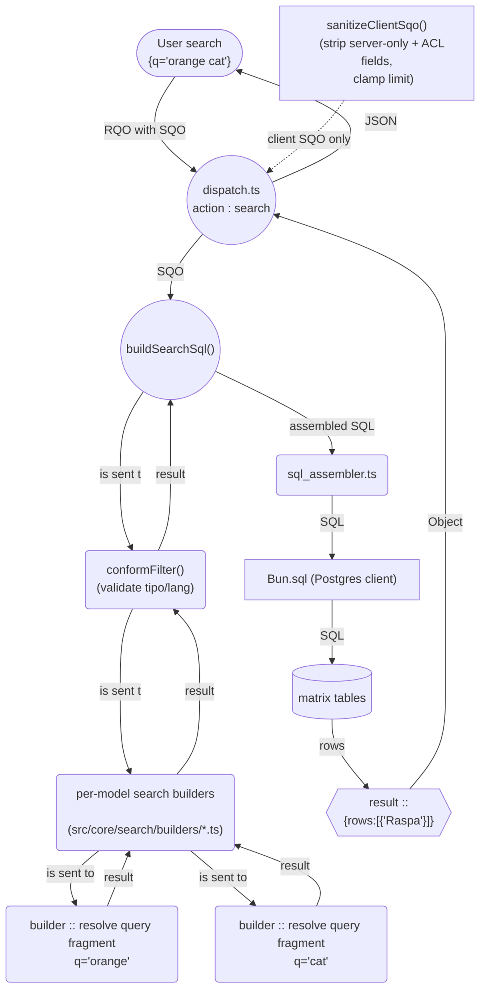
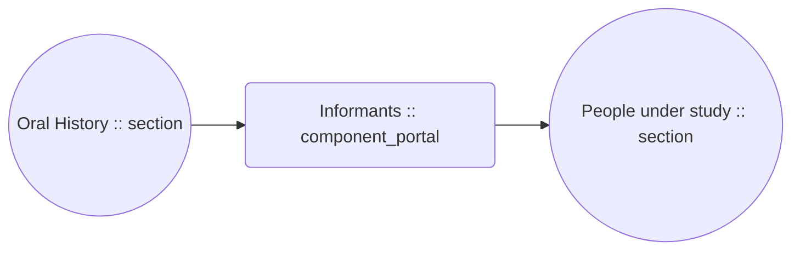
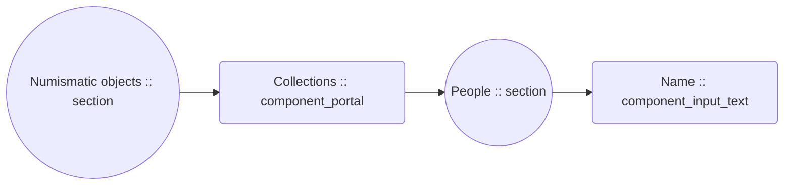
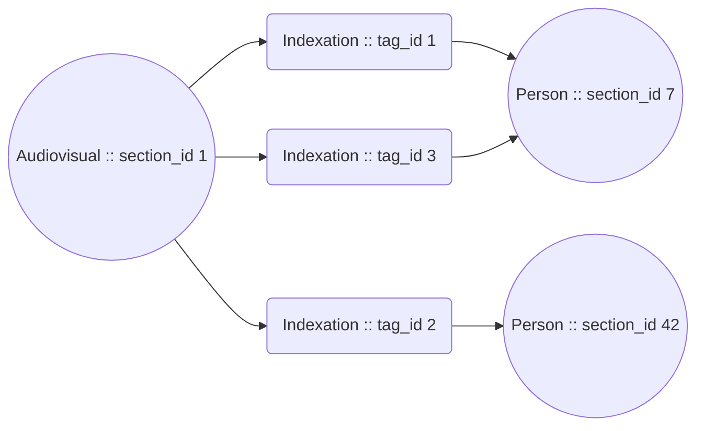

# Search Query Object

> See also: [RQO](rqo.md) · [Locator](locator.md) · [dd_object](dd_object.md) · [Search configuration](../config/search.md) · [Glossary](glossary.md)

The Search Query Object (SQO) is a JSON definition that abstracts a classical SQL query into an ontology-driven, NoSQL-friendly form.

## Introduction

The SQO is a JSON object that acts as an abstraction of classical SQL. To build a flexible system based on NoSQL and on the Dédalo ontology, a flexible definition of the database query is necessary. Dédalo does not have columns, yet it needs to search data in the same way as classical SQL. The model changed from SQL to NoSQL in v4, in 2012; at that time PostgreSQL (v9.2) introduced the JSON format, but with a very simple JSON query.

The SQO was defined because early PostgreSQL JSON search definitions were expected to be replaced with a more robust system. Searches also need to stay compatible with ontology changes, so Dédalo avoids predefined searches.

## Search Query Object - SQO definition

`src/core/concepts/sqo.ts` defines the shape and the `sanitizeClientSqo` security gate;
`src/core/search/` is the compile-to-SQL engine: `conform.ts`, `sql_assembler.ts`,
`count.ts`, `identifier_gate.ts`, `builders/*`, `search_related.ts`.

**search_query_object** `object`

The Search Query Object defines an object with normalized properties to create a database query. The Dédalo SQO definition is inspired by the Mango query language interface of Apache [CouchDB](https://docs.couchdb.org/en/stable/api/database/find.html).

## Search flow

The Search Query Object is sent as part of the Request Query Object to be processed by the server API. The parsed SQO is used to create the final SQL that is sent to the database. The final result is sent to the client in JSON format.


```mermaid
    graph TD
    A(["User  search
     {q='orange cat'}"]) -- RQO with SQO--> B
    B(("dispatch.ts
    action : search"))
    B --SQO--> C(("buildSearchSql()" ))
    A2["sanitizeClientSqo()
    (strip server-only + ACL fields,
    clamp limit)"] -.client SQO only.-> B
    C --is sent to--> E("conformFilter()
    (validate tipo/lang)" )
    E-- result -->C
    E --is sent to--> F("per-model search builders
    (src/core/search/builders/*.ts)" )
    F-- result -->E
    F-- is sent to -->G
    G("builder :: resolve query fragment
      q='orange'")
    F-- is sent to -->H
    H("builder :: resolve query fragment
      q='cat' ")
    G-- result -->F
    H-- result -->F
    C-- assembled SQL --> I("sql_assembler.ts")
    I--SQL--> J["Bun.sql (Postgres client)"]
    J--SQL-->Q[(matrix tables)]
    Q --rows--> K{{"result ::
    {rows:[{'Raspa'}]}"}}
    K --Object--> B
    B --JSON--> A
```

!!! note "About the SQL examples in this page"
    The inline `SQL` blocks below use the REAL v7 shape: every `matrix*` table stores component data across **typed JSONB columns** — `data`, `relation`, `string`, `date`, `iri`, `geo`, `number`, `media`, `misc`, `relation_search`, `meta` — keyed by component **tipo** inside each column (e.g. `string -> '{"rsc85":[{"lang":"lg-eng","value":"Ana"}]}'`), never a single legacy `datos` column. Matches queried through PostgreSQL `jsonpath` (`@?`, `jsonb_path_query`) with bound `$1..$n` parameters for every literal (`src/core/db/matrix.ts` `MATRIX_JSONB_COLUMNS`). The blocks are still illustrative simplifications of the exact generated SQL (real fragments carry more existence-envelope boilerplate); the source of truth is the per-model fragment builders in `src/core/search/builders/*.ts` and the gates in `test/parity/` and `test/unit/`.

## Security and access control

The SQO is the query language, but not every SQO is equally trusted. **A client-built SQO arriving from the HTTP API is untrusted; an SQO a server class builds and runs directly is trusted.** The full configuration (the `DEDALO_SEARCH_CLIENT_MAX_LIMIT` and `DEDALO_FILTER_USER_RECORDS_BY_ID` constants, and the project filter) is documented in [Search configuration and access control](../config/search.md). In short:

- **Client boundary** — `sanitizeClientSqo()` (`src/core/concepts/sqo.ts`) runs once for client SQOs only, at the API entry: recursively strips server-only SQL fields (`sentence`, `params`, `column_sql`, `table`, `table_alias`) and access-control flags (`skip_projects_filter`, `skip_duplicated`, `include_negative`), forces `parsed = false`, and clamps `limit` to `CLIENT_MAX_LIMIT` (1000). Server-internal builders bypass this gate.
- **Identifier / language validation** — for **every** SQO, the `conformFilter()` chokepoint (`src/core/search/conform.ts`) validates each path `section_tipo`/`component_tipo` (`assertValidTipo`/`assertValidTipoOrColumn`, `src/core/search/identifier_gate.ts`) and each filter `lang` (`assertValidLang`) before they are interpolated verbatim into JSONB keys / jsonpath. Malformed values throw (they cannot be parameterized).
- **Prepared parameters** — all literal `q` values reach SQL as bound `$n` parameters, never inlined.
- **Project filter** — for non global-admin users a project-scope restriction is always added to `WHERE` (per section), and `skip_projects_filter` (which removes it) is not settable from a client SQO.

## Parameters

- **id** : `string` section_tipo and other params to define the unique id **optional** | ex : oh1
- **section_tipo** : `array || string` array of section_tipo or string with the section_tipo to search **mandatory** | ex : `['oh1']`
- **mode** : `string` ('edit' || 'list' || 'tm' || 'related') configures the SQO to search the different models of matrix tables in the database **optional** | ex : 'list'
- **filter** : `object` definition of the filter to apply to the search **optional**
  - **operator** : `array of objects` the operator key defines the operator ('\$and' || '\$or'); they are identified by a dollar sign (\$) prefix in the property name, and the array value holds the argument `objects` affected by the operator. **mandatory**, `{"$operator": [arguments]}`
    - **q** : `string` string to search **mandatory**, ex: 'John'
    - **q_operator** : `string` operator to apply to q,  **optional**, ex: '<'
    - **path** : `array of objects` array of components creating a sequential path to the component to be searched,  **mandatory**, ex: `[{"section_tipo":"oh1", "component_tipo":"oh24"},{"section_tipo":"rsc197", "component_tipo":"rsc85"}]}`
    - **format** : `string` ('direct' || 'array_elements' || 'typeof' || 'column' || 'in_column' || 'function') used to change the WHERE format **optional**, ex: 'direct'
    - **use_function** : `string` if format is function, use_function names the flat-locator variant (legacy wire vocabulary — translated to a `matrix_relation_index` lookup, see [use_function](#use_function)). **optional**, ex: 'data_relations_flat_fct_st_si'
    - **q_split** : `bool` (true || false) defines whether q is split into multiple WHERE queries. Default : true **optional**, ex: 'false'
    - **unaccent** : `bool` (true || false) defines whether q uses the unaccent function to remove accent characters in WHERE **optional**, ex: 'false'
    - **type** : `string` ('jsonb' || 'string')  defines the type of data to search **optional**, ex: 'jsonb'
- **limit** : `int` records limit **optional**, ex: 10
- **offset** : `int` records offset **optional**, ex: 10
- **full_count** : `bool` (true || false) get the total records found and set the total with it **optional**, ex: true
- **order** : `array of objects` sets the order of the records; every object in the array is a column with its paths and direction **optional** `[{"direction": "ASC", "path":[{ddo},{ddo}]}]]`
  - **direction** : `string` (ASC || DESC) sort direction of the column **optional**, ex: 'DESC'
  - **path** : `array of objects` the [ddo](dd_object.md) object that defines the path of the column, beginning from the main section of the filter and following the ddo path to the component in the related section(s). **optional** `[{"section_tipo":"oh1","component_tipo":"oh24"},{"section_tipo":"rsc197", "component_tipo":"rsc85"}]`
  - **section_tipo** : `string` name of the section to order by **optional**
  - **column_name** : `string` name of the column to order by **optional**
  - **column_values** : `array` array that defines the order of the values **optional**
- **filter_by_locators** : `array of objects` sets an order by locators; every object is a [locator](locator.md) and the order of the array is respected **optional** ex : `[{"section_tipo":"oh1", "section_id":"8"},{"section_tipo":"oh1", "section_id":"3"}]`
- **allow_sub_select_by_id** : `bool` (true || false) create a sub-select in the SQL query that passes the filter and gets the id to select the main section. Default : true **optional** .
- **children_recursive** : `bool` (true || false) filter the hierarchy term and get all children nodes that depend on the searched term. Default : false  **optional**
- **remove_distinct** : `bool` (true || false) remove duplicate records when the SQL query has a sub-select with multiple criteria that can return duplicate records. Default : false **optional**
- **skip_projects_filter** : `bool` (true || false) remove the mandatory component_filter applied to all users except root and global admin users. Default : false **optional**
- **breakdown** : `bool` (true || false) split the data of the matching section (a database row) into a row for every match. Used to locate specific locators and count the values that match the locator being searched. Applied in `related` mode to search the indexations that call specific interviews, persons, etc. Default false  **optional**
- **tables** : `array` list of tables to search. Used in related searches to limit the tables to search. Overwrites the default relation-capable table list (see [tables](#tables) below). **optional**
- **parsed** : `bool` (true || false) state of the SQO; it indicates whether the filter was parsed by the components to add operators to q. It is used as an internal property, but it is possible to parse it manually and set this state. Default false  **optional**
- **select** : `array of objects` array of ddo that defines the SELECT columns. When omitted, the search returns `section_id`, `section_tipo` and every typed data column (`DEFAULT_SELECT_COLUMNS` in `src/core/search/sql_assembler.ts`: `data`, `relation`, `string`, `date`, `iri`, `geo`, `number`, `media`, `misc`, `meta`). **optional** — narrowing via an explicit `select` to specific component columns is not implemented; the engine always projects the default full column set.

### Summary

```json
id                      : 'oh1' // optional. section_tipo and other params to define the unique id
section_tipo            : ["oh1"] // array of section_tipo for search
mode                    : ('edit' || 'list' || 'tm' || 'related') // configures the SQO to search the different models of matrix tables in the database
filter                  : {
                                operator : // string ('$and' || '$or')
                                    [{
                                        q           : '2'   // string to search
                                        q_operator  : '<'   // string || null
                                        path        : [{    // array of components creating a sequential path
                                                            section_tipo
                                                            component_tipo
                                                        }]
                                        format      : 'direct' || 'array_elements' || 'typeof' || 'column' || 'in_column' || 'function' // string, used to change the WHERE format
                                        use_function : 'data_relations_flat_fct_st_si' // if format is function, use_function names the flat-locator variant (translated to a matrix_relation_index lookup)
                                        q_split     : true || false // bool, defines whether q is split into multiple WHERE queries
                                        unaccent    : true || false // bool, defines whether q uses the unaccent function in WHERE
                                        type        : 'jsonb' || 'string' // defines the type of data to search
                                        lang        : string || null  // defines whether the search is lang selective. If not defined, lang = all langs; if defined, lang = the lang sent, e.g. `lg-eng`

                                    }]
                            } || null
limit                   : 1 // int
offset                  : 2 // int
total                   : (null || int ) // by default total is null and is calculated; when an int is set the SQO does not count and returns that value
full_count              : (true || false ) // boolean
group_by                : ["section_tipo"] // array with "section_tipo" or specific literal component as "dd199"
order                   : [{
                                direction   : (ASC || DESC) // string
                                path        : [{
                                    section_tipo
                                    component_tipo
                                }]
                            }]
filter_by_locators      : [{
                                section_tipo
                                component_tipo
                            }]
allow_sub_select_by_id  : (true || false) // default true
children_recursive      : (true || false) // default false
remove_distinct         : (true || false) // default false
skip_projects_filter    : (true || false) // default false
breakdown               : (true || false) // default false
tables                  : (array) // default null
parsed                  : (true || false) // boolean, state of the sqo | default false
select                  : [{    // array of objects, optional. Return specific component columns instead of the full typed-column set
                            section_tipo
                            component_tipo
                        }]
```

!!! note "Trust boundary"
    Some properties are **server-only**: `sentence`, `params`, `column_sql`, `table`, `table_alias` (server-built SQL) and the access-control flags `skip_projects_filter`, `skip_duplicated`, `include_negative`. They are stripped from any SQO that arrives from the HTTP API. See [Security and access control](#security-and-access-control).

## Using SQO

The Search Query Object is used to get data from the database. It uses section_tipo to point to specific section(s) to get data, and it uses ddo to define the properties to search in q.

To get any person named "Ana", the SQO is:

```json
{
  "section_tipo": "rsc197",
  "filter": {
    "$and": [{
        "q": "Ana",
        "path": [{
            "section_tipo": "rsc197",
            "component_tipo": "rsc85"
          }]
      }]
  }
}
```

The SQO says: search in people under study (section_tipo [rsc197](https://dedalo.dev/ontology/rsc197)) following the path to the name field (component_tipo [rsc85](https://dedalo.dev/ontology/rsc85)) for the text Ana. The SQO parses the filter with the component_input_text `rsc85` and renders it into SQL for PostgreSQL:

```sql

SELECT DISTINCT ON (rs197.section_id) rs197.section_id,
rs197.section_tipo,
rs197.string, rs197.relation, rs197.number, rs197.date, rs197.iri, rs197.geo, rs197.media, rs197.misc
FROM matrix AS rs197
WHERE rs197.id in (
    SELECT DISTINCT ON(rs197.section_id,rs197.section_tipo) rs197.id
    FROM matrix AS rs197
    WHERE (
            rs197.section_tipo='rsc197') AND
            rs197.section_id>0  AND
            (
              (rs197.string @? '$.rsc85[*]') AND EXISTS (
                SELECT 1 FROM jsonb_path_query(rs197.string, '$.rsc85[*]') AS elem
                WHERE f_unaccent(elem->>'value') ~* f_unaccent('Ana')
              )
            )
    ORDER BY rs197.section_id ASC
    LIMIT 10
)
ORDER BY rs197.section_id ASC
LIMIT 10;

```

## Definitions

### id

The id property identifies an SQO in the process of building it, sending it and retrieving information from the server.

In Dédalo API calls it is possible to send multiple requests, so a way to match the original SQO with its result is needed. The id property serves this function.

Example: search 'Ana' in the name field [rsc85](https://dedalo.dev/ontology/rsc85) of the section People under study [rsc197](https://dedalo.dev/ontology/rsc197)

```json
{
  "id": "my_id_for_the_request",
  "section_tipo": "rsc197",
  "filter": {
    "$and": [{
        "q": "Ana",
        "path": [{
            "section_tipo": "rsc197",
            "component_tipo": "rsc85"
          }]
      }]
  }
}
```

### section_tipo *mandatory*

Defines the section(s) of the search. It can be a string when the search targets one section, or an array when the search spans multiple sections, such as a toponymy search across several countries like Spain, France, ... (es1, fr1, ...).

Definition : `array || string` array of section_tipo or string with the section_tipo to search **mandatory** | ex : `['oh1']`

section_tipo is a mandatory property. It defines where the search runs, that is, where the data being looked for lives. A string or an array can be used when there is only one section to search, but an array is recommended in all cases. The array is extensible, so new sections can be added easily.

Example with one section: search '87C_g25' in the `Code` field [oh14](https://dedalo.dev/ontology/oh14) of the `Oral History` section [oh1](https://dedalo.dev/ontology/oh1)

```json
{
  "section_tipo": "oh1",
  "filter": {
    "$and": [{
        "q": "87C_g25",
        "path": [{
            "section_tipo": "oh1",
            "component_tipo": "oh14"
          }]
      }]
  }
}
```

Example with multiple sections: search 'Benimamet' in the Term field [hierarchy25](https://dedalo.dev/ontology/hierarchy25) of the sections Spain es1 and France fr1

```json
{
  "section_tipo": ["es1", "fr1"],
  "filter": {
    "$and": [{
        "q": "Benimamet",
        "path": [
            {
              "section_tipo": "es1",
              "component_tipo": "hierarchy25"
            },{
              "section_tipo": "fr1",
              "component_tipo": "hierarchy25"
            }
          ]
      }]
  }
}
```

In the previous example, the section_tipo is an array, `["es1", "fr1"]`, with multiple sections to search. This kind of search is useful in many situations, and it can be used with mixed fields; the sections do not have to be equal (in these cases Dédalo does not create a UNION SQL, it resolves it as a normal WHERE statement).

#### all

In some cases it is not possible to define the section_tipo to search, because you want any result in any place that matches your query. For these situations the section_tipo can be defined as `all`. The result is all sections found by the query. Note that the result is not consistent: every section has its own components (fields).

Example with multiple sections, using the `all` section: search 'Benimamet' in the Term field [hierarchy25](https://dedalo.dev/ontology/hierarchy25) of all sections.

```json
{
  "section_tipo": ["all"],
  "mode": "related",
  "filter_by_locators" : [{
    "section_tipo" : "rsc197",
    "section_id" : "2"
  }]
  }
```

the result is a mix of data from different sections:

```json
{
  "result":[
    {
      "section_tipo" : "oh1",
      "section_id" : "2",
      "string": {
        "oh16": [{ "lang": "lg-spa", "value": "my second interview" }]
      }
    },
    {
      "section_tipo" : "rsc197",
      "section_id" : "88",
      "relation": {
        "oh24": [{ "section_tipo" : "rsc197", "section_id" : "2" }]
      }
    }
  ]
}
```

### mode

Defines what kind of search runs. Before v6, mode was used to build the list or edit views of the search; after v6, the mode property defines the type of search: whether it runs against the time machine or the regular matrix tables, whether it searches in hierarchies (to get children), or whether it returns the relations instead of the main section.

Definition: `string` ('edit' || 'list' || 'tm' || 'related') configures the SQO to search the different models of matrix tables in the database **optional** | ex : 'list'

Example: give me the time machine of the Oral History section [oh1](https://dedalo.dev/ontology/oh1)

```json
{
  "section_tipo": "oh1",
  "mode": "tm",
  "order" : [{
    "direction" : "DESC",
    "path" : [
      {
        "component_tipo" : "id"
      }
      ]
  }]
}
```

### filter

The filter object defines the properties applied to the search; filter options are interpreted in the same way as the SQL WHERE clause.

The filter is parsed by the components to apply their own rules, so it has two states: parsed or not. By default the filter is unparsed, because when a new SQO is created it is not possible to identify the operators or data forms of every component, and the filter must be created in the same way for different situations. When the SQO is sent to the Dédalo server, every component interprets its part of the search and parses its own part into the final format, and the filter changes to the parsed state.

In some cases the filter property does not need to be set, such as in time machine searches; in these cases the SQO interprets that all the data must be obtained.

Definition: `object` definition of the filter to apply to the search **optional**

The filter is an object with at least one boolean operator as its first property:

#### operator

Defines which boolean operator applies to the query. The operator is an array of query objects; every query object has its own properties, and the operator is applied between each of these query objects.

Definition : `array of objects` the operator key defines the operator ('\$and' || '\$or'); they are identified by a dollar sign (\$) prefix in the property name, and the array value holds the argument `objects` affected by the operator. **mandatory**, `{"$operator": [arguments]}`

!!! note "About the mandatory operator"
    This property depends on the filter. When the filter is present in the SQO, the operator is mandatory; if the filter is not present, no operator needs to be defined.

The filter object must have at least one operator defined as a property of the object. By default, the 'AND' operator is added as the `$and` key of the filter object.

Example searching with the `$and` operator:

```json
"filter":{
  "$and":[{
    "q" : "Isis"
  }]
}
```

It is parsed as an SQL WHERE clause like:

```sql
...
  WHERE q = "Isis"
...
```

Other filter items can be added as objects in the array, for example with the `$or` operator:

```json
"filter":{
  "$or":[{
    "q" : "Isis"
  },
  {
    "q" : "Raspa"
  }]
}
```

It is parsed as an SQL WHERE clause like:

```sql
...
  WHERE (q = 'Isis') OR (q = 'Raspa')
...
```

Nested operators can be added:

```json
"filter":{
  "$or":[{
    "q" : "Isis"
  },
  {
    "q" : "Raspa"
  },
  {
    "$and" : [{
      "q" : "Osiris"
    }]
  }]
}
```

Nested operations are parsed as an SQL WHERE clause like:

```sql
...
  WHERE ((q = 'Isis' OR q = 'Raspa') AND q = 'Osiris')
...
```

!!! note "Use of the q name"
    In these examples the q name is used as the SQL column name for clarity, but in a real parsed SQL search the q column is not used; it must be a component path or relation path.

##### q

Defines the value (literal or locator) to search. The 'q' property (short for query) has two states: first, 'q' holds the value the user typed in the client user interface; second, after the component analyzes the operators, this data is parsed to add modifications to the literal format, or, when q is a locator, it is analyzed to add properties that adapt q to what the user wants to search, for example time machine or inverse mode.

Definition : `string` string to search **mandatory**, ex: 'John'

To define a filter that searches the name 'Isis':

```json
"filter":{
  "$and":[{
    "q" : "Isis"
  }]
}
```

When the component to search is a text input (such as component_text_area or component_input_text), the q property can hold an operator inside the text. Every component defines its own operators, such as begins, equal, etc.

To define a filter that searches any word beginning with 'Is', the operator is 'Is*':

```json
"filter":{
  "$and":[{
    "q" : "Is*"
  }]
}
```

##### q_operator

Defines the operator used in components that do not have a text input. Some components, such as selects, radio buttons or portals, have no input in which to write the value to search; these components use a parallel text input to define the operator applied in combination with the component data, and the value of this text input is set in the q_operator property.

Definition : `string` operator to apply to q,  **optional**, ex: '<'

Example: find whether the component has any value

```json
"filter":{
  "$and":[{
    "q_operator" : "*"
  }]
}
```

Example: find whether the component has no value

```json
"filter":{
  "$and":[{
    "q_operator" : "!*"
  }]
}
```

##### path

Defines the path to the search component from the current section. Sometimes the component to be searched is linked through a portal (with a locator), so the component is not inside the current section but in another section; in this case the SQO must follow the path to find the component. The path defines how deep to go into the linked data sections.

Definition: `array of objects` an array of components creating a sequential path to the component to be searched,  **mandatory**, ex: `[{"section_tipo":"oh1","component_tipo":"oh24"},{"section_tipo":"rsc197", "component_tipo":"rsc85"}]}`

See this situation:


```mermaid
    graph LR
    A(("Oral History :: section"))-->B(Informants :: component_portal)
    B-->C(("People under study :: section"))
```

The `Oral History` section [oh1](https://dedalo.dev/ontology/oh1) is linked to the `People under study` section [rsc197](https://dedalo.dev/ontology/rsc197) by the component `Informants` [oh24](https://dedalo.dev/ontology/oh24).

!!! note "SQL equivalence"
    The path is equivalent to a JOIN statement in SQL: the sections are equivalent to tables, and the components are the columns that link those tables.

To search interviews of informants born in 1928, the SQO follows the path above to locate the date of birth component [rsc89](https://dedalo.dev/ontology/rsc89).

```json
{
  "section_tipo": ["oh1"],
  "filter": {
      "$and": [
          {
              "q": [
                  {
                      "mode": "start",
                      "start": {
                          "year": 1928
                      }
                  }
              ],
              "path": [
                  {
                      "section_tipo": "oh1",
                      "component_tipo": "oh24",
                      "model": "component_portal",
                      "name": "Informants"
                  },
                  {
                      "section_tipo": "rsc197",
                      "component_tipo": "rsc89",
                      "model": "component_date",
                      "name": "Date of birth"
                  }
              ]
          }
      ]
  }
}
```

The last object of the path is used to search the value of the query. The result data is the interviews (in the oral history section) that match the query.

##### format

Defines the parse method applied to the SQO when it is transformed into SQL.

The SQO can be interpreted as different SQL for different uses; the format property controls how it is parsed and which kind of search is performed.

Definition : `string` ('direct' || 'array_elements' || 'typeof' || 'column' || 'in_column' || 'function') used to change the WHERE format **optional**, ex: 'direct'

Example: search ids 1 and 6 of interviews [oh1](https://dedalo.dev/ontology/oh1).

1.- format "column":

```json
{
  "section_tipo": [ "oh1" ],
  "filter": {
      "$and": [
          {
              "q": [ "1,6" ],
              "path": [
                  {
                      "section_tipo": "oh1",
                      "component_tipo": "oh62",
                      "model": "component_section_id"
                  }
              ],
              "format": "column"
          }
      ]
  }
}
```

And it is rendered as:

```sql
SELECT *
FROM matrix AS oh1
WHERE (oh1.section_tipo='oh1') AND
    (oh1.section_id = 1 OR oh1.section_id = 6)
ORDER BY oh1.section_id ASC
LIMIT 10
```

2.- format "in_column", the same SQO:

```json
{
  "section_tipo": [ "oh1" ],
  "filter": {
      "$and": [
          {
              "q": ["1,6"],
              "path": [
                  {
                      "section_tipo": "oh1",
                      "component_tipo": "oh62",
                      "model": "component_section_id"
                  }
              ],
              "format": "in_column"
          }
      ]
  }
}
```

And it is rendered as:

```sql
SELECT *
FROM matrix AS oh1
WHERE (oh1.section_tipo='oh1') AND
    (oh1.section_id IN(1,6))
ORDER BY oh1.section_id ASC
LIMIT 10
```

Both are valid SQL, but with a different approach.

##### use_function

Names the flat-locator VARIANT used in the query. This parameter is used in combination with the [format](#format) parameter set to `function`: `format` tells the SQO that the leaf carries a flattened locator key, and `use_function` names which variant the key encodes.

Definition: `string` if format is function, use_function names the flat-locator variant. **optional**, ex: 'data_relations_flat_fct_st_si'

!!! warning "The names are wire vocabulary, not database functions (removed 2026-07-20)"
    The `use_function` names date from the v6-era design, where each variant WAS
    a PostgreSQL flattening function (`data_relations_flat_*`) backed by a
    functional GIN index per table. Those functions and indexes are **removed**:
    v7 answers every relation query from **`matrix_relation_index`**, the typed
    per-locator side table maintained by row triggers (see
    [search — The relation index](system/search.md#the-relation-index-matrix_relation_index)).
    The names survive **only as wire vocabulary** — clients keep sending them
    unchanged, and the engine maps them through an allowlist to typed column
    equalities. Nothing is ever interpolated into SQL, and no function is called.

Variant → `matrix_relation_index` columns:

| `use_function` (with or without the `data_` prefix) | flat key shape | translated to |
| --- | --- | --- |
| `relations_flat_st_si` | `<st>_<si>` | `target_section_tipo, target_section_id` |
| `relations_flat_fct_st_si` | `<fct>_<st>_<si>` | `from_component_tipo, target_section_tipo, target_section_id` |
| `relations_flat_ty_st_si` | `<ty>_<st>_<si>` | `type, target_section_tipo, target_section_id` |
| `relations_flat_ty_st` | `<ty>_<st>` | `type, target_section_tipo` |

The key splits unambiguously on `_` because tipos never contain underscores.

Example: search the `Type` section [numisdata3](https://dedalo.dev/ontology/numisdata3) with the `Catalog` [numisdata309](https://dedalo.dev/ontology/numisdata309) value = 1.

This search targets a locator like this:

```json
{
    "section_tipo": "numisdata300",
    "section_id": 1,
    "from_component_tipo": "numisdata309"
}
```

The locator is flattened as `numisdata309_numisdata300_1` and sent as:

```json
{
  "section_tipo": [ "numisdata3" ],
  "filter": {
      "$and": [
          {
              "q": "\"numisdata309_numisdata300_1\"",
              "path": [
                  {
                      "section_tipo": "numisdata3",
                      "component_tipo": "numisdata309"
                  }
              ],
              "format": "function",
              "use_function": "data_relations_flat_fct_st_si"
          }
      ]
  }
}
```

It is rendered as SQL (an exact tuple-IN over the relation index — equivalence, not a superset, because the tuple carries the owner's `section_tipo`; every value rides as a bound parameter):

```sql
SELECT *
FROM matrix AS nu3
WHERE (nu3.section_tipo='numisdata3') AND nu3.section_id>0  AND (
   (nu3.section_tipo, nu3.section_id) IN (
      SELECT r.section_tipo, r.section_id FROM matrix_relation_index r
      WHERE r.from_component_tipo = 'numisdata309'
        AND r.target_section_tipo = 'numisdata300'
        AND r.target_section_id   = 1))
ORDER BY nu3.section_id ASC
LIMIT 10
```

The btree lookup is served in fractions of a millisecond regardless of database size — and, unlike the retired GIN containment, the planner gets honest row statistics from the typed columns.

!!! note "About the flat nomenclature"
    - `fct` : contraction of `from_component_tipo`
    - `st`  : contraction of `section_tipo`
    - `si`  : contraction of `section_id`
    - `ty`  : contraction of `type`

The allowlist (both the v6 client spelling without the `data_` prefix and the prefixed form) lives in `conformFilter()` (`src/core/search/conform.ts`); an unknown `use_function` throws, a malformed key contributes nothing. This is the WC-012 wire-contract entry.

##### q_split

Defines whether the words of the query (in the [q](#q) parameter) are split into multiple WHERE statements. When q_split is set to true, it creates one WHERE clause for every word in the query and adds an AND operator between them, so the words are searched anywhere in the text. It is true by default.

Definition : `bool` (true || false) defines whether q is split into multiple WHERE queries. Default : true **optional**, ex: 'false'

Example: search the interviews [oh1](https://dedalo.dev/ontology/oh1) whose abstract [oh23](https://dedalo.dev/ontology/oh23) has the words "war 1939".

Consider this text:

"... the Spanish Civil War ended at April 1th of 1939 ..."

With q_split set to true, the search finds it.
With q_split set to false, the search does not find it, because the words "war" and "1939" are not in the searched order: the words "ended at April 1th of" sit in the middle.

```json
{
  "section_tipo": [ "oh1" ],
  "filter": {
      "$and": [
          {
              "q": "war 1939",
              "path": [
                  {
                      "section_tipo": "oh1",
                      "component_tipo": "oh23"
                  }
              ],
              "q_split": true,
          }
      ]
  }
}
```

```sql
SELECT *
FROM matrix AS oh1
WHERE (oh1.section_tipo='oh1') AND oh1.section_id>0  AND (
  (
    (oh1.string @? '$.oh23[*]') AND EXISTS (
      SELECT 1 FROM jsonb_path_query(oh1.string, '$.oh23[*]') AS elem
      WHERE f_unaccent(elem->>'value') ~* f_unaccent('war')
    )
  ) AND (
    (oh1.string @? '$.oh23[*]') AND EXISTS (
      SELECT 1 FROM jsonb_path_query(oh1.string, '$.oh23[*]') AS elem
      WHERE f_unaccent(elem->>'value') ~* f_unaccent('1939')
    )
  )
)
ORDER BY oh1.section_id ASC
LIMIT 10
```

But when q_split is set to false:

```json
{
  "section_tipo": [ "oh1" ],
  "filter": {
      "$and": [
          {
              "q": "war 1939",
              "path": [
                  {
                      "section_tipo": "oh1",
                      "component_tipo": "oh23"
                  }
              ],
              "q_split": false,
          }
      ]
  }
}
```

The SQL WHERE clause has only one statement, searching exactly what the user typed, and in this case it does not match.

```sql
SELECT *
FROM matrix AS oh1
WHERE (oh1.section_tipo='oh1') AND oh1.section_id>0  AND (
  (oh1.string @? '$.oh23[*]') AND EXISTS (
    SELECT 1 FROM jsonb_path_query(oh1.string, '$.oh23[*]') AS elem
    WHERE f_unaccent(elem->>'value') ~* f_unaccent('war 1939')
  )
)
ORDER BY oh1.section_id ASC
LIMIT 10
```

##### unaccent

Defines whether the unaccent function is applied to [q](#q). The unaccent function searches without accents, and all letters are searched in lowercase (the letter case is not matched). By default, text search sets this parameter to true. This function is used by languages such as Spanish, Catalan or French that use accented letters such as àáäâéèëêìíïîòóöôùúüû, etc.

Definition: `bool` (true || false) defines whether q uses the unaccent function to remove accent characters in WHERE **optional**, ex: 'false'

Example: search interviews [oh1](https://dedalo.dev/ontology/oh1) whose abstract [oh23](https://dedalo.dev/ontology/oh23) has the word `Bèl·lic`; the unaccent function matches words such as `bel·lic`, `Bel·lic`, `bèl·lic`, etc.

```json
{
  "section_tipo": [ "oh1" ],
  "filter": {
      "$and": [
          {
              "q": "Bèl·lic",
              "path": [
                  {
                      "section_tipo": "oh1",
                      "component_tipo": "oh23"
                  }
              ],
              "unaccent": true
          }
      ]
  }
}
```

It is transformed to SQL as:

```sql
SELECT DISTINCT *
FROM matrix AS oh1
WHERE (oh1.section_tipo='oh1') AND oh1.section_id>0  AND
  (
    (oh1.string @? '$.oh23[*]') AND EXISTS (
      SELECT 1 FROM jsonb_path_query(oh1.string, '$.oh23[*]') AS elem
      WHERE f_unaccent(elem->>'value') ~* f_unaccent('Bèl·lic')
    )
  )
ORDER BY oh1.section_id ASC
LIMIT 10
```

To search exactly the word the user typed, unaccent can be disabled:

```json
{
  "section_tipo": [ "oh1" ],
  "filter": {
      "$and": [
          {
              "q": "Bélic",
              "path": [
                  {
                      "section_tipo": "oh1",
                      "component_tipo": "oh23"
                  }
              ],
              "unaccent": false
          }
      ]
  }
}
```

The SQL WHERE clause does not have the unaccent function.

```sql
SELECT DISTINCT *
FROM matrix AS oh1
WHERE (oh1.section_tipo='oh1') AND oh1.section_id>0  AND
  (
    (oh1.string @? '$.oh23[*]') AND EXISTS (
      SELECT 1 FROM jsonb_path_query(oh1.string, '$.oh23[*]') AS elem
      WHERE elem->>'value' ~* 'Bélic'
    )
  )
ORDER BY oh1.section_id ASC
LIMIT 10
```

##### type

Defines whether the search uses the json or string format in the SQL WHERE clause. In Dédalo all data is stored in JSON format, and every component has its own data inside an array, but some components have a string as their value and others have an object. If the component has an object, such as component_date, the search uses the `json` type; if the component has a string as its value, such as component_input_text, it decides whether to use the `jsonb` or `string` type depending on [q](#q).

Definition: `string` ('jsonb' || 'string')  defines the type of data to search **optional**, ex: 'jsonb'

Example: search interviews [oh1](https://dedalo.dev/ontology/oh1) with title [oh16](https://dedalo.dev/ontology/oh16) `mother` in jsonb format.

```json
{
 "section_tipo": ["oh1"],
    "filter": {
        "$and": [
            {
                "q": [ "mother" ],
                "path": [
                    {
                        "section_tipo": "oh1",
                        "component_tipo": "oh16"
                    }
                ],
                "type": "jsonb"
            }
        ]
    }
}
```

##### lang

Defines whether the search is language sensitive, searching in a specific language, or transversal across all languages.
It is used by translatable components such as `component_input_text` or `component_text_area` to drive the query behavior.
By default it is set to `null`.

It can be defined with a specific language such as `lg-fra` to restrict the query to that language.
When the parameter is set to `null` or `all`, the query uses all possible data languages defined in [DEDALO_PROJECTS_DEFAULT_LANGS](../config/config.md#defining-default-projects-languages).

Non-translatable components such as `component_number`, `component_image`, etc. set this parameter to `lg-nolan`, but it does not need to be set in SQO calls; the component parses and sets it automatically.

The `null` and `all` values mean the same:

- for non-translatable components = lg-nolan.
- for translatable components = all languages.

!!! note "About relation components"
    Relation components, such as `component_portal`, do not use this parameter, because relational data has no language definition.

Definition: `string` (`string` || `null`) defines the lang of data to search **optional**, ex: 'lg-eng'

Example: search interviews [oh1](https://dedalo.dev/ontology/oh1) with title [oh16](https://dedalo.dev/ontology/oh16) = `Raspa` only in Spanish.

```json
{
 "section_tipo": ["oh1"],
    "filter": {
        "$and": [
            {
                "q": "Raspa",
                "path": [
                    {
                        "section_tipo": "oh1",
                        "component_tipo": "oh16"
                    }
                ],
                "lang": "lg-spa"
            }
        ]
    }
}
```

The SQL WHERE query is restricted to the Spanish language as follows:

```sql
SELECT DISTINCT *
FROM matrix AS oh1
WHERE (oh1.section_tipo='oh1') AND oh1.section_id>0  AND
  (
    (oh1.string @? '$.oh16[*] ? (@.lang == "lg-spa")') AND EXISTS (
      SELECT 1 FROM jsonb_path_query(oh1.string, '$.oh16[*] ? (@.lang == "lg-spa")') AS elem
      WHERE f_unaccent(elem->>'value') = f_unaccent('Raspa')
    )
  )
ORDER BY oh1.section_id ASC
LIMIT 10
```

Example: search interviews [oh1](https://dedalo.dev/ontology/oh1) whose title [oh16](https://dedalo.dev/ontology/oh16) has data in any language.

```json
{
 "section_tipo": ["oh1"],
    "filter": {
        "$and": [
            {
                "q": "*",
                "path": [
                    {
                        "section_tipo": "oh1",
                        "component_tipo": "oh16"
                    }
                ],
                "lang": "all"
            }
        ]
    }
}
```

Both engines still honor [DEDALO_PROJECTS_DEFAULT_LANGS](../config/config.md#defining-default-projects-languages), but the v7 typed-column jsonpath needs no per-language `OR` chain: the JSONB array under `string -> 'oh16'` already holds every language's entries side by side (`[{"lang":"lg-spa","value":"..."},{"lang":"lg-eng","value":"..."},...]`), so a lang-unscoped jsonpath filter scans across all of them in one pass:

```sql
SELECT DISTINCT *
FROM matrix AS oh1
WHERE (oh1.section_tipo='oh1') AND oh1.section_id>0  AND
  (oh1.string @? '$.oh16[*].value ? (@ != "" && @ != null)')
ORDER BY oh1.section_id ASC
LIMIT 10
```

### limit

Defines the maximum records to get from the database. It is equivalent to LIMIT in SQL.

Definition: `int` records limit **optional**, ex: 10

!!! note "Client limit ceiling"
    A `limit` arriving from the HTTP API is clamped to [`DEDALO_SEARCH_CLIENT_MAX_LIMIT`](../config/search.md#dedalo_search_client_max_limit) (default 1000): the `all` sentinel, `0`/negative and out-of-range values all become the ceiling. Server-internal callers bypass this clamp and may still use `limit: 'all'`.

Example: search the first 10 interviews [oh1](https://dedalo.dev/ontology/oh1) with title [oh16](https://dedalo.dev/ontology/oh16) `mother`.

```json
{
 "section_tipo": ["oh1"],
    "filter": {
        "$and": [
            {
                "q": [ "mother" ],
                "path": [
                    {
                        "section_tipo": "oh1",
                        "component_tipo": "oh16"
                    }
                ]
            }
        ]
    },
    "limit": 10
}
```

### offset

Defines how many records to skip before getting records from the database. It is equivalent to OFFSET in SQL.
`offset` says how many records to skip before beginning to return records. An `offset` of 0 is the same as omitting it or setting it to null. It is used in combination with limit to paginate or navigate between records.

Definition: `int` records to skip **optional**, ex: 10

Example: search the next 10 interviews [oh1](https://dedalo.dev/ontology/oh1) with title [oh16](https://dedalo.dev/ontology/oh16) `mother` after the first 10 interviews that match the criteria (it returns interviews 11 to 20).

```json
{
 "section_tipo": ["oh1"],
    "filter": {
        "$and": [
            {
                "q": [ "mother" ],
                "path": [
                    {
                        "section_tipo": "oh1",
                        "component_tipo": "oh16"
                    }
                ]
            }
        ]
    },
    "limit": 10,
    "offset" : 10
}
```

### total

Defines the total records counted in a search. This parameter is not used in an SQL statement; total has no equivalent in SQL because it is the result of a count. The SQO defines total to store a previous count and reduce counting during pagination: if the query does not change, the total is kept and the count is not necessary, so the SQO stores the total and reuses it.
`total` says how many records were found in the previous query. When it is defined and is an `int` > 0, the count is ignored. It is used in pagination when the filter is the same.

Definition: `null` or `int` of records found **optional**, ex: 10

Example: search the next 10 interviews [oh1](https://dedalo.dev/ontology/oh1) with title [oh16](https://dedalo.dev/ontology/oh16) `mother` after the first 10 interviews that match the criteria (it returns interviews 11 to 20), but do not use the count statement.

```json
{
 "section_tipo": ["oh1"],
    "filter": {
        "$and": [
            {
                "q": [ "mother" ],
                "path": [
                    {
                        "section_tipo": "oh1",
                        "component_tipo": "oh16"
                    }
                ]
            }
        ]
    },
    "limit": 10,
    "offset" : 10,
    "total" : 745
}
```

### full_count

Defines whether the search counts the total records found. When `full_count` is enabled, the SQO creates two different SQL statements, the first one for the search and the second one to count the records, and both run in parallel. This parameter is used to get the total records found; because this SQL can take a lot of time and server resources, it is usually active in the first query only, and the following requests set this parameter to false and pass the previously calculated total, which avoids running the count on every request.

Definition: `bool` (true || false) get the total records found and fix the number as total **optional**, ex: true

Example: search the first 10 interviews [oh1](https://dedalo.dev/ontology/oh1) with title [oh16](https://dedalo.dev/ontology/oh16) `mother` and count the total matches.

```json
{
 "section_tipo": ["oh1"],
    "filter": {
        "$and": [
            {
                "q": [ "mother" ],
                "path": [
                    {
                        "section_tipo": "oh1",
                        "component_tipo": "oh16"
                    }
                ]
            }
        ]
    },
    "limit": 10,
    "full_count": true
}
```

```sql
--1 search the records:
SELECT *
FROM matrix AS oh1
WHERE (oh1.section_tipo='oh1') AND oh1.section_id>0  AND
  (
    (oh1.string @? '$.oh16[*]') AND EXISTS (
      SELECT 1 FROM jsonb_path_query(oh1.string, '$.oh16[*]') AS elem
      WHERE f_unaccent(elem->>'value') ~* f_unaccent('mother')
    )
  )
ORDER BY oh1.section_id ASC
LIMIT 10;

-- 2 count the total
SELECT COUNT(*) as full_count FROM (
    SELECT DISTINCT oh1.section_id
    FROM matrix AS oh1
    WHERE (oh1.section_tipo='oh1') AND oh1.section_id>0  AND
      (
        (oh1.string @? '$.oh16[*]') AND EXISTS (
          SELECT 1 FROM jsonb_path_query(oh1.string, '$.oh16[*]') AS elem
          WHERE f_unaccent(elem->>'value') ~* f_unaccent('mother')
        )
      )
)
x;
```

### group_by

Defines whether the query counts the result by some criteria.

!!! note "About the `group_by` implementation"
    In the current version the `group_by` property is not fully equivalent to the SQL `GROUP BY` clause; `group_by` is used only to count records grouped by concept. The SQO can create a `GROUP BY` clause in other parts of the query, but that is not controlled directly by this parameter. TS: `countInverseReferences()` (`src/core/search/search_related.ts`) — each `group_by` column is validated against a simple identifier regex before being interpolated (never client-supplied SQL) and mirrors this exact per-table `UNION ALL` shape.

Definition: array of strings, such as "section_tipo" or a specific literal component such as "dd199" **optional**, ex: \["section_tipo"\]

Example: count the sections `Objects` [tch1](https://dedalo.dev/ontology/tch1) and `Publications` [rsc205](https://dedalo.dev/ontology/rsc205) that call the chronological descriptor (section_tipo = dc1) with section_id = 1, and return the total grouped by section_tipo.

```json
{
    "mode": "related",
    "section_tipo": ["tch1","rsc205"],
    "filter_by_locators": [
      {
        "section_tipo": "dc1",
        "section_id": "1",
        "tipo": "hierarchy40"
      }
    ],
    "full_count": true,
    "group_by": ["section_tipo"]
}
```

```sql
SELECT r.section_tipo, COUNT(DISTINCT r.section_id)::int AS full_count
FROM matrix_relation_index r
WHERE (r.target_section_tipo = 'dc1' AND r.target_section_id = 1)
  AND r.section_tipo IN ('tch1', 'rsc205')
GROUP BY r.section_tipo
```

(One btree query over the relation index replaces the per-table `UNION ALL`
of the retired flat-function containment; `COUNT(DISTINCT r.section_id)`
dedups locator multiplicity exactly the way per-row containment did.)

The query result is something like:

| section_tipo | full_count |
| --- | --- |
| "tch1" | 5523 |
| "rsc205" | 1297 |

And the API returns something like:

```json
{
  "total" : 6820,
  "totals_group" : [
    {
      "key" : ["tch1"],
      "value" : 5523
    },
    {
      "key" : ["rsc205"],
      "value" : 1297
    }
  ]
}

```

### order

Defines the component or components used to order the records found. order is set as an array of columns that defines the configuration of the component used to order; every object has a [path](#path-1) and a [direction](#direction), and the array order fixes the priority.

Definition: `array of objects` sets the order of the records; every object in the array is a column with its paths and direction **optional** `[{"direction": "ASC", "path":[{ddo},{ddo}]}]]`

Example: give me the first 10 records of Numismatic objects [numisdata4](https://dedalo.dev/ontology/numisdata4) ordered by the Collections [numisdata159](https://dedalo.dev/ontology/numisdata159) people name [rsc85](https://dedalo.dev/ontology/rsc85) in descending order.

```json
{
    "section_tipo": [ "numisdata4" ],
    "limit": 10,
    "offset": 0,
    "order": [
        {
            "direction": "DESC",
            "path": [
                 {
                    "component_tipo": "numisdata159",
                    "model": "component_portal",
                    "section_tipo": "numisdata4"
                },
                {
                    "component_tipo": "rsc85",
                    "model": "component_input_text",
                    "section_tipo": "rsc194"
                }
            ]
        }
    ]
}
```

It is processed as SQL:

```sql
SELECT *
FROM (
    SELECT DISTINCT ON (nu4.section_id) nu4.section_id,
    nu4.section_tipo,
    nu4.relation,
    (jsonb_path_query_first(j_numisdata159_rsc194.string, '$.rsc85[*] ? (@.lang == "lg-nolan")')->>'value') as rsc85_order
    FROM matrix AS nu4
    -- Collections (numisdata159) locators live in nu4's OWN 'relation' column;
    -- unnest them and join the target Person record (no separate 'relations' table in v7)
    LEFT JOIN LATERAL jsonb_array_elements(nu4.relation->'numisdata159') AS rel_j1 ON true
    LEFT JOIN matrix AS j_numisdata159_rsc194
      ON j_numisdata159_rsc194.section_id = NULLIF((rel_j1->>'section_id'), '')::bigint
     AND j_numisdata159_rsc194.section_tipo = (rel_j1->>'section_tipo')::text
    WHERE (nu4.section_tipo='numisdata4') AND nu4.section_id>0
    ORDER BY nu4.section_id ASC
) main_select
ORDER BY rsc85_order DESC NULLS LAST , section_id ASC
LIMIT 10;
```

#### direction

Defines the order of the records. It is used in combination with [order](#order).

Definition: `string` (ASC || DESC) sort direction of the column **optional**, ex: 'DESC'

Example: give me the first 10 records of Numismatic objects [numisdata4](https://dedalo.dev/ontology/numisdata4) ordered by the Collections [numisdata159](https://dedalo.dev/ontology/numisdata159) people name [rsc85](https://dedalo.dev/ontology/rsc85) in ascending order.

```json
{
    "section_tipo": [ "numisdata4" ],
    "limit": 10,
    "offset": 0,
    "order": [
        {
            "direction": "ASC",
            "path": [
                 {
                    "component_tipo": "numisdata159",
                    "model": "component_portal",
                    "section_tipo": "numisdata4"
                },
                {
                    "component_tipo": "rsc85",
                    "model": "component_input_text",
                    "section_tipo": "rsc194"
                }
            ]
        }
    ]
}
```

It is processed as SQL:

```sql
SELECT *
FROM (
    SELECT DISTINCT ON (nu4.section_id) nu4.section_id,
    nu4.section_tipo,
    nu4.relation,
    (jsonb_path_query_first(j_numisdata159_rsc194.string, '$.rsc85[*] ? (@.lang == "lg-nolan")')->>'value') as rsc85_order
    FROM matrix AS nu4
    -- Collections (numisdata159) locators live in nu4's OWN 'relation' column;
    -- unnest them and join the target Person record (no separate 'relations' table in v7)
    LEFT JOIN LATERAL jsonb_array_elements(nu4.relation->'numisdata159') AS rel_j1 ON true
    LEFT JOIN matrix AS j_numisdata159_rsc194
      ON j_numisdata159_rsc194.section_id = NULLIF((rel_j1->>'section_id'), '')::bigint
     AND j_numisdata159_rsc194.section_tipo = (rel_j1->>'section_tipo')::text
    WHERE (nu4.section_tipo='numisdata4') AND nu4.section_id>0
    ORDER BY nu4.section_id ASC
) main_select
ORDER BY rsc85_order ASC NULLS LAST , section_id ASC
LIMIT 10;
```

#### path

Defines the path to follow to reach the component used in the order.

Sections are connected by locators, and the path must be followed to locate the component in the target section. For example, the Numismatic object section [numisdata4](https://dedalo.dev/ontology/numisdata4) has a component named Collection [numisdata159](https://dedalo.dev/ontology/numisdata159) that points to the People section [rsc194](https://dedalo.dev/ontology/rsc194). To order by the name of the collection person, the component Name [rsc85](https://dedalo.dev/ontology/rsc85) in the Person section must be located. To do that, the path defines the components to follow up to the target.


```mermaid
    graph LR
    A(("Numismatic objects :: section"))-->B(Collections :: component_portal)
    B-->C(("People :: section"))
    C-->D("Name :: component_input_text")
```

The component is defined using the [ddo](dd_object.md) definition. The graph above is represented as:

```json
[
  {
    "component_tipo": "numisdata159",
    "model": "component_portal",
    "section_tipo": "numisdata4"
  },
  {
    "component_tipo": "rsc85",
    "model": "component_input_text",
    "section_tipo": "rsc194"
  }
]
```

The last ddo in the array is the target component to use in the order.

Definition: `array of objects` the [ddo](dd_object.md) object that defines the path of the column, beginning from the main section of the filter and following the ddo path to the component in the related section(s). **optional** `[{"section_tipo":"oh1","component_tipo":"oh24"},{"section_tipo":"rsc197", "component_tipo":"rsc85"}]`

Example: give me the first 10 records of Numismatic objects [numisdata4](https://dedalo.dev/ontology/numisdata4) ordered by the Collections [numisdata159](https://dedalo.dev/ontology/numisdata159) people name [rsc85](https://dedalo.dev/ontology/rsc85) in ascending order.

```json
{
    "section_tipo": [ "numisdata4" ],
    "limit": 10,
    "offset": 0,
    "order": [
        {
            "direction": "ASC",
            "path": [
                 {
                    "component_tipo": "numisdata159",
                    "model": "component_portal",
                    "section_tipo": "numisdata4"
                },
                {
                    "component_tipo": "rsc85",
                    "model": "component_input_text",
                    "section_tipo": "rsc194"
                }
            ]
        }
    ]
}
```

It is processed as SQL:

```sql
SELECT *
FROM (
    SELECT DISTINCT ON (nu4.section_id) nu4.section_id,
    nu4.section_tipo,
    nu4.relation,
    (jsonb_path_query_first(j_numisdata159_rsc194.string, '$.rsc85[*] ? (@.lang == "lg-nolan")')->>'value') as rsc85_order
    FROM matrix AS nu4
    -- Collections (numisdata159) locators live in nu4's OWN 'relation' column;
    -- unnest them and join the target Person record (no separate 'relations' table in v7)
    LEFT JOIN LATERAL jsonb_array_elements(nu4.relation->'numisdata159') AS rel_j1 ON true
    LEFT JOIN matrix AS j_numisdata159_rsc194
      ON j_numisdata159_rsc194.section_id = NULLIF((rel_j1->>'section_id'), '')::bigint
     AND j_numisdata159_rsc194.section_tipo = (rel_j1->>'section_tipo')::text
    WHERE (nu4.section_tipo='numisdata4') AND nu4.section_id>0
    ORDER BY nu4.section_id ASC
) main_select
ORDER BY rsc85_order ASC NULLS LAST , section_id ASC
LIMIT 10;
```

The equivalent SQL:

```sql
SELECT *
FROM (
    SELECT DISTINCT ON (nu4.section_id) nu4.section_id,
    nu4.section_tipo,
    nu4.string, nu4.relation, nu4.number, nu4.date, nu4.iri, nu4.geo, nu4.media, nu4.misc
    FROM matrix AS nu4
    WHERE (nu4.section_tipo='numisdata4') AND nu4.section_id>0
    ORDER BY nu4.section_id ASC
) main_select
LEFT JOIN (VALUES ('numisdata4',5,1),('numisdata4',3,2),('numisdata4',1,3)) as x(ordering_section_tipo, ordering_id, ordering) ON main_select.section_id=x.ordering_id AND main_select.section_tipo=x.ordering_section_tipo
ORDER BY x.ordering ASC
LIMIT 10
```

### filter_by_locators

Defines an array of fixed [locators](locator.md) applied to the search. filter_by_locators is used when a query has fixed data to apply to every query; it is independent of the filter [q](#q) values and is used to get a set of records that is then filtered by the q criteria. filter_by_locators takes precedence over other criteria defined in the filter.

Definition: `array of objects` sets an order by locators; every object is a [locator](locator.md) and the order of the array is respected **optional** ex : `[{"section_tipo":"oh1", "section_id":"8"},{"section_tipo":"oh1", "section_id":"3"}]`

Example: give me the section Types [numisdata3](https://dedalo.dev/ontology/numisdata3) that use the image [rsc170](https://dedalo.dev/ontology/rsc170) with section_id 69.

```json
{
  "section_tipo": ["numisdata3"],
  "mode": "related",
  "filter_by_locators": [
    {
      "section_tipo": "rsc170",
      "section_id": "69"
    }
  ]
}
```

The SQL equivalent (owner discovery runs on the relation index; the matching
records are then read from their matrix tables by `(section_tipo, section_id)`):

```sql
SELECT r.section_tipo, r.section_id
FROM matrix_relation_index r
WHERE (r.target_section_tipo = 'rsc170' AND r.target_section_id = 69)
  AND r.section_tipo IN ('numisdata3')
GROUP BY r.section_tipo, r.section_id
ORDER BY r.section_id ASC
LIMIT 10
OFFSET 0;
```

### allow_sub_select_by_id

Defines whether the query uses a sub-select in SQL to get a pre-selection of the query with section_id as the selector. It is used to improve search speed: the filter is applied in the sub-select WHERE statement, and the section_ids of the selection are used to get the main section in the main SQL. By default it is set to true.

Definition : `bool` (true || false) create a sub-select in the SQL query that passes the filter and gets the id to select the main section. Default : true **optional** .

Example: give me the first 5 sections of the Numismatic object section [numisdata4](https://dedalo.dev/ontology/numisdata4) without a pre-selecting sub-select:

```json
{
  "section_tipo": [ "numisdata4"],
  "allow_sub_select_by_id":false,
  "limit": 5
}
```

The SQL equivalent:

```sql
SELECT DISTINCT ON (nu4.section_id) nu4.section_id,
    nu4.section_tipo,
    nu4.string, nu4.relation, nu4.number, nu4.date, nu4.iri, nu4.geo, nu4.media, nu4.misc
FROM matrix AS nu4
WHERE (nu4.section_tipo='numisdata4') AND nu4.section_id>0
ORDER BY nu4.section_id ASC
LIMIT 5;
```

The same with a pre-selecting sub-select:

```json
{
  "section_tipo": [ "numisdata4"],
  "allow_sub_select_by_id":true,
  "limit": 5
}
```

The SQL equivalent:

```sql
SELECT DISTINCT ON (nu4.section_id) nu4.section_id,
    nu4.section_tipo,
    nu4.string, nu4.relation, nu4.number, nu4.date, nu4.iri, nu4.geo, nu4.media, nu4.misc
FROM matrix AS nu4
WHERE nu4.id in (
    SELECT DISTINCT ON(nu4.section_id,nu4.section_tipo) nu4.id
    FROM matrix AS nu4
    WHERE (nu4.section_tipo='numisdata4') AND nu4.section_id>0
    ORDER BY nu4.section_id ASC
    LIMIT 5
)
ORDER BY nu4.section_id ASC
LIMIT 5;
```

### remove_distinct

Defines whether the query returns unique records. If the SQL has a sub-select, multiple records can be returned; this parameter prevents that. By default it is deactivated.

Definition: `bool` (true || false) remove duplicate records when the SQL query has a sub-select with multiple criteria that can return duplicate records. Default : false **optional**

Example: give me the first 5 sections of the Numismatic object section [numisdata4](https://dedalo.dev/ontology/numisdata4) without a pre-selecting sub-select and without DISTINCT:

```json
{
  "section_tipo": [ "numisdata4"],
  "allow_sub_select_by_id": false,
  "remove_distinct": true,
  "limit": 5
}
```

The SQL equivalent:

```sql
SELECT nu4.section_id,
    nu4.section_tipo,
    nu4.string, nu4.relation, nu4.number, nu4.date, nu4.iri, nu4.geo, nu4.media, nu4.misc
FROM matrix AS nu4
WHERE (nu4.section_tipo='numisdata4') AND nu4.section_id>0
ORDER BY nu4.section_id ASC -- allow_sub_select_by_id=false
LIMIT 5;
```

### skip_projects_filter

Removes the projects filter applied to users. Every search inside Dédalo uses the component_filter to restrict the section records the user can get from any section. Every user has its own permissions to access one, two or more projects; projects are defined in section [dd153](https://dedalo.dev/ontology/dd153) and assigned to every user in the system. Only the global-admin and root users remove the projects restriction using this property. By default it is false and cannot be changed on the fly.

Definition: `bool` (true || false) remove the mandatory component_filter applied to all users except root and global admin users. Default : false **optional**

!!! warning "Server-only flag"
    `skip_projects_filter` is an access-control flag and is **stripped from client SQOs** by `sanitize_client_sqo()` at the API boundary. It is honored only when an SQO is built and run server-side (e.g. to read common value lists or transversal data). A client cannot set it to bypass the project filter. See [Search configuration and access control](../config/search.md).

### breakdown

Defines whether the search result is split by each locator: each section matching the query produces one row per matching locator. It is only used in `related` mode.

Definition: `bool` (true || false) When set to `true`, give me every locator that matches the query in its own row. When set to `false`, give me the full section that matches the query. Default : false **optional**

It is used to obtain all locators that call some other locator. For instance, an indexation of an audiovisual can use multiple locators to point to specific segments of the interview. These locators can be used repeatedly throughout the interview, because they represent recurrent themes, individuals, topics, and so on. For example, a single person can be indexed multiple times within an interview. The audiovisual of the interview is a section with its full data and all its locators; if the referenced individual is mentioned twice, they are stored as two distinct locators within that section.

Example: in an audiovisual section we have stored 2 locators pointing to the same person, `"section_id": 7, "section_tipo": "rsc197"`, and one locator pointing to another person, `section_id: 42, section_tipo: "rsc197"`, like this:


```mermaid
    graph LR
    A(("Audiovisual :: section_id 1"))-->B(Indexation :: tag_id 1)
    A-->C(Indexation :: tag_id  3)
    B-->D(("Person :: section_id 7"))
    C-->D
    A-->E(Indexation :: tag_id 2)
    E-->F(("Person :: section_id 42"))
```

Data — stored in the audiovisual record's `relation` column, keyed by the indexation component tipo (`rsc860`):

```json
{
  "section_id": 1,
  "section_tipo": "rsc167",
  "relation": {
    "rsc860": [
      {
          "type": "dd96",
          "tag_id": "1",
          "section_id": "7",
          "section_tipo": "rsc197",
          "tag_component_tipo": "rsc36",
          "from_component_tipo": "rsc860"
      },
      {
          "type": "dd96",
          "tag_id": "2",
          "section_id": "42",
          "section_tipo": "rsc197",
          "tag_component_tipo": "rsc36",
          "from_component_tipo": "rsc860"
      },
      {
          "type": "dd96",
          "tag_id": "3",
          "section_id": "7",
          "section_tipo": "rsc197",
          "tag_component_tipo": "rsc36",
          "from_component_tipo": "rsc860"
      }
    ]
  }
}
```

In the following examples, the goal is to identify the caller of person 7.

Example 1: `breakdown` set to `false`

```json
{
    "section_tipo" : ["rsc197"],
    "mode" : "related",
    "filter_by_locators" : [
        {
            "type" : "dd96",
            "section_tipo" : "rsc197",
            "section_id" : "7"
        }
    ],
   "breakdown": false
}
```

The SQL equivalent (owner discovery on the relation index — the `type` field
is a first-class typed column there, which is exactly what the retired
`ty_st_si` flat variant existed to fake):

```sql
SELECT r.section_tipo, r.section_id
FROM matrix_relation_index r
WHERE (r.target_section_tipo = 'rsc197' AND r.target_section_id = 7 AND r.type = 'dd96')
GROUP BY r.section_tipo, r.section_id
ORDER BY r.section_id ASC;
```

and the result is 1 row with the full audiovisual section data:

| section_id | section_tipo | relation |
| --- | --- | --- |
| 1 | rsc167 | `{"rsc860":[{"type":"dd96","tag_id":"1","section_id":"7","section_tipo":"rsc197","tag_component_tipo":"rsc36","from_component_tipo":"rsc860"},{"type":"dd96","tag_id":"2","section_id":"42","section_tipo":"rsc197","tag_component_tipo":"rsc36","from_component_tipo":"rsc860"},{"type":"dd96","tag_id":"3","section_id":"7","section_tipo":"rsc197","tag_component_tipo":"rsc36","from_component_tipo":"rsc860"}]}` |

Example 2: `breakdown` set to `true`

```json
{
    "section_tipo" : ["rsc197"],
    "mode" : "related",
    "filter_by_locators" : [
        {
            "type" : "dd96",
            "section_tipo" : "rsc197",
            "section_id" : "7"
        }
    ],
    "breakdown": true
}
```

The SQL equivalent — breakdown is the ONE shape that still walks the `relation`
JSONB (the result contract needs the EXACT locator payload, which only the
jsonb has), but its row narrowing is a tuple-IN over the relation index:

```sql
SELECT section_tipo, section_id, '{table}' AS "table", locator_data
FROM "{table}"
CROSS JOIN jsonb_path_query(relation, '$.*[*]') AS locator_data
WHERE ( (section_tipo, section_id) IN (
        SELECT r.section_tipo, r.section_id FROM matrix_relation_index r
        WHERE r.target_section_tipo = 'rsc197' AND r.target_section_id = 7 AND r.type = 'dd96')
    AND locator_data->>'type' = 'dd96'
    AND locator_data->>'section_tipo' = 'rsc197'
    AND locator_data->>'section_id' = '7' )
-- … UNION ALL over each relation-capable matrix table …
ORDER BY section_tipo, section_id ASC;
```

The result is two rows, one for each locator calling person 7, like this:

| section_id | section_tipo | locator_data |
| --- | --- | --- |
| 1 | rsc167 | `{"type":"dd96","tag_id":"1","section_id":"7","section_tipo":"rsc197","tag_component_tipo":"rsc36","from_component_tipo":"rsc860"}` |
| 1 | rsc167 | `{"type":"dd96","tag_id":"3","section_id":"7","section_tipo":"rsc197","tag_component_tipo":"rsc36","from_component_tipo":"rsc860"}` |

The result can be counted or paginated directly in a simple way.

### tables

List of tables to search. Used in related searches to limit the tables to search. Overwrites the default relation-capable table list (`getRelationTables()` in `src/core/search/search_related.ts` — the ontology-enumerated `dd627` children with `properties.inverse_relations === true`, plus `matrix_test` in the development posture).

Definition: `array` list of tables to search. **optional**

### parsed

Defines whether the SQO has been parsed by the components and has its own operators.

Definition: `bool` (true || false) state of the SQO; it indicates whether the filter was parsed by the components to add operators to q. It is used as an internal property, but it is possible to parse it manually and set this state. Default false  **optional**
