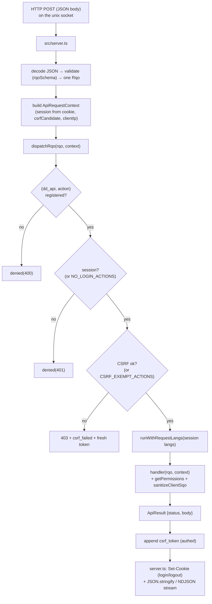

# api

> See also: [RQO](../rqo.md) · [SQO](../sqo.md) · [dd_object (ddo)](../dd_object.md) ·
> [Architecture overview](../architecture_overview.md)

The API subsystem is the single HTTP entry point of the Dédalo **work system**: it
decodes a Request Query Object (RQO), runs the security gates, dispatches the
action to a registered handler, and returns a standard JSON envelope whose
`result` is the `{context, data}` ddo.

This page is the **subsystem reference**. For the *request format* itself — every
RQO property, the action catalogue, the response-envelope fields — read
[RQO](../rqo.md) first; this document describes the **machinery** that receives
and routes an RQO, and does not repeat the property tables.

## Role

The API layer is the only network boundary of the work system: every client→server
call passes through it. It is two modules — a thin HTTP transport edge
(`src/server.ts`, a `Bun.serve` listener) and a central dispatcher
(`src/core/api/dispatch.ts`) — plus the per-class handlers in
`src/core/api/handlers/` and a small set of read-only view endpoints.

| Neighbour | Relationship |
| --- | --- |
| [`login`](login.md) / [`security`](security.md) | The API layer enforces *their* policies at the boundary — login check, CSRF, permission gates — but does not own the policy logic. |
| [search (SQO)](../sqo.md) | A read or count action hands the request's `sqo` to `buildSearchSql()`. The handler is where the *untrusted* SQO is scrubbed (`sanitizeClientSqo`). |
| `section` / components | The handlers call the section and component resolvers (`readSection`, `saveComponentData`, …) and ship the resulting ddo. **The API never reads the matrix directly.** |
| [`request_config`](../request_config.md) | The `show` / `search` / `choose` ddo_maps in the RQO are resolved into context+data by the resolvers; a client-sent ddo_map is always re-validated server-side. |
| diffusion | `dd_diffusion_api` fronts the native diffusion engine (`src/diffusion/`). |

!!! note "A registry of async handlers, not a class hierarchy"
    Handlers are plain `async` functions held in one **explicit map**,
    `ACTION_REGISTRY` (`dd_api → action → handler`), assembled in `dispatch.ts`
    from the per-class handler modules. There is **no dynamic method lookup**: an
    unregistered `(dd_api, action)` pair simply does not exist. The registry is the
    single source of truth for what the API can do.

## Responsibilities

- **Single entry point** — `server.ts` receives the raw HTTP request on a unix
  socket (the reverse proxy owns TCP and TLS), routes the API paths, decodes the
  JSON body, and validates it into one RQO with a zod schema.
- **Boundary security** — the dispatcher runs the untrusted-input gates *before*
  the handler body: the `(dd_api, action)` allowlist, the login check and the CSRF
  verification. Inside each data handler the untrusted SQO is scrubbed and the
  caller's permission is asserted.
- **Dispatch** — route the RQO to `ACTION_REGISTRY[dd_api][action]`.
- **Response shaping** — guarantee the standard envelope (`result`, `msg`,
  `errors`, `csrf_token`), append the session's fresh CSRF token, set the session
  cookie on login and logout, stream NDJSON where a handler asks for it, and
  convert a top-level throwable into a safe error envelope.
- **Session lifecycle at the edge** — resolve the session from its cookie, thread
  it through the request-scoped context, and open the per-request language scope.
- **Observability** — every outcome, gate denials included, emits a structured
  access-log line and counters.

## Key concepts

**RQO in, envelope out.** One HTTP call carries exactly one RQO; the response is
always `{result, msg, errors, …, csrf_token}`. The `result` shape depends on the
action: a `read` returns the ddo `{context, data}`, a `count` returns `{total}`, a
`start` returns `{context, data, environment}`.

**Two-level dispatch.** The top-level `action` selects the *handler* and must be
registered. Inside a data action, the per-element modifier `source.action` selects
the *behavior variant* — `read` with `source.action: 'get_data'` resolves one
component instead of the whole section; `source.action: 'resolve_data'` resolves
injected search-filter locators. See
[RQO → two-level dispatch](../rqo.md#action-string-mandatory).

**The handler class is chosen by `rqo.dd_api`**, defaulting to `dd_core_api`.

**Defence in depth, request-scoped.** Three independent gates stand between the
socket and the handler body, and each data handler adds its own permission gate
plus the per-record projects ACL.

!!! warning "Writing a handler function does not expose it"
    A new `async` handler is unreachable until it is an entry in
    `ACTION_REGISTRY`. There is no reflection fallback and no "any exported
    function is callable" rule. **Registration is the allowlist** — this is
    structural, not a convention.

    All request state is threaded explicitly through an `ApiRequestContext`.
    There are no request globals.

## Files & structure

```text
src/
├── server.ts                     # Bun.serve HTTP edge: route + decode + validate + shape output
└── core/
    ├── api/
    │   ├── dispatch.ts           # ACTION_REGISTRY assembly, the gates, the envelope
    │   ├── handlers/             # one module per dd_api class
    │   ├── response.ts           # the ApiResult envelope + denied() helper
    │   ├── raw_view.ts           # read-only /api/v1/raw endpoint
    │   └── environment_view.ts   # read-only /api/v1/environment endpoint
    ├── section/read_facade.ts    # the read sub-action routing
    ├── security/                 # session_store.ts (sessions + CSRF), auth.ts, permissions.ts
    ├── search/                   # sql_assembler.ts etc. (reached through read/count)
    └── resolve/                  # request_lang.ts (per-request lang scope), structure_context.ts, …
```

`dispatch.ts` is **registry assembly + gates + envelope only**. The per-class
handler bodies live in `src/core/api/handlers/<class>.ts`.

### The registered handler classes

`dispatchRqo()` accepts only these `dd_api` values — the top-level keys of
`ACTION_REGISTRY`. They are the client wire contract.

| `dd_api` key | Concern |
| --- | --- |
| `dd_core_api` | The core data lifecycle: `start`, `read`, `read_raw`, `create`, `duplicate`, `delete`, `save`, `count`, the element/section contexts, `get_section_terms`, `get_indexation_grid`, `get_environment`. |
| `dd_utils_api` | Utilities: `login`, `quit`, `change_lang`, locks, uploads, `get_system_info`, `get_login_context`, `get_install_context`, `install`, the SQO→SQL dev console, and the update-server surfaces. |
| `dd_tools_api` | `user_tools` and `tool_request` (per-tool action dispatch). |
| `dd_ts_api` | Tree operations: `get_node_data`, `get_children_data`, `add_child`, `update_parent_data`, `save_order`. |
| `dd_area_maintenance_api` | The maintenance widgets: `widget_request`, `get_widget_value`, `lock_components_actions` — admin-gated inside the dispatcher. |
| `dd_diffusion_api` | The diffusion engine: `diffuse`, `validate`, `get_process_status`, `list_processes`, `cancel_process`, `get_diffusion_info`, `get_engine_advisory`, `retry_pending_deletions`, `rebuild_media_index`. |
| `dd_component_portal_api` | `delete_locator` (bulk locator removal). |
| `dd_component_av_api` | `create_posterframe`, `delete_posterframe`, `get_media_streams`. |
| `dd_component_3d_api` | `move_file_to_dir`, `delete_posterframe`. |
| `dd_component_info` | `get_widget_data`. |
| `dd_rag_api` | Retrieval: `semantic_search`, `retrieve`, `get_agent_context`, `similar_to`, `ask`, `similar_objects`, `search_by_text_image`, `characterize_object`. ACL-gated inside the handlers. |
| `dd_mcp_api` | The in-process agent bridge: `mcp_proxy`, `agent_models`, `agent_chat`, `agent_chat_stream`, `agent_apply`. **Fail-closed** — every action refuses unless the agent HTTP surface is explicitly enabled. |
| `dd_error_report_api` | `receive_report` — machine-to-machine error intake, reachable only where the receiver is enabled. |

## Request lifecycle



A JSON POST reaches `src/server.ts` on the unix socket. The server matches the API
path, parses the body, validates it into one `Rqo`, resolves the session from the
cookie, and builds an `ApiRequestContext` (request id, client IP from
`X-Forwarded-For`, the session, the raw session token, and the CSRF candidate from
the `X-Dedalo-Csrf-Token` header). It then calls `dispatchRqo()`.

Inside the dispatcher the RQO passes the gates **in order** — the `(dd_api,
action)` registry allowlist, the login check (with a small `NO_LOGIN_ACTIONS`
allowlist), and the CSRF verification (with a `CSRF_EXEMPT_ACTIONS` list) — before
the handler runs inside the per-request language scope. Each data handler adds its
own permission gate and scrubs the untrusted SQO. The handler returns an
`ApiResult`; the dispatcher appends the session's fresh `csrf_token`, and
`server.ts` sets the session cookie on login or logout and serializes the JSON (or
streams NDJSON).

Two narrower gates ride alongside:

- the **install surface** is pre-auth by design (a fresh instance has no session),
  but only while the install is unsealed *and* only from an allowed address. Once
  sealed, the surface returns `404` — a configured server exposes no residual
  pre-auth install actions.
- the **error-report intake** is reachable only where the receiver is enabled.

### What `server.ts` does — and does not

`src/server.ts` is intentionally thin. It handles only the transport edge:

- `Bun.serve` on a **unix socket**; the reverse proxy owns TCP, TLS and the
  `Secure` cookie flag.
- Routes the API paths, the media path (session-gated, fail-closed), and the
  read-only raw/environment views.
- Reads the body and parses it; on a parse failure returns
  `400 {result:false, msg:'Invalid JSON body'}`. Validates with `rqoSchema`; on
  failure returns `400 {result:false, msg:'Invalid RQO', errors}`.
- Handles the **multipart** upload branch before JSON dispatch, resolving its own
  cookie and CSRF candidate.
- Builds the `ApiRequestContext` and awaits `dispatchRqo(rqo, context)`.
- Shapes the response: `Set-Cookie` on login/logout, `application/x-ndjson` when a
  handler returns a raw NDJSON stream, otherwise JSON.

The *policy* — who may call what — lives one layer down, in `dispatch.ts`.

## The dispatcher surface

`src/core/api/dispatch.ts`:

| symbol | purpose |
| --- | --- |
| `dispatchRqo(rqo, context)` | The central router: registry allowlist → login check → CSRF check, open the request-scoped language context, run the handler, catch any throwable into a uniform error envelope, append the session `csrf_token`, and emit the access-log line. Returns an `ApiResult`. |
| `NO_LOGIN_ACTIONS` | The actions runnable without a session, keyed on the `${dd_api}:${action}` **pair**. |
| `CSRF_EXEMPT_ACTIONS` | The bootstrap and machine-to-machine actions exempt from CSRF, keyed on the same pair. |
| `ApiRequestContext` | The per-request state the HTTP layer threads explicitly: `requestId`, `clientIp`, `session`, `sessionToken`, `csrfCandidate`, and the lazily-resolved `principal`. |

!!! warning "The gate sets are keyed on the pair, not the action name"
    `NO_LOGIN_ACTIONS` and `CSRF_EXEMPT_ACTIONS` hold `${dd_api}:${action}`
    strings. A future handler in another class whose action name collides must
    **not** inherit the exemption — that is exactly the bug the pair key prevents.

CSRF verification is `verifyCsrf(session, candidate)` (constant-time, in
`session_store.ts`). The client echoes the token back via the
`X-Dedalo-Csrf-Token` header — or a `csrf_token` query parameter for multipart
uploads. Read and count are **not** exempt. On a CSRF failure the dispatcher
returns `403` whose `errors` include `csrf_failed` and whose body carries the
session's **current** token, so the client's transparent single retry can succeed.

Sessions are the rotating server-side sessions of
`src/core/security/session_store.ts`, issued by the Argon2id login in `auth.ts`.

## `dd_core_api` — the core data lifecycle

The default handler class. Every action is an
`async (rqo, context) => Promise<ApiResult>`.

### Record lifecycle

| action | purpose |
| --- | --- |
| `start` | Build the first-boot context (`environment` + a structure context). Not logged in → the login element context; logged in → the deep-linked page element (or the default section in list mode) plus the optional menu shell. |
| `read` | Read records as context+data. Gates on `(section_tipo, tipo)` and on every SQO target section. Routing is owned by `src/core/section/read_facade.ts`: menu reads, area reads, `get_relation_list`, `resolve_data` (search-filter chips), `get_data` (a single component / portal pagination), Time Machine reads, else the whole section via `readSection`. |
| `read_raw` | The full raw stored value(s) for a SQO's matched records; read-gated (level ≥ 1) on every SQO target section. |
| `create` | Create a record in the target section; write-gated (level ≥ 2). Returns the new `section_id`. |
| `duplicate` | Clone a record; write-gated, plus a per-record scope check for non-admins. |
| `delete` | `delete_record` (removes the row, Time Machine snapshot first) or `delete_data` (the default — empties the row's components); write-gated. A multi-record SQO delete is global-admin only. |
| `save` | Persist changes: gate level ≥ 2 on `(section_tipo, tipo)`, apply `data.changed_data` through `saveComponentData`, run the server-side observers, audit the activity, and echo the saved component in the canonical DataItem shape. |
| `count` | The record total for a search (`full_count`), or the inverse-reference count for `mode: 'related'`. The same permission gates and projects ACL as `read`. |

### Context, terms and environment

| action | purpose |
| --- | --- |
| `get_element_context` | Resolve one element's structure context (section, component, area or tool); read-gated. |
| `get_section_elements_context` | The edit-mode search-filter panel's element list; permissions always enforced server-side. |
| `get_section_terms` | Batch-resolve the labels of a set of locators. The batch size is capped and truncated loudly past the cap. |
| `get_indexation_grid` | Build the tag-indexation grid for a record. Requires `section_tipo`, `section_id` and `tipo`. |
| `get_environment` | The full client environment / bootstrap payload. No-login and CSRF-exempt. |

## How it fits with the rest of Dédalo

- **[RQO](../rqo.md)** — the message this subsystem decodes. The RQO page owns the
  property tables, the action catalogue and the envelope fields; this page owns the
  *machinery*.
- **[SQO](../sqo.md)** — the query carried in `rqo.sqo`. The data handlers are the
  only place an untrusted SQO is scrubbed; from there it flows to
  `buildSearchSql()`.
- **[dd_object (ddo)](../dd_object.md)** — what a data action *returns*: the
  handlers pack the `{context, data}` ddo into `result`.
- **[Architecture overview](../architecture_overview.md#the-request-lifecycle)** —
  the wider round trip.
- **[login](login.md) / [security](security.md)** — the session, CSRF and
  permission policies the gates enforce. The API layer is the *enforcement point*;
  those subsystems are the *policy source*.
- **[request_config](../request_config.md)** — the ddo_map layouts the data actions
  resolve.
- **[Diffusion](diffusion.md)** — `dd_diffusion_api` fronts the native diffusion
  engine, the only subsystem that talks to MariaDB.

## Examples

### The dispatch contract, server side

```ts
// src/server.ts (essence)
const rawBody = await request.json();
const parsedRqo = rqoSchema.safeParse(rawBody);           // validate → one Rqo
if (!parsedRqo.success) return jsonResponse({ result: false, msg: 'Invalid RQO' }, 400);

const apiContext: ApiRequestContext = {
    requestId: context.requestId,
    clientIp: request.headers.get('x-forwarded-for')?.split(',')[0]?.trim() ?? 'local',
    session: sessionToken !== undefined ? getSession(sessionToken) : null,
    sessionToken: sessionToken ?? null,
    csrfCandidate: request.headers.get('x-dedalo-csrf-token'),
};

const outcome = await dispatchRqo(parsedRqo.data, apiContext); // gates + handler + csrf_token
return new Response(JSON.stringify(outcome.body), { status: outcome.status });
```

### A minimal read RQO and its response

Request — see [RQO](../rqo.md) for the full property reference:

```json
{
    "action" : "read",
    "dd_api" : "dd_core_api",
    "source" : { "typo":"source", "type":"section", "model":"section",
        "tipo":"oh1", "section_tipo":"oh1", "section_id":3, "mode":"edit", "lang":"lg-eng" },
    "sqo"    : { "section_tipo":["oh1"], "limit":1, "offset":0,
        "filter_by_locators":[{"section_tipo":"oh1","section_id":3}] }
}
```

Response — `result` carries the [ddo](../dd_object.md):

```json
{
    "result" : { "context": [ ], "data": [ ] },
    "msg"    : "OK",
    "csrf_token" : "…"
}
```

### Adding a remote action

```ts
// An async function alone is NOT callable. It becomes reachable only when it is
// registered in ACTION_REGISTRY under its dd_api key and action name:
const ACTION_REGISTRY: Record<string, Record<string, ActionHandler>> = {
    dd_core_api: {
        /* … existing … */
        my_new_action: async (rqo, context) => { /* gate perms, do work */ },
    },
};
```

Without the registry entry, `dispatchRqo()` rejects the call with
`denied(400, 'Undefined or unauthorized method (action)')`.

## Related

- [RQO](../rqo.md) — the request format decoded here.
- [SQO](../sqo.md) — the query carried inside the RQO and scrubbed in the handlers.
- [dd_object (ddo)](../dd_object.md) — the `{context, data}` unit returned in `result`.
- [Architecture overview](../architecture_overview.md) — where the API sits in the
  work system.
- [login](login.md) · [security](security.md) — the policies the gates enforce.
- [request_config](../request_config.md) — the ddo_map layouts resolved by data
  actions.
