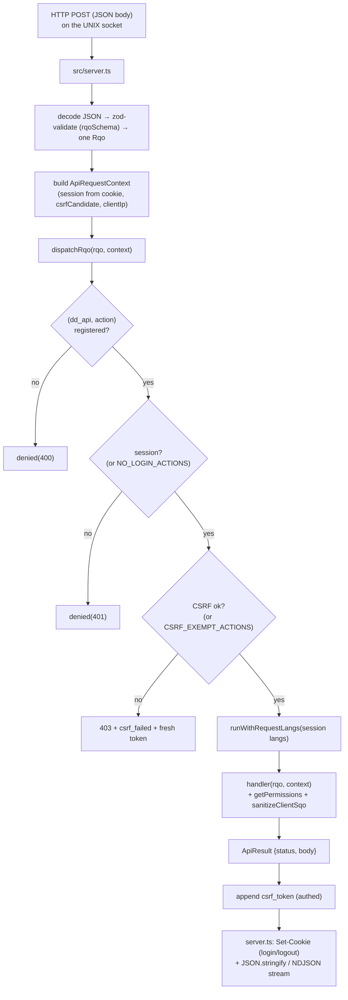

# api

> See also: [RQO](../rqo.md) · [SQO](../sqo.md) · [dd_object (ddo)](../dd_object.md) · [Architecture overview](../architecture_overview.md)

The `core/api/` subsystem is the single HTTP entry point of the Dédalo **work
system**: it decodes a Request Query Object (RQO), runs the security gates,
dispatches the action to a registered handler, and returns a standard JSON
envelope whose `result` is the `{context, data}` ddo.

This page is the **subsystem reference** for `core/api/`. For the *request
format* itself — every RQO property, the action catalogue, the response envelope
fields — read [RQO](../rqo.md) first; this document describes the **machinery**
that receives and routes that RQO and does not repeat the property tables.

## Role

`core/api/` is the only network boundary of the work system: every client→server
call (and every server-internal API call) passes through it. In the TS rewrite it
is two modules — a thin HTTP transport edge (`src/server.ts`, a `Bun.serve`
listener) and a central dispatcher (`src/core/api/dispatch.ts`) — plus a small
set of read-only view endpoints (`raw_view.ts`, `environment_view.ts`).

It sits at the top of the request lifecycle described in the
[Architecture overview](../architecture_overview.md#the-request-lifecycle): the
client `data_manager` POSTs an RQO; the API layer turns that into a call on a
section/component/tool and ships back the [ddo](../dd_object.md). Relative to
neighbouring subsystems:

| Neighbour | Relationship |
| --- | --- |
| [`login`](login.md) / [`security`](security.md) | The API layer enforces *their* policies at the boundary — login check, CSRF, permission gates — but does not own the policy logic. |
| [search (SQO)](../sqo.md) | A read/count action hands the request's `sqo` to `buildSearchSql()`; the handler is where the *untrusted* SQO is scrubbed (`sanitizeClientSqo`). |
| `section` / `component_common` | The `dd_core_api` handlers call the section/component resolvers (`readSection`, `saveComponentData`, …) and ship the resulting ddo. The API never reads the matrix directly. |
| `request_config` | `show`/`search`/`choose` ddo_maps in the RQO are resolved into context+data by the resolvers; client-sent ddo_maps are re-validated server-side. |
| diffusion (Bun) | `dd_diffusion_api` here is a thin *launcher* into the separate diffusion engine (`diffusion/api/v1/`); see [How it fits](#how-it-fits-with-the-rest-of-dedalo). |

!!! note "A registry of async handlers, not a class hierarchy"
    There is no `api` base class and no `dd_*_api` class-per-handler. Handlers are
    plain `async` functions held in one **explicit map**, `ACTION_REGISTRY`
    (`dd_api → action → handler`), in `dispatch.ts`. There is **no dynamic method
    lookup**: an unregistered `(api class, action)` pair simply does not exist.
    The registry is the single source of truth for what the API can do — stronger
    than the PHP reflection-based whitelist it replaces.

## Responsibilities

- **Single entry point** — `server.ts` receives the raw HTTP request on a UNIX
  socket (the reverse proxy owns TCP/TLS), routes the API paths, decodes the JSON
  body, and zod-validates it into one RQO.
- **Boundary security** — the dispatcher runs the untrusted-input gates *before*
  the handler body: the `(dd_api, action)` allowlist, the login check, and the
  CSRF token verification. Inside each data handler, the untrusted SQO is scrubbed
  (`sanitizeClientSqo`) and the caller's permission is asserted (`getPermissions`).
- **Dispatch** — route the RQO to the registered `ACTION_REGISTRY[dd_api][action]`
  handler and return whatever it produced.
- **Response shaping** — guarantee the standard envelope (`result`, `msg`,
  `errors`, `csrf_token`), append the session's fresh CSRF token, set the session
  cookie on login/logout, stream NDJSON where a handler asks for it, and convert
  top-level throwables into a safe HTTP-200 error envelope.
- **Session lifecycle at the edge** — resolve the native TS session from its
  cookie, thread it through the request-scoped context, and open the per-request
  language scope (`runWithRequestLangs`).
- **Action handlers** — the registered functions own the actual work: the core
  data lifecycle (`dd_core_api`), utilities, tools, thesaurus, area maintenance,
  component-specific media endpoints, RAG retrieval and the diffusion launcher.

## Key concepts

- **RQO in, envelope out.** One HTTP call carries exactly one RQO; the response is
  always `{result, msg, errors, …, csrf_token}`. The `result` payload shape
  depends on the action: a `read` returns the ddo `{context, data}`, a `count`
  returns `{total}`, a `start` returns `{context, data, environment}`.

- **Two-level dispatch.** The top-level `action` selects the *handler* (and must
  be registered in `ACTION_REGISTRY[dd_api]`). Inside data actions, the
  per-element modifier `source.action` selects the *behavior variant* (e.g.
  `read` + `source.action:'get_data'` resolves one component instead of the whole
  section, `source.action:'resolve_data'` resolves injected search-filter
  locators). See [RQO → two-level dispatch](../rqo.md#action-string-mandatory).

- **The handler class is chosen by `rqo.dd_api`**, defaulting to `dd_core_api`.

- **Defence in depth, request-scoped.** Three independent gates stand between the
  socket and the handler body — the `(dd_api, action)` allowlist, the login check,
  and the CSRF check — and each data handler adds its own permission gate plus the
  per-record projects ACL. Adding an `async` handler function does **not** expose
  it: it must also be an entry in `ACTION_REGISTRY` (the TS analog of PHP's
  `API_ACTIONS`/SEC-024 rule). All state is threaded explicitly through an
  `ApiRequestContext` — there are no request globals, so the cross-request
  static-state bleed hazard of the PHP worker model is structurally gone.

- **Native TS auth.** Sessions are the rotating server-side sessions of
  `src/core/security/session_store.ts` (login via Argon2id in `auth.ts`), resolved
  from a TS-native cookie. They are **not** PHP-session-compatible; there is no
  `session_write_close()` step.

## Files & structure

```text
src/
├── server.ts                     # Bun.serve HTTP edge: route + decode + zod-validate + shape output
└── core/
    ├── api/
    │   ├── dispatch.ts           # central dispatcher: ACTION_REGISTRY, the 3 gates, per-handler perms
    │   ├── response.ts           # the ApiResult envelope + denied() helper
    │   ├── raw_view.ts           # read-only /api/v1/raw view endpoint
    │   └── environment_view.ts   # read-only /api/v1/environment view endpoint
    ├── security/                 # session_store.ts (sessions + CSRF), auth.ts (login), permissions.ts
    ├── section/                  # read.ts (readSection), record/save_component.ts, …  (called by handlers)
    ├── search/                   # sql_assembler.ts etc. (reached via the read/count handlers)
    └── resolve/                  # request_lang.ts (per-request lang scope), environment.ts, structure_context.ts, …
```

!!! info "The PHP naming survives as registry keys"
    The `dd_core_api` / `dd_utils_api` / … names live on as the top-level keys of
    `ACTION_REGISTRY` (so the client wire contract — `rqo.dd_api` — is unchanged),
    but they are map keys, not classes. There is no `class.dd_manager.php`, no
    `v1/json/index.php`, no autoloader.

### Registered handler classes

`dispatchRqo()` accepts only these `dd_api` values (the top-level keys of
`ACTION_REGISTRY`):

| `dd_api` key | Concern |
| --- | --- |
| `dd_core_api` | Core data lifecycle: `start`, `read`, `read_raw`, `create`, `duplicate`, `delete`, `save`, `count`, element/section contexts, `get_environment`. |
| `dd_utils_api` | Utilities: `login`, `quit`, `change_lang`, locks, uploads, `get_system_info`, `get_login_context`, `get_install_context`, the SQO→SQL dev console. |
| `dd_tools_api` | `user_tools` + `tool_request` (per-tool action dispatch). |
| `dd_ts_api` | Thesaurus/ontology tree operations (`get_node_data`, `get_children_data`, `add_child`, `update_parent_data`, `save_order`). |
| `dd_area_maintenance_api` | Admin maintenance widgets (`widget_request`, `get_widget_value`, `lock_components_actions`) — permission-gated inside the dispatcher. |
| `dd_diffusion_api` | Diffusion launcher — `rebuild_media_index` (forwards to the Bun diffusion engine). |
| `dd_component_portal_api` | `delete_locator` (bulk locator removal). |
| `dd_component_av_api` | `create_posterframe`, `delete_posterframe`, `get_media_streams`. |
| `dd_component_3d_api` | `move_file_to_dir`, `delete_posterframe`. |
| `dd_rag_api` | RAG retrieval actions (ACL-gated inside the handlers). |

!!! warning "Handler classes not (yet) ported"
    The PHP `dd_ontology_api`, `dd_agent_api`, `dd_mcp_api`,
    `dd_component_text_area_api` and `dd_component_info` handlers are **not**
    present in the TS registry. Ontology browse/edit is served through the
    `dd_ts_api` tree operations and the area reads on `dd_core_api`; the agent/MCP
    and text_area endpoints are ledgered as not-yet-ported (see
    [STATUS.md](../../../rewrite/STATUS.md)). Do not document them as live TS
    actions.

## Request lifecycle (the dispatcher chokepoint)



**Prose description of the diagram above:** A JSON POST reaches `src/server.ts` on
the UNIX socket (the reverse proxy owns TCP/TLS). The server matches the API path,
parses the body, zod-validates it into one `Rqo`, resolves the session from the
TS-native cookie, and builds an `ApiRequestContext` (request id, client IP from
`X-Forwarded-For`, the session, the raw session token, and the CSRF candidate from
the `X-Dedalo-Csrf-Token` header). It then calls `dispatchRqo()`. Inside the
dispatcher the RQO passes three gates in order — the `(dd_api, action)` registry
allowlist, the login check (with a small `NO_LOGIN_ACTIONS` allowlist), and the
CSRF verification (with a `CSRF_EXEMPT_ACTIONS` list) — before the handler runs
inside the per-request language scope (`runWithRequestLangs`). Each data handler
adds its own permission gate (`getPermissions`) and scrubs the untrusted SQO
(`sanitizeClientSqo`). The handler returns an `ApiResult`; the dispatcher appends
the session's fresh `csrf_token`, and `server.ts` sets the session cookie on
login/logout and serializes the JSON (or streams NDJSON).

### What `server.ts` does (and what it does not)

`src/server.ts` is intentionally thin. It handles only the transport edge:

- `Bun.serve` on a UNIX socket; the reverse proxy (Apache/Nginx) owns TCP, TLS and
  `Secure` cookie flags.
- Route the API paths (`/api/v1/json`, `/dedalo/core/api/v1/json[/]`), the media
  path (session-gated, fail-closed), and the read-only `/api/v1/raw` /
  `/api/v1/environment` views.
- Read the body and `request.json()`; on parse failure return `400 {result:false,
  msg:'Invalid JSON body'}`. Zod-validate with `rqoSchema`; on failure return
  `400 {result:false, msg:'Invalid RQO', errors}`.
- Handle the **multipart** upload branch (PHP `dd_utils_api::upload`) before JSON
  dispatch, resolving its own cookie + CSRF candidate.
- Build the `ApiRequestContext` and `await dispatchRqo(rqo, context)`.
- Shape the response: `Set-Cookie` when the handler returns `setSessionToken`
  (login) or `clearSessionCookie` (logout); `application/x-ndjson` when the body
  carries a raw `ndjson` string (tool_export stream); otherwise `JSON.stringify`.

The *policy* — who may call what — lives one layer down in `dispatch.ts`.

## Public API

### `dispatchRqo` (the dispatcher)

`dispatch.ts` exports the dispatcher and its gate constants:

| symbol | purpose |
| --- | --- |
| `dispatchRqo(rqo, context)` | The central router: enforce the registry allowlist → login check → CSRF check, open the request-scoped language context, run the handler, catch any throwable into a uniform HTTP-200 error envelope, and append the session `csrf_token`. Returns an `ApiResult`. |
| `NO_LOGIN_ACTIONS` | Actions runnable without a session: `login`, `get_environment`, `start`, `get_login_context` (the PHP no-login list, trimmed to what is implemented). |
| `CSRF_EXEMPT_ACTIONS` | Read-only/bootstrap actions exempt from CSRF: `login`, `get_environment`, `start`, `get_login_context`. PHP does **not** exempt read/count, and neither does TS — the client echoes the token on every call. |
| `ApiRequestContext` | The per-request state the HTTP layer threads explicitly: `requestId`, `clientIp`, `session`, `sessionToken`, `csrfCandidate`, and the lazily-resolved `principal`. |

CSRF verification is `verifyCsrf(session, candidate)` (constant-time, in
`session_store.ts`); the client must echo the token back via the
`X-Dedalo-Csrf-Token` header (or a `csrf_token` query param for multipart
uploads). On a CSRF failure the dispatcher returns a `403` whose `errors` include
`csrf_failed` and whose body carries the session's **current** token, so the
client's transparent single-retry can succeed (SEC-008 client contract).

!!! note "Registration is the allowlist"
    Where PHP required a public-static method **and** an `API_ACTIONS` entry, TS
    requires only an entry in `ACTION_REGISTRY`. There is no reflection fallback:
    a function that is not registered is unreachable. This is the SEC-024 rule,
    made structural.

### `dd_core_api` (core data lifecycle)

The default handler block. Every action is an
`async (rqo, context) => Promise<ApiResult>`. Grouped by concern:

**Record lifecycle**

| action | purpose |
| --- | --- |
| `start` | Build the first-boot context (`environment` + a structure-context). Not logged in → the login element context; logged in → the deep-linked page element (or the default section, list mode) + optional menu shell. |
| `read` | Read records as context+data. Gates on `(section_tipo, tipo)` and every SQO target section. Dispatches on `source.model`/`source.action`: `menu` reads, area reads, `get_relation_list` (Referencias panel), `resolve_data` (search-filter chips), `get_data` (single-component / portal pagination), TM reads, else the whole section via `readSection`. |
| `read_raw` | Full raw stored value(s) for a SQO's matched records; read-gated (level ≥ 1) on every SQO target section. |
| `create` | Create a new record in the target section; write-gated (level ≥ 2). Returns the new `section_id`. |
| `duplicate` | Clone a record into a new one; write-gated + a per-record scope check for non-admins. |
| `delete` | `delete_record` (removes the row, TM snapshot first) or `delete_data` (the default — empties the row's components); write-gated. Multi-record SQO deletes are global-admin only. |
| `save` | Persist changes: gate level ≥ 2 on `(section_tipo, tipo)`, apply `data.changed_data` via `saveComponentData`, run server-side observers, audit the activity, and echo the saved component in the canonical DataItem shape. |
| `count` | Record total for a search (`full_count`), or the inverse-reference count for `mode:'related'`; the same permission gates + projects ACL as read apply. |

**Context / environment**

| action | purpose |
| --- | --- |
| `get_element_context` | Resolve one element's structure context (section/component/area models, and the tool branch); read-gated. |
| `get_section_elements_context` | The edit-mode search-filter panel's element list; permissions always enforced server-side. |
| `get_environment` | The full client environment/bootstrap payload. No-login + CSRF exempt. |

!!! warning "dd_core_api actions not ported"
    PHP's `get_indexation_grid`, `get_matrix_ontology_locator`,
    `get_section_terms` and `test` are **not** in the TS `dd_core_api` registry.
    The indexation grid in particular is a known gap (this install's indexation
    data is orphaned — see [dd_grid](dd_grid.md) and STATUS.md). Do not document
    them as live.

### `dd_diffusion_api` (diffusion launcher)

The TS work API registers only `rebuild_media_index` under `dd_diffusion_api` — a
global-admin action that resolves every publication target of the diffusion map
and forwards them to the Bun diffusion engine. The heavy diffusion actions
(`diffuse`, `validate`, `get_ontology_map`) are **not** actions of this work API;
they belong to the separate diffusion engine under `diffusion/api/v1/`, which is
the only thing that talks to MariaDB (see [How it fits](#how-it-fits-with-the-rest-of-dedalo)).

### Other handlers

`dd_utils_api`, `dd_tools_api`, `dd_ts_api`, `dd_area_maintenance_api`,
`dd_component_{portal,av,3d}_api` and `dd_rag_api` each register their own
actions, guarded by the same three dispatcher gates plus their own in-handler
permission checks. Their action catalogues belong in the docs of those subsystems
(tools, thesaurus tree, area maintenance, RAG); from the API layer's point of view
they are interchangeable routing targets behind the same gates.

## How it fits with the rest of Dédalo

- **[RQO](../rqo.md)** — the message this subsystem decodes. The RQO doc owns the
  property tables, the action catalogue and the response-envelope fields; this doc
  owns the *machinery* (transport edge + dispatcher + registered handlers).
- **[SQO](../sqo.md)** — the query carried inside `rqo.sqo`. The data handlers are
  the only place an untrusted SQO is scrubbed (`sanitizeClientSqo`); from there it
  flows to `buildSearchSql()`.
- **[dd_object (ddo)](../dd_object.md)** — what a data action *returns*: the
  handlers pack the `{context, data}` ddo into `result`.
- **[Architecture overview](../architecture_overview.md#the-request-lifecycle)** —
  the wider round trip; this subsystem is the "Dédalo API (server.ts → dispatch.ts)"
  box in that diagram.
- **[login](login.md) / [security](security.md)** — the session/CSRF/permission
  policies the gates enforce, backed by `src/core/security/`
  (`session_store.ts`, `auth.ts`, `permissions.ts`). The API layer is the
  *enforcement point*; those subsystems are the *policy source*.
- **[request_config](../request_config.md)** — the `show`/`search`/`choose`
  ddo_maps the data handlers resolve; client-sent ddo_maps are re-validated
  server-side.
- **Diffusion (separate engine).** The publication system is a **separate Bun
  service** (`diffusion/api/v1/`) with its own engine and its own MariaDB
  connection; `dd_diffusion_api.rebuild_media_index` is only the launcher invoked
  through *this* work API. The work API never connects to MariaDB. (See the
  diffusion docs/skill for that engine.)

## Examples

### The dispatch contract (server side)

```ts
// src/server.ts (essence)
const rawBody = await request.json();
const parsedRqo = rqoSchema.safeParse(rawBody);           // zod-validate → one Rqo
if (!parsedRqo.success) return jsonResponse({ result: false, msg: 'Invalid RQO' }, 400);

const apiContext: ApiRequestContext = {
    requestId: context.requestId,
    clientIp: request.headers.get('x-forwarded-for')?.split(',')[0]?.trim() ?? 'local',
    session: sessionToken !== undefined ? getSession(sessionToken) : null,
    sessionToken: sessionToken ?? null,
    csrfCandidate: request.headers.get('x-dedalo-csrf-token'),
};

const outcome = await dispatchRqo(parsedRqo.data, apiContext); // gates + handler + csrf_token
return new Response(JSON.stringify(outcome.body), { status: outcome.status });
```

### A minimal read RQO and its response

Request (client → API). See [RQO](../rqo.md) for the full property reference:

```json
{
    "action" : "read",
    "dd_api" : "dd_core_api",
    "source" : { "typo":"source", "type":"section", "model":"section",
        "tipo":"oh1", "section_tipo":"oh1", "section_id":3, "mode":"edit", "lang":"lg-eng" },
    "sqo"    : { "section_tipo":["oh1"], "limit":1, "offset":0,
        "filter_by_locators":[{"section_tipo":"oh1","section_id":3}] }
}
```

Response (API → client) — `result` carries the [ddo](../dd_object.md):

```json
{
    "result" : { "context": [ ], "data": [ ] },
    "msg"    : "OK",
    "csrf_token" : "…"
}
```

### Adding a new remote action (registration is the allowlist)

```ts
// In dispatch.ts, an async function alone is NOT callable. It becomes reachable
// only when registered in ACTION_REGISTRY under its dd_api key + action name:
const ACTION_REGISTRY: Record<string, Record<string, ActionHandler>> = {
    dd_core_api: {
        /* … existing … */
        my_new_action: async (rqo, context) => { /* gate perms, do work */ },
    },
};
```

Without the registry entry, `dispatchRqo()` rejects the call with
`denied(400, 'Undefined or unauthorized method (action)')`.

## Related

- [RQO](../rqo.md) — the request format decoded here (properties, actions, envelope).
- [SQO](../sqo.md) — the query carried inside the RQO and scrubbed in the handlers.
- [dd_object (ddo)](../dd_object.md) — the `{context, data}` unit returned in `result`.
- [Architecture overview](../architecture_overview.md) — where the API sits in the work system.
- [login](login.md) · [security](security.md) — the session/CSRF/permission policies the gates enforce.
- [request_config](../request_config.md) — the ddo_map layouts resolved by data actions.
- `src/server.ts` — the HTTP transport edge. · `src/core/api/dispatch.ts` — the dispatcher + `ACTION_REGISTRY`.
