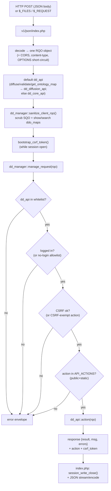

# api

> The `core/api/` subsystem — the single HTTP entry point of the Dédalo **work
> system**: it decodes a Request Query Object (RQO), runs the security gates,
> dispatches the action to a `dd_*_api` handler, and returns a standard JSON
> envelope whose `result` is the `{context, data}` ddo.

> See also: [RQO](../rqo.md) · [SQO](../sqo.md) · [dd_object (ddo)](../dd_object.md) · [Architecture overview](../architecture_overview.md)

This page is the **subsystem reference** for `core/api/`. For the *request
format* itself — every RQO property, the action catalogue, the response envelope
fields — read [RQO](../rqo.md) first; this document describes the **machinery**
that receives and routes that RQO and does not repeat the property tables.

## Role

`core/api/` is a **multi-file subsystem**, not a single class. It is the only
network boundary of the work system: every client→server call (and every
server-internal API call) passes through it. It is made of one HTTP entry-point
script, one central dispatcher class (`dd_manager`), and a set of action-handler
classes (`dd_*_api`).

It sits at the top of the request lifecycle described in the
[Architecture overview](../architecture_overview.md#the-request-lifecycle): the
client `data_manager` POSTs an RQO; the API layer turns that into a call on a
section/component/tool and ships back the [ddo](../dd_object.md). Relative to
neighbouring subsystems:

| Neighbour | Relationship |
| --- | --- |
| [`login`](login.md) / [`security`](security.md) | The API layer enforces *their* policies at the boundary — login check, CSRF, permission gates — but does not own the policy logic. |
| [search (SQO)](../sqo.md) | A read/count action hands the request's `sqo` to `search::get_instance()`; the API gate is where the *untrusted* SQO is scrubbed. |
| `section` / `component_common` | The handlers call `get_instance()` on these and ask the resulting element for its `get_json()` (the ddo). The API never reads the matrix directly. |
| `request_config` | `show`/`search`/`choose` ddo_maps in the RQO are resolved into context+data by the element; client-sent ddo_maps are scrubbed at the gate. |
| diffusion (Bun) | `dd_diffusion_api` is the PHP-side *launcher* for the separate diffusion engine; see [How it fits](#how-it-fits-with-the-rest-of-dedalo). |

!!! note "Not a class hierarchy"
    There is no `api` base class. The `dd_*_api` handlers are independent
    `final class`es (one is a plain `class`) holding **public static** action
    methods. `dd_manager` is a `final class` instantiated per request; the entry
    point is a plain PHP script. So this doc uses *Files & structure* + *Public
    API per handler*, not the *get_instance/constructor* template.

## Responsibilities

- **Single entry point** — receive the raw HTTP body (or `$_FILES`/`$_REQUEST`),
  decode it into one RQO object, set the JSON content type and CORS headers.
- **Boundary security** — run the untrusted-input gates *before* dispatch:
  `sanitize_client_rqo` (SQO + ddo_map scrub), the `dd_api` class whitelist,
  login check, CSRF token verification, and the per-class `API_ACTIONS`
  allowlist.
- **Dispatch** — route the RQO to `{dd_api}::{action}($rqo)` and return whatever
  that handler produced.
- **Response shaping** — guarantee the standard envelope (`result`, `msg`,
  `errors`, `action`, `csrf_token`), attach `debug`/metrics under `SHOW_DEBUG`,
  stream or encode the JSON, and convert top-level throwables into a safe error
  response.
- **Session lifecycle at the edge** — mint/commit the CSRF token while the
  session is open, honour `prevent_lock`, and `session_write_close()` so reads
  don't serialise behind the session.
- **Action handlers** — the `dd_*_api` classes own the actual work: the core
  data lifecycle (`dd_core_api`), utilities, tools, thesaurus, ontology,
  component-specific endpoints, agent/MCP integrations and the diffusion
  launcher.

## Key concepts

- **RQO in, envelope out.** One HTTP call carries exactly one RQO
  (`request_query_object`); the response is always
  `{result, msg, errors, action, csrf_token, …}`. The `result` payload shape
  depends on the action: a `read` returns the ddo `{context, data}`, a `count`
  returns a number/`{total}`, a `start` returns `{context, data}`.

- **Two-level dispatch.** The top-level `action` selects the *handler method*
  (and must be in that class's `API_ACTIONS`). Inside data actions, the
  per-element modifier `source->action` selects the *behavior variant* (e.g.
  `read` + `source->action: 'get_value'` returns the plain value instead of a
  ddo). See [RQO → two-level dispatch](../rqo.md#action-string-mandatory).

- **The handler class is chosen by `rqo->dd_api`**, defaulting to
  `dd_core_api`. The diffusion actions (`diffuse`, `validate`,
  `get_ontology_map`) auto-rewrite `dd_api` to `dd_diffusion_api` at the entry
  point.

- **Defence in depth.** Six independent gates stand between the socket and the
  handler body (whitelist, login, CSRF, `API_ACTIONS`, `sanitize_client_rqo`,
  plus per-action permission checks). Adding a public static method to a handler
  does **not** expose it: it must also be listed in `API_ACTIONS` (the SEC-024
  rule).

- **Two untrusted entry points, one gate.** The classic FPM/CGI entry
  (`v1/json/index.php`) and the persistent-worker SSE entry
  (`worker/class.worker_loop.php`) both call the *same*
  `dd_manager::sanitize_client_rqo()` before `manage_request()`, so the two
  cannot drift.

## Files & structure

```text
core/api/
└── v1/
    ├── json/
    │   ├── index.php                 # HTTP entry point (decode + gates + dispatch + output)
    │   ├── health/index.php          # health-check endpoint
    │   └── performance/              # opt-in request profiler (performance_monitor, viewer)
    └── common/
        ├── class.dd_manager.php       # central dispatcher: whitelist, login, CSRF, API_ACTIONS, route
        ├── class.dd_core_api.php      # core data lifecycle: start/read/save/create/delete/count/contexts
        ├── class.dd_utils_api.php     # utilities: uploads, locks, environment, misc
        ├── class.dd_tools_api.php     # tool execution launcher (export/import/time machine/…)
        ├── class.dd_ts_api.php        # thesaurus/ontology tree operations
        ├── class.dd_ontology_api.php  # ontology browse/edit
        ├── class.dd_area_maintenance_api.php  # admin maintenance widgets (perm-gated)
        ├── class.dd_diffusion_api.php  # PHP-side launcher for the diffusion (Bun) engine
        ├── class.dd_agent_api.php      # agent integration
        ├── class.dd_mcp_api.php        # MCP integration (plain class, not final)
        ├── class.dd_component_portal_api.php     # portal pagination / endpoints
        ├── class.dd_component_text_area_api.php  # text_area endpoints
        ├── class.dd_component_av_api.php          # audio/video endpoints
        ├── class.dd_component_3d_api.php          # 3d endpoints
        └── class.dd_component_info.php            # component_info endpoints (no `_api` suffix)
```

!!! info "Naming caveats"
    Most handlers follow the `dd_<thing>_api` name, but **`dd_component_info`**
    is registered in the whitelist *without* the `_api` suffix, and
    **`dd_mcp_api`** is a plain `class` (every other handler is a
    `final class`). Both are verified against the source — do not "correct" them.

### Whitelisted handler classes

`dd_manager::manage_request()` accepts only these `dd_api` values (the class
whitelist):

| Handler class | Concern |
| --- | --- |
| `dd_core_api` | Core data lifecycle: `start`, `read`, `read_raw`, `create`, `duplicate`, `delete`, `save`, `count`, element/section contexts, indexation grid, environment, ontology-locator/section-terms helpers. |
| `dd_utils_api` | Utilities: uploads, locks, environment helpers. |
| `dd_tools_api` | Generic tool launcher (routes to `{tool}::{action}`). |
| `dd_ts_api` | Thesaurus tree operations (expand/move/indexation). |
| `dd_ontology_api` | Ontology browsing/editing. |
| `dd_area_maintenance_api` | Admin maintenance widgets — additionally requires permission ≥ 2 on `DEDALO_AREA_MAINTENANCE_TIPO`. |
| `dd_diffusion_api` | Diffusion launcher: `diffuse`, `validate`, `get_ontology_map`, `get_diffusion_info`, `retry_pending_deletions`, `rebuild_media_index`. |
| `dd_agent_api`, `dd_mcp_api` | Agent / MCP integrations. |
| `dd_component_portal_api`, `dd_component_text_area_api`, `dd_component_av_api`, `dd_component_3d_api`, `dd_component_info` | Component-specific endpoints. |

## Request lifecycle (the dispatcher chokepoint)



**Prose description of the diagram above:** A JSON POST (or a `$_FILES`/
`$_REQUEST` form upload) reaches `v1/json/index.php`. The script sets the JSON
content type and CORS headers, short-circuits CORS `OPTIONS` preflights, and
decodes the body into a single RQO object. It applies the default `dd_api`
(rewriting diffusion actions to `dd_diffusion_api`, otherwise `dd_core_api`),
then runs `dd_manager::sanitize_client_rqo()` to scrub the untrusted SQO and the
`show`/`search` ddo_maps. It mints/commits the per-session CSRF token while the
session is still open, then constructs `dd_manager` and calls `manage_request()`.
Inside the dispatcher the RQO passes four gates in order — the `dd_api` class
whitelist, the login check (with a small no-login allowlist), the CSRF token
verification (with a CSRF-exempt action list), and the `API_ACTIONS`/public-static
check — before the handler method runs. The handler returns the standard
envelope; the dispatcher stamps `action` and a fresh `csrf_token`, and the entry
point closes the session and streams or encodes the JSON.

### What `index.php` does (and what it does not)

`v1/json/index.php` is intentionally thin. It handles only the transport edge:

- PHP version guard, JSON `Content-Type`, CORS headers, and an early return for
  CORS `OPTIONS` preflights (no error log written for the preflight).
- Read the raw body from `$GLOBALS['DEDALO_RAW_BODY']` (worker) or
  `php://input`; or synthesize an RQO from `$_FILES` (uploads →
  `action:'upload'`, `dd_api:'dd_utils_api'`) / `$_REQUEST` (legacy `rqo` form
  field or direct keys), XSS-scrubbing those legacy branches with
  `safe_xss` / `safe_xss_recursive` while **preserving** the `sqo` objects (so
  search operators like `>`, `<`, `*` survive — they are scrubbed instead by the
  shared SQO gate).
- Apply the default `dd_api`, call `dd_manager::sanitize_client_rqo()`,
  `dd_manager::bootstrap_csrf_token()`, and honour `recovery_mode` /
  `prevent_lock`.
- `try { $response = (new dd_manager())->manage_request($rqo); }` and convert any
  `Throwable` into a safe error envelope (full trace logged server-side only —
  SEC-016; never echo the trace or the original `$rqo`, which may carry
  credentials).
- `session_write_close()`, then output via `json_streaming_handler::stream()`
  (default) or `json_handler::encode()` (under the RoadRunner worker), with
  optional pretty-print and `Server-Timing`/profiler diagnostics.

The *policy* — who may call what — lives one layer down in `dd_manager`.

## Public API

### `dd_manager` (dispatcher)

| method | static? | purpose |
| --- | --- | --- |
| `manage_request($rqo)` | | The central router: validate `action` exists, enforce the `dd_api` whitelist → login check → CSRF check → `API_ACTIONS`/public-static check, run the maintenance-area permission gate, call `{dd_api}::{action}($rqo)`, catch `permission_exception` into a uniform error, stamp `action` + `csrf_token`, attach debug/metrics under `SHOW_DEBUG`. Returns the response object (or a `Generator` for SSE actions). |
| `sanitize_client_rqo($rqo)` | ✓ | Boundary scrub for an **untrusted** RQO: run `search_query_object::sanitize_client_sqo()` on `rqo->sqo` and `rqo->options->sqo`, and `request_config_object::sanitize_client_ddo_map()` on `rqo->show->ddo_map` / `rqo->search->ddo_map`. Mutates and returns the same `$rqo`. MUST be called at every untrusted entry point; MUST NOT be called on internal server-built RQOs. |
| `bootstrap_csrf_token()` | ✓ | Public hook the entry point calls *before* `session_write_close()` so the per-session CSRF token is minted and persisted to storage. Returns the token. |

!!! warning "`sanitize_client_rqo`, not `sanitize_client_sqo`"
    The dispatcher's entry-point gate is **`dd_manager::sanitize_client_rqo()`**.
    It *delegates* the SQO part to `search_query_object::sanitize_client_sqo()`
    (and the ddo_map part to `request_config_object::sanitize_client_ddo_map()`).
    When wiring a new untrusted entry point, call the RQO-level gate, not the SQO
    one directly — that is how the FPM and worker entries are kept in lockstep.

CSRF internals (`ensure_csrf_token`, `verify_csrf_token`,
`get_csrf_token_from_request`) are **private** and not callable as actions. The
client must echo the token back via the `X-Dedalo-Csrf-Token` header (or
`rqo->csrf_token`, or an `options.csrf_token` form field for multipart uploads).

#### Dispatcher gate constants

| constant / list | where | meaning |
| --- | --- | --- |
| `$allowed_api_classes` | `manage_request` | The `dd_api` class whitelist (see [table above](#whitelisted-handler-classes)). |
| `$no_login_needed_actions` | `manage_request` | Actions runnable without a session: `start`, `change_lang`, `login`, `get_login_context`, `install`, `get_install_context`, `get_environment`, `get_ontology_update_info`, `get_code_update_info`, `get_server_ready_status`. |
| `CSRF_EXEMPT_ACTIONS` | class const | Read-only/bootstrap actions exempt from CSRF: `start`, `get_environment`, `get_login_context`, `get_install_context`, `get_server_ready_status`, `get_ontology_update_info`, `get_code_update_info`, `get_diffusion_info`, `get_dedalo_files`, `read_raw`. |
| `API_ACTIONS` | each handler class | The per-class action allowlist (SEC-024). When present, the action must be listed; otherwise any public-static method is callable (legacy fallback). |

### `dd_core_api` (core data lifecycle)

The default handler. All methods are `public static (object $rqo) : object` and
listed in its `API_ACTIONS`. Grouped by concern:

**Record lifecycle**

| action | purpose |
| --- | --- |
| `start` | Build the minimum start-page context (menu + a section based on URL vars). `result = {context, data:[]}`. |
| `read` | Read records as context+data. Validates a non-empty `source->section_tipo`; dispatches on `source->action` (`get_value` → plain value, else `build_json_rows` → the ddo). `result = {context, data}`. |
| `read_raw` | Full raw data for a section/component selected by SQO (all languages for literals, all locators for relations); permission-checked per `sqo->section_tipo`. CSRF-exempt. |
| `create` | Create a new record in the target section. |
| `duplicate` | Duplicate an existing record. |
| `delete` | Delete a record (or a component's data). |
| `save` | Persist changes. Dispatches on `source->type` (`component` \| `section`), instantiates the element, checks permission ≥ 2, applies `data->changed_data`. Refuses the `Activity` section. |
| `count` | Count records matching the SQO (uses `search->count()`); `result` is a number or `{total}`. |

**Context / layout**

| action | purpose |
| --- | --- |
| `get_element_context` | Resolve one element's context (description) from its `source`. |
| `get_section_elements_context` | Resolve the contexts of a section's elements. |
| `get_indexation_grid` | Build the indexation grid context. |

**Helpers / environment**

| action | purpose |
| --- | --- |
| `get_environment` | Return the client environment/bootstrap context. No-login + CSRF exempt. |
| `get_matrix_ontology_locator` | Resolve a matrix/ontology locator. |
| `get_section_terms` | Resolve a section's terms. |
| `test` | Diagnostic endpoint. |

!!! note "Public-static but not actions"
    `get_page_globals()`, `get_js_plain_vars()`, `get_lang_labels($lang)` and
    `get_activity_metric()` are public static helpers but **absent from
    `API_ACTIONS`** (some take non-RQO arguments) — they are PHP-internal only
    and cannot be invoked remotely. This is the SEC-024 rule in action.

### `dd_diffusion_api` (diffusion launcher)

PHP-side launcher for the separate diffusion engine. `API_ACTIONS`: `diffuse`,
`get_diffusion_info`, `validate`, `get_ontology_map`, `retry_pending_deletions`,
`rebuild_media_index`. Selected automatically at the entry point for `diffuse` /
`validate` / `get_ontology_map`. The actual writing to MariaDB is the Bun
engine's job (see [How it fits](#how-it-fits-with-the-rest-of-dedalo)).

### Other handlers

`dd_utils_api`, `dd_tools_api`, `dd_ts_api`, `dd_ontology_api`,
`dd_area_maintenance_api`, `dd_agent_api`, `dd_mcp_api`,
`dd_component_{portal,text_area,av,3d}_api` and `dd_component_info` each expose
their own `public static` actions guarded by their own `API_ACTIONS`. Their
action catalogues belong in the docs of those subsystems (e.g. tools, thesaurus
tree, ontology); from the API layer's point of view they are interchangeable
routing targets behind the same gates.

## How it fits with the rest of Dédalo

- **[RQO](../rqo.md)** — the message this subsystem decodes. The RQO doc owns
  the property tables, the action catalogue and the response-envelope fields;
  this doc owns the *machinery* (entry point + dispatcher + handlers).
- **[SQO](../sqo.md)** — the query carried inside `rqo->sqo`. The API gate is
  the only place an untrusted SQO is scrubbed (`sanitize_client_sqo`, reached via
  `sanitize_client_rqo`); from there it flows to `search::get_instance()`.
- **[dd_object (ddo)](../dd_object.md)** — what a data action *returns*: handlers
  call the element's `get_json()` and pack the `{context, data}` ddo into
  `response->result`.
- **[Architecture overview](../architecture_overview.md#the-request-lifecycle)**
  — the wider round trip; this subsystem is the "Dédalo API
  (json/index.php → dd_manager)" box in that diagram.
- **[login](login.md) / [security](security.md)** — the policies the gates
  enforce (session, CSRF, permissions). The API layer is the *enforcement
  point*; those subsystems are the *policy source*.
- **[request_config](../request_config.md)** — the `show`/`search`/`choose`
  ddo_maps the handlers resolve; client-sent ddo_maps are scrubbed by the gate
  (`sanitize_client_ddo_map`) and re-validated server-side.
- **Diffusion (separate API).** The publication system is a **separate API**
  with its own engine: `dd_diffusion_api` is only the PHP launcher invoked
  through *this* work API. The diffusion engine itself is TypeScript running on
  Bun (under `diffusion/api/v1/`, e.g. `diffusion_processor.ts`, `db.ts`,
  `media_index.ts`) and is the only thing that talks to MariaDB. The work API
  never connects to MariaDB. (See the diffusion docs/skill for that engine.)

## Examples

### The dispatch contract (server side)

```php
// core/api/v1/json/index.php (essence)
$rqo = json_decode( $GLOBALS['DEDALO_RAW_BODY'] ?? file_get_contents('php://input') );

// diffusion actions auto-select the diffusion launcher; everything else is core
if (in_array($rqo->action ?? null, ['diffuse','validate','get_ontology_map'])) {
    $rqo->dd_api = 'dd_diffusion_api';
}
$rqo->dd_api = $rqo->dd_api ?? 'dd_core_api';

// boundary scrub of the untrusted RQO (SQO + show/search ddo_maps)
$rqo = dd_manager::sanitize_client_rqo($rqo);

// mint the CSRF token while the session is still open
dd_manager::bootstrap_csrf_token();

// dispatch
$dd_manager = new dd_manager();
$response   = $dd_manager->manage_request($rqo); // {result, msg, errors, action, csrf_token}
```

### A minimal read RQO and its response

Request (client → API). See [RQO](../rqo.md) for the full property reference:

```json
{
    "action" : "read",
    "dd_api" : "dd_core_api",
    "source" : { "typo":"source", "type":"section", "model":"section",
        "tipo":"oh1", "section_tipo":"oh1", "section_id":3, "mode":"edit", "lang":"lg-eng" },
    "sqo"    : { "section_tipo":["oh1"], "limit":1, "offset":0,
        "filter_by_locators":[{"section_tipo":"oh1","section_id":3}] }
}
```

Response (API → client) — `result` carries the [ddo](../dd_object.md):

```json
{
    "result" : { "context": [ ], "data": [ ] },
    "msg"    : "OK. Request done",
    "errors" : [],
    "action" : "read",
    "csrf_token" : "…"
}
```

### Adding a new remote action (the SEC-024 rule)

```php
// In, e.g., dd_core_api: a public static method alone is NOT callable.
public static function my_new_action(object $rqo) : object { /* … */ }

// It becomes reachable only when also listed in the class allowlist:
public const API_ACTIONS = [
    /* … existing … */,
    'my_new_action'
];
```

Without the `API_ACTIONS` entry, `dd_manager::manage_request()` rejects the call
with `Undefined or unauthorized … method`.

## Related

- [RQO](../rqo.md) — the request format decoded here (properties, actions, envelope).
- [SQO](../sqo.md) — the query carried inside the RQO and scrubbed at the gate.
- [dd_object (ddo)](../dd_object.md) — the `{context, data}` unit returned in `result`.
- [Architecture overview](../architecture_overview.md) — where the API sits in the work system.
- [login](login.md) · [security](security.md) — the session/CSRF/permission policies the gates enforce.
- [request_config](../request_config.md) — the ddo_map layouts resolved by data actions.
- `core/api/v1/json/index.php` — the HTTP entry point. · `core/api/v1/common/class.dd_manager.php` — the dispatcher.
