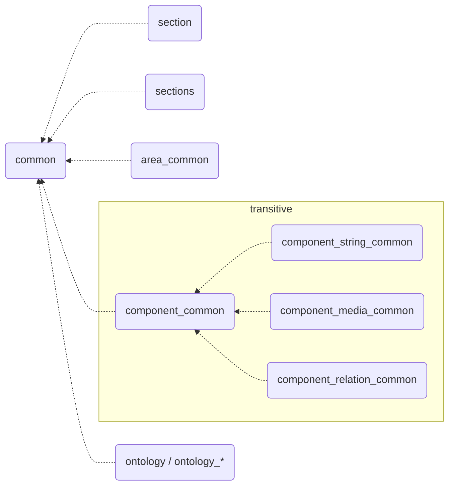
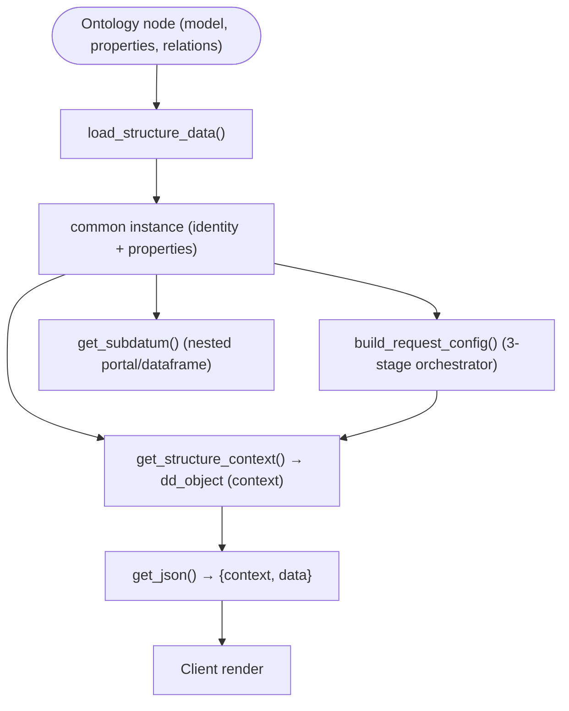

# common

> See also: [Architecture overview](../architecture_overview.md) · [Sections / `section`](../sections/section.md) · [Components](../components/index.md) · [Base classes](../components/base_classes.md) · [request_config](../request_config.md) · [dd_object](../dd_object.md)

The abstract base class `common` is the universal parent of every section, component, area and ontology object. It owns the shared identity, the magic `get_*`/`set_*` accessors, structure-context building, the `request_config` pipeline, permissions, the worker-safe static caches and the JSON-controller dispatch that all Dédalo runtime objects inherit.

This page is the **class-level reference** for `common` (`core/common/class.common.php`,
~4385 lines). It documents the contract `common` gives to *all* its subclasses,
not the behavior any single subclass adds. For how a concrete object uses this
machinery, read [`section`](../sections/section.md) and [Components](../components/index.md).

## Role

`common` (`abstract class common`) is the root of the runtime object hierarchy.
Almost every "live" Dédalo object extends it, directly or transitively:



It is **not instantiable**: it has no public constructor of its own and no
`get_instance()` — each subclass declares its own factory (`section::get_instance()`,
`component_common::get_instance()`, etc.). What `common` provides is the *shared
machinery* those factories and instances rely on:

- the identity fields every element carries (`tipo`, `section_tipo`, `section_id`,
  `mode`, `lang`, `model`, `view`, …);
- the magic accessor layer (`__call` → `get_x()` / `set_x()` for any declared
  property), plus `__get`/`__set` guards;
- ontology loading (`load_structure_data()`) and properties access
  (`get_properties()` / `set_properties()`);
- the **structure-context** builder (the cached `{context}` half of a datum);
- the **request_config** orchestrator (composed from four traits);
- permission resolution, tools and buttons context, view resolution, columns map;
- a family of **class-static caches** and the `clear()` that purges them so a
  persistent worker never bleeds one request's state into the next.

!!! note "Where `dato`/`data` live"
    `common` deliberately does **not** declare a `dato` property or
    `get_dato()`/`set_dato()`/`get_data()`/`set_data()` methods. The record
    payload accessors belong to the subclasses (`section` holds `$dato`;
    `component_common` holds `$data_resolved`, `get_data()`, `set_data()`,
    `get_value()`). `common` only supplies the *accessor plumbing* that makes
    those `get_*`/`set_*` calls resolve. The legacy v6 `$data` field is a
    `private string` literally set to `'NO USABLE DATA'`, and `__get`/`__set`
    throw if anyone tries to read or write a property literally named `data`.

## Responsibilities

- **Identity** — declare the canonical element fields (`tipo`, `section_tipo`,
  `section_id`, `mode`, `lang`, `model`, `label`, `order_number`, `translatable`,
  `permissions`, `pagination`, `uid`, …) and load them from the ontology once.
- **Accessor layer** — provide generic `get_<prop>()` / `set_<prop>()` via
  `__call`, the `SetAccessor`/`GetAccessor` primitives, and forward unknown calls
  to `diffusion_fn`. Guard the reserved `data` name.
- **Ontology binding** — `load_structure_data()` pulls `model`, `order_number`,
  `label`, `translatable` and `properties` from the element's `ontology_node`.
- **Properties** — read (`get_properties()`), inject (`set_properties()`, marks
  `properties_injected`), and the v5 `get_propiedades()` compatibility shim.
- **Structure context** — build the cached `context` half of the datum
  (`get_structure_context()` / `build_structure_context*()`), including
  tools, buttons, view, columns_map and (optionally) request_config.
- **request_config pipeline** — the three-stage orchestrator
  (`build_request_config()`, `get_ar_request_config()`) implemented across four
  traits, with its own cache, preset hashing and config-warning collector.
- **Permissions** — `get_permissions()` (delegates to `security`), `set_permissions()`.
- **JSON dispatch** — `get_json()` includes the per-model `*_json.php` controller
  and returns the normalized `{context, data}` response object.
- **Subdatum resolution** — `get_subdatum()` resolves nested (portal/dataframe)
  context+data from the request_config DDO maps.
- **Language** — `set_lang()`, `get_main_lang()`, `get_element_lang()`,
  `get_ar_all_langs()` and the no-lang fixing.
- **Worker hygiene** — own the class-static caches and purge them in `clear()`.

## Key concepts

### The datum is built here, not the data

`common` is the *describe* side of "the server describes, the client draws". It
assembles **context** (the ontology-derived description: label, model, mode,
properties, css, permissions, tools, buttons, request_config) into a
[`dd_object`](../dd_object.md). The **data** (values) is produced by the
subclass JSON controller. `build_element_json_output($context, $data)` is the
trivial helper that packs the two halves into one `{context, data}` object.

### context_key / merge_unique_context

The client matches a context item by the triple **tipo + section_tipo + mode**.
`context_key($item)` builds exactly that key (JSON-encoding an array
`section_tipo` so `['a']` can never collide with the string `'a'`), and
`merge_unique_context()` appends items while skipping duplicates — first
occurrence wins, mirroring the `sections_json` and client dedup behavior. This is
why `get_subdatum()` only emits one context per column even across many rows.

### Static caches and `clear()`

`common` is the home of several **class-static** caches. Because Dédalo can run
in a persistent worker, these MUST be purged between requests or state bleeds
across users. `clear()` resets all of them (and resets the `search`
per-user filter cache when that class is loaded):

| static cache | what it holds |
| --- | --- |
| `$cache_structure_context` | resolved structure-context cores keyed by tipo/section_tipo/mode (+ properties hash when injected) |
| `$cache_order_path` | resolved component order paths (filled by `component_common::get_order_path`) |
| `$cache_matrix_table_from_tipo` | tipo → matrix table name |
| `$cache_tables_with_relations` | matrix tables that carry relation columns (diffusion/relations) |
| `$current_main_lang` | per-section resolved main language |
| `$ar_related_by_model_data` | `get_ar_related_by_model()` results |
| `$resolved_request_properties_parsed` | parsed request property expressions |
| `$cache_get_tools` | per-element resolved tool lists |
| `$cache_buttons_tools` | per-button resolved tool context |
| `$pdata` | CLI/background process messaging object |

The size-bounded caches are trimmed by `manage_cache_size()` (cap
`MAX_CACHE_SIZE = 1000`, keeps the most recent entries) so a long-lived worker
cannot leak unbounded entries.

!!! warning "Worker state bleed"
    Any new class-static cache added to `common` (or a subclass) must be reset in
    `clear()`. Persistent-worker statics that survive a request are the dominant
    root cause of cross-request data bleed in this codebase.

## Instantiation & lifecycle

`common` is **abstract** — you never `new common()` and there is no
`common::get_instance()`. A subclass factory creates the object and, in its
constructor, sets `$tipo` (and usually `$section_tipo`, `$section_id`, `$mode`,
`$lang`) and then calls the inherited `load_structure_data()`:

```php
// inside a subclass factory / constructor (illustrative)
$this->tipo = $tipo;            // e.g. 'rsc91'
$this->section_tipo = $section_tipo;
$this->mode = $mode;            // 'edit' | 'list' | 'search' | 'tm' | ...
$this->load_structure_data();   // pulls model, label, order_number,
                                // translatable and properties from the ontology
```

`load_structure_data()` is idempotent: it runs once (guarded by
`$bl_loaded_structure_data`), instances the `ontology_node` for `$tipo`, and
fills `model`, `order_number`, `label`, `translatable` and `properties`. When the
element is not translatable it forces `lang` to `lg-nolan` (`DEDALO_DATA_NOLAN`)
via `fix_language_nolan()`.

A concrete element you can reach the `common` API through:

```php
// instance a real subclass, then use the inherited common surface
$section = section::get_instance('rsc197', 'edit');

$tipo   = $section->get_tipo();          // magic accessor (common::__call)
$mode   = $section->get_mode();          // 'edit'
$props  = $section->get_properties();    // ontology properties object|null
$perms  = common::get_permissions('rsc197', 'rsc197'); // 0..3
$ddo    = $section->get_structure_context($perms); // dd_object (context)
$json   = $section->get_json();          // {context, data}
```

## Public API

Grouped by concern. *static?* marks class-level (static) methods. Every method
below is verified against `core/common/class.common.php`.

### Identity & accessors

| method | static? | purpose |
| --- | --- | --- |
| `__call($strFunction, $arArguments)` | | Magic dispatcher: `get_<prop>()`/`set_<prop>()` against any **declared** property (via `GetAccessor`/`SetAccessor`); also forwards any other call to `diffusion_fn::<fn>($this, …)`. |
| `SetAccessor($strMember, $value)` | | (protected, final) Set a declared property; returns `false` if it does not exist. |
| `GetAccessor($strMember)` | | (protected, final) Return a declared property, or `false` if it does not exist. |
| `__get($name)` / `__set($name,$value)` | | Guard undeclared access; **throw** when `$name === 'data'` (reserved legacy field). |
| `get_model()` | | Return the runtime class name (`get_called_class()`), e.g. `component_portal`. |
| `get_info()` | | Minimal descriptor `{section_tipo, tipo, label, model}`. |
| `get_source()` | | Unified source object `{tipo, model, section_tipo, section_id, lang, mode}`. |
| `get_section_id()` | | Return `$section_id` (string\|int\|null). |
| `is_translatable()` | | Whether the element stores per-language values. |

!!! note "Accessors come from `__call`, not declared methods"
    `get_tipo()`, `set_tipo()`, `get_mode()`, `get_lang()`, `get_pagination()`,
    `get_section_tipo()` (where declared on the subclass), etc. are **not**
    written out — they are resolved by `__call` against the declared properties.
    Only properties that exist on the instance are settable/gettable this way.

### Ontology & properties

| method | static? | purpose |
| --- | --- | --- |
| `load_structure_data()` | | (protected) One-time ontology load: sets `model`, `order_number`, `label`, `translatable`, `properties` from the `ontology_node`. |
| `get_properties()` | | Return the parsed ontology `properties` object (cached on the instance), or `null`. |
| `set_properties($value)` | | Inject properties (string is JSON-decoded), set `properties_injected = true` so the structure-context cache key is extended with their hash. |
| `get_propiedades()` | | v5/diffusion compatibility: the raw decoded legacy `propiedades`. Do not use in v6/v7 paths. |
| `get_ar_related_component_tipo()` | | The related component tipos from the node `relations`. |
| `get_ar_related_by_model($model_name, $tipo, $strict=true)` | ✓ | Related tipos of a node filtered by target model (cached). |
| `get_allowed_relation_types()` | ✓ | The fixed list of allowed relation-type tipos (children/parent/related/index/model/link/filter). |

### Structure context (the datum's context half)

| method | static? | purpose |
| --- | --- | --- |
| `get_structure_context($permissions=0, $add_request_config=false)` | | Build the full element context as a `dd_object` (tools + buttons calculated). |
| `get_structure_context_simple($permissions=0, $add_request_config=false)` | | Same, but **skips** tools and buttons (used for component listings / search presets). |
| `build_structure_context($permissions, $add_request_config, $simple)` | | (protected) Stamps per-instance variant fields onto a clone of the cached invariant core. |
| `build_structure_context_core($add_request_config, $simple)` | | (protected) Build the cacheable invariant core stored in `$cache_structure_context`. |
| `resolve_context_parent()` | | (protected) Resolve the context parent tipo for nested ddo linking. |
| `get_subdatum($from_parent=null, $ar_locators=[])` | | Resolve nested (portal/dataframe) `{context, data}` from this element's request_config DDO maps; dedups context by `context_key`. |
| `build_element_json_output($context, $data=[])` | ✓ | Pack `{context, data}` into one response object. |
| `get_data_item($value)` | | Wrap a value in the unified data item `{section_id, section_tipo, tipo, pagination, from_component_tipo, value}`. |
| `context_key($item)` | ✓ | The client identity key `tipo_section_tipo_mode` for dedup. |
| `merge_unique_context($ar_context, $ar_items)` | ✓ | Append items skipping already-seen `context_key`s (first wins). |

### request_config pipeline

The orchestrator is composed from four traits — `request_config_utils`,
`request_config_ddo`, `request_config_v6`, `request_config_v5` — whose ~40
methods are all `protected` internal stages (cache key, source-property
resolution, ddo-map processing, v5/v6 parsers). The public entry points are:

| method | static? | purpose |
| --- | --- | --- |
| `build_request_config()` | | The three-stage orchestrator: (1) short-circuit from the client RQO if it targets this element; (2) deterministic base build from ontology properties (optionally a user preset); (3) overlay per-call request state (rqo/session sqo) on this instance's private copy. Memoized on the instance. |
| `build_request_config_from_rqo($rqo)` | | (protected) Stage 1 — rebuild config from the client's RQO `show`, or `null` to fall through. |
| `get_ar_request_config($properties_override=null)` | | Stage 2 base build: validated, cached array of `request_config_object`s for this element (keyed by tipo/section_tipo/mode/section_id, with preset hash). |
| `get_request_config_object()` | | Convenience: the first `request_config_object` from `get_ar_request_config()`, or `null`. |
| `overlay_request_state($request_config, $requested_sqo, $tipo)` | | (protected) Stage 3 — merge rqo/session sqo onto the private copy (never the cached base). |
| `resolve_preset_properties($tipo, $section_tipo, $mode)` | | (protected) Resolve a user layout preset that overrides ontology properties. |
| `add_request_config_warning($type, $message, $data=null)` | | (protected) Collect a build issue into `$request_config_warnings` (surfaced as `config_warnings` under debug). |
| `validate_requested_ddo($current_ddo, $map_type)` / `consolidate_requested_ddo(...)` | | (protected/private) Validate and merge a client-requested ddo against the resolved one. |
| `resolve_limit()` | | Resolve the configured pagination `limit` from the element's properties, or `null`. |

!!! info "v5 is the default builder"
    The deterministic base build runs the v5 trait machinery; the v6 trait is the
    legacy parser path. See [request_config](../request_config.md) for the full
    contract, the immutable cache clone boundary, and the error contract.

### Permissions

| method | static? | purpose |
| --- | --- | --- |
| `get_permissions($parent_tipo=null, $tipo=null)` | ✓ | Resolve the integer permission (0 none / 1 read / 2 read+write / 3 admin) via `security::get_security_permissions()`. Returns `0` when not logged in or on missing tipos; clamps the Time Machine section to read-only. **Not** the place to resolve a component's own permission — subclasses wrap it. |
| `set_permissions($number)` | | Set the instance `permissions` int. |

### JSON controller dispatch

| method | static? | purpose |
| --- | --- | --- |
| `get_json($request_options=null)` | | Include the per-model `<model>_json.php` controller (e.g. `component_input_text_json.php`) and return its `{context, data}` object. `$request_options` toggles `get_context` / `context_type` / `get_data` / `get_request_config`. |

### Tools, buttons, view, columns

| method | static? | purpose |
| --- | --- | --- |
| `get_tools()` | | Resolve the element's tool list filtered by user permissions (cached in `$cache_get_tools`; empty in autocomplete requests). Returns `[]` when none. |
| `get_buttons_context()` | | Resolve the element's buttons as `dd_object`s — only for `section` and `area*` models; `[]` otherwise. |
| `get_columns_map()` | | The list-view `source.columns_map` from properties (uses the `section_list` child term in `list`/`tm` modes). |
| `get_view()` | | Resolve the active view: injected `$view`, else `section_list` child / properties `view`, else `resolve_view()` legacy fallback. |
| `set_view($view)` | | Set the instance view. |
| `get_children_view()` | | Resolve the view used to render nested children. |
| `resolve_view($options)` | ✓ | Static legacy/model-based view fallback (`{model, tipo}` → view). |

### Language & matrix helpers

| method | static? | purpose |
| --- | --- | --- |
| `set_lang($lang)` | | Set the working language and force a data reload (`set_to_force_reload_data()`). |
| `set_to_force_reload_data()` | | Drop cached resolved data so the next read refetches (skipped in `tm` mode). |
| `get_main_lang($section_tipo, $section_id=null)` | ✓ | Resolve the section's main language (cached); special-cases the langs section and thesaurus/hierarchy. |
| `get_element_lang($tipo, $data_lang=null)` | ✓ | Resolve an element's lang before constructing it (`lg-nolan` when non-translatable). |
| `get_ar_all_langs()` | ✓ | All project languages from `DEDALO_PROJECTS_DEFAULT_LANGS`. |
| `get_ar_all_langs_resolved($lang=DEDALO_DATA_LANG)` | ✓ | The same list resolved to human labels in `$lang`. |
| `get_matrix_table_from_tipo($tipo)` | ✓ | tipo → matrix table name (cached in `$cache_matrix_table_from_tipo`). |
| `get_matrix_tables_with_relations()` | ✓ | The matrix tables that carry relation columns (cached). |

### Misc / infrastructure

| method | static? | purpose |
| --- | --- | --- |
| `clear()` | ✓ | Purge **all** class-static caches (and the search filter cache) for worker hygiene. |
| `manage_cache_size(&$cache)` | ✓ | (protected) Trim a static cache to `MAX_CACHE_SIZE`, keeping the most recent. |
| `setVar($name, $default=false)` | ✓ | Read + `safe_xss`-sanitize a `$_REQUEST` var. |
| `setVarData($name, $data_obj, $default=false)` | ✓ | Read a named property from an object (no sanitize). |
| `get_diffusion_data_info()` | | Return a `diffusion_data_object` wrapping `get_info()` (diffusion compatibility). |
| `get_ddinfo_parents($locator, $source_component_tipo)` | ✓ | Build a `ddinfo` object resolving a locator's parent path value. |
| `get_records_mode()` | | The mode used to fetch related records (`list` for relation components, else the element mode, or `properties.source.records_mode`). |
| `get_section_elements_context($options)` | ✓ | All components of given sections as simple contexts (used by search presets and `tool_export`). |

## How it fits with the rest of Dédalo

`common` is the seam between the ontology and every runtime object:

- **`section`** ([reference](../sections/section.md)) extends `common` and adds
  record lifecycle, the relations bag, the children resolvers
  (`get_ar_children_tipo_by_model_name_in_section()`), section permissions and
  search. The children/ontology walking the prompt asks about lives on `section`
  and `ontology_node`, not on `common` — `common` only *calls into* them
  (e.g. inside `resolve_context_parent()` and `get_section_elements_context()`).
- **`component_common`** ([components](../components/index.md),
  [base classes](../components/base_classes.md)) extends `common` and adds the
  data accessors (`get_data()`/`set_data()`/`get_value()`/`$data_resolved`),
  `get_dato()`, the save path and the per-model subclasses.
- **`area_common`** and the **ontology** classes extend `common` to inherit the
  same identity/context/permission surface.
- The **structure-context** and **request_config** built here feed the
  [dd_object](../dd_object.md) and the [request_config](../request_config.md)
  pipeline that ultimately produces the JSON API response the client renders.
- **Permissions** delegate to the `security` subsystem;
  **tools**/**buttons** delegate to `tool_common` and the ontology button nodes;
  **diffusion** reaches `common` via the `__call` → `diffusion_fn` forward.



## Examples

### Read identity and properties through the inherited surface

```php
$component = component_common::get_instance(
    'component_portal', // model
    'rsc91',            // tipo
    1,                  // section_id
    'edit',             // mode
    DEDALO_DATA_LANG,   // lang
    'rsc197'            // section_tipo
);

$component->get_tipo();          // 'rsc91'      (via __call → GetAccessor)
$component->get_model();         // 'component_portal'
$component->is_translatable();   // false for a portal
$props = $component->get_properties(); // ontology properties object|null
```

### Inject properties (extends the structure-context cache key)

```php
$override = (object)[ 'source' => (object)[ 'mode' => 'autocomplete' ] ];
$component->set_properties($override);   // marks properties_injected = true
$ctx = $component->get_structure_context($permissions); // reflects the injection
```

### Build the JSON response and pack a datum manually

```php
// the normal path: the per-model controller assembles {context, data}
$json = $component->get_json();          // object { context, data }

// the low-level packer used inside controllers
$result = common::build_element_json_output($ar_context, $ar_data);
```

### Worker hygiene

```php
// at the end of a worker request, before serving the next one
common::clear();   // purges every class-static cache (and search filter cache)
```

## Related

- [Architecture overview](../architecture_overview.md) — where `common` sits in the
  server build vs client render flow.
- [`section`](../sections/section.md) — the orchestrator subclass; record
  lifecycle, relations bag, children resolvers, search.
- [Components](../components/index.md) · [Base classes](../components/base_classes.md)
  — the component subclass tree and the data accessors `common` deliberately omits.
- [request_config](../request_config.md) — the full contract behind
  `build_request_config()` / `get_ar_request_config()` (immutable cache clone
  boundary, presets, config warnings).
- [dd_object (ddo)](../dd_object.md) — the object `get_structure_context()` returns.
- [Locator](../locator.md) — the pointer type resolved by `get_ddinfo_parents()`
  and the related-component helpers.
