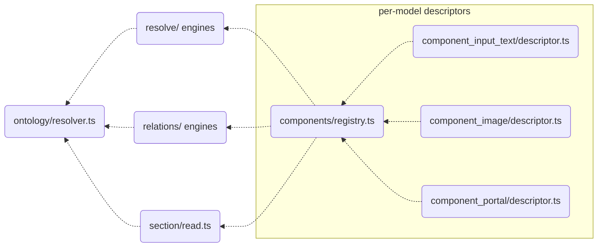
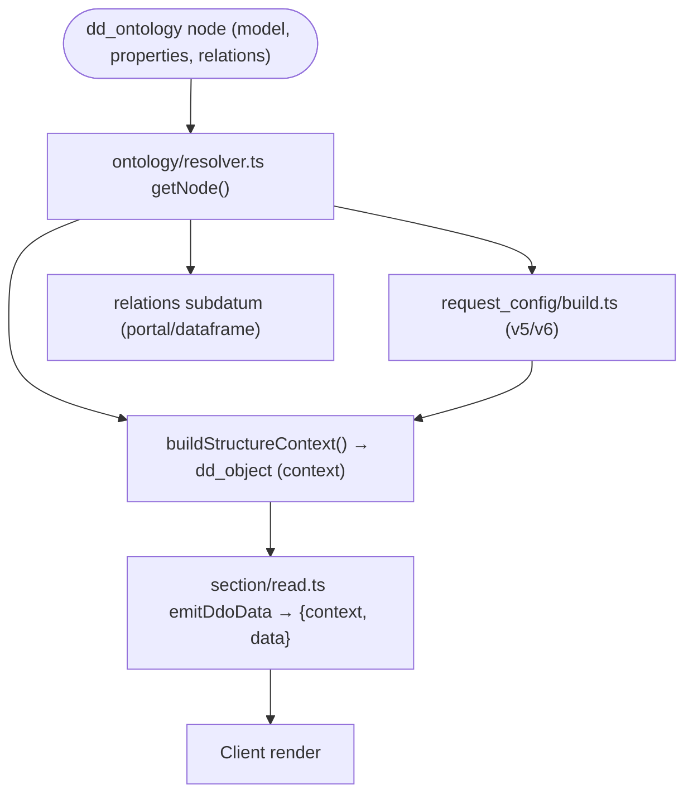

# common

> See also: [Architecture overview](../architecture_overview.md) · [Sections / `section`](../sections/section.md) · [Components](../components/index.md) · [Base classes](../components/base_classes.md) · [request_config](../request_config.md) · [dd_object](../dd_object.md)

In the PHP server, `common` was the abstract base **class** every section,
component, area and ontology object inherited — it owned the shared identity, the
magic `get_*`/`set_*` accessors, structure-context building, the `request_config`
pipeline, permissions, the worker-safe static caches and the JSON-controller
dispatch. The TS rewrite has **no such god class**. The same *concepts* survive,
but the machinery is spread across a **horizontal engine layer** that resolves
per-model descriptors instead of dispatching into a class hierarchy.

This page is the reference for that engine layer: what used to be "the contract
`common` gives every subclass" is now "the set of horizontal engines that resolve
any element". For how a concrete object uses this machinery, read
[`section`](../sections/section.md) and [Components](../components/index.md).

## Role

There is no `abstract class common` and no runtime object hierarchy in the TS
server. PHP built a live object per element (`section`, `component_portal`, …),
each carrying identity state and inheriting behavior from `common`. The TS server
instead keeps identity in plain request/record values and computes everything
about an element by **resolving its ontology node against the horizontal
engines**:



Where PHP had one `common` method for each responsibility, the TS server has a
**module**:

- identity fields (`tipo`, `section_tipo`, `section_id`, `mode`, `lang`, `model`,
  `view`, …) travel on the [RQO](../rqo.md) and the resolved record — no object,
  no accessors;
- the ontology node (`model`, `properties`, `relations`, `term`, flags) is loaded
  and cached by `src/core/ontology/resolver.ts` (`getNode`, `getModelByTipo`,
  `getColumnNameByModel`, `getTermByTipo`, …);
- the **structure-context** (the cached `{context}` half of a datum) is built by
  `src/core/resolve/structure_context.ts`;
- the **request_config** orchestration lives in
  `src/core/relations/request_config/{build,v5,v6,filters,external}.ts` with the
  pure selection rule in `src/core/concepts/request_config.ts`;
- **permissions** live in `src/core/security/permissions.ts`;
- request/data **language** is request-scoped in
  `src/core/resolve/request_lang.ts`;
- per-model particularities live in the **descriptor**
  (`src/core/components/component_X/descriptor.ts`) registered in
  `src/core/components/registry.ts`.

!!! note "The CONCEPTS stay, the CLASS is gone"
    Everything `common` *meant* — one element carries an identity, a model, a
    context, a request_config, a permission — is preserved. What is gone is the
    single 4,300-line base class and the `__call` accessor magic: there is no
    per-element PHP-style object to inherit from. An engine takes a tipo (and mode
    and lang), reads its node, and produces the answer.

!!! note "Where `dato`/`data` live"
    PHP's `common` deliberately declared no `dato`/`data` accessor — the record
    payload belonged to the subclass. The TS layer keeps the same split by
    construction: the structure-context engines produce only **context** (the
    ontology-derived description), while the **data** (values) is produced by the
    section-read/relations engines that resolve the matrix columns. The two halves
    are joined into one `{context, data}` datum at emit time.

## Responsibilities

- **Identity** — the canonical element fields ride on the RQO / resolved record;
  the ontology node supplies `model`, `order_number`, `label` (`term`),
  `translatable` and `properties`, loaded once and cached by
  `ontology/resolver.ts`.
- **Model resolution** — `getModelByTipo()` (via the descriptor `alias`) and
  `getColumnNameByModel()` (via the descriptor `column`) replace PHP's
  `$column_map` and the per-model class name.
- **Structure context** — `buildStructureContext()` builds the cached `context`
  half of the datum (label, model, mode, translatable, properties, css, view,
  tools, buttons, columns_map and, optionally, request_config).
- **request_config pipeline** — the v5 (zero-config auto-derive) and v6 (explicit
  `properties.source.request_config`) builders under
  `relations/request_config/`, selected by `selectRequestConfigVersion()`.
- **Permissions** — `getPermissions()` turns a `Principal` into the integer
  permission (0–3) over any element.
- **Datum emission** — the section-read engine (`section/read.ts` `emitDdoData`)
  resolves each element's model to a descriptor and emits its `{context, data}`;
  there is no per-model `*_json.php` controller.
- **Subdatum resolution** — nested (portal/dataframe) `{context, data}` resolved
  through the relations engines and `concepts/subdatum.ts`.
- **Language** — request-scoped interface/data language via
  `currentApplicationLang()` / `currentDataLang()`.
- **Worker hygiene** — request identity lives only in `AsyncLocalStorage`; the few
  module-level caches hold **request-invariant** content (ontology nodes,
  structure-context cores) and carry no request identity, so the PHP
  `common::clear()` ritual is unnecessary.

## Key concepts

### The context is built here, not the data

The engine layer is the *describe* side of "the server describes, the client
draws". `buildStructureContext()` assembles **context** (the ontology-derived
description: label, model, mode, properties, css, permissions, tools, buttons,
request_config) into a [`dd_object`](../dd_object.md) (`typo: 'ddo'`). The **data**
(values) is produced by the section-read/relations engines that resolve the matrix
columns. The two halves are packed into one `{context, data}` datum at emit time —
the direct analogue of PHP's `build_element_json_output($context, $data)`.

### context_key / dedup

The client matches a context item by the triple **tipo + section_tipo + mode**.
`contextKey(entry)` (in `structure_context.ts`, `${tipo}_${section_tipo}_${mode}`)
is the PHP `common::context_key` — the dedup identity used when merging context
arrays so only one context is emitted per column even across many rows.

### Caches without a `clear()` ritual

PHP kept ~10 class-static caches on `common` that MUST be purged between requests,
because a persistent RoadRunner worker would otherwise bleed one request's state
into the next; `common::clear()` existed solely to defuse that hazard. The TS
server is one long-lived process with **request-scoped context threaded through
`AsyncLocalStorage`** — request identity is never stored at module level, so the
bleed hazard is *structurally* gone.

The engines still memoize, but only **request-invariant** content that carries no
request identity:

| cache | where | what it holds | invalidation |
| --- | --- | --- | --- |
| ontology node cache | `ontology/resolver.ts` | resolved `dd_ontology` nodes (model, properties, relations, term) | `clearOntologyCaches()` / the ontology write invalidation hub |
| structure-context cores | `resolve/structure_context.ts` (`coreCache`, keyed `tipo_sectionTipo_mode`) | the request-invariant CORE of a context (per-call stamps applied on a clone) | `clearStructureContextCache()` |
| permissions/projects | `security/permissions.ts` | per-user permission and project tables | `clearPermissionsCache(userId?)` / `clearUserProjectsCache(userId?)` |

!!! note "Core/stamp split preserved"
    The structure-context cache stores only the invariant CORE (label, model,
    css, sortable, …); the per-call STAMP (permissions, parent, lang, view) is
    applied on a **clone** per call and the cached entry is never handed out by
    reference — byte-identical to PHP's `build_structure_context_core` /
    `build_structure_context` split.

## Instantiation & lifecycle

There is no factory to instantiate. Where PHP wrote `section::get_instance('rsc197',
'edit')` and then called inherited `common` methods, the TS server calls the engine
functions directly with the tipo/mode/lang and lets them resolve the node:

```ts
import { getNode, getModelByTipo } from '../ontology/resolver.ts';
import { buildStructureContext } from '../resolve/structure_context.ts';
import { getPermissions } from '../security/permissions.ts';

const node  = await getNode('rsc197');          // ontology node (model, properties, …)
const model = await getModelByTipo('rsc197');    // e.g. 'section'
const perms = await getPermissions(principal, 'rsc197', 'rsc197'); // 0..3
const ctx   = await buildStructureContext({      // the dd_object (context)
    tipo: 'rsc197', sectionTipo: 'rsc197', mode: 'edit',
    lang: currentDataLang(), permissions: perms,
});
```

`getNode()` is the analogue of PHP's `load_structure_data()`: it loads and caches
the node once. Non-translatable elements resolve their lang to `lg-nolan` in the
data engines (PHP `DEDALO_DATA_NOLAN`), driven by the descriptor
`classSupportsTranslation` flag rather than an instance method.

## Public API

Grouped by concern, mapping each PHP `common` responsibility to the TS engine
symbol that now owns it. Every symbol below is verified against `src/`.

### Identity & model resolution

| PHP `common` | TS engine symbol | purpose |
| --- | --- | --- |
| `get_tipo()`/`get_mode()`/`__call` accessors | (plain values on the RQO / resolved record) | no magic accessors — identity is data, read directly. |
| `get_model()` | `getModelByTipo(tipo)` (`ontology/resolver.ts`) | resolve an element's model from its node, applying the descriptor `alias`. |
| `is_translatable()` | `getTranslatableByTipo(tipo)` / descriptor `classSupportsTranslation` | whether the element stores per-language values. |
| `get_matrix_table_from_tipo()` | `getMatrixTableFromTipo(tipo)` | tipo → matrix table name (cached). |
| the `$column_map` model→column | `getColumnNameByModel(model)` / descriptor `column` | which JSONB column a model stores in. |

### Ontology & properties

| PHP `common` | TS engine symbol | purpose |
| --- | --- | --- |
| `load_structure_data()` | `getNode(tipo)` (`ontology/resolver.ts`) | one-time node load (model, order_number, term, relations, properties), cached. |
| `get_properties()` | `getNode(tipo)?.properties` | the parsed ontology `properties` object. |
| `get_term`/label | `getTermByTipo(tipo, lang)` / `labelByTipo(tipo)` (`ontology/labels.ts`) | the element's localized label. |
| `get_ar_related_by_model()` | the relations resolvers (`relations/`) + `getComponentFilterTipo()` | related tipos of a node filtered by target model. |

### Structure context (the datum's context half)

| PHP `common` | TS engine symbol | purpose |
| --- | --- | --- |
| `get_structure_context()` / `build_structure_context()` | `buildStructureContext(options)` (`resolve/structure_context.ts`) | build the element context as a `dd_object` (tools/buttons/view/columns_map + optional request_config). |
| `build_structure_context_core()` | the `coreCache` core build inside `buildStructureContext` | build + cache the request-invariant core; stamp per-call fields on a clone. |
| `context_key()` | `contextKey(entry)` | the client identity key `tipo_section_tipo_mode` for dedup. |
| `build_element_json_output()` | the `{context, data}` packing at emit time (`section/read.ts`) | pack context + data into one response object. |
| `get_subdatum()` | the relations subdatum path + `concepts/subdatum.ts` (`dataframeEntryMatches`, `isDataframeEntry`) | resolve nested (portal/dataframe) context+data and its id_key pairing. |
| `resolveDefaultView()` (was `resolve_view()`) | `resolveDefaultView(model, legacyModel)` | model-based view fallback. |

### request_config pipeline

The three-trait PHP orchestrator (`request_config_utils/ddo/v6/v5`) is replaced by
a small module set. The **concept is preserved**: v5 = zero-config auto-derive, v6
= explicit config.

| PHP `common` | TS engine symbol | purpose |
| --- | --- | --- |
| `get_ar_request_config()` / `build_request_config()` | the `relations/request_config/build.ts` entry (`resolveRequestConfig`-style build) | resolve an element's request_config with the PHP source-property rules (list/tm section_list substitution, else data-driven v5/v6). |
| the v5/v6 selection (`class.common.php:3502`) | `selectRequestConfigVersion()` (`concepts/request_config.ts`) | v6 iff `properties.source.request_config` exists, else the v5 fallback. |
| the v5 graph walk | `buildV5ComponentListConfig()` / `buildV5SectionEditConfig()` (`request_config/v5.ts`) | deterministic base build from the relation nodes / edit-form tree. |
| the v6 parser | `buildRequestConfigV6()` (`request_config/v6.ts`) | parse the explicit `properties.source.request_config`. |
| filters / external | `request_config/filters.ts`, `request_config/external.ts` | `filter_by_list`/`fixed_filter` expansion and the external (Zenon) api_config. |

See [request_config](../request_config.md) and
[RELATIONS_SPEC.md](../../../engineering/RELATIONS_SPEC.md) for the full contract.

### Permissions

| PHP `common` | TS engine symbol | purpose |
| --- | --- | --- |
| `get_permissions($parent, $tipo)` | `getPermissions(principal, parentTipo, tipo)` (`security/permissions.ts`) | resolve the integer permission (0 none / 1 read / 2 read+write / 3 admin). Superuser → 3; Time Machine clamped to admin-read; returns 0 for anonymous or missing tipos. |
| the user profile | `resolvePrincipal(userId)` → `Principal` | resolve the acting user's admin/developer flags and projects once per request. |

### Datum emission (was JSON controller dispatch)

| PHP `common` | TS engine symbol | purpose |
| --- | --- | --- |
| `get_json()` including `<model>_json.php` | `emitDdoData(...)` (`section/read.ts`) resolving `getComponentModel(model)` (`components/registry.ts`) | emit an element's `{context, data}` by resolving its model to a descriptor — no per-model controller file, no autoloader. |
| the per-model controller | `component_X/descriptor.ts` (`column`, `classSupportsTranslation`, `resolveData`, `search`, …) | the per-model particularities the horizontal engines read. |

### Language

| PHP `common` | TS engine symbol | purpose |
| --- | --- | --- |
| `set_lang()` / `DEDALO_DATA_LANG` static | `currentApplicationLang()` / `currentDataLang()` (`resolve/request_lang.ts`) | the interface/data language, **request-scoped** via `AsyncLocalStorage` (seeded per RQO), not a static constant. |
| `get_ar_all_langs()` | `config.menu.projectsDefaultLangs` (`config/config.ts`) | the project language set. |

!!! info "Request-scoped langs"
    Interface and data language are per-request, seeded from the session by the
    change-lang path and read through `currentApplicationLang()` /
    `currentDataLang()`. New resolvers must use these accessors, never a static
    config value — see the project memory note on request-scoped langs.

## How it fits with the rest of Dédalo

The engine layer is the seam between the ontology and every emitted datum:

- **`section`** ([reference](../sections/section.md)) is resolved by
  `section/read.ts` (list/edit reads, subdatum, context, children) — the record
  lifecycle, children resolvers and search that PHP hung off the `section` subclass
  now live in the section and search engines, not on a shared base.
- **Components** ([components](../components/index.md),
  [base classes](../components/base_classes.md)) are per-model **descriptors**
  resolved by the horizontal engines; the data accessors PHP put on
  `component_common` are the read/save engines (`resolve/component_data.ts`,
  `section_record/record_write.ts`).
- **Areas** and the **ontology** are resolved by the same engines
  (`src/core/area/`, `ontology/resolver.ts`) — the shared identity/context/
  permission surface is a function call, not an inheritance.
- **Structure-context** and **request_config** feed the
  [dd_object](../dd_object.md) and the [request_config](../request_config.md)
  pipeline that ultimately produces the JSON API response the client renders.
- **Permissions** are enforced by `security/permissions.ts` at the API dispatch
  gates; **tools/buttons** context is resolved by the tools/area engines.



## Examples

### Resolve identity, model and properties through the engines

```ts
import { getNode, getModelByTipo, getTranslatableByTipo } from '../ontology/resolver.ts';

const node   = await getNode('rsc91');           // ontology node | null
const model  = await getModelByTipo('rsc91');    // 'component_portal'
const transl = await getTranslatableByTipo('rsc91'); // false for a portal
const props  = node?.properties ?? null;         // ontology properties | null
```

### Build the context for an element

```ts
import { buildStructureContext } from '../resolve/structure_context.ts';

const ctx = await buildStructureContext({
    tipo: 'rsc91', sectionTipo: 'rsc197', mode: 'edit', lang: currentDataLang(),
    permissions, addRequestConfig: true, // reflects the request_config build
});
```

### Resolve a permission

```ts
import { resolvePrincipal, getPermissions } from '../security/permissions.ts';

const principal = await resolvePrincipal(userId);
const perm = await getPermissions(principal, 'rsc197', 'rsc197'); // 0..3
```

### Worker hygiene — nothing to clear per request

```ts
// No common::clear() equivalent. Request identity lives in AsyncLocalStorage and
// dies with the request. The module-level caches below hold request-INVARIANT
// content and are cleared only on the event that invalidates them:
clearOntologyCaches();          // after an ontology write
clearStructureContextCache();   // if context cores must be rebuilt
clearPermissionsCache(userId);  // after a user's permissions change
```

## Related

- [Architecture overview](../architecture_overview.md) — where the engine layer
  sits in the server build vs client render flow.
- [`section`](../sections/section.md) — the section reads (record lifecycle,
  children, search) the section engine resolves.
- [Components](../components/index.md) · [Base classes](../components/base_classes.md)
  — the per-model descriptors the horizontal engines read.
- [request_config](../request_config.md) — the full contract behind the v5/v6
  builders (immutable cache clone boundary, presets, config warnings).
- [dd_object (ddo)](../dd_object.md) — the object `buildStructureContext()` returns.
- [Locator](../locator.md) — the pointer type resolved by the relation engines.
