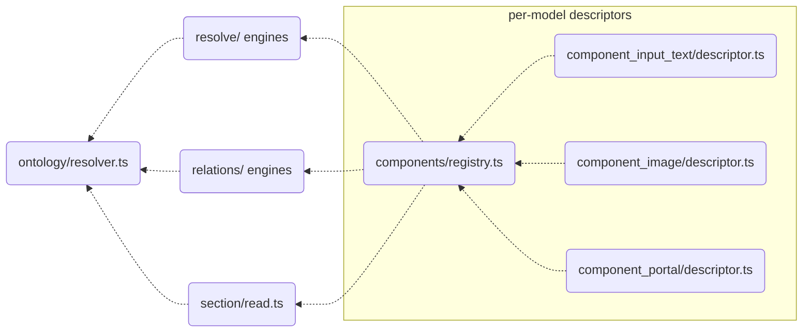

# The engine layer

> See also: [Architecture overview](../architecture_overview.md) ·
> [Sections / `section`](../sections/section.md) ·
> [Components](../components/index.md) ·
> [Base classes](../components/base_classes.md) ·
> [request_config](../request_config.md) · [dd_object](../dd_object.md)

Dédalo has **no base class and no per-element object hierarchy**. Everything the
server knows about an element — its identity, its model, its context, its
`request_config`, its permissions, its language — is computed by resolving the
element's **ontology node** against a set of horizontal engines, and by reading
the **descriptor** of its model.

This page is the reference for that engine layer. For how a concrete element uses
it, read [`section`](../sections/section.md) and
[Components](../components/index.md).

## Role

Identity is **data**, not object state: `tipo`, `section_tipo`, `section_id`,
`mode`, `lang`, `model` and `view` travel on the [RQO](../rqo.md) and on the
resolved record. There is nothing to instantiate. Each responsibility is owned by
one module:



- The **ontology node** (`model`, `properties`, `relations`, `term`, flags) is
  loaded and cached by `src/core/ontology/resolver.ts` (`getNode`,
  `getModelByTipo`, `getColumnNameByModel`, `getTermByTipo`, …).
- The **structure context** — the cached `{context}` half of a datum — is built by
  `src/core/resolve/structure_context.ts`.
- The **request_config** orchestration lives in
  `src/core/relations/request_config/{build,v5,v6,filters,external}.ts`, with the
  pure selection rule in `src/core/concepts/request_config.ts`.
- **Permissions** live in `src/core/security/permissions.ts`.
- Request and data **language** are request-scoped in
  `src/core/resolve/request_lang.ts`.
- **Per-model particularities** live in the descriptor
  (`src/core/components/component_X/descriptor.ts`), registered in
  `src/core/components/registry.ts`.

An engine takes a tipo (plus mode and lang), reads its node, and produces the
answer. Adding a model means adding a descriptor — never subclassing an engine.

!!! note "Where data lives"
    The structure-context engines produce only **context** — the ontology-derived
    description. The **data** (the values) is produced by the section-read and
    relations engines that resolve the matrix columns. The two halves are joined
    into one `{context, data}` datum at emit time. Keeping them apart is what lets
    the context be cached and the data not.

## Responsibilities

- **Identity** — the canonical element fields ride on the RQO and the resolved
  record; the ontology node supplies `model`, `order_number`, `label` (`term`),
  `translatable` and `properties`, loaded once and cached.
- **Model resolution** — `getModelByTipo()` (via the descriptor `alias`) and
  `getColumnNameByModel()` (via the descriptor `column`) answer "what is this
  element" and "which JSONB column does it store in".
- **Structure context** — `buildStructureContext()` builds the cached `context`
  half of the datum: label, model, mode, translatable, properties, css, view,
  tools, buttons, columns_map and, optionally, `request_config`.
- **request_config pipeline** — the v5 (zero-config auto-derive) and v6 (explicit
  `properties.source.request_config`) builders, selected by
  `selectRequestConfigVersion()`.
- **Permissions** — `getPermissions()` turns a `Principal` into an integer
  permission (0–3) over any element.
- **Datum emission** — `emitDdoData()` (`src/core/section/read.ts`) resolves each
  element's model to a descriptor and emits its `{context, data}`.
- **Subdatum resolution** — nested (portal / dataframe) `{context, data}` resolved
  through the relations engines and `src/core/concepts/subdatum.ts`.
- **Language** — request-scoped interface and data language via
  `currentApplicationLang()` / `currentDataLang()`.
- **Request isolation** — request identity lives *only* in `AsyncLocalStorage`.
  Module-level caches hold **request-invariant** content and carry no request
  identity.

## Key concepts

### The context is built here, not the data

The engine layer is the *describe* side of "the server describes, the client
draws". `buildStructureContext()` assembles the ontology-derived description —
label, model, mode, properties, css, permissions, tools, buttons, request_config
— into a [`dd_object`](../dd_object.md) (`typo: 'ddo'`). The values come from the
section-read and relations engines. The two are packed into one `{context, data}`
datum at emit time.

### context_key / dedup

The client matches a context item by the triple **tipo + section_tipo + mode**.
`contextKey(entry)` (`structure_context.ts`) produces
`${tipo}_${section_tipo}_${mode}` — the dedup identity used when merging context
arrays, so only one context is emitted per column even across many rows.

### Caches, and why there is no per-request reset

One long-lived process serves concurrent requests. Request-scoped context is
threaded through `AsyncLocalStorage` and dies with the request; it is never
stored at module level. That is what makes cross-request bleed structurally
impossible — not a reset ritual that someone must remember to call.

The engines still memoize, but only **request-invariant** content:

| cache | where | what it holds | invalidation |
| --- | --- | --- | --- |
| ontology node cache | `ontology/resolver.ts` | resolved `dd_ontology` nodes (model, properties, relations, term) | `clearOntologyCaches()` / the ontology write invalidation hub |
| structure-context cores | `resolve/structure_context.ts` (`coreCache`, keyed `tipo_sectionTipo_mode`) | the request-invariant CORE of a context | `clearStructureContextCache()` |
| permissions / projects | `security/permissions.ts` | per-user permission and project tables | `clearPermissionsCache(userId?)` / `clearUserProjectsCache(userId?)` |

!!! warning "The core/stamp split is load-bearing"
    The structure-context cache stores only the invariant **core** (label, model,
    css, sortable, …). The per-call **stamp** (permissions, parent, lang, view) is
    applied to a **clone**, and the cached entry is never handed out by reference.
    Mutate a cached core and you have just served one user's permissions to
    another.

## There is no factory

Call the engine functions directly with the tipo, mode and lang, and let them
resolve the node:

```ts
import { getNode, getModelByTipo } from '../ontology/resolver.ts';
import { buildStructureContext } from '../resolve/structure_context.ts';
import { getPermissions } from '../security/permissions.ts';

const node  = await getNode('rsc197');           // ontology node (model, properties, …)
const model = await getModelByTipo('rsc197');    // e.g. 'section'
const perms = await getPermissions(principal, 'rsc197', 'rsc197'); // 0..3
const ctx   = await buildStructureContext({      // the dd_object (context)
    tipo: 'rsc197', sectionTipo: 'rsc197', mode: 'edit',
    lang: currentDataLang(), permissions: perms,
});
```

`getNode()` loads and caches the node once. A non-translatable element resolves
its lang to `lg-nolan` in the data engines, driven by the descriptor's
`classSupportsTranslation` flag.

## The engine surface

Grouped by concern. Every symbol below lives in `src/core/`.

### Identity & model resolution

| symbol | purpose |
| --- | --- |
| *(plain values on the RQO / resolved record)* | Identity — no accessors, no magic. Read it directly. |
| `getModelByTipo(tipo)` (`ontology/resolver.ts`) | Resolve an element's model from its node, applying the descriptor `alias`. |
| `getTranslatableByTipo(tipo)` / descriptor `classSupportsTranslation` | Whether the element stores per-language values. |
| `getMatrixTableFromTipo(tipo)` | tipo → matrix table name (cached). |
| `getColumnNameByModel(model)` / descriptor `column` | Which JSONB column a model stores in. |

### Ontology & properties

| symbol | purpose |
| --- | --- |
| `getNode(tipo)` (`ontology/resolver.ts`) | One-time node load (model, order_number, term, relations, properties), cached. |
| `getNode(tipo)?.properties` | The parsed ontology `properties` object. |
| `getTermByTipo(tipo, lang)` / `labelByTipo(tipo)` (`ontology/labels.ts`) | The element's localized label. |
| the relations resolvers (`relations/`) + `getComponentFilterTipo()` | Related tipos of a node, filtered by target model. |

### Structure context

| symbol | purpose |
| --- | --- |
| `buildStructureContext(options)` (`resolve/structure_context.ts`) | Build the element context as a `dd_object` (tools, buttons, view, columns_map, optional request_config). |
| the `coreCache` core build inside `buildStructureContext` | Build and cache the request-invariant core; stamp per-call fields on a clone. |
| `contextKey(entry)` | The client identity key `tipo_section_tipo_mode`, used for dedup. |
| the `{context, data}` packing in `section/read.ts` | Pack context and data into one response object. |
| the relations subdatum path + `concepts/subdatum.ts` (`dataframeEntryMatches`, `isDataframeEntry`) | Resolve nested (portal / dataframe) context+data and its `id_key` pairing. |
| `resolveDefaultView(model, legacyModel)` | Model-based view fallback. |

### request_config pipeline

Two versions, one selection rule: **v5** is the zero-config auto-derive, **v6** is
the explicit config.

| symbol | purpose |
| --- | --- |
| `relations/request_config/build.ts` | Resolve an element's request_config (list/tm `section_list` substitution, else the data-driven v5/v6 build). |
| `selectRequestConfigVersion()` (`concepts/request_config.ts`) | v6 iff `properties.source.request_config` exists, else v5. |
| `buildV5ComponentListConfig()` / `buildV5SectionEditConfig()` (`request_config/v5.ts`) | Deterministic base build from the relation nodes / edit-form tree. |
| `buildRequestConfigV6()` (`request_config/v6.ts`) | Parse the explicit `properties.source.request_config`. |
| `request_config/filters.ts`, `request_config/external.ts` | `filter_by_list` / `fixed_filter` expansion, and the external api_config. |

See [request_config](../request_config.md) for the full contract.

### Permissions

| symbol | purpose |
| --- | --- |
| `getPermissions(principal, parentTipo, tipo)` (`security/permissions.ts`) | Resolve the integer permission (0 none / 1 read / 2 read+write / 3 admin). Superuser → 3; Time Machine clamped to admin-read; 0 for anonymous or missing tipos. |
| `resolvePrincipal(userId)` → `Principal` | Resolve the acting user's admin/developer flags and projects once per request. |

### Datum emission

| symbol | purpose |
| --- | --- |
| `emitDdoData(...)` (`section/read.ts`) resolving `getComponentModel(model)` (`components/registry.ts`) | Emit an element's `{context, data}` by resolving its model to a descriptor. |
| `component_X/descriptor.ts` (`column`, `classSupportsTranslation`, `resolveData`, `search`, …) | The per-model particularities the horizontal engines read. |

### Language

| symbol | purpose |
| --- | --- |
| `currentApplicationLang()` / `currentDataLang()` (`resolve/request_lang.ts`) | The interface and data language, **request-scoped** via `AsyncLocalStorage`, seeded per RQO. |
| `config.menu.projectsDefaultLangs` (`config/config.ts`) | The project language set. |

!!! warning "Never read a language from a module-level value"
    Interface and data language are per-request. A new resolver must go through
    `currentApplicationLang()` / `currentDataLang()`. Capture a language at module
    level and you will serve one user's language to another.

## How it fits with the rest of Dédalo

The engine layer is the seam between the ontology and every emitted datum:

- **`section`** ([reference](../sections/section.md)) is resolved by
  `section/read.ts` — list and edit reads, subdatum, context, children.
- **Components** ([components](../components/index.md),
  [base classes](../components/base_classes.md)) are per-model **descriptors**
  resolved by the horizontal engines; component values are read and written by
  `resolve/component_data.ts` and `section_record/record_write.ts`.
- **Areas** and the **ontology** are resolved by the same engines
  (`src/core/area/`, `ontology/resolver.ts`) — the shared
  identity/context/permission surface is a function call.
- **Structure context** and **request_config** feed the
  [dd_object](../dd_object.md) and the [request_config](../request_config.md)
  pipeline that produces the JSON the client renders.
- **Permissions** are enforced at the API dispatch gates.


## Examples

### Resolve identity, model and properties

```ts
import { getNode, getModelByTipo, getTranslatableByTipo } from '../ontology/resolver.ts';

const node   = await getNode('rsc91');               // ontology node | null
const model  = await getModelByTipo('rsc91');        // 'component_portal'
const transl = await getTranslatableByTipo('rsc91'); // false for a portal
const props  = node?.properties ?? null;             // ontology properties | null
```

### Build the context for an element

```ts
import { buildStructureContext } from '../resolve/structure_context.ts';

const ctx = await buildStructureContext({
    tipo: 'rsc91', sectionTipo: 'rsc197', mode: 'edit', lang: currentDataLang(),
    permissions, addRequestConfig: true,
});
```

### Resolve a permission

```ts
import { resolvePrincipal, getPermissions } from '../security/permissions.ts';

const principal = await resolvePrincipal(userId);
const perm = await getPermissions(principal, 'rsc197', 'rsc197'); // 0..3
```

### Cache invalidation

```ts
// Request identity lives in AsyncLocalStorage and dies with the request — there
// is nothing to reset per request. The module-level caches below hold
// request-INVARIANT content and are cleared only on the event that invalidates them:
clearOntologyCaches();          // after an ontology write
clearStructureContextCache();   // if context cores must be rebuilt
clearPermissionsCache(userId);  // after a user's permissions change
```

## Related

- [Architecture overview](../architecture_overview.md) — where the engine layer
  sits in the server-build vs client-render flow.
- [`section`](../sections/section.md) — the section reads the section engine
  resolves.
- [Components](../components/index.md) · [Base classes](../components/base_classes.md)
  — the per-model descriptors the horizontal engines read.
- [request_config](../request_config.md) — the full contract behind the v5/v6
  builders.
- [dd_object (ddo)](../dd_object.md) — the object `buildStructureContext()`
  returns.
- [Locator](../locator.md) — the pointer type the relation engines resolve.
