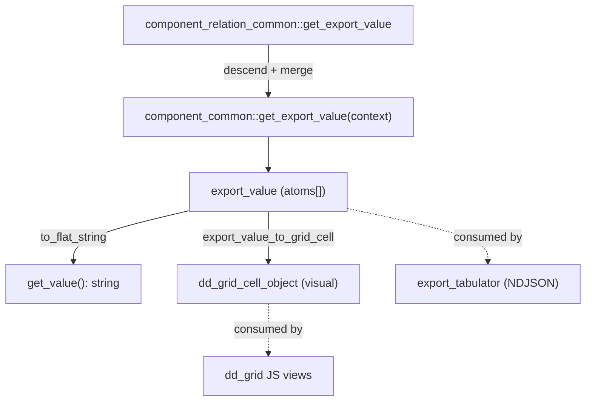

# dd_grid

> See also: [Exporting data](../exporting_data.md) · [Components](../components/index.md) · [Sections](../sections/index.md) · [Locator](../locator.md)

The server-side subsystem that resolves a record's component data into **flat,
tabular shapes** — both the legacy visual grid cell (`dd_grid_cell_object`) and
the modern, per-component **export atoms** contract (`export_*`) — plus the
matching client renderers under `core/dd_grid/js/`.

## Role

`dd_grid` is **not a single class**. It is a small core subsystem living in
`core/dd_grid/` whose job is to turn the abstract, nested `{context, data}` model
of a section's components (see [Architecture overview](../architecture_overview.md))
into **rows-and-columns of resolved values** that downstream consumers can render
or stream.

It sits between the component layer (which owns each value) and three consumers:

| consumer | what it asks dd_grid for |
| --- | --- |
| **tool_export** | per-component **export atoms** (`get_export_value()` → `export_value`), laid onto a flat NDJSON table by `tools/tool_export/class.export_tabulator.php`. See [Exporting data](../exporting_data.md). |
| **thesaurus indexation grid** | a built grid of `dd_grid_cell_object` rows/columns for a term's backlinks (`indexation_grid::build_indexation_grid()`). |
| **client grid widgets** | the same `dd_grid_cell_object` cells, rendered as tables/lists by the `dd_grid` JS model (time-machine matrix, descriptors widget, thesaurus indexation view). |

The classes are **loader-registered, not autoloaded** — they are `include`d
explicitly in `core/base/class.loader.php` (lines 74–80), *before*
`component_common`, because `component_common` and several component overrides
type-hint them.

!!! note "Two generations, one subsystem"
    `dd_grid` currently holds **two co-existing models**:

    - the older **`dd_grid_cell_object`** — a polymorphic visual cell object
      (the *client* table/grid rendering format), still used by the indexation
      grid, the time-machine matrix and the descriptors widget;
    - the newer **`export_*` atoms contract** — a flat, per-component data
      resolution contract that is now the single data-resolution authority.

    The atoms contract is the source of truth for *values*; `dd_grid_cell_object`
    is increasingly just the *visual* envelope produced from atoms by
    `component_common::export_value_to_grid_cell()`. The legacy
    `dd_grid_cell_object::resolve_value()` joiner has **zero production callers**
    and survives only as the parity reference for the remaining structural
    `get_grid_value()` overrides (see [resolve_value is legacy](#resolve_value-is-legacy-reference-only)).

## Responsibilities

- **Define the export atoms contract** — the four value-object classes
  (`export_atom`, `export_path_segment`, `export_value`, `export_context`) that
  every component's `get_export_value()` produces and consumes.
- **Own the flat-join reference semantics** — `export_value::to_flat_string()` is
  the canonical joiner that the `value` export format and `component_common::get_value()`
  both rely on (parity-tested per model).
- **Define the visual grid cell** — `dd_grid_cell_object` is the object the client
  table/list renderers consume (heads, captions, rows, separators, cell types,
  buttons/links).
- **Build the thesaurus indexation grid** — `indexation_grid` resolves a term's
  backlinks (locators), groups them by section, applies the per-project
  permission filter, and emits the grid of `dd_grid_cell_object` rows.
- **Render the grids on the client** — the `dd_grid` JS model and its view files
  turn `dd_grid_cell_object` arrays into DOM tables/lists.

`dd_grid` does **not** issue SQL itself and does **not** know about specific
component shapes: components produce atoms, the tabulator (in `tool_export`) and
the JS views consume them with zero per-model knowledge.

## Files & structure

```text
core/dd_grid/
├── class.dd_grid_cell_object.php   # visual grid cell (client render format) + legacy resolve_value()
├── class.indexation_grid.php       # thesaurus term backlink grid builder
├── class.export_atom.php           # one scalar leaf value + its structured path
├── class.export_path_segment.php   # one hop in an atom's path (section_tipo, component_tipo, item_index, ...)
├── class.export_value.php          # list of atoms + to_flat_string() reference joiner
├── class.export_context.php        # per-call context passed down get_export_value()
├── css/
│   ├── dd_grid.less
│   ├── view_indexation.less
│   └── view_indexation_audiovisual.less
└── js/
    ├── dd_grid.js                  # client model (extends common); init/build/render
    ├── render_list_dd_grid.js      # view dispatcher (table | mini | indexation | descriptors | default)
    ├── view_default_dd_grid.js
    ├── view_table_dd_grid.js       # time-machine / generic matrix table
    ├── view_mini_dd_grid.js
    ├── view_indexation_dd_grid.js  # thesaurus indexation grid view
    └── view_descriptors_dd_grid.js # oral-history descriptors widget view
```

!!! warning "Loader order, not autoload"
    These classes are not autoloaded. They are `include`d in
    `core/base/class.loader.php` ahead of `component_common`. The `export_*`
    classes must load before any component class, since `component_common`
    type-hints `export_value` / `export_context`.

## Key concepts: the atoms contract

A component's `get_export_value(?export_context $context) : export_value` returns a
**flat list of `export_atom`** — never a nested or polymorphic value. Everything a
consumer needs (column identity, breakdown explosion, joining, labels) is derivable
from each atom's structured `path`.

### export_atom

One scalar leaf value plus the structured path that says exactly where it came from.

| property | type | meaning |
| --- | --- | --- |
| `path` | `export_path_segment[]` | ordered, root-first; the last segment is the leaf component that produced the value |
| `value` | `string\|int\|float\|null` | **scalar only** — components `json_encode` arrays/objects themselves |
| `cell_type` | `string` | rendering type: `text` \| `img` \| `av` \| `iri` \| `section_id` \| `json` |
| `value_index` | `?int` | index of the data item inside a multi-value leaf |
| `lang` | `?string` | value lang (null = nolan) |
| `is_fallback` | `bool` | true when taken from a fallback lang because the main lang was empty |

Helper methods: `get_base_key()` (column identity = path identities without the
`item_index` dimension, joined with `.`), `get_index_vector()` (the ordered
`item_index` values across the path), `get_leaf_segment()`.

### export_path_segment

One hop in the path. Column identity is derived from segments **without**
`item_index`: `(section_tipo, component_tipo[, #sub_id])`. This replaces the legacy
string-encoded column ids like `"oh1_oh62_rsc197_rsc92|1"`.

| property | type | meaning |
| --- | --- | --- |
| `section_tipo` / `component_tipo` | `string` | the component at this hop |
| `model` | `?string` | component model (e.g. `component_portal`) |
| `item_index` | `?int` | 0-based locator position in the **parent** relation that led here (null at root) |
| `section_id` | `?int` | resolved target record of the traversed locator |
| `sub_id` | `?string` | non-ontology discriminator for components emitting non-component columns (info widget id, inverse from-component pair); when set, label resolution uses it verbatim |
| `fields_separator` / `records_separator` | `?string` | join glue at this depth (defaults `, ` / ` \| `) |

`get_identity_key()` → `"{section_tipo}_{component_tipo}"` (with `#sub_id`
appended when set).

### export_value

The wrapper a component returns: `atoms[]` plus the producing component's `label`
and `model`. Key methods:

- `to_flat_string()` — the **reference joiner** for the `value` export format and
  `component_common::get_value()`. It replicates the legacy
  `dd_grid_cell_object::resolve_value()` semantics: relation items joined with the
  records separator (` | `), sibling fields joined with the fields separator
  (`, `), leaf multi-values joined with the leaf separator, `empty()` field/leaf
  values **skipped** (bug-for-bug parity, including the `empty('0')` drop).
- `join(array $atoms)` — static; used by the tabulator to join the atoms that
  land in one output cell.
- `merge(export_value $other)` — append a child's atoms (relation recursion).
- `from_scalar(...)` — factory for single-value leaf components.

### export_context

The per-call context handed to `get_export_value()`. It replaces the *legacy
instance mutations* of the export path (request_config injection, `column_obj`
injection, `$component->caller==='tool_export'` switches) so component instances
need not be specialized per column.

| property | meaning |
| --- | --- |
| `path_prefix` | segments accumulated so far (root first) |
| `ddo` | the component's own ddo (separator/class overrides) |
| `ddo_map` | flattened descendant ddo_map a relation uses to resolve its children |
| `absolute_urls` | true when media URLs must be absolute (the tool_export case) |
| `value_with_parents` | true when relation components also emit each locator target's ancestor chain as a `parents` sub-column |
| `item_index` / `item_section_id` | the traversed locator position/target the calling relation descended through |
| `depth` | recursion sanity guard |

`descend(path_prefix, sub_ddo_map, ddo, item_index, item_section_id)` builds the
child context for resolving one relation child: it carries the locator position
forward so the child can stamp `item_index` onto its own segment.

## Data model: dd_grid_cell_object

`dd_grid_cell_object` is the **visual** cell the client renders. Unlike the flat
atoms, it is a polymorphic, nestable object (a column can hold rows, which hold
columns). Its load-bearing fields:

| property | meaning |
| --- | --- |
| `type` | `'row'` or `'column'` |
| `label` / `render_label` | column header text and whether to draw it |
| `cell_type` | `av` \| `img` \| `iri` \| `button` \| `json` \| `section_id` \| `text` |
| `value` | array of cell values (strings, or nested `dd_grid_cell_object`s) |
| `fallback_value` | values from another language when the current lang is empty |
| `fields_separator` / `records_separator` | join glue (e.g. `, ` and `<br>`) |
| `ar_columns_obj` | nested column objects (the `column_obj` carrying the `{section_tipo}_{tipo}` id) |
| `row_count` / `column_count` / `column_labels` | portal sub-table geometry |
| `action` | button/link action config for interactive cells |
| `features` | multipurpose bag (e.g. section colour) |
| `model` | producing component model |

It is a plain options object: the constructor accepts `?object $options` and calls
`set_<key>()` for each property. `__get()` returns `null` (and debug-logs) for
undefined properties.

### resolve_value is legacy reference only

`dd_grid_cell_object::resolve_value()` (the recursive rows/columns → string joiner)
has **zero production callers**. Production value resolution now runs on the atoms
contract (`get_value()` → `export_value::to_flat_string()`). `resolve_value()` is
kept only as the legacy-join reference for the parity gates of the remaining
structural `get_grid_value()` overrides. Do not call it from new code.

## How components feed dd_grid

The contract lives in `component_common` (`core/component_common/class.component_common.php`):

| method | static? | purpose |
| --- | --- | --- |
| `get_export_value(?export_context $context) : export_value` | | The atoms contract. Base: one atom per data item (arrays/objects `json_encode`d). Overridden where the shape differs. |
| `get_value() : ?string` | | Flat-string facade: `get_export_value()->to_flat_string()`. |
| `get_grid_value(?object $ddo) : dd_grid_cell_object` | | Visual cell. Base resolves atoms via `get_export_value()` then adapts them with `export_value_to_grid_cell()`. |
| `export_value_to_grid_cell(export_value, ?object $ddo) : dd_grid_cell_object` | | **`final`** generic atoms→cell adapter (`value`/`fallback_value` always arrays; `ar_columns_obj` always set). |
| `get_raw_export_value(?export_context $context) : export_value` | | **`final`** — the `dedalo_raw` export wire shape; one atom per component, value = `{"dedalo_data": <dato>}` JSON (or plain int for `component_section_id`). **Never override.** |
| `get_raw_value() : dd_grid_cell_object` | | Legacy grid twin of the above; shares `build_raw_export_data()` so the wire shape cannot drift. |
| `build_export_path_segment(export_context) : export_path_segment` | | Builds the component's own path segment (separators precedence: ddo > properties > defaults). |

**Relation components recurse.** `component_relation_common::get_export_value()`
walks every data locator and every direct child ddo in the `ddo_map`,
instantiates the child component, calls `$context->descend(...)` (carrying the
locator's `item_index`), and `merge()`s the child atoms — extending the path. The
`item_index` on the child's segment is what lets the tabulator decide row vs
column explosion **without any per-component knowledge**. Structural visual-only
`get_grid_value()` overrides remain in `component_relation_common`,
`component_info`, `component_inverse` and `component_text_area`
(indexation_list mode).



## The indexation_grid class

`indexation_grid` (`core/dd_grid/class.indexation_grid.php`) builds the thesaurus
term's **backlink grid**: given a term, it resolves which records index it,
grouped by section, and produces an array of `dd_grid_cell_object` rows for the
thesaurus indexation view.

### Instantiation & lifecycle

```php
public function __construct(
    string     $section_tipo,   // section_tipo of the thesaurus term
    int|string $section_id,     // the term's section_id
    string     $tipo,           // the indexation component tipo (e.g. component_relation_index)
    ?array     $value = null    // filter: array of target section_tipos, e.g. ['oh1']
)
```

The constructor seeds a default pagination (`limit` 500, `offset` 0). It is
**not** a `common` subclass and has **no `get_instance()`** — it is plain `new`.
The single production caller is `dd_core_api::get_indexation_grid()` (API action
`get_indexation_grid`), which asserts read permission on the section before
building.

| method | static? | purpose |
| --- | --- | --- |
| `build_indexation_grid(object $sqo) : array` | | Main entry: resolve the term's backlink locators, group by `section_top_tipo` / `section_top_id`, read each section's `indexation_list` ontology config (`head`/`row` ddo_maps), build one `dd_grid_cell_object` row per indexing record, sum row counts. |
| `get_grid_value(array $ar_ddo, object $locator) : object` | | For one locator, instantiate the children components named in the ddo_map (injecting sub-ddo as `request_config->show`) and collect each one's `get_grid_value($ddo)`; returns `{ar_row_count, ar_cells}`. |
| `process_ddo_map(array $ar_ddo_map, string $section_tipo) : array` | | Resolve `"self"` placeholders, labels, mode (`indexation_list`) and model on each ddo_map entry. |
| `get_ar_section_top_tipo() : array` | | Group the term's locators into `[section_top_tipo][section_top_id] => locators[]`, then filter by the logged user's projects (via `component_filter_master::get_user_projects` + `component_filter`), skipping records outside the user's projects. |
| `get_ar_locators() : array` | | Resolve all backlink locators for the term via `search_related::get_referenced_locators()` and parse them with `component_relation_index::parse_data()`. |

!!! note "indexation_list config drives the grid"
    Each section declares an `indexation_list` ontology element (model
    `indexation_list`, a `children` relation of the section). Its `properties`
    carry the `head` and `row` `show->ddo_map`s and per-part `class_list` /
    `render_label`. `build_indexation_grid()` reads them; a missing/misconfigured
    `indexation_list` is logged and the section is skipped. The default reference
    config is `oh6`.

## Client side

The `dd_grid` JS model (`core/dd_grid/js/dd_grid.js`) extends the shared `common`
prototype (`render`/`refresh`/`destroy`) and adds `init`/`build`/`list`. It is
instantiated through the standard client factory
`get_instance({ model: 'dd_grid', ... })`. `render_list_dd_grid.js` dispatches on
`self.view` to one of the view renderers:

| view | renderer | used by |
| --- | --- | --- |
| `table` | `view_table_dd_grid` | time-machine matrix / generic table |
| `mini` | `view_mini_dd_grid` | compact cell |
| `indexation` | `view_indexation_dd_grid` | thesaurus term indexation grid |
| `descriptors` | `view_descriptors_dd_grid` | oral-history descriptors widget |
| `default` | `view_default_dd_grid` | fallback |

Client callers that instantiate the `dd_grid` model include `ts_object.js` (the
thesaurus tree indexation toggle), `service_time_machine.js`, the OH descriptors
widget (`core/widgets/oh/descriptors/`), `inspector` and `section_record`.

!!! note "tool_export does NOT use the dd_grid JS model"
    The export tool renders its own flat table in `tools/tool_export/js/flat_table.js`
    from the NDJSON stream — it does not go through `core/dd_grid/js/`. The export
    pipeline reuses only the **server** `export_*` atoms classes (and the legacy
    `table_export` / `csv` / `tsv` dd_grid views were removed). See
    [Exporting data](../exporting_data.md).

## How it fits with the rest of Dédalo

- [Components](../components/index.md) — each component produces its grid/export
  shape via `get_export_value()` / `get_grid_value()`; the contract is defined on
  `component_common`.
- [Exporting data](../exporting_data.md) — `tool_export` is the primary consumer
  of the `export_*` atoms; `export_tabulator` lays atoms onto a flat NDJSON table.
- [Sections](../sections/index.md) — grids resolve the components of a section
  record; values are read through the section/`section_record`, never the DB.
- [Locator](../locator.md) — relation components traverse locators; the traversed
  position becomes `item_index` on the path segment.
- The **thesaurus tree** (`ts_object`, `area_thesaurus`) is the main consumer of
  `indexation_grid` + the `indexation` client view.

## Examples

### Resolve a component value through the atoms contract

```php
// any component instance (read via its section)
$component   = component_common::get_instance('component_input_text', 'rsc85', 1, 'list', DEDALO_DATA_LANG, 'rsc197');

// flat string (facade over get_export_value()->to_flat_string())
$string = $component->get_value();           // e.g. "Alicia"

// the raw atoms (what tool_export consumes)
$export_value = $component->get_export_value();   // export_value { atoms:[ export_atom{ path, value:"Alicia", cell_type:"text" } ] }
foreach ($export_value->atoms as $atom) {
    $column_key = $atom->get_base_key();     // "rsc197_rsc85"
    $value      = $atom->value;              // "Alicia"
}
```

### Descend through a relation component

```php
// inside component_relation_common::get_export_value()
$child_context = $context->descend(
    $path_prefix,        // parent prefix + parent's own segment
    $sub_ddo_map,        // the child's ddo_map subset
    $child_ddo,          // child separator overrides
    $item_index,         // 0-based locator position traversed
    $item_section_id     // target record id of that locator
);
$export_value->merge( $child_component->get_export_value($child_context) );
```

### Build a thesaurus indexation grid

```php
// API action 'get_indexation_grid' (see dd_core_api::get_indexation_grid)
$indexation_grid = new indexation_grid(
    'rsc167',                 // section_tipo of the term
    227,                      // section_id of the term
    'component_relation_index_tipo', // the indexation component tipo
    ['oh1']                   // filter to backlinks from section oh1
);
$ar_rows = $indexation_grid->build_indexation_grid($sqo); // dd_grid_cell_object[]
```

## Related

- [Exporting data](../exporting_data.md) — the export pipeline and the
  `value` / `grid_value` / `dedalo_raw` formats.
- [Components](../components/index.md) — the field abstraction that produces
  atoms/cells; [base classes](../components/base_classes.md).
- [Sections](../sections/index.md) — where the resolved data lives.
- [Locator](../locator.md) — the relational pointers traversed during recursion.
- [Architecture overview](../architecture_overview.md) — the `{context, data}`
  model these grids flatten.
