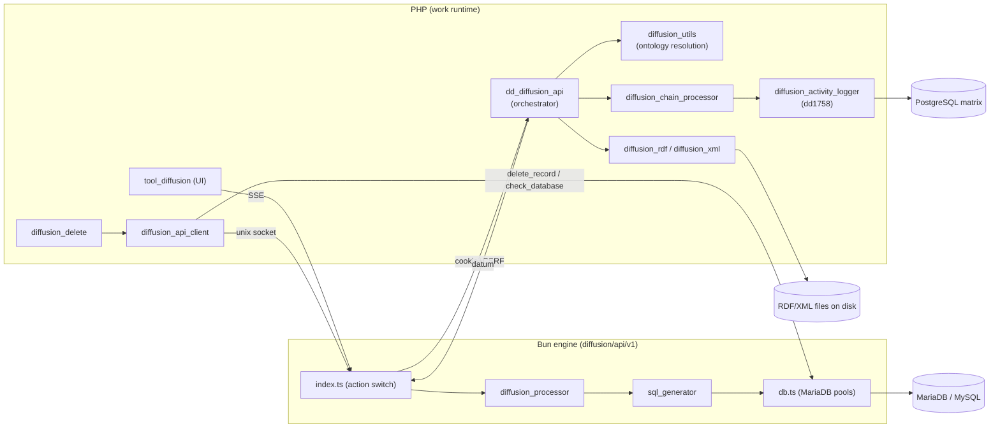

# diffusion

> See also: [Architecture overview](../architecture_overview.md) · [Exporting data](../exporting_data.md) · [Sections](../sections/index.md) · [Locator](../locator.md)

The **publication** subsystem takes the subset of work data marked for publication and emits it to external targets (SQL tables in MariaDB, RDF files, XML files, Socrata), all driven by the diffusion ontology.

This is an **overview** of a large, multi-file, two-runtime subsystem (PHP + a
Bun/TypeScript engine). It maps the pieces and links the source; it is not an
exhaustive per-method reference for every format class. For the conceptual split
between the *work system* and the *diffusion system*, read
[Architecture overview → The two systems](../architecture_overview.md#the-two-systems)
first.

## Role

Diffusion is the **read / publication side** of Dédalo. The work system stores
abstract, ontology-driven records as JSON in the PostgreSQL `matrix` tables (see
[Sections](../sections/index.md)); diffusion re-shapes the records *marked for
publication* into a flat, denormalized dialect that websites and third-party
portals can consume directly:

- **SQL** — one classic table-with-columns per section in a MariaDB/MySQL
  publication database (the default target).
- **RDF** — one deterministic `.rdf` file per record.
- **XML** — one deterministic `.xml` file per record (revived in v7).
- **Socrata** — currently dormant; behaves as SQL.

Unlike the export tool ([Exporting data](../exporting_data.md)), which produces a
one-off flat file on demand for a human, diffusion maintains a **standing,
incrementally-synced published copy**: publishing upserts rows/files, deleting a
work record propagates the deletion to every target, and a per-record
`component_publication` switch decides eligibility.

!!! note "No single `diffusion` class"
    The legacy v6 `class diffusion` (and its `diffusion_object` / `diffusion_data`
    / `diffusion_sql` / `diffusion_mysql` containers) **were deleted**. v7 has no
    god-object: resolution lives in `diffusion_utils`, publishing is orchestrated
    by `dd_diffusion_api`, and the format work lives in standalone classes
    (`diffusion_rdf`, `diffusion_xml`, `diffusion_socrata`) with no shared
    inheritance. The two surviving containers are `diffusion_datum` and
    `diffusion_data_object`. Do not look for, or reintroduce, `diffusion::` calls.

### Where it sits



**Prose description:** A back-office curator clicks publish in `tool_diffusion`,
which calls the Bun engine (`diffusion/api/v1/index.ts`) over SSE. For SQL, Bun
calls back into PHP `dd_diffusion_api::diffuse` (forwarding the session cookie +
CSRF), which uses `diffusion_utils` to resolve the diffusion ontology and the
`diffusion_chain_processor` to resolve each record's field values into a
*datum*, returns it to Bun, where `diffusion_processor` → `sql_generator` →
`db.ts` upsert into MariaDB. For RDF/XML, PHP writes deterministic files
directly. Record deletions flow `section_record::delete()` →
`diffusion_delete` → `diffusion_api_client` (unix socket) → Bun → MariaDB.
Every publish/unpublish is logged to the dd1758 activity section in PostgreSQL.

## Responsibilities

- **Ontology resolution** — turn the diffusion ontology (domains, groups,
  elements, tables/owl:Class nodes, fields, aliases) into a flat, alias-resolved
  structure callers can query (`diffusion_utils`).
- **Publish orchestration** — run an SQO over the work data, resolve each
  selected record's fields through the chain processor, and emit one *datum* per
  section for the Bun engine (or write files directly for RDF/XML)
  (`dd_diffusion_api::diffuse`).
- **Chain resolution** — recursively resolve a field's `ddo_map`, following
  related-component locators across sections up to a configured depth, honouring
  publication eligibility (`diffusion_chain_processor`).
- **Delete propagation** — when a work record is deleted, remove its published
  copy from every target, with a hybrid retry model for transient failures
  (`diffusion_delete`).
- **Publication tracking** — log every publish/unpublish/pending event as a
  standard Dédalo record in section dd1758 (`diffusion_activity_logger`).
- **Server-to-server transport** — talk to the Bun engine for every MariaDB
  operation (PHP never connects to MariaDB) (`diffusion_api_client`).
- **The Bun engine** — own all MariaDB I/O: parse the PHP datum, generate
  CREATE/upsert/DELETE SQL, manage connection pools and per-table transactions,
  and stream progress back to the UI (`diffusion/api/v1`).

## Key concepts

### The Bun-owns-MariaDB rule (non-negotiable)

PHP **never** opens a MariaDB connection — there is no `mysqli` in PHP and no
MariaDB connector in `DBi` (the former `DBi::_getConnection_mysql` was removed).
Every MariaDB operation is an action on the Bun
diffusion engine, reached through `diffusion_api_client::call()`:

| operation | Bun action |
| --- | --- |
| publish records (SQL) | `diffuse` (Bun calls back into PHP for the datum) |
| delete published rows | `delete_record` |
| existence / reachability check | `check_database` |
| `mysqldump` backup | `backup_database` |
| media marker resync | `rebuild_media_index` |

The engine endpoint is resolved unix-socket-first
(`DEDALO_DIFFUSION_SOCKET_PATH`, default `/tmp/diffusion.sock`), falling back to
`DEDALO_DIFFUSION_API_URL` for remote installs. Auth is **either** the forwarded
session cookie **or** the internal token `X-Diffusion-Internal-Token`
(`DEDALO_DIFFUSION_INTERNAL_TOKEN` in PHP config = `DIFFUSION_INTERNAL_TOKEN` in
the Bun `.env`), so CLI/cron contexts without a session can still publish.

### `properties`, never `propiedades`

Diffusion configuration is read **only** from the v7 ontology `properties` JSON
(`ontology_node::get_properties(true)`). The v6 `propiedades` / `get_propiedades()`
accessor is dead here. The single legitimate `propiedades` reader is the one-way
migrator `diffusion/migration/migrate_diffusion_properties.php`.

### Flat virtual diffusion tree (ontology resolution)

The diffusion ontology is a tree: a **diffusion_domain** contains
**diffusion_group**s, which contain **diffusion_element**s (one per publication
format/target, e.g. "Publish to web"), under which sit **table** / **owl:Class**
nodes (the published artifact, one per section) and the **field** nodes that map
components to columns. Any of these may be an **alias** (`*_alias`) that points at
a real node elsewhere in the ontology.

v7 never builds the old v6 nested maps. Instead `diffusion_utils` flattens the
whole tree into an array of simple objects, alias-resolved, each carrying its
`parents` path:

```json
{ "tipo":"oh88", "model":"database", "label":"web_default", "parents":[ ... ] }
```

`model` says what the node is; `label` is the resolved, alias-aware name (which
becomes the table name, database name, etc.). Callers match a node to a diffusion
element by scanning its `parents` path, accepting either the **alias tipo or the
resolved real tipo** (`diffusion_utils::element_path_matches()`).

The **alias contract**: when a node is an alias, the alias wins for tipo/label,
and `properties` / section relations are inherited from the real node when the
alias declares none (`diffusion_utils::resolve_node_with_alias()`).

!!! note "Two resolution surfaces coexist"
    `get_virtual_diffusion_tree()` / `get_section_diffusion_nodes()` are the v7
    flat-tree entry points. The older `get_diffusion_map()` /
    `get_ar_diffusion_map_elements()` build a grouped `{group_tipo: [elements]}`
    map and are still used by the validate / media-index / connection-status
    paths. Both read the same ontology; the flat tree is the primary model for
    new code.

### The datum (the PHP↔Bun wire contract)

`diffuse` returns one **`diffusion_datum`** per section group. Its property order
is a **frozen contract** with the Bun engine (`diffusion/api/v1/lib/types.ts`) —
do not reorder the declared properties. Shape:

```json
{
  "diffusion_tipo": "oh88",
  "section_tipo":   "oh1",
  "term":           "web_default",      // alias-aware label = published TABLE name
  "model":          "table",
  "parent":         "...",
  "context":        [ /* column definitions from the ontology */ ],
  "data": [
    { "section_id": 7, "fields": { "oh90": [ /* field groups + entries */ ] } },
    { "section_id": 8, "fields": "delete" }   // unpublishable record → remove
  ]
}
```

`context` is the per-column schema; `data` is the records. A record that is **not
publishable** carries `fields: "delete"`, telling Bun to remove its row. The
table name Bun creates/upserts into is `datum.term`.

### Publication eligibility

Each record's eligibility is the boolean value of its `component_publication`
(a yes/no locator), checked via `diffusion_utils::is_publishable($locator)`. A
section with no `component_publication` is always publishable.

### Activity log = the publication tracking (dd1758)

There is **no bespoke publication table** ("the Dédalo way"). Publication state
is a standard Dédalo section, **dd1758**, stored in `matrix_activity_diffusion`
(PostgreSQL). Every publish (SQL, RDF, XML) and every unpublish/pending event
writes a row through `diffusion_activity_logger::log()`. Components of dd1758:

| component | tipo | meaning |
| --- | --- | --- |
| user | dd1762 | who published |
| date | dd1761 | when |
| section locator | dd1763 | the processed record |
| section_id | dd1764 | target record id |
| section_tipo | dd1765 | target section |
| diffusion element | dd1766 | which element/target |
| **action** | **dd1767** | `component_select` into value-list **dd1774**: `1`=published, `2`=unpublished, `3`=unpublish_pending |

!!! warning "JSONB containment is type-sensitive"
    Locators serialize `section_id` as a **string** in the `relation` column.
    Pending-row queries use JSONB `@>` containment, so the action value must be
    cast to a string or the query never matches
    (`diffusion_delete::search_pending_rows()`). The legacy per-record metadata
    writer `update_publication_data()` (dd271/dd1223/dd1224/dd1225) was removed;
    those tipo statics survive on `diffusion_utils` only because
    `component_common` reads them to detect modified publication components.

## Files & structure

Diffusion lives at the **repo root `diffusion/`**, not under `core/`
(`core/diffusion/` is empty). The PHP API class lives in `core/api/v1/common/`.

```text
diffusion/
├── class.diffusion_utils.php             # ontology resolution, eligibility, helpers
├── class.diffusion_chain_processor.php   # recursive ddo_map / cross-section resolution
├── class.diffusion_delete.php            # delete propagation + hybrid retry
├── class.diffusion_activity_logger.php   # dd1758 publication log
├── class.diffusion_api_client.php        # PHP → Bun server-to-server client
├── class.diffusion_datum.php             # datum-group wire container (frozen order)
├── class.diffusion_data_object.php       # per-field value item / chain wrapper
├── class.diffusion_rdf.php               # RDF file generation + delete
├── class.diffusion_xml.php               # XML file generation + delete
├── class.diffusion_socrata.php           # Socrata (dormant; SQL fallback)
├── class.diffusion_fn.php                # diffusion_fn:: parser/mapper helpers
├── class.diffusion_section_stats.php     # user-activity stats (peripheral, not publish)
├── parser/                               # parser_main.php + parser_text/date, pattern_replacer
├── migration/                            # v6→v7 ontology + filename migrators, retry CLI
└── api/v1/                               # the Bun/TypeScript engine
    ├── index.ts                          # HTTP/socket server + action switch
    ├── lib/
    │   ├── diffusion_processor.ts        # PHP datum → processed tables
    │   ├── sql_generator.ts              # CREATE / upsert / DELETE SQL
    │   ├── db.ts / db_admin.ts / db_config.ts  # MariaDB pools, admin, config
    │   ├── delete_handler.ts             # delete_record action
    │   ├── php_client.ts                 # Bun → PHP callback (diffuse)
    │   ├── auth.ts / session.ts          # check_auth / check_server_auth
    │   ├── media_index.ts                # media marker allowlist sync
    │   ├── rdf_file_utils.ts / status.ts / progress_store.ts
    │   └── parsers/                      # TS parsers (date, geo, iri, info, locator, text, map, global)
    └── test/                             # bun:test (parsers / sql_generation / deletion)

core/api/v1/common/class.dd_diffusion_api.php   # the PHP publish orchestrator
tools/tool_diffusion/                           # the curator-facing UI tool
```

## Public API

The real, verified public methods, grouped by class and concern. *static?* marks
class-level methods.

### `dd_diffusion_api` — the orchestrator

All entries below are static and gated by the `API_ACTIONS` allowlist (SEC-024).
`dd_diffusion_api` `extends` nothing (a plain API class).

| method | static? | purpose |
| --- | --- | --- |
| `diffuse($rqo)` | ✓ | The main publish action. Resets request caches, opportunistically runs `diffusion_delete::retry_pending()` (first chunk only), resolves the diffusion element + main section, checks read permission, runs the SQO search, then either dispatches to `diffuse_rdf`/`diffuse_xml` (file formats) or builds the datum(s) (`process_datum`) and the multi-level unresolved-locator queue. Returns `{result, msg, langs, main, datum}`. Releases the session lock first (`session_write_close`). |
| `get_diffusion_info($rqo)` | ✓ | Return the diffusion node tree + resolve levels for a section (`options.section_tipo`), via `diffusion_utils::get_section_diffusion_nodes()`. |
| `validate($rqo)` | ✓ | Admin-only config validator: per element checks element resolvability, diffusion type, targeted sections, database/service_name, and that field `ddo_map`/`parser` fn strings are well-formed. |
| `get_ontology_map($rqo)` | ✓ | Admin-only: return the raw `properties->process` (ddo_map + parser definitions) of a diffusion tipo. |
| `retry_pending_deletions($rqo)` | ✓ | Admin-only: run `diffusion_delete::retry_pending()`, or (`options.count_only`) just return the pending count for the UI badge. |
| `rebuild_media_index($rqo)` | ✓ | Admin-only: resolve all SQL publication targets and delegate the media-marker resync to the Bun `rebuild_media_index` action. |
| `resolve_media_index_targets()` | ✓ | Walk the ontology and return every SQL target `{database_name, table_name, section_tipo}` (union over all publication DBs). |

### `diffusion_utils` — ontology resolution & helpers

Static utility class (no instances). Public-API methods return
`{result, msg, errors}`; resolution helpers return values/`null`; checks return
`bool`.

| method | static? | purpose |
| --- | --- | --- |
| `get_virtual_diffusion_tree()` | ✓ | The full flat, alias-resolved tree (all nodes, each with `parents`). Cached per request. |
| `get_section_diffusion_nodes($section_tipo)` | ✓ | The nodes targeting a section (table for SQL, owl:Class for RDF), with `parents` + `children`. |
| `get_section_node_for_element($element_tipo, $section_tipo)` | ✓ | The published-artifact node for a given element + section. |
| `get_database_name_for_element($element_tipo)` | ✓ | The target database name (`database`/`database_alias` node label). |
| `get_table_tipo($element_tipo, $section_tipo)` | ✓ | The (alias-preferred) table tipo. |
| `get_table_fields($element_tipo, $section_tipo)` | ✓ | The field list `[{tipo, label}]` of the section's table. |
| `get_ddo_map($diffusion_tipo, $section_tipo)` | ✓ | Build the field's `ddo_map` (array of `dd_object`) from `properties->process->ddo_map`, else auto-create from related components. |
| `have_section_diffusion($section_tipo)` | ✓ | O(1) "is this section published anywhere?" lookup against the persistent section→diffusion map (runs on every section API request via `tool_diffusion::is_available`). |
| `get_diffusion_sections_from_diffusion_element($element_tipo)` | ✓ | All section tipos targeted by an element (type-agnostic). |
| `is_publishable($locator)` | ✓ | The record's `component_publication` boolean (cached). |
| `resolve_node_with_alias($tipo)` | ✓ | Apply the alias contract → `{tipo, label, model, real_tipo, properties, is_alias}`. |
| `get_diffusion_map($domain=DEDALO_DIFFUSION_DOMAIN, $connection_status=false)` | ✓ | The grouped `{group_tipo: [element items]}` map (legacy shape, still used by validate/UI). |
| `get_ar_diffusion_map_elements($domain=…)` | ✓ | Flattened `{element_tipo: item}` view of the above. |
| `database_exits($database_name)` | ✓ | Ask Bun (`check_database`) whether a MariaDB DB exists. PHP never connects. |
| `get_connection_status($item)` | ✓ | Per-element connection status (uses `database_exits`). |
| `get_resolve_levels()` | ✓ | Cross-section resolution depth (session/config/`DEDALO_DIFFUSION_RESOLVE_LEVELS`, default 2). |
| `reset_cache()` | ✓ | Clear the request-scoped caches (virtual tree, is_publishable, diffusion map, section map mirror). Called in `diffuse` step 0 and between CLI iterations. |
| `delete_section_map_cache_file()` | ✓ | Invalidate the persistent section→diffusion map (called from every ontology write chokepoint). |

### `diffusion_chain_processor` — field/relation resolution

Instantiated per `ddo_map` (`new diffusion_chain_processor()`); the scope and
caches are static.

| method | static? | purpose |
| --- | --- | --- |
| `resolve_chain($options)` | | Recursively resolve a `ddo_map` for one record: instantiate each node's component in `diffusion` mode, branch terminal vs relation, and return `diffusion_data_object[]`. Logs the record to dd1758 (deduplicated). |
| `set_diffusion_element_scope($element_tipo)` | ✓ | Set the current element scope and build the in-scope section→diffusion-node map. |
| `get_section_diffusion_node($section_tipo)` | ✓ | The diffusion tipo for a section within the current scope (or `null`). |
| `mark_used($section_tipo, $section_id)` / `is_used(...)` | ✓ | Bitmask de-dupe so a record is processed into a top-level datum only once. |
| `reset_cache()` | ✓ | Clear all static caches (scope, resolved-sections bitmask, recursion guard). |
| `get_debug_chain()` | | The accumulated resolution trace (diagnostics). |

### `diffusion_delete` — delete propagation

| method | static? | purpose |
| --- | --- | --- |
| `delete_record($section_tipo, $section_id, $options=null)` | ✓ | Resolve every diffusion target for the deleted record (ontology walk), batch all SQL deletes into one Bun `delete_record` call, unlink RDF/XML files, and log each outcome (`unpublished` on success, `unpublish_pending` on failure). Never throws for per-target failures. |
| `retry_pending($limit=100)` | ✓ | Find dd1758 `unpublish_pending` rows, re-run their delete (restricted to the row's element), and flip resolved rows in place to `unpublished`. |
| `count_pending()` | ✓ | Count `unpublish_pending` rows (UI badge). |

!!! note "Extension point"
    New diffusion-format delete handlers plug into the `switch ($el->type)` in
    `diffusion_delete::delete_record()` (marked `// EXTENSION POINT`). SQL/Socrata
    go through the single batched Bun call; RDF/XML unlink their deterministic
    file via the format class's `delete_record_file()`.

### `diffusion_activity_logger` — dd1758 log

| method | static? | purpose |
| --- | --- | --- |
| `log($section_tipo, $section_id, $diffusion_element_tipo=null, $action=ACTION_PUBLISHED)` | ✓ | Write one dd1758 row through `matrix_activity_diffusion_db_manager::create()`, deduplicated per `{section, action, element}` for the request. |
| `reset_cache()` | ✓ | Clear the per-request dedupe cache. |

Action constants: `ACTION_PUBLISHED`=1, `ACTION_UNPUBLISHED`=2,
`ACTION_UNPUBLISH_PENDING`=3; `ACTION_TIPO`=`dd1767`, `ACTION_SECTION_TIPO`=`dd1774`.

### `diffusion_api_client` — PHP → Bun transport

| method | static? | purpose |
| --- | --- | --- |
| `call($body, $timeout=10)` | ✓ | POST an action body to the Bun engine (unix socket preferred, HTTP fallback), forwarding the session cookie and/or internal token. **Never throws**: connection failures return `{result:false, msg, errors}` so callers can convert them to pending/retryable state. |

`$endpoint_override` is a public static **test hook** to simulate an unreachable
engine; never set in production.

### Format classes (file targets) — selected public methods

Standalone classes, no shared base. RDF and XML share the same shape:

| class | method | static? | purpose |
| --- | --- | --- | --- |
| `diffusion_rdf` | `update_record($options)` | | Write one deterministic `.rdf` file for a record. |
| `diffusion_rdf` | `build_rdf_xml($section_tipo, $section_id, $element_tipo)` | ✓ | Build the RDF/XML string (also used as an SQL field value). |
| `diffusion_rdf` | `get_record_file_path(...)` / `delete_record_file(...)` | ✓ | Single source of truth for the file path; shared by publish + delete. |
| `diffusion_xml` | `update_record($options)` | | Write one deterministic `.xml` file for a record. |
| `diffusion_xml` | `get_record_file_path(...)` / `delete_record_file(...)` | ✓ | XML file path resolution + delete. |
| `diffusion_socrata` | `update_record($options)` / `upsert_data($data, $path)` | mixed | Socrata push (dormant; SQL fallback in practice). |

!!! note "RDF/XML require `service_name`"
    RDF and XML elements require `properties->diffusion->service_name` (used in the
    file path `…/rdf|xml/{service_name}/`); `validate()` reports it when missing.

### Bun engine actions (`diffusion/api/v1/index.ts`)

The TypeScript engine routes a POST `{action, …}` through a switch; every action
is auth-gated (`check_auth` for interactive, `check_server_auth` for
server-to-server). Notable actions:

| action | purpose |
| --- | --- |
| `diffuse` | Stream publication (SSE). `sql` → `handle_diffuse_stream` (calls PHP for the datum, then upserts); `rdf`/`xml` → `handle_diffuse_rdf_stream`; `socrata` → SQL fallback. |
| `delete_record` | Delete published rows for the given `{database_name, table_name, section_ids, section_tipo}` targets. |
| `check_database` / `backup_database` | DB existence check / `mysqldump`. |
| `rebuild_media_index` / `media_index_status` | Media-marker allowlist resync / status. |
| `validate` / `get_ontology_map` / `get_diffusion_info` | Pass-through to PHP (admin-gated there). |
| `retry_pending_deletions` | Pass-through to PHP (retry runs PHP-side). |
| `get_process_status` / `list_processes` / `cancel_process` / `get_diffusion_status` | Long-running process management. |

## How it fits with the rest of Dédalo

- **[Sections](../sections/index.md) / `section_record`** — the source of truth.
  `section_record::delete()` calls `diffusion_delete::delete_record()` (a
  diffusion failure never blocks the work-system delete). `section`'s
  `get_ar_all_section_records_unfiltered()` feeds large diffusion runs.
- **[Components](../components/index.md)** — each component implements
  `get_diffusion_data()` (in `component_common`); the chain processor instances
  components in the `diffusion` mode and calls it to extract publication values.
  `component_publication` provides eligibility.
- **[SQO](../sqo.md) / [search](../sqo.md)** — `diffuse` selects records by
  building a `search_query_object` and running `search::get_instance()->search()`.
- **[Locator](../locator.md)** — the relation graph the chain processor follows
  across sections; also the shape stored in the dd1758 `relation` column.
- **[Exporting data](../exporting_data.md)** — the *other* read path. Export is a
  human-driven, one-off flat-table download (`tool_export`); diffusion is a
  standing, machine-consumed published copy with delete propagation. They are
  independent subsystems that both denormalize work data.
- **[backup](backup.md)** — `backup::make_mysql_backup()` is the PHP side of the
  same PHP→Bun contract (`backup_database`); PHP never dumps MariaDB itself.
- **[Architecture overview](../architecture_overview.md)** — the two-system
  (work PostgreSQL vs publication MariaDB) split that diffusion straddles.
- **Media protection** — diffusion writes the publication markers the web server
  checks for anonymous media access; `rebuild_media_index` resyncs them.
- **`tool_diffusion`** — the curator-facing UI; its `is_available()` lifecycle
  hook uses `diffusion_utils::have_section_diffusion()` to decide visibility.

## Examples

### Resolve where a section is published

```php
// Is this section published to any target?
if (diffusion_utils::have_section_diffusion('oh1')) {
    // The flat, alias-resolved nodes targeting the section:
    $nodes = diffusion_utils::get_section_diffusion_nodes('oh1');
    // Each: {tipo, model, label, parents, children}
    // e.g. find the SQL table name for a given element:
    $table_tipo = diffusion_utils::get_table_tipo('oh88', 'oh1');
    $db_name    = diffusion_utils::get_database_name_for_element('oh88');
}
```

### Check publication eligibility of a record

```php
$locator = new locator();
    $locator->set_section_tipo('oh1');
    $locator->set_section_id(7);

$publishable = diffusion_utils::is_publishable($locator); // bool
```

### Propagate a delete (what `section_record::delete()` does)

```php
// Never throws for per-target failures; failures become dd1758
// unpublish_pending rows that retry_pending() re-runs later.
$response = diffusion_delete::delete_record('oh1', 7);
// $response->result, ->ar_deleted, ->ar_pending, ->errors
```

### Call the Bun engine directly (server-to-server)

```php
// PHP never touches MariaDB: every DB op is a Bun action.
$response = diffusion_api_client::call((object)[
    'action'        => 'check_database',
    'database_name' => 'web_default'
]);
// $response->result, $response->exists
```

!!! warning "Never leave `dump()` in a diffusion API path"
    `dump()` writes to the output stream and **corrupts** the JSON/SSE response
    Bun parses. Use `debug_log(..., logger::DEBUG)` instead. Always `php -l` every
    touched file; the codebase uses tabs and `snake_case`.

## Related

- [Architecture overview](../architecture_overview.md) — the two-system split.
- [Exporting data](../exporting_data.md) — the human-facing one-off export path.
- [Sections](../sections/index.md) — the work-data source of truth.
- [Components](../components/index.md) — `get_diffusion_data()` and
  `component_publication`.
- [Locator](../locator.md) — the relation graph and dd1758 `relation` shape.
- [SQO](../sqo.md) — how `diffuse` selects records.
- [backup](backup.md) — the sibling PHP→Bun (`backup_database`) consumer.
- Source: `diffusion/` (PHP + Bun engine `diffusion/api/v1/`),
  `core/api/v1/common/class.dd_diffusion_api.php`, `tools/tool_diffusion/`.
- Skill: `.agents/skills/dedalo-diffusion/SKILL.md` (working conventions) and
  `dedalo-diffusion-development`.
