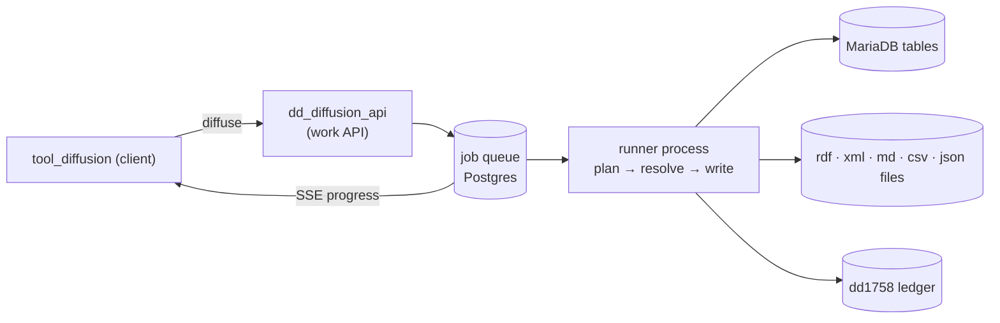

# diffusion

> See also: [The diffusion engine](../../diffusion/native_engine.md) · [Diffusion data flow](../../diffusion/diffusion_data_flow.md) · [Parser cookbook](../../diffusion/parsers.md) · [Architecture overview](../architecture_overview.md) · [Exporting data](../exporting_data.md) · [Sections](../sections/index.md)

The **publication** subsystem takes the subset of work data marked for
publication and emits it to external targets — SQL tables in MariaDB, or RDF /
XML / Markdown / CSV / JSON files — all driven by the diffusion ontology. This
page is the conceptual overview; the full technical reference (architecture,
job queue, formats, configuration, security, tests) is
**[The diffusion engine](../../diffusion/native_engine.md)**.

For the conceptual split between the *work system* and the *diffusion system*,
read [Architecture overview → The two systems](../architecture_overview.md#the-two-systems)
first.

## Role

Diffusion is the **read / publication side** of Dédalo. The work system stores
abstract, ontology-driven records as JSON in the PostgreSQL `matrix` tables (see
[Sections](../sections/index.md)); diffusion re-shapes the records *marked for
publication* into a flat, denormalized dialect that websites, third-party
portals — and AI agents — can consume directly. Data flows **one way**, work →
diffusion: the published copy can be dropped and regenerated at any time, and
nothing in the publication targets ever writes back to the work data.

Unlike the export tool ([Exporting data](../exporting_data.md)), which produces
a one-off flat file on demand for a human, diffusion maintains a **standing,
incrementally-synced published copy**: publishing upserts rows/files, deleting a
work record propagates the deletion to every target, and a per-record
publication switch decides eligibility.

## The diffusion ontology

Everything the engine does is configured in the **diffusion ontology** (the
dd1190 subtree) — there is no publication code to write per project:

- A **diffusion_domain** groups **diffusion_group**s, which group
  **diffusion_element**s. An element is one publication target ("Publish to
  web", "RDF export", …): its `properties->diffusion->type` picks the output
  format, and `service_name` names the output directory for file formats.
- Under an element, **database** and **table** nodes name the MariaDB database
  and tables (one table per published section); their child **field** nodes map
  work components to columns, carrying the resolution chain (`ddo_map`), parser
  functions and column typing.
- Any of these nodes may be an **alias** (`*_alias`) pointing at a real node
  elsewhere: the alias's name wins while structure and properties are inherited.
  This is how an institution *redirects* a shared publication schema — reuse a
  standard model, publish it under your own database/table names.

The engine compiles this subtree into an executable **publication plan**; the
admin `validate` action reports every configuration error (missing
`service_name`, invalid identifiers, unknown parser functions) before anything
runs. The ontology walkthrough with worked examples is in
[Diffusion data flow](../../diffusion/diffusion_data_flow.md); the exact
compile-time contract is in
[The diffusion engine → The ontology contract](../../diffusion/native_engine.md#the-ontology-contract).

## Formats

One ontology, many writers. The element's `type` selects the format:

| `type` | Published artifact |
| --- | --- |
| `sql` | Classic MariaDB tables, one per section — the default target behind public websites |
| `socrata` | Dormant; behaves as `sql` |
| `csv` | One streamed RFC 4180 `.csv` file per table |
| `json` | One NDJSON file per table (+ metadata sidecar) |
| `markdown` | One human/AI-readable `.md` file per record — see [Markdown diffusion](../../diffusion/diffusion_markdown.md) |
| `rdf` | One deterministic `.rdf` file per record, plus merged file and zip |
| `xml` | One deterministic `.xml` file per record, plus merged file and zip |

Adding a format is one ontology `type` string plus one registered writer — see
[The diffusion engine → Formats](../../diffusion/native_engine.md#formats).

## Publication gate, ledger and media markers

Three concepts guarantee that only intended data becomes public:

- **The publication gate.** Each record's eligibility is the boolean value of
  its `component_publication` (plus the ontology's `is_publishable` flag),
  evaluated per record and **fail-closed**: any error while checking the gate
  means *unpublish*. An unpublishable record is not skipped — its published
  row/file is actively **removed**.
- **The dd1758 ledger.** There is no bespoke publication table ("the Dédalo
  way"): publication state is a standard Dédalo section, **dd1758**, in
  PostgreSQL. Every publish, unpublish and pending-unpublish event writes a
  ledger row — who, when, which record, which target. Published *files* carry
  no timestamps at all; who/when lives only in the ledger, which keeps the
  artifacts deterministic.
- **Media markers.** Publishing a record also marks its media files as
  publicly readable (and unpublishing unmarks them), feeding the
  web-server-enforced media protection layer. Marker failures never fail a
  publication run, and markers only ever *widen* access when present.

Deleting a work record propagates through the same machinery: rows are deleted
from every SQL target, files unlinked from every file target, and any target
that is unreachable gets a dd1758 `unpublish_pending` row that is retried on
boot, opportunistically, or from the tool's *Retry* button. A diffusion failure
never blocks the work-system delete.

## How a publication runs

Publishing is a **durable job**: the `diffuse` action enqueues a job in a
Postgres-backed queue and streams progress back to the client, while a spawned
runner process does the actual resolve-and-write work in batches, checkpointing
after each one. A crashed or interrupted run resumes from its checkpoint and
produces byte-identical output; a closed browser changes nothing — the tool
reconnects to the running job later.

The full lifecycle — plan compilation, the resolver, language projection,
crash-resume, cancelation, the action set — is documented step by step in
[The diffusion engine](../../diffusion/native_engine.md).

## How it fits with the rest of Dédalo

- **[Sections](../sections/index.md)** — the work-data source of truth; deleting
  a record triggers delete propagation to every publication target.
- **[Components](../components/index.md)** — the field values the resolver
  extracts; `component_publication` provides the gate.
- **[SQO](../sqo.md)** — `diffuse` selects the records to publish with a
  standard search query object (the tool's current list filter).
- **[Locator](../locator.md)** — the relation graph the resolver follows across
  sections (bounded by the *resolve levels* budget); also the shape stored in
  the dd1758 ledger.
- **[Exporting data](../exporting_data.md)** — the *other* read path: a
  human-driven, one-off download vs diffusion's standing, machine-consumed copy.
- **[Publication API](../../diffusion/publication_api/index.md)** — the serving
  side: the REST API websites use to read the published MariaDB data.
- **[Media protection](../../config/media_protection.md)** — consumes the
  publication markers diffusion writes.
- **`tool_diffusion`** — the curator-facing UI; see the
  [tool reference](../../development/tools/reference/tool_diffusion.md).

## Related

- [The diffusion engine](../../diffusion/native_engine.md) — the full technical
  reference (source: `src/diffusion/`; spec: `engineering/DIFFUSION_SPEC.md`).
- [Diffusion data flow](../../diffusion/diffusion_data_flow.md) — what gets
  published and how you decide: server topologies, the ontology worked examples,
  resolve levels.
- [Markdown diffusion](../../diffusion/diffusion_markdown.md) — the per-record
  Markdown format.
- [Architecture overview](../architecture_overview.md) — the two-system split.
