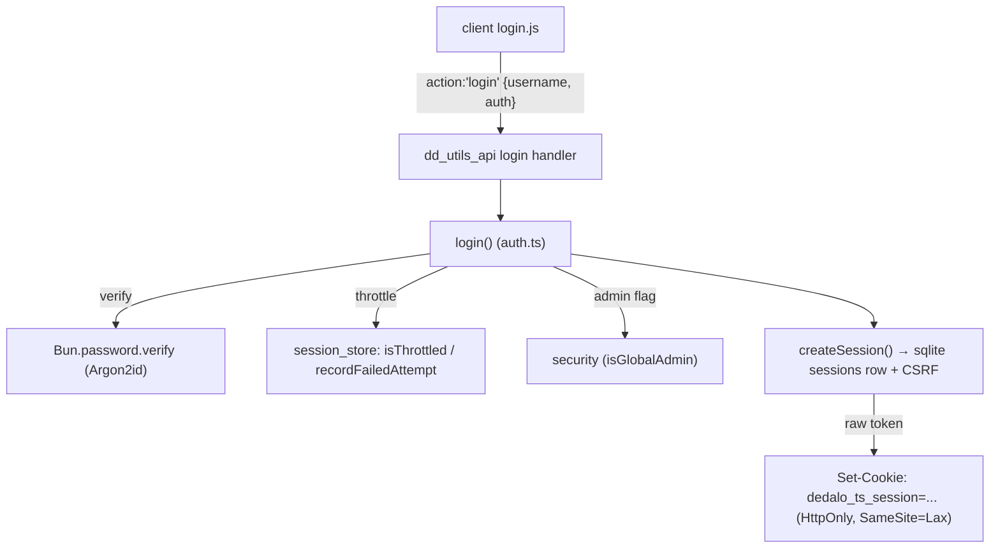

# login

> See also: [security](security.md) · [component_password](../components/component_password.md) · [Architecture overview](../architecture_overview.md)

The authentication subsystem is Dédalo's entry point: it validates credentials
against the users section and issues a **server-side session** — Argon2id
verification, rotating tokens, a sliding-window throttle and a per-session CSRF
token.

## Role

Authentication lives in **`src/core/security/auth.ts`** (the credential gate) on
top of **`src/core/security/session_store.ts`** (session issuance, storage and
the login throttle). Together they own the **authentication** half of Dédalo's
access control: they turn a username/password into an authenticated
server-side session, and tear that session down on logout.

They are deliberately thin on *what you may do* once you are in: per-element
**authorization** (profiles, projects, integer permissions) lives in
[`permissions.ts`](security.md), which the login path only *touches* to stamp
the admin flag. The split is:

| module | role |
| --- | --- |
| **`security/auth.ts`** | **Authentication** — verify credentials against the shared user records, throttle brute force, open a session, stamp the admin flag. A user record is just a record in the **users section** (`dd128`); `auth.ts` reads its components to authenticate. |
| **`security/session_store.ts`** | **Sessions & throttle** — issue/rotate/expire tokens (bun:sqlite store), mint the per-session CSRF token, keep the sliding-window login-attempt counter. |
| **`security/permissions.ts`** | **Authorization** — given a logged user, resolve the integer permission over any ontology element, the user's projects, and the `isGlobalAdmin` / `isDeveloper` flags. |

!!! warning "The session store holds hashes, not tokens"
    Sessions are rows in a **bun:sqlite** database in the private config
    directory. The cookie (`dedalo_ts_session`) carries a raw random token, and
    only that token's **SHA-256** is stored — so a leaked database file cannot be
    replayed as a live session.

## Responsibilities

- **Authenticate** a username/password pair (`login()` in `auth.ts`), running the
  gate: throttle check → user lookup → Argon2id verification → maintenance-mode
  gate → session issuance.
- **Throttle** brute-force / credential-stuffing attempts, keyed by
  `namespace|lower(username)|ip`, persisted in the sqlite store and shared across
  processes.
- **Build the authenticated session** (`createSession()`): issue a fresh random
  token (session rotation), mint the per-session CSRF token, stamp `userId` /
  `username` / `isGlobalAdmin`.
- **Verify** the current session (`getSession()`) — the dispatcher resolves the
  request cookie to a live session (sliding TTL) on every authenticated call.
- **Log out** (`destroySession()`): delete the session row; the HTTP layer clears
  the cookie.
- **Resolve the login-form context** consumed by the client
  (`buildLoginContext()` in `src/core/api/handlers/login_context.ts`).

## Key concepts

### The session row

A successful login writes a row in the sqlite `sessions` table; the dispatcher
consumes it as a `Session` value:

```ts
interface Session {
    userId: number;          // the user's section_id (root = -1)
    username: string;        // short login name
    isGlobalAdmin: boolean;  // stamped at login (superuser in v0)
    csrfToken: string;       // per-session, constant-time compared
    applicationLang: string | null; // per-session lang override (change_lang)
    dataLang: string | null;         // null ⇒ installation default
}
```

The DB stores only the token's SHA-256 (`token_hash` is the primary key), plus
`created_at` / `last_seen` for the sliding TTL (`SESSION_TTL_SECONDS`, default
12h). `getSession()` touches `last_seen` on every resolve and self-expires a row
past the TTL. The session is the single source of truth — there is no separate
token store, and the CSRF token is only ever compared with
`crypto.timingSafeEqual`.

### The users section is the credential store

There is no bespoke `users` table. A user is a record in the section `dd128`, and
`auth.ts` authenticates by reading its components straight from `matrix_users`:

| datum | tipo | model | read by |
| --- | --- | --- | --- |
| Login name | `dd132` | `component_input_text` | `findUserByUsername()` |
| Password | `dd133` | `component_password` | `login()` (Argon2id verify) |
| Global-admin flag | `dd244` | relation | `resolvePrincipal()` ([security](security.md)) |
| Developer flag | `dd515` | relation | `resolvePrincipal()` |
| Projects (filter master) | `dd170` | `component_filter_master` | `getUserProjects()` |
| Profile select | `dd1725` | relation | `resolveProfileId()` |

User lookup is **not** done through the SQO/search stack. `findUserByUsername()`
issues a direct, parameterised JSONB-containment query against `matrix_users`
(`string->'dd132' @> $3::text::jsonb`, `LIMIT 1`), deliberately without a
`section_id > 0` restriction so the root user (`section_id = -1`) is found. The
value is bound as a parameter (`$3`), never interpolated.

!!! note "root user (`-1`) special cases"
    The super-user (`root`, `section_id = -1`) carries an `$argon2id$` hash, is
    the only account allowed while maintenance mode is set, and is always treated
    as global admin (`resolvePrincipal` short-circuits it to admin+developer).
    The **session row's** `isGlobalAdmin` field is stamped `true` only for `-1`;
    it is informational — per-request authorization identity is resolved fresh
    by `resolvePrincipal(userId)`, which reads the `dd244` admin flag from the
    user record, so flag-based admins are fully recognized regardless of the
    session stamp. Note that root is also the only identity that bypasses the
    permissions matrix; a `dd244` admin resolves per-element levels through
    their profile like any other user (see [security](security.md)).

### Argon2id verification

Verification is `Bun.password.verify(password, hash)`. `auth.ts` refuses any
stored value that does **not** start with `$argon2` — there is no fallback
algorithm and no "try the old scheme" branch.

!!! warning "A v6 account cannot log in until its password is migrated"
    Very old installations stored passwords **reversibly encrypted** rather than
    hashed. Such a value is refused: `auth.ts` denies loudly in the server log
    (naming the account) and ambiguously on the wire.

    These accounts do **not** need to choose a new password. Run
    `scripts/migrate_v6_passwords.ts`, which decrypts each legacy value once,
    re-hashes it with Argon2id, and writes the hash back.

### Brute-force throttle (SEC-019)

Failed attempts are rows in the sqlite `login_attempts` table, keyed by
`buildThrottleKey('login', username, ip)` = `namespace|lower(username)|ip`.
Defaults (env-overridable via `../private/.env`): `LOGIN_MAX_ATTEMPTS` = 10,
`LOGIN_ATTEMPT_WINDOW` = 900s, `LOGIN_LOCKOUT_SECONDS` = 900s. `isThrottled()`
locks the key when the count over the sliding window is reached; a locked login
returns the same **ambiguous** failure message *before* touching the user
lookup, so lockout never confirms the account exists. Only genuine
credential-guess signals feed the counter (wrong password, unknown user, empty
stored password, legacy hash). A confirmed success clears the counter
(`clearAttempts()`).

!!! note "Shared across processes, per node"
    The throttle state is a single sqlite file, so every worker on a node shares
    the counter. Behind a multi-node load balancer the state is still per node.

### Maintenance-mode gate

`login()` blocks any non-superuser while the server state `maintenance_mode` is
set, returning an "under maintenance" message. Only `root` (`-1`) passes.

## The media-auth cookie

A successful login also arms the **media-auth cookie**. `login()` calls
`initMediaAuthCookie()` (`src/core/media/protection.ts`), which returns the daily
media cookie value, lays its marker file and refreshes the generated web-server
rule files. `src/server.ts` sets it alongside the session cookie.

This is what lets the web server authorize a protected-media read with a single
`stat()`, without calling back into the application. The cookie is arranged
**before** the session is issued, so a failure there cannot leave a logged-in user
whose every media file 404s.

See [Media protection](media_protection.md) for the marker store, the cookie
grammar and the generated rule files.

## The session lifecycle

Authentication is done through the module functions; nothing is instantiated.

```ts
// Authenticate (what the dd_utils_api::login dispatch handler calls)
const outcome = await login(username, password, clientIp);
if (outcome.ok) {
    // outcome.sessionToken is the RAW cookie value; the HTTP layer sets it as
    // `dedalo_ts_session=<token>; HttpOnly; SameSite=Lax; Path=/`
    // outcome.userId is the user's section_id
}
```

The full life cycle: `login()` → `createSession()` (session row + CSRF minted) →
… work (each request `getSession()`-resolves the cookie, sliding the TTL) …→
`destroySession()` (logout). Session **rotation on login** is structural: a fresh
token is always issued, so any pre-login token is superseded (the SEC-004
session-fixation guarantee).

## Public API

Grouped by concern. Functions are exported from `auth.ts` and `session_store.ts`
and verified against the source.

### Authentication (`auth.ts`)

| function | purpose |
| --- | --- |
| `login(username, password, clientIp)` | The credential gate. Runs throttle → `findUserByUsername()` → Argon2id verify (`Bun.password.verify`) → maintenance-mode gate → `createSession()`. Returns `{ ok, message, sessionToken?, userId? }`. Every deny path returns the same ambiguous `LOGIN_FAILED_MESSAGE`; the failing signals feed the throttle. |
| `LOGIN_FAILED_MESSAGE` | The single ambiguous message ("User does not exist or password is invalid") — never reveals whether the account exists. |

### Sessions & throttle (`session_store.ts`)

| function | purpose |
| --- | --- |
| `createSession(userId, username, isGlobalAdmin)` | Insert a session row; return the RAW token (cookie value). Mints a per-session CSRF token; stores only the token's SHA-256. |
| `getSession(rawToken)` | Resolve a raw cookie token to a live `Session` (touching `last_seen`); `null` if unknown or past the TTL (self-expiring). |
| `destroySession(rawToken)` | Delete the session row (logout). |
| `verifyCsrf(session, candidate)` | Constant-time CSRF comparison (`crypto.timingSafeEqual`); `false` on empty/length-mismatch. |
| `setSessionLangs(rawToken, {applicationLang?, dataLang?})` | Persist the user's per-session language choice (the `change_lang` handler). |
| `buildThrottleKey(namespace, username, ip)` | The `namespace|lower(username)|ip` throttle key (SEC-019 shape). |
| `isThrottled(key)` / `recordFailedAttempt(key)` / `clearAttempts(key)` | The sliding-window throttle: test lockout, record a failure, clear on success. |
| `pruneExpiredSessions()` | Delete sessions idle past the TTL. |
| `SESSION_COOKIE` | The cookie name constant, `dedalo_ts_session`. |

### Login-form context (`src/core/api/handlers/login_context.ts`)

| function | purpose |
| --- | --- |
| `buildLoginContext()` | Build the login-form `ddo` (`type:'login', tipo:'dd229', model:'login'`): the ontology children of `dd229` (`login_items`) plus an `info` block (entity, code/build/data/ontology versions). Served pre-auth by the `get_login_context` / `start` handlers so the form renders before any session exists. |

## How it fits with the rest of Dédalo

- **API surface.** Clients never call `auth.ts` directly; they hit the API
  dispatcher (`src/core/api/dispatch.ts`). The `dd_utils_api` registry exposes
  `get_login_context`, `login`, `quit` and `change_lang`; `dd_core_api.start`
  serves the login element context when unauthenticated. The `login` handler maps
  the wire `{username, auth}` to `login(username, auth, clientIp)` and, on
  success, returns `{result:true, csrf_token}` with the fresh session cookie; the
  `quit` handler calls `destroySession()` and clears the cookie. The client model
  is the copied `core/login/js/login.js`.
- **The dispatch gates.** `dispatchRqo()` runs three gates per request:
  (1) the action must be in the `ACTION_REGISTRY` allowlist; (2) a session is
  required unless the action is in `NO_LOGIN_ACTIONS` (`login`,
  `get_environment`, `start`, `get_login_context`); (3) CSRF is verified
  (`verifyCsrf`) for every authenticated, non-exempt action — read and count are
  **not** exempt. A CSRF failure returns `errors:['csrf_failed']` plus the
  session's current token, so the client's single transparent retry can succeed.
- **Authorization.** `login()` stamps `isGlobalAdmin` into the session;
  [`permissions.ts`](security.md) then decides per-element access.
  `resolvePrincipal(userId)` reads the admin/developer flags back for the current
  user. An unauthenticated request never reaches a permission check — the auth
  gate rejects it first, which is the structural "not logged ⇒ 0".
- **Credentials.** Hashing and the credential lifecycle are owned by
  [`component_password`](../components/component_password.md); verification here
  is `Bun.password.verify` against the stored Argon2id hash.
- **Media protection.** A successful login arms the media-auth cookie — see
  [Media protection](media_protection.md).



**Prose description of the diagram above:** The client posts `action:'login'` to
the `dd_utils_api` login handler, which calls `login()` in `auth.ts`. That runs
the throttle check, verifies the password with `Bun.password.verify` (Argon2id),
resolves the admin flag, and calls `createSession()` — inserting a row in the
sqlite `sessions` store (with a per-session CSRF token) and returning the raw
token. The HTTP layer sets it as the `HttpOnly; SameSite=Lax` `dedalo_ts_session`
cookie.

## Examples

### Guard an API action

```ts
// The dispatcher's gate 2 already rejected unauthenticated requests, so a
// handler for a non-NO_LOGIN action can rely on context.session being non-null:
const principal = context.principal ?? (await resolvePrincipal(context.session.userId));
```

### Authenticate and open a session

```ts
const outcome = await login('render', plaintext, clientIp);
if (!outcome.ok) {
    // outcome.message is the ambiguous LOGIN_FAILED_MESSAGE on any deny
    return { status: 200, body: { result: false, msg: outcome.message } };
}
// success: outcome.sessionToken → the dedalo_ts_session cookie
```

### Log out

```ts
if (context.sessionToken) destroySession(context.sessionToken);
// the HTTP layer clears the cookie:
//   Set-Cookie: dedalo_ts_session=; HttpOnly; SameSite=Lax; Path=/; Max-Age=0
```

## Related

- [security](security.md) — authorization: profiles, projects, integer
  permissions, `isGlobalAdmin` / `isDeveloper`.
- [component_password](../components/component_password.md) — the credential
  field: Argon2id hashing, masked reads, `verify_password()`.
- [component_security_access](../components/component_security_access.md) — the
  per-profile permission grid resolved after login.
- [Architecture overview](../architecture_overview.md) — the request lifecycle
  and the dispatch gates this login path sits in front of.
