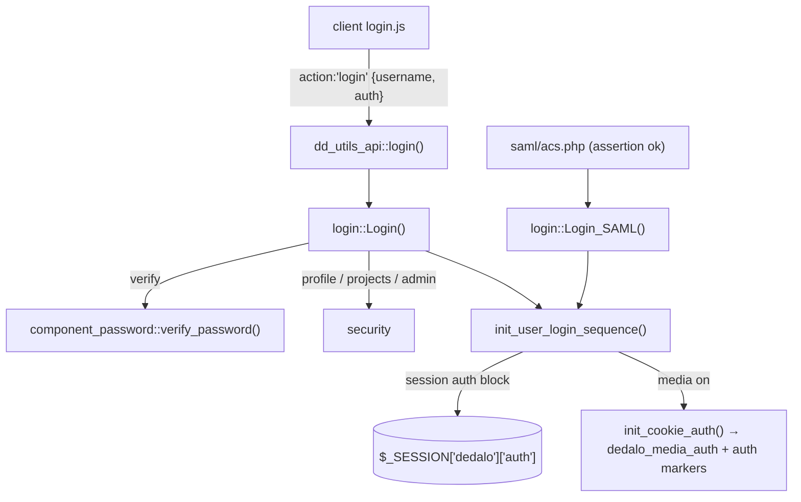

# login

> See also: [security](security.md) · [component_password](../components/component_password.md) · [Architecture overview](../architecture_overview.md)

The server class `login` is Dédalo's authentication entry point: it validates credentials against the users section, builds the authenticated session, and arms the media-protection auth cookie.

## Role

`login` (in `core/login/class.login.php`, `class login extends common`) is the
PHP class that owns the **authentication** half of Dédalo's access control. It
turns a username/password (or a SAML assertion) into an authenticated
`$_SESSION['dedalo']['auth']` block, and it tears that session down on logout.

It is deliberately thin on *what you may do* once you are in: per-element
**authorization** (profiles, projects, integer permissions) lives in
[`security`](security.md), which `login` only *calls* during the login gate.
The split is:

| class | role |
| --- | --- |
| **`login`** *(this class)* | **Authentication** — verify credentials, throttle brute force, build/destroy the session, log activity, set the media auth cookie. A user record is just a record in the **users section** (`DEDALO_SECTION_USERS_TIPO` = `dd128`); `login` reads its components to authenticate. |
| **`security`** | **Authorization** — given a logged user, resolve the integer permission over any ontology element, the user's profile and projects, and the `is_global_admin` / `is_developer` flags. |
| **`component_password`** | The single owner of the **credential lifecycle**: hash on write (Argon2id), verify (never `===`), lazily upgrade legacy values. |

!!! note "Inheritance"
    `login extends common`, so it inherits the shared object machinery
    (`$tipo`, `$mode`, `$lang`, `$label`, `load_structure_data()`, `get_json()`,
    `get_data_item()`, …). Its fixed tipo is **`dd229`** (see
    `get_login_tipo()`); the constructor sets `lang = DEDALO_DATA_LANG`. Most of
    the authentication API is `static` — `login` is rarely instanced except to
    build the login-form context via `get_structure_context()`.

## Responsibilities

- **Authenticate** a username/password pair (`Login()`) or a SAML code
  (`Login_SAML()`), running the full gate: input validation → maintenance-mode
  gate → user lookup → password verification → active-account check →
  profile/projects check.
- **Throttle** brute-force / credential-stuffing attempts (SEC-019), keyed by a
  `sha1(namespace|username|trusted-ip)` on local disk.
- **Build the authenticated session** (`init_user_login_sequence()`): regenerate
  the session id (SEC-004), stamp the `auth` block, run init tests, kick off
  background tasks (backup, DB analyze, security-access datalist precompute),
  and set the `dedalo_logged` signal cookie.
- **Arm media protection** (`init_cookie_auth()`): set the fixed-name
  `dedalo_media_auth` cookie and sync the `auth/` markers so logged users can
  read protected media (see [media protection](#media-protection-the-auth-cookie)).
- **Verify** the current session (`is_logged()` / `verify_login()`).
- **Log out** (`Quit()`): unlock components, update activity stats, clear caches,
  rotate+destroy the session, clear cookies, log the event.
- **Report login activity** to the activity logger (`login_activity_report()`).
- **Resolve user metadata** from the users section: username, full name, code,
  image, default section, active-account flag, profile/projects presence.
- **Build the login-form context** consumed by the client (`get_structure_context()`).

## Key concepts

### The session `auth` block

A successful login writes everything under `$_SESSION['dedalo']['auth']`:

```php
$_SESSION['dedalo']['auth'] = [
    'is_global_admin' => bool,   // from security::is_global_admin()
    'is_developer'    => bool,   // from security::is_developer()
    'user_id'         => int,    // the user's section_id (root = -1)
    'username'        => string, // short name, e.g. 'render'
    'full_username'   => string, // display name
    'is_logged'       => 1,      // strict ===1 required by verify_login()
    'salt_secure'     => string, // AES-256-GCM marker (SEC-082), only checked non-empty
    'login_type'      => 'default' | 'saml',
    'cookie_auth'     => object  // media auth cookie state (only when protection on)
];
```

The global helpers in `shared/core_functions.php` read this block:
`logged_user_id()` returns `auth.user_id` (or `null`), `logged_user_username()`
returns `auth.username`. The session is the single source of truth — there is no
token store; `salt_secure` is only ever tested for non-emptiness (never
decrypted), so its cipher can change without a migration.

### The users section is the credential store

There is no bespoke `users` table. A user is a record in the section
`DEDALO_SECTION_USERS_TIPO` (`dd128`), and `login` authenticates by instancing
its components through the standard `component_common::get_instance()` factory
(always `cache=false`, `lang=DEDALO_DATA_NOLAN`):

| datum | tipo (constant) | model | read by |
| --- | --- | --- | --- |
| Login name | `dd132` `DEDALO_USER_NAME_TIPO` | `component_input_text` | `logged_user_username()` |
| Full name | `DEDALO_FULL_USER_NAME_TIPO` | `component_input_text` | `get_full_username()` |
| Password | `dd133` `DEDALO_USER_PASSWORD_TIPO` | `component_password` | `Login()` |
| Active account | `dd131` `DEDALO_ACTIVE_ACCOUNT_TIPO` | `component_radio_button` | `active_account_check()` |
| Projects (filter master) | `DEDALO_FILTER_MASTER_TIPO` | `component_filter_master` | `user_have_projects_check()` |
| SAML code | `dd1053` | `component_input_text` | `get_users_with_code()` |
| User image | `dd522` `DEDALO_USER_IMAGE_TIPO` | `component_image` | `get_user_image()` |
| Default section | `dd1603` | `component_input_text` | `get_default_section()` |

User lookup is **not** done through the SQO/search stack. `get_users_with_name()`
and `get_users_with_code()` issue a direct, parameterised JSONB-containment query
against `matrix_users` (`string::jsonb @> $1`, `LIMIT 1`), deliberately without
the SQO `section_id > 0` restriction so the root user (`section_id = -1`) is
found. A name that matches more than one record is refused as *ambiguous*.

!!! note "root user (`-1`) special cases"
    The super-user (`root`, `section_id = -1`) is the only account allowed in
    maintenance mode, is always treated as active (`active_account_check()`
    short-circuits to `true`), skips the profile/projects checks via
    `security::is_global_admin()`, and is excluded from the lazy password
    upgrade. `get_v6_root_db_data()` / `component_password::get_v6_root_password_data()`
    are **provisional** v6→v7 transition fallbacks (slated for removal after 7.0.0).

### Brute-force throttle (SEC-019)

Failed attempts are persisted as a small JSON file under
`DEDALO_CACHE_MANAGER['files_path']/dd_login_attempts/<sha1(key)>.json`, keyed by
`build_login_throttle_key(namespace, identifier)` =
`namespace|lower(identifier)|trusted-ip`. Defaults (overridable by `define()`):
`DEDALO_LOGIN_MAX_ATTEMPTS` = 10, `DEDALO_LOGIN_ATTEMPT_WINDOW` = 900s,
`DEDALO_LOGIN_LOCKOUT_SECONDS` = 900s. On lockout the login methods return a
ready `{result:false, errors:['login_locked'], retry_after}` response *before*
touching the DB. Only genuine credential-guess signals feed the counter (wrong
password, unknown user/code, empty stored password); server-side conditions
(ambiguous user, inactive account on a valid code) do not. A confirmed success
clears the counter.

!!! warning "AUTH-08 — single-node only"
    The throttle state is local disk, so lockout is per node. Behind a load
    balancer, an attacker's attempts spread across nodes and may never reach the
    threshold. This is a documented, deliberate limitation — see the comment in
    `get_login_throttle_file()`.

## Media protection: the auth cookie

When media access control is enabled (`media_protection::get_mode() !== false`),
`init_user_login_sequence()` calls the private `init_cookie_auth()`. This is
**rule A** of the media-protection system (logged users read everything); the web
server authorizes by a single `stat()` on a marker file, with no PHP in the
file-serving path. `login` is one of the *three enforcement surfaces* that must
stay in lockstep (the others are the generated `.htaccess` and the Bun
`media_index.ts`). Cross-reference: `.agents/skills/dedalo-media-protection/SKILL.md`.

What `init_cookie_auth()` does, every login (so a redeploy or cleared media dir
self-heals):

1. Reads/recycles the cookie state file
   (`media_protection::get_cookie_auth_file_path()`, written with a leading
   `<?php exit(); ?>` HTTP-disclosure guard line that `read_cookie_auth_file()`
   strips). It keeps **today's and yesterday's** values valid.
2. Generates today's value when missing:
   `hash('sha512', …random_bytes(8))` → a 128-hex string.
3. `media_protection::sync_auth_markers([today, yesterday])` writes the
   stat-able marker files under `.publication/auth/` and rotates stale ones.
4. `media_protection::write_htaccess()` (config-hash guarded, normally a no-op).
5. Stores the state in `$_SESSION['dedalo']['auth']['cookie_auth']` and
   `setcookie(media_protection::COOKIE_NAME, today_value, …)`.

!!! warning "The cookie NAME is fixed, only the VALUE rotates"
    `media_protection::COOKIE_NAME` (`dedalo_media_auth`) never changes — that is
    what keeps the generated `.htaccess` static and makes reload-free nginx
    support possible. Only the 128-hex value rotates daily. `Quit()` clears this
    same fixed-name cookie (again gated on `get_mode() !== false`). Never
    reintroduce rotating cookie names.

## Instantiation & lifecycle

`login` does **not** define a custom factory; authentication is done through its
static methods. Instancing is only needed to build the login-form context:

```php
public function __construct(string $mode = 'edit')
```

The constructor sets `id = null`, `tipo = 'dd229'` (`get_login_tipo()`),
`lang = DEDALO_DATA_LANG`, the requested `mode`, and calls
`parent::load_structure_data()`. The legacy `is_logged` guard was intentionally
removed so the login context can be fetched in unit tests.

```php
// Build the login-form context (what dd_utils_api::get_login_context returns)
$login        = new login();
$login_json   = $login->get_json((object)[
    'get_context' => true,
    'get_data'    => false
]);
$context = $login_json->context; // dd_object describing the login form
```

```php
// Authenticate (what dd_utils_api::login() calls)
$response = login::Login((object)[
    'username' => 'render',
    'password' => $plaintext   // min length 8
]);
if ($response->result === true) {
    // session is now authenticated; $response->default_section is the landing tipo
}
```

The full life cycle: `Login()` / `Login_SAML()` →
`init_user_login_sequence()` (session built) → … work … → `Quit()` (session
destroyed). `is_logged()` is the predicate checked on every authenticated API
call.

## Public API

Grouped by concern. *static?* marks class-level (static) methods. Private helpers
(`init_user_login_sequence`, `init_cookie_auth`, `verify_login`, the throttle
helpers, `get_default_section`, `get_login_tipo`, `get_auth_cookie_value`) are
listed under [Internal helpers](#internal-helpers) for orientation but are not
public surface.

### Authentication

| method | static? | purpose |
| --- | --- | --- |
| `Login(object $options)` | ✓ | The username/password gate. `$options = {username, password}`; password min length 8. Runs validation → maintenance gate → throttle → lookup → `component_password::verify_password()` → active-account → profile/projects, then `init_user_login_sequence()`. Returns `{result, msg, errors, result_options, default_section}`. Lazily upgrades legacy AES passwords to Argon2id on success (SEC-001, non-root, best-effort). |
| `Login_SAML(object $options)` | ✓ | The SAML gate. `$options = {code}`. Validates the client IP against `SAML_CONFIG['idp_ip']` using `get_client_ip_trusted()` (SEC-017), throttles by `saml|code|ip`, looks up the user by code (`dd1053`), runs the active-account + profile/projects checks, then `init_user_login_sequence(..., login_type='saml')`. Invoked from `core/login/saml/acs.php` after assertion validation + replay-reject (SEC-078). |
| `Quit(object $options)` | ✓ | Logout. `$options = {mode?, cause?}`. Refuses if not logged. Unlocks components, updates activity stats, deletes cache files, logs the event, clears the media cookie + session cookie + `dedalo_logged`, then `session_regenerate_id(true)` + `session_destroy()` (SEC-080). Returns `bool`. |
| `is_logged()` | ✓ | Public predicate; alias of `verify_login()`. `true` only when `auth.user_id`, `auth.is_logged===1` and `auth.salt_secure` are all set (and, in maintenance mode, the user is `root`). |

### User metadata (from the users section)

| method | static? | purpose |
| --- | --- | --- |
| `logged_user_username(string\|int $section_id)` | ✓ | Resolve the short login name (`dd132`) for a user id. (Class method; not the global `logged_user_username()` helper.) |
| `get_full_username(string\|int $section_id)` | ✓ | Resolve the full display name (`DEDALO_FULL_USER_NAME_TIPO`). |
| `get_user_code(string\|int $section_id)` | ✓ | Resolve the SAML/external code (`dd1053`), or `null`. |
| `get_user_image(string\|int $section_id)` | ✓ | Resolve the user's image URL (`dd522`); falls back to the default avatar for `section_id < 1`. |
| `active_account_check(string\|int $section_id)` | ✓ | `true` only if the active-account radio (`dd131`) equals `NUMERICAL_MATRIX_VALUE_YES`. `root` (`-1`) is always `true`. |
| `user_have_profile_check(string\|int $section_id)` | ✓ | `true` if `security::get_user_profile()` returns a profile locator. |
| `user_have_projects_check(string\|int $section_id)` | ✓ | `true` if the user's `component_filter_master` (`DEDALO_FILTER_MASTER_TIPO`) has any project data. |
| `check_root_has_default_password()` | ✓ | `true` when the `root` password (`dd133` on `section_id = -1`) is unset/empty — used to warn on a fresh install. |

### User lookup (direct SQL)

| method | static? | purpose |
| --- | --- | --- |
| `get_users_with_name(string $username)` | ✓ | Direct parameterised JSONB-containment query on `matrix_users` for the login name; returns matching `section_id`s (`LIMIT 1`). Bound via `$1` (no `pg_escape_string` on the value). |
| `get_users_with_code(string $code)` | ✓ | Same, by SAML code (`dd1053`). `$code` is JSON-encoded into the containment doc and bound as `$1` (AUTH-03 — JSON escaping, not SQL escaping). |
| `get_v6_root_db_data()` | ✓ | **Provisional** v6→v7 fallback: returns `[-1]` so `root` resolves during transition. Remove after 7.0.0. |

### Reporting & context

| method | static? | purpose |
| --- | --- | --- |
| `login_activity_report(string $msg, string $login_label, ?array $activity_data=null)` | ✓ | Write a login/logout event to the activity logger (`logger::$obj['activity']`) under tipo `dd229`. Called on every deny and on success/logout. |
| `get_structure_context(int $permissions=1, bool $add_request_config=false)` | | Build the login-form `dd_object`: the form's child items (`login_items` from the ontology children of `dd229`), a Dédalo `info` block (entity, code/build/data/ontology versions, and — only on a development server — DB connection info), the `saml_config` flag when `SAML_CONFIG` is defined, and the demo-user hint on the `dedalo_demo` entity. Overrides the inherited `common` method. |

### Internal helpers

Private/non-public (documented for navigation, do **not** call from outside):
`init_user_login_sequence()` (builds the session, regenerates the id, runs init
tests, backups, DB analyze, security-access precompute, sets `dedalo_logged`),
`init_cookie_auth()` / `get_auth_cookie_value()` (media cookie),
`verify_login()` (the real predicate behind `is_logged()`),
`get_login_tipo()` (returns `dd229`), `get_default_section()`, and the SEC-019
throttle quartet `get_login_throttle_file()` / `check_login_throttle()` /
`record_failed_login_attempt()` / `clear_failed_login_attempts()` /
`build_login_throttle_key()`.

## How it fits with the rest of Dédalo

- **API surface.** Clients never call `login` directly; they hit
  `dd_utils_api` (`core/api/v1/common/class.dd_utils_api.php`), whose
  `API_ACTIONS` allowlist exposes `get_login_context`, `login` and `quit`.
  `dd_utils_api::login()` maps the wire `{username, auth}` to
  `login::Login({username, password})`; `dd_utils_api::quit()` calls
  `login::Quit()` then `session_write_close()` (and returns a `saml_redirect`
  for SAML sessions). The client model is `core/login/js/login.js`
  (posts `action:'login'` / `action:'quit'` to `dd_api:'dd_utils_api'`).
- **Authorization.** `login` calls into [`security`](security.md) during the
  gate (`is_global_admin`, `is_developer`, `get_user_profile`) and stamps the
  resulting flags into the session; afterwards `security::get_security_permissions()`
  decides per-element access. `common::get_permissions()` returns `0` when not
  logged — so `login` is the gate that makes any permission non-zero.
- **Credentials.** Verification and hashing are delegated entirely to
  [`component_password`](../components/component_password.md)
  (`verify_password()`, `set_data()` Argon2id hashing, lazy upgrade).
- **Media protection.** `init_cookie_auth()` is rule A of the media-protection
  system; the cookie name/value contract is owned by `media_protection`. See the
  media-protection skill and `docs/config/media_protection.md`.
- **SAML.** The assertion endpoints live under `core/login/saml/`
  (`acs.php` validates + replay-rejects, then calls `Login_SAML()`); config is
  `SAML_CONFIG`.



## Examples

### Guard an API action

```php
// the standard chokepoint pattern used across the API classes
if (login::is_logged() !== true) {
    $response->msg = 'Error. Not logged';
    return $response;
}
$user_id = logged_user_id(); // null when anonymous
```

### Log out programmatically

```php
login::Quit((object)[
    'mode'  => 'manual',
    'cause' => 'user requested logout'
]);
```

### Deny duplicate / inactive accounts (read of the gate)

`Login()` returns `result === false` with a populated `errors` array for every
deny path (`'Invalid user name'`, `'Invalid password length'`,
`'User does not exists or password is invalid'`, `'More than one user with the
same name already exists'`, `'Wrong password [1]'`/`'[2]'`, `'Account inactive
or not defined'`, `'User without profile'`, `'User without projects'`, or
`'login_locked'`). On non-development servers a deliberate `sleep(2)` slows
failed responses to blunt brute force.

## Related

- [security](security.md) — authorization: profiles, projects, integer
  permissions, `is_global_admin` / `is_developer`.
- [component_password](../components/component_password.md) — the credential
  field: Argon2id hashing, masked reads, `verify_password()`, lazy upgrade.
- [component_security_access](../components/component_security_access.md) — the
  per-profile permission grid precomputed in the background at login.
- [Architecture overview](../architecture_overview.md) — the request lifecycle
  and the work-system map this login gate sits in front of.
- `.agents/skills/dedalo-media-protection/SKILL.md` and
  `docs/config/media_protection.md` — the media auth cookie (`init_cookie_auth()`)
  in full.
