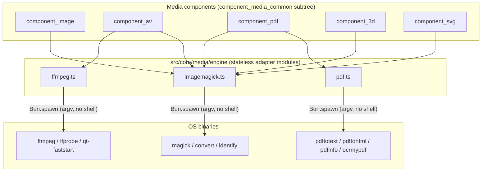

# media_engine

> See also: [component_image](../components/component_image.md) · [component_av](../components/component_av.md) · [component_pdf](../components/component_pdf.md) · [Media protection](../../config/media_protection.md)

The server-side **media processing layer**: a set of stateless TypeScript
adapter modules that shell out to the installed `ffmpeg`/`ffprobe`,
ImageMagick (`magick`/`convert`/`identify`) and PDF (`pdftotext`/`pdftohtml`/
`pdfinfo`/`ocrmypdf`) binaries to transcode, resize, rasterize, probe and
derive media files for the media components.

This page is the **subsystem reference** for `src/core/media/engine/`. It
documents *what the engine does and how it is called*; for how each media
component drives it (upload flow, quality maps, storage layout, the datum
shape) read the component pages cross-linked above.

## Role

`media_engine` is **not** a Dédalo component/descriptor and it owns no record
state. It is a set of modules exporting pure `build*Argv` builders plus
thin `async` runner functions — no classes, no instances.

| module | file | binary it wraps | concern |
| --- | --- | --- | --- |
| **ffmpeg** | `src/core/media/engine/ffmpeg.ts` | `ffmpeg`, `ffprobe`, `qt-faststart` | audio / video transcoding, quality versions, poster frames, fragments/clips, faststart header conform, stream/format probing |
| **ffmpeg_profiles** | `src/core/media/engine/ffmpeg_profiles.ts` | — (pure data) | the 37 A/V encode profiles (quality × standard × aspect), ported verbatim from the PHP settings files as one typed table |
| **imagemagick** | `src/core/media/engine/imagemagick.ts` | `magick` / `convert`, `identify` | raster conversion / resize, thumbnails, rotate, crop, colour-space handling, image probing |
| **pdf** | `src/core/media/engine/pdf.ts` | `pdftotext`, `pdftohtml`, `pdfinfo`, `ocrmypdf` | text/HTML extraction, page count, OCR |
| **spawn** | `src/core/media/engine/spawn.ts` | — (execution discipline) | the one place any media binary is actually invoked |

It sits **below the media components** and **above the operating-system
binaries**. The flow is one-directional: a media component (image / av / pdf /
3d / svg) resolves source and target file paths inside the media tree, then
calls an adapter function that builds an argv array, runs it via `spawn.ts`,
and returns the captured `{exitCode, stdout, stderr}` (or throws on a fatal
failure). The engine never touches the database, the ontology, the session,
or a record's `dato`; it only knows file paths and CLI arguments.



**Prose description of the diagram above:** Five media components sit at the top.
`component_image`, `component_svg` and `component_3d` call into the
`imagemagick.ts` adapter; `component_pdf` calls into both `imagemagick.ts`
(for its jpg cover rasterization) and `pdf.ts` (for text/HTML extraction and
OCR); `component_av` calls into `ffmpeg.ts` (and also borrows
`imagemagick.buildThumb` to rasterize its poster frame). The three adapter
modules form the `media_engine` layer; each shells out to its respective OS
binary via `Bun.spawn` over an argv array — never a shell string. Data flows
downward only — components decide *what file to make where*, the engine
decides *which CLI command builds it*, and the OS does the work.

!!! note "One consolidated engine directory, no PascalCase classes"
    PHP kept `Ffmpeg`/`ImageMagick` as two `PascalCase` classes under
    `core/media_engine/`, with PDF text extraction living inside
    `component_pdf` itself (there was no third media-engine class for it).
    The TS rewrite consolidates **all three** external-binary adapters —
    image, A/V and PDF — as sibling modules under one directory,
    `src/core/media/engine/`, each a plain `.ts` file of exported functions.
    There is no `class.media_engine.php`/`class.Ffmpeg.php` equivalent to
    look for; "media_engine" is the directory / subsystem, not a class.

## Responsibilities

- **Probe media** — read dimensions, aspect ratio, colour space, stream/format
  metadata, and (for A/V) the best available AAC encoder.
- **Derive image renditions** — convert and resize rasters, rasterize PDF pages
  to a jpg cover, build fixed-size thumbnails, and apply CMYK→sRGB profile
  conversion + opaque-background flattening.
- **Edit images in place** — rotate (default / expanded canvas) and crop to a
  geometry.
- **Transcode A/V** — build per-quality two-pass `ffmpeg` argvs from the typed
  profile table, extract audio, and conform MP4 headers for
  progressive/streamed playback (faststart).
- **Generate previews & clips** — extract a poster frame at a timecode and cut
  a fragment between in/out timecodes.
- **Extract PDF text/HTML and run OCR** — `pdftotext`/`pdftohtml` extraction
  with UTF-8 cleanup, `pdfinfo` page counts, `ocrmypdf` forced OCR.
- **Run every binary through one spawn discipline** — argv arrays over
  `Bun.spawn`, never a shell string (see [Statelessness & execution](#statelessness--execution)).

The engine deliberately owns **none** of: file naming, where files live in the
media tree, which qualities a record should have, save/delete of records, or
access control. Those belong to the media components (`src/core/media/path.ts`,
`processing.ts`, `files_info.ts`) and to
[media protection](../../config/media_protection.md).

## Key concepts

### Settings-driven A/V qualities (`ffmpeg_profiles.ts`)

A "quality" is a target resolution/profile such as `1080`, `720`, `576`, `404`,
`240` or `audio` (`config.media.av.qualities`, the `DEDALO_AV_AR_QUALITY`
ladder). Each concrete output is described by a **profile object** — one entry
in the `PROFILE_LIST` typed table, the direct port of the 37 PHP settings
files (`vb`, `s`, `g`, `vcodec`, `ar`, `ab`, `ac`, `force`, `targetPath`, …
became `videoBitrate`, `scale`, `gop`, `videoCodec`, `audioRate`,
`audioBitrate`, `audioChannels`, `force`, `targetPath`). `transcodeTwoPass()`
looks the profile up by name and drives the two-pass encode from those
fields — no runtime file loading.

The setting name is composed from `quality` + media standard + aspect ratio by
`settingName()`:

- **Media standard** — `standardFromFps()` reads the video stream's
  `avg_frame_rate` (via `ffprobe`); `>= 29 fps ⇒ ntsc`, otherwise `pal`.
- **Aspect ratio** — resolved by the caller (`process_uploaded_file.ts`'s
  `pickAspect()`) from the stream's pixel dimensions, one of `16x9` or `4x3`
  only — PHP's fuller `16x9`/`4x3`/`5x3`/`3x2`/`5x4` set is narrowed to this
  binary split (a documented simplification, not a bug).

So `404` + `pal` + `16x9` → setting name `404_pal_16x9` → the
`404_pal_16x9` entry in `PROFILE_LIST`.
`audio`/`audio_tr` are special-cased: `settingName()` skips standard/aspect
resolution for them.

```typescript
// src/core/media/engine/ffmpeg_profiles.ts — the 404_pal_16x9 profile
videoProfile('404_pal_16x9', '1024k', '720x404', 25, 44100, '64k', 1, '404')
// → { name: '404_pal_16x9', videoBitrate: '1024k', scale: '720x404', gop: 25,
//     videoCodec: 'libx264', deinterlace: '-vf yadif', gammaFilter: '-vf lutyuv=…',
//     force: 'mp4', audioRate: 44100, audioBitrate: '64k', audioChannels: 1,
//     audioCodec: 'libvo_aacenc', targetPath: '404' }
```

!!! note "Data, not code, and reachability is narrower than the table"
    Where PHP's setting directory `require`d arbitrary PHP files at
    conversion time (executable, not data — see the PHP-era warning this page
    used to carry), `PROFILE_LIST` is an inert TypeScript array: nothing here
    executes at read time. Only the tiers in the standard ladder
    (`1080`/`720`/`576`/`404`/`240`/`audio`) are ever selected by
    `settingName()`; the extra entries (`288`, `480`, `1080i`, `1080p`) are
    ported for fidelity to the PHP settings files but are unreachable from the
    live quality ladder, exactly as in PHP.

### Audio-codec autodetection (`ffmpeg.ts`)

`getAudioCodec()` runs `ffmpeg -buildconf` once and caches the result on a
module-level variable: it prefers `libfdk_aac`, falls back to `libvo_aacenc`,
and finally to the native `aac` encoder. There is no TS equivalent of PHP's
`check_lib($name)`/`get_version()` reporting (used by the PHP `system_info`
maintenance widget to show installed-binary versions/codecs to admins) — not
yet ported; see the gap note in [Statelessness & execution](#statelessness--execution).

### Colour space and profiles (`imagemagick.ts`)

`buildConvertArgv()` builds the central image-conversion recipe. The caller
(`processing.ts`'s `buildImageVersion()`) probes the source first:

- `getColorspace()` — runs `identify -quiet -format '%[colorspace]' <src>[0]`;
  when it reports CMYK, `buildConvertArgv({cmyk: true, …})` injects the input
  ICC profile (`Generic_CMYK_Profile.icc`) and the output profile
  (`sRGB_Profile.icc`) from `src/core/media/engine/icc/`, then strips the
  source profile (`-strip`).
- Opaque outputs get a white background and are flattened
  (`-background '#ffffff' -flatten -auto-orient -quiet`) — PHP's transparent
  branch (`-background none` + cloned-alpha layer) is not reproduced; every
  TS conversion goes through the opaque path.
- Resize uses the pixel-area budget (`pixelAreaBudget()`,
  `src/core/concepts/media.ts`) as an ImageMagick area geometry (`@<area>>`,
  shrink-only, never upscaling) rather than PHP's target-width/height pair.

!!! warning "PHP's TIFF/PSD meta-channel and OS-specific handling are gaps"
    PHP's `is_opaque()`/`has_meta_channel()` (meta/alpha channel detection on
    `tif`/`tiff`/`psd`, `-channel-fx "meta0=>alpha"`) and the
    `MAGICK_CONFIG.remove_layer_0` OS-sensitive flag are **not ported**. The
    TS `buildConvertArgv()` docstring calls itself "a faithful subset of the
    PHP builder covering the resize/colorspace path the derivative ladder
    uses" and explicitly defers the exotic TIFF/PSD branches to a caller that
    detects them and passes extra flags — no such caller exists yet. Treat
    multi-layer TIFF/PSD conversion as an open gap (engineering/MEDIA_SPEC.md §4,
    §9 "carry the platform flags into config").

### Thumbnails

Both `imagemagick.ts` and `ffmpeg.ts` emit a thumbnail bounded by
`config.media.thumb.width` / `.height` (`DEDALO_IMAGE_THUMB_WIDTH` /
`_HEIGHT`). `buildThumb()` (`imagemagick.ts`) produces the canonical JPG
thumbnail (used by image, pdf, and 3d, and as the rasterizer for the AV poster
frame, see `tools/posterframe.ts`); it is the one binary conversion every
media type ends up calling.

### Statelessness & execution

There is no per-request lifecycle in the engine — every `build*Argv()` is a
pure function, and every `run*`/probe function is a plain `async` call. The
only mutable state is:

- `ffmpeg.ts`'s module-level `cachedAudioCodec` — the detected AAC encoder,
  computed once per process.

Unlike PHP's static caches (`Ffmpeg::$ar_settings`, `Ffmpeg::$audio_codec`,
`static $media_streams_cache`, `static $cache_aspect_ratio`), there is only
this one cache in TS: `settingName()`/`standardFromFps()` recompute the
standard/aspect on every call (no per-process memoization), and stream probes
(`probeStreams`/`probeFormat`) are not cached at all. The **cross-request
static-state bleed hazard PHP's RoadRunner workers carried is structurally
gone** here regardless — the Bun process holds no per-request data in these
caches, only immutable install facts (the detected codec), so there is no
`common::clear()`-style reset to worry about.

**Execution discipline (`spawn.ts`).** Every media binary invocation goes
through `runBinary()`, which spawns an **argv array** via `Bun.spawn` — no
shell, no string interpolation, no `escapeshellarg`. This is categorically
stronger than PHP's `exec()`/`shell_exec()` string-building: there is nothing
for a crafted filename to escape into. `nice -n 19` is preserved as a real
argv prefix (shared-host courtesy). A 10-minute default timeout kills
long-running children; callers write outputs to a temp path and rename
atomically into place so a coexisting PHP reader never sees a partial file.

## Files & structure

```text
src/core/media/
├── engine/
│   ├── spawn.ts             # the one Bun.spawn discipline (argv, nice, timeout)
│   ├── ffmpeg.ts            # A/V wrapper (ffmpeg / ffprobe / qt-faststart)
│   ├── ffmpeg_profiles.ts   # the 37 encode profiles as one typed table
│   ├── imagemagick.ts       # image wrapper (magick / convert / identify)
│   ├── pdf.ts               # PDF wrapper (pdftotext / pdftohtml / pdfinfo / ocrmypdf)
│   ├── mime.ts              # magic-byte MIME sniffer (upload path, not media_engine proper)
│   └── icc/                 # ICC profiles for CMYK→sRGB conversion
│       ├── Generic_CMYK_Profile.icc
│       └── sRGB_Profile.icc …
├── processing.ts             # derivative generation orchestration (build*Version, regenerate*)
├── path.ts                   # media identifier / path grammar
├── files_info.ts             # files_info scan (the DB index of what's on disk)
├── file_ops.ts                # soft-delete (moveToDeleted) + file utilities
├── svg_overlay.ts             # the SVG envelope wrapping image renditions
├── ontology_path.ts
├── tools/                     # media-tool cores (versions, rotation, posterframe, transcription, …)
└── ingest/                    # upload staging + process_uploaded_file
```

There is no `samples/` fixture tree shipped in the TS source (test fixtures
live under `test/`); the ICC profiles are the one binary asset the engine
still vendors, ported byte-for-byte from
`core/media_engine/lib/color_profiles_icc/`.

### Configuration constants

All binary paths and engine defaults come from the typed config catalog
(`src/config/config.ts`'s `MediaConfig`/`MediaBinariesConfig`, `.env`
overridable), under the **same PHP `DEDALO_*` key names** — the engine itself
hard-codes nothing (engineering/MEDIA_SPEC.md's absolute config constraint).

| constant | used by | meaning |
| --- | --- | --- |
| `DEDALO_AV_FFMPEG_PATH` | `config.media.binaries.ffmpeg` | `ffmpeg` binary path |
| `DEDALO_AV_FFPROBE_PATH` | `config.media.binaries.ffprobe` | `ffprobe` binary path |
| `DEDALO_AV_FASTSTART_PATH` | `config.media.binaries.qtFaststart` | `qt-faststart` binary path |
| `DEDALO_AV_QUALITY_DEFAULT` | `config.media.av.defaultQuality` | default target quality tier (`'404'`) |
| `DEDALO_MAGICK_PATH` / `DEDALO_IDENTIFY_PATH` | `config.media.binaries.{magick,identify}` | ImageMagick binary paths (`resolveMagick()`/`resolveIdentify()` still prefer `magick`, fall back to `convert`) |
| `PDF_AUTOMATIC_TRANSCRIPTION_ENGINE` | `config.media.binaries.pdftotext` | `pdftotext` binary path |
| `DEDALO_PDFTOHTML_PATH` / `DEDALO_PDFINFO_PATH` | `config.media.binaries.{pdftohtml,pdfinfo}` | Poppler binary paths |
| `PDF_OCR_ENGINE` | `config.media.binaries.ocrmypdf` | `ocrmypdf` binary path |
| `DEDALO_IMAGE_THUMB_WIDTH` / `_HEIGHT` | `config.media.thumb.{width,height}` | thumbnail bounding box |
| `DEDALO_IMAGE_PRINT_DPI` | `config.media.imagePrintDpi` | PDF cover rasterization density |

## Public API

Grouped by concern. Names are verified against the source.

### `ffmpeg.ts` — environment / tooling

| function | purpose |
| --- | --- |
| `getAudioCodec()` | Detect the best AAC encoder (`libfdk_aac` → `libvo_aacenc` → `aac`); cached per process. |

### `ffmpeg.ts` / `ffmpeg_profiles.ts` — settings & resolution

| function | purpose |
| --- | --- |
| `getFfmpegProfile(name)` | Look up a profile by `setting_name`; `null` if unknown. |
| `settingName(quality, standard, aspect)` | Compose `<quality>[_<standard>][_<aspect>]` for a source's characteristics (e.g. `404_pal_16x9`). |
| `ffmpegProfileNames()` | All profile names (argv token-parity test surface). |
| `standardFromFps(avgFrameRate)` | Resolve `ntsc` (`>=29 fps`) vs `pal`. |
| `hasVideoStream(source)` | Whether the source carries a video stream (posterframe guard). |

### `ffmpeg.ts` — transcode / derive

| function | purpose |
| --- | --- |
| `transcodeTwoPass(settingName, source, tempTarget, passLog, opts?)` | Run the two-pass `libx264` encode for a profile (`buildTranscodePass1Argv` + `buildTranscodePass2Argv`); optional `-progress` streaming via `onStdout`. |
| `extractAudio(source, target, kind)` | Extract `audio` (default codec, 44100 Hz) or `audio_tr` (16 kHz mono WAV for transcription). |
| `conformHeader(source)` | Remux (stream-copy) + `qt-faststart` so the moov atom is at the front; preserves the pre-conform file as `<stem>_untouched.<ext>`. |
| `createPosterframe(source, timecode, target, size)` | Extract one JPG frame at a timecode; `false` for audio-only sources. |
| `buildFragmentArgv(source, target, startTc, durationSeconds)` | Argv to cut a clip between in/out timecodes (stream-copy). |

### `ffmpeg.ts` — probing

| function | purpose |
| --- | --- |
| `probeFormat(source)` | `ffprobe -show_format` → parsed JSON (duration, bitrate, tags…), or `null`. |
| `probeStreams(source)` | `ffprobe -show_streams` → `{streams: MediaStream[]}`, or `null`. |

### `imagemagick.ts` — environment / tooling

| function | purpose |
| --- | --- |
| `resolveMagick()` | Resolve `magick` (v7) if present, else `convert` (v6). |
| `resolveIdentify()` | Resolve `[magick, 'identify']` (v7) or `[identify]` (v6). |

### `imagemagick.ts` — convert / derive / edit

| function | purpose |
| --- | --- |
| `convertImage(source, target, options)` | The main converter: resize (pixel-area budget, shrink-only) / CMYK→sRGB / opaque flatten. |
| `buildThumb(source, target)` | Build the canonical bounded JPG thumbnail (`-thumbnail`, auto-orient, unsharp, q90). |
| `rotateImage(source, target, degrees, mode?, background?)` | Rotate by degrees, `default` or `expanded` canvas. |
| `cropImage(source, target, box)` | Crop to `{x, y, width, height}` geometry. |

### `imagemagick.ts` — probing

| function | purpose |
| --- | --- |
| `getMediaAttributes(source)` | ImageMagick `json:` dump (per-layer attributes), or `null`. |
| `getDimensions(source)` | Pixel `width`/`height`, orientation-corrected (`LeftBottom`/`RightTop` swap). |
| `getColorspace(source)` | `%[colorspace]` — used to decide the CMYK→sRGB branch. |

### `pdf.ts` — extraction / probing

| function | purpose |
| --- | --- |
| `extractText(source, outFile, options)` | Run `pdftotext`/`pdftohtml`, then read and UTF-8-clean the result. |
| `getPageCount(source)` | `pdfinfo` page count, or `null`. |
| `cleanUtf8(text)` | Strip invalid/control bytes (PHP `utf8_clean` parity). |

## How it fits with the rest of Dédalo

Every media component's processing goes through `src/core/media/processing.ts`
(the orchestration layer PHP folded into each `component_*::build_version`).
On upload and on regenerate, `processing.ts` resolves source/target paths
(`path.ts`) and calls the engine. The verified call map:

| component path | calls into media_engine | for |
| --- | --- | --- |
| image (`processing.ts` `buildImageVersion`/`buildThumbVersion`) | `imagemagick.convertImage`, `buildThumb`, `getColorspace`, `getDimensions` | quality/format renditions, thumbnail, probing |
| av (`ingest/process_uploaded_file.ts`, `tools/posterframe.ts`, `tools/versions.ts`) | `ffmpeg.transcodeTwoPass`, `extractAudio`, `conformHeader`, `createPosterframe`, `probeStreams`, `probeFormat` + `imagemagick.buildThumb` | quality versions, header conform, poster frame → thumbnail, probing |
| pdf (`processing.ts` `regeneratePdf`/`buildPdfCover`, `tools/pdf_extract.ts`) | `imagemagick.convertImage` (page rasterize via `pdfDensity`), `imagemagick.buildThumb` + `pdf.extractText`/`getPageCount` | web copy, jpg cover, thumbnail; text/HTML extraction, page count |
| 3d (`processing.ts` `regenerate3d`; `tools/posterframe.ts` `moveUploadedToMediaDir`) | none in `regenerate3d` (naive copy only); `imagemagick.buildThumb` in `moveUploadedToMediaDir` when the uploaded posterframe canvas snapshot is bound | web-quality copy; thumbnail of the client-rendered preview image |
| svg (`processing.ts` `regenerateSvg`) | none — naive copy only | web-quality copy; PHP's `ImageMagick::convert` raster-thumbnail step for SVG has **no TS equivalent yet** (`regenerateSvg` never calls `imagemagick.ts`) |

Other call sites:

- `src/core/media/tools/posterframe.ts` drives `ffmpeg.createPosterframe` +
  `imagemagick.buildThumb` from the `tool_posterframe` and `component_av`
  posterframe flows.
- `src/core/media/tools/pdf_extract.ts` drives `pdf.extractText` for
  `tool_pdf_extractor`.
- `src/core/media/tools/rotation.ts` and `tools/versions.ts` drive
  `imagemagick.rotateImage` / `ffmpeg.conformHeader` from the media-versions
  tool.
- The PHP `system_info` maintenance widget's binary-version/codec report
  (`Ffmpeg::get_version()`, `check_lib('libx264')`, `ImageMagick::get_version()`)
  has **no TS equivalent yet** — an honest gap, not reproduced by any widget
  in `src/core/resolve/`.

**Relationship to media protection.** The engine *produces* the per-quality
files (e.g. `…/404/0/rsc35_rsc167_1.mp4`) whose **filenames** are later parsed by
[media protection](../../config/media_protection.md) to derive the
`{section_tipo}_{section_id}` access key. The engine and the protection layer
never call each other, but the file-naming grammar is a shared contract:
the protection gate keys off the last two underscore tokens of the basename,
and the qualities the engine emits map to the public-quality folders the gate
allows. Media protection itself is **not ported** in the TS server — see
[Media protection](../../config/media_protection.md) for the honest gap.

## Examples

### Transcode an upload's default quality (two-pass)

```typescript
import { transcodeTwoPass } from './engine/ffmpeg.ts';

// settingName resolved from the source's standard/aspect (e.g. '404_pal_16x9')
await transcodeTwoPass(
  '404_pal_16x9',
  '/dedalo/media/av/original/0/oh25_oh1_3.mov',
  '/dedalo/media/av/404/0/oh25_oh1_3.mp4.tmp.123',
  '/tmp/oh25_oh1_3.passlog',
);
// caller renames the temp into place and deletes the passlog
```

### Extract a poster frame at 10 seconds

```typescript
import { createPosterframe } from './engine/ffmpeg.ts';

const ok = await createPosterframe(
  '/dedalo/media/av/404/0/oh25_oh1_3.mp4',
  '10.000',                                          // timecode, 3-decimal formatted
  '/dedalo/media/av/posterframe/0/oh25_oh1_3.jpg',
  { width: 1280, height: 720 },                       // sized to the source video
);
// ok === false for audio-only sources (no video stream)
```

### Convert a CMYK TIFF to a web-ready JPG

```typescript
import { convertImage } from './engine/imagemagick.ts';

await convertImage(
  '/dedalo/media/image/original/0/rsc29_rsc170_707.tif',
  '/dedalo/media/image/1.5MB/0/rsc29_rsc170_707.jpg.tmp.456',
  { quality: '1.5MB', cmyk: true },
  // CMYK→sRGB profiles default to Generic_CMYK_Profile.icc / sRGB_Profile.icc
);
// caller renames the temp into place
```

### Build the canonical thumbnail

```typescript
import { buildThumb } from './engine/imagemagick.ts';

await buildThumb(
  '/dedalo/media/image/1.5MB/0/rsc29_rsc170_707.jpg', // source
  '/dedalo/media/image/thumb/0/rsc29_rsc170_707.jpg.tmp.789', // target (renamed into place)
);
```

### Probe a video

```typescript
import { probeStreams, probeFormat } from './engine/ffmpeg.ts';

const streams = await probeStreams(source); // {streams:[…]} | null
const video   = streams?.streams.find((s) => s.codec_type === 'video'); // undefined for audio-only
const format  = await probeFormat(source);   // {format:{duration,…}} | null
```

## Related

- [component_image](../components/component_image.md) — raster images; quality
  versions, alternative formats, in-place rotate/crop via `imagemagick.ts`.
- [component_av](../components/component_av.md) — audio/video; quality
  versions, poster frames via `ffmpeg.ts`.
- [component_pdf](../components/component_pdf.md) — PDF/office rasterization
  via `imagemagick.ts` + text extraction via `pdf.ts`.
- [component_3d](../components/component_3d.md) · [component_svg](../components/component_svg.md)
  — thumbnail / raster derivation via `imagemagick.ts`.
- [Components index](../components/index.md) · [Base classes](../components/base_classes.md)
  — where the media components and their shared media core sit.
- [Media protection](../../config/media_protection.md) — web-server access
  control that keys off the filenames the engine produces (not yet ported).
