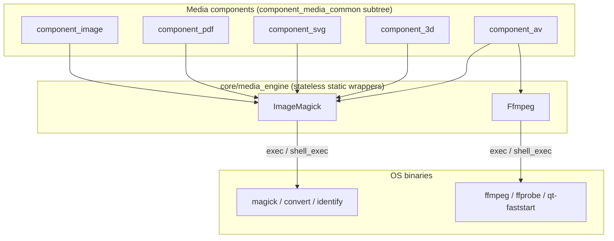

# media_engine

> The server-side **media processing layer** — two stateless PHP wrappers (`Ffmpeg` and `ImageMagick`) that shell out to the installed `ffmpeg`/`ffprobe` and ImageMagick binaries to transcode, resize, rasterize, probe and derive media files for the media components.

> See also: [component_image](../components/component_image.md) · [component_av](../components/component_av.md) · [component_pdf](../components/component_pdf.md) · [Media protection](../../config/media_protection.md)

This page is the **subsystem reference** for `core/media_engine/`. It documents
*what the engine does and how it is called*; for how each media component drives
it (upload flow, quality maps, storage layout, the datum shape) read the
component pages cross-linked above.

## Role

`media_engine` is **not** a Dédalo `dd_object`/`component` and it does **not**
`extend common`. It is a pair of `final` utility classes with only `public
static` methods and (almost) no instance state:

| class | file | binary it wraps | concern |
| --- | --- | --- | --- |
| **`Ffmpeg`** | `core/media_engine/class.Ffmpeg.php` | `ffmpeg`, `ffprobe`, `qt-faststart` | audio / video transcoding, quality versions, poster frames, fragments/clips, faststart header conform, stream/format probing |
| **`ImageMagick`** | `core/media_engine/class.ImageMagick.php` | `magick` / `convert`, `identify`, `pdfinfo` | raster conversion / resize, thumbnails, rotate, crop, colour-space / profile handling, image probing |

It sits **below the media components** and **above the operating-system
binaries**. The flow is one-directional: a media component (image / av / pdf /
3d / svg) resolves source and target file paths inside the media tree, then
calls a static engine method that builds a shell command, runs it with `exec()`
/ `shell_exec()`, logs via `debug_log()` and returns the raw command result (or
`false`/`null` on failure). The engine never touches the database, the ontology,
the session, or a record's `dato`; it only knows file paths and CLI flags.



**Prose description of the diagram above:** Five media components sit at the top.
`component_image`, `component_pdf`, `component_svg` and `component_3d` call into
the `ImageMagick` wrapper; `component_av` calls into the `Ffmpeg` wrapper (and
also borrows `ImageMagick::dd_thumb` to rasterize its poster frame). The two
wrapper classes form the `media_engine` layer; each shells out to its respective
OS binary via `exec()` / `shell_exec()`. Data flows downward only — components
decide *what file to make where*, the engine decides *which CLI command builds
it*, and the OS does the work.

!!! note "Naming"
    These two classes are the only ones in the project written in
    `PascalCase` (`Ffmpeg`, `ImageMagick`) rather than the usual
    `snake_case` model names — they are thin third-party-binary adapters, not
    ontology models. There is no `class.media_engine.php`; "media_engine" is the
    directory / subsystem, not a class.

## Responsibilities

- **Probe media** — read dimensions, aspect ratio, colour space, layer count,
  transparency, stream/format metadata, EXIF/creation date, and binary versions.
- **Derive image renditions** — convert and resize rasters, rasterize PDF pages
  and SVG, build fixed-size thumbnails, handle CMYK→sRGB profile conversion and
  alpha/meta-channel flattening.
- **Edit images in place** — rotate (default / expanded) and crop to a geometry.
- **Transcode A/V** — build per-quality `ffmpeg` commands from setting files,
  produce Dédalo's standard MP4, convert audio, and conform MP4 headers for
  progressive/streamed playback (faststart).
- **Generate previews & clips** — extract a poster frame at a timecode and cut a
  fragment between in/out timecodes (optionally watermarked).
- **Resolve installed tooling** — locate the binaries from config constants,
  report versions, and detect available encoders/libraries (`libx264`,
  `libfdk_aac`, …).
- **Ship its own assets** — bundle the ICC colour profiles and the `ffmpeg`
  quality setting files used by the conversion commands (see
  [Files & structure](#files--structure)).

The engine deliberately owns **none** of: file naming, where files live in the
media tree, which qualities a record should have, save/delete of records, or
access control. Those belong to the media components and to
[media protection](../../config/media_protection.md).

## Key concepts

### Settings-driven A/V qualities (`Ffmpeg`)

A "quality" is a target resolution/profile such as `1080`, `720`, `576`, `480`,
`404`, `240` or `audio` (`Ffmpeg::$ar_supported_quality_settings`). Each concrete
output is described by a **setting file** — a plain PHP file under
`lib/ffmpeg_settings/` that just `require`s into local variables
(`$vb`, `$s`, `$g`, `$vcodec`, `$acodec`, `$ar`, `$ab`, `$ac`, `$force`,
`$target_path`, …). `build_av_alternate_command()` loads the matching file and
assembles the `ffmpeg` command from those variables.

The setting name is composed from `quality` + media standard + aspect ratio by
`get_setting_name()`:

- **Media standard** — `get_media_standard()` reads the video stream's frame rate
  via `ffprobe`; `>= 29 fps ⇒ ntsc`, otherwise `pal`.
- **Aspect ratio** — `get_aspect_ratio()` maps the stream's pixel dimensions /
  `display_aspect_ratio` to one of `16x9`, `4x3`, `5x3`, `3x2`, `5x4` (default
  `16x9`), cached per source file.

So `404` + `pal` + `16x9` → setting `404_pal_16x9` → `lib/ffmpeg_settings/404_pal_16x9.php`.
`audio` is special-cased: it skips standard/aspect resolution and uses the
`audio` setting directly.

```php
// core/media_engine/lib/ffmpeg_settings/404_pal_16x9.php
$vb          = '1024k';     // video rate
$s           = '720x404';   // scale
$g           = 25;          // keyframe interval (GOP)
$vcodec      = 'libx264';
$ar          = 44100;       // audio sample rate
$ab          = '64k';       // audio rate
$ac          = '1';         // channels
$acodec      = 'libvo_aacenc';
$target_path = '404';
```

!!! warning "Setting files are `require`d, not parsed"
    `build_av_alternate_command()` does `require($setting_file_path)` and reads
    the resulting PHP variables. The setting directory therefore executes
    arbitrary PHP at conversion time — treat `lib/ffmpeg_settings/` as code, not
    data. Filenames `.`, `..`, `.DS_Store` and a directory named `acc` are
    skipped when listing (`get_ar_settings()`).

### Audio-codec autodetection (`Ffmpeg`)

`get_audio_codec()` runs `ffmpeg -buildconf` once and caches the result on the
static `$audio_codec`: it prefers `libfdk_aac`, falls back to `libvo_aacenc`
(only present on very old ffmpeg `<3`), and finally to the native `aac` encoder.
`check_lib('libx264')` is the same idea for an arbitrary `--enable-<name>` build
flag.

### Colour space, transparency and profiles (`ImageMagick`)

`ImageMagick::convert()` is the workhorse. It inspects the source before building
the command:

- `is_opaque()` — runs `identify -format "%[opaque]"` over all layers; if any
  layer reports non-opaque the image is treated as transparent. Can be forced via
  `MAGICK_CONFIG.is_opaque`.
- `has_meta_channel()` — for `tif`/`tiff`/`psd` only, parses `%[channels]` to
  detect a meta (alpha) channel that ImageMagick does not auto-apply; when found
  it copies `meta0 ⇒ alpha`.
- **CMYK → sRGB** — when `identify %[colorspace]` reports CMYK, it applies an
  input ICC profile (`profile_in`, default `Generic_CMYK_Profile.icc`) and an
  output profile (`profile_out`, default `sRGB_Profile.icc`) from
  `lib/color_profiles_icc/`, then strips the source profile.
- Opaque outputs (`jpg`/`jpeg`) get a white background and are flattened;
  transparent outputs get `-background none` and a cloned-alpha layer.
- `MAGICK_CONFIG.remove_layer_0` deletes the flat composite layer 0 for
  `tif`/`tiff` on OSes that need it (Rocky/RedHat/macOS).

### Thumbnails

Both engines emit a thumbnail bounded by `DEDALO_IMAGE_THUMB_WIDTH` /
`DEDALO_IMAGE_THUMB_HEIGHT`. `ImageMagick::dd_thumb()` produces the canonical
JPG thumbnail (used by image, pdf, 3d, and as the rasterizer for the AV poster
frame); `Ffmpeg::create_posterframe()` can also emit a thumbnail-sized poster
when `quality === 'thumbnail'`.

### Statelessness & caching

There is no `get_instance()` and no per-request lifecycle — every method is
static. The only mutable state is:

- `Ffmpeg::$ar_settings` — cached settings-file listing.
- `Ffmpeg::$audio_codec` — cached detected audio encoder.
- a local `static $media_streams_cache` in `get_media_streams()` and
  `static $cache_aspect_ratio` in `get_aspect_ratio()` — per-process memoization
  keyed by source file path.

!!! warning "Worker hygiene caveat"
    These static caches are **not** cleared in `common::clear()` (the engine is
    not a `common` subclass). They are keyed by absolute file path and by
    immutable install facts (codec, settings list), so under a persistent worker
    the only realistic staleness is a media file being replaced at the *same*
    path within one process — verify before relying on a fresh probe of a
    just-rewritten file.

## Files & structure

```text
core/media_engine/
├── class.Ffmpeg.php          # A/V wrapper (ffmpeg / ffprobe / qt-faststart)
├── class.ImageMagick.php     # image wrapper (magick / identify / pdfinfo)
├── lib/
│   ├── color_profiles_icc/   # ICC profiles for CMYK→sRGB conversion
│   │   ├── Generic_CMYK_Profile.icc
│   │   ├── sRGB_Profile.icc
│   │   ├── AdobeRGB1998.icc
│   │   └── … (Gray / Lab / RGB / XYZ)
│   └── ffmpeg_settings/       # per-quality ffmpeg variable files (require'd)
│       ├── 1080_pal_16x9.php  ├── 720_pal_16x9.php  ├── 404_pal_16x9.php
│       ├── 480_ntsc_4x3.php   ├── 240_pal.php       ├── audio.php  …
└── samples/                   # tiny fixtures for tests (image/audio/video/tif)
    ├── dummy_image.jpg, dummy_image_alpha.{png,tif}
    ├── dummy_audio.mp3, dummy_video.mp4
    └── data.json
```

### Configuration constants

All binary paths and engine defaults come from `config/` (`config.php` /
`config_core.php`), so the engine itself hard-codes nothing:

| constant | used by | meaning |
| --- | --- | --- |
| `DEDALO_AV_FFMPEG_PATH` | `Ffmpeg::get_ffmpeg_installed_path()` | `ffmpeg` binary path |
| `DEDALO_AV_FFPROBE_PATH` | `Ffmpeg::get_ffprove_installed_path()` | `ffprobe` binary path |
| `DEDALO_AV_FASTSTART_PATH` | `Ffmpeg::get_qt_faststart_installed_path()` | `qt-faststart` binary path |
| `DEDALO_AV_FFMPEG_SETTINGS` | `Ffmpeg::get_settings_path()` | settings dir (defaults to `lib/ffmpeg_settings`) |
| `DEDALO_AV_QUALITY_DEFAULT` | `convert_to_dedalo_av()` | default target height (`'404'`) |
| `DEDALO_AV_WATERMARK_FILE` | `build_fragment()` | watermark PNG for clip overlay |
| `MAGICK_PATH` | `ImageMagick::get_imagemagick_installed_path()` | dir holding `magick`/`convert`/`identify` |
| `MAGICK_CONFIG` | `ImageMagick::get_magick_config()` | `{remove_layer_0, is_opaque}` overrides |
| `COLOR_PROFILES_PATH` | `ImageMagick::convert()` | ICC profile dir (defaults to `lib/color_profiles_icc/`) |
| `DEDALO_IMAGE_THUMB_WIDTH` / `_HEIGHT` | both | thumbnail bounding box |

## Public API

All methods are `public static`. Grouped by concern. Names are verified against
the source; the engine has no private/protected methods of note.

### `Ffmpeg` — environment / tooling

| method | static? | purpose |
| --- | --- | --- |
| `get_ffmpeg_installed_path()` | ✓ | Return `DEDALO_AV_FFMPEG_PATH`. |
| `get_ffprove_installed_path()` | ✓ | Return `DEDALO_AV_FFPROBE_PATH` (note the spelling: *ffprove*). |
| `get_qt_faststart_installed_path()` | ✓ | Return `DEDALO_AV_FASTSTART_PATH`. |
| `get_settings_path()` | ✓ | Return the ffmpeg settings directory. |
| `get_version()` | ✓ | Parse `ffmpeg -version` → version string. |
| `get_ffprove_version()` | ✓ | Parse `ffprobe -version` → version string. |
| `check_lib($name)` | ✓ | Test whether `--enable-<name>` is in the ffmpeg build (e.g. `libx264`). |
| `get_audio_codec()` | ✓ | Detect the best AAC encoder (`libfdk_aac` → `libvo_aacenc` → `aac`); cached. |

### `Ffmpeg` — settings & resolution

| method | static? | purpose |
| --- | --- | --- |
| `get_ar_settings()` | ✓ | List the setting names under `lib/ffmpeg_settings/` (cached); skips `.`/`..`/`.DS_Store`/`acc`. |
| `get_setting_name($file_path, $quality)` | ✓ | Compose `<quality>[_<standard>][_<aspect>]` for the source file (e.g. `404_pal_16x9`). |
| `get_quality_from_setting($setting)` | ✓ | Inverse: extract the quality token (`1080`…`240`, `audio`) from a setting name, or `null`. |
| `get_media_standard($file_path)` | ✓ | Resolve `ntsc` (`>=29 fps`) vs `pal` from the video stream. |
| `get_aspect_ratio($source_file)` | ✓ | Map stream dimensions to `16x9`/`4x3`/`5x3`/`3x2`/`5x4` (default `16x9`); cached. |
| `find_video_stream($media_streams)` | ✓ | Pick the video stream from a streams array (by `codec_type`, then `h26*`/`width`), or `null`. |

### `Ffmpeg` — transcode / derive

| method | static? | purpose |
| --- | --- | --- |
| `build_av_alternate_command($options)` | ✓ | Load a setting file and **build (and write) the shell script** for one alternate quality; supports multi-pass video, DVD `VIDEO_TS` concat, and faststart. Returns `{result, msg, command, sh_file}`. |
| `convert_to_dedalo_av($source_file, $target_file, $async=true)` | ✓ | Transcode to the standard Dédalo MP4 (`yadif` deinterlace, scale to `DEDALO_AV_QUALITY_DEFAULT` height, `libx264` + faststart). Can run detached in the background. |
| `convert_audio($options)` | ✓ | Transcode audio to the default codec at 44100 Hz / 240k / stereo, then faststart. |
| `conform_header($source_file_path)` | ✓ | Re-mux (stream-copy) + `qt-faststart` so the moov atom is at the front; preserves the original as `*_untouched`. |
| `create_posterframe($options)` | ✓ | Extract one JPG frame at a timecode (sized by quality: `original`/`thumbnail`/default). Returns `false` for audio-only sources. |
| `build_fragment($options)` | ✓ | Cut a clip between in/out timecodes (stream-copy; optional watermark overlay re-encode). Returns `{result, msg}`. |

### `Ffmpeg` — probing

| method | static? | purpose |
| --- | --- | --- |
| `get_media_attributes($source_file)` | ✓ | `ffprobe -show_format` → format-level JSON object (duration, bitrate, tags…), or `null`. |
| `get_media_streams($source_file)` | ✓ | `ffprobe -show_streams` → per-stream JSON object; per-process cached, or `null`. |
| `get_date_time_original($file)` | ✓ | Read `format.tags.creation_time` → `dd_date`, or `null`. |

### `ImageMagick` — environment / tooling

| method | static? | purpose |
| --- | --- | --- |
| `get_magick_config()` | ✓ | Read `MAGICK_CONFIG` → `{remove_layer_0, is_opaque}` with defaults. |
| `get_imagemagick_installed_path()` | ✓ | Resolve `magick` (preferred) or `convert` under `MAGICK_PATH`; cached. |
| `get_imagemagick_identify_path()` | ✓ | Resolve `magick identify` or `identify`; cached. |
| `get_imagemagick_pdfinfo_path()` | ✓ | Return `MAGICK_PATH . 'pdfinfo'`. |
| `get_version()` | ✓ | Parse ImageMagick `-version` → version string. |

### `ImageMagick` — convert / derive / edit

| method | static? | purpose |
| --- | --- | --- |
| `convert($options)` | ✓ | The main converter: resize / format-change / rasterize (image, PDF page via `density`/`pdf_cropbox`, SVG) with colour-space, profile, alpha and flatten handling. Returns the command output or `false`. |
| `dd_thumb($source_file, $target_file)` | ✓ | Build the canonical bounded JPG thumbnail (`-thumbnail`, auto-orient, unsharp, q90). |
| `rotate($options)` | ✓ | Rotate by degrees, `default` or `expanded` canvas, with background / alpha control. Returns output or `null`. |
| `crop($options)` | ✓ | Crop to `{x, y, width, height}` geometry. Returns output or `null` (also fails on ImageMagick geometry warnings). |

### `ImageMagick` — probing

| method | static? | purpose |
| --- | --- | --- |
| `get_media_attributes($file_path)` | ✓ | ImageMagick `json:` dump → array of per-layer attribute objects (e.g. a multi-layer `.psd`), or `null`. |
| `get_dimensions($file_path)` | ✓ | Pixel `width`/`height` of layer 0, orientation-corrected. (Doc-comment alias: `get_image_dimensions`.) |
| `get_layers_file_info($source_file)` | ✓ | Layer count of a `tif`/`psd` (`identify %n`), or `1`. |
| `has_meta_channel($source_file)` | ✓ | Detect an alpha/meta channel in `tif`/`tiff`/`psd`. |
| `is_opaque($source_file)` | ✓ | Whether every layer is opaque (or forced via `MAGICK_CONFIG.is_opaque`). |
| `get_date_time_original($file)` | ✓ | EXIF `DateTimeOriginal` (falling back to `date:modify`) → `dd_date`, or `null`. |

!!! note "Two `get_media_attributes`, two shapes"
    Both classes expose `get_media_attributes()` but they are unrelated: the
    `Ffmpeg` one returns an `?object` (ffprobe `format`), the `ImageMagick` one
    returns an `?array` (one entry per image layer). Call the class that matches
    the media type.

## How it fits with the rest of Dédalo

Every media component extends `component_media_common` (see
[components index](../components/index.md) and
[base classes](../components/base_classes.md)). On upload and on regenerate, the
component resolves source/target paths inside the media tree and calls the
engine. The verified call map:

| component | calls into media_engine | for |
| --- | --- | --- |
| [`component_image`](../components/component_image.md) | `ImageMagick::convert`, `dd_thumb`, `rotate`, `crop`, `get_media_attributes`, `get_dimensions` | quality/format renditions, thumbnail, in-place rotate/crop, probing |
| [`component_av`](../components/component_av.md) | `Ffmpeg::get_setting_name`, `build_av_alternate_command`, `conform_header`, `create_posterframe`, `get_media_streams`, `get_media_attributes` + `ImageMagick::dd_thumb` | quality versions, header conform, poster frame → thumbnail, probing |
| [`component_pdf`](../components/component_pdf.md) | `ImageMagick::convert` | rasterize PDF pages to thumbnail / alternative versions (Ghostscript delegate, `pdf_cropbox`) |
| [`component_3d`](../components/component_3d.md) | `ImageMagick::dd_thumb` | thumbnail of an uploaded preview image |
| [`component_svg`](../components/component_svg.md) | `ImageMagick::convert` | raster thumbnail of normalized SVG |

Other call sites:

- [`tool_posterframe`](../../../tools/) and `dd_component_av_api` drive
  `Ffmpeg::create_posterframe` / fragment building from the UI and API.
- `tool_import_files` uses both engines during bulk media ingest.
- The `system_info` maintenance widget reports `Ffmpeg::get_version()`,
  `get_ffprove_version()`, `check_lib('libx264')` and
  `ImageMagick::get_version()` so admins can confirm the host has working
  binaries.

**Relationship to media protection.** The engine *produces* the per-quality
files (e.g. `…/404/0/rsc35_rsc167_1.mp4`) whose **filenames** are later parsed by
[media protection](../../config/media_protection.md) to derive the
`{section_tipo}_{section_id}` access key. The engine and the protection layer
never call each other, but the file-naming grammar is a shared contract:
the protection gate keys off the last two underscore tokens of the basename, and
the qualities the engine emits map to the public-quality folders the gate
allows. Renaming media outputs in the components is what couples the two.

## Examples

### Transcode an upload to the standard Dédalo MP4

```php
// component_av path: normalize an arbitrary upload into Dédalo's default quality.
$source = '/dedalo/media/av/original/0/oh25_oh1_3.mov';
$target = '/dedalo/media/av/404/0/oh25_oh1_3.mp4';

// async = false → wait for the transcode to finish before continuing
Ffmpeg::convert_to_dedalo_av($source, $target, false);
```

### Build one alternate quality from a setting file

```php
$source = '/dedalo/media/av/original/0/oh25_oh1_3.mp4';
$target = '/dedalo/media/av/720/0/oh25_oh1_3.mp4';

// resolve e.g. '720_pal_16x9' from the source's standard + aspect ratio
$setting_name = Ffmpeg::get_setting_name($source, '720');

$response = Ffmpeg::build_av_alternate_command((object)[
    'setting_name'     => $setting_name,
    'source_file_path' => $source,
    'target_file_path' => $target
]);
if ($response->result===true) {
    // $response->sh_file is the generated shell script; $response->command the ffmpeg line
}
```

### Extract a poster frame at 10 seconds

```php
$ok = Ffmpeg::create_posterframe((object)[
    'src_file'             => '/dedalo/media/av/404/0/oh25_oh1_3.mp4',
    'timecode'             => 10,            // seconds; formatted to 3 decimals
    'quality'              => 'posterframe', // 'original' | 'thumbnail' | default
    'posterframe_filepath' => '/dedalo/media/av/posterframe/0/oh25_oh1_3.jpg'
]);
// $ok === false for audio-only sources (no video stream)
```

### Convert a CMYK TIFF to a web-ready JPG

```php
$out = ImageMagick::convert((object)[
    'source_file' => '/dedalo/media/image/original/0/rsc29_rsc170_707.tif',
    'target_file' => '/dedalo/media/image/1280/0/rsc29_rsc170_707.jpg',
    'quality'     => 90,
    'resize'      => '1280x',     // width-bound; height auto
    // CMYK→sRGB profiles default to Generic_CMYK_Profile.icc / sRGB_Profile.icc
]);
if ($out===false) {
    // conversion failed (source missing, permissions, or ImageMagick ERROR)
}
```

### Build the canonical thumbnail

```php
ImageMagick::dd_thumb(
    '/dedalo/media/image/1280/0/rsc29_rsc170_707.jpg', // source
    '/dedalo/media/image/thumb/0/rsc29_rsc170_707.jpg' // target (dir auto-created)
);
```

### Probe a video

```php
$streams = Ffmpeg::get_media_streams($source); // ?object: {streams:[…]} (cached)
$video   = isset($streams->streams)
    ? Ffmpeg::find_video_stream($streams->streams) // ?object or null for audio-only
    : null;
$format  = Ffmpeg::get_media_attributes($source); // ?object: {format:{duration,…}}
```

## Related

- [component_image](../components/component_image.md) — raster images; quality
  versions, alternative formats, in-place rotate/crop via `ImageMagick`.
- [component_av](../components/component_av.md) — audio/video; quality versions,
  poster frames, fragments via `Ffmpeg`.
- [component_pdf](../components/component_pdf.md) — PDF/office rasterization via
  `ImageMagick`.
- [component_3d](../components/component_3d.md) · [component_svg](../components/component_svg.md)
  — thumbnail / raster derivation via `ImageMagick`.
- [Components index](../components/index.md) · [Base classes](../components/base_classes.md)
  — where the media components and `component_media_common` sit.
- [Media protection](../../config/media_protection.md) — web-server access
  control that keys off the filenames the engine produces.
