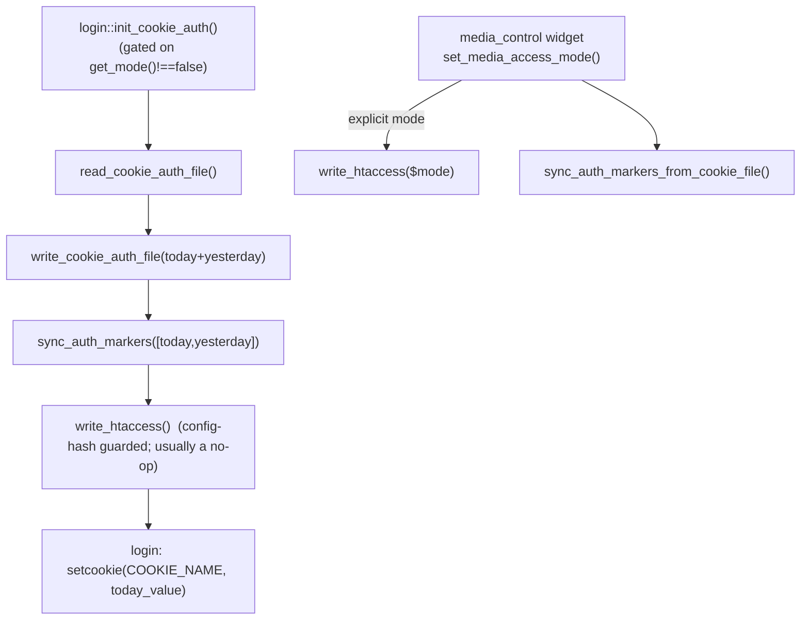

# media_protection

> See also: [Architecture overview](../architecture_overview.md) · [login](login.md) · [security](security.md)

The pure, static PHP helper that generates and maintains the
**web-server-enforced** media access control: the `.htaccess` gate, the
fixed-name auth cookie machinery and the zero-byte marker allowlist that lets
Apache/Nginx authorize multi-GB media with a single `stat()` — no PHP in the
file-serving path.

## Role

`media_protection` (in `core/media_protection/class.media_protection.php`) is a
**plain class** — it does **not** `extend common` and is not part of the
ontology object hierarchy. It is *pure and session-free*: every method is
`static`, it never reads `$_SESSION` or the DB, and it touches the filesystem
only through the well-known media paths. This is deliberate — it must be
callable from `login` at authentication time, from the `media_control`
maintenance widget, and from install/CLI scripts alike.

It owns the **work-system side** of one design goal:

> One media tree serves two audiences at the same URLs with zero duplication.
> Logged-in Dédalo users read everything (**rule A**); anonymous users read
> only **published** records, and only in the configured public quality folders
> (**rule B**). The authorization decision is made by the web server itself
> with one `stat()` on a zero-byte marker file — no application process is ever
> in the file-serving path.

Within that design, ownership is split across three actors that must stay in
lockstep:

| actor | owns | file |
| --- | --- | --- |
| **`media_protection`** *(this class)* | the generated `media/.htaccess`, the `auth/` markers (rule A), the cookie-auth persistence file, mode/quality resolution | `core/media_protection/class.media_protection.php` |
| **`login`** | calls this class at login: rotates the cookie, syncs `auth/` markers, writes `.htaccess`, sets the cookie | `core/login/class.login.php::init_cookie_auth()` |
| **Bun diffusion engine** | the `pub/` and `dbs/` markers (rule B), the matching key validation | `diffusion/api/v1/lib/media_index.ts` |

!!! warning "Three enforcement surfaces must stay in sync"
    The same filename grammar and quality alternation is implemented in three
    places: (a) the Apache template `media_protection::build_htaccess()`, (b) the
    Nginx sample block in `config/nginx.conf.sample`, and (c) the Bun key check
    `KEY_REGEX` in `diffusion/api/v1/lib/media_index.ts`. Touch one, review all
    three.

## Responsibilities

- **Mode resolution** — resolve the effective access mode (`false` / `'private'`
  / `'publication'`) from the config-constant priority chain.
- **Public-quality allowlist** — compute and *defensively filter* the quality
  folders anonymous users may read (`original`/`modified` master folders are
  always refused).
- **`.htaccess` generation** — build the full Apache gate as a pure string,
  embed a config-hash, and write it idempotently only when the configuration
  (or template version) changes.
- **Auth markers (rule A)** — mirror the valid cookie values (today + yesterday)
  as zero-byte marker files under `.publication/auth/`, rotating out stale ones.
- **Cookie-auth persistence** — read/write the rotated cookie-value store
  (`core/extras/media_protection/cookie/cookie_auth.php`) with the
  `<?php exit();` HTTP-disclosure guard line.
- **Status inspection** — report whether the generated `.htaccess` exists and is
  up to date (used by the maintenance widget).

It does **not**: serve files, validate requests at runtime, connect to a DB,
write the `pub/` or `dbs/` markers (that is the Bun engine's job), or set the
cookie (that is `login`'s job).

## Key concepts

### Access modes

`get_mode()` returns one of `false | 'private' | 'publication'` from a
fixed priority chain:

1. `DEDALO_MEDIA_ACCESS_MODE_CUSTOM` (machine-written to `../private/state.php`
   from the `media_control` widget; `null`/empty means *no override*).
2. `DEDALO_MEDIA_ACCESS_MODE` (from `../private/.env` / the catalog).
3. legacy `DEDALO_PROTECT_MEDIA_FILES === true` ⇒ `'private'`.

Anything that is not exactly `'private'` or `'publication'` resolves to `false`
(protection off). Modes map to rules:

| mode | rule A (logged users) | rule B (anonymous, published only) |
| --- | --- | --- |
| `false` | — media is world-readable | — |
| `'private'` | ✓ | — |
| `'publication'` | ✓ | ✓ (public qualities only) |

!!! note "Mode `'off'` is a generator-only value"
    `get_mode()` never returns `'off'`. `'off'` is an explicit argument to
    `build_htaccess()` / `write_htaccess()` meaning *write the hardening-only
    template* (SEC-088, no access gate), used when an administrator disables
    protection from the widget so stale deny rules do not linger.

### The marker store (`.publication/`)

Under `media_protection::get_base_path()` (= `<media>/.publication/`):

| dir | written by | meaning |
| --- | --- | --- |
| `auth/{cookie_value}` | **this class** (rule A) | a zero-byte file named with a valid 128-hex sha512 cookie value |
| `pub/{section_tipo}_{section_id}` | Bun engine (rule B) | a zero-byte file: the record is published in at least one target — the *only* thing the web server stats for rule B |
| `dbs/{db}/{table}/{key}` | Bun engine | per-target ground truth; `pub/` is the derived union |

The store itself is never web-served (Apache rule 0:
`RewriteRule (^|/)\.publication(/|$) - [R=404,L]`; Nginx
`location ^~ /media/.publication/ { deny all; return 404; }`).

### The fixed-name auth cookie

The cookie **name** is fixed: `media_protection::COOKIE_NAME = 'dedalo_media_auth'`.
Only the **value** rotates daily (a 128-char sha512 hex string), with *today and
yesterday* both valid. A fixed name is what lets the generated `.htaccess` stay
static and lets Nginx validate without config reloads. `sync_auth_markers()`
refuses any value not matching `^[a-f0-9]{128}$`.

### The filename → record grammar (LOAD-BEARING)

Rule B derives the publication key from the media file name. The greedy prefix
pins the **last two underscore tokens** so the component tipo can never be
mistaken for the section tipo:

```text
.+_([a-z0-9]+)_([0-9]+)(?:_lg-[a-zA-Z0-9-]{2,12})?\.[A-Za-z0-9]+$
        │           │
        │           └─ section_id
        └───────────── section_tipo
                       →  key = {section_tipo}_{section_id}  →  stat pub/{key}
```

This derives from how core names media files
(`component_common::get_identifier()` / `component_media_common::get_id()` /
`component_av::get_subtitles_path()`). Files that do not parse (e.g. images
renamed via `properties.image_id` / external_source) stay **login-only by
design** — do not loosen the regex to "fix" them.

### Fail-closed semantics

Every failure mode (missing marker, missing store, malformed cookie,
non-grammar filename, engine down) denies anonymous access. The default deny
answers **404, not 403**, so the existence of unpublished media is never
disclosed. Publication-side failures must never lock out editors: rule A markers
are PHP-owned and independent of the Bun engine.

## Instantiation & lifecycle

There is **no instantiation** — `media_protection` is never `new`-ed and has no
factory. All methods are `static`. Two test hooks allow redirecting the two
filesystem roots so tests never touch the real media tree:

```php
// public static ?string properties (same convention as
// diffusion_api_client::$endpoint_override)
media_protection::$media_path_override        = '/tmp/test_media';        // → get_media_path()
media_protection::$cookie_auth_file_override  = '/tmp/test_cookie.php';   // → get_cookie_auth_file_path()
```

The lifecycle is driven entirely by callers:



## Public API / Key methods

All methods are `static`. Grouped by concern.

### Mode & configuration

| method | static? | purpose |
| --- | --- | --- |
| `get_mode()` | ✓ | Resolve the effective mode: `DEDALO_MEDIA_ACCESS_MODE_CUSTOM` → `DEDALO_MEDIA_ACCESS_MODE` → legacy `DEDALO_PROTECT_MEDIA_FILES`. Returns `'private'` \| `'publication'` \| `false`. |
| `get_media_path()` | ✓ | The media root: `$media_path_override ?? DEDALO_MEDIA_PATH`. |
| `get_base_path()` | ✓ | The marker store base: `<media>/.publication`. |
| `get_public_qualities()` | ✓ | The allowlisted public quality folders from `DEDALO_MEDIA_PUBLIC_QUALITIES` (or defaults), with invalid entries and `original`/`modified` master folders refused. |
| `get_default_public_qualities()` | ✓ | The web-delivery qualities derived from install constants (`av/<default>`, `av/posterframe`, `av/subtitles`, `image/<default>`, `image/thumb`, `pdf/web`, `svg/web`, `3d/web`). |
| `get_addon_lines()` | ✓ | Raw extra `.htaccess` lines from the `MEDIA_HTACCESS_ADDONS` JSON-array config (replaces the legacy `INIT_COOKIE_AUTH_ADDONS`). |

### `.htaccess` generation

| method | static? | purpose |
| --- | --- | --- |
| `build_htaccess($mode, $public_qualities=[], $addon_lines=[])` | ✓ | **Pure** (no FS / no session): return the full `.htaccess` text for `'off'` \| `'private'` \| `'publication'`, including the SEC-088 script-execution hardening, rule 0 (deny `.publication`), rule A, rule B (publication only), addon lines, and the final 404 deny. |
| `get_config_hash($mode, $public_qualities=[], $addon_lines=[])` | ✓ | Stable sha256 over `{version, mode, qualities, addons, media}` — embedded as a `# config-hash:` comment so the file is only rewritten on real change. |
| `write_htaccess($mode_override=null)` | ✓ | Write `<media>/.htaccess` when missing or when the embedded hash differs. `$mode_override` (`'off'`/`'private'`/`'publication'`) bypasses `get_mode()` for the widget's apply-immediately path; `null` resolves from `get_mode()` and a `false` result leaves any existing file alone. Returns `true` when up to date. |
| `get_htaccess_status()` | ✓ | Inspect the generated file: `{exists:bool, up_to_date:bool|null, path:string}`. `up_to_date` is `null` when protection is disabled. |

### Auth markers (rule A)

| method | static? | purpose |
| --- | --- | --- |
| `sync_auth_markers(array $valid_values)` | ✓ | Create a zero-byte marker per valid sha512-hex value under `auth/` (dir mode `0750`), and **rotate out** any marker whose name is no longer in the valid set. Refuses non-`[a-f0-9]{128}` values. |
| `sync_auth_markers_from_cookie_file()` | ✓ | Re-create the `auth/` markers from the persisted cookie file (today + yesterday). No-op `true` when no cookie file exists. Used when re-enabling from the widget so existing cookie holders keep access without re-login. |

### Cookie-auth persistence

| method | static? | purpose |
| --- | --- | --- |
| `get_cookie_auth_file_path()` | ✓ | `$cookie_auth_file_override ?? DEDALO_EXTRAS_PATH.'/media_protection/cookie/cookie_auth.php'`. |
| `write_cookie_auth_file(object $data)` | ✓ | Persist the rotated cookie data with the `<?php exit(); ?>` guard line, creating the parent dir (mode `0750`) when missing. |
| `read_cookie_auth_file()` | ✓ | Parse the persistence file, stripping the `<?php exit();` guard line (legacy raw-JSON files are tolerated). Returns the decoded object or `null` when missing/corrupt. Shared by `login::init_cookie_auth()` and the widget. |

### Constants & test hooks

| name | kind | purpose |
| --- | --- | --- |
| `COOKIE_NAME` | `const string` | `'dedalo_media_auth'` — the fixed auth cookie name. |
| `TEMPLATE_VERSION` | `const int` | Bumped to force `.htaccess` regeneration on existing installs when the template changes (folded into `get_config_hash()`). |
| `$media_path_override` | `static ?string` | Test hook overriding `DEDALO_MEDIA_PATH`. |
| `$cookie_auth_file_override` | `static ?string` | Test hook overriding the cookie-auth file location. |

## How it fits with the rest of Dédalo

- **[login](login.md)** — `login::init_cookie_auth()` (private; gated on
  `media_protection::get_mode()!==false`) is the only production caller on the
  authentication path. It recycles/rotates the cookie file, calls
  `sync_auth_markers()` and `write_htaccess()` on **every** login (self-healing
  after a redeploy or a cleared media dir), then `setcookie(COOKIE_NAME, …)`.
  Logout clears the same fixed-name cookie when `get_mode()!==false`.
- **Diffusion engine** (`diffusion/api/v1/lib/media_index.ts`) — owns the `pub/`
  and `dbs/` markers (rule B). It validates keys with the same grammar
  (`KEY_REGEX`), recomputes `pub/` as a pure union from `dbs/` state (never
  refcounts), and runs marker hooks **after** a successful SQL commit so markers
  mirror committed DB state and never lead it. Drift heals via boot
  `reconcile()` and full `rebuild()`. See the `dedalo-diffusion` skill family for
  the wire contract that carries `section_tipo`.
- **`media_control` widget** (`core/area_maintenance/widgets/media_control/`) —
  the maintenance UI. `get_value()` reports config + status (including a
  read-only engine probe via `diffusion_api_client::call` with the
  `media_index_status` action). `set_media_access_mode()` (root-gated through
  `area_maintenance::set_media_access_mode()`, which writes
  `DEDALO_MEDIA_ACCESS_MODE_CUSTOM` to `config_core.php`) then applies
  immediately: `write_htaccess($explicit_mode)` (constants are stale in-request,
  so the mode is passed explicitly) plus `sync_auth_markers_from_cookie_file()`.
  `rebuild_media_index()` delegates to `dd_diffusion_api`.
- **Web servers** — the actual enforcement. Apache reads the generated
  `media/.htaccess`; Nginx uses the static block in `config/nginx.conf.sample`.
  The Nginx rule-A catch-all is a **plain** `location /media/` prefix (no `^~`),
  so the rule-B regex location is still reachable — a documented pitfall.
- **CLI** — `diffusion/migration/helpers/rebuild_media_index.php` triggers a full
  marker rebuild (PHP resolves targets via
  `dd_diffusion_api::resolve_media_index_targets()`; the Bun engine diff-syncs).

## Examples

### Resolve the mode and the public qualities

```php
$mode = media_protection::get_mode();
// false | 'private' | 'publication'

if ($mode === 'publication') {
    $qualities = media_protection::get_public_qualities();
    // e.g. ['av/404','av/posterframe','av/subtitles','image/1.5MB','image/thumb','pdf/web','svg/web','3d/web']
    // 'original'/'modified' are always filtered out, even if configured
}
```

### Generate the gate text (pure, unit-testable)

```php
$mode      = 'publication';
$qualities = media_protection::get_public_qualities();
$addons    = media_protection::get_addon_lines();

$htaccess_text = media_protection::build_htaccess($mode, $qualities, $addons);
// contains: SEC-088 hardening, rule 0 (.publication deny),
// rule A (dedalo_media_auth cookie → auth/ marker),
// rule B (public-quality regex → pub/$1_$2 marker), final 404 deny
```

### Idempotent write at login (the production path)

```php
// inside login::init_cookie_auth(), gated on get_mode()!==false
media_protection::write_cookie_auth_file($data);                 // today + yesterday values
media_protection::sync_auth_markers([                            // rule A markers
    $data->{$ktoday}->cookie_value,
    $data->{$kyesterday}->cookie_value
]);
media_protection::write_htaccess();                              // no-op unless config-hash changed
// ... login then setcookie(media_protection::COOKIE_NAME, $today_value)
```

!!! note "Apply-immediately needs the explicit mode"
    The `media_control` widget changes a constant in `config_core.php`, but PHP
    constants are immutable within the running request. So the widget calls
    `write_htaccess($explicit_mode)` with the freshly chosen mode rather than
    letting `write_htaccess(null)` re-read the now-stale `get_mode()`.

## Related

- [login](login.md) — the authentication path that drives the cookie + markers.
- [security](security.md) — the permission system (a different, in-app layer;
  media protection is the *web-server* layer in front of the file tree).
- [Architecture overview](../architecture_overview.md) — the work vs diffusion
  systems this gate bridges.
- `core/media_protection/class.media_protection.php` — the source.
- `diffusion/api/v1/lib/media_index.ts` — the Bun owner of rule-B markers.
- `config/nginx.conf.sample` — the Nginx mirror of the generated `.htaccess`.

