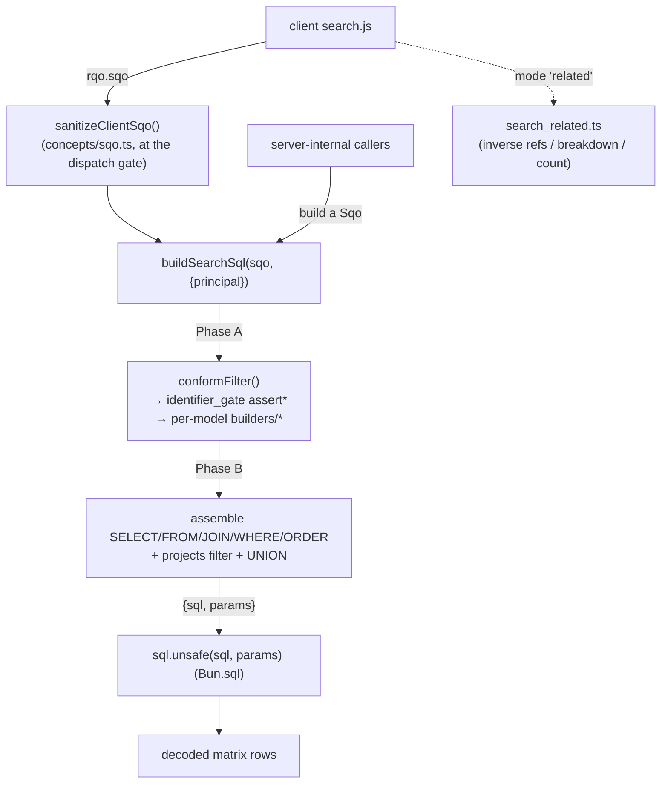

# search

> See also: [SQO](../sqo.md) (the query DTO contract) · [RQO](../rqo.md) (the request that wraps an SQO) · [Sections](../sections/index.md) · [common](common.md)

The server query engine compiles a **Search Query Object (SQO)** into a single prepared PostgreSQL statement over the JSONB `matrix_*` tables, runs it, and returns the matched rows.

This page is the **subsystem reference** for the `search` engine. For *what an
SQO is* — its fields, the Mango-style filter grammar and the two-phase `parsed`
lifecycle — read [SQO](../sqo.md) first; this document is about the engine that
**consumes** an SQO and emits SQL, and does not repeat the SQO field contract at
length.

## Role

The search engine lives in **`src/core/search/`**. It is the TypeScript runtime
that turns a `Sqo` into prepared SQL and executes it via `Bun.sql`
(`src/core/db/postgres.ts`). It is the single query builder in Dédalo: every
read that filters, counts or paginates records — list views, portals,
autocompletes, the thesaurus tree, diffusion exports, server-internal lookups —
funnels through it.

The engine is **a set of pure functions across a handful of modules** — no
instance, no shared caches, nothing to reset. The compile step is idempotent and
the process holds no cross-request search state:

| module | responsibility |
| --- | --- |
| `conform.ts` | **Phase A** — walk the SQO filter tree, gate every identifier, resolve each leaf's model/column, dispatch to the per-model fragment builder. |
| `builders/` | the per-component SQL fragment builders (`builder_string`, `builder_number`, `builder_iri`, `builder_date`, `builder_section_id`, `builder_relation`). |
| `identifier_gate.ts` | the injection chokepoint — `assertValidTipo` / `assertValidLang` / `assertValidDataColumn` / `assertValidTipoOrColumn`. |
| `sql_assembler.ts` | **Phase B** — assemble SELECT / FROM / JOIN / WHERE / ORDER / LIMIT into the final `{sql, params}`; multi-section UNION; per-record projects ACL. |
| `params.ts` | `ParamsCollector` — the positional `$1..$n` prepared-param list. |
| `search_related.ts` | the inverse-reference / relation-breakdown engine over the flat-GIN `data_relations_flat_*` functions. |
| `search_store.ts` | presence gate for the `matrix_string_search` per-value store backing the string contains pre-filter (see [The string-search store](#the-string-search-store-matrix_string_search)). |
| `count.ts` | `countSectionRecords()` — the `full_count` variant for one section. |

It sits at the boundary between the request layer and the database:

| layer | responsibility |
| --- | --- |
| **Client JS** (`client/dedalo/core/search/js/search.js`, copied as-is) | builds the SQO (filter groups, `q_operator`, limit/offset) for the search UI. |
| **API gate** (`dispatch.ts`) | `sanitizeClientSqo()` (`src/core/concepts/sqo.ts`) — the **only** place an untrusted, client-authored SQO is sanitized before it reaches the engine. |
| **the engine** *(`src/core/search/`)* | compiles the SQO → one prepared SQL string + a positional `$params` list. |
| **`Bun.sql` / `postgres.ts`** | `sql.unsafe(sqlString, params)` binds `$1..$n` and returns the rows; JSONB columns arrive decoded by the one JSON codec. |



!!! warning "Two entry doors, one gate"
    Client SQOs are sanitized by `sanitizeClientSqo()` at the API edge (inside
    the `dd_core_api` handlers in `dispatch.ts`). **Server-internal callers
    build a `Sqo` object and call `buildSearchSql()` directly, bypassing that
    gate** — so they keep full access to server-only fields
    (`skip_projects_filter`, `limit:'all'`, …). The in-engine identifier gate
    (`identifier_gate.ts`, below) is what protects *both* paths against SQL
    injection through un-parameterizable identifiers.

## Responsibilities

- **Mode dispatch** — there is no single `get_instance()` factory. The default
  (`edit` / `list`) path compiles through `buildSearchSql()`; Time Machine
  (`mode:'tm'`) and relation breakdown (`mode:'related'`) are selected one layer
  up, by the read strategy `pickReadSource()` (`src/core/section/read_source.ts`)
  and by `search_related.ts` respectively.
- **SQO conform** — `conformFilter()` walks the filter tree and asks each
  component model's builder to translate its filter leaf into a SQL fragment.
- **Injection chokepoint** — `identifier_gate.ts` validates every
  `section_tipo` / `component_tipo` path step and the `lang` selector *before*
  any component dispatch, because those identifiers are string-interpolated into
  JSONB keys / jsonpath and cannot be parameterized.
- **SQL assembly** — `buildSearchSql()` builds SELECT / FROM / JOIN / WHERE /
  ORDER / LIMIT in a load-bearing order, using the window-subquery pattern.
- **Access-control filter** — `buildProjectsFilter()` (per-user project scoping)
  reaches the WHERE clause for non-global-admins with a `principal`.
- **Prepared params** — `ParamsCollector.getPlaceholder()` maintains the
  positional `$1..$n` list that `sql.unsafe()` binds; every literal value becomes
  a `$n` placeholder.
- **Multi-section UNION** — `buildSearchSql()` emits one `UNION ALL` branch per
  matrix table when an SQO spans more than one section.
- **Counting** — `full_count` builds the `count(DISTINCT …)` variant;
  `countSectionRecords()` and `countInverseReferences()` wrap it for their
  callers.

!!! warning "The compile functions must stay stateless"
    One long-lived process serves every user. The compile functions hold **no
    per-user cache** and no shared state, so there is nothing to reset between
    requests and nothing that can bleed from one user's search into another's.

    Add a module-level cache here keyed on anything user-specific and you
    reintroduce that hazard. Request-scoped context belongs in
    `AsyncLocalStorage`, not in a module variable.

## Key concepts

### The SQO → SQL flow (one pass, end to end)

```text
buildSearchSql(sqo, { principal })          entry (sql_assembler.ts)
  → conformFilter(sqo.filter, alias, table) Phase A (conform.ts)
      → identifier gate: assertValidTipo / assertValidTipoOrColumn / assertValidLang
      → ontology resolve: getModelByTipo, getColumnNameByModel, getTranslatableByTipo
      → per-leaf builder: builders/builder_string|number|iri|date|section_id
                           relation family → relations/registry getRelationSearchFragmentBuilder
      → returns a ConformedFilter tree whose leaves carry BuilderResults
  → assemble (Phase B):
      FROM → SELECT → ORDER (may add sort-select aliases) → WHERE
      + buildProjectsFilter() for non-admins
      + filter_by_locators / multi-section UNION ALL
      window-subquery wrapper when a custom ORDER (or join) is present
  → { sql, params }
  → sql.unsafe(sql, params)                  Bun.sql, $1..$n bound
  → decoded matrix rows
```

!!! note "Execution order is load-bearing"
    `buildSearchSql()` builds **FROM → SELECT → ORDER → WHERE**, documented in
    its own header comment. ORDER runs before WHERE because component-based
    ordering may add join fragments (`buildJoinChain()`) and sort-select aliases,
    and those need the base FROM established and their aliases available. Do not
    reorder.

### The working arrays

`buildSearchSql()` keeps **function-local arrays** — no shared state — that are
joined into the final query:

```ts
const mainWhere: string[]                 // section_tipo = / IN (...)
const whereParts: string[]                // filter, projects filter, filter_by_locators
const select: string[]                    // SELECT columns (DISTINCT ON unless removeDistinct)
const selectExtra: string[]               // component sort-select aliases
const orderClauses: string[]              // custom (sqo.order) ordering
const orderDefault = [`${alias}.section_id ASC`] // deterministic tie-break
const joinFragments: Map<string,string>   // LEFT JOIN LATERAL chains, dedup by alias
```

### Identity / table resolution

`getSectionTipos(sqo)` normalizes `sqo.section_tipo` to an array. The **first**
entry is the main section tipo; its alias is `trimTipo()` (e.g. `rsc197` →
`rs197`) for a single section, or the literal **`mix`** when more than one
section is queried. The matrix table is resolved from the first reliable section
tipo via `getMatrixTableFromTipo()` (skipping tipos with no resolvable table).
When more than one section is queried, `removeDistinct` is forced `true`
(cross-section search wants duplicate `section_id`s across sections).

Time Machine reads override the source entirely (`pickReadSource('tm')` →
`read_tm.ts`, which queries the flat `matrix_time_machine` table); they do not go
through `buildSearchSql()`.

### The identifier gate — the injection chokepoint

`identifier_gate.ts` is the **central** security gate; it covers *all* component
search builders at one point. Builders string-interpolate `component_tipo` (as a
JSONB key / jsonpath member step) and `lang` (into jsonpath / string literals) —
neither can be parameterized (jsonpath `vars` can't parameterize a member
accessor). So before any builder dispatch, `conformLeaf()` (in `conform.ts`)
calls the gate on every path step:

- `assertValidTipo()` — `isValidTipo` (`^[a-z]+[0-9]+$`, `src/core/concepts/ontology.ts`)
  for each `section_tipo`,
- `assertValidTipoOrColumn()` — a valid tipo **or** a legitimate data column
  (`section_id`, `id`, `tipo`, `lang`, `type`, `section_tipo`, the matrix jsonb
  columns) for each `component_tipo`,
- `assertValidLang()` — `isValidLang` (`^(lg-[a-z0-9_]+|all)$`) for the optional
  `lang`,

and every assert **throws** on a malformed value (allowlist only — invalid input
is rejected, never repaired). A new per-component builder that interpolates a new
SQO field into SQL must gate it here, not in the leaf. The multi-hop join builder
(`buildJoinChain()`) re-asserts each hop's tipos for the same reason.

### Prepared params model

`ParamsCollector` (`params.ts`) returns `$1..$n` from `getPlaceholder()` and
stores the values as a **0-indexed positional list** (dedup by **strict**
equality, so `1`/`'1'`/`true` never collapse onto the same slot). Component
builders build sentences with `_Q1_`, `_Q2_`… named token placeholders plus a
token→value map; `ParamsCollector.substitute()` swaps each token for a real `$n`.
`buildSearchSql()` returns `params.toArray()`, which `sql.unsafe()` binds
directly. Everything that *can* be parameterized is — the only verbatim
interpolations are the gate-validated identifiers above.

### Access-control filter (reaches WHERE)

`buildProjectsFilter()` (in `sql_assembler.ts`) — for a non-global-admin
`principal`, restricts results to records whose `component_filter` relation
references one of the user's projects (`getUserProjects()`). A section that is
not project-gated (`getComponentFilterTipo()` returns null) contributes nothing;
a gated section queried by a user with **no** projects yields an impossible
clause (empty result — fail closed). Project ids ride as bound params.

!!! warning "Passing no principal skips the record ACL"
    Global admins and internal searches (no principal) skip the projects filter.
    Trusted server code must therefore pass a `principal` **whenever it intends
    user-scoped results** — omitting it is not a shortcut, it is a full-visibility
    search.

### The string-search store (`matrix_string_search`)

Accent/case-insensitive **contains** searches on string components compile to a
per-row predicate (`EXISTS(jsonb_path_query(string, …) WHERE f_unaccent(value)
~* f_unaccent(q))`) that no JSONB index can serve — on a 21k-record section that
is ~1.4 s per search, for admins and regular users alike. The engine therefore
maintains a derived **per-value search store**:

```text
matrix_string_search (
    section_tipo    varchar(64),   -- the record's section
    section_id      integer,       -- the record
    component_tipo  varchar(64),   -- WHICH component the value belongs to
    string          text           -- lower(f_unaccent(value)) — one row per value
)
```

The `string` column is named after its **source**: only components stored in the
matrix `string` column are included (dates, numbers, relations etc. have their
own typed columns and their own search shapes). One composite
[`btree_gin`](db.md#schema-assets-db_assetsts) index —
`gin (component_tipo, string gin_trgm_ops)` — resolves the component scoping
**and** the trigram containment in a single index scan, so a component-scoped
contains is served in ~1 ms with no reliance on the planner combining separate
indexes.

`builder_string` prepends the store lookup as a **pre-filter** in front of the
exact predicate (which always remains and decides membership — results are
byte-identical with or without the store):

```sql
mix.section_id = ANY (ARRAY(
    SELECT sv.section_id FROM matrix_string_search sv
    WHERE sv.component_tipo = $t
      AND sv.string LIKE '%' || lower(f_unaccent($q)) || '%'))
AND ( …the exact jsonb predicate, unchanged… )
```

The shape is deliberate, and each choice is load-bearing:

| choice | why |
| --- | --- |
| uncorrelated `ANY(ARRAY(…))`, not a correlated `EXISTS` | plans as a one-shot InitPlan so the main table is **entered by `section_id`**; the correlated form let jsonb selectivity misestimates invert the plan back to the per-row scan. |
| no `section_tipo` condition inside the subquery | the multi-section UNION replicates the WHERE verbatim into every branch; a section pin would fail-close other branches — cross-section ids only **widen** the superset, the outer `section_tipo` pin and the exact predicate still decide. |
| emitted for **positive** shapes only (contains / begins / ends / `==` / `=` / quoted literal) with a **regex-plain** `q` | the exact predicate is regex-semantic, the store `LIKE` is literal-substring — they only agree on plain text; `%`/`_` are escaped. Negations (`!*`, `!=`, `-`, `!!`) and bare `*` never carry it. |
| emitted for **non-joined leaves** only (path length 1) | on a hop-joined alias the join already bounds the per-row work, and the pre-filter's tiny cardinality estimate flips the join order into an unindexed filter join (measured 4× slower). `conform.ts` gates on the leaf's join chain. |
| gated on the table's **sync trigger presence** (`search_store.ts`, cached; the maintenance rebuild actions clear the cache) | against an unmaintained table the empty store would wrongly *exclude* rows — the gate is correctness, not just performance. Uncovered tables (e.g. `matrix_time_machine`) keep the classic SQL byte-identically. |

The store is **derived data** kept in sync by `AFTER INSERT OR DELETE OR UPDATE
OF string` row triggers (`{table}_string_search_sync` → the plpgsql
`matrix_string_search_sync()`, delete-then-reinsert per record) on every
string-searchable matrix table — engine writes, scripts and manual SQL all stay
consistent, in the same transaction as the write. Enabling it on an instance (or
adding a table to it) is: declare/rebuild the assets (the `database_info`
maintenance widget), then **backfill** that table's rows — the `INSERT … SELECT`
lives in the store's `ar_table` entry in `db_pg_definitions.json`. Until both
steps ran, the presence gate keeps searches on the classic scan.

!!! note "Why a side table and not an in-record column"
    Trigram (`pg_trgm`) indexes plain text only, so an in-record column (the
    `relation_search` pattern) forces one concatenated text per record — and
    lossy GIN-trigram rechecks then re-read that whole (often TOASTed) text per
    candidate row, which **measured slower than the un-indexed scan**. One row
    per value is what makes the recheck a short string and the component scoping
    index-resolvable; `relation_search` works as a column because its `@>`
    semantics are exact-match, which jsonb GIN serves per-element.

### Multi-section UNION

`buildSearchSql()` builds one `UNION ALL` branch per distinct matrix table. Each
branch keeps the same main alias (`mix`); only the main `FROM <table> AS mix` is
swapped via an **exact-substring** `String.replace` (never a regex — a regex over
the generated SQL would corrupt correlated subqueries). The outer `ORDER BY`
strips the `mix.` qualifier because UNION result columns aren't alias-qualified
(`stripAliasPrefix()`).

## Pipeline entry & lifecycle

There is **no** `search` class and no `get_instance()`. The single compile entry
is a pure async function:

```ts
export async function buildSearchSql(
    sqo: Sqo,
    options: SearchOptions = {}   // { principal? } — non-admin ⇒ projects filter applies
): Promise<{ sql: string; params: unknown[] }>
```

Mode selection happens above the engine:

```ts
// mode → path:
//   'tm'                      → pickReadSource('tm') → read_tm.ts (matrix_time_machine)
//   'related'                 → search_related.ts (findInverseReferences / countInverseReferences)
//   'edit' | 'list' | default → buildSearchSql() → matrix_* tables
```

`buildSearchSql()` **throws** when the SQO carries no resolvable section tipo (no
matrix table), and when it hits uncovered scope (multi-hop ORDER on unported
shapes, non-admin multi-section search over a project-gated section, group_by,
children_recursive) — never a silent narrowing.

### Typical usage

```ts
import { sanitizeClientSqo, type Sqo } from '../concepts/sqo.ts';
import { buildSearchSql } from '../search/sql_assembler.ts';
import { sql } from '../db/postgres.ts';

// 1. build a Sqo (server-internal — trusted; a client Sqo would be
//    sanitized with sanitizeClientSqo() at the API gate instead)
const sqo: Sqo = sanitizeClientSqo({
    section_tipo: ['rsc197'], // People
    mode: 'list',
    limit: 50,
    offset: 0,
    // filter: { ...Mango-style filter... }
});

// 2. compile to prepared SQL + params (projects filter applies when principal is a non-admin)
const { sql: query, params } = await buildSearchSql(sqo, { principal });

// 3a. fetch records
const rows = await sql.unsafe(query, params as (string | number | null)[]);
for (const row of rows) {
    // row.section_id, row.section_tipo, decoded JSON columns ...
}

// 3b. or count (full_count variant)
const total = await countSectionRecords(principal, 'rsc197'); // number | null
```

!!! note "Untrusted vs trusted SQOs"
    A client SQO arriving over the API is run through `sanitizeClientSqo()` first
    (strips server-only fields, forces `parsed=false`, clamps `limit` to the
    client ceiling `CLIENT_MAX_LIMIT`, coerces `offset`/`total` to ints).
    Server code that builds its own `Sqo` is trusted and skips that step. Both
    are protected by `identifier_gate.ts`.

## Public API

Grouped by concern. All are plain exported functions (no class methods) unless
noted.

### Compile & execute (`sql_assembler.ts`)

| symbol | purpose |
| --- | --- |
| `buildSearchSql(sqo, options)` | The compile entry: conform the SQO, assemble FROM→SELECT→ORDER→WHERE, add the projects filter / `filter_by_locators` / multi-section UNION, return `{sql, params}`. |
| `trimTipo(tipo)` | Contract a tipo for compact SQL aliases (`rsc453` → `rs453`); `null` on malformed input. |
| `renderConformedFilter(node, params)` | Render one conformed filter tree to a WHERE fragment against a caller-owned `ParamsCollector` (reused by the TM read, which owns its own query shell). |
| `SearchOptions` | `{ principal? }` — scopes the projects ACL. |

### Conform / dispatch to builders (`conform.ts`)

| symbol | purpose |
| --- | --- |
| `conformFilter(filter, alias, table)` | Recursively conform a filter node: `$and`/`$or`/`$not`/`$nand`/`$nor` groups + leaves; returns a `ConformedFilter` tree. |
| `buildJoinChain(path, mainAlias)` | Build the `LEFT JOIN LATERAL jsonb_array_elements(...)` + matrix-table join chain for a multi-hop path; gates every hop's tipos. Used by filter leaves **and** ORDER paths. |
| `ConformedFilter` / `JoinFragment` | The conform-tree types the assembler consumes. |

### Identifier allowlists (`identifier_gate.ts`)

| symbol | purpose |
| --- | --- |
| `assertValidTipo(v, where)` | Throw unless `^[a-z]+[0-9]+$` — gate for tipos interpolated into JSONB keys. |
| `assertValidTipoOrColumn(v, where)` | Throw unless a valid tipo **or** a bare data column — `path.component_tipo` accepts both, e.g. ordering by `section_id`. |
| `assertValidLang(v, where)` | Throw unless `^(lg-[a-z0-9_]+|all)$`. |
| `assertValidDataColumn(v, where)` / `isValidDataColumn(v)` | The allowlist of real matrix columns, plus the structural and Time Machine columns. |
| `VALID_DATA_COLUMNS` | The exported column allowlist. |

### Per-component builders (`builders/`)

| symbol | purpose |
| --- | --- |
| `buildStringFragment` | `component_input_text` / `component_text_area` / `component_email` — LIKE/`=`/accent-insensitive, `q_split` fan-out, the `!!` duplicated-operator self-join. |
| `buildNumberFragment` | `component_number` — numeric comparisons. |
| `buildIriFragment` | `component_iri`. |
| `buildDateFragment` | `component_date` — jsonpath time-range comparisons. |
| `buildSectionIdFragment` | `component_section_id` — structural `section_id` predicates (incl. between). |
| `getRelationSearchFragmentBuilder(model)` | The relation family's search face (`src/core/relations/registry.ts`): the shared JSONB-containment builder; unported relation pipelines throw loudly. |
| `BuilderContext` / `BuilderResult` / `fragment()` / `compound()` | The builder contract (`builders/types.ts`): a leaf resolves to `false`, a `Fragment` (sentence + `_Qn_` tokens), or a `CompoundFragment` (`$and`/`$or`). |

### Params (`params.ts`)

| symbol | purpose |
| --- | --- |
| `ParamsCollector` | `getPlaceholder(value)` → `$n` (strict dedup); `substitute(sentence, tokenValues)` swaps `_Qn_` tokens; `toArray()` returns the bound values in `$1`-first order. |

### search_related (relation breakdown, `search_related.ts`)

| symbol | purpose |
| --- | --- |
| `findInverseReferences(...)` | Which records point at a locator — the inverse-relations engine over the flat-GIN `data_relations_flat_*` stored functions. |
| `findInverseReferenceLocators(...)` | Exact inverse-locator recovery (the `breakdown` case). |
| `countInverseReferences(locators, options)` | The relation_list paginator total, with per-`group_by` breakdowns. |
| `getRelationTables()` / `clearRelatedTablesCache()` | The ontology-enumerated relation-table set (module-level memo). |

### Count (`count.ts`)

| symbol | purpose |
| --- | --- |
| `countSectionRecords(principal, sectionTipo)` | Read-gated `full_count` for one section; `null` when not countable/accessible so callers can tell "zero" from "no access". |

## How it fits with the rest of Dédalo

- **[SQO](../sqo.md)** — the query DTO this engine consumes. `search.md`
  documents the *engine*; `sqo.md` documents the *contract* (filter grammar,
  field cheat-sheet, the `parsed` two-phase lifecycle). They are companions.
- **[RQO](../rqo.md)** — the request envelope that carries the SQO from the
  client; `sanitizeClientSqo()` runs while the `dd_core_api` handlers in
  `dispatch.ts` unpack the RQO.
- **[Sections](../sections/index.md) / [section](../sections/section.md)** —
  list views and the per-section navigation build SQOs and call this engine; the
  read strategy (`section/read_source.ts`) chooses the matrix vs Time Machine
  source.
- **[Components](../components/index.md)** — each component model's filter leaf is
  turned into `{sentence, tokenValues}` by a builder under
  `src/core/search/builders/`, or, for the relation family, by the relations
  registry.
- **[The engine layer](common.md)** — the search engine depends on the ontology
  resolver (`getMatrixTableFromTipo`, `getModelByTipo`, …) for table and model
  resolution. It holds no cache of its own.
- **Time Machine** — the `matrix_time_machine` table (single `data` column
  instead of tipo-keyed JSONB; default `timestamp DESC`) is served by
  `read_tm.ts`, selected through `pickReadSource('tm')`, not by
  `buildSearchSql()`.

## Examples

### A simple filtered, paginated list

```ts
const sqo = sanitizeClientSqo({
    section_tipo: ['oh1'], // Oral History
    mode: 'list',
    limit: 20,
    offset: 0,
});

const { sql: query, params } = await buildSearchSql(sqo, { principal });
const rows = await sql.unsafe(query, params as (string | number | null)[]);
for (const row of rows) {
    // process each matched record
}
```

### Inverse relations (which records point at me)

```ts
// resolve the count of every record that references this locator, per group
const related = await countInverseReferences(
    [{ section_tipo: 'rsc197', section_id: 3 }], // reference locators
    { sectionTipos: 'all' }
);
// related.total, related.totals_group ...
```

### Reading the generated SQL (debug)

```ts
const { sql: query, params } = await buildSearchSql(sqo, { principal });
console.log(query);   // 'SELECT ... WHERE ... = $1'
console.log(params);  // the bound values, $1 first
```

The `convert_search_object_to_sql_query` action of `dd_utils_api`
(`dispatch.ts`, the SQO-test-environment maintenance widget, global-admin only)
exposes exactly this: it sanitizes the client SQO, calls `buildSearchSql()`,
substitutes the `$N` placeholders back into a human-readable string for display,
then executes the real bound query.

!!! note "How the search engine is tested"
    Two flavours, both `bun:test`:

    - **unit / SQL-string** — `test/unit/search_gates.test.ts`,
      `test/unit/relation_search_builders.test.ts`,
      `test/unit/search_related.test.ts`: build a `Sqo`, call `buildSearchSql()`
      (or one builder), and assert on the generated SQL and `params` — or expect a
      throw for a rejected injection payload or an uncovered scope.
    - **fixture replay** — `test/parity/`: replay the frozen fixture store and
      assert the returned ids and rows still match.

    Run with `bun test test/unit/search_gates.test.ts`, or a `test/parity/…` path.

## Related

- [SQO](../sqo.md) — the Search Query Object contract (filter grammar, fields,
  `parsed` lifecycle).
- [RQO](../rqo.md) — the request format that wraps an SQO.
- [Sections](../sections/index.md) · [section](../sections/section.md) — list
  views and the read-source strategy.
- [Components](../components/index.md) — the per-component fragment builders.
- [common](common.md) — the ontology resolver the engine leans on.
- [Locator](../locator.md) — the typed pointers `search_related` resolves.
- [Architecture overview](../architecture_overview.md#a-note-on-search-sqo) —
  where search sits in the request lifecycle.
