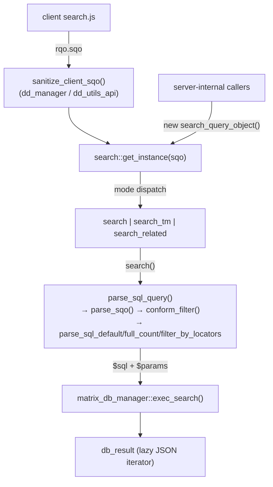

# search

> The server query engine — compiles a **Search Query Object (SQO)** into a single prepared PostgreSQL statement over the JSONB `matrix_*` tables, runs it, and returns an iterable `db_result`.

> See also: [SQO](../sqo.md) (the query DTO contract) · [RQO](../rqo.md) (the request that wraps an SQO) · [Sections](../sections/index.md) · [common](common.md)

This page is the **class-level reference** for the `search` engine. For *what an
SQO is* — its fields, the Mango-style filter grammar and the two-phase `parsed`
lifecycle — read [SQO](../sqo.md) first; this document is about the engine that
**consumes** an SQO and emits SQL, and does not repeat the SQO field contract at
length.

## Role

`search` (in `core/search/class.search.php`, `class search`) is the PHP runtime
that turns a `search_query_object` into prepared SQL and executes it. It is the
single query builder in Dédalo: every read that filters, counts or paginates
records — list views, portals, autocompletes, the thesaurus tree, diffusion
exports, server-internal lookups — funnels through it.

It is **not** a `common` subclass. Unlike `section` / `component_common`,
`search` is a standalone class (`class search`, no `extends`) that *uses*
`common` as a collaborator (`common::get_matrix_table_from_tipo()`,
`common::get_matrix_tables_with_relations()`, `common::get_ar_related_by_model()`)
and is reset by it (`common::clear()` calls
`search::reset_filter_user_records_cache()`). Its own code is split across six
PHP `trait`s plus two mode subclasses.

It sits at the boundary between the request layer and the database:

| layer | responsibility |
| --- | --- |
| **Client JS** (`core/search/js/search.js`) | builds the SQO (filter groups, `q_operator`, limit/offset) for the search UI. |
| **API gate** (`dd_manager`, `dd_utils_api`) | `search_query_object::sanitize_client_sqo()` — the **only** place an untrusted, client-authored SQO is sanitized before it reaches the engine. |
| **`search`** *(this class)* | compiles the SQO → one prepared SQL string, builds the `$params` positional list, executes via `matrix_db_manager`. |
| **`matrix_db_manager` / `db_result`** | `exec_search()` runs `pg_execute` with `$1..$n`; `db_result` is the returned iterator that parses JSON columns lazily on iteration. |



!!! warning "Two entry doors, one gate"
    Client SQOs are sanitized by `sanitize_client_sqo()` at the API edge.
    **Server-internal callers build a `search_query_object` and call
    `search::get_instance()` directly, bypassing that gate** — so they keep full
    access to server-only fields (`skip_projects_filter`, `limit:'all'`, …). The
    in-engine `conform_filter()` chokepoint (below) is what protects *both*
    paths against SQL injection through un-parameterizable identifiers.

## Responsibilities

- **Mode dispatch** — `get_instance()` reads `sqo->mode` and returns the right
  engine: `search` (default / `edit` / `list`), `search_tm` (Time Machine) or
  `search_related` (relation breakdown).
- **SQO conform** — `parse_sqo()` walks the filter / select / order trees and
  asks each component model to translate its filter leaf into a SQL fragment.
- **Injection chokepoint** — `conform_filter()` validates every
  `section_tipo` / `component_tipo` path step and the `lang` selector *before*
  any component dispatch, because those identifiers are string-interpolated into
  JSONB keys / jsonpath and cannot be parameterized.
- **SQL assembly** — build SELECT / FROM / JOIN / WHERE / ORDER / LIMIT through
  the traits, in a load-bearing order, using the window-subquery pattern.
- **Access-control filters** — `build_sql_projects_filter()` (per-user project
  scoping) and `build_filter_by_user_records()` (per-record ACL) always reach
  the WHERE clause for non-global-admins.
- **Prepared params** — `get_placeholder()` maintains the 0-indexed positional
  `$params` list that `exec_search()` binds; every literal value becomes a
  `$n` placeholder.
- **Multi-section UNION** — `build_union_query()` emits one `UNION ALL` branch
  per matrix table when an SQO spans more than one section.
- **Recursive children** — `search()` intercepts `children_recursive` and runs a
  dedicated parents search + a single batched children resolution.
- **Counting** — `count()` runs the `full_count` variant and returns a totals
  object (with optional `group_by` breakdown).
- **Worker hygiene** — the per-user `filter_user_records_cache` is reset by
  `common::clear()` via `reset_filter_user_records_cache()`.

## Key concepts

### The SQO → SQL flow (one pass, end to end)

```text
search::get_instance($sqo)            dispatch by $sqo->mode
  → ->search()                        children_recursive? → dedicated parents search + batched children
  → parse_sql_query()
      → parse_sqo()                   (skipped when sqo->parsed===true)
          → conform_filter()          validate path tipos + lang, then per-leaf:
              $model::get_search_query($search_object)
                  → resolve_query_object_sql()  in the component's trait.search_component_*.php
                  → returns {sentence:"... _Q1_ ...", params:{_Q1_:val}}
      → parse_sql_default()           |  parse_sql_full_count()  |  parse_sql_filter_by_locators()
          builds $sql_obj{select,from,join,main_where,where,order,order_default}
          via traits select/from/where/order/count/utils
          window-subquery pattern; UNION ALL across multiple matrix tables
  → matrix_db_manager::exec_search($sql, $this->params)   pg_execute with $1..$n
  → db_result iterator (parses JSON columns lazily on iteration)
```

!!! note "Execution order is load-bearing"
    `parse_sql_default()` builds **FROM → SELECT → ORDER → WHERE**, documented in
    its own docblock. ORDER runs before WHERE because component-based ordering
    calls `build_sql_join()` to add joins, and those joins need the base FROM
    established and their aliases available. Do not reorder.

### The internal `$sql_obj`

`set_up()` seeds a working object whose arrays are filled by the build methods
and then imploded into the final string:

```php
$this->sql_obj->select        = []; // SELECT columns
$this->sql_obj->from          = []; // FROM <matrix_table> AS <alias>
$this->sql_obj->join          = []; // LEFT JOIN LATERAL ... for multi-level paths
$this->sql_obj->main_where    = []; // section_tipo = / IN (...), users-root guard
$this->sql_obj->where         = []; // filter, projects filter, user-records filter
$this->sql_obj->order         = []; // custom (sqo->order) ordering
$this->sql_obj->order_default = []; // deterministic tie-break (section_id ASC/DESC)
$this->sql_obj->limit         = [];
$this->sql_obj->offset        = [];
```

### Identity / table resolution

`set_up()` normalizes `sqo->section_tipo` to an array. The **first** entry is
`main_section_tipo`; its alias `main_section_tipo_alias` is the trimmed tipo
(`trim_tipo()`) for a single section, or the literal **`mix`** when more than one
section is queried. The `matrix_table` is resolved from the first reliable
section tipo via `common::get_matrix_table_from_tipo()` (skipping tipos with no
installed model / no resolvable table). `search_tm` overrides `matrix_table` to
the fixed `matrix_time_machine`.

When `count(ar_section_tipo) > 1`, `set_up()` forces `remove_distinct = true`
(thesaurus / cross-section search wants duplicate `section_id`s across sections).
`skip_projects_filter` is forced `true` for tables in
`$ar_tables_skip_projects` (`matrix_list`, `matrix_dd`, `matrix_hierarchy`,
`matrix_hierarchy_main`, `matrix_langs`, `matrix_tools`, `matrix_stats`,
`matrix_notes`).

### conform_filter — the injection chokepoint

`conform_filter()` is the **central** security gate; it covers *all* component
search traits at one point. Component builders string-interpolate
`component_tipo` (as a JSONB key / jsonpath member step `$.{tipo}[*]`) and
`lang` (into jsonpath / string literals) — neither can be parameterized (jsonpath
`vars` can't parameterize a member accessor). So before any
`$model::get_search_query()` dispatch, `conform_filter()`:

- validates each path step's `section_tipo` via `search::is_valid_tipo()`
  (`^[a-z]+[0-9]+$`),
- validates each `component_tipo` via `is_valid_tipo()` **or**
  `is_valid_data_column()` (the legitimate pseudo-tipos `section_id`, `id`,
  `tipo`, `lang`, `type`, `section_tipo`),
- validates the optional `lang` via `is_valid_lang()` (`^(lg-[a-z0-9_]+|all)$`),

and **throws** an `Exception` on any malformed value. Single-level paths never
reach `build_sql_join()` (which has its own gate for multi-level join keys in
`trait.where.php`), which is exactly why this one gate must validate them up
front. A new per-component builder that interpolates a new SQO field into SQL
must be gated here, not in the leaf.

### Prepared params model

`get_placeholder($value)` (in `trait.utils.php`) returns `$1..$n` and stores
`$this->params` as a **0-indexed positional list of values** (dedup by strict
`array_search`, so `1.5`/`true`/`null` never collapse onto the same slot).
Consumers (`exec_search()`, `get_sql_query_resolved()`, `count()`) pass
`$this->params` directly. Component leaves build sentences with `_Q1_`, `_Q2_`…
token placeholders + a `params` map; `parse_search_object_sql()` swaps each token
for a real `$n`. Everything that *can* be parameterized is — the only verbatim
interpolations are the allowlisted identifiers above.

### Access-control filters (always reach WHERE)

- `build_sql_projects_filter()` — for non-global-admins, scopes by the user's
  projects. Each branch (PROFILES / PROJECTS / USERS / default) PUSHes its
  self-contained, parenthesized fragment to `$this->sql_obj->where[]`. Tables in
  `$ar_tables_skip_projects` skip it. JSONB literals are parameterized
  (`json_encode` does not escape single quotes, so they are never inlined).
- `build_filter_by_user_records()` — active only when
  `DEDALO_FILTER_USER_RECORDS_BY_ID === true`; restricts to the per-user record
  allowlist (`component_filter_records::get_user_filter_records()`), cached per
  `user_id` in `$filter_user_records_cache`. Section ids are int-cast before
  reaching `IN(...)`.

### Multi-section UNION

`build_union_query()` builds one branch per distinct matrix table. Each branch
keeps the same main alias (`mix`) and only the main `FROM <table> AS mix` is
swapped via an **exact-string** `str_replace` (never a regex — a regex over the
generated SQL would corrupt correlated subqueries, e.g. the `!!` duplicated
operator's `FROM <table> AS m2`). The outer `ORDER BY` strips the `mix.`
qualifier because UNION result columns aren't alias-qualified.

## Instantiation & lifecycle

`search` has a **private** constructor; you never `new search`. The static
factory dispatches on `sqo->mode`:

```php
public static function get_instance(
    object $search_query_object   // a search_query_object (or compatible stdClass)
) : search                        // returns search | search_tm | search_related
```

```php
// mode → class:
//   'tm'                      → search_tm
//   'related'                 → search_related
//   'edit' | 'list' | default → search
```

The private `__construct()` calls `set_up()`, which **throws** if
`section_tipo` is missing/empty, then seeds `$sql_obj`, resolves the matrix
table and clones the SQO into `$this->sqo`.

### Typical usage

```php
// 1. build an SQO (server-internal builder — bypasses the client gate)
$sqo = new search_query_object();
    $sqo->set_section_tipo(['rsc197']); // People
    $sqo->set_mode('list');
    $sqo->set_limit(50);
    $sqo->set_offset(0);
    // $sqo->set_filter( ... Mango-style filter ... );

// 2. instance the engine (mode dispatch)
$search = search::get_instance($sqo);

// 3a. fetch records (db_result iterator; JSON columns parsed lazily)
$db_result = $search->search();
if ($db_result!==false) {
    foreach ($db_result as $row) {
        // $row->section_id, $row->section_tipo, decoded JSON columns ...
    }
}

// 3b. or count (separate instance: count() runs the full_count variant)
$count_sqo = clone $sqo;
$count_sqo->set_full_count(true);
$records_data = search::get_instance($count_sqo)->count();
$total = $records_data->total; // int
```

!!! note "Untrusted vs trusted SQOs"
    A client SQO arriving over the API is run through
    `search_query_object::sanitize_client_sqo()` first (strips server-only SQL
    fields, forces `parsed=false`, clamps `limit` to
    `DEDALO_SEARCH_CLIENT_MAX_LIMIT`). Server code that builds its own
    `search_query_object` is trusted and skips that step. Both are protected by
    `conform_filter()`.

## Public API

Grouped by concern. *static?* marks class-level (static) methods. Methods live on
the base `search` class and its traits unless a subclass is named.

### Lifecycle & dispatch

| method | static? | purpose |
| --- | --- | --- |
| `get_instance($search_query_object)` | ✓ | Dispatch on `sqo->mode` and return a `search` / `search_tm` / `search_related` instance. |
| `set_up($search_query_object)` | | (protected) Validate `section_tipo`, seed `$sql_obj`, resolve `matrix_table`, set `remove_distinct` / `skip_projects_filter`, clone the SQO. Throws on missing `section_tipo`. |

### Execution

| method | static? | purpose |
| --- | --- | --- |
| `search()` | | Parse the SQO, execute via `matrix_db_manager::exec_search()`, return a `db_result` iterator (or `false`). Intercepts `children_recursive`. |
| `count()` | | Run the count query and return `{ total:int (, totals_group ) }`; handles the `children_recursive` and `group_by` cases. |
| `parse_sql_query()` | | Build the final SQL string, dispatching to `parse_sql_full_count()` / `parse_sql_filter_by_locators()` / `parse_sql_default()`. Stores it in `$sql_query`. |
| `parse_sql_default()` | | Build the standard SELECT (FROM→SELECT→ORDER→WHERE) with the window-subquery pattern. |
| `parse_sql_full_count()` | | Build the `COUNT(*) … FROM (…) x` variant. |
| `parse_sql_filter_by_locators()` | | Build the SELECT filtered by an explicit locator list. |

### SQO conform / dispatch to components

| method | static? | purpose |
| --- | --- | --- |
| `parse_sqo()` | | Walk filter / select / order and rewrite the SQO with component-resolved SQL fragments; idempotent (`sqo->parsed`). |
| `conform_filter($op, $filter_items)` | | Recursively conform a filter group: **validate path tipos + lang (injection gate)**, then dispatch each leaf to `$model::get_search_query()`. |
| `conform_select($select_object)` | ✓ | Resolve a SELECT/ORDER column name from its component `key` when `column` is not provided. |
| `column_format_parser($query_object)` | | (protected) Build a `column`-format leaf (`<alias>.<column> <op> _Q1_`) with allowlisted column + operator. |

### WHERE / filters / joins

| method | static? | purpose |
| --- | --- | --- |
| `build_main_where()` | | Emit the `section_tipo =`/`IN(...)` predicate (+ users-root guard). `search_tm` overrides to a no-op. |
| `build_sql_filter()` | | Turn `sqo->filter` into a WHERE fragment via `filter_parser()` (honours `skip_duplicated`). |
| `filter_parser($op, $ar_value)` | | Collect non-empty fragments and `implode` with the logical operator; `AND/OR/NOT/NAND/NOR` allowlisted. |
| `build_sql_join($path)` | | Build the `LEFT JOIN LATERAL jsonb_array_elements(...)` + matrix-table join for a multi-level path; gates the interpolated `component_tipo`. |
| `parse_search_object_sql($search_object)` | | Swap a component leaf's `_Qn_` tokens for real `$n` placeholders. |
| `build_sql_filter_by_locators()` | | Build the WHERE for `filter_by_locators` (incl. TM-only `tipo`/`lang`/`matrix_id`). |
| `build_sql_projects_filter($force_calculate=false)` | | Per-user project ACL filter (PROFILES/PROJECTS/USERS/default); pushes to `sql_obj->where`. |
| `build_filter_by_user_records()` | | Per-record ACL filter when `DEDALO_FILTER_USER_RECORDS_BY_ID` is on. |
| `reset_filter_user_records_cache()` | ✓ | Purge the per-user records cache; wired into `common::clear()`. |

### SELECT / FROM / ORDER

| method | static? | purpose |
| --- | --- | --- |
| `build_sql_query_select()` | | Build the SELECT (DISTINCT ON unless `remove_distinct`); validates client `column`/`key`. `search_tm` selects `*`. |
| `build_main_from_sql()` | | Emit `FROM <matrix_table> AS <alias>`. |
| `build_sql_query_order()` | | Build custom ORDER from `sqo->order` (direction allowlist; component `build_order_select`); always calls the default. |
| `build_sql_query_order_default()` | | Emit the deterministic tie-break order (`section_id ASC`, `DESC` for the Activity section; `timestamp DESC` for `search_tm`). |
| `build_limit_offset_sql()` | | Build the coerced `LIMIT/OFFSET` tail. |
| `sanitize_sql_limit($value)` | ✓ | Normalize a limit to `'ALL'`, a positive int, or `null`. |
| `build_union_query($sql_query)` | | Wrap the query in `UNION ALL` branches, one per matrix table (exact-string FROM swap). |

### Recursive children

| method | static? | purpose |
| --- | --- | --- |
| `generate_children_recursive_search($ar_rows)` | | Build a new SQO whose filter is an `IN(...)` of all parent + child `section_id`s (int-cast). |

### Validation / identifier allowlists (`trait.utils.php`)

| method | static? | purpose |
| --- | --- | --- |
| `is_valid_tipo($tipo)` | ✓ | `^[a-z]+[0-9]+$` — gate for tipos interpolated into JSONB keys. Does **not** transform (unlike `trim_tipo`). |
| `is_valid_lang($lang)` | ✓ | `^(lg-[a-z0-9_]+|all)$` — gate for langs interpolated into jsonpath/literals. |
| `is_valid_data_column($column)` | ✓ | Allowlist of real matrix columns + structural + TM columns. |
| `trim_tipo($tipo, $max=2)` | ✓ | Contract a tipo for compact SQL aliases (e.g. `rsc197` → `rs197`); returns `null` on malformed input. |
| `get_placeholder($value)` | | Return `$n` for a value, appending to the positional `$params` (strict dedup). |
| `get_table_alias_from_path($path)` | | Compute the table alias for a filter path. |
| `is_search_operator($search_object)` | ✓ | True when the object key starts with `$` (a Mango operator group). |
| `is_literal($q)` | ✓ | True when `q` is single-quote wrapped. |
| `get_sql_query()` / `get_sql_query_resolved()` | | The stored final SQL string (raw / with `$n` interpolated for debug). |
| `get_query_path($tipo, $section_tipo, …)` | ✓ | Build a component select path (used by `component_common` / `section`). |
| `get_data_with_path($path, $ar_locator)` / `resolve_path_level(...)` | ✓ | Resolve a locator path level by level (used by the `state` / `component_info` widget). |
| `search_options_title($search_operators_info)` | ✓ | Build the search-operators tooltip HTML. |

### search_related (relation breakdown)

| method | static? | purpose |
| --- | --- | --- |
| `search_related::parse_sql_query()` | | Self-contained query over the `data_relations_flat_*` functions; `breakdown`, `group_by`, `tables` allowlisted. |
| `search_related::get_referenced_locators($filter_locators, $limit, $offset, $count, $target_section)` | ✓ | Resolve the records that point at a locator (the inverse-relations API). |

## How it fits with the rest of Dédalo

- **[SQO](../sqo.md)** — the query DTO this engine consumes. `search.md`
  documents the *engine*; `sqo.md` documents the *contract* (filter grammar,
  field cheat-sheet, the `parsed` two-phase lifecycle). They are companions.
- **[RQO](../rqo.md)** — the request envelope that carries the SQO from the
  client; `sanitize_client_sqo()` runs while unpacking the RQO in `dd_manager`.
- **[Sections](../sections/index.md) / [section](../sections/section.md)** —
  list views and the per-section navigation SQO (`section::get_session_sqo()` /
  `set_session_sqo()`, `section::get_search_query()`) build SQOs and call this
  engine. `section` resolves the children whose component models implement the
  per-component search traits.
- **[Components](../components/index.md)** — each component model implements
  `resolve_query_object_sql()` (reached via `component_common::get_search_query()`),
  the leaf that turns one filter item into `{sentence, params}`. Related
  components (`component_portal`, `component_select`, …) drive multi-level joins
  and the `search_related` breakdown.
- **[common](common.md)** — `search` is *not* a `common` subclass but depends on
  it for matrix-table resolution and is reset by `common::clear()` (worker
  hygiene). The matrix tables it queries are documented under
  [Locator](../locator.md) and [Sections](../sections/index.md).
- **Time Machine** — `search_tm` queries the flat `matrix_time_machine` table
  (single `data` column instead of tipo-keyed JSONB; default `timestamp DESC`).

## Examples

### A simple filtered, paginated list

```php
$sqo = new search_query_object();
    $sqo->set_section_tipo(['oh1']); // Oral History
    $sqo->set_mode('list');
    $sqo->set_limit(20);
    $sqo->set_offset(0);

$db_result = search::get_instance($sqo)->search();
foreach ($db_result as $row) {
    // process each matched record
}
```

### Inverse relations (which records point at me)

```php
// resolve every record that references this locator
$ar_inverse = search_related::get_referenced_locators(
    [$reference_locator], // array of basic {section_tipo, section_id} locators
    100,   // limit
    0,     // offset
    false  // count
);
```

### Reading the generated SQL (debug)

```php
$search = search::get_instance($sqo);
$search->search();                       // runs and stores the query
$raw      = $search->get_sql_query();          // 'SELECT ... WHERE ... = $1'
$resolved = $search->get_sql_query_resolved(); // placeholders interpolated for reading
```

!!! note "Test pattern"
    The search test suite (`test/server/search/`,
    `test/server/components/component_*_Search_Test.php`) is **SQL-string tests,
    no live DB**: build an SQO, call `parse_sql_query()` (or a component's
    `resolve_query_object_sql()`), and assert on the generated SQL / `$params`,
    or `expectException` for rejected injection payloads. Run with
    `vendor/bin/phpunit -c test/server/phpunit.xml test/server/search/`.

## Related

- [SQO](../sqo.md) — the Search Query Object contract (filter grammar, fields,
  `parsed` lifecycle).
- [RQO](../rqo.md) — the request format that wraps an SQO.
- [Sections](../sections/index.md) · [section](../sections/section.md) — list
  views, the session SQO and children resolution.
- [Components](../components/index.md) — the per-component
  `resolve_query_object_sql()` leaves.
- [common](common.md) — the shared base/collaborator and the `clear()` worker
  reset.
- [Locator](../locator.md) — the typed pointers `search_related` resolves.
- [Architecture overview](../architecture_overview.md#a-note-on-search-sqo) —
  where search sits in the request lifecycle.
</content>
</invoke>
