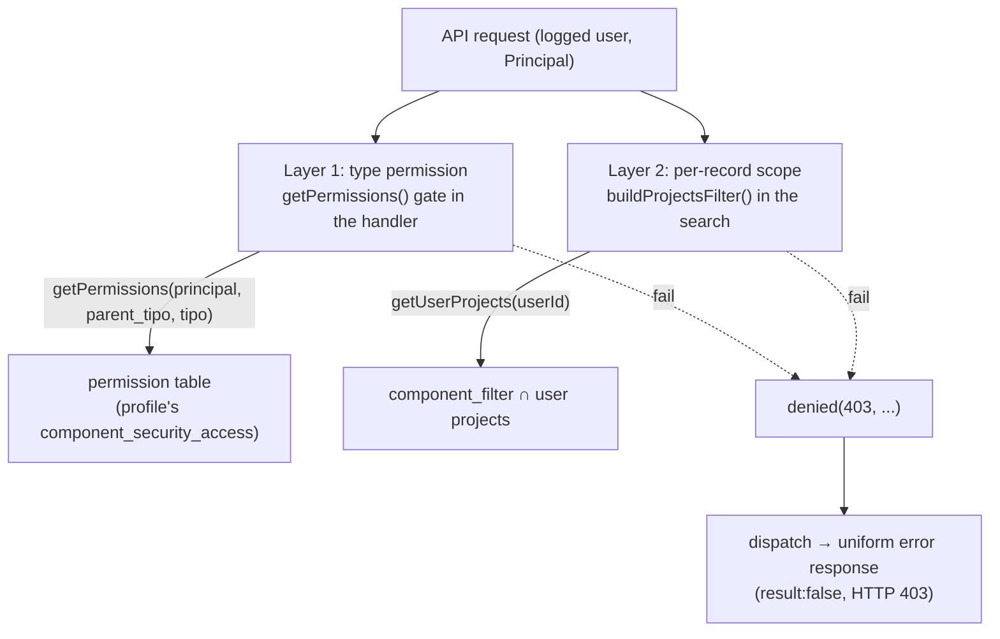
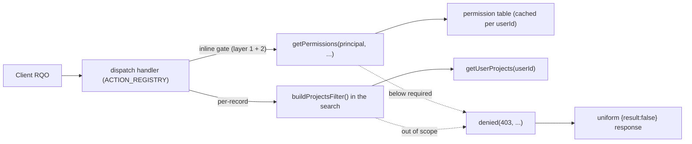

# security

> See also: [component_security_access](../components/component_security_access.md) · [login](login.md) · [Architecture overview](../architecture_overview.md) · [Components — Permissions](../components/index.md#permissions)

The security subsystem is the authorization core of Dédalo: it turns a logged user's profile into an integer permission (0–3) over any ontology element, and exposes the gates that enforce it server-side on every read, write and per-record access.

This page is the **module-level reference** for authorization. For the *data* behind
permissions — the per-profile permission matrix and how it is edited — read
[component_security_access](../components/component_security_access.md) first;
this document does not repeat that material at length.

## Role

The authorization logic lives in **`src/core/security/permissions.ts`** — a
module of **pure functions** (no class, no per-request instance). It is the
single place that answers the question *"may the current logged user do X to this
element?"*, and — through the API dispatcher's inline gates — the place where
that answer is **enforced** before any handler touches data.

The identity a request carries is a small **`Principal`** value
(`{ userId, isGlobalAdmin, isDeveloper }`), resolved once per request by
`resolvePrincipal(userId)` and threaded *explicitly* into every authorization
call. There is no ambient "current user" global.

It sits at the bottom of the authorization stack:

| layer | who calls it | what it decides |
| --- | --- | --- |
| **API handlers** (`ACTION_REGISTRY` in `src/core/api/dispatch.ts`) | the request router | gate the action with an inline `getPermissions()` check before reading/writing |
| **`getPermissions(principal, parent_tipo, tipo)`** | dispatch handlers, section/menu resolvers | the *only* entry point to resolve a permission level (0–3) |
| **`getPermissionsTable(userId)`** *(private, in `permissions.ts`)* | `getPermissions()` | flatten the profile's `component_security_access` grants into the fast lookup map |
| **`component_security_access`** (`dd774`) | the profile record in `matrix_profiles` | the stored per-profile permission matrix (the data) |

!!! warning "There is no shared authorization state"
    `permissions.ts` carries **no object identity** — it is a set of exported
    functions. Request identity lives in the `Principal` interface, passed as the
    first argument. No mutable authorization state is shared between requests,
    which is what makes concurrent request handling safe here by construction.

!!! note "One function, one decision list"
    `getPermissions()` is the single resolver. It is an ordered, first-match-wins
    decision list: the Time-Machine clamp and the empty-tipo `0` come first, then
    the special cases, then the matrix lookup.

    The **"not logged in ⇒ 0"** rule is structural rather than a branch: an
    unauthenticated request never reaches a handler that resolves permissions,
    because the dispatcher's auth gate rejects it first.

## Responsibilities

- **Resolve a permission level (0–3)** for a `(parent_tipo, tipo)` pair from the
  current user's profile, applying the fixed special-case rules (superuser,
  tools register, temp-preset, inverse relations, time machine, maintenance
  area, public lists).
- **Build and cache the permission table** — flatten the active profile's
  `component_security_access` data into a fast `"<section_tipo>_<tipo>" => level`
  lookup, cached in a per-`userId` `Map`.
- **Resolve the user's profile and the security-access grants** behind that
  table (`resolveProfileId`, `getPermissionsTable`).
- **Answer role questions** — `resolvePrincipal` (`isGlobalAdmin`,
  `isDeveloper`), `getAuthorizedAreaTipos` / `getAuthorizedAreasForUser`.
- **Enforce permissions server-side** via the inline `getPermissions()` checks
  that dispatch handlers place at their entry, all funnelling failures into the
  uniform `denied()` response.
- **Enforce per-record (project) visibility** — the second ACL tier
  (`getUserProjects` + the search projects filter), applied over every list/search
  query and re-checked per-record on writes.
- **Cache hygiene** — `clearPermissionsCache` / `clearUserProjectsCache` drop the
  per-user maps so a re-profiled user never serves a stale matrix.

## The permission model

### The four levels

Permissions are a single integer; higher includes lower:

| value | level | meaning |
| --- | --- | --- |
| `0` | no access | the element is not returned and may not be read |
| `1` | read only | read, but writes are refused |
| `2` | read / write | read and save |
| `3` | admin / debug | full control (structure edits, etc.) |

The module documents `3` as the admin level (see
[Components — Permissions](../components/index.md#permissions)). Absence of a
row in the permission table means level `0`.

### Two ACL tiers

Dédalo's authorization is two-tiered, and both tiers live in the security
subsystem:

1. **Schema / type-based (layer 1).** *"What may this profile do with this
   section/component *type*?"* — resolved by `getPermissions()` from the
   permission table; gated inline in the dispatch handlers before any DB work.
2. **Per-record / project-based (layer 2).** *"Is this specific record inside the
   caller's project scope?"* — enforced by `buildProjectsFilter()`
   (`src/core/search/sql_assembler.ts`), which appends a `component_filter`
   ∩ user-projects `EXISTS (...)` clause to every list/search query for a
   non-admin principal. The user's projects come from `getUserProjects(userId)`.
   A write that receives a caller-supplied `section_id` outside a search — a
   duplicate, or an SQO-less delete — re-runs the same principal-scoped existence
   query to confirm the record is visible before mutating it.



**Prose description of the diagram above:** A logged API request carries a
`Principal`. Layer 1 (the handler's inline `getPermissions()` gate) resolves the
type-level permission, which reads the profile's permission table built from
`component_security_access`. Layer 2 (`buildProjectsFilter()`) checks per-record
visibility by intersecting the record's `component_filter` with the user's
projects from `getUserProjects()`. Either gate that fails produces a uniform
`denied(403, …)` response — a `{result:false}` envelope the client reads.

## Data model & caching

The security module owns **no ontology data**; it *derives* its state from the
active user's profile.

- **The permission table** — a `Map<string, number>` keyed
  `"<section_tipo>_<tipo>" => level`, e.g. `{"rsc197_rsc197": 2, "rsc197_rsc85":
  2, "rsc197_rsc261": 1}`. Built by `getPermissionsTable(userId)` from the
  logged user's `component_security_access` grants (one permission row per
  reachable element).
- **Where the matrix lives** — in the **Profiles** section (`dd234`) as the
  `component_security_access` datum (`dd774`). The current user's profile id is
  resolved via `resolveProfileId()` (the user's profile-select component,
  `dd1725`), and the matrix is read from that profile record's `misc` column.

### The caches are keyed by user

`getPermissionsTable()` caches its result, because resolving the whole matrix
from the grants is expensive:

1. **A module `Map` keyed by `userId`** — `permissionsTableCache`. Distinct users
   map to distinct keys, so a lookup for user A can never return user B's matrix.
2. The grants read — the source of truth — only happens on a full miss.

`clearPermissionsCache(userId?)` drops one entry, or the whole map;
`clearUserProjectsCache(userId?)` does the same for the projects cache. These are
the hooks to call after a profile change.

!!! warning "The user id is what keeps the cache safe"
    One long-lived process serves every user, so an authorization cache that is
    not keyed by identity would leak one user's grants to the next. Keying by
    `userId` is what makes that impossible. A manual reset is needed only for
    *correctness after a profile edit* — never for *isolation between users*.

    If you add a cache to this module, key it by `userId` or do not add it.

## Principal & lifecycle

Authorization is used entirely through **module functions**; you never
instantiate anything. Identity is captured once per request as a `Principal`:

```ts
// resolve the request's identity (dispatch does this once, lazily)
const principal = await resolvePrincipal(session.userId); // {userId, isGlobalAdmin, isDeveloper}
```

`resolvePrincipal()` short-circuits the superuser (`userId === -1` ⇒ admin +
developer) and otherwise reads the user's global-admin (`dd244`) and developer
(`dd515`) flag components. The normal flow then resolves permissions or gates
actions through the module functions:

```ts
// resolve a permission level (the entry point)
const perm = await getPermissions(principal, 'rsc197', 'rsc197'); // 0..3

// or, inside a handler, gate an action and relay the uniform failure
if ((await getPermissions(principal, sectionTipo, sectionTipo)) < 2) {
    return denied(403, "You don't have enough permissions to edit this component");
}
```

## Public API

Grouped by concern. All functions listed below are exported from
`src/core/security/permissions.ts` and verified against the source.

### Resolving permissions

| function | purpose |
| --- | --- |
| `getPermissions(principal, parentTipo, tipo)` | Resolve the 0–3 level for a `(parent_tipo, tipo)` pair. First-match order: time machine (`dd15`) → admin-only (`1`/`0`); empty tipo → `0`; superuser → `3`; tools register (`dd1324`) → `1`; temp-preset (`dd655`) → `2`; inverse relations (`dd1596`) or `'all'` → `1`; maintenance area (`dd88`) → `0` for non-admin/non-dev; then the `"<parent>_<tipo>"` matrix lookup (absent → `0`), with a fallback to `1` for public list tables (`matrix_list` / `matrix_dd` / `matrix_notes`). |
| `resolvePrincipal(userId)` | Build the `Principal`: superuser is always admin+developer; otherwise reads the `dd244` (admin) and `dd515` (developer) flag components (first locator target `section_id === 1` ⇒ yes). |

### Permission table

| function | purpose |
| --- | --- |
| `getPermissionsTable(userId)` *(private)* | Build/return the flat `Map<"<section_tipo>_<tipo>", level>` for the current user, cached per `userId`. Reads the profile's `dd774` grants; empty map when the user has no profile. Listed for orientation; not exported. |
| `clearPermissionsCache(userId?)` | Drop the per-user permission-table cache entry (or the whole map). Call after changing a profile's permissions or a user's profile assignment. |
| `getAuthorizedAreaTipos(userId)` | The area tipos the profile authorizes: the SELF-KEYED (`X_X`) entries of the permission table, by **presence**. This is the menu filter. Returns a `Set<string>`. |
| `getAuthorizedAreasForUser(userId)` | The same self-keyed entries **with their level** (`{tipo, value}[]`), for callers that need the level (e.g. `component_filter_records` keeping only `value >= 2`). |

### Per-record (project) scope — layer 2

| function | purpose |
| --- | --- |
| `getUserProjects(userId)` | The user's authorized project `section_id`s — the `dd170` relation locators in their user record. An empty array means no projects, and therefore no project-gated records are visible. Cached per `userId`. |
| `clearUserProjectsCache(userId?)` | Drop the per-user projects cache. |

The clause that *applies* these projects to a query lives next door in
`src/core/search/sql_assembler.ts`: `buildProjectsFilter(sectionTipo, alias,
principal, params)` returns the `EXISTS (…component_filter ∩ user projects…)`
WHERE fragment for a gated section, or `''` when the section is not
project-gated. A non-admin with **no** projects yields an impossible clause, so
gated records return empty — never leaked.

## How permissions are enforced

The permission *level* is resolved in one place (`getPermissions()`), but it is
**checked at several chokepoints**, all server-side, never trusting the client.
Each handler gates **inline** and returns the uniform `denied()` envelope:

1. **API entry (read).** `dd_core_api.read` resolves the read permission on the
   source `(section_tipo, tipo)` and on **every SQO target section**
   (self-keyed) *before* any search/DB work. Anything `< 1` short-circuits to
   `denied(403, 'Insufficient permissions to read')`.

2. **API entry (create / write).** `create`, `save`, `duplicate` and `delete`
   check `getPermissions(principal, section_tipo, …) < 2` and refuse with a
   `denied(403, …)` "not enough permissions" message.

3. **Per-record scope on writes.** `duplicate` and sqo-less `delete` re-run a
   principal-scoped existence search (the same `buildProjectsFilter` clause) and
   refuse a record outside the caller's project scope. Multi-record sqo deletes
   are a global-admin-only operation (fail closed).

4. **Cross-section / structural operations.** Actions with a section-wide blast
   radius (`rebuild_media_index`, ontology-main cascade delete, sqo multi-delete)
   require `principal.isGlobalAdmin` outright.



**Prose description of the diagram above:** A client RQO reaches a dispatch
handler in `ACTION_REGISTRY`. The handler first applies its inline
`getPermissions()` gate (layer-1 type checks, and for caller-supplied ids the
layer-2 per-record scope check against the projects filter). `getPermissions()`
reads the per-`userId`-cached permission table; the projects filter reads
`getUserProjects()`. A level below the requirement, or a record outside scope,
produces a `denied(403, …)` — the uniform `{result:false}` response the client
reads.

## How it fits with the rest of Dédalo

- **[component_security_access](../components/component_security_access.md)** is
  the *data* side: the per-profile permission matrix `permissions.ts` flattens
  into its table. Editing that component (and calling `clearPermissionsCache()`)
  is how permissions change.
- **[login](login.md)** authenticates and opens the session: it stamps the
  `is_global_admin` flag into the session row, which `resolvePrincipal` reads
  back for the current user; per-element access is then decided by
  `getPermissions()`.
- **[Sections](../sections/index.md)** and **[Components](../components/index.md#permissions)**
  are read at the levels `getPermissions()` returns; the dispatch read gate drops
  any element resolving to `< 1`.
- **[SQO / search](../sqo.md)** is the per-record gate's twin: the search
  assembler's `buildProjectsFilter` applies the same `component_filter` ∩
  user-projects logic over a *query*, while the write handlers apply it to a
  *single record*.
- **Tools** ([creating tools](../../development/tools/creating_tools.md)) resolve
  the same `Principal` through the tool dispatcher and gate before mutating data
  outside the normal section/component path.

## Examples

### Gate an API action and read a permission

```ts
// Inside a dispatch handler: refuse anything below write on the target section.
// On failure this returns the uniform denied(403, ...) response the client reads.
if ((await getPermissions(principal, sectionTipo, sectionTipo)) < 2) {
    return denied(403, "You don't have enough permissions to edit this component");
}

// Resolve a level without gating (the read path):
const perm = await getPermissions(principal, sectionTipo, tipo); // 0..3
if (perm < 1) {
    // not readable for this user
}
```

### Per-record scope on a caller-supplied id (layer 2)

```ts
// A section_id that bypasses the sqo projects filter (e.g. duplicate): re-run a
// principal-scoped existence search to confirm the record is in scope.
if (!principal.isGlobalAdmin) {
    const scopeSqo = sanitizeClientSqo({
        section_tipo: [sectionTipo],
        filter_by_locators: [{ section_tipo: sectionTipo, section_id: String(sourceSectionId) }],
        limit: 1,
    });
    const q = await buildSearchSql(scopeSqo, { principal });
    const visible = await sql.unsafe(q.sql, q.params);
    if (visible.length === 0) return denied(403, 'Record is out of the user scope');
}
```

### Invalidate the permission table after a change

```ts
// After editing a profile's component_security_access, drop the cached matrix so
// the next request sees the new grants. Pass a userId to scope it, or omit to
// clear all.
clearPermissionsCache(userId);
```

## Related

- [component_security_access](../components/component_security_access.md) — the
  stored per-profile permission matrix this module consumes.
- [login](login.md) — session setup, role flags and native TS auth.
- [Components — Permissions](../components/index.md#permissions) — the 0–3 levels
  from the component's point of view.
- [Sections](../sections/index.md) — the section read and create/save gates.
- [SQO](../sqo.md) — the projects filter, the query-time twin of the per-record
  scope check.
- [Architecture overview](../architecture_overview.md) — where authorization sits
  in the request lifecycle.
