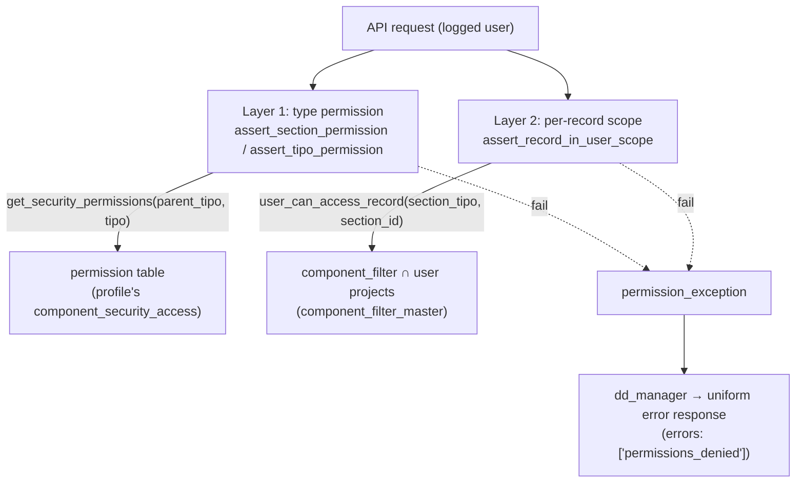
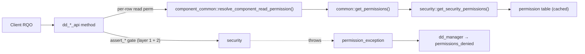

# security

> The server class `security` — the authorization core of Dédalo: it turns a logged user's profile into an integer permission (0–3) over any ontology element, and exposes the gates that enforce it server-side on every read, write and per-record access.

> See also: [component_security_access](../components/component_security_access.md) · [login](login.md) · [Architecture overview](../architecture_overview.md) · [Components — Permissions](../components/index.md#permissions)

This page is the **class-level reference** for `security`. For the *data* behind
permissions — the per-profile permission matrix and how it is edited — read
[component_security_access](../components/component_security_access.md) first;
this document does not repeat that material at length.

## Role

`security` (in `core/security/class.security.php`) is a **plain static utility
class** — it does *not* extend `common` (it has no ontology identity of its own).
It is the single place that answers the question *"may the current logged user do
X to this element?"*, and the place where that answer is **enforced** before any
API method touches data.

It sits at the bottom of the authorization stack:

| layer | who calls it | what it decides |
| --- | --- | --- |
| **API methods** (`dd_*_api`) | the request dispatcher | gate the action with `assert_*` before reading/writing |
| **`common::get_permissions(parent_tipo, tipo)`** | sections, components, tools | the *only* recommended entry point to resolve a permission |
| **`security::get_security_permissions()`** *(this class)* | `common::get_permissions()` | resolve the 0–3 level from the profile permission table + special cases |
| **`component_security_access`** | `security::get_permissions_table()` | the stored per-profile permission matrix (the data) |

!!! note "Not a `common` subclass"
    Unlike `section` / `component_common`, `security` is **not** part of the
    ontology object hierarchy. It carries no `tipo`, `mode` or `dato`; it is a
    bag of static authorization helpers plus a tiny per-instance constructor
    that only captures the logged `user_id`. Almost all useful methods are
    `static`.

!!! warning "Do not call `security::get_security_permissions()` directly"
    The documented entry point for resolving a permission is
    `common::get_permissions($parent_tipo, $tipo)`, which adds the not-logged
    (`0`) and Time-Machine clamps before delegating here. `get_permissions()`'s
    own docblock says *"Do not use this method directly to resolve component
    permissions"* — components must go through
    `component_common::get_component_permissions()` /
    `resolve_component_read_permission()`, which layer the per-component special
    cases on top.

## Responsibilities

- **Resolve a permission level (0–3)** for a `(parent_tipo, tipo)` pair from the
  current user's profile, applying the fixed special-case rules (superuser,
  read-only scope, tools register, time machine, maintenance area, public lists).
- **Build and cache the permission table** — flatten the active profile's
  `component_security_access` data into a fast `"<section_tipo>_<tipo>" => level`
  lookup, cached statically and on disk per user.
- **Resolve the user's profile and the security-access component** behind that
  table (`get_user_profile`, `get_user_security_access`).
- **Answer role questions** — `is_global_admin`, `is_developer`, authorized areas.
- **Enforce permissions server-side** via the throwing `assert_*` gates that API
  methods place at their entry, all funnelling failures into a single
  `permission_exception`.
- **Enforce per-record (project) visibility** — the second ACL tier
  (`user_can_access_record` / `assert_record_in_user_scope`).
- **Cache hygiene** — `clean_cache` / `reset_permissions_table` clear the static
  and on-disk permission table so a re-profiled user (or a persistent worker)
  never serves a stale matrix.

## The permission model

### The four levels

Permissions are a single integer; higher includes lower:

| value | level | meaning |
| --- | --- | --- |
| `0` | no access | the element is not returned and may not be read |
| `1` | read only | read, but writes are refused |
| `2` | read / write | read and save |
| `3` | admin / debug | full control (structure edits, etc.) |

The class header documents `3` as *debug*; in practice it is the admin level
(see [Components — Permissions](../components/index.md#permissions)). Absence of a
row in the permission table means level `0`.

### Two ACL tiers

Dédalo's authorization is two-tiered, and both tiers live in `security`:

1. **Schema / type-based (layer 1).** *"What may this profile do with this
   section/component *type*?"* — resolved by `get_security_permissions()` from
   the permission table; gated by `assert_section_permission` /
   `assert_tipo_permission` / `assert_component_permission`.
2. **Per-record / project-based (layer 2).** *"Is this specific record inside the
   caller's project scope?"* — resolved by `user_can_access_record()`, which
   mirrors the `filter_by_projects` WHERE clause that `search` applies to every
   list/search query; gated by `assert_record_in_user_scope`. This layer reads
   the record's `component_filter` and intersects it with the user's projects
   from `component_filter_master::get_user_projects()`.



**Prose description of the diagram above:** A logged API request is checked by two
independent gates. Layer 1 (`assert_section_permission` /
`assert_tipo_permission`) resolves the type-level permission through
`get_security_permissions()`, which reads the profile's permission table built
from `component_security_access`. Layer 2 (`assert_record_in_user_scope`) checks
per-record visibility through `user_can_access_record()`, which intersects the
record's `component_filter` with the user's projects from
`component_filter_master`. Either gate that fails throws a single
`permission_exception`, which `dd_manager` catches and converts into a uniform
error response carrying `errors: ['permissions_denied']`.

## Data model & caching

`security` owns **no ontology data**; it *derives* its state from the active
user's profile.

- **`permissions_table`** — an assoc array `"<section_tipo>_<tipo>" => level`,
  e.g. `{"rsc197_rsc197": 2, "rsc197_rsc85": 2, "rsc197_rsc261": 1}`. Built by
  `get_permissions_table()` from the logged user's
  `component_security_access` data (one permission row per reachable element).
- **Where the matrix lives** — in the **Profiles** section
  (`DEDALO_SECTION_PROFILES_TIPO` = `dd234`) as component
  `DEDALO_COMPONENT_SECURITY_ACCESS_PROFILES_TIPO` (`dd774`). The current user's
  profile id is resolved via `get_user_profile()` (the user's
  `DEDALO_USER_PROFILE_TIPO` component), and the matrix is read from that
  profile record's `component_security_access`.

### Three cache layers

`get_permissions_table()` is intentionally cached three deep, because resolving
the whole matrix from the component is expensive:

1. **Static var** `security::$permissions_table_cache` (public, per-process).
   *(!) Documented as load-bearing during the login sequence, where permission
   resolutions run before the file cache exists.*
2. **On-disk file** `cache_permissions_table.php` per user, via
   `dd_cache::cache_from_file()` / `cache_to_file()`.
3. The component read itself (the source of truth) only happens on a full miss.

`clean_cache()` clears all three (plus the legacy
`$_SESSION['dedalo']['auth']['permissions_table']`); `reset_permissions_table()`
clears then immediately recomputes. These are the hooks to call after any
permission change.

!!! warning "Worker state-bleed risk"
    `$permissions_table_cache` and the private static
    `$ar_permissions_in_matrix_for_current_user` / `$ar_permissions_table` are
    **class-statics scoped to a single user**. The on-disk cache file is named
    per user. Under a persistent worker, the static caches MUST be reset between
    requests (via the login sequence / `clean_cache`) or one user's matrix would
    leak to the next. This is the same state-bleed hazard documented for
    `common`'s static caches.

### `read_only_scope` — the server-only read grant

`security::$read_only_scope` is a public static **bool** flag. When `true`,
`get_security_permissions()` returns a fixed `1` (read) for any section *except*
`DEDALO_SECTION_USERS_TIPO` and `DEDALO_SECTION_PROFILES_TIPO`. It exists so that
non-destructive helpers (autocomplete label resolution, search) can read the
*target* sections/components needed to resolve a label even when the user has no
direct grant on them.

!!! danger "Never trust the client for read_only_scope"
    The in-code comment is explicit: this flag MUST be set only by trusted
    server code and reset in a `finally` block. A previous version trusted
    `rqo->source->config->read_only` from the client, which let **any logged
    user gain read access to almost every section** by setting that flag. The
    Users and Profiles sections are excluded even under read-only scope.

## Instantiation & lifecycle

`security` is used almost entirely through its **static** methods; you rarely
instantiate it. The constructor takes no arguments and only captures the logged
user id from the session:

```php
public function __construct()
// reads logged_user_id() into $this->user_id;
// logs an error (throws under SHOW_DEBUG) if no user is in the session.
```

The normal flow does not touch the instance at all — code resolves permissions
through `common::get_permissions()` or asserts them through the static gates:

```php
// resolve a permission level (the recommended path)
$perm = common::get_permissions('rsc197', 'rsc197'); // 0..3

// or, server-side, gate an API action and let dd_manager handle the failure
security::assert_section_permission('rsc197', 2, __METHOD__); // throws if < write
```

## Public API

Grouped by concern. *static?* marks class-level (static) methods. All methods
listed below are public and verified against the source.

### Resolving permissions

| method | static? | purpose |
| --- | --- | --- |
| `get_security_permissions($parent_tipo, $tipo)` | ✓ | Resolve the 0–3 level for a `(parent_tipo, tipo)` pair. Applies the fixed special cases (read-only scope, superuser→`3`, tools register→`1`, temp-preset→`2`, global inverse/`'all'`→`1`, time machine→`1`, maintenance area→`0` for non-admins), then looks up `"<parent>_<tipo>"` in the permission table; absent → `0`, with a fallback to `1` for public list tables (`matrix_list` / `matrix_dd` / `matrix_notes`). Called by `common::get_permissions()`. |
| `get_section_new_permissions($section_tipo)` | ✓ | Resolve the permission of a section's `button_new` (the "create record" gate); `null` when the section has no `button_new`. |

### Permission table

| method | static? | purpose |
| --- | --- | --- |
| `get_permissions_table()` | — *(private)* | Build/return the flat `"<section_tipo>_<tipo>" => level` matrix for the current user, three-deep cached (static → file → component). Listed for orientation; not callable externally. |
| `reset_permissions_table()` | ✓ | Force a full recompute: `clean_cache()` then rebuild. Call after changing a profile's permissions. |
| `clean_cache()` | ✓ | Drop all permission caches (session var, static `$permissions_table_cache`, and the on-disk `cache_permissions_table.php`). |
| `get_ar_authorized_areas_for_user()` | ✓ | Filter the permission table to the area-level rows (those whose key is `"<tipo>_<tipo>"`) and return them as `{tipo, value}` objects — the user's authorized areas. |

### Profile & access component

| method | static? | purpose |
| --- | --- | --- |
| `get_user_profile($user_id)` | ✓ | Resolve the user's profile locator from their `DEDALO_USER_PROFILE_TIPO` component (in the Users section). Returns the locator object or `null`. |
| `get_user_security_access($user_id)` | ✓ | Locate and return the `component_security_access` instance of the user's profile (the object whose data is the permission matrix). `null` when the user has no profile. |

### Roles

| method | static? | purpose |
| --- | --- | --- |
| `is_global_admin($user_id)` | ✓ | Whether the user is a global admin. `DEDALO_SUPERUSER` (`-1`) is always `true`; for the *current* logged user it reads the session flag (set at login), otherwise it reads the user's `DEDALO_SECURITY_ADMINISTRATOR_TIPO` component. |
| `is_developer($user_id)` | ✓ | Whether the user is a developer — same resolution pattern (session for self, `DEDALO_USER_DEVELOPER_TIPO` component otherwise). |

### Enforcement gates (throwing)

All gates throw `permission_exception` on failure, which `dd_manager` catches and
turns into a uniform `{result:false, errors:['permissions_denied']}` response.

| method | static? | purpose |
| --- | --- | --- |
| `assert_section_permission($section_tipo, $required_level, $context='')` | ✓ | One-line gate at the top of an API method: throws if `get_permissions($section_tipo, $section_tipo) < required`. |
| `assert_tipo_permission($parent_tipo, $tipo, $required_level, $context='')` | ✓ | Component-level gate where the parent section_tipo and the element tipo differ. |
| `assert_component_permission($component, $required_level)` | ✓ | Gate an already-instantiated component via its `get_component_permissions()`. |
| `assert_section_array_permission($ar_section_tipo, $required_level, $context='')` | ✓ | Gate every `section_tipo` in an array (e.g. `sqo.section_tipo[]`); throws on the first failure. |
| `assert_locator_array_permission($filter_by_locators, $required_level, $context='')` | ✓ | Gate each unique `section_tipo` found across a locator array (e.g. `filter_by_locators`). |

### Per-record (project) scope — layer 2

| method | static? | purpose |
| --- | --- | --- |
| `user_can_access_record($section_tipo, $section_id, $user_id=null)` | ✓ | (SEC-024) Non-throwing per-record visibility check: superuser / global-admin bypass; exempt sections (Profiles, default filter) pass; Users section allows own record; otherwise loads the record's `component_filter` and intersects with the user's projects (`component_filter_master::get_user_projects`). Sections without a `component_filter` are not project-gated. |
| `assert_record_in_user_scope($section_tipo, $section_id, $context='')` | ✓ | Throwing variant of the above — use beside `assert_*_permission` whenever a tool receives a caller-supplied `section_id` it is about to read/mutate outside a sqo (which already applies the project filter). |

### Companion class

| class | purpose |
| --- | --- |
| `permission_exception extends Exception` | Defined in the same file. Thrown by every `assert_*` gate; carries an extra `public string $api_context`. `dd_manager` catches it and emits the uniform `permissions_denied` response. |

## How permissions are enforced

The permission *level* is resolved in one place (`get_security_permissions`), but
it is **checked at several chokepoints**, all server-side, never trusting the
client:

1. **API entry (read).** `dd_core_api` resolves a read permission per row of the
   response: for component models it calls
   `component_common::resolve_component_read_permission()` (which layers the
   per-component special cases on top of `common::get_permissions()`); for other
   models it calls `common::get_permissions()` directly. Rows resolving to `< 1`
   are dropped. Section reads also check `permissions < 1` up front.

2. **API entry (create / write).** Record creation and save paths check
   `common::get_permissions($section_tipo, $section_tipo) < 2` and refuse with
   `insufficient permissions` when the user lacks write.

3. **Component save (`component_common::save()`).** The component itself refuses
   to persist defaults when `get_component_permissions() < 2`, and aborts saves
   in `search` / `tm` mode regardless of permission.

4. **The `assert_*` gates.** Tool and service API methods add explicit one-line
   gates (`assert_section_permission`, `assert_record_in_user_scope`, …) at their
   entry. Failures raise `permission_exception`, which `dd_manager` converts to
   the uniform error response — so the client always sees the same shape.



**Prose description of the diagram above:** A client RQO reaches a `dd_*_api`
method. The method first applies any `assert_*` gates (layer-1 type checks and,
for caller-supplied ids, the layer-2 per-record scope check) against `security`.
For each row it returns, it also resolves a read permission through
`component_common::resolve_component_read_permission()` →
`common::get_permissions()` → `security::get_security_permissions()`, which reads
the cached permission table. A failed gate throws `permission_exception`, which
`dd_manager` turns into a `permissions_denied` response.

## How it fits with the rest of Dédalo

- **[component_security_access](../components/component_security_access.md)** is
  the *data* side: the per-profile permission matrix `security` flattens into its
  table. Editing that component (and calling `reset_permissions_table()`) is how
  permissions change.
- **[login](login.md)** sets the session up: it stores `is_global_admin` /
  `is_developer` flags (read back by `security::is_global_admin/is_developer` for
  the current user) and pre-warms the expensive permission tree / table caches.
- **[common](../components/base_classes.md)** is the only recommended caller of
  `get_security_permissions()`, via `common::get_permissions()`; `common` also
  carries the not-logged and Time-Machine clamps.
- **[Sections](../sections/index.md)** call `get_section_permissions()` (which
  delegates to `common::get_permissions()`); **[Components](../components/index.md#permissions)**
  call `get_component_permissions()` / `resolve_component_read_permission()`.
- **[SQO / search](../sqo.md)** is the per-record gate's twin: `search`'s
  `build_sql_projects_filter` applies the same `component_filter` ∩ user-projects
  logic over a *query*, while `user_can_access_record()` applies it to a *single
  record*.
- **Tools** ([creating tools](../../development/tools/creating_tools.md)) use the
  `assert_*` gates to enforce access before mutating data outside the normal
  section/component path.

## Examples

### Gate an API action and read a permission

```php
// Inside a dd_*_api method: refuse anything below write on the target section.
// On failure this throws permission_exception, which dd_manager converts into
// a uniform { result:false, errors:['permissions_denied'] } response.
security::assert_section_permission($section_tipo, 2, __METHOD__);

// A caller-supplied section_id that bypasses the sqo project filter: also gate
// the per-record (layer-2) scope before touching it.
security::assert_record_in_user_scope($section_tipo, (int)$section_id, __METHOD__);

// Resolve a level without throwing (the recommended read path):
$perm = common::get_permissions($section_tipo, $tipo); // 0..3
if ($perm < 1) {
    // not readable for this user
}
```

### Server-only read-only scope (label/autocomplete resolution)

```php
// Grant temporary read access to TARGET sections needed to resolve a label,
// then ALWAYS reset in finally. Never set this from client-supplied data.
security::$read_only_scope = true;
try {
    // ... resolve labels of related records the user has no direct grant on ...
} finally {
    security::$read_only_scope = false;
}
```

### Invalidate the permission table after a change

```php
// After editing a profile's component_security_access, force a recompute so the
// next request sees the new matrix (static + on-disk + session caches cleared).
security::reset_permissions_table();
```

## Related

- [component_security_access](../components/component_security_access.md) — the
  stored per-profile permission matrix this class consumes.
- [login](login.md) — session setup, role flags and cache pre-warming.
- [Components — Permissions](../components/index.md#permissions) — the 0–3 levels
  from the component's point of view.
- [Sections](../sections/index.md) — `get_section_permissions()` and the section
  create/save gates.
- [SQO](../sqo.md) — the `filter_by_projects` query-time twin of the per-record
  scope check.
- [Architecture overview](../architecture_overview.md) — where authorization sits
  in the request lifecycle.
