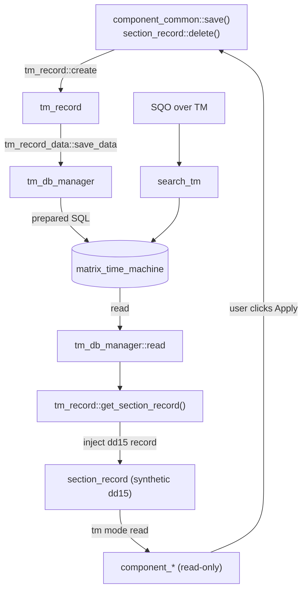

# tm_record

> The server class `tm_record` — the PHP runtime object for a single **Time Machine** row (one historical version of one component/section change) stored in the flat `matrix_time_machine` table.

> See also: [section_record](../sections/section_record.md) · [Sections concept](../sections/index.md) · [Components](../components/index.md) · [common contract](common.md)

This page is the **class-level reference** for `tm_record` and the Time Machine
(`dd15`) data model: how every component save also writes a versioned row, the
shape of the `matrix_time_machine` table, how a TM row is transformed back into a
renderable `section_record`, the read-only `tm` mode, and how a value is restored.

## Role

`tm_record` (in `core/tm_record/class.tm_record.php`) is a **plain PHP class**
— it does **not** `extend common` and it is **not** an ontology model. It
represents one row of the `matrix_time_machine` table: a single immutable
snapshot of the data a component (or a whole section, on delete) held at the
moment of a save.

It sits beside, not inside, the normal section machinery:

| class | role |
| --- | --- |
| **`tm_record`** *(this class)* | The Time Machine **row** orchestrator: `create()` (write a version on save), `search()`, `delete()`, and the load/read accessors. Its key transformation is `get_section_record()`, which turns the flat TM columns into a synthetic `dd15` [`section_record`](../sections/section_record.md) that the normal component pipeline can render. |
| **`tm_record_data`** (`class.tm_record_data.php`) | The per-row **column store** (mirrors `section_record_data`): an in-memory `stdClass` of the eight TM columns, with `read()` / `save_data()` / `delete()` delegating to `tm_db_manager`. One instance per `id`, cached in a static `$instances` map. |
| **`tm_db_manager`** (`core/db/class.tm_db_manager.php`) | The **SQL layer** for `matrix_time_machine`: `create()` / `read()` / `update()` / `delete()`, the column allowlist, and the JSON/int/timestamp column maps. All queries are prepared statements run through `matrix_db_manager::exec_search()`. |
| **`search_tm`** (`core/search/class.search_tm.php`) | The **search** variant for the TM table (`search_tm extends search`), used when an SQO runs against `matrix_time_machine`. |

!!! note "Not a `common` subclass"
    Unlike `section` / `section_record` / `component_*`, `tm_record` does **not**
    inherit `common`. It has no `tipo`/`mode`/`lang` identity quintet, no
    structure-context cache and no permissions of its own. The component identity
    and rendering machinery is only reached *indirectly*, via the synthetic
    `section_record` that `get_section_record()` builds for the `dd15` virtual
    section.

## Responsibilities

- **Versioning on save** — provide `create()`, the single entry point that other
  classes call after a successful save to persist the changed data as a new TM
  row (with timestamp, user, lang and an optional bulk-process id).
- **Self-healing of un-versioned data** — when `create()` is given the
  `$previous_data`, back-fill a missing prior version so the history is never
  left with an unrecorded baseline (the "old imports" case).
- **Read access** — load one row (`get_data()` / `get_element_data()`) through
  the cached `tm_record_data` instance.
- **Transformation to a renderable record** — `get_section_record()`: turn the
  flat columns (`section_id`, `timestamp`, `user_id`, `tipo`, `section_tipo`,
  `bulk_process_id`, `data`, and the linked annotation) into component-shaped
  data injected into a synthetic `dd15` `section_record`.
- **Write guards** — refuse to save or version `dd15` itself, and skip a list of
  excluded volatile/utility sections.
- **Row deletion** — `delete()` a TM row (used when a deleted section is finally
  recovered/purged).

## Data model

### The `matrix_time_machine` table

The TM table is **not** the typed-JSONB `matrix` shape used by normal sections.
It is a **flat** table whose columns map 1:1 to ontology tipos under the `dd15`
virtual section. The column allowlist lives in `tm_db_manager::$columns`:

| Column | TM tipo constant | tipo | temporal model | meaning |
| --- | --- | --- | --- | --- |
| `id` | `DEDALO_TIME_MACHINE_COLUMN_ID` | `dd1573` | `component_number` | row primary key (auto-increment) |
| `section_id` | `DEDALO_TIME_MACHINE_COLUMN_SECTION_ID` | `dd1212` | `component_number` | the **source** record's `section_id` |
| `section_tipo` | `DEDALO_TIME_MACHINE_COLUMN_SECTION_TIPO` | `dd1772` | `component_input_text` | the **source** record's `section_tipo` (e.g. `oh1`) |
| `tipo` | `DEDALO_TIME_MACHINE_COLUMN_TIPO` | `dd577` | `component_input_text` | the component tipo that changed (or the section tipo, on delete) |
| `lang` | — | — | — | language of the changed data |
| `timestamp` | `DEDALO_TIME_MACHINE_COLUMN_TIMESTAMP` | `dd559` | `component_date` | when the change happened |
| `user_id` | `DEDALO_TIME_MACHINE_COLUMN_USER_ID` | `dd578` | `component_portal` | user who made the change |
| `bulk_process_id` | `DEDALO_TIME_MACHINE_COLUMN_BULK_PROCESS_ID` | `dd1371` | `component_number` | bulk-operation id (or `null`) |
| `data` | `DEDALO_TIME_MACHINE_COLUMN_DATA` | `dd1574` | `component_json` | the actual changed data (JSONB) |

`tm_db_manager` classifies columns for parsing: `$json_columns` (`data`),
`$int_columns` (`id`, `section_id`, `user_id`, `bulk_process_id`) and
`$timestamp_columns` (`timestamp`). The constants are defined in
`core/base/dd_tipos.php`; the temporal model resolution for these tipos lives in
`ontology_node` (used until the shipped ontology carries the `dd15` definition).

!!! warning "The `section_tipo` column does NOT hold `dd15`"
    The most common Time Machine confusion. In a TM **row**, the `section_tipo`
    column stores the **source data section** (e.g. `oh1`, `mdcat2949`), *not*
    the Time Machine section `dd15`. The `dd15` tipo only appears in the **DDO /
    ontology paths** that describe the TM columns. A direct comparison of
    `path->section_tipo === row->section_tipo` therefore always fails for TM
    rows. `search_tm::build_main_where()` is deliberately empty for exactly this
    reason: *"matrix_time_machine table do not have self section_tipo column."*

### `dd15` is a virtual section

`dd15` (`DEDALO_TIME_MACHINE_SECTION_TIPO`) is an internal **virtual section**:
it has an ontology definition (its columns are the tipos above) but no rows of
its own in the `matrix` table — its "records" *are* the rows of
`matrix_time_machine`. Because of this, TM components cannot read their value
straight from the DB the way ordinary components do; the data has to be
**pre-populated** into a synthetic `section_record` first (see
[How a TM row becomes a record](#how-a-tm-row-becomes-a-renderable-record)).

## Instantiation & lifecycle

`tm_record` is **not** instanced with `new`; use the static factory, which takes
only the row `id` (the `matrix_time_machine` primary key):

```php
public static function get_instance( int $id ) : tm_record
```

- The (private) constructor sets `$this->id` and creates the per-row
  `tm_record_data` instance via `tm_record_data::get_instance($id)`. **Note:**
  unlike most Dédalo factories, `tm_record::get_instance()` is *not* cached — it
  returns a fresh `tm_record` each call (the docblock notes the shared data
  already lives in the cached `tm_record_data`).
- `tm_record_data` *is* cached, keyed by `id` in its static `$instances` map, and
  removes itself from that map in `__destruct()`. `tm_record::__destruct()`
  forwards to it.

```php
// load one Time Machine row by its matrix_time_machine id
$tm_record = tm_record::get_instance( 4096 );

// read the flat columns (forces a DB read once, then cached)
$data = $tm_record->get_data();
//   $data->section_id, $data->section_tipo, $data->tipo, $data->lang,
//   $data->timestamp, $data->user_id, $data->bulk_process_id, $data->data

// just the changed payload
$changed = $tm_record->get_element_data(); // === $data->data
```

### How a version is written on save

A TM row is **not** written by `tm_record` itself; it is written by the
callers, after a successful save, through `tm_record::create()`:

1. **`component_common::save()`** (`core/component_common/class.component_common.php`)
   — after `$section_record->save_component_data(...)`, when `section_id > 0`,
   the component is not temporal, `tm_record::$save_tm` is on, and the
   `section_tipo` is not excluded: it builds a `$tm_values` object
   (`section_id`, `section_tipo`, `tipo`, `lang`, optional `bulk_process_id`,
   and `data` from `get_time_machine_data_to_save()`) and calls
   `tm_record::create($tm_values, $previous_data)`. For a `component_dataframe`
   the `tipo` is rewritten to the **main** component tipo and the dataframe data
   is mixed into the main payload.
2. **`section_record::delete()`** — before deleting a record it snapshots the
   whole record `data` into a TM row (`tipo === section_tipo`), then re-reads it
   and asserts byte-for-byte equality before allowing the delete to proceed.

```php
$tm_values = new stdClass();
    $tm_values->section_id   = $section_id;
    $tm_values->section_tipo = $section_tipo;  // source section, e.g. 'oh1'
    $tm_values->tipo         = $tipo;          // changed component tipo, e.g. 'oh21'
    $tm_values->lang         = $lang;
    $tm_values->data         = $this->get_time_machine_data_to_save();

$tm_result = tm_record::create($tm_values, $previous_data);
// $tm_result is a tm_record instance on success, or false
```

!!! note "Disabling TM for a bulk operation"
    Set `tm_record::$save_tm = false` to suppress versioning globally (used by
    bulk operations such as *portalize* that would otherwise flood the history).
    Remember to restore it. `tm_record::$excluded_section_tipos` permanently
    skips volatile/utility sections: `DEDALO_TEMP_PRESET_SECTION_TIPO` (`dd655`),
    `DEDALO_TIME_MACHINE_SECTION_TIPO` (`dd15`) and `USER_ACTIVITY_SECTION_TIPO`
    (`dd1521`). The same exclusion list is consulted in `component_common::save()`.

### How a TM row becomes a renderable record

`get_section_record()` is the heart of the class. It reads the flat columns and
**injects** component-shaped data into a synthetic `dd15` `section_record` keyed
by the TM row `id` (not the source `section_id`). The private helper
`set_section_record_factory($tipo, $data, $section_record)` resolves the column
model via `ontology_node::get_model_by_tipo()` and the storage column via
`section_record_data::get_column_name($model)`, then calls
`$section_record->set_component_data($tipo, $column, $data)`.

It populates, in order:

- **`dd1212` section_id** → a `{id, value}` number.
- **`dd559` timestamp** → a `component_date` value via
  `dd_date::get_dd_date_from_timestamp()`.
- **`dd577` tipo** and **`dd1772` section_tipo** → the human term of the tipo,
  resolved with `ontology_node::get_term_by_tipo()` (the tipo is appended in
  `[brackets]` under `SHOW_DEBUG`).
- **`dd578` user_id** → a `locator` into `DEDALO_SECTION_USERS_TIPO`; the same
  locator is also injected under `DEDALO_SECTION_INFO_CREATED_BY_USER` (`dd200`)
  for metadata compatibility.
- **`rsc329` annotation** → searches the TM-notes section
  (`DEDALO_TIME_MACHINE_NOTES_SECTION_TIPO`, `rsc832`) for a note whose code
  matches this row `id`, instances that note component in `tm` mode, and injects
  its data plus the `parent_section_id` the client needs to build the note's
  target section.
- **`dd1371` bulk_process_id** → a `{id, value}` number.
- **`data`** — split by the *source* tipo's model:
  - if the source is a **whole section** (delete snapshot), each component's data
    is fanned out into its own column under its own `safe_tipo()`;
  - otherwise (a single component change) the payload is injected both under
    `dd1574` (the generic data column) **and** under the component's own tipo, so
    the normal `component->get_data()` path finds it.

```php
$tm_record     = tm_record::get_instance( $row_id );
$section_record = $tm_record->get_section_record(); // synthetic dd15 record, id = $row_id
// components instanced for dd15 + $row_id in 'tm' mode now read from this record
```

### The read-only `tm` component mode

Components that need to show a historical value are instanced in **`tm` mode**
(see the [Architecture overview](../architecture_overview.md#the-datum-contract):
modes are `edit` / `list` / `search` / `tm`). Two rules follow from the data
model:

- **Always instance with `dd15` and the TM row `id`** — *not* the source
  `section_tipo`/`section_id`:

  ```php
  // CORRECT — read a TM value
  $component = component_common::get_instance(
      $model,
      $tipo,                              // e.g. 'dd578'
      (int)$row->id,                      // the TM row PK, NOT row->section_id
      'tm',                               // read-only Time Machine mode
      DEDALO_DATA_NOLAN,
      DEDALO_TIME_MACHINE_SECTION_TIPO    // 'dd15', NOT row->section_tipo
  );
  ```

- **Pre-populate first.** Before instancing TM components, call
  `tm_record::get_section_record()` so the synthetic record cache holds the data;
  without it, components find nothing.

`tm` mode is **read-only**: saves are blocked (the same way `search` mode blocks
saves), and `tm_record::save()` itself refuses any row whose `section_tipo` is
`dd15`. The grid/list path is wired in `common::get_subdatum()` (the
`dd_grid` + `dd15` branch) and `sections_json.php`, which call
`tm_record::get_instance()` / `get_section_record()` to synthesise the row.

## Public API

Grouped by concern. *static?* marks class-level (static) methods.

### Lifecycle & row I/O

| method | static? | purpose |
| --- | --- | --- |
| `get_instance($id)` | ✓ | Build a (non-cached) `tm_record` for the given `matrix_time_machine` row id; creates the cached `tm_record_data`. |
| `create($values, $previous_data=null)` | ✓ | Validate and **insert a new TM version** via `tm_db_manager::create()`; returns a `tm_record` or `false`. Honours `$save_tm`, the `dd15` guard and `$excluded_section_tipos`; auto-fills `timestamp`/`user_id`; optionally back-fills a missing prior version (see below). |
| `delete()` | | Delete this row through `tm_record_data->delete()` and destroy the instance. |
| `__destruct()` | | Tear down the underlying `tm_record_data` instance. |

### Reading data

| method | static? | purpose |
| --- | --- | --- |
| `get_data()` | | Force a DB load and return all flat columns as an object (`id`, `section_id`, `section_tipo`, `tipo`, `lang`, `timestamp`, `user_id`, `bulk_process_id`, `data`). |
| `get_element_data()` | | Return just the changed payload (`$this->get_data()->data`). |
| `set_data($data)` | | Replace the in-memory column data (parsing JSON/int columns) via `tm_record_data->set_data()`. |
| `save()` | | Persist the current in-memory data via `tm_record_data->save_data()`. **Refuses** rows whose `section_tipo` is `dd15`. Used for *updates only*, never to create history. |

### Search & transformation

| method | static? | purpose |
| --- | --- | --- |
| `search($values, $limit=10, $offset=0, $order_by=null)` | ✓ | Direct, parameterised `SELECT * FROM matrix_time_machine WHERE …` over the column allowlist (`tm_db_manager::$columns`); default order `timestamp DESC`; returns a `db_result` (JSON columns decoded) or `false`. Used internally by `create()` to detect a missing prior version. |
| `get_section_record()` | | Transform this flat TM row into a synthetic `dd15` `section_record` with component-shaped, injected data. |
| `jsonSerialize()` | | Serialise the instance's non-null public vars (small payload). |

### Static configuration

| field | purpose |
| --- | --- |
| `tm_record::$save_tm` (bool, default `true`) | Global kill-switch for versioning; set `false` to suppress TM during a bulk op. |
| `tm_record::$excluded_section_tipos` (array) | Section tipos never versioned: `dd655`, `dd15`, `dd1521`. |

!!! note "Self-healing prior version (the `$previous_data` path in `create()`)"
    When `create()` receives `$previous_data` (the component's `db_data` before
    the save) and it differs from the new data, it `search()`es for an existing
    TM row matching the same `section_id`/`section_tipo`/`tipo`/`lang`. If none is
    found, it first writes a **second** row carrying the *previous* data with a
    timestamp one minute earlier and `bulk_process_id = null`, so a record edited
    before TM ever ran still gets a correct baseline to revert to. Only then does
    it insert the row for the new data.

### `tm_record_data` & `tm_db_manager` (supporting layers)

`tm_record_data` mirrors the `section_record_data` API on the eight TM columns:
`get_instance($id)`, `read($cache=true)`, `set_data()` / `set_column_data()`,
`get_data()` / `get_column_data()`, `save_data()` / `save_column_data()`,
`delete()`. `tm_db_manager` is the SQL boundary: static `create()` / `read()` /
`update()` / `delete()` over `matrix_time_machine`, all prepared statements run
through `matrix_db_manager::exec_search()`, with `pg_escape_identifier()` on
column names and `json_handler::encode()` for the `data` column.

## How it fits with the rest of Dédalo

Time Machine is a **cross-cutting audit/versioning layer**: it is fed by the
normal save pipeline and consumed by a read-only viewer, but it never owns the
live data.

1. **It is written *by* the save pipeline, not by the UI.** A component save
   (`component_common::save()`) and a record delete
   (`section_record::delete()`) are the only producers of TM rows, via
   `tm_record::create()`. Versioning is a side-effect of a successful write —
   there is no "save to Time Machine" action.

2. **It is read *through* the section/component pipeline.**
   `get_section_record()` synthesises a `dd15` [`section_record`](../sections/section_record.md)
   and the ordinary [components](../components/index.md) read from it in `tm`
   mode. The viewer therefore reuses the entire normal render path
   (`common::get_subdatum()` `dd_grid`+`dd15` branch, `sections_json.php`).

3. **Search uses a dedicated subclass.** Queries over the TM table go through
   `search_tm` (`search_tm extends search`) with a fixed
   `matrix_table = 'matrix_time_machine'`, an empty `build_main_where()` (no self
   `section_tipo` column), `SELECT *`, and a default `timestamp DESC` order. See
   the [SQO](../sqo.md) contract for the query shape it consumes.

4. **Restore is a normal save.** There is no server-side "restore" mutation. The
   `tool_time_machine` / `service_time_machine` clients load the historical
   value in `tm` mode (read-only), and the user's *Apply* writes that value back
   into the live record through the ordinary edit/save path — which, in turn,
   records a fresh TM version. So restoring is itself versioned.

5. **It respects worker hygiene only indirectly.** `tm_record` keeps no
   `common`-style structure caches; its only per-process state is the
   `tm_record_data::$instances` map keyed by row id, which each instance unsets
   in `__destruct()`.



## Examples

### List the recent history of one component value

```php
// build the column filter (must use the allowlisted column names)
$values = new stdClass();
    $values->section_tipo = 'oh1';   // SOURCE section, not dd15
    $values->section_id   = 42;
    $values->tipo         = 'oh21';  // the component whose history we want
    $values->lang         = DEDALO_DATA_LANG;

$db_result = tm_record::search($values, 20); // newest first (timestamp DESC)
if ($db_result !== false) {
    while ($row = $db_result->fetch_object()) {
        // $row->id is the TM row id; $row->data is the decoded payload
    }
}
```

### Render a historical row

```php
// 1. load the TM row and synthesise its dd15 section_record (populates the cache)
$tm_record     = tm_record::get_instance( (int)$row->id );
$section_record = $tm_record->get_section_record();

// 2. instance the component in 'tm' mode against dd15 + the TM row id
$component = component_common::get_instance(
    ontology_node::get_model_by_tipo('oh21', true),
    'oh21',
    (int)$row->id,                      // TM row id, NOT row->section_id
    'tm',
    DEDALO_DATA_NOLAN,
    DEDALO_TIME_MACHINE_SECTION_TIPO    // 'dd15'
);

// 3. read the historical value (read-only; save() is blocked in tm mode)
$old_value = $component->get_data();
```

### Suppress versioning during a bulk operation

```php
tm_record::$save_tm = false;   // disable TM
try {
    // ... bulk edits / portalize ...
} finally {
    tm_record::$save_tm = true; // always restore
}
```

## Related

- [section_record](../sections/section_record.md) — the per-record DB I/O object
  that `get_section_record()` synthesises for `dd15` and that `delete()` snapshots.
- [Sections concept](../sections/index.md) — the `matrix` storage model TM
  diverges from (TM is flat, not typed-JSONB).
- [Components](../components/index.md) — the fields whose every save writes a TM
  version, read back in `tm` mode.
- [common](common.md) — the base class `tm_record` deliberately does **not**
  extend; the `dd15` clamp in `common::get_permissions()` forces TM read-only.
- [Architecture overview](../architecture_overview.md) — the datum `{context,data}`
  and the `edit`/`list`/`search`/`tm` mode set.
- [Services](services.md) — `service_time_machine` is the client viewer that
  drives the read-only `tm`-mode history and the *Apply* (restore-as-save) flow.
- [SQO](../sqo.md) — the query shape `search_tm` consumes over the TM table.
- `core/db/class.tm_db_manager.php` — the SQL layer for `matrix_time_machine`.
- `core/search/class.search_tm.php` — the search variant for the TM table.
