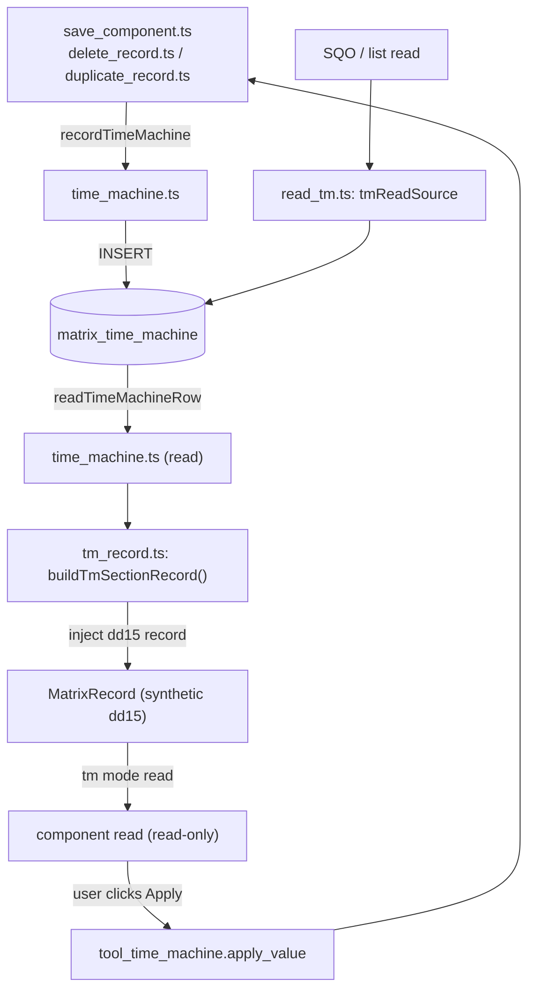

# tm_record

> See also: [section_record](../sections/section_record.md) · [Sections concept](../sections/index.md) · [Components](../components/index.md) · [common contract](common.md)

`src/core/tm_record/tm_record.ts` is the TS module for materializing a single
**Time Machine** row: one historical version of one component or section
change, stored in the flat `matrix_time_machine` table.

This page is the **module-level reference** for `tm_record.ts` and the Time
Machine (`dd15`) data model: how every component save also writes a versioned
row, the shape of the `matrix_time_machine` table, how a TM row is
transformed back into a renderable section record, the read-only `tm` mode,
and how a value is restored. TM-as-save-side-effect is preserved end to end;
Time Machine is served through the generic section read pipeline rather than
a bespoke viewer (see [How it fits](#how-it-fits-with-the-rest-of-dédalo)).

## Role

Time Machine is a handful of stateless modules, each owning one piece. Nothing is
instantiated and nothing is cached: one call is one function call.

| module | role |
| --- | --- |
| **`src/core/tm_record/tm_record.ts`** | The row **materializer**: `buildTmSectionRecord()` turns the flat Time Machine columns into a synthetic `dd15` [`section_record`](../sections/section_record.md)-shaped `MatrixRecord` that the normal component pipeline can render. It also owns the `dd15` column-tipo constants, `ddDateFromTimestamp()` and `termByTipo()`. |
| **`src/core/db/time_machine.ts`** | The **SQL layer** for `matrix_time_machine`: `recordTimeMachine()` (write one audit row), `readTimeMachineRow()` / `readTimeMachineHistory()` (read), the `TimeMachineRow` / `TimeMachineEntry` types and `TM_EXCLUDED_SECTIONS`. |
| **`src/core/resolve/read_tm.ts`** | The **read and list surface**: `tmReadSource` (a `SectionReadSource` plugged into the generic section-read pipeline), `buildTmWhere()` / `queryTmRows()`, and `emitTmRow()` (per-row cell emission). |
| **`tools/tool_time_machine/server/tool_time_machine.ts`** | `apply_value` — the restore action. |
| **`tools/tool_time_machine/server/bulk_revert.ts`** | `bulk_revert_process` — undo a whole `bulk_process_id` batch. |

## Responsibilities

- **Versioning on save** — `recordTimeMachine()` is the single entry point
  other modules call after a successful save to persist the changed data as a
  new TM row (with timestamp, user, lang and an optional `bulkProcessId`). It
  is invoked from `src/core/section/record/save_component.ts` (every
  component save) and `delete_record.ts`/`duplicate_record.ts` (record
  delete/duplicate snapshots).
- **Read access** — `readTimeMachineRow()` (one row by PK) and
  `readTimeMachineHistory()` (a component's history on one source record,
  newest first).
- **Transformation to a renderable record** — `buildTmSectionRecord()`: turn
  the flat columns (`section_id`, `timestamp`, `user_id`, `tipo`,
  `section_tipo`, `bulk_process_id`, `data`) into component-shaped data
  injected into a synthetic `dd15` `MatrixRecord`.
- **Write guards** — `TM_EXCLUDED_SECTIONS` refuses to version `dd15` itself, and
  `recordTimeMachine()` skips non-positive `section_id`s.
- **Row deletion** — none. The Time Machine surface is **append-only**: no
  function deletes a row.

!!! warning "Every component save writes a Time Machine row"
    `recordTimeMachine()` is called unconditionally from `save_component.ts`.
    There is no suppression switch a bulk operation can flip, so a large bulk edit
    writes one audit row per item. The bulk transforms that must *not* version
    (record relocation, for instance) avoid it by writing with a direct `UPDATE`
    rather than by going through the component-save path.

## Data model

### The `matrix_time_machine` table

The TM table is **not** the typed-JSONB `matrix` shape used by normal sections. It
is a **flat** table whose columns map 1:1 to ontology tipos under the `dd15`
virtual section. `src/core/db/time_machine.ts`'s `TimeMachineRow` interface is the
column allowlist:

| Column | TM tipo constant | tipo | temporal model | meaning |
| --- | --- | --- | --- | --- |
| `id` | `DEDALO_TIME_MACHINE_COLUMN_ID` | `dd1573` | `component_number` | row primary key (auto-increment) |
| `section_id` | `DEDALO_TIME_MACHINE_COLUMN_SECTION_ID` | `dd1212` | `component_number` | the **source** record's `section_id` |
| `section_tipo` | `DEDALO_TIME_MACHINE_COLUMN_SECTION_TIPO` | `dd1772` | `component_input_text` | the **source** record's `section_tipo` (e.g. `oh1`) |
| `tipo` | `DEDALO_TIME_MACHINE_COLUMN_TIPO` | `dd577` | `component_input_text` | the component tipo that changed (or the section tipo, on delete) |
| `lang` | — | — | — | language of the changed data |
| `timestamp` | `DEDALO_TIME_MACHINE_COLUMN_TIMESTAMP` | `dd559` | `component_date` | when the change happened |
| `user_id` | `DEDALO_TIME_MACHINE_COLUMN_USER_ID` | `dd578` | `component_portal` | user who made the change |
| `bulk_process_id` | `DEDALO_TIME_MACHINE_COLUMN_BULK_PROCESS_ID` | `dd1371` | `component_number` | bulk-operation id (or `null`) |
| `data` | `DEDALO_TIME_MACHINE_COLUMN_DATA` | `dd1574` | `component_json` | the actual changed data (JSONB) |

The `data` column is read and written through the shared `json_codec.ts` — a
`$n::text::jsonb` binding on write, and a `data::text` twin selected alongside
`data` on read. One codec, no per-column classification lists. The tipo constants
above resolve through the ontology (`src/core/ontology/resolver.ts`).

!!! warning "The `section_tipo` column does NOT hold `dd15`"
    This is the most common Time Machine mistake. In a TM **row**, the
    `section_tipo` column stores the **source data section** (`oh1`,
    `mdcat2949`, …) — *not* the Time Machine section `dd15`. The `dd15` tipo
    appears only in the ontology paths that describe the TM columns.

    `buildTmWhere()` (`src/core/resolve/read_tm.ts`) therefore never filters by
    `section_tipo = 'dd15'`. Add that filter "for correctness" and every Time
    Machine list goes empty.

### `dd15` is a virtual section

`dd15` (`TIME_MACHINE_SECTION_TIPO`, `src/core/db/time_machine.ts`) is an
internal **virtual section**: it has an ontology definition (its columns are
the tipos above) but no rows of its own in the `matrix` table — its
"records" *are* the rows of `matrix_time_machine`. Because of this, TM
components cannot read their value straight from the DB the way ordinary
components do; the data has to be **pre-populated** into a synthetic record
first (see
[How a TM row becomes a record](#how-a-tm-row-becomes-a-renderable-record)).

## Reading one row

There is no factory/instance to build — `readTimeMachineRow(tmRowId)`
(`src/core/db/time_machine.ts`) is a plain async function that selects one
row by its `matrix_time_machine` primary key and returns a `TimeMachineRow`
or `null`:

```typescript
import { readTimeMachineRow } from '../db/time_machine.ts';

// load one Time Machine row by its matrix_time_machine id
const row = await readTimeMachineRow(4096);
//   row.section_id, row.section_tipo, row.tipo, row.lang,
//   row.timestamp, row.user_id, row.bulk_process_id, row.data
```

### How a version is written on save

A TM row is written by the **callers**, after a successful save, through
`recordTimeMachine()`:

1. **`src/core/section/record/save_component.ts`** — after the component's new
   data is persisted, it builds a `TimeMachineEntry` (`sectionTipo`, `sectionId`,
   `componentTipo`, `lang`, `userId`, `data`) and calls
   `recordTimeMachine(entry, nowDbTimestamp())`. For a translatable component the
   snapshot is the **current-lang slice**, not the whole value.
2. **`src/core/section/record/delete_record.ts`** — before deleting a record it
   snapshots the whole record's JSONB columns into one TM row
   (`componentTipo === sectionTipo`, `lang: 'lg-nolan'`).
3. **`src/core/section/record/duplicate_record.ts`** — the per-component
   back-fill pair described below.

```typescript
import { recordTimeMachine, nowDbTimestamp } from '../db/time_machine.ts';

await recordTimeMachine(
  {
    sectionId,
    sectionTipo,  // source section, e.g. 'oh1'
    componentTipo: tipo, // changed component tipo, e.g. 'oh21'
    lang,
    userId,
    data: tmSnapshot,
  },
  nowDbTimestamp(),
);
```

!!! note "The back-fill lives in the callers, not in recordTimeMachine()"
    `recordTimeMachine()` is a **pure insert** — it holds no "self-healing" logic.

    A record edited before Time Machine ever ran has no baseline to revert to, so
    `delete_record.ts` and `duplicate_record.ts` compute a back-fill timestamp
    (`now - 60s`) and call `recordTimeMachine()` **twice**: once for the previous
    data, once for the new. The ordinary per-save path in `save_component.ts` does
    not back-fill; only the delete and duplicate flows do.

### How a TM row becomes a renderable record

`buildTmSectionRecord()` (`src/core/tm_record/tm_record.ts`) is the heart of
the module. It reads the flat columns and **injects** component-shaped data
into a synthetic `dd15` `MatrixRecord` keyed by the TM row `id` (not the
source `section_id`), using the shared substitution API
(`src/core/section_record/virtual_record.ts`'s `makeVirtualRecord()` /
`injectComponentData()` / `injectColumnData()`). The private helper
`injectTmField()` resolves the column model via `getModelByTipo()` and the storage
column via `getColumnNameByModel()`.

It populates, in order:

- **`dd1212` section_id** → a `{id, value}` number.
- **`dd559` timestamp** → a `component_date` value via `ddDateFromTimestamp()`.
- **`dd577` tipo** and **`dd1772` section_tipo** → the human term of the tipo,
  resolved with `termByTipo()` (a `SELECT term FROM dd_ontology` lookup).
- **`dd578` user_id** → a `dd151` locator into the users section (`dd128`); the
  same locator is also injected under `dd200` (created-by-user) for metadata
  compatibility.
- **`rsc329` annotation** → an empty placeholder (`[{parent_section_id: null}]`).
- **`dd1371` bulk_process_id** → a `{id, value}` number.
- **`data`** — split by the *source* tipo's model:
  - if the source is a **whole section** (delete snapshot), each component's
    data is adopted wholesale under its own JSONB column;
  - otherwise (a single component change) the payload is injected both under
    `dd1574` (the generic data column) **and** under the component's own
    tipo, so the normal component read path finds it.

```typescript
import { buildTmSectionRecord } from '../tm_record/tm_record.ts';
import { readTimeMachineRow } from '../db/time_machine.ts';

const row = await readTimeMachineRow(rowId);
const record = row !== null ? await buildTmSectionRecord(row, lang) : null;
// components reading dd15 + rowId in 'tm' mode now read from this record
```

### The read-only `tm` component mode

Components that need to show a historical value are read in **`tm` mode**
(see the [Architecture overview](../architecture_overview.md) datum contract:
modes are `edit` / `list` / `search` / `tm`). Two rules follow from the data
model, both still true of the TS pipeline:

- **Always address `dd15` and the TM row `id`** — *not* the source
  `section_tipo`/`section_id`. `read_tm.ts`'s `emitTmRow()` stamps every
  emitted item's `section_tipo: 'dd15'`, `section_id: row.id`, `mode: 'tm'`.
- **Pre-populate first.** `emitTmRow()` builds (and memoizes, per row) the
  virtual record via `buildTmSectionRecord()` before resolving any of the
  section's own component columns from it — without it there is nothing to
  read.

`tm` mode is read-only in the sense that the TM read source never writes. There is
no "save blocked in tm mode" guard, because the generic write path is never
reached from a TM read at all — the client's *Apply* button drives a
**different**, explicit action
(`tool_time_machine.apply_value`, see [Restore](#restore-is-a-normal-save)),
not a save through the `tm`-mode component.

## Public API

### `src/core/tm_record/tm_record.ts`

| function | purpose |
| --- | --- |
| `buildTmSectionRecord(row, lang)` | Transform one `TimeMachineRow` into a synthetic `dd15` `MatrixRecord` with component-shaped, injected data. |
| `ddDateFromTimestamp(timestamp)` | Parse a Postgres timestamp string into the `dd_date` object shape. |
| `termByTipo(tipo, lang)` | The display term of one ontology node in the request lang, falling back to `lg-spa` then any populated language, then the bare tipo. |

### `src/core/db/time_machine.ts`

| function | purpose |
| --- | --- |
| `readTimeMachineRow(tmRowId)` | Read one row by its `matrix_time_machine` primary key, or `null`. |
| `readTimeMachineHistory(sourceSectionTipo, sourceSectionId, componentTipo, limit?)` | A component's change history on one source record, newest first (`ORDER BY timestamp DESC`). |
| `recordTimeMachine(entry, timestamp)` | Insert one audit row. No-ops for `section_id <= 0` or an excluded section tipo. |
| `nowDbTimestamp()` | The current time as a Postgres-style timestamp string. |
| `TM_EXCLUDED_SECTIONS` | The section tipos never versioned — `dd15` itself. |

There is **no** row-deletion function: Time Machine rows are never deleted by this
server. There is likewise no generic multi-row search here — the
missing-prior-version lookup is inlined per caller (see the back-fill note above)
rather than exposed as a reusable primitive.

### `src/core/resolve/read_tm.ts`

| export | purpose |
| --- | --- |
| `tmReadSource` | The `SectionReadSource` implementation plugged into the generic section-read pipeline for `dd15` (`getRows`/`count`/`emitRow`/`buildContext`). |
| `readTimeMachineData(rqo)` | Direct-caller adapter: runs the TM query and assembles the standard `{sections envelope, per-row data}` shape (what the generic pipeline does internally). |
| `countTimeMachineData(rqo)` | Pagination count over the same query. |

## How it fits with the rest of Dédalo

Time Machine is a **cross-cutting audit and versioning layer**: it is fed by the
normal save pipeline and consumed by a read-only viewer, and it never owns the
live data.

1. **It is written *by* the save pipeline, not by the UI.** A component save
   (`save_component.ts`) and a record delete (`delete_record.ts`) are the
   producers of TM rows, via `recordTimeMachine()`. Versioning is a
   side-effect of a successful write — there is no "save to Time Machine"
   action.

2. **It is read through the generic section read pipeline, not a bespoke
   viewer.** `dd15` is served as a **normal section** over
   `src/core/resolve/read_tm.ts`'s `tmReadSource`, wired into the same
   generic `readSectionRows`/envelope/count machinery every other section
   uses (see the [section family](../sections/index.md)); only row
   acquisition (`matrix_time_machine`, not `matrix`) and per-row cell policy
   differ. `buildTmSectionRecord()` is the single place that knows the dd15
   field mapping — it used to be duplicated between `read_tm.ts` and
   `tool_time_machine.ts` before being consolidated into `tm_record.ts`.

3. **The TM read owns its own SQL.** `buildTmWhere()` / `queryTmRows()` build the
   `WHERE`, `ORDER BY` and pagination directly. There are three scoping surfaces:
   `filter_by_locators` for a per-component history, a `tipo` column filter for the
   record-snapshot list, and **no scope at all** for the bare `dd15` list — which
   deliberately returns *every* row. SQO-driven **filters** against
   `matrix_time_machine` from other entry points go through the `_tm` twin branches
   inside the generic search builders instead
   (`src/core/search/builders/builder_relation.ts`).

4. **Restore is a normal save, wrapped in an explicit tool action.**
   `apply_value` (`tools/tool_time_machine/server/tool_time_machine.ts`) writes the
   historical snapshot back into the live record through the normal write
   chokepoint (`persistRecordColumns` / `persistRecordKeys`, stripping dataframe
   frame entries first) and then calls `recordTimeMachine()` again — so the restore
   itself creates a fresh version. The consumed TM row is **kept**: the fresh audit
   row simply supersedes it in the list.

   `bulk_revert_process` (`bulk_revert.ts`) is the batch analogue: it walks a whole
   `bulk_process_id`'s history back to its pre-batch state and re-applies it under
   a **new** `bulk_process_id`, so the revert is itself revertible.

5. **Worker hygiene is a non-issue by construction.** There is no
   `tm_record_data::$instances`-style static cache to unset — see the "No
   cached-instance layer" note above.



## Examples

### List the recent history of one component value

```typescript
import { readTimeMachineHistory } from '../db/time_machine.ts';

const history = await readTimeMachineHistory('oh1', 42, 'oh21', 20); // newest first
for (const row of history) {
  // row.id is the TM row id; row.data is the decoded payload
}
```

### Render a historical row

```typescript
import { readTimeMachineRow } from '../db/time_machine.ts';
import { buildTmSectionRecord } from '../tm_record/tm_record.ts';

// 1. load the TM row and synthesize its dd15 record (populates the cache for this call)
const row = await readTimeMachineRow(rowId);
const record = row !== null ? await buildTmSectionRecord(row, lang) : null;

// 2. the section read pipeline resolves component 'oh21' in 'tm' mode against
//    dd15 + rowId from this record — there is no separate component-instance
//    step to drive by hand; read_tm.ts's emitTmRow does it inline per request.
```

### Restore a historical value

```typescript
// via the tool action, not a direct save:
// POST tool action tool_time_machine.apply_value
// { model: 'component', matrix_id: rowId, tipo: 'oh21', section_tipo: 'oh1', section_id: 42 }
// → writes the TM snapshot back into the live record, then records a fresh
//   TM version of the restored value.
```

## Related

- [section_record](../sections/section_record.md) — the per-record DB I/O
  object `buildTmSectionRecord()` synthesizes for `dd15` and that
  `delete_record.ts` snapshots.
- [Sections concept](../sections/index.md) — the `matrix` storage model TM
  diverges from (TM is flat, not typed-JSONB).
- [Components](../components/index.md) — the fields whose every save writes a
  TM version, read back in `tm` mode.
- [common](common.md) — the shared read/permission contract; the `dd15`
  admin-only clamp when addressed directly is enforced the same way as any
  other section-level permission gate.
- [Architecture overview](../architecture_overview.md) — the datum
  `{context,data}` shape and the `edit`/`list`/`search`/`tm` mode set.
- [Services](services.md) — the client viewer that drives the read-only
  `tm`-mode history and the *Apply* (restore-as-save) flow.
- `src/core/db/time_machine.ts` — the SQL layer for `matrix_time_machine`.
- `src/core/resolve/read_tm.ts` — the search/list read surface for the TM table.
