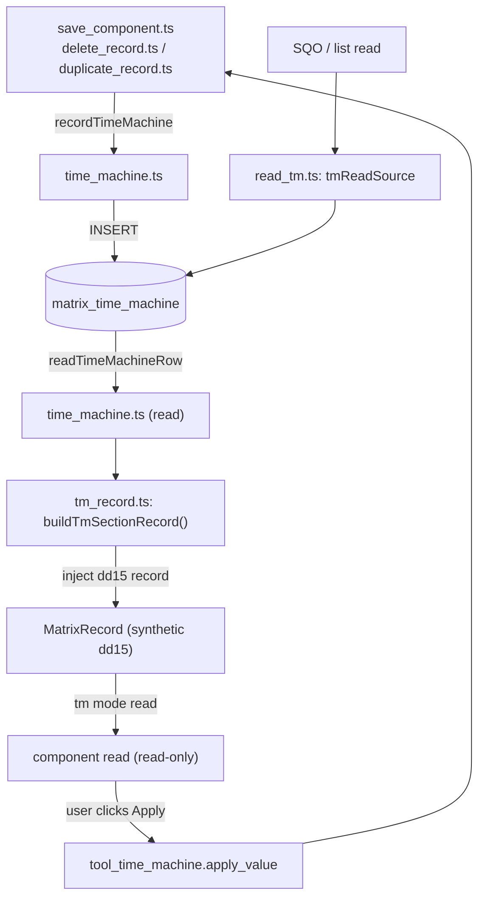

# tm_record

> See also: [section_record](../sections/section_record.md) · [Sections concept](../sections/index.md) · [Components](../components/index.md) · [common contract](common.md)

`src/core/tm_record/tm_record.ts` is the TS module for materializing a single
**Time Machine** row: one historical version of one component or section
change, stored in the flat `matrix_time_machine` table.

This page is the **module-level reference** for `tm_record.ts` and the Time
Machine (`dd15`) data model: how every component save also writes a versioned
row, the shape of the `matrix_time_machine` table, how a TM row is
transformed back into a renderable section record, the read-only `tm` mode,
and how a value is restored. TM-as-save-side-effect is preserved end to end;
Time Machine is served through the generic section read pipeline rather than
a bespoke viewer (see [How it fits](#how-it-fits-with-the-rest-of-dédalo)).

## Role

Time Machine is a handful of stateless modules, each owning one piece. Nothing is
instantiated and nothing is cached: one call is one function call.

| module | role |
| --- | --- |
| **`src/core/tm_record/tm_record.ts`** | The row **materializer**: `buildTmSectionRecord()` turns the flat Time Machine columns into a synthetic `dd15` [`section_record`](../sections/section_record.md)-shaped `MatrixRecord` that the normal component pipeline can render. It also owns the `dd15` column-tipo constants, `ddDateFromTimestamp()` and `termByTipo()`. |
| **`src/core/db/time_machine.ts`** | The **SQL layer** for `matrix_time_machine`, and its single writer: `recordTimeMachine()` (one ordinary audit row), the bulk undo-log writers `recordBulkPair()` / `recordBulkBirth()` / `recordBulkCascadeDelete()`, `readTimeMachineRow()` / `readTimeMachineHistory()` (visible rows only), the `TimeMachineRow` / `TimeMachineEntry` types, `TM_ROLE` and `TM_EXCLUDED_SECTIONS`. |
| **`src/core/resolve/read_tm.ts`** | The **read and list surface**: `tmReadSource` (a `SectionReadSource` plugged into the generic section-read pipeline), `buildTmWhere()` / `queryTmRows()`, and `emitTmRow()` (per-row cell emission). |
| **`tools/tool_time_machine/server/tool_time_machine.ts`** | `apply_value` — the restore action. |
| **`tools/tool_time_machine/server/bulk_revert.ts`** | `bulk_revert_process` — undo a whole `bulk_process_id` batch. |

## Responsibilities

- **Versioning on save** — `recordTimeMachine()` is the entry point
  other modules call after a successful save to persist the changed data as a
  new TM row (with timestamp, user and lang). A save that is part of a bulk run
  records through `recordBulkPair()` instead (see
  [The bulk undo log](#the-bulk-undo-log)). It is invoked from `src/core/section/record/save_component.ts` (every
  component save) and `delete_record.ts`/`duplicate_record.ts` (record
  delete/duplicate snapshots).
- **Read access** — `readTimeMachineRow()` (one row by PK) and
  `readTimeMachineHistory()` (a component's history on one source record,
  newest first). Both see visible rows only.
- **Transformation to a renderable record** — `buildTmSectionRecord()`: turn
  the flat columns (`section_id`, `timestamp`, `user_id`, `tipo`,
  `section_tipo`, `bulk_process_id`, `data`) into component-shaped data
  injected into a synthetic `dd15` `MatrixRecord`.
- **Write guards** — `TM_EXCLUDED_SECTIONS` refuses to version `dd15` itself, and
  `recordTimeMachine()` skips non-positive `section_id`s.
- **Row deletion** — none. The Time Machine surface is **append-only**: no
  function deletes a row.

!!! warning "Every component save writes a Time Machine row — outside a bulk run, even an unchanged one"
    Outside a bulk run, `save_component.ts` records a row on every save — even
    when the new value equals the stored one — unless the caller passed
    `saveTm: false`. **Under a bulk id the law is different** (every CSV,
    MARC21 or Zotero import, propagate, update cache and bulk revert save): the
    save writes its [undo pair](#the-bulk-undo-log) whatever `saveTm` says, and
    a save whose value did not change writes **nothing**. So re-importing an
    unchanged CSV file, in *Replace* or *Append* mode, leaves history untouched,
    and a bulk run has no switch that turns its history off. An **append** save
    that adds something writes the same visible row a replace save writes —
    tagged with the saved language, holding the value after the save. The bulk
    transforms that must *not* version (record relocation, for instance) avoid it
    by writing with a direct `UPDATE` rather than by going through the
    component-save path.

## Data model

### The `matrix_time_machine` table

The TM table is **not** the typed-JSONB `matrix` shape used by normal sections. It
is a **flat** table whose columns map 1:1 to ontology tipos under the `dd15`
virtual section. `src/core/db/time_machine.ts`'s `TimeMachineRow` interface is the
column allowlist:

| Column | TM tipo constant | tipo | temporal model | meaning |
| --- | --- | --- | --- | --- |
| `id` | `DEDALO_TIME_MACHINE_COLUMN_ID` | `dd1573` | `component_number` | row primary key (auto-increment) |
| `section_id` | `DEDALO_TIME_MACHINE_COLUMN_SECTION_ID` | `dd1212` | `component_number` | the **source** record's `section_id` |
| `section_tipo` | `DEDALO_TIME_MACHINE_COLUMN_SECTION_TIPO` | `dd1772` | `component_input_text` | the **source** record's `section_tipo` (e.g. `oh1`) |
| `tipo` | `DEDALO_TIME_MACHINE_COLUMN_TIPO` | `dd577` | `component_input_text` | the component tipo that changed (or the section tipo, on delete) |
| `lang` | — | — | — | language of the changed data |
| `timestamp` | `DEDALO_TIME_MACHINE_COLUMN_TIMESTAMP` | `dd559` | `component_date` | when the change happened |
| `user_id` | `DEDALO_TIME_MACHINE_COLUMN_USER_ID` | `dd578` | `component_portal` | user who made the change |
| `bulk_process_id` | `DEDALO_TIME_MACHINE_COLUMN_BULK_PROCESS_ID` | `dd1371` | `component_number` | bulk-operation id (or `null`) |
| `data` | `DEDALO_TIME_MACHINE_COLUMN_DATA` | `dd1574` | `component_json` | the actual changed data (JSONB) |
| `tm_role` | — | — | — | `NULL` for an ordinary, visible row; `1`, `3` or `4` for a hidden [undo-log](#the-bulk-undo-log) row |

The `data` column is read and written through the shared `json_codec.ts` — a
`$n::text::jsonb` binding on write, and a `data::text` twin selected alongside
`data` on read. One codec, no per-column classification lists. The tipo constants
above resolve through the ontology (`src/core/ontology/resolver.ts`).

!!! warning "The `section_tipo` column does NOT hold `dd15`"
    This is the most common Time Machine mistake. In a TM **row**, the
    `section_tipo` column stores the **source data section** (`oh1`,
    `mdcat2949`, …) — *not* the Time Machine section `dd15`. The `dd15` tipo
    appears only in the ontology paths that describe the TM columns.

    `buildTmWhere()` (`src/core/resolve/read_tm.ts`) therefore never filters by
    `section_tipo = 'dd15'`. Add that filter "for correctness" and every Time
    Machine list goes empty.

### `dd15` is a virtual section

`dd15` (`TIME_MACHINE_SECTION_TIPO`, `src/core/db/time_machine.ts`) is an
internal **virtual section**: it has an ontology definition (its columns are
the tipos above) but no rows of its own in the `matrix` table — its
"records" *are* the rows of `matrix_time_machine`. Because of this, TM
components cannot read their value straight from the DB the way ordinary
components do; the data has to be **pre-populated** into a synthetic record
first (see
[How a TM row becomes a record](#how-a-tm-row-becomes-a-renderable-record)).

### The bulk undo log

A bulk run (a `dd800` bulk-process record) must be revertible **exactly**, so
every save it makes records what it replaced, not only what it left. Those extra
rows are marked by `tm_role` (migration `install/db/migrations/0010_tm_role.sql`)
and never shown:

| `tm_role` | row | visible in `dd15` |
| --- | --- | --- |
| `NULL` | every ordinary row — every non-bulk write, and the AFTER row of every bulk save | yes |
| `1` | BEFORE image: the exact region the bulk save replaced (`data` NULL = the region held nothing: the key was absent, stored JSON `null`, or — for a lang-sliced model — held no item of that language) | no |
| `3` | BIRTH marker: a record the run created (`tipo` = the section tipo, `lg-nolan`, `data` = its birth image: the projects filter and `dato_default` values the create wrote, or the snapshot a revert's undelete restored) | no |
| `4` | the whole-record snapshot of a record the run's dataframe cascade deleted | no (the ordinary delete snapshot stays visible) |

**The pair law.** A save carrying a bulk id writes, for every key it changes (the
modified stamps excepted, see below), a
role-1 BEFORE row and then its ordinary visible row, both with the bulk id, one
shared timestamp, inside the save's transaction (`recordBulkPair()`); whatever
`saveTm` says. A save whose region is byte-equal before and after writes nothing.
The REGION is what a write in that language owns: for a lang-sliced model, every
item that is not another language's (lang-less items included); for any other
model, the whole key (`src/core/concepts/lang_region.ts`). A main component with
dataframe slots has its pairs in [two lanes](#dataframe-mains-two-lanes): one pair
per language it changed (that language's value), and one `lg-nolan` pair (its
`lg-nolan` value + every frame) when a frame or the `lg-nolan` value changed; a save
of one of its slots writes the main's `lg-nolan` pair, never one under the slot tipo.
BEFORE is cloned from the value read under the save's row lock; AFTER is re-read
from the row inside the same transaction (`src/core/section/record/bulk_capture.ts`).

**The visibility law.** Every reader that serves history — the `dd15` list and
count, a component's history, the `dd1371` filters, a preview, `apply_value`, the
backfill probes of delete (record and data) / observers — narrows with `withTmHistory()` or
`tmVisiblePredicate()` (`src/core/db/record_generation.ts`), so roles 1, 3 and 4
never reach it. Only `bulk_revert_process` reads every role. `update_cache`'s
media repair is a named exemption (its `files_info` is derived from the files, and
files it moves cannot be moved back by a revert). So is the CSV importer's
`data`-column twin of `dd199`/`dd200` (`created_date`, `created_by_user_id`): a
revert re-derives it from the restored component and reports it `metadata_twin`.
So are the record's modified stamps `dd197`/`dd201` (modified by, modified date):
every save restamps them beside its value without a pair, so after a revert they
show the revert as the record's latest modification, not the pre-run stamps. Only a
run that wrote them itself as columns (a CSV carrying `dd197`/`dd201`) gets them
back, through their own units.
If migration 0010 did not land at boot, the boot adds the column itself right after
the migration run, before the first request (`runBootSchema()` in
`install/db/migrate.ts`). Should that fail too, it is added by the first caller of
`ensureTmHistoryReady()` (→ `ensureTmRoleColumn()`) outside a transaction: every
time-machine reader, and every bulk run as it starts (`withLiveBulkRun()` in
`src/core/tools/bulk_run_registry.ts`, before its first write). The undo-log
writers never add it themselves, because each runs inside a transaction. Until the
column exists, every reader and undo-log writer fails closed with a typed error, and
the next caller tries the heal again. The heal's statistics step (ANALYZE) is
best-effort: if it fails, it is logged and the column stays added. An ordinary record
creation never needs the column. A bulk create does, for its birth marker, and its
run's start has healed the column by then.
The installer applies 0010 itself right after restoring the seed.

The `dd15` count is TOTAL − HIDDEN in one statement (`tmHistoryCountSql()` in
`src/core/resolve/read_tm.ts`) rather than a count of `tm_role IS NULL` rows, so it
stays index-only on a large table: the hidden half reads the partial index
`matrix_time_machine_tm_role_hidden_idx` (`WHERE tm_role IS NOT NULL`). Migration
`install/db/migrations/0011_tm_role_hidden_index.sql` builds that index and gives
`tm_role` its planner statistics. The deep-page list (`tmLatePageSql()`) finds its page
of ids on the partial index `matrix_time_machine_history_visible_idx` (`WHERE tm_role
IS NULL`, migration `0012_tm_history_visible_index.sql`), so that walk stays index-only
too. 0011 and 0012 are **online** migrations (`install/db/online_migration.ts`): they
do not run at boot. After the server's listener binds, they build their index
`CONCURRENTLY` in the background, outside any transaction. A migration is recorded
as applied only once its index is `VALID`; a failed or interrupted build is dropped
and retried on the next boot. Until the build lands, the `dd15` count and deep page
are correct but slower (no index to walk). Boot migrations run without a statement
timeout, so a long boot migration is never cut off by `DB_STATEMENT_TIMEOUT_MS`.

### Dataframe mains: two lanes

A [dataframe](../components/component_dataframe.md) frame qualifies one item of its
main component (`id_key` → the item's `id`), so the two halves are one statement:
neither can be read or restored without the other. The frames are stored apart, under
the slot's own tipo in the record's `relation` column; their history is kept under the
**main's** tipo — never under the slot's — in one of two kinds of **lane**
(`src/core/relations/main_lanes.ts`):

| Lane | Row `lang` | What the row holds |
|---|---|---|
| a language lane | `lg-spa`, `lg-ell`… | only that language's value — no frame |
| the frame lane | `lg-nolan` | the main's `lg-nolan` value (may be empty) + **all** frames of **all** its slots |

On the `oh1` (Oral History) section, for example, `oh24` (*Informants*, a
`component_portal`, not translatable) has the slot `oh115` (*Role*, a
`component_dataframe`): every history row of `oh24` is an `lg-nolan` row holding the
informant locators followed by every `oh115` frame (the `dd490` locators), and `oh115`
has no history rows of its own.

- **The lane follows the data shape, never the ontology flag.** A main whose data is
  not split by language — every relation (`component_portal`, `component_select`,
  `component_check_box`, `component_radio_button`, `component_filter`, the
  `component_relation_*` family…) and every other unsliced model — keeps its whole
  value in `lg-nolan`, **always**: each save writes one `lg-nolan` row (value + frames),
  whatever the node's `translatable` flag says and whatever the working language, and
  every language's history lists **all** its rows, whatever language tag an older
  (Dédalo v6) row carries — v6 tagged a relation marked translatable with the working
  language, and each such row holds the whole value. The delete doors' backfill probe
  counts those rows too, so no redundant `lg-nolan` row is written over them. A relation holds locators, which are never
  translatable, so a "translatable portal" is an ontology setting the history ignores.
  Language lanes exist only for lang-sliced models (`component_input_text`,
  `component_text_area`, `component_iri`…).
- **One rule for every sliced main.** A non-translatable one keeps its whole value in
  `lg-nolan`, so each save writes one `lg-nolan` row: value + frames. A translatable
  sliced main has no `lg-nolan` value, so its `lg-nolan` rows hold the frames only — the
  shared frame lane of all its languages. A *transliterable* main
  (`with_lang_versions`, such as a person's name, `rsc85` in `rsc197`) keeps its base
  form in `lg-nolan` and each transliteration in its own language (*Augustus* in
  `lg-nolan`, *Αύγουστος* in `lg-ell`): its `lg-nolan` row is the base + the frames,
  its language rows the transliterations. No flag is read: every item's own `lang`
  places it. A value item with no language at all (a v6 orphan) is recorded in the row of
  the language that saved it; a translatable main's `lg-nolan` row never holds one.
- **What a save writes.** A save of the main in language X writes ONE row in lane X,
  plus an `lg-nolan` row only when the save changed the frames (removing an item strips
  its frames) or the `lg-nolan` value — the `lg-nolan` row first, so the language row
  sits above its own save's frame change and the state at it is the state after the save.
  A save of a frame — added, edited or removed —
  writes ONE `lg-nolan` row of the main it belongs to (the caller's main, else the mains
  named by the changed frames, else the slot's parent component), whatever the number of
  languages: no copy per language. A frame save no main can own is refused
  (`engine.uncovered_scope`); a record delete, **Delete data** or a locator removal that
  strips such a frame removes it and writes no history for it. Every door follows the
  same rule (`recordMainHistory()`, `src/core/relations/dataframe_slots.ts`): the
  component save, a CSV dataframe column or legacy envelope, a main-item removal's
  cascade, a portal locator removal, a record delete that strips frames pointing at it,
  *Delete data*, a translation (`tool_lang`: its target language's row only), a
  duplicate (its frames first, then the copy's value per language) and the restores.
- **The state at a row.** Saves to one record are serialised by the record's row lock,
  so row ids follow the real order. The state at row R is rebuilt from the lanes: each
  language's value is the newest row of that language with an id up to R; the frames
  are those of the newest frame-state row up to R (an `lg-nolan` row, or a Dédalo v6
  row carrying frames — `readFrameStateRowAt()`); the `lg-nolan` value is that of the
  newest `lg-nolan` row up to R (`src/core/tm_record/lane_state.ts`).
- **The frame lane is complete.** Before a language row is written, the newest
  frame-state row must hold the main's frames and `lg-nolan` value as they are: when it
  does not (frames written by a door that records no history — a migration, an import
  made with the time machine off), one `lg-nolan` row of that state is written first
  (`recordFrameLaneBaseline()`). So restoring a language row never rolls frames back to
  an older recorded state, or empties frames that were never recorded.
- **The history list.** The history of a lang-sliced main in language X lists the rows of
  X **and** of `lg-nolan` — whether its dataframe is declared or only holds its frames.
  An unsliced main's history is every row of it, whatever the tag (see above).
  A non-translatable main that keeps language versions (a transliterable name, asked in
  `lg-nolan`) lists its `lg-nolan` rows and the rows of the working data language, so
  *Αύγουστος* appears while working in Greek; the preview of such a row shows the base
  form and the frames as of it, not the transliteration itself (the component read does
  not yet serve transliterations — `transliterate_value`), and restoring it puts the
  transliteration back. Every row's preview shows the full state at that row —
  its language's value as it stood, and its frames as they stood — so an intermediate
  state is visible exactly as it was. The row's own language and the frames are shown
  exactly as a restore would write them (`previewLaneValue()`, sharing
  `restoredLaneValue()` with the restore); the other lane is shown as it stood, which a
  restore leaves as it is now.
- **Restoring a row.** Restoring a language row puts that language's value back and the
  frames as they stood at that row; the other languages stay as they are. Restoring an
  `lg-nolan` row puts the `lg-nolan` value and the frames of that row back. Frames of
  another main in a shared slot are never touched. A frame of an item that existed then
  and no longer exists in any language is not written back (it would pair nothing). The
  restore writes its own rows by the same rule.
- **Any save order.** A frame saved before its item, even while the main is still
  empty, is simply an `lg-nolan` row: the state at every row is complete, and restoring
  it returns that state.
- **Dédalo v6 rows.** A v6 save of the main (one language's value + the frames) gives
  that language's value, and its frames are the frame state of that moment. A v6 save
  of a dataframe (`lg-nolan`, the main in every language + the frames) is read as the
  `lg-nolan` lane: its `lg-nolan` items and its frames; the other languages' items are
  ignored (for a translatable main, only its frames come back). A dataframe a row is
  silent about was **empty** at that time (`rowSlotTipos()`). A v6 row of one language
  that carries no frame cannot be told from a v7 language row, so it is read as one: its
  frames are those of the newest frame state below it. v7 beta rows written before the
  two lanes are not supported history.
- **Row shapes are still parsed.** A literal main's frames wrapped as
  `{value: {frame}}` by the v6→v7 reformat are unwrapped.
- **A main with no slot** writes exactly its language rows (a non-translatable one: its
  one `lg-nolan` row).
- **Any main model.** A dataframe can hang from a relation main (a portal, a select…:
  the slot is a ddo of its request config) or from a literal main (text, number, date,
  email, iri — including component_iri's fixed `dd560` label slot — with
  `has_dataframe: true`), translatable, transliterable or not. The lanes, the restore
  and the bulk revert are the same for all of them; a literal main's frames stay in the
  `relation` column, never in the literal's own.

## Reading one row

There is no factory/instance to build — `readTimeMachineRow(tmRowId)`
(`src/core/db/time_machine.ts`) is a plain async function that selects one
row by its `matrix_time_machine` primary key and returns a `TimeMachineRow`
or `null`:

```typescript
import { readTimeMachineRow } from '../db/time_machine.ts';

// load one Time Machine row by its matrix_time_machine id
const row = await readTimeMachineRow(4096);
//   row.section_id, row.section_tipo, row.tipo, row.lang,
//   row.timestamp, row.user_id, row.bulk_process_id, row.data
```

### How a version is written on save

A TM row is written by the **callers**, after a successful save, through
`recordTimeMachine()`:

1. **`src/core/section/record/save_component.ts`** — after the component's new
   data is persisted, it builds a `TimeMachineEntry` (`sectionTipo`, `sectionId`,
   `componentTipo`, `lang`, `userId`, `data`) and calls
   `recordTimeMachine(entry, nowDbTimestamp())`. For a **lang-sliced** translatable
   component (`component_input_text`, `component_text_area`…) the snapshot is the
   **current-lang slice**, not the whole value. An unsliced model (every relation
   component, whatever its `translatable` flag) writes its whole value in one
   `lg-nolan` row ([two lanes](#dataframe-mains-two-lanes)). For a main with
   dataframe slots the rows follow the [two lanes](#dataframe-mains-two-lanes)
   (`finishSaveHistory()` → `recordMainHistory()`, `src/core/section/record/bulk_capture.ts`),
   and a slot save writes the main's `lg-nolan` row.
2. **`src/core/section/record/delete_record.ts`** — before deleting a record it
   snapshots the whole record's JSONB columns into one TM row
   (`componentTipo === sectionTipo`, `lang: 'lg-nolan'`).
3. **`src/core/section/record/duplicate_record.ts`** — the per-component
   back-fill pair described below.

```typescript
import { recordTimeMachine, nowDbTimestamp } from '../db/time_machine.ts';

await recordTimeMachine(
  {
    sectionId,
    sectionTipo,  // source section, e.g. 'oh1'
    componentTipo: tipo, // changed component tipo, e.g. 'oh21'
    lang,
    userId,
    data: tmSnapshot,
  },
  nowDbTimestamp(),
);
```

!!! note "The back-fill lives in the callers, not in recordTimeMachine()"
    `recordTimeMachine()` is a **pure insert** — it holds no "self-healing" logic.

    A record edited before Time Machine ever ran has no baseline to revert to, so
    `delete_record.ts` and `duplicate_record.ts` compute a back-fill timestamp
    (`now - 60s`) and back-fill each main through `recordMainBackfill()`
    (`src/core/relations/dataframe_slots.ts`): the frame lane (`lg-nolan`) FIRST,
    then one row per language lane that has no history yet. Then
    `recordMainHistory()` writes the change's own rows under the same two-lane rule.
    The ordinary per-save path in `save_component.ts` does not back-fill; only the
    delete and duplicate flows do.

### How a TM row becomes a renderable record

`buildTmSectionRecord()` (`src/core/tm_record/tm_record.ts`) is the heart of
the module. It reads the flat columns and **injects** component-shaped data
into a synthetic `dd15` `MatrixRecord` keyed by the TM row `id` (not the
source `section_id`), using the shared substitution API
(`src/core/section_record/virtual_record.ts`'s `makeVirtualRecord()` /
`injectComponentData()` / `injectColumnData()`). The private helper
`injectTmField()` resolves the column model via `getModelByTipo()` and the storage
column via `getColumnNameByModel()`.

It populates, in order:

- **`dd1212` section_id** → a `{id, value}` number.
- **`dd559` timestamp** → a `component_date` value via `ddDateFromTimestamp()`.
- **`dd577` tipo** and **`dd1772` section_tipo** → the human term of the tipo,
  resolved with `termByTipo()` (a `SELECT term FROM dd_ontology` lookup).
- **`dd578` user_id** → a `dd151` locator into the users section (`dd128`); the
  same locator is also injected under `dd200` (created-by-user) for metadata
  compatibility.
- **`rsc329` annotation** → an empty placeholder (`[{parent_section_id: null}]`).
- **`dd1371` bulk_process_id** → a `{id, value}` number.
- **`data`** — split by the *source* tipo's model:
  - if the source is a **whole section** (delete snapshot), each component's
    data is adopted wholesale under its own JSONB column;
  - otherwise (a single component change) the row is split so that the normal
    component read path finds each half where it lives:
    - `dd1574` (the generic data column) gets the **raw** row, verbatim;
    - the component's own tipo gets its items **without** frames
      (`splitComposed()` — every entry that is not a frame, for every model);
    - each dataframe slot tipo of the main gets the frames that row recorded for
      that main (`snapshotSlotFrames()`): a frame naming another main is left
      out; a frame naming a `component_dataframe` in `from_component_tipo`
      goes to that slot; a legacy frame naming no slot goes to the main's only
      slot, and is not shown when there are several;
    - a row under a `component_dataframe` slot's own tipo is not supported
      history (Dédalo v6 never wrote one; a slot's frames ride in its main's
      row): only its raw `dd1574` copy is shown, and its preview answers empty.

The third argument, `declaredSlots`, is the main's dataframe slot set
(`resolveDataframeSlotTipos()` in `src/core/relations/dataframe_slots.ts`). It is
what attributes a legacy frame that names no slot.

```typescript
import { buildTmSectionRecord } from '../tm_record/tm_record.ts';
import { readTimeMachineRow } from '../db/time_machine.ts';
import { resolveDataframeSlotTipos } from '../relations/dataframe_slots.ts';

const row = await readTimeMachineRow(rowId);
const record =
	row !== null
		? await buildTmSectionRecord(row, lang, await resolveDataframeSlotTipos(row.tipo))
		: null;
// components reading dd15 + rowId in 'tm' mode now read from this record
```

### The read-only `tm` component mode

Components that need to show a historical value are read in **`tm` mode**
(see the [Architecture overview](../architecture_overview.md) datum contract:
modes are `edit` / `list` / `search` / `tm`). Two rules follow from the data
model, both still true of the TS pipeline:

- **Always address `dd15` and the TM row `id`** — *not* the source
  `section_tipo`/`section_id`. `read_tm.ts`'s `emitTmRow()` stamps every
  emitted item's `section_tipo: 'dd15'`, `section_id: row.id`, `mode: 'tm'`.
- **Pre-populate first.** `emitTmRow()` builds (and memoizes, per row) the
  virtual record via `buildTmSectionRecord()` before resolving any of the
  section's own component columns from it — without it there is nothing to
  read.

`tm` mode is read-only in the sense that the TM read source never writes. There is
no "save blocked in tm mode" guard, because the generic write path is never
reached from a TM read at all — the client's *Apply* button drives a
**different**, explicit action
(`tool_time_machine.apply_value`, see [Restore](#restore-is-a-normal-save)),
not a save through the `tm`-mode component.

## Public API

### `src/core/tm_record/tm_record.ts`

| function | purpose |
| --- | --- |
| `buildTmSectionRecord(row, lang)` | Transform one `TimeMachineRow` into a synthetic `dd15` `MatrixRecord` with component-shaped, injected data. |
| `ddDateFromTimestamp(timestamp)` | Parse a Postgres timestamp string into the `dd_date` object shape. |
| `termByTipo(tipo, lang)` | The display term of one ontology node in the request lang, falling back to `lg-spa` then any populated language, then the bare tipo. |

### `src/core/db/time_machine.ts`

| function | purpose |
| --- | --- |
| `readTimeMachineRow(tmRowId)` | Read one row by its `matrix_time_machine` primary key, or `null`. |
| `readTimeMachineHistory(sourceSectionTipo, sourceSectionId, componentTipo, limit?)` | A component's change history on one source record, newest first (`ORDER BY timestamp DESC`). |
| `recordTimeMachine(entry, timestamp)` | Insert one ordinary (visible) audit row. No-ops for `section_id <= 0` or an excluded section tipo. Never used for a bulk save. |
| `recordBulkPair(entry)` | A bulk save's undo pair: the hidden BEFORE row, then the visible after-row, both with the bulk id; nothing when before and after are canonically equal. Returns the two ids, or `null`. |
| `recordBulkBirth(entry)` / `recordBulkCascadeDelete(entry)` | The hidden role-3 birth marker / role-4 cascade-delete snapshot of a bulk run. |
| `TM_ROLE`, `decodeTmImage()` | The role codes, and the decoder of an undo-log image (`data IS NULL` = the region held nothing — select `TM_IMAGE_ABSENT_COLUMN`; the pair writer never stores a JSON `null` image, it maps one to absence). |
| `nowDbTimestamp()` | The current time as a Postgres-style timestamp string. |
| `TM_EXCLUDED_SECTIONS` | The section tipos never versioned — `dd15` itself. |

There is **no** row-deletion function: Time Machine rows are never deleted by this
server. There is likewise no generic multi-row search here — the
missing-prior-version lookup is inlined per caller (see the back-fill note above)
rather than exposed as a reusable primitive.

### `src/core/resolve/read_tm.ts`

| export | purpose |
| --- | --- |
| `tmReadSource` | The `SectionReadSource` implementation plugged into the generic section-read pipeline for `dd15` (`getRows`/`count`/`emitRow`/`buildContext`). |
| `readTimeMachineData(rqo)` | Direct-caller adapter: runs the TM query and assembles the standard `{sections envelope, per-row data}` shape (what the generic pipeline does internally). |
| `countTimeMachineData(rqo)` | Pagination count over the same query. |

## How it fits with the rest of Dédalo

Time Machine is a **cross-cutting audit and versioning layer**: it is fed by the
normal save pipeline and consumed by a read-only viewer, and it never owns the
live data.

1. **It is written *by* the save pipeline, not by the UI.** A component save
   (`save_component.ts`) and a record delete (`delete_record.ts`) are the
   producers of TM rows, via `recordTimeMachine()`. Versioning is a
   side-effect of a successful write — there is no "save to Time Machine"
   action.

2. **It is read through the generic section read pipeline, not a bespoke
   viewer.** `dd15` is served as a **normal section** over
   `src/core/resolve/read_tm.ts`'s `tmReadSource`, wired into the same
   generic `readSectionRows`/envelope/count machinery every other section
   uses (see the [section family](../sections/index.md)); only row
   acquisition (`matrix_time_machine`, not `matrix`) and per-row cell policy
   differ. `buildTmSectionRecord()` is the single place that knows the dd15
   field mapping — it used to be duplicated between `read_tm.ts` and
   `tool_time_machine.ts` before being consolidated into `tm_record.ts`.

3. **The TM read owns its own SQL.** `buildTmWhere()` / `queryTmRows()` build the
   `WHERE`, `ORDER BY` and pagination directly. There are three scoping surfaces:
   `filter_by_locators` for a per-component history, a `tipo` column filter for the
   record-snapshot list, and **no scope at all** for the bare `dd15` list — which
   deliberately returns *every* row. SQO-driven **filters** against
   `matrix_time_machine` from other entry points go through the `_tm` twin branches
   inside the generic search builders instead
   (`src/core/search/builders/builder_relation.ts`).

4. **Restore is a normal save, wrapped in an explicit tool action.**
   `apply_value` (`tools/tool_time_machine/server/tool_time_machine.ts`) writes the
   historical snapshot back into the live record through the normal write
   chokepoint (`persistRecordColumns` / `persistRecordKeys`, stripping dataframe
   frame entries first) and then calls `recordTimeMachine()` again — so the restore
   itself creates a fresh version. A main's restore also rewrites the main's slots,
   first, with the frames as they stood at the restored row (the
   [two lanes](#dataframe-mains-two-lanes)). The consumed TM row is **kept**: the fresh audit
   row simply supersedes it in the list.

   `bulk_revert_process` (`bulk_revert.ts`) is the batch analogue: it replays a
   whole `bulk_process_id`'s [undo log](#the-bulk-undo-log), restoring each key's
   earliest BEFORE image unless the key changed after the run, and records its own
   pairs under a **new** `bulk_process_id`, so the revert is itself exactly
   revertible. Runs recorded before the undo log fall back to inferring the
   pre-run state from the history.

5. **Worker hygiene is a non-issue by construction.** There is no
   `tm_record_data::$instances`-style static cache to unset — see the "No
   cached-instance layer" note above.


```mermaid
flowchart TB
    SAVE["save_component.ts<br/>delete_record.ts / duplicate_record.ts"] -->|recordTimeMachine| DBM["time_machine.ts"]
    DBM -->|INSERT| DB[("matrix_time_machine")]
    DB -->|readTimeMachineRow| DBM2["time_machine.ts (read)"]
    DBM2 --> TMR2["tm_record.ts: buildTmSectionRecord()"]
    TMR2 -->|inject dd15 record| SR["MatrixRecord (synthetic dd15)"]
    SR -->|tm mode read| C["component read (read-only)"]
    C -->|user clicks Apply| APPLY["tool_time_machine.apply_value"]
    APPLY --> SAVE
    SQO["SQO / list read"] --> RT["read_tm.ts: tmReadSource"]
    RT --> DB
```

## Examples

### List the recent history of one component value

```typescript
import { readTimeMachineHistory } from '../db/time_machine.ts';

const history = await readTimeMachineHistory('oh1', 42, 'oh21', 20); // newest first
for (const row of history) {
  // row.id is the TM row id; row.data is the decoded payload
}
```

### Render a historical row

```typescript
import { readTimeMachineRow } from '../db/time_machine.ts';
import { buildTmSectionRecord } from '../tm_record/tm_record.ts';

// 1. load the TM row and synthesize its dd15 record (populates the cache for this call)
const row = await readTimeMachineRow(rowId);
const record = row !== null ? await buildTmSectionRecord(row, lang) : null;

// 2. the section read pipeline resolves component 'oh21' in 'tm' mode against
//    dd15 + rowId from this record — there is no separate component-instance
//    step to drive by hand; read_tm.ts's emitTmRow does it inline per request.
```

### Restore a historical value

```typescript
// via the tool action, not a direct save:
// POST tool action tool_time_machine.apply_value
// { model: 'component', matrix_id: rowId, tipo: 'oh21', section_tipo: 'oh1', section_id: 42 }
// → writes the TM snapshot back into the live record, then records a fresh
//   TM version of the restored value.
```

## Related

- [section_record](../sections/section_record.md) — the per-record DB I/O
  object `buildTmSectionRecord()` synthesizes for `dd15` and that
  `delete_record.ts` snapshots.
- [Sections concept](../sections/index.md) — the `matrix` storage model TM
  diverges from (TM is flat, not typed-JSONB).
- [Components](../components/index.md) — the fields whose every save writes a
  TM version, read back in `tm` mode.
- [common](common.md) — the shared read/permission contract; the `dd15`
  admin-only clamp when addressed directly is enforced the same way as any
  other section-level permission gate.
- [Architecture overview](../architecture_overview.md) — the datum
  `{context,data}` shape and the `edit`/`list`/`search`/`tm` mode set.
- [Services](services.md) — the client viewer that drives the read-only
  `tm`-mode history and the *Apply* (restore-as-save) flow.
- `src/core/db/time_machine.ts` — the SQL layer for `matrix_time_machine`.
- `src/core/resolve/read_tm.ts` — the search/list read surface for the TM table.
