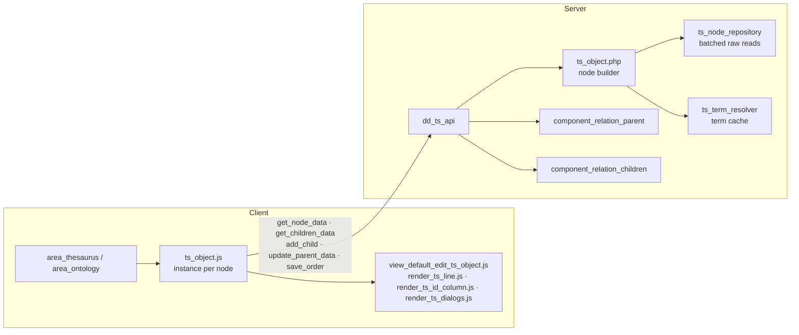
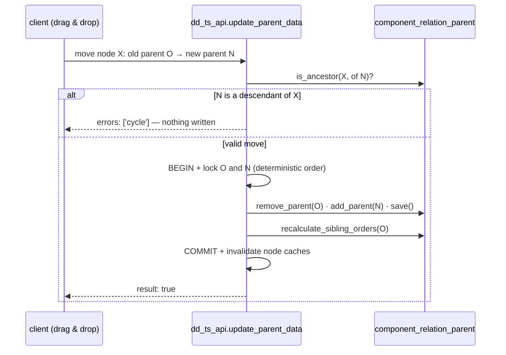

# Thesaurus and Ontology tree

> See also: [area_thesaurus](../areas/area_thesaurus.md) · [area_ontology](../areas/area_ontology.md) · [TS tree (ts_object)](../ontology/ts_object.md) · [Sections](../sections/index.md)

Dédalo manages controlled vocabularies — toponymy, onomastic, thematic thesauri, material and technique taxonomies, typology catalogues — as **hierarchical trees of terms**. This page documents the data model, the server and client architecture of the tree, the mutation guarantees, and how to configure a new thesaurus section.

!!! note "TS rewrite status"
    The tree engine is ported to the TypeScript/Bun server in
    `src/core/ts_object/` — a genuinely separate, self-contained port (shared
    by `area_thesaurus`/`area_ontology`, but scoped out of `engineering/AREA_SPEC.md`,
    which explicitly ledgers "dd_ts_api / ts_object tree mutations" as a
    different subsystem):

    | PHP | TS module | function(s) |
    | --- | --- | --- |
    | `dd_ts_api` (`class.dd_ts_api.php`) | `src/core/ts_object/ts_api.ts` | `getNodeData`, `getChildrenData`, `addChild`, `updateParentData`, `saveOrder` — wired under the `dd_ts_api` key in `src/core/api/dispatch.ts` |
    | `ts_object` (node builder) | `src/core/ts_object/ts_object.ts` | `buildNodeData`, `parseChildData`, `getChildrenData`, `invalidateNode` |
    | `ts_node_repository` | `src/core/ts_object/node_repository.ts` | `fetchNodeInfo`, `batchDescriptorFlags` |
    | `ts_term_resolver` | `src/core/ts_object/term_resolver.ts` | `getTermByLocator`, `invalidateNode` |
    | `area_thesaurus::search_thesaurus` / `get_hierarchy_terms_sqo` | `src/core/ts_object/search.ts` | `searchThesaurus`, `getHierarchyTermsSqo`, `getMainOrder` |

    The five `dd_ts_api` actions keep the PHP envelope shape and verbatim `msg`
    strings by design (asserted by the PHP tests, so a byte-diff catches drift);
    reads gate at permission ≥1, writes at ≥2; every mutation runs inside one
    `withTransaction` (`src/core/db/postgres.ts`) that acquires the same
    PHP-identical `pg_advisory_xact_lock` node lock(s), validates everything
    *before* any write, and defers cache invalidation to after commit — the
    same ordering this page documents for PHP below. Search is
    differential-gated against live PHP (`test/parity/ts_search_differential.test.ts`);
    the read/mutation path has direct unit coverage
    (`test/unit/ts_tree_semantics.test.ts`, `test/unit/ts_tree_db_semantics.test.ts`)
    rather than a byte-parity differential harness of its own. The node-read
    coverage ledger (`ts_object.ts`'s own doc comment) is honest about scope:
    covered are the term/string family, `is_descriptor` relations,
    `component_relation_index` counts (the "U" button, § below) and
    `link_children` resolution; deferred are the `component_relation_related`
    inverse-reference merge, `component_svg` URL/file-exists resolution (needs
    the media machinery — see `engineering/MEDIA_SPEC.md`), and the full indexation
    grid (counts only, per a scoped plan decision — no `dd_grid` render).

## Introduction

Every term is a normal Dédalo section record: searchable, translatable, covered by the time machine, and relatable from any other record (indexations, autocompletes, portals).

Two working areas render and edit these trees:

- **`area_thesaurus`** — the thesaurus editor (hierarchies under the `hierarchy` TLD and any project thesaurus: `ts1`, `es1`, `on1`…).
- **`area_ontology`** — the editor of Dédalo's own ontology. It is *the same machinery*: `area_ontology` is an alias of `area_thesaurus` on both server and client, differentiated only by runtime flags (`is_ontology`, `area_model`). Anything documented here applies to both areas.

## Concepts

| concept | meaning |
| --- | --- |
| **Hierarchy** | A record of section `hierarchy1` (`DEDALO_HIERARCHY_SECTION_TIPO`) describing one tree: its TLD, typology (thesaurus / typology / language…), active state and its **root terms** (a `hierarchy_children` portal, `hierarchy45`). |
| **Term** | A section record inside a thesaurus section (e.g. `es1_42`). Carries the term value, the descriptor and indexable flags, its parent relation and its order. |
| **Descriptor / ND** | A *descriptor* is a preferred term and may have children; a *non-descriptor* (ND) is an alternative form (synonym, variant) attached to a descriptor. The si/no flag lives in the `is_descriptor` component. |
| **Model** | Terms of the model section (`{tld}2`, e.g. `es2`) classify terms typologically. The ontology area shows model values with `Ctrl+M`. |
| **Indexable** | Whether the term can be used as an indexation target (`is_indexable` flag). Root hierarchy records are never indexable. |
| **Virtual sections** | Thesaurus sections (`es1`, `ts1`…) inherit their structure from a real section (`hierarchy20`, `DEDALO_THESAURUS_SECTION_TIPO`) — they have records of their own but resolve their ontology definition from the real section. |

## Data model

### The parent stores the relation; children are computed

The single most important rule of the tree: **hierarchy is stored bottom-up**. Each term stores one locator pointing at its parent, in its own `relation` container under the `component_relation_parent` tipo:

```json
{
    "hierarchy36": [
        {
            "type": "dd47",
            "section_tipo": "es1",
            "section_id": "5",
            "from_component_tipo": "hierarchy36"
        }
    ]
}
```

- `type` is always `dd47` (`DEDALO_RELATION_TYPE_PARENT_TIPO`).
- `section_tipo` / `section_id` point at the **parent** term.

`component_relation_children` stores nothing (`use_db_data = false`). The children of a node are **always calculated** by searching which records hold a parent locator pointing at it. This keeps the tree consistent by construction — there is exactly one source of truth per edge — at the cost of read-time queries, which the system mitigates with batching (see below).

### The section map

Every thesaurus section declares which components play each role, read from the ontology and exposed as `section_map->thesaurus` (`section::get_section_map()`):

```json
{
    "term"          : "hierarchy25",
    "model"         : "hierarchy27",
    "order"         : "hierarchy2",
    "parent"        : "hierarchy36",
    "is_indexable"  : "hierarchy24",
    "is_descriptor" : "hierarchy23"
}
```

- `term` may be an array of tipos (composed terms, e.g. name + surname).
- `is_descriptor` / `is_indexable` are locators to the si/no section (`dd64`): first locator `section_id` `1` = yes, `2` = no.
- `order` is a `component_number` whose items are **`id_key` dataframes** of each parent-link locator (`{value, id_key}` in the `number` container) — a term keeps one order value per parent, paired by the id of its `component_relation_parent` locator pointing at that parent. See [component_dataframe → Relation ordering](../components/component_dataframe.md#relation-ordering-the-order-is-a-dataframe).

### The tree row definition (`ddo_map`)

What a tree row *shows* is ontology data, not code. The `section_list_thesaurus` node of the section defines it in `properties->show->ddo_map`:

```json
{
    "show": {
        "ddo_map": [
            { "tipo": "hierarchy25", "type": "term" },
            { "icon": "ND", "tipo": "hierarchy23", "type": "icon" },
            { "icon": "U",  "tipo": "hierarchy40", "type": "icon" },
            { "icon": "M",  "tipo": "hierarchy27", "type": "icon" },
            { "icon": "CH", "tipo": "hierarchy49", "type": "icon" },
            { "tipo": "hierarchy49", "type": "link_children" }
        ]
    }
}
```

| type | renders |
| --- | --- |
| `term` | the term text (click opens the inline editor) |
| `icon` | a button per component. Special icons: `ND` marks non-descriptors (consumed server-side, not rendered), `CH` is skipped, `M` shows the model, **`U` is the indexations button** when the tipo is a `component_relation_index` (see [Indexations](#indexations-the-u-button)) |
| `img` | a thumbnail (e.g. `component_svg` value) |
| `link_children` | the expand arrow (`component_relation_children` tipo) |

!!! note "Virtual section fallback"
    When a virtual section has no `section_list_thesaurus` of its own, the definition is resolved from its real section (`ts_object::get_ar_elements()`).

## Architecture



### Server

- **`dd_ts_api`** (`core/api/v1/common/class.dd_ts_api.php`) is the API surface. Read actions: `get_node_data`, `get_children_data`. Mutations: `add_child`, `update_parent_data` (move), `save_order`. Responses always carry `{result, msg, errors}`. TS: `src/core/ts_object/ts_api.ts`, wired under `dd_ts_api` in `src/core/api/dispatch.ts` (see the TS status note above).
- **`ts_object`** (`core/ts_object/class.ts_object.php`) builds the JSON of one node: iterates the `ddo_map`, resolves each element's value through its component, and emits the node shape consumed by the client. TS: `buildNodeData` in `src/core/ts_object/ts_object.ts` — no per-component machinery (TS has none); it reads the mapped term/relation/number containers straight off the decoded `MatrixRecord` instead.

```json
{
    "section_tipo": "es1", "section_id": "42",
    "ts_id": "es1_42", "ts_parent": "es1_5",
    "order": 3, "is_descriptor": true, "is_indexable": true,
    "children_tipo": "hierarchy49", "has_descriptor_children": true,
    "ar_elements": [
        { "type": "term", "tipo": "hierarchy25", "value": "Valencia", "model": "component_input_text" },
        { "type": "icon", "tipo": "hierarchy40", "value": "U:37", "model": "component_relation_index", "count_result": { "total": 37 } },
        { "type": "link_children", "tipo": "hierarchy49", "value": "button show children" }
    ],
    "permissions_button_new": 2, "permissions_button_delete": 2
}
```

- **`ts_node_repository`** (`core/ts_object/class.ts_node_repository.php`) removes the N+1 cost of wide nodes: it resolves order, `is_indexable` and `is_descriptor` for a whole children set with one SQL query per section group, reading the raw `number`/`relation` containers with exactly the same semantics as the component path (including `component_number` value formatting). **Contract:** if anything cannot be resolved it returns `null` and the caller runs the legacy per-component path — behavior never degrades, only performance. Output parity is enforced by `test/server/ts_object/ts_node_repository_Test.php`. TS: `fetchNodeInfo`/`batchDescriptorFlags` in `src/core/ts_object/node_repository.ts` — **batch-first, no legacy fallback** (a plan decision: TS has no per-component machinery to fall back to, and both PHP paths yield the same values anyway). PHP's partial-data semantics are folded in as explicit rules instead: a missing row resolves to `{order:null, is_indexable:false}`; an unresolvable section in `fetchNodeInfo` throws, while in `batchDescriptorFlags` it is skipped (not aborted) per tipo.
- **`ts_term_resolver`** (`core/ts_object/class.ts_term_resolver.php`) resolves term strings from locators with a request-scope cache, used by the tree and by diffusion/export/portals (which call the stable `ts_object::get_term_by_locator()` delegates). The cache is invalidated per node on mutations and fully cleared between worker requests (`worker/class.cache_manager.php`). TS: `getTermByLocator`/`invalidateNode` in `src/core/ts_object/term_resolver.ts` — the cache is module-level, keyed only by content (`` `${section_tipo}_${section_id}_${scope}_${lang}` ``, never by user/session), bounded to 1000 entries with whole-cache eviction on overflow (PHP's O(1) eviction, not an LRU), and registered with the ontology invalidation hub so ontology writes drop it.
- Pagination totals use `component_relation_children::count_children()` (a SQL count) instead of loading every child row. TS: `countChildrenOrNull` in `src/core/relations/children.ts`.

### Client

The client is copied as-is from the PHP tree (vanilla JS + LESS, unchanged by the rewrite) and talks to whichever server is running through the same wire contract described above.

Each visible node is a **`ts_object` JS instance** (`core/ts_object/js/ts_object.js`), cached in the global instances map under a key built from `['section_tipo','section_id','children_tipo','target_section_tipo','thesaurus_mode','ts_parent']`. `ts_parent` is part of the key on purpose: one instance owns one DOM node, and the same term visible in two contexts must not steal nodes.

Key behaviors:

- **Expand state** has a single source of truth: `ts_object.set_open(is_open, {persist, force_reload})`. It flips `is_open` synchronously, loads and renders children when the container is empty (or on `Alt`-click force reload), projects the state to the DOM through `sync_open_dom()` (the only place the `open`/`hide` classes change) and persists it in the local IndexedDB `status` table. On page reload, persisted nodes re-open lazily when they enter the viewport.
- **Request dedup** — rapid double-clicks on the arrow join the in-flight `get_children_data` request instead of firing a second one.
- **Rendering** — `render_children` builds child nodes into `DocumentFragment`s and attaches them synchronously before resolving; callers can rely on the DOM being real when the promise settles. Children render into `children_container` (descriptors) or `nd_container` (non-descriptors).
- **Instance lifecycle** — children register in their parent's `ar_instances`, so the standard `destroy(delete_dependencies)` cascade reclaims whole subtrees: area rebuilds, clean re-renders and term deletion free their instances, events and DOM. Collapsing does *not* destroy (instant re-open). After a drag-and-drop move, `rekey()` re-registers the moved instance under its new key.
- **Search** — `parse_search_result` receives full root-to-match paths from the server, hierarchizes them as plain data, and opens the branches top-down with explicit recursion: a child is always rendered by its parent before its own branch opens. Results are highlighted and the page scrolls to the first match; results whose ancestors are missing are reported, never silently dropped.

## Tree mutations

All mutations are **transactional**: they run inside `DBi::transaction()` holding a per-node advisory lock (`matrix_db_manager::acquire_node_lock()`) on every affected parent. A failure at any step rolls back every write — no orphan records, no half-moved nodes, no colliding sibling orders.

TS keeps the identical guarantee with `withTransaction`/`acquireNodeLock`
(`src/core/db/postgres.ts`): the same `pg_advisory_xact_lock(hashtext(...))`
call over the same `` `${section_tipo}_${section_id}` `` key, callable only
from inside an open transaction (it throws otherwise — the lock would
silently be ineffective outside one), and a nested `withTransaction` joins the
ambient transaction rather than opening a second connection, so composed
mutation helpers never fragment one logical operation.



- **`add_child`** validates everything (section map flags, parent component resolution) *before* creating the record; creation, default `is_descriptor`/`is_indexable` values, ontology TLD inheritance and the parent link are one atomic unit. The new child's order is assigned under the parent lock. TS: `addChild`, `src/core/ts_object/ts_api.ts` — same pre-write validation order, creating the record via `createSectionRecord` (`src/core/section/record/create_record.ts`).
- **`update_parent_data`** rejects moving a node under itself or under its own descendant with a distinct `'cycle'` error. The guard (`component_relation_parent::is_ancestor()`) also runs inside `add_parent()` itself, so every entry point is covered. TS: `updateParentData`, same file — `isAncestor`/`addParent`/`removeParent` in `src/core/relations/parent.ts`, with the same double coverage (the standalone check plus the guard inside `addParent` itself).
- **`save_order`** rewrites sibling order values per parent context in one transaction; unchanged values are skipped (no time-machine noise). Repeating the same order is a no-op. TS: `saveOrder`, same file — `sortChildren`/`recalculateSiblingOrders` in `src/core/relations/parent.ts`.
- **Delete** is only allowed for terms without children (the delete dialog lists existing relations first); it removes the record, updates the parent's children data and destroys the client instance. Not part of the `dd_ts_api` five-action surface above (PHP routes term delete through the generic section-record delete path); ledgered against that path, not re-verified here.

## Indexations (the "U" button)

When a `ddo_map` icon's tipo is a `component_relation_index`, the server counts the records indexed against the term (`count_data_group_by`) and emits the element with `value: "U:37"` and a `count_result`. Elements with zero uses are omitted. TS: `countInverseReferences` (`src/core/search/search_related.ts`), called from `buildNodeData` — covered as *counts only* (a scoped plan decision); the indexation `dd_grid` render itself is not part of this port (the client renders it from the same count data on either engine, but the grid's own data source is a separate subsystem, see [dd_grid](../system/dd_grid.md)).

On click, the client does **not** open the component: it calls `ts_object.show_indexations()`, which renders a **`dd_grid` with view `indexation`** — the indexed records grouped by section, with a micro paginator — toggled inside the row's `indexations_container`. A second click hides it; the grid instance is cached per button.

The recursive variant — `ddo_map` entry with `"show_data": "children"` — renders a `⇣U:n` button that first collects all descendant terms and shows the indexations of the whole branch.

!!! warning "Dispatch is by model, not type"
    These elements arrive with `type: "icon"` like any other icon; the client dispatches them by `model === 'component_relation_index'` (`render_ts_line.js`). Matching by type silently sends the U button to the generic "open component" path.

## Configuring a new thesaurus section

1. Create the section under its TLD (terms section `{tld}1`, optionally models `{tld}2`), usually inheriting from `hierarchy20`.
2. Give it the role components and declare them in the section map: `term`, `parent` (`component_relation_parent`), a `component_relation_children`, `is_descriptor`, `is_indexable`, `order` (`component_number`), optionally `model`.
3. Add a `section_list_thesaurus` node with the `ddo_map` describing the tree row (term first, icons, `link_children` last).
4. Register the hierarchy: create the `hierarchy1` record (TLD, typology, target section) and link its root terms through the `hierarchy_children` portal (`hierarchy45`).

## Testing

Server-side coverage lives in `test/server`:

```shell
cd test/server
../../vendor/bin/phpunit api/dd_ts_api_Test.php ts_object/ts_node_repository_Test.php \
    components/component_relation_children_Test.php components/component_relation_parent_Test.php \
    db/DBi_transaction_Test.php area/area_thesaurus_Test.php
```

- `dd_ts_api_Test` exercises the mutation guarantees end-to-end against the `ts1` fixture: child creation and linking, no-orphan on failed preconditions, moves, **cycle rejection**, and order idempotence.
- `ts_node_repository_Test` is the parity gate: the batched raw reads must equal the legacy component reads value-for-value, *type included*.
- `DBi_transaction_Test` covers commit/rollback/savepoint nesting and the node lock.

The client widget has no unit tests; verify changes manually: expand/collapse with reload restore, rapid double-click (one network request), `Alt`-click force reload, drag-and-drop including a drop onto the node's own descendant (clean cycle error), search with deep matches, the U indexation grid toggle, and `Ctrl+M` model visibility persistence.

TS coverage runs under `bun:test`:

```shell
bun test test/unit/ts_tree_semantics.test.ts test/unit/ts_tree_db_semantics.test.ts \
    test/parity/ts_search_differential.test.ts
```

- `ts_tree_semantics.test.ts` / `ts_tree_db_semantics.test.ts` unit-test the
  read/mutation surface (`ts_object.ts`, `ts_api.ts`, `node_repository.ts`,
  `term_resolver.ts`) — direct coverage, not a byte-parity differential
  harness of its own.
- `ts_search_differential.test.ts` is the byte-parity gate for
  `searchThesaurus`/`getHierarchyTermsSqo` against live PHP, in the same
  spirit as `ts_node_repository_Test` above.
