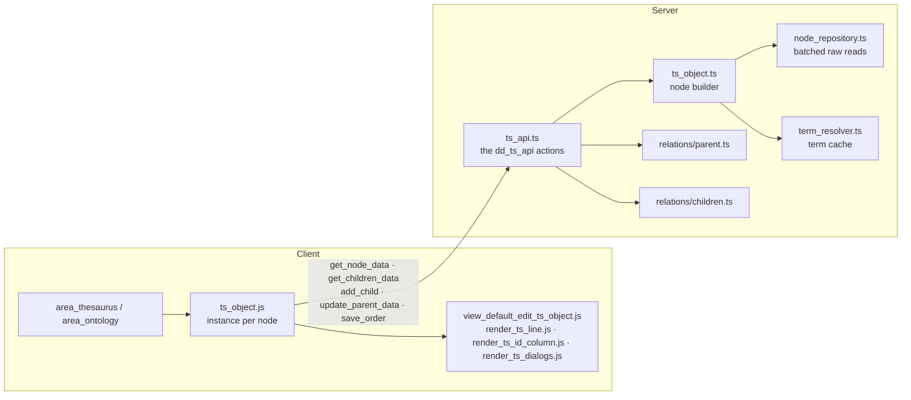
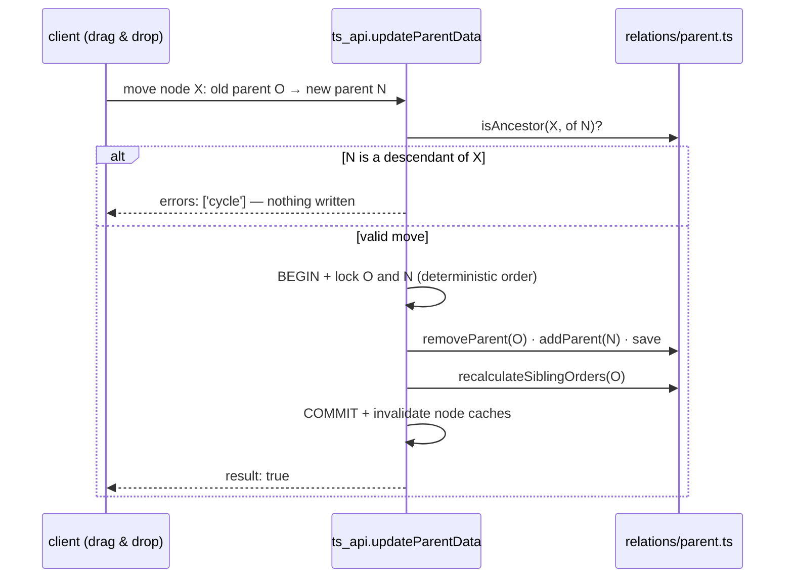

# Thesaurus and Ontology tree

> See also: [area_thesaurus](../areas/area_thesaurus.md) · [area_ontology](../areas/area_ontology.md) · [ts_object](../ontology/ts_object.md) · [Sections](../sections/index.md)

Dédalo manages controlled vocabularies — toponymy, onomastic, thematic thesauri, material and technique taxonomies, typology catalogues — as **hierarchical trees of terms**. This page documents the data model, the server and client architecture of the tree, the mutation guarantees, and how to configure a new thesaurus section.

## Introduction

Every term is a normal Dédalo section record: searchable, translatable, covered by the time machine, and relatable from any other record (indexations, autocompletes, portals).

Two working areas render and edit these trees:

- **`area_thesaurus`** — the thesaurus editor (hierarchies under the `hierarchy` TLD and any project thesaurus: `ts1`, `es1`, `on1`…).
- **`area_ontology`** — the editor of Dédalo's own ontology. It is *the same machinery*: `area_ontology` is an alias of `area_thesaurus` on both server and client, differentiated only by runtime flags (`is_ontology`, `area_model`). Anything documented here applies to both areas.

## Concepts

| concept | meaning |
| --- | --- |
| **Hierarchy** | A record of section `hierarchy1` describing one tree: its TLD, typology (thesaurus / typology / language…), active state and its **root terms** (a `hierarchy_children` portal, `hierarchy45`). |
| **Term** | A section record inside a thesaurus section (e.g. `es1_42`). Carries the term value, the descriptor and indexable flags, its parent relation and its order. |
| **Descriptor / ND** | A *descriptor* is a preferred term and may have children; a *non-descriptor* (ND) is an alternative form (synonym, variant) attached to a descriptor. The si/no flag lives in the `is_descriptor` component. |
| **Model** | Terms of the model section (`{tld}2`, e.g. `es2`) classify terms typologically. The ontology area shows model values with `Ctrl+M`. |
| **Indexable** | Whether the term can be used as an indexation target (`is_indexable` flag). Root hierarchy records are never indexable. |
| **Virtual sections** | Thesaurus sections (`es1`, `ts1`…) inherit their structure from a real section (`hierarchy20`) — they have records of their own but resolve their ontology definition from the real section. |

## Data model

### The parent stores the relation; children are computed

The single most important rule of the tree: **hierarchy is stored bottom-up**. Each term stores one locator pointing at its parent, in its own `relation` container under the `component_relation_parent` tipo:

```json
{
    "hierarchy36": [
        {
            "type": "dd47",
            "section_tipo": "es1",
            "section_id": "5",
            "from_component_tipo": "hierarchy36"
        }
    ]
}
```

- `type` is always `dd47` (`RELATION_TYPE_PARENT`).
- `section_tipo` / `section_id` point at the **parent** term.

`component_relation_children` stores nothing (`use_db_data = false`). The children of a node are **always calculated** by searching which records hold a parent locator pointing at it. This keeps the tree consistent by construction — there is exactly one source of truth per edge — at the cost of read-time queries, which the system mitigates with batching (see below).

### The section map

Every thesaurus section declares which components play each role, read from the ontology and exposed as `section_map->thesaurus` (`getSectionMap()`, `src/core/ontology/section_map.ts`):

```json
{
    "term"          : "hierarchy25",
    "model"         : "hierarchy27",
    "order"         : "hierarchy2",
    "parent"        : "hierarchy36",
    "is_indexable"  : "hierarchy24",
    "is_descriptor" : "hierarchy23"
}
```

- `term` may be an array of tipos (composed terms, e.g. name + surname).
- `is_descriptor` / `is_indexable` are locators to the si/no section (`dd64`): first locator `section_id` `1` = yes, `2` = no.
- `order` is a `component_number` whose items are **`id_key` dataframes** of each parent-link locator (`{value, id_key}` in the `number` container) — a term keeps one order value per parent, paired by the id of its `component_relation_parent` locator pointing at that parent. See [component_dataframe → Relation ordering](../components/component_dataframe.md#relation-ordering-the-order-is-a-dataframe).

### The tree row definition (`ddo_map`)

What a tree row *shows* is ontology data, not code. The `section_list_thesaurus` node of the section defines it in `properties->show->ddo_map`:

```json
{
    "show": {
        "ddo_map": [
            { "tipo": "hierarchy25", "type": "term" },
            { "icon": "ND", "tipo": "hierarchy23", "type": "icon" },
            { "icon": "U",  "tipo": "hierarchy40", "type": "icon" },
            { "icon": "M",  "tipo": "hierarchy27", "type": "icon" },
            { "icon": "CH", "tipo": "hierarchy49", "type": "icon" },
            { "tipo": "hierarchy49", "type": "link_children" }
        ]
    }
}
```

| type | renders |
| --- | --- |
| `term` | the term text (click opens the inline editor) |
| `icon` | a button per component. Special icons: `ND` marks non-descriptors (consumed server-side, not rendered), `CH` is skipped, `M` shows the model, **`U` is the indexations button** when the tipo is a `component_relation_index` (see [Indexations](#indexations-the-u-button)) |
| `img` | a thumbnail (e.g. `component_svg` value) |
| `link_children` | the expand arrow (`component_relation_children` tipo) |

!!! note "Virtual section fallback"
    When a virtual section has no `section_list_thesaurus` of its own, the definition is resolved from its real section (`getArElements()`, `src/core/ts_object/ts_object.ts`).

## Architecture



### Server

The tree engine lives in `src/core/ts_object/` — a self-contained subsystem
shared by `area_thesaurus` and `area_ontology`.

- **`ts_api.ts`** is the API surface, wired under the `dd_ts_api` key in
  `src/core/api/dispatch.ts`. Read actions: `get_node_data`,
  `get_children_data`. Mutations: `add_child`, `update_parent_data` (move),
  `save_order`. Responses always carry `{result, msg, errors}`. Reads gate at
  permission ≥1, writes at ≥2.
- **`ts_object.ts`** builds the JSON of one node (`buildNodeData`): it iterates
  the `ddo_map`, resolves each element's value, and emits the node shape the
  client consumes — reading the mapped term/relation/number containers straight
  off the decoded `MatrixRecord`.

```json
{
    "section_tipo": "es1", "section_id": "42",
    "ts_id": "es1_42", "ts_parent": "es1_5",
    "order": 3, "is_descriptor": true, "is_indexable": true,
    "children_tipo": "hierarchy49", "has_descriptor_children": true,
    "ar_elements": [
        { "type": "term", "tipo": "hierarchy25", "value": "Valencia", "model": "component_input_text" },
        { "type": "icon", "tipo": "hierarchy40", "value": "U:37", "model": "component_relation_index", "count_result": { "total": 37 } },
        { "type": "link_children", "tipo": "hierarchy49", "value": "button show children" }
    ],
    "permissions_button_new": 2, "permissions_button_delete": 2
}
```

- **`node_repository.ts`** removes the N+1 cost of wide nodes: `fetchNodeInfo`
  and `batchDescriptorFlags` resolve order, `is_indexable` and `is_descriptor`
  for a whole children set with one SQL query per section group, reading the raw
  `number`/`relation` containers (including `component_number` value
  formatting). It is **batch-first, with no per-component fallback**: a missing
  row resolves to `{order: null, is_indexable: false}`; an unresolvable section
  throws in `fetchNodeInfo`, and is skipped per-tipo (not aborted) in
  `batchDescriptorFlags`.
- **`term_resolver.ts`** resolves term strings from locators
  (`getTermByLocator`), used by the tree and by diffusion/export/portals, which
  import it directly. The cache is module-level and keyed **only by content**
  (`` `${section_tipo}_${section_id}_${scope}_${lang}` ``, never by user or
  session), bounded to 1000 entries with whole-cache eviction on overflow (an
  O(1) drop, not an LRU). It is evicted per node on a mutation
  (`invalidateNode`) and registered with the ontology invalidation hub, so any
  ontology write drops it.
- Pagination totals use `countChildrenOrNull` (`src/core/relations/children.ts`)
  — a SQL count instead of loading every child row.

!!! note "What a tree node does not resolve"
    Node reads cover the term/string family, the `is_descriptor` relations, the
    `component_relation_index` counts (the "U" button, below) and
    `link_children` resolution. Two element behaviours are deliberately out of
    scope: a `component_relation_related` element does not get its inverse
    references merged in, and a `component_svg` element does not resolve to a
    file URL. The indexation *grid* is a separate subsystem — the node builder
    produces counts only (see [dd_grid](../system/dd_grid.md)).

### Client

Each visible node is a **`ts_object` JS instance**
(`client/dedalo/core/ts_object/js/ts_object.js`), cached in the global instances
map under a key built from
`['section_tipo','section_id','children_tipo','target_section_tipo','thesaurus_mode','ts_parent']`.
`ts_parent` is part of the key on purpose: one instance owns one DOM node, and
the same term visible in two contexts must not steal nodes.

Key behaviors:

- **Expand state** has a single source of truth: `ts_object.set_open(is_open, {persist, force_reload})`. It flips `is_open` synchronously, loads and renders children when the container is empty (or on `Alt`-click force reload), projects the state to the DOM through `sync_open_dom()` (the only place the `open`/`hide` classes change) and persists it in the local IndexedDB `status` table. On page reload, persisted nodes re-open lazily when they enter the viewport.
- **Request dedup** — rapid double-clicks on the arrow join the in-flight `get_children_data` request instead of firing a second one.
- **Rendering** — `render_children` builds child nodes into `DocumentFragment`s and attaches them synchronously before resolving; callers can rely on the DOM being real when the promise settles. Children render into `children_container` (descriptors) or `nd_container` (non-descriptors).
- **Instance lifecycle** — children register in their parent's `ar_instances`, so the standard `destroy(delete_dependencies)` cascade reclaims whole subtrees: area rebuilds, clean re-renders and term deletion free their instances, events and DOM. Collapsing does *not* destroy (instant re-open). After a drag-and-drop move, `rekey()` re-registers the moved instance under its new key.
- **Search** — `parse_search_result` receives full root-to-match paths from the server, hierarchizes them as plain data, and opens the branches top-down with explicit recursion: a child is always rendered by its parent before its own branch opens. Results are highlighted and the page scrolls to the first match; results whose ancestors are missing are reported, never silently dropped.

## Tree mutations

All mutations are **transactional**: every one runs inside a single
`withTransaction` (`src/core/db/postgres.ts`) holding a per-node advisory lock
(`acquireNodeLock` → `pg_advisory_xact_lock(hashtext(...))` over the
`` `${section_tipo}_${section_id}` `` key) on every affected parent. Everything
is validated **before** any write, and cache invalidation is deferred until
after commit. A failure at any step rolls back every write — no orphan records,
no half-moved nodes, no colliding sibling orders.

`acquireNodeLock` is callable only from inside an open transaction (it throws
otherwise — outside one, the lock would silently be ineffective), and a nested
`withTransaction` joins the ambient transaction rather than opening a second
connection, so composed mutation helpers never fragment one logical operation.



- **`add_child`** (`addChild`, `ts_api.ts`) validates everything (section map flags, parent component resolution) *before* creating the record; creation, default `is_descriptor`/`is_indexable` values, ontology TLD inheritance and the parent link are one atomic unit. The record is created via `createSectionRecord` (`src/core/section/record/create_record.ts`). The new child's order is assigned under the parent lock.
- **`update_parent_data`** (`updateParentData`) rejects moving a node under itself or under its own descendant with a distinct `'cycle'` error. The guard (`isAncestor`, `src/core/relations/parent.ts`) runs both as a standalone pre-check *and* inside `addParent()` itself, so every entry point is covered.
- **`save_order`** (`saveOrder`) rewrites sibling order values per parent context in one transaction; unchanged values are skipped (no time-machine noise). Repeating the same order is a no-op. Backed by `sortChildren`/`recalculateSiblingOrders` (`src/core/relations/parent.ts`).
- **Delete** is only allowed for terms without children (the delete dialog lists existing relations first); it removes the record, updates the parent's children data and destroys the client instance. It is **not** one of the five tree actions — term delete goes through the generic section-record delete path, which enforces the same children-exist refusal (see [`sections`](../sections/sections.md#bulk-delete--the-delete-api-action)).

## Indexations (the "U" button)

When a `ddo_map` icon's tipo is a `component_relation_index`, the server counts the records indexed against the term (`getCountDataGroupBy` → `countInverseReferences`, `src/core/search/search_related.ts`) and emits the element with `value: "U:37"` and a `count_result`. Elements with zero uses are omitted.

On click, the client does **not** open the component: it calls `ts_object.show_indexations()`, which renders a **`dd_grid` with view `indexation`** — the indexed records grouped by section, with a micro paginator — toggled inside the row's `indexations_container`. A second click hides it; the grid instance is cached per button. The grid's own data source is a separate subsystem, see [dd_grid](../system/dd_grid.md).

The recursive variant — `ddo_map` entry with `"show_data": "children"` — renders a `⇣U:n` button that first collects all descendant terms and shows the indexations of the whole branch.

!!! warning "Dispatch is by model, not type"
    These elements arrive with `type: "icon"` like any other icon; the client dispatches them by `model === 'component_relation_index'` (`render_ts_line.js`). Matching by type silently sends the U button to the generic "open component" path.

## Configuring a new thesaurus section

1. Create the section under its TLD (terms section `{tld}1`, optionally models `{tld}2`), usually inheriting from `hierarchy20`.
2. Give it the role components and declare them in the section map: `term`, `parent` (`component_relation_parent`), a `component_relation_children`, `is_descriptor`, `is_indexable`, `order` (`component_number`), optionally `model`.
3. Add a `section_list_thesaurus` node with the `ddo_map` describing the tree row (term first, icons, `link_children` last).
4. Register the hierarchy: create the `hierarchy1` record (TLD, typology, target section) and link its root terms through the `hierarchy_children` portal (`hierarchy45`).

## Testing

```shell
bun test test/unit/ts_tree_semantics.test.ts test/unit/ts_tree_db_semantics.test.ts \
    test/parity/ts_search_differential.test.ts
```

- `ts_tree_semantics.test.ts` / `ts_tree_db_semantics.test.ts` cover the
  read/mutation surface (`ts_object.ts`, `ts_api.ts`, `node_repository.ts`,
  `term_resolver.ts`): child creation and linking, no-orphan on failed
  preconditions, moves, **cycle rejection**, order idempotence, and the
  commit/rollback/node-lock behaviour.
- `ts_search_differential.test.ts` is the byte-parity gate for
  `searchThesaurus` / `getHierarchyTermsSqo`.

The client widget has no unit tests; verify changes manually: expand/collapse with reload restore, rapid double-click (one network request), `Alt`-click force reload, drag-and-drop including a drop onto the node's own descendant (clean cycle error), search with deep matches, the U indexation grid toggle, and `Ctrl+M` model visibility persistence.
