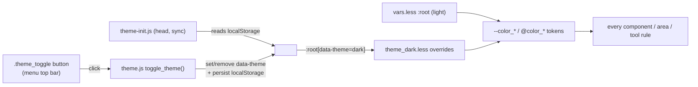

# themes

> The Dédalo design-system / theming layer — the LESS sources under
> `core/page/css/`, the `:root` design tokens (light + dark palettes), the
> `data-theme="dark"` switch driven by `core/page/js/theme.js`, and the static
> `themes/default/` asset bundle (icons, fonts, logos) that the LESS references.

> See also: [Architecture overview](../architecture_overview.md) ·
> [CSS / LESS architecture](../../css-architecture.md) ·
> [menu](menu.md) · [Components](../components/index.md)

This page is the developer reference for the **themes** subsystem. "Themes" in
Dédalo v7 is not a PHP class and not a per-installation file set: it is the
combination of (a) the LESS design system in `core/page/css/`, (b) a two-palette
token model (light is the default; dark overrides the same custom properties),
and (c) the `core/themes/default/` directory of static assets (SVG icons, fonts,
logos) that the LESS and the client reference by relative URL. There is no LESS
inside `core/themes/`; the design *logic* lives in `core/page/css/`, the design
*assets* live in `core/themes/default/`.

## Role

The themes layer sits **below every UI subsystem** and above the raw browser. It
defines the variables, mixins, reset and base layout that every component,
service, area and tool LESS file builds on, and it produces the single
`main.css` stylesheet the page loads. It has no server class — it is pure
front-end infrastructure consumed by the work-system client.

| layer | role |
| --- | --- |
| **`core/page/css/main.less`** | The single LESS entrypoint. `@import`s the layout core (reset, vars, theme_dark, functions, fonts, general, …) and then every service / area / section / component / widget LESS bundle, in that order. Compiles to `main.css`. |
| **`core/page/css/layout/vars.less`** | The design tokens: the light `:root` palette, semantic surface/spacing/radius/elevation/motion tokens, component & modal tokens, and the `@color_*` LESS aliases that map onto the CSS custom properties. |
| **`core/page/css/layout/theme_dark.less`** | The dark palette: the *same* custom properties re-declared under `:root[data-theme="dark"]`. |
| **`core/page/js/theme.js` + `theme-init.js`** | The runtime theme switch: set/toggle `data-theme="dark"` on `<html>`, persisted in `localStorage.dedalo_theme`. |
| **`core/themes/default/`** | Static assets: `icons/*.svg`, `fonts/`, logos, tag bases. Referenced from LESS by relative URL (`../../themes/default/icons/<name>.svg`). |

!!! note "Not a class — verify against `core/page/css/`, not `core/themes/`"
    `core/themes/` contains only the `default/` asset bundle (icons, fonts,
    images). The design tokens, mixins and the dark-mode mechanism are all in
    `core/page/css/`. This doc documents both, because together they are what a
    developer means by "the theme".

## Responsibilities

- **Own the design tokens** — one canonical place (`vars.less`) for colours,
  spacing, radius, elevation, motion and component-level semantic tokens, exposed
  both as CSS custom properties (`var(--color_primary)`) and as LESS aliases
  (`@color_primary`).
- **Provide light + dark palettes** — the same token names resolve to a light
  palette by default and to a dark palette under `:root[data-theme="dark"]`
  (`theme_dark.less`), so existing rules become theme-aware without edits.
- **Compose `main.css`** — `main.less` is the single entrypoint that imports the
  layout core first, then every other subsystem's LESS, producing one bundle.
- **Define the base layout & reset** — `reset.less`, `general.less`,
  `layout.less`, `fonts.less`, `page.less`, `list.less` set the `html`/`body`
  defaults, the `.wrapper_component` structural contract, the global font and the
  page chrome.
- **Provide the icon / button mixin system** — `buttons.less` (`.fn_add_mask`,
  `.fn_build_button`, `.fn_append_icon`) and `functions.less` (tag builders),
  all keyed off the SVG assets in `core/themes/default/icons/`.
- **Switch theme at runtime** — `theme.js` toggles `data-theme` on `<html>` and
  persists the choice; `theme-init.js` applies it synchronously before paint to
  avoid a flash of the wrong theme.
- **Host the static assets** — `core/themes/default/` is the single asset root
  every LESS `url()` and client icon reference points at.

## Key concepts

### Tokens: CSS custom properties vs. LESS aliases

`vars.less` declares everything twice, deliberately:

- A `:root { --color_*: … }` block holds the **light** palette plus the semantic
  scales (surfaces, spacing, radius, elevation, motion) and component/modal
  tokens.
- A trailing block of `@color_* : var(--color_*)` LESS aliases maps each LESS
  variable onto its custom property. This is what makes the whole codebase
  theme-aware: thousands of existing rules use `@color_primary`, and because that
  alias resolves to `var(--color_primary)`, swapping the custom property under a
  dark `:root` retints every rule with no rule-site change.

!!! warning "LESS colour functions can't operate on CSS variables"
    `darken()` / `lighten()` / `fade()` cannot run on a CSS custom property. The
    former derived colours are pre-computed into explicit *derived tokens*
    (e.g. `--color_primary_hover_bg`, `--color_orange_dark`) in **both**
    palettes, so a hover/border shade still retunes per theme. When you add a
    button-like state, add the derived token in `vars.less` *and*
    `theme_dark.less` — do not call `darken()`.

The token families in `vars.less`:

| family | examples | notes |
| --- | --- | --- |
| Layout sizes | `--component_width: 50%`, `--inspector_width`, `--media_min_height`, `--view_line_height`, `--column_id_width` | Runtime-tunable; some are overridden by ontology CSS per node. |
| Colour palette | `--color_white` … `--color_grey_1`, `--color_orange_dedalo` (`#f78a1c`), `--color_primary` (`#2b77c7`), `--color_success`, `--color_danger` | Each has a `@color_*` LESS alias and a dark override. |
| Semantic surfaces | `--bg_app`, `--bg_surface`, `--bg_menu`, `--fg_default`, `--fg_muted`, `--fg_inverse`, `--border_default`, `--focus_ring` | Prefer these in new code over raw colour tokens. |
| Spacing scale | `--space-0` … `--space-8` (0 → 3rem) | Compact density on a `0.25 / 0.5 / 1rem` rhythm. |
| Radius scale | `--radius-sm/md/lg/pill` | |
| Elevation scale | `--shadow-1` … `--shadow-4`, `--shadow-focus` | Built on `--shadow_default` so they retune per theme automatically (no dark override needed). |
| Motion | `--ease-standard`, `--transition-fast/base/slow` | |
| Component tokens | `--menu_dropdown_bg`, `--checkbox_checked_bg`, `--input_bg`, `--select_icon_url`, `--toolbar_btn_hover_bg` | |
| Modal tokens | `--modal_overlay_bg`, `--modal_content_bg`, `--modal_header_bg`, `--modal_radius` | Used by `dd-modal`; pierce the Shadow DOM boundary via `var()`. |

### The two palettes (light default, dark override)

Light is the *default* — it lives directly in `:root` in `vars.less`. Dark is an
*override*: `theme_dark.less` re-declares the same custom property names under
`:root[data-theme="dark"]`. In the dark palette the greys are inverted
(`--color_white: #1b1d20`, `--color_black: #ffffff`, `--color_grey_1: #f8f9fb`),
brand colours are lightened for contrast (`--color_orange_dedalo: #ffa54a`), and
some tokens flip behaviour entirely — e.g. `--select_icon_url` points at
`select_arrows_light.svg` and `--toolbar_btn_icon_filter` becomes `invert(0.85)`.

!!! note "Dark-mode-only rules"
    Where a selector needs a value that is *not* expressible as a single
    swapped token, wrap it in `:root[data-theme="dark"] & { … }` inside the
    component LESS (this is the pattern `menu.less` uses for the theme-toggle
    icon — `moon.svg` in light, `sun.svg` in dark).

### Runtime theme selection

`theme.js` is the single source of truth for the switch (`localStorage` key
`dedalo_theme`, default `light`):

- `get_theme()` → `'light' | 'dark'` (reads `localStorage`).
- `set_theme(t)` → adds/removes `data-theme="dark"` on `document.documentElement`,
  persists/clears `localStorage`, and publishes a `theme_changed` event.
- `toggle_theme()` → flips between the two.

`theme-init.js` is a tiny IIFE loaded **synchronously in `<head>` before any
module** (see `core/page/index.html`); it reads `localStorage.dedalo_theme` and
sets `data-theme` before first paint, preventing a flash of the light theme on a
dark-mode reload. The user-facing trigger is the `.theme_toggle` button in the
top utility bar, wired in `core/menu/js/view_default_edit_menu.js` (click and
Enter/Space call `toggle_theme()`).



## Files & structure

```text
core/page/css/
├── main.less                     # the single LESS entrypoint
├── main.css                      # compiled, minified output loaded by the page
└── layout/
    ├── reset.less                # CSS reset / normalize, box-sizing
    ├── vars.less                 # tokens: light :root palette + @color_* aliases + scales
    ├── theme_dark.less           # dark palette: same tokens under :root[data-theme="dark"]
    ├── functions.less            # mixins: .truncate_text, .fn_build_tag_* (indexation/tc/note/…)
    ├── fonts.less                # .global_font() (system-ui stack)
    ├── general.less              # html/body defaults, base font-size (0.8125rem), utilities
    ├── progress_bar.less
    ├── buttons.less              # .fn_add_mask / .fn_build_button / .fn_append_icon + icon classes
    ├── layout.less               # .wrapper_component contract, .hilite_mixin, media wrappers
    ├── page.less
    └── list.less

core/page/js/
├── theme.js                      # get_theme / set_theme / toggle_theme (localStorage + event)
└── theme-init.js                 # sync head IIFE: apply data-theme before paint

core/themes/
└── default/                      # STATIC ASSETS (no LESS here)
    ├── icons/*.svg               # UI icon set (edit, save, search, moon, sun, select_arrows, …)
    ├── fonts/                    # liberation, glyphicons, san_francisco
    ├── tag_base/                 # raster tag backgrounds
    ├── dedalo_logo*.svg / .png   # brand logos
    └── …
```

### `main.less` import order (load-bearing)

`main.less` imports the **layout core first**, then everything else. The order
guarantees tokens and mixins exist before any consumer uses them:

```less
// layout general
@import './layout/reset';
@import './layout/vars';
@import './layout/theme_dark';   // dark overrides, right after vars
@import './layout/functions';
@import './layout/fonts';
@import './layout/general';
@import './layout/progress_bar';
@import './layout/buttons';
@import './layout/layout';
@import './layout/page';
@import './layout/list';

// then: services & commons → login → relation_list → all area_* →
//       section / section_record / ts_object / section_group / section_tab →
//       all component_* → widgets/*
```

!!! warning "Keep `main.less` the only entrypoint, and keep the order"
    Every component/area/widget LESS assumes `vars`, `functions`, `buttons` and
    `layout` are already imported (for `@color_*`, `@width_break_point_*`,
    `.hilite_mixin`, `.fn_add_mask`). The page loads exactly one bundle:
    `core/api/v1/common/class.dd_utils_api.php::get_dedalo_files()` injects
    `DEDALO_CORE_URL.'/page/css/main.css'` (and explicitly **excludes** the
    `/themes/` directory from the JS/CSS file walk — assets there are referenced
    by URL, never bundled). See [CSS / LESS architecture](../../css-architecture.md).

### `main.css` is the compiled output

`main.css` is the minified compile of `main.less` (reset + all imports). The
page (`core/page/index.html`) loads it as a single `<link rel="stylesheet">`.
There is no runtime LESS compilation in the request path: the page consumes the
pre-built `main.css`. (No build script ships in the repo root; `main.css` is the
checked-in artifact, regenerated from `main.less` with a LESS compiler when the
LESS changes.)

## Key mixins & token usage

### Icon system (`buttons.less`)

Icons are SVG **masks**, not ``/`background-image`, so the icon *shape* is
separate from its *colour* (set via `background-color` / `mask` colour). This is
what lets a hover change colour without a `filter` fighting a coloured
background.

| mixin | signature | purpose |
| --- | --- | --- |
| `.fn_add_mask` | `(@icon_name)` | Set `mask-image: url('../../themes/default/icons/@{icon_name}')` with `contain`/`no-repeat`/`center`. The base icon primitive. |
| `.fn_build_button` | `(@icon_name, @color, @opacity, @size)` | Compose `.button()` + colour/size/opacity + `.fn_add_mask`. |
| `.fn_append_icon` | `(@icon_name, @color, @opacity)` | Prepend an icon as a `::before` mask on a `<button>` (the tag-element variant). |

Named icon classes (alphabetical block in `buttons.less`) bind a class to an
asset, e.g. `.add`/`.new` → `add_light.svg`, `.check` → `check.svg`,
`.cancel` → `cancel.svg`. Both `button.<name>` (via `.fn_append_icon`) and
`.button.<name>` (via `.fn_add_mask`) are wired.

!!! note "Icon colour tokens"
    On dark menu bars use `var(--fg_inverse)`; on neutral row/table backgrounds
    use `var(--fg_muted)` (NOT `--fg_inverse`, which is invisible on light rows);
    on light row backgrounds use `var(--fg_default)`. The `.menu` bar uses the
    dark `--bg_menu` in both themes, so its black SVGs are inverted with
    `filter: brightness(0) invert(1)` (safe there because there is no coloured
    hover background).

### Tag builders (`functions.less`)

`.truncate_text(@width)` and the tag mixins `.fn_build_tag_indexation`,
`.fn_build_tag_tc`, `.fn_build_tag_note`, `.fn_build_tag_reference`,
`.fn_build_tag_draw` build the in-text tag chips used by text-area / OH widgets.
They default their colours to `@color_orange_dedalo` / `var(--fg_inverse)`.

### Structural contract & focus (`layout.less` + `general.less`)

`general.less` sets the `html` base: `.global_font()` (system-ui stack from
`fonts.less`), `color: @color_grey_4`, `background-color: @color_white`, and the
compact base `font-size: 0.8125rem`. `layout.less` owns the `.wrapper_component`
structural contract (`>.label`, `>.content_data > .content_value`,
`.buttons_container`, state modifiers `.edit/.list/.search/.active/.fullscreen`)
and the `.hilite_mixin` focus/active highlight. Components should call these
shared mixins rather than redefine focus or media-wrapper layout.

## How ontology CSS interacts with tokens

A node's `properties.css` (the per-node CSS object that ships in the
[ddo](../dd_object.md) `context.css`) is applied **client-side**, not via LESS.
`core/common/js/ui.js` reads `context.css` and calls
`set_element_css(selector, css)` from `core/page/js/css.js`, which inserts the
rule into a runtime stylesheet scoped to the component wrapper. Because those
rules can reference the same custom properties (e.g. an ontology override of
`--component_width` or a colour `var(--color_*)`), ontology styling and the theme
tokens compose: the token is the default, the ontology CSS is the per-node
override, and the active palette (light/dark) decides the resolved value. This is
why `--component_width`, `--media_min_height` etc. are CSS custom properties and
not LESS variables — they must be overridable at runtime.

## How it fits with the rest of Dédalo

- **[menu](menu.md)** — hosts the `.theme_toggle` button (top utility bar) that
  calls `toggle_theme()`, and uses a dark-mode-only rule to swap its icon
  (`moon.svg` → `sun.svg`). `menu.less` is imported by `main.less`.
- **[Components](../components/index.md)** — every `component_*` LESS is imported
  by `main.less` and styles its `.component_<name>` root using the shared tokens
  and mixins; the DOM contract (`wrapper_component > content_data > content_value
  > value`) is defined here in `layout.less`.
- **[dd_object](../dd_object.md) / [request_config](../request_config.md)** — a
  node's `properties.css` rides in the ddo `context.css` and is applied at runtime
  over the theme tokens (see above).
- **[Architecture overview](../architecture_overview.md)** — the themes layer is
  the front-end half of the work system's "server describes, client draws" split:
  the server ships context (incl. per-node css), the theme provides the visual
  language the client renders into.
- **[CSS / LESS architecture](../../css-architecture.md)** — the companion
  document on the import layering, the component-CSS contract and the conventions
  for adding new component/widget LESS.
- **Asset bundling** —
  `core/api/v1/common/class.dd_utils_api.php::get_dedalo_files()` injects
  `main.css` and walks core/tools JS but **skips** the `themes/` directory, since
  those are URL-referenced assets.

## Examples

### Toggle the theme from JS

```js
import {get_theme, set_theme, toggle_theme} from '../../page/js/theme.js'

get_theme()            // 'light' (default) | 'dark'
set_theme('dark')      // adds data-theme="dark" on <html>, persists, publishes 'theme_changed'
toggle_theme()         // flips light <-> dark
```

### A theme-aware icon button in LESS

```less
.my_icon_button {
    .button();                       // base button (buttons.less)
    .fn_add_mask('edit.svg');        // shape from core/themes/default/icons/edit.svg
    background-color: var(--fg_muted); // icon colour, retunes per theme

    &:hover {
        background-color: @color_primary; // = var(--color_primary); no filter needed
        border-radius: var(--radius-sm);
    }
}
```

### A dark-mode-only override

```less
.ts_object_order_number {
    color: var(--color_grey_8);      // default (light)
}
:root[data-theme="dark"] & {
    .ts_object_order_number {
        color: @color_input_focus;   // dark only
    }
}
```

### Adding a new colour with a hover shade

```less
// vars.less  (light :root)
--color_brand:           #663399;
--color_brand_hover_bg:  #58308a;   // pre-computed darken(), NOT darken(@color_brand)
@color_brand:            var(--color_brand);

// theme_dark.less  (:root[data-theme="dark"])
--color_brand:           #9a6ad0;
--color_brand_hover_bg:  #8a5ac0;
```

!!! warning "Avoid hardcoding"
    Never write `color: #f78a1c;` — use `@color_orange_dedalo` (LESS) or
    `var(--color_orange_dedalo)`. Respect the breakpoints
    `@width_break_point_0` (1024px) and `@width_break_point_1` (960px), and use
    `.hilite_mixin` for focus styling.

## Related

- [CSS / LESS architecture](../../css-architecture.md) — import layering, the
  component-CSS contract, conventions for new LESS.
- [menu](menu.md) — the theme-toggle button and the top utility bar.
- [Components](../components/index.md) — the `.component_<name>` LESS bundles and
  the `wrapper_component` DOM contract.
- [dd_object (ddo)](../dd_object.md) — the context that carries per-node
  `css`. · [request_config](../request_config.md) — how that context is built.
- [Architecture overview](../architecture_overview.md) — where the front-end
  theme layer sits in the work system.
