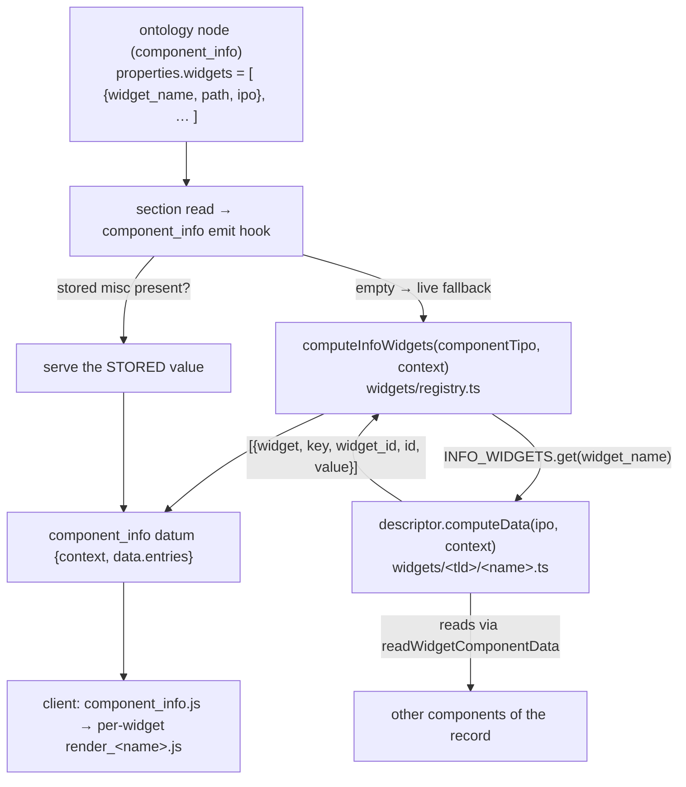

# widgets

> The `core/widgets/` subsystem — small, reusable server+client pieces that
> **compute** (rather than store) their data from other components of a record,
> and are hosted inside a [`component_info`](../components/component_info.md)
> field.

> See also: [component_info](../components/component_info.md) (the host) ·
> [Add a widget](../../development/extending/add_a_widget.md) (the how-to) ·
> [component_info cookbook](../components/component_info_cookbook.md) (recipes) ·
> [Components](../components/index.md) · [Architecture overview](../architecture_overview.md)

This is the **subsystem reference** for the widgets under `core/widgets/`
(client, copied as-is) and, on the TS/Bun server, the framework under
`src/core/components/component_info/widgets/`. On the PHP oracle this was a
multi-file subsystem anchored by one thin base class (`widget_common`) with one
`class.<name>.php` subclass per widget, loaded by `include`-from-ontology-path.
The TS port replaces the class-per-widget shape with a **descriptor registry**:
one module per widget exporting one `InfoWidgetDescriptor`, dispatched **by
name** through `registry.ts` — never by loading the ontology-authored path. For
the *info* component that hosts these widgets read
[component_info](../components/component_info.md) first.

!!! warning "Two unrelated things are called 'widget' in Dédalo"
    There are **two** separate widget systems and they do **not** share code:

    1. **`core/widgets/`** *(this document)* — record-level data widgets hosted
       by `component_info`, driven by an **IPO** (Import–Process–Output) config
       from the ontology, summarizing/collecting data from a record's components.
    2. **`core/area_maintenance/widgets/`** — the self-contained admin panels of
       the Maintenance area (`make_backup`, `update_ontology`, `media_control`,
       …). They are built by `area_maintenance` and dispatched through
       `dd_area_maintenance_api`; they are **not** IPO widgets and share no code
       with system 1. See [area_maintenance](../areas/area_maintenance.md) and
       the *dedalo-area-maintenance* skill.

    This page is about system **1**.

## Role

A **widget** (PHP oracle: a subclass of `widget_common`; TS server: one
`InfoWidgetDescriptor` module under
`src/core/components/component_info/widgets/<tld>/<name>.ts`) is a reusable unit
of *derived* data. Unlike a normal component it owns no database column: it
reads the values of one or more existing components, optionally runs them
through a process function, and returns a flat array of
`{widget, key, id, widget_id, value}` items for the client to render.

Widgets never appear on their own in a section. They are always **hosted** by a
[`component_info`](../components/component_info.md) field that lists them in its
ontology `properties.widgets` and aggregates every widget's output into its own
value. On the TS server the live compute is a **fallback**: the section read
serves the component's **stored** misc value when the client save cycle already
persisted one, and only computes live when the row is empty (mirroring PHP's
`get_db_data`). The one other server entry point is the
[`dd_component_info` `get_widget_data`](#async-widgets-the-dd_component_info-api)
API action, the delivery path for **async** widgets.



## Framework architecture (TS server)

The framework home is `src/core/components/component_info/widgets/`:

| file | role |
|---|---|
| `widget_common.ts` | The `InfoWidgetDescriptor` contract, `WidgetContext`, the shared IPO helpers (`readWidgetComponentData`, `resolveCurrent`, `findTyped`, `phpRound`), `normalizeWidgetEntryKeys` (WC-026), and the two loud errors. |
| `registry.ts` | The **one dispatch home**: the `INFO_WIDGETS` map, `getInfoWidget` (fail-loud lookup), `computeInfoWidgets` (read aggregate), `computeInfoDataList` (edit datalist). |
| `calculation/functions.ts` | The STATIC calculation process-fn registry (`CALCULATION_FUNCTIONS`) — the TS answer to PHP SEC-052 dynamic includes. |
| `grid.ts` | dd_grid_cell_object builders (`buildPortalGridValue`, `resolveGridColumns`). |
| `<tld>/<name>.ts` | One widget = one module exporting one `InfoWidgetDescriptor`. |

### The descriptor contract

Each widget module exports one `InfoWidgetDescriptor` (`widget_common.ts`):

```ts
export type InfoWidgetDescriptor =
  | {
      name: string;                 // = ontology widget_name = client JS export
      path: string;                 // = ontology path; tripwire-bound to the client module
      isAsync?: true;               // PHP is_async() — skipped by the read aggregate
      computeData(ipo: unknown[], context: WidgetContext): Promise<WidgetItem[]>;
      computeDataParsed?(ipo, context): Promise<WidgetItem[]>;  // PHP get_data_parsed (grid/export)
      computeDataList?(ipo, context): Promise<WidgetItem[]>;    // PHP get_data_list (edit datalist)
    }
  | { name: string; path: string; isAsync?: true; unported: { reason: string } };
```

- **`name`** is the registry key and must equal the ontology `widget_name` and
  the client JS class/file name.
- **`path`** mirrors the ontology `path` and locates the CLIENT module
  (`client/dedalo/core/widgets<path>/js/<name>.js`). The registry tripwire binds
  it; **dispatch never uses it**.
- **`computeData`** is the plain read path (PHP `get_data`); the optional
  `computeDataParsed` / `computeDataList` facets and `isAsync` mirror the PHP
  hooks `component_info` probed for with `method_exists()`.
- An **`unported`** stub throws `WidgetUnportedError` from its compute (with a
  required `rewrite/LEDGER.md` row) — never a silent `[]`.

### `WidgetContext` and the input helpers

`computeData(ipo, context)` receives the IPO array and a `WidgetContext`:

| field | meaning |
|---|---|
| `sectionTipo` / `sectionId` | the host record the widget reads from |
| `mode` | `edit` / `list` / `search` / `tm` |
| `lang` | the request-scoped data language (`currentDataLang()`, not a static constant) |
| `userId` / `isAdmin` | the request principal, for user-scoped tool availability (`media_icons`); absent → the superuser tool set |

Every widget reads its inputs through `readWidgetComponentData(sectionTipo,
sectionId, componentTipo)` — the full stored item array, **no** lang filtering
(PHP `component_common::get_data`, not `get_data_lang`). It never touches the
matrix directly. `resolveCurrent(declared, own)` maps the `'current'`/undefined
sentinels to this record's values; `findTyped(input, type)` scans an array-shape
input for the last entry of a `type`; `phpRound(value, precision)` matches PHP
`round()` byte-for-byte.

### The registry — the one dispatch home

`computeInfoWidgets(componentTipo, context)` (`registry.ts`) reads the node's
`properties.widgets` and, for each declared widget, looks its `widget_name` up
in `INFO_WIDGETS`, skips async ones (`isAsync`, delivered via the API), and
concatenates every widget's `computeData` output. Returns `null` when the
component declares no widgets (PHP `get_widgets → null → get_data → null`). An
unknown `widget_name` throws `WidgetNotRegisteredError`.

The registry is the **single** dispatch home: the tripwire
(`test/unit/info_widget_registry_tripwire.test.ts`) fails if any other `src/`
file builds an `INFO_WIDGETS` map, resurrects a `widget_name` switch, or defines
an `ASYNC_WIDGETS` set.

## IPO — Input · Process · Output

The widget's behaviour is data, not code: the `ipo` array read from the
ontology. Each entry has up to three parts:

- **`input`** — *what data to read.* Two real shapes:
    - **object** with `type` + `source` (+ `paths`): `source` names origin
      components with `current`/`self` sentinels; `paths` are per-leaf walks
      (`{var_name, section_tipo, component_tipo}`). Used by `media_icons`,
      `descriptors`, `state`, and (as a flat `{section_id, components}` object)
      `calculation`.
    - **array** of typed entries scanned by `type`: e.g. `{type:'source'}`,
      `{type:'used'}`, `{type:'date_in'}`, `{type:'period'}`,
      `{type:'data_diamenter'}`. Used by `get_archive_weights`,
      `get_coins_by_period`, `sum_dates`, `get_archive_states`.
- **`process`** — *how to transform it (optional).* Only `calculation` uses it,
  and only through the STATIC fn registry (see [SEC-052](#security-sec-052)).
- **`output`** — *what to emit.* An array of `{id, …}` maps; each `id` becomes
  one item in the returned array, and the grid/export paths use the output `id`
  as the column id.

Common `input` field names seen across widgets: `source`, `paths`, `var_name`,
`section_tipo`, `section_id`, `component_tipo`, `type`, `used`, `duplicated`,
`data_weights`, `data_diamenter` *(sic — persistent ontology typo, a wire
contract)*, `date_in`, `date_out`, `period`, `target_sections`,
`target_model_section_id`, `use_parent`, `answer`, `closed`. Common `output`
fields: `id`, `label`, `value` (a type hint like `int` / `float` / `text` /
`link`), plus `process_section_tipo` (media_icons tool columns).

!!! note "`id` vs `widget_id` — WC-026"
    The item key that names the output differs by widget: `calculation` emits
    `id`, most others emit `widget_id`, `test_info` emits both. The **client**
    render matches on `widget_id`; the **grid/export** builders match on `id`.
    The emit hook dualises every top-level string key
    (`normalizeWidgetEntryKeys`) so both resolve — see
    [component_info → WC-026](../components/component_info.md#dataentries--the-widget-outputs-wc-026)
    and [engineering/WIRE_CONTRACT.md](../../../engineering/WIRE_CONTRACT.md).

## The widgets that exist

All **11** widgets of the PHP census are ported. See the
[full census table with facets](../components/component_info.md#the-widget-census)
on the host page. In brief:

| widget | TLD | facet |
|---|---|---|
| `calculation` | — | static process fns; emits `id` |
| `state` | — | `computeDataList` (edit datalist) |
| `user_activity` | `dd` | `isAsync` |
| `get_archive_states` | `dmm` | shape-gated |
| `sum_dates` | `mdcat` | `computeDataParsed` |
| `get_archive_weights` | `numisdata` | — |
| `get_coins_by_period` | `numisdata` | — |
| `descriptors` | `oh` | edit-only; dd_grid term grid |
| `media_icons` | `oh` | row objects; user-scoped tools |
| `tags` | `oh` | leads with raw text items |
| `test_info` | `test` | reference stub; emits both keys |

!!! note "Coverage state is ledgered (S2-45)"
    Which widgets are byte-parity gated vs shape-gated (some have no ontology
    instance to diff against) lives in
    [rewrite/LEDGER.md](../../../rewrite/LEDGER.md), not here.

## Files & structure

The client directory (copied as-is) is organised by **TLD / domain**
sub-folders, mirroring the ontology. Each widget keeps the familiar component
file layout: `js/<name>.js` + `js/render_<name>.js`, and `css/<name>.less`; some
ship per-mode render variants (`render_edit_state.js` / `render_list_state.js`).

```text
client/dedalo/core/widgets/                 # client (copied as-is)
├── widget_common/js/widget_common.js       # JS base (init/build/render/destroy)
├── calculation/ · state/                    # no TLD folder
├── dd/user_activity/ · dmm/get_archive_states/
├── mdcat/sum_dates/ · numisdata/{get_archive_weights,get_coins_by_period}/
├── oh/{descriptors,media_icons,tags}/
└── test/test_info/                          # reference/sample widget

src/core/components/component_info/widgets/  # server (TS/Bun)
├── widget_common.ts · registry.ts · grid.ts · README.md
├── calculation/{calculation.ts,functions.ts} · state/state.ts
├── dd/user_activity.ts · dmm/get_archive_states.ts · mdcat/sum_dates.ts
├── numisdata/{get_archive_weights.ts,get_coins_by_period.ts}
├── oh/{descriptors.ts,media_icons.ts,tags.ts} · test/test_info.ts
```

The client import is unchanged from PHP:
`../../../core/widgets<path>/js/<widget_name>.js`.

## Client (JS) instantiation

`widget_common.js` is an ES6 module exporting a `widget_common` constructor that
lends `init` / `build` / `render` / `destroy` prototypes. A concrete widget JS
(e.g. `calculation.js`) imports it and assigns those plus its own
`render_<name>.js` view methods:

```js
import {widget_common}      from '../../widget_common/js/widget_common.js'
import {render_calculation} from '../js/render_calculation.js'

calculation.prototype.init    = widget_common.prototype.init
calculation.prototype.build   = widget_common.prototype.build
calculation.prototype.render  = widget_common.prototype.render
calculation.prototype.destroy = widget_common.prototype.destroy
calculation.prototype.edit    = render_calculation.prototype.edit
calculation.prototype.list    = render_calculation.prototype.list
```

`component_info.js::get_widgets()` dynamically imports each widget's JS by its
`path` (`import('../../../core/widgets' + path + '/js/' + widget_name + '.js')`),
instances it, and feeds it the server-built value slice
(`value.filter(item => item.widget === widget_name)`).

## Async widgets: the dd_component_info API

A widget whose descriptor sets `isAsync: true` (PHP `is_async() === true`) is
**skipped** by the read-time aggregate (`computeInfoWidgets`); its client JS
fetches the data itself through the `dd_component_info` API. The single allowed
action is `get_widget_data`
(`src/core/api/handlers/dd_component_info.ts`, `API_ACTIONS =
['get_widget_data']`):

```json
{
  "action" : "get_widget_data",
  "dd_api" : "dd_component_info",
  "source" : { "tipo": "dd1633", "section_tipo": "dd64", "section_id": 42, "mode": "edit" },
  "options": { "widget_name": "user_activity" }
}
```

The handler AUTHZ-01-gates the record, finds the matching `properties.widgets`
entry by `widget_name`, runs `widgetComputeData(descriptor)(ipo, context)` (this
channel computes async widgets — it is their only delivery), and returns the
item array in `result`. Failures ride as HTTP 200 with the PHP error-envelope
bytes. Full request/response shapes:
[component_info → get_widget_data](../components/component_info.md#the-get_widget_data-api-action).
`user_activity` is the only ontology-declared async widget; its data comes from
the pre-aggregated user-stats pipeline (`src/core/area_maintenance/user_stats.ts`).

## Security SEC-052

PHP `calculation`'s `process` step `include`s an ontology-specified PHP file and
calls a named function — attacker-relevant because the ontology is
admin/developer-writable. PHP `calculation::resolve_logic()` confines the
include to inside `DEDALO_WIDGETS_PATH`, requires a bare-identifier function
name, and re-checks with `ReflectionFunction` that the function was declared
inside the widgets root, logging `SEC-052` and returning `null` on any failure.

!!! note "TS has nothing to confine"
    `computeCalculation` (`widgets/calculation/calculation.ts`) never loads a
    file or resolves a function by name. Every process function is a STATIC
    entry in `CALCULATION_FUNCTIONS` (`widgets/calculation/functions.ts`);
    `summarize` / `to_euros` / `calculate_period` are the ported formulas, and
    an unknown `process.fn` resolves to no output — the same effective refusal
    SEC-052 enforces, without the confinement machinery. The `process.file` /
    `engine` keys are ignored (verification data only). If a widget needs a
    configurable formula, add a STATIC entry there — never re-introduce a
    dynamic include of ontology-supplied code.

## Public API / key methods

### Server: `src/core/components/component_info/widgets/`

| symbol | purpose |
|---|---|
| `computeInfoWidgets(componentTipo, context)` | The read aggregate: dispatch each non-async declared widget to its `computeData`, concatenate. Returns `null` when no widgets are declared. |
| `computeInfoDataList(componentTipo, context)` | The edit-mode datalist aggregate: concatenate every widget's `computeDataList` (only `state` implements it). |
| `getInfoWidget(name)` | Fail-loud registry lookup (throws `WidgetNotRegisteredError`). |
| `widgetComputeData(descriptor)` | The descriptor's compute fn, or a throw for an `unported` stub. |
| `listInfoWidgets()` | All registered descriptors (tripwire + tooling surface). |
| `readWidgetComponentData(sectionTipo, sectionId, componentTipo)` | The shared component-value reader every widget uses (full stored array, no lang filter). |
| `phpRound(value, precision)` | PHP `round()`-compatible rounding. |
| `normalizeWidgetEntryKeys(items)` | WC-026 — dualise top-level `id`/`widget_id`. |

### Emit / API integration

- `src/core/components/component_info/emit.ts` — the emit hook (stored-wins /
  live-fallback, WC-026 normalize, edit datalist attach, principal threading).
- `src/core/api/handlers/dd_component_info.ts` — the `get_widget_data` action.
- `src/core/api/handlers/observers.ts` `recomputeInfoObserver` — observer
  recompute on saves.

## How it fits with the rest of Dédalo

- **[component_info](../components/component_info.md)** — the only data-side
  host. A widget only ever runs because a `component_info` (or its
  `component_calculation` / `component_state` aliases) listed it.
- **[Components](../components/index.md)** — a widget's inputs are ordinary
  components, read via `readWidgetComponentData` (never storage).
- **[Sections](../sections/index.md)** — the read components resolve their
  values through the section's matrix record, as everywhere else.
- **[area_maintenance](../areas/area_maintenance.md)** — the *other*, unrelated
  widget family (admin panels). Different base, dispatcher and contract.

## Related

- [component_info](../components/component_info.md) — the host component.
- [Add a widget](../../development/extending/add_a_widget.md) — the how-to.
- [component_info cookbook](../components/component_info_cookbook.md) — recipes.
- [Components](../components/index.md) · [Architecture overview](../architecture_overview.md).
- Source of truth: `src/core/components/component_info/widgets/` (README.md
  checklist, registry.ts dispatch, one descriptor module per widget) and the
  copied client `core/widgets/`.
