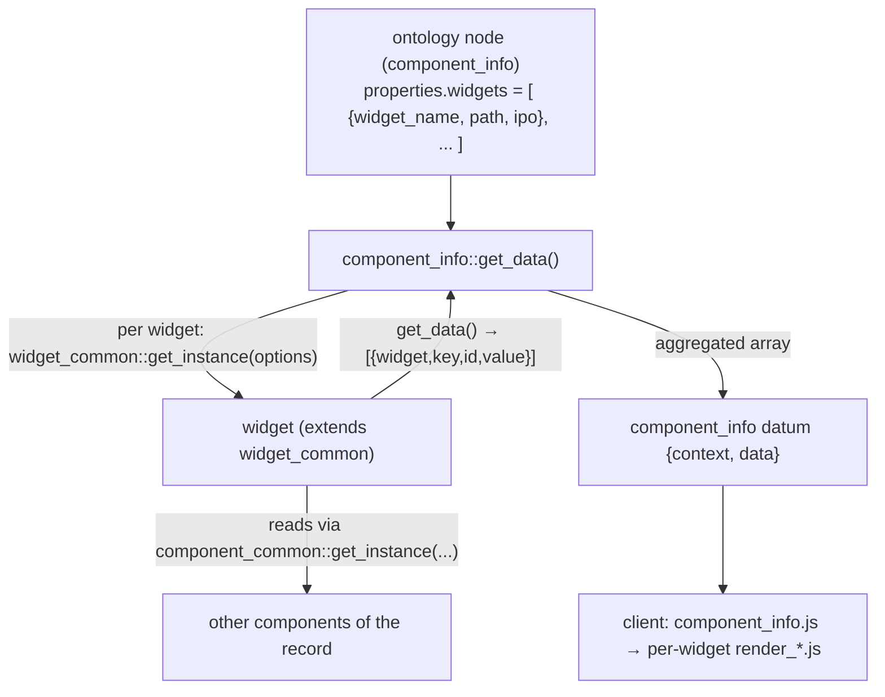

# widgets

> The `core/widgets/` subsystem — small, reusable server+client pieces that
> **compute** (rather than store) their data from other components of a record,
> and are hosted inside a [`component_info`](../components/component_info.md)
> field.

> See also: [component_info](../components/component_info.md) ·
> [Components](../components/index.md) · [Sections](../sections/index.md) ·
> [Architecture overview](../architecture_overview.md)

This is the **subsystem reference** for the widgets that live under
`core/widgets/`. It is a *multi-file/client subsystem* anchored by one thin PHP
base class (`widget_common`) and its JS twin, not a single class — so it follows
the multi-file template. For the conceptual model of *info* components (the
container that hosts these widgets) read
[component_info](../components/component_info.md) first.

!!! warning "Two unrelated things are called 'widget' in Dédalo"
    There are **two** separate widget systems and they do **not** share code:

    1. **`core/widgets/`** *(this document)* — record-level data widgets hosted by
       `component_info`. They extend `widget_common`, are driven by an **IPO**
       (Input-Process-Output) config from the ontology, and summarize/collect data
       from the current record's components.
    2. **`core/area_maintenance/widgets/`** — the ~28 self-contained
       admin/operational panels of the Maintenance area (`make_backup`,
       `update_ontology`, `media_control`, `dataframe_control`, …). They are
       *not* `widget_common` subclasses; they are built by
       `area_maintenance::widget_factory()` and dispatched through
       `dd_area_maintenance_api`. They are documented in
       [area_maintenance](../areas/area_maintenance.md).

    This page is about system **1**. Where it refers to the maintenance widgets it
    says so explicitly.

## Role

A **widget** (here: a subclass of `widget_common`, in
`core/widgets/widget_common/class.widget_common.php`) is a reusable unit of
*derived* data. Unlike a normal component, a widget owns no database column: it
reads the values of one or more existing components (of the current record, of
all records, or of the active search session), optionally runs them through a
processing function, and returns a flat array of `{widget, key, id, value}`
items for the client to render.

Widgets never appear on their own in a section. They are always **hosted** by a
[`component_info`](../components/component_info.md) field, which declares the
list of widgets it shows in its ontology `properties.widgets` and aggregates
every widget's output into its own value. `component_info` is the only data-side
caller; the only other server entry point is the
[`dd_component_info`](#async-widgets-the-dd_component_info-api) API action, used
by *async* widgets that fetch their data lazily from the client.



**Prose description of the diagram above:** A `component_info` ontology node
carries a `properties.widgets` list, each entry naming a `widget_name`, a `path`
and an `ipo` config. When `component_info::get_data()` runs, it instances each
listed widget through `widget_common::get_instance()`. Each widget reads the
values of other components of the record (via `component_common::get_instance()`)
and returns a flat array of `{widget, key, id, value}` items. `component_info`
concatenates every widget's output into its own `data`, ships it inside the
component datum, and the client (`component_info.js`) hands each widget's slice
to that widget's `render_*.js`.

## Responsibilities

- **Base contract (`widget_common`)** — define the shared property set
  (`section_tipo`, `section_id`, `mode`, `lang`, `ipo`), the factory
  `get_instance()`, and the `get_data()` / `get_data_parsed()` contract every
  widget must honour.
- **Data computation (each subclass)** — resolve its IPO config into a flat
  array of output items by reading other components, aggregating across records,
  or querying the search session.
- **No persistence** — a widget never reads or writes the matrix directly; it
  always goes through `component_common::get_instance()` (and that component goes
  through its section). The host `component_info` likewise has
  `use_db_data = false`.
- **Client render** — each widget ships its own JS (`<name>.js`) and renderer
  (`render_<name>.js`) plus LESS, and consumes the data slice the server built
  (or, for async widgets, fetches it itself).
- **Optional hooks** — a widget may add `get_data_parsed()` (post-processing for
  grid/export), `get_data_list()` (enumerate selectable values, e.g. a dropdown),
  or `is_async()` (defer data loading to the client).

## Key concepts

### The widget options object

Every widget is built from one `options` object (see
[Instantiation](#instantiation--lifecycle)). The host `component_info` fills it
from the ontology widget entry plus the record context:

| field | source | meaning |
| --- | --- | --- |
| `widget_name` | `properties.widgets[].widget_name` | the class name to instance, e.g. `calculation` |
| `path` | `properties.widgets[].path` | path under `DEDALO_WIDGETS_PATH` to the class file, e.g. `numisdata/get_archive_weights` |
| `ipo` | `properties.widgets[].ipo` | the Input-Process-Output config (array of objects) |
| `section_tipo` | the host record | section the widget reads from |
| `section_id` | the host record | record id (may be `null` in list mode) |
| `mode` | the host component | `edit` / `list` / `search` / `tm` |
| `lang` | `DEDALO_DATA_LANG` | working language |

### IPO — Input · Process · Output

The widget's behaviour is data, not code: it is the `ipo` array read from the
ontology. Each IPO entry has up to three parts, and a widget interprets them as
it sees fit (only `calculation` uses all three literally):

- **`input`** — *what data to read.* Names the source components and how to scope
  them. `calculation` recognises the `section_id` scopes `current` (this
  record), `all` (sum across all records) and `search_session` (read/sum from the
  active search filter), and binds each component's value to a `var_name`.
- **`process`** — *how to transform it (optional).* For `calculation` only: an
  external PHP file + function name. The transform is **security-confined**
  (see [SEC-052](#security-sec-052-confined-calculation-logic)).
- **`output`** — *what to emit.* An array of `{id, …}` maps; each `id` becomes
  one item in the returned data array, and `component_info`'s grid/export paths
  use the output `id` as the column id (one column per output).

A returned data item is flat and uniform:

```json
{ "widget": "calculation", "key": 0, "id": "total", "value": "1,234.56 euros" }
```

!!! note "`id` vs `widget_id`"
    The data-item key that names the output is **not** consistent across widgets:
    `calculation` and `sum_dates` emit `id`, while `get_archive_weights` and
    `user_activity` emit `widget_id`. `component_info`'s grid/export code matches
    on `id`. This is a real inconsistency in the current code, not a documentation
    simplification — check the specific widget when wiring a new consumer.

## Files & structure

The directory is organised by **TLD / domain** sub-folders, mirroring the
ontology (`dd`, `oh`, `numisdata`, `mdcat`, `dmm`, `state`, `test`, …). Each
widget keeps the familiar component file layout: a server `class.<name>.php`, a
client `js/<name>.js` + `js/render_<name>.js`, and `css/<name>.less`. Some
widgets also ship `<mode>`/`<view>` render variants (e.g. `render_edit_state.js`
/ `render_list_state.js`).

```text
core/widgets/
├── widget_common/                 # the base
│   ├── class.widget_common.php     # PHP base class + get_instance() factory
│   └── js/widget_common.js         # JS base (init/build/render/destroy prototypes)
├── calculation/                    # generic IPO calculator (input/process/output)
│   ├── class.calculation.php
│   ├── formulas.php                # bundled processing functions
│   ├── js/calculation.js · js/render_calculation.js
│   └── css/calculation.less
├── state/                          # record completion state / situation
├── dd/user_activity/               # async user-activity graph (diffusion stats)
├── oh/{descriptors,media_icons,tags}/
├── numisdata/{get_archive_weights,get_coins_by_period}/
├── mdcat/{calculation/mdcat.php, sum_dates/, marc21/marc21_vars.php}
├── dmm/get_archive_states/
└── test/test_info/                 # reference/sample widget
```

`DEDALO_WIDGETS_PATH` (and `DEDALO_WIDGETS_URL`) are defined in
`config/config.php` as `DEDALO_CORE_PATH . '/widgets'`; the PHP factory
`include`s `DEDALO_WIDGETS_PATH . $path . '/class.' . $widget_name . '.php'`, and
the client imports `../../../core/widgets<path>/js/<widget_name>.js`.

### The widgets that exist (server classes)

Every entry below has a `class.<name>.php` extending `widget_common`:

| widget | path | purpose |
| --- | --- | --- |
| `calculation` | `calculation` | Generic IPO calculator: read components (current / all / search_session), apply an external `process` function, emit `output` items. |
| `state` | `state` | Resolve a record's completion **state**/situation by following ontology paths; per-column totals and percentage-done across project languages. Adds `get_data_list()`. |
| `user_activity` | `dd/user_activity` | A user's activity graph over a date range from diffusion stats. **Async** (`is_async()` → fetched via the API). |
| `descriptors` | `oh/descriptors` | Oral-history descriptors/index summary for a record. |
| `media_icons` | `oh/media_icons` | Icons summarising which media a record carries. |
| `tags` | `oh/tags` | Transcription tag summary. |
| `get_archive_weights` | `numisdata/get_archive_weights` | Aggregate weight/diameter stats (media/max/min/count) over linked numismatic records. |
| `get_coins_by_period` | `numisdata/get_coins_by_period` | Count/group coins by period. |
| `sum_dates` | `mdcat/sum_dates` | Sum/format date spans. Adds `get_data_parsed()` for grid/export output. |
| `get_archive_states` | `dmm/get_archive_states` | Aggregate archive state values. |
| `test_info` | `test/test_info` | Minimal reference widget used by tests/samples. |

!!! note "Non-class helpers"
    `calculation` resolves its `process` function from a bundled file. Two such
    files ship here: `mdcat/calculation/mdcat.php` (e.g. `to_euros`) and the
    widget-local `calculation/formulas.php`. `mdcat/marc21/marc21_vars.php` is a
    plain support file, not a widget class.

## Instantiation & lifecycle

### Server (PHP)

The base class is `widget_common` (no `extends` — it is a plain class). It has a
**protected constructor**, so widgets are built only through the static factory:

```php
public static function get_instance(object $options) : object
// $options:
// {
//   widget_name  : string  // class name, e.g. 'calculation'
//   path         : string  // path under DEDALO_WIDGETS_PATH, e.g. 'numisdata/get_archive_weights'
//   ipo          : array   // Input-Process-Output config from the ontology
//   section_tipo : string
//   section_id   : int|string|null   // null in list mode
//   lang         : string
//   mode         : string  // 'edit' | 'list' | 'search' | 'tm'
// }
```

`get_instance()` `include_once`s the class file (resolved from `path` +
`widget_name`) and does `new $widget_name($options)`. A subclass that needs
extra options overrides `__construct()`, calls `parent::__construct($options)`,
then reads its own fields (see `user_activity` capturing `date_in` / `date_out`).

```php
// build and run a widget the way component_info does
$widget_options = new stdClass();
    $widget_options->widget_name  = 'calculation';
    $widget_options->path         = 'calculation';
    $widget_options->ipo          = $widget_obj->ipo; // from properties.widgets[]
    $widget_options->section_tipo = $section_tipo;
    $widget_options->section_id   = $section_id;
    $widget_options->lang         = DEDALO_DATA_LANG;
    $widget_options->mode         = 'edit';

$widget = widget_common::get_instance($widget_options);
$data   = $widget->get_data(); // array of {widget, key, id|widget_id, value}
```

### Client (JS)

`widget_common.js` is an ES6 module exporting a `widget_common` constructor that
lends `init` / `build` / `render` / `destroy` prototypes (the last three borrowed
from `common`). A concrete widget JS (e.g. `calculation.js`) imports it and
assigns those prototypes plus its own `render_<name>.js` view methods:

```js
import {widget_common}      from '../../widget_common/js/widget_common.js'
import {render_calculation} from '../js/render_calculation.js'

calculation.prototype.init    = widget_common.prototype.init
calculation.prototype.build   = widget_common.prototype.build
calculation.prototype.render  = widget_common.prototype.render
calculation.prototype.destroy = widget_common.prototype.destroy
calculation.prototype.edit    = render_calculation.prototype.edit
calculation.prototype.list    = render_calculation.prototype.list
```

`component_info.js::get_widgets()` dynamically imports each widget's JS by its
`path` (`import('../../../core/widgets' + path + '/js/' + widget_name + '.js')`),
instances it, and feeds it the server-built value slice
(`value.filter(item => item.widget === widget_name)`).

## Public API / Key methods

### widget_common (base)

| method | static? | purpose |
| --- | --- | --- |
| `get_instance($options)` | ✓ | Factory: `include` the widget class file (from `path` + `widget_name`) and return `new $widget_name($options)`. |
| `__construct($options)` | | **Protected.** Set `section_tipo`, `section_id`, `mode`, `lang`, `ipo` from the options object. Override (calling `parent::__construct`) to capture widget-specific options. |
| `get_data()` | | The data contract. The base implementation only logs a warning and returns `null` — **every widget must override it** to return its `[{widget, key, id, value}]` array. |
| `get_data_parsed()` | | Pass-through to `get_data()` by default; override to post-process before grid/export (see `sum_dates`). |

### Optional methods a widget may add

These are not declared on the base; `component_info` and `dd_component_info`
probe for them with `method_exists()`:

| method | found on | purpose |
| --- | --- | --- |
| `get_data_list()` | `state` | Enumerate selectable values (e.g. a dropdown datalist); aggregated by `component_info::get_data_list()`. |
| `get_data_parsed()` | `sum_dates` (override) | Reshape data for grid/export columns; used by `component_info::get_grid_value()` / `get_export_value()`. |
| `is_async()` | `user_activity` | Return `true` to load data lazily on the client; `component_info` then **skips** the synchronous `get_data()` for that widget. |

### component_info host methods (where widgets are consumed)

For the full `component_info` reference see
[component_info](../components/component_info.md); the widget-facing surface is:

| method | purpose |
| --- | --- |
| `get_widgets()` | Read `properties.widgets` (the ontology list of `{widget_name, path, ipo}`). |
| `get_data()` | Instance each widget, skip async ones, concatenate every `get_data()` output into the component's value (cached in `data_resolved`). |
| `get_data_parsed()` | Same loop using each widget's `get_data_parsed()`. |
| `get_data_list()` | Concatenate each widget's `get_data_list()` (when present). |
| `get_grid_value()` / `get_export_value()` | Walk each widget IPO `output` to build one grid column / one export atom per output `id`. |

## How it fits with the rest of Dédalo

- **[component_info](../components/component_info.md)** — the host. It is the
  *info* literal component (`extends component_common`, `use_db_data = false`)
  whose value **is** the aggregated output of its configured widgets. This is the
  primary integration point: a widget only ever runs because a `component_info`
  field listed it.
- **[Components](../components/index.md)** — a widget's inputs are ordinary
  components, instanced through `component_common::get_instance()`. Widgets read
  their `get_calculation_data()` / `get_data()`; they never touch storage.
- **[Sections](../sections/index.md) / [section_record](../sections/section_record.md)**
  — the components a widget reads still resolve their values through the section
  and its record, exactly as everywhere else.
- **[Search / SQO](../sqo.md)** — `calculation` builds search query objects
  (`search::get_instance()`) for its `all` and `search_session` scopes, and can
  execute stored SQOs held in a `component_json` (`exec_data_filter_data()`).
- **Diffusion** — `user_activity` reads aggregated stats from
  `diffusion_section_stats` rather than from the work matrix.
- **[area_maintenance](../areas/area_maintenance.md)** — the *other* widget
  family. Those are operational admin panels, built by
  `area_maintenance::widget_factory()` and gated by `dd_area_maintenance_api`
  (`API_ACTIONS`, `BACKGROUND_RUNNABLE`); they do **not** extend `widget_common`
  and are not driven by IPO. Cross-referenced here only to avoid confusion.

### Async widgets: the dd_component_info API

A widget that returns `is_async() === true` is **skipped** by
`component_info::get_data()` server-side; its client JS fetches the data itself
through the `dd_component_info` API. The single allowed action is
`get_widget_data` (`dd_component_info::API_ACTIONS = ['get_widget_data']`):

```json
{
  "action" : "get_widget_data",
  "dd_api" : "dd_component_info",
  "source" : { "tipo": "oh87", "section_tipo": "...", "section_id": "...", "mode": "edit" },
  "options": { "widget_name": "user_activity" }
}
```

Server-side, `get_widget_data` instances the host component (mode `list`), finds
the matching `properties.widgets` entry by `widget_name`, builds the widget via
`widget_common::get_instance()`, and returns `widget->get_data()` in
`response.result`. On the client this request is issued from the shared
`widget_common.prototype.build` (the `caller === 'component_info'` autoload
branch).

### Security: SEC-052 (confined calculation logic)

`calculation`'s `process` step `include`s an ontology-specified PHP file and
calls a named function — both attacker-relevant because the ontology is
admin/developer-writable. `calculation::resolve_logic()` therefore:

1. `realpath`-confines the included file to inside `DEDALO_WIDGETS_PATH`;
2. requires the function name to be a **bare identifier** (regex
   `^[a-zA-Z_][a-zA-Z0-9_]{0,63}$` — no builtins, no namespaced or method calls);
3. after the include, uses `ReflectionFunction` to confirm the function was
   actually **declared inside** the widgets root before invoking it.

Any failure logs a `SEC-052` error and returns `null`.

## Examples

### A `component_info` field declaring two widgets (ontology `properties`)

```json
{
  "widgets": [
    {
      "widget_name": "calculation",
      "path": "calculation",
      "ipo": [
        {
          "input": {
            "section_tipo": "current",
            "section_id": "current",
            "value": "sum",
            "components": [
              { "tipo": "test139", "var_name": "number" }
            ]
          },
          "process": {
            "engine": "php",
            "file": "/mdcat/calculation/mdcat.php",
            "fn": "to_euros",
            "options": { "label": true, "separator": ", " }
          },
          "output": [
            { "id": "total", "value": "float", "label_after": "euros" }
          ]
        }
      ]
    },
    {
      "widget_name": "get_archive_weights",
      "path": "numisdata/get_archive_weights",
      "ipo": [ /* input/output map */ ]
    }
  ]
}
```

`component_info::get_data()` returns the concatenation of both widgets' output,
e.g.:

```json
[
  { "widget": "calculation",          "key": 0, "id": "total",         "value": "1,234.56 euros" },
  { "widget": "get_archive_weights",  "key": 0, "widget_id": "media_weight", "value": 12.45 }
]
```

### Writing a new widget

```php
<?php declare(strict_types=1);
class my_widget extends widget_common {

    public function get_data() : ?array {

        $ipo = $this->ipo ?? [];
        if (empty($ipo)) {
            return null;
        }

        $data = [];
        foreach ($ipo as $key => $current_ipo) {
            foreach ($current_ipo->output as $data_map) {
                $current_data = new stdClass();
                    $current_data->widget = get_class($this);
                    $current_data->key    = $key;
                    $current_data->id     = $data_map->id;     // match component_info on `id`
                    $current_data->value  = /* compute from inputs */ null;
                $data[] = $current_data;
            }
        }

        return $data;
    }//end get_data
}//end class my_widget
```

Place it at `core/widgets/<tld>/my_widget/class.my_widget.php`, ship
`js/my_widget.js` + `js/render_my_widget.js` + `css/my_widget.less`, then list it
in a `component_info` node's `properties.widgets` with the matching
`widget_name` and `path`.

!!! note "Output key convention"
    Emit `id` (not `widget_id`) on each data item so `component_info`'s grid and
    export builders can find your values — they match on `item->id`.

## Related

- [component_info](../components/component_info.md) — the host component; the
  only data-side caller of these widgets.
- [Components](../components/index.md) — the field abstraction widgets read from;
  `component_info` is the *info* literal component.
- [Sections](../sections/index.md) · [section_record](../sections/section_record.md)
  — how the read components resolve their data.
- [area_maintenance](../areas/area_maintenance.md) — the *other*, unrelated
  widget family (admin/operational panels).
- [SQO](../sqo.md) — the search query objects `calculation` builds for `all` /
  `search_session` scopes.
- [Architecture overview](../architecture_overview.md) — server-build /
  client-render data flow and the `{context, data}` datum.

