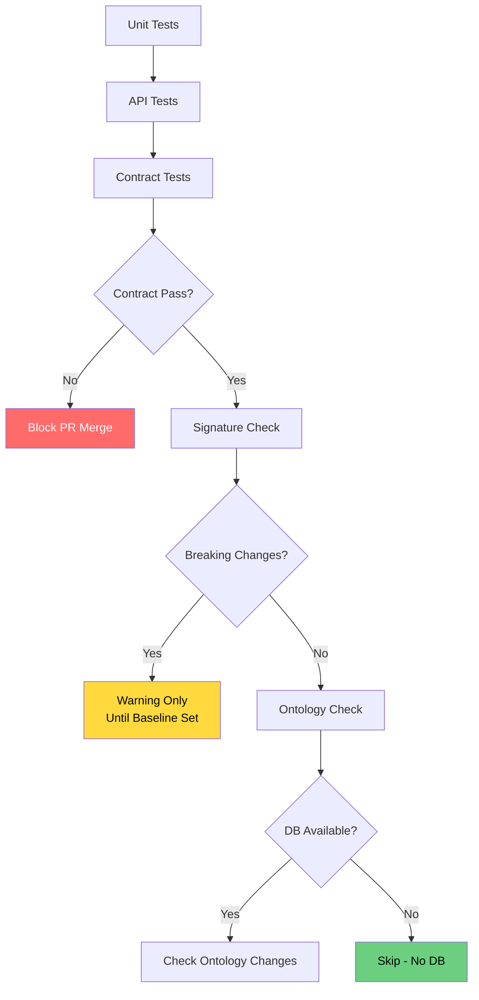

# Breaking Change Detection

Automated detection system for API, signature, and data model changes that could break client integrations or internal code.

## Overview

Dédalo v7 includes a comprehensive breaking change detection system to protect against regressions in the v7_developer and master branches. The system detects three categories of breaking changes:

1. **API Contract Changes** - JSON response structure modifications
2. **Method Signature Changes** - PHP class/method signature modifications
3. **Data Model Changes** - Ontology structure and tipo -> model mapping changes

## Quick Start

### For CI/CD (Automated)

All checks run automatically on push/PR to `v7_developer` and `master`:

```bash
# CI runs these automatically:
# 1. Unit Tests
# 2. API Tests
# 3. Contract Tests
# 4. Signature Check
# 5. Ontology Check
```

### For Developers (Manual)

#### API Contract Testing

```bash
# Run contract tests
vendor/bin/phpunit --testsuite contract

# Update snapshots after intentional API changes
UPDATE_SNAPSHOTS=true vendor/bin/phpunit --testsuite contract

# Run single contract test
vendor/bin/phpunit --filter test_get_ontology_map_contract
```

#### Method Signature Checking

```bash
# Check signatures against baseline
php dev/signature_tracker/signature-check.php

# Create new baseline (run once per major version)
php dev/signature_tracker/signature-check.php --create-baseline

# JSON output for parsing
php dev/signature_tracker/signature-check.php --format=json
```

#### Data Model Checking

```bash
# Check ontology against baseline
php dev/ontology_tracker/ontology-check.php

# Create new baseline
php dev/ontology_tracker/ontology-check.php --create-baseline
```

## What Constitutes a Breaking Change?

### API Contract Changes (Breaking)

- **Removed fields** in JSON responses
- **Type changes** for existing fields
- **Renamed fields** (removal of old name)
- **Required field made optional** (may break strict clients)

### API Contract Changes (Safe)

- **New fields added** (backward compatible)
- **Optional fields added**
- **Field made optional** from required

### Method Signature Changes (Breaking)

- **Method removed**
- **Parameter removed**
- **Parameter type changed**
- **Required parameter added**
- **Return type changed**
- **Public method made private/protected**
- **Static modifier changed**

### Method Signature Changes (Safe)

- **New method added**
- **Optional parameter added**
- **Private method made public/protected**

### Data Model Changes (Breaking)

- **Column removed** from dd_ontology/matrix_dd
- **Column type changed** (e.g., VARCHAR → TEXT)
- **Column made NOT NULL** (from nullable)
- **Tipo model changed** (e.g., section → component)
- **Tipo removed** from ontology
- **Critical system tipo modified**

### Data Model Changes (Safe)

- **New column added**
- **New tipo added**
- **Index added/removed**
- **Column made nullable**

## CI/CD Pipeline

See `.github/workflows/phpunit.yml` for full pipeline configuration.



## Tools Reference

### API Contract Testing

**Location:** `test/server/contract/`

| File | Purpose |
|------|---------|
| `ApiContractSnapshotTest.php` | PHPUnit tests for API endpoints |
| `SnapshotComparator.php` | Utility for comparing/normalizing snapshots |
| `snapshots/*.json` | Golden master snapshots |

**Environment Variables:**

- `UPDATE_SNAPSHOTS=true` - Update all snapshots (use after intentional changes)

### Signature Tracking

**Location:** `tools/signature_tracker/`

| File | Purpose |
|------|---------|
| `SignatureExtractor.php` | Extracts class/method signatures via reflection |
| `SignatureComparator.php` | Compares signatures with breaking change detection |
| `signature-check.php` | CLI tool for checking/creating baselines |
| `baselines/signatures.json` | Stored baseline signatures |

**Tracked Classes:**

- Core API classes: `dd_diffusion_api`, `dd_utils_api`, `dd_api`
- Component bases: `component_common`, `component_string_common`, etc.
- Core system: `search`, `section`, `ontology_node`
- Data management: `matrix_common`, `RecordDataBoundObject`
- Utilities: `common`, `dd_cache`, `locator`, `filter`

### Ontology Tracking

**Location:** `dev/ontology_tracker/`

| File | Purpose |
|------|---------|
| `OntologySnapshotExtractor.php` | Extracts ontology/database structure |
| `OntologyComparator.php` | Compares ontology with change detection |
| `ontology-check.php` | CLI tool for checking/creating baselines |
| `baselines/ontology.json` | Stored ontology baseline |

**Tracked Tables:**

- `dd_ontology` - Main ontology definitions
- `matrix_dd` - Ontology matrix data

**Critical Checks:**

- Tipo → model mappings
- Critical system tipos (dd1, dd2, etc.)
- Table structure (columns, indexes)

## Handling Breaking Changes

### Step 1: Detect

CI will fail with breaking changes. Review the error output:

```
❌ Found changes in 2 class(es)
   Breaking: 1 | Warnings: 1

Class: dd_diffusion_api
  🔴 Method 'diffuse()' return type changed from 'object' to 'array'

Category: tipo_model_mapping
  🔴 Tipo 'numisdata3' model changed from 'section' to 'component'
```

### Step 2: Evaluate

**Is this intentional?**

- **Yes, planned change:** Proceed to update baselines
- **No, accidental:** Revert the change

**Does it require migration?**

- **API changes:** May require client updates
- **Method signature changes:** May require internal refactoring
- **Data model changes:** May require database migration script

### Step 3: Document

Add to commit message:

```
feat(api)!: change diffuse() return type to array

BREAKING CHANGE: dd_diffusion_api::diffuse() now returns array instead of object
- Updated snapshots with UPDATE_SNAPSHOTS=true
- Clients must update response handling
- See docs/development/breaking_change_detection.md for migration guide
```

### Step 4: Update Baselines (if intentional)

**API Contracts:**

```bash
UPDATE_SNAPSHOTS=true vendor/bin/phpunit --testsuite contract
```

**Signatures:**

```bash
php dev/signature_tracker/signature-check.php --create-baseline
```

**Ontology:**

```bash
php dev/ontology_tracker/ontology-check.php --create-baseline
```

### Step 5: Commit Changes

Include updated baselines in the same PR:

```bash
git add test/server/contract/snapshots/
git add tools/signature_tracker/baselines/
git add dev/ontology_tracker/baselines/
git commit -m "update baselines for v7.5.0 breaking changes"
```

## Exit Codes

| Tool | Code | Meaning |
|------|------|---------|
| PHPUnit | 0 | All tests passed |
| PHPUnit | 1 | Test failures |
| signature-check | 0 | No breaking changes |
| signature-check | 1 | General error |
| signature-check | 2 | Breaking changes detected |
| signature-check | 3 | No baseline exists |
| ontology-check | 0 | No breaking changes |
| ontology-check | 1 | General error |
| ontology-check | 2 | Breaking changes detected |
| ontology-check | 3 | No baseline exists |

## Troubleshooting

### "No baseline found" Error

**Cause:** Baseline hasn't been created yet

**Fix:**
```bash
php dev/signature_tracker/signature-check.php --create-baseline
php dev/ontology_tracker/ontology-check.php --create-baseline
```

### False Positives on Dynamic Data

**Cause:** Snapshots include timestamps, IDs, or session data

**Fix:** Already handled by `SnapshotComparator` - it strips dynamic fields before comparison. If new dynamic fields appear, add them to `DYNAMIC_FIELDS` array.

### CI Fails but Local Passes

**Cause:** Outdated local baseline

**Fix:**
```bash
git checkout origin/master -- dev/signature_tracker/baselines/
git checkout origin/master -- dev/ontology_tracker/baselines/
git checkout origin/master -- test/server/contract/snapshots/
```

### "Class not found" in Signature Check

**Cause:** Autoloader can't find class file

**Fix:** Check class exists in `SignatureExtractor::CLASSES_TO_TRACK` or add autoload pattern in `autoloadClass()`.

## Best Practices

1. **Update baselines in separate commit** from code changes (for review clarity)
2. **Never update baselines without reviewing** the diff first
3. **Document breaking changes** in commit messages and CHANGELOG
4. **Test locally** before pushing: `vendor/bin/phpunit --testsuite contract`
5. **Keep baselines in version control** - they are the contract
6. **Use `--format=json`** for automated parsing in CI scripts

## Related Documentation

- `docs/core/components.md` - Component structure and JSON format
- `docs/diffusion/` - Diffusion API documentation
- `docs/api/` - API reference

## Questions?

Contact: Dédalo Development Team
