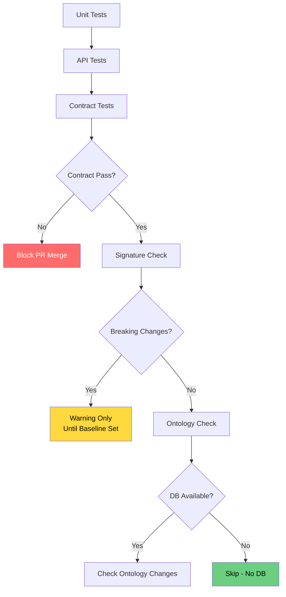

# Breaking change detection

> See also: [Testing](testing.md) · [Development overview](index.md)

An automated system that detects API, signature and data-model changes which could break client integrations or internal code.

## Overview

Dédalo v7 includes a breaking-change detection system that guards against regressions on the `v7_developer` and `master` branches. It detects three categories of breaking change:

1. **API contract changes** — JSON response-structure modifications
2. **Method signature changes** — PHP class/method signature modifications
3. **Data model changes** — ontology structure and `tipo` → `model` mapping changes

## Quick start

### For CI/CD (automated)

All checks run automatically on push/PR to `v7_developer` and `master`:

```bash
# CI runs these automatically:
# 1. Unit Tests
# 2. API Tests
# 3. Contract Tests
# 4. Signature Check
# 5. Ontology Check
```

### For developers (manual)

#### API contract testing

```bash
# Run contract tests
vendor/bin/phpunit --testsuite contract

# Update snapshots after intentional API changes
UPDATE_SNAPSHOTS=true vendor/bin/phpunit --testsuite contract

# Run single contract test
vendor/bin/phpunit --filter test_get_ontology_map_contract
```

#### Method signature checking

```bash
# Check signatures against baseline
php dev/signature_tracker/signature-check.php

# Create new baseline (run once per major version)
php dev/signature_tracker/signature-check.php --create-baseline

# JSON output for parsing
php dev/signature_tracker/signature-check.php --format=json
```

#### Data model checking

```bash
# Check ontology against baseline
php dev/ontology_tracker/ontology-check.php

# Create new baseline
php dev/ontology_tracker/ontology-check.php --create-baseline
```

## What constitutes a breaking change?

### API contract changes (breaking)

- **Removed fields** in JSON responses
- **Type changes** for existing fields
- **Renamed fields** (removal of the old name)
- **Required field made optional** (may break strict clients)

### API contract changes (safe)

- **New fields added** (backward compatible)
- **Optional fields added**
- **Field made optional** from required

### Method signature changes (breaking)

- **Method removed**
- **Parameter removed**
- **Parameter type changed**
- **Required parameter added**
- **Return type changed**
- **Public method made private/protected**
- **Static modifier changed**

### Method signature changes (safe)

- **New method added**
- **Optional parameter added**
- **Private method made public/protected**

### Data model changes (breaking)

- **Column removed** from dd_ontology/matrix_dd
- **Column type changed** (e.g., VARCHAR → TEXT)
- **Column made NOT NULL** (from nullable)
- **Tipo model changed** (e.g., section → component)
- **Tipo removed** from ontology
- **Critical system tipo modified**

### Data model changes (safe)

- **New column added**
- **New tipo added**
- **Index added/removed**
- **Column made nullable**

## CI/CD Pipeline

See `.github/workflows/phpunit.yml` for full pipeline configuration.



## Tools reference

### API contract testing

**Location:** `test/server/contract/`

| File | Purpose |
|------|---------|
| `ApiContractSnapshotTest.php` | PHPUnit tests for API endpoints |
| `SnapshotComparator.php` | Utility for comparing/normalizing snapshots |
| `snapshots/*.json` | Golden-master snapshots |

**Environment variables:**

- `UPDATE_SNAPSHOTS=true` — update all snapshots (use after intentional changes)

### Signature tracking

**Location:** `dev/signature_tracker/`

| File | Purpose |
|------|---------|
| `SignatureExtractor.php` | Extracts class/method signatures via reflection |
| `SignatureComparator.php` | Compares signatures with breaking-change detection |
| `signature-check.php` | CLI tool for checking/creating baselines |
| `baselines/signatures.json` | Stored baseline signatures |

**Tracked classes:**

- Core API classes: `dd_diffusion_api`, `dd_utils_api`, `dd_api`
- Component bases: `component_common`, `component_string_common`, etc.
- Core system: `search`, `section`, `ontology_node`
- Data management: `matrix_common`, `RecordDataBoundObject`
- Utilities: `common`, `dd_cache`, `locator`, `filter`

### Ontology tracking

**Location:** `dev/ontology_tracker/`

| File | Purpose |
|------|---------|
| `OntologySnapshotExtractor.php` | Extracts ontology/database structure |
| `OntologyComparator.php` | Compares ontology with change detection |
| `ontology-check.php` | CLI tool for checking/creating baselines |
| `baselines/ontology.json` | Stored ontology baseline |

**Tracked tables:**

- `dd_ontology` — main ontology definitions
- `matrix_dd` — ontology matrix data

**Critical checks:**

- `tipo` → `model` mappings
- Critical system tipos (`dd1`, `dd2`, …)
- Table structure (columns, indexes)

## Handling breaking changes

### Step 1: detect

CI fails on a breaking change. Review the error output:

```text
❌ Found changes in 2 class(es)
   Breaking: 1 | Warnings: 1

Class: dd_diffusion_api
  🔴 Method 'diffuse()' return type changed from 'object' to 'array'

Category: tipo_model_mapping
  🔴 Tipo 'numisdata3' model changed from 'section' to 'component'
```

### Step 2: evaluate

**Is this intentional?**

- **Yes, a planned change:** proceed to update the baselines.
- **No, accidental:** revert the change.

**Does it require migration?**

- **API changes** may require client updates.
- **Method signature changes** may require internal refactoring.
- **Data model changes** may require a database migration script.

### Step 3: document

Add to the commit message:

```text
feat(api)!: change diffuse() return type to array

BREAKING CHANGE: dd_diffusion_api::diffuse() now returns array instead of object
- Updated snapshots with UPDATE_SNAPSHOTS=true
- Clients must update response handling
- See docs/development/breaking_change_detection.md for migration guide
```

### Step 4: update baselines (if intentional)

**API contracts:**

```bash
UPDATE_SNAPSHOTS=true vendor/bin/phpunit --testsuite contract
```

**Signatures:**

```bash
php dev/signature_tracker/signature-check.php --create-baseline
```

**Ontology:**

```bash
php dev/ontology_tracker/ontology-check.php --create-baseline
```

### Step 5: commit the changes

Include the updated baselines in the same PR:

```bash
git add test/server/contract/snapshots/
git add dev/signature_tracker/baselines/
git add dev/ontology_tracker/baselines/
git commit -m "chore: update baselines for v7.5.0 breaking changes"
```

## Exit Codes

| Tool | Code | Meaning |
|------|------|---------|
| PHPUnit | 0 | All tests passed |
| PHPUnit | 1 | Test failures |
| signature-check | 0 | No breaking changes |
| signature-check | 1 | General error |
| signature-check | 2 | Breaking changes detected |
| signature-check | 3 | No baseline exists |
| ontology-check | 0 | No breaking changes |
| ontology-check | 1 | General error |
| ontology-check | 2 | Breaking changes detected |
| ontology-check | 3 | No baseline exists |

## Troubleshooting

### "No baseline found" error

**Cause:** the baseline has not been created yet.

**Fix:**
```bash
php dev/signature_tracker/signature-check.php --create-baseline
php dev/ontology_tracker/ontology-check.php --create-baseline
```

### False positives on dynamic data

**Cause:** snapshots include timestamps, ids or session data.

**Fix:** this is already handled by `SnapshotComparator`, which strips dynamic fields before comparison. If new dynamic fields appear, add them to the `DYNAMIC_FIELDS` array.

### CI fails but local passes

**Cause:** an outdated local baseline.

**Fix:**
```bash
git checkout origin/master -- dev/signature_tracker/baselines/
git checkout origin/master -- dev/ontology_tracker/baselines/
git checkout origin/master -- test/server/contract/snapshots/
```

### "Class not found" in the signature check

**Cause:** the autoloader cannot find the class file.

**Fix:** check that the class exists in `SignatureExtractor::CLASSES_TO_TRACK`, or add an autoload pattern in `autoloadClass()`.

## Best practices

1. **Update baselines in a separate commit** from code changes, for review clarity.
2. **Never update a baseline without reviewing the diff first.**
3. **Document breaking changes** in commit messages and the changelog.
4. **Test locally before pushing:** `vendor/bin/phpunit --testsuite contract`.
5. **Keep baselines in version control** — they are the contract.
6. **Use `--format=json`** for automated parsing in CI scripts.

## Related

- [Testing](testing.md) — the test suite, contract snapshots and CI.
- [Components](../core/components/index.md) — component structure and JSON format.
- [Diffusion API and Bun](../diffusion/dd_diffusion_api_and_bun.md) — diffusion API documentation.
