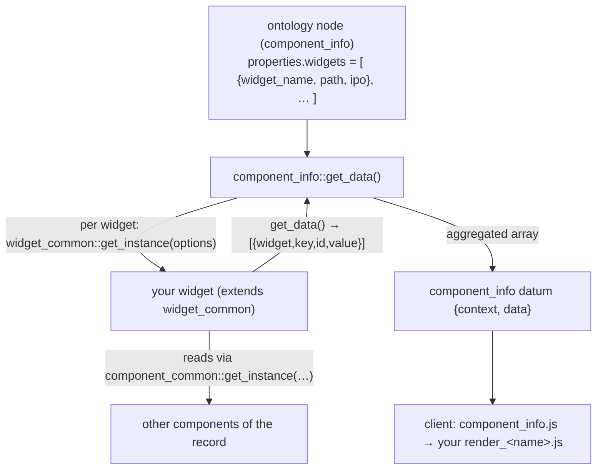

# Add a widget

> Goal: build a reusable, record-level **data-summarizing** widget under `core/widgets/`, hosted and rendered by a [`component_info`](../../core/components/component_info.md) field.

This is a step-by-step **how-to**. For the conceptual model and the full API surface, read the reference first and keep it open:

- [widgets](../../core/ui/widgets.md) — the `core/widgets/` subsystem reference (base class, IPO config, the data contract, async widgets).
- [component_info](../../core/components/component_info.md) — the host component; the only data-side caller of these widgets.
- [area_maintenance](../../core/areas/area_maintenance.md) — a **different**, unrelated widget family (see the warning below).

!!! warning "Two unrelated things are called 'widget'"
    Dédalo has **two** widget systems that share no code. This guide is about
    **`core/widgets/`** — record-level widgets that extend `widget_common`,
    are driven by an ontology **IPO** config, and are hosted by a `component_info`
    field. They are *not* the ~28 admin panels under
    `core/area_maintenance/widgets/` (`make_backup`, `media_control`,
    `dataframe_control`, …), which are plain classes dispatched by
    `dd_area_maintenance_api` and have no `widget_common` base. If you want to add a
    maintenance panel, that is a separate surface — see
    [area_maintenance](../../core/areas/area_maintenance.md). Everything below
    targets the `widget_common` family.

## When do you need this?

A `core/widgets/` widget exists to **compute** read-only data from other components of a record (or across records / the search session) and surface it inside an info panel — a digitization percentage, a media-icon strip, a roll-up of descriptors, a sum of measurements.

| You want… | Do this |
| --- | --- |
| A new summary that an **existing** widget already computes (e.g. another `calculation` formula) | **Ontology only.** Add a `properties.widgets[]` entry to a `component_info` node, pointing `widget_name`/`path` at the existing widget and writing a new `ipo`. No code. See [step 5](#5-host-it-from-a-component_info-node). |
| A summary that needs **new server logic** (a computation no widget does yet) | **Code.** Write a new `widget_common` subclass + its client JS, then host it (the rest of this guide). |
| The cataloguer to **type** a value | Not a widget — use [component_input_text](../../core/components/component_input_text.md) or another data-owning component. |
| A back-office maintenance operation (backup, migrate, rebuild) | Not this surface — see [area_maintenance](../../core/areas/area_maintenance.md). |

There is **no scaffolder** for widgets (unlike [tools](../tools/creating_tools.md)). You copy the reference widget directory, rename, and wire it into the ontology by hand.

## How it fits together



The host `component_info` reads its `properties.widgets` list, instances each widget through the factory `widget_common::get_instance()`, calls `get_data()`, and concatenates every widget's output into its own value. The client `component_info.js::get_widgets()` then dynamically imports each widget's JS by its `path` and feeds it the matching value slice. None of this is registration — the **directory name and the ontology `widget_name`/`path` are the contract**.

## Step-by-step

### 1. Copy the reference widget

The minimal, working reference is `core/widgets/test/test_info/`. Copy it under the domain (TLD) folder your widget belongs to, and rename every `test_info` occurrence — the directory, the file names, the PHP class name and the JS named export must all match the new widget name exactly.

``` shell
cp -r core/widgets/test/test_info core/widgets/<tld>/my_widget
# then rename inside core/widgets/<tld>/my_widget:
#   class.test_info.php           -> class.my_widget.php
#   js/test_info.js               -> js/my_widget.js
#   js/render_test_info.js        -> js/render_my_widget.js
#   css/test_info.less            -> css/my_widget.less
# and every `test_info` identifier inside those files -> `my_widget`
```

The resulting layout mirrors every other widget:

``` text
core/widgets/<tld>/my_widget/
├── class.my_widget.php        # server: extends widget_common, overrides get_data()
├── js/
│   ├── my_widget.js           # client class; named export `my_widget`
│   └── render_my_widget.js    # the DOM builder (edit / list views)
└── css/
    └── my_widget.less         # compiled to .css
```

!!! note "Naming is the contract"
    The class name **equals** the directory name (`class my_widget`), and the JS
    `export const my_widget = …` must match too. The PHP factory does
    `include_once DEDALO_WIDGETS_PATH . $path . '/class.' . $widget_name . '.php'`
    then `new $widget_name($options)`; the client does
    `import('../../../core/widgets' + path + '/js/' + widget_name + '.js')`. A
    mismatch fails silently (no data / no module).

### 2. Implement the server class (the `get_data()` contract)

`my_widget extends widget_common`. The base (`core/widgets/widget_common/class.widget_common.php`) has a **protected constructor** — never `new` a widget directly — and sets `section_tipo`, `section_id`, `mode`, `lang`, `ipo` from the options object. Every widget **must override `get_data()`**; the base implementation only logs a warning and returns `null`.

`get_data()` must return a flat array of uniform items. Iterate `$this->ipo`, and for each IPO entry emit one item per `output` map:

``` php
<?php declare(strict_types=1);
class my_widget extends widget_common {

	/**
	* GET_DATA
	* Read the configured input components, compute, and emit one item per output map.
	* @return array|null
	*/
	public function get_data() : ?array {

		$ipo = $this->ipo ?? [];
		if (empty($ipo)) {
			return null;
		}

		$data = [];
		foreach ($ipo as $key => $current_ipo) {

			// resolve a source component value, scoping 'current' to this record
			$value = null;
			foreach (($current_ipo->input->source ?? []) as $source) {

				$source_section_tipo = (!isset($source->section_tipo) || $source->section_tipo==='current')
					? $this->section_tipo
					: $source->section_tipo;
				$source_section_id = (!isset($source->section_id) || $source->section_id==='current')
					? $this->section_id
					: $source->section_id;

				$component_tipo = $source->component_tipo ?? null;
				if ($component_tipo) {
					// never touch storage directly — always go through the component
					$model = ontology_node::get_model_by_tipo($component_tipo, true);
					$component = component_common::get_instance(
						$model,
						$component_tipo,
						$source_section_id,
						'list',
						DEDALO_DATA_LANG,
						$source_section_tipo
					);
					$component_data = $component->get_data();
					$value = $component_data[0]->value ?? null;
				}
			}

			// one data item per output map
			foreach ($current_ipo->output as $data_map) {
				$current_data = new stdClass();
					$current_data->widget = get_class($this);   // 'my_widget'
					$current_data->key    = $key;
					$current_data->id     = $data_map->id;       // see the id pitfall below
					$current_data->value  = $value;              // your computed value
				$data[] = $current_data;
			}
		}

		return $data;
	}//end get_data
}//end my_widget
```

The key rules, verified against `test_info` and `widget_common`:

- **No persistence.** A widget never reads or writes the matrix. Read inputs only through `component_common::get_instance(...)->get_data()` (resolve the model with `ontology_node::get_model_by_tipo()`). The host `component_info` already has `use_db_data = false`.
- **Emit `id`.** `component_info`'s grid/export builders match on `item->id`. (Some older widgets also emit `widget_id`; `test_info` emits both. Always include `id`.)
- **Optional hooks** — add only if you need them; `component_info` probes for them with `method_exists()`:
    - `get_data_parsed()` — reshape data for grid/export columns (e.g. `mdcat/sum_dates`). Base default is a pass-through to `get_data()`.
    - `get_data_list()` — enumerate selectable values for a datalist/dropdown (e.g. `state`).
    - `is_async() : bool` — return `true` to defer data loading to the client (e.g. `dd/user_activity`); `component_info::get_data()` then **skips** the synchronous call and the client fetches it via the `dd_component_info` API. See [widgets → Async widgets](../../core/ui/widgets.md#async-widgets-the-dd_component_info-api).

!!! warning "Confined `process` logic (SEC-052)"
    Only the generic `calculation` widget runs an ontology-specified external
    `process` function, and it is hard-confined (realpath inside
    `DEDALO_WIDGETS_PATH`, bare-identifier function name, `ReflectionFunction`
    declaration check). If your widget computes inline (the normal case) you do not
    touch this path. Do **not** invent your own dynamic-include of ontology-supplied
    code — reuse `calculation` if you need configurable formulas.

### 3. Implement the client class

`js/my_widget.js` imports `widget_common`, borrows its lifecycle prototypes, and assigns its own render views. This is `test_info.js` renamed:

``` javascript
import {widget_common}   from '../../../widget_common/js/widget_common.js'
import {render_my_widget} from '../js/render_my_widget.js'

export const my_widget = function(){
	this.id
	this.section_tipo
	this.section_id
	this.lang
	this.mode
	this.value
	this.node
	this.events_tokens = []
	this.ar_instances  = []
	this.status
	return true
}//end my_widget

// lifecycle (from widget_common)
my_widget.prototype.init    = widget_common.prototype.init
my_widget.prototype.build   = widget_common.prototype.build
my_widget.prototype.render  = widget_common.prototype.render
my_widget.prototype.destroy = widget_common.prototype.destroy
// render (your own)
my_widget.prototype.edit    = render_my_widget.prototype.edit
my_widget.prototype.list    = render_my_widget.prototype.list
```

!!! note "Import depth"
    From `core/widgets/<tld>/my_widget/js/`, `widget_common` is three levels up
    (`../../../widget_common/js/widget_common.js`). If your widget is **not** nested
    in a TLD folder (e.g. `core/widgets/my_widget/`), adjust the relative path
    accordingly — `calculation` and `state` (no TLD folder) and `test_info` (under
    `test/`) differ here.

### 4. Implement the render views

`js/render_my_widget.js` builds the DOM. Use the shared `ui.widget` helper (`core/common/js/ui.js`) for the wrapper, and consume `self.value` — the server-built slice for this widget. Renamed from `render_test_info.js`, the skeleton is:

``` javascript
import {ui} from '../../../../common/js/ui.js'

export const render_my_widget = function(){ return true }

render_my_widget.prototype.edit = async function(options) {
	const self    = this
	const content = await get_content_data(self)          // build your <ul>/<table>/…
	if (options.render_level==='content') {
		return content
	}
	return ui.widget.build_wrapper_edit(self, { content_data: content })
}//end edit

render_my_widget.prototype.list = render_my_widget.prototype.edit  // or a separate builder
```

`self.value` is the array `component_info.js` already filtered to your widget
(`value.filter(item => item.widget === widget_name)`), so each entry is one of the
`{widget, key, id, value}` items your `get_data()` returned. The list/edit views
mirror `state`'s `render_edit_state.js` / `render_list_state.js` if you need
per-mode variants.

Add `css/my_widget.less` (compiled to `.css`) for styling — see
[design system / LESS](../../core/ui/themes.md).

### 5. Host it from a `component_info` node

A widget never appears on its own. Add it to the `properties.widgets` array of a `component_info` ontology node (its `parent` is the section/grouper, `model` is `component_info`). Each entry names your `widget_name`, the `path` under `core/widgets`, and the `ipo` config that drives `get_data()`:

``` json
{
  "widgets": [
    {
      "widget_name": "my_widget",
      "path"       : "/<tld>/my_widget",
      "widget_info": "Short developer note: what this widget summarizes",
      "ipo": [
        {
          "input": {
            "type"  : "component_data",
            "source": [
              { "section_id": "current", "section_tipo": "current", "component_tipo": "<comp_tipo>" }
            ]
          },
          "process": null,
          "output": [
            { "id": "summary", "label": "My summary", "value": "text" }
          ]
        }
      ]
    }
  ]
}
```

- `path` is used by **both** the server `include` and the client `import` — it must point at your widget folder (here `/<tld>/my_widget`), leading slash included.
- Each `output` map's `id` becomes one logical column in the info panel's grid/export. Your `get_data()` must emit items whose `id` matches.
- For the full IPO field reference and a two-widget example, see [component_info → Ontology instantiation](../../core/components/component_info.md#ontology-instantiation) and [widgets → IPO](../../core/ui/widgets.md#ipo--input--process--output).

After editing the ontology, reload the record carrying that `component_info` field. `component_info::get_data()` will instance and run your widget on every load (it is computed, not stored: `use_db_data = false`).

### 6. (Optional) Add a test

Widgets are exercised via `component_info` and the `test_info` sample. If your widget has non-trivial computation, add a `*_Test.php` under `test/server/` that builds the options object and asserts on `get_data()`:

``` php
$options = new stdClass();
	$options->widget_name  = 'my_widget';
	$options->path         = '/<tld>/my_widget';
	$options->ipo          = $ipo;            // an IPO array fixture
	$options->section_tipo = $section_tipo;
	$options->section_id   = $section_id;
	$options->lang         = DEDALO_DATA_LANG;
	$options->mode         = 'edit';

$widget = widget_common::get_instance($options);
$data   = $widget->get_data();               // assert shape: [{widget,key,id,value}]
```

## Worked example: a `word_count` widget

Summarize how many characters a record's main text component holds, shown in its info panel.

1. **Copy & rename:** `cp -r core/widgets/test/test_info core/widgets/oh/word_count`; rename the class, files and JS export to `word_count`.
2. **Server** (`core/widgets/oh/word_count/class.word_count.php`): the `get_data()` from [step 2](#2-implement-the-server-class-the-get_data-contract), where the computed `value` is `mb_strlen((string)$value)` of the source component's data, and the output `id` is `chars`.
3. **Client** (`js/word_count.js` + `js/render_word_count.js`): renders `self.value[0].value` as a labelled number inside `ui.widget.build_wrapper_edit`.
4. **Host** — add to a `component_info` node:

``` json
{
  "widget_name": "word_count",
  "path"       : "/oh/word_count",
  "ipo": [
    {
      "input"  : { "source": [ { "section_tipo": "current", "section_id": "current", "component_tipo": "oh26" } ] },
      "process": null,
      "output" : [ { "id": "chars", "label": "Characters", "value": "int" } ]
    }
  ]
}
```

5. Reload a record of that section: the info panel now shows `Characters: 1284`, recomputed every load.

## Common pitfalls

- **Wrong directory/class/export name.** The factory and the dynamic import both derive the file from `widget_name` + `path`. If the PHP class, the directory, or the JS `export const` disagree, the widget silently produces no data or no module. Rename **all four** together.
- **`new my_widget(...)` directly.** The base constructor is `protected`. Always build through `widget_common::get_instance($options)` (and on the client, `component_info` does `new module[widget_name]()` for you).
- **Emitting only `widget_id`.** `component_info`'s grid/export match on `item->id`. Always set `id`; emit `widget_id` too only if you are matching an older widget's convention.
- **Forgetting `get_data()` returns `null` by default.** If you do not override it, the base just logs a `WARNING` and returns `null` — your panel renders empty with no obvious error.
- **Reading the matrix directly.** Don't. Resolve inputs through `component_common::get_instance(...)->get_data()`; the host info component is intentionally `use_db_data = false`.
- **Confusing the two widget systems.** Adding a folder under `core/area_maintenance/widgets/` does **not** make a `component_info` widget, and vice-versa. They have different bases, dispatchers and contracts.
- **Wrong relative-import depth** in the client JS when your widget is (or isn't) inside a TLD subfolder — see the note in [step 3](#3-implement-the-client-class).
- **Expecting persistence.** Widget output is recomputed on every load; there is no value to "save". If you need stored, typed data, you want a real component, not a widget.

## Related

- [widgets](../../core/ui/widgets.md) — the `core/widgets/` subsystem reference (base class, IPO, async, security).
- [component_info](../../core/components/component_info.md) — the host component; ontology `properties.widgets`, render views, grid/export.
- [area_maintenance](../../core/areas/area_maintenance.md) — the *other*, unrelated widget family (admin/operational panels).
- [UI / widgets overview](../../core/ui/index.md) · [themes & LESS](../../core/ui/themes.md) — client styling.
- [Creating tools](../tools/creating_tools.md) — the *other* extension surface (has a scaffolder and `register.json`; widgets do not).
</content>
</invoke>
