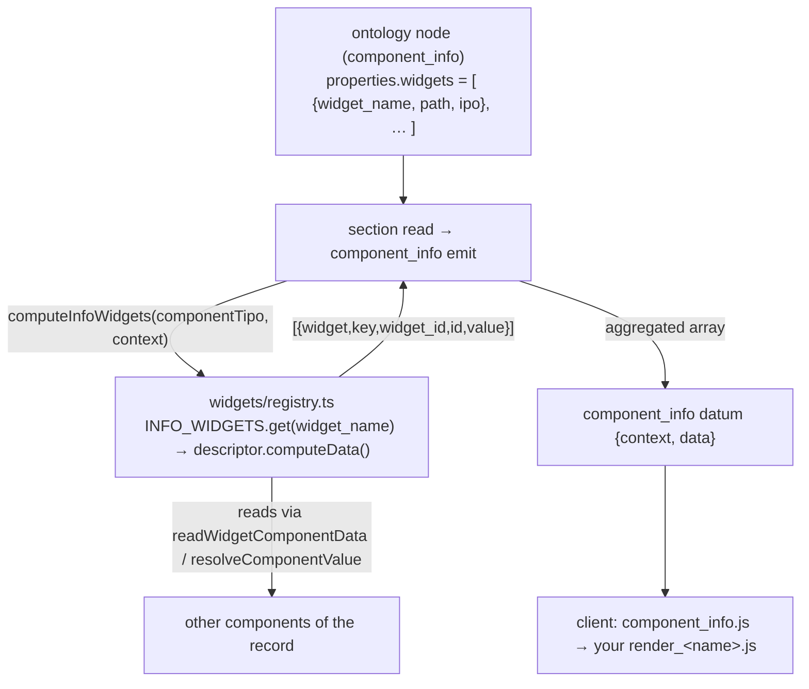

# Add a widget

> Goal: build a reusable, record-level **data-summarizing** widget — its client module under `client/dedalo/core/widgets/`, and its server-side compute in the horizontal info-widget engine — hosted and rendered by a [`component_info`](../../core/components/component_info.md) field.

This is a step-by-step **how-to**. For the conceptual model and the full surface, read the reference first and keep it open:

- [widgets](../../core/ui/widgets.md) — the `core/widgets/` subsystem reference (the IPO config, the data contract, async widgets).
- [component_info](../../core/components/component_info.md) — the host component; the only data-side caller of these widgets.
- [component_info cookbook](../../core/components/component_info_cookbook.md) — copy-paste recipes (declare, async, datalist, observers, test, debug) that complement this how-to.
- [area_maintenance](../../core/areas/area_maintenance.md) — a **different**, unrelated widget family (see the warning below).

!!! warning "Two unrelated things are called 'widget'"
    Dédalo has **two** widget systems that share no code. This guide is about
    **`core/widgets/`** — record-level widgets driven by an ontology **IPO**
    config and hosted by a `component_info` field. They are *not* the ~31 admin
    panels under `core/area_maintenance/widgets/` (`make_backup`,
    `media_control`, `dataframe_control`, …), which are dispatched by
    `dd_area_maintenance_api` and are a separate subsystem — see
    [area_maintenance](../../core/areas/area_maintenance.md) and the
    *dedalo-area-maintenance* skill. Everything below targets the info-widget
    family.

## When do you need this?

A `core/widgets/` widget exists to **compute** read-only data from other components of a record (or across records / the search session) and surface it inside an info panel — a digitization percentage, a media-icon strip, a roll-up of descriptors, a sum of measurements.

| You want… | Do this |
| --- | --- |
| A new summary that an **existing** widget already computes (e.g. another `calculation` formula) | **Ontology only.** Add a `properties.widgets[]` entry to a `component_info` node, pointing `widget_name`/`path` at the existing widget and writing a new `ipo`. No code. See [step 5](#5-host-it-from-a-component_info-node). |
| A summary that needs **new server logic** (a computation no widget does yet) | **Code.** Add a compute case in the info-widget engine + its client module, then host it (the rest of this guide). |
| The cataloguer to **type** a value | Not a widget — use [component_input_text](../../core/components/component_input_text.md) or another data-owning component. |
| A back-office maintenance operation (backup, migrate, rebuild) | Not this surface — see [area_maintenance](../../core/areas/area_maintenance.md). |

There is **no scaffolder** for widgets (unlike [tools](../tools/creating_tools.md)). You copy the reference client widget, rename, add a server compute case, and wire it into the ontology by hand.

!!! note "Server compute is one descriptor module per widget"
    Each widget is one module under
    `src/core/components/component_info/widgets/<tld>/<name>.ts` exporting one
    `InfoWidgetDescriptor` (`{name, path, isAsync?, computeData, …}`), assembled
    by `widgets/registry.ts`. Dispatch is by `widget_name` through the registry
    map — **never** by loading an ontology-authored path, which would let a node
    author choose which code the server executes. Adding a server-computed widget
    means adding a descriptor module + a registry entry. The authoritative
    checklist lives in `src/core/components/component_info/widgets/README.md`,
    mechanically enforced by `test/unit/info_widget_registry_tripwire.test.ts`.

## How it fits together



On a section read the `component_info` emit path calls `computeInfoWidgets(componentTipo, context)`. That aggregate reads the component node's `properties.widgets`, and for each non-async widget looks its `widget_name` up in the registry and runs the descriptor's `computeData(ipo, context)`, concatenating every widget's output. An **unknown `widget_name` throws `WidgetNotRegisteredError`**, and a registered-but-unimplemented stub throws `WidgetUnportedError` — a widget never silently renders empty. The client `component_info.js::get_widgets()` then dynamically imports each widget's JS by its `path` and feeds it the matching value slice. The **`widget_name` (registry key) and the ontology `widget_name`/`path` (client import)** are the contract — the tripwire binds each descriptor's `path` to the client module.

## Step-by-step

### 1. Copy the reference client widget

The minimal, working reference client module is `client/dedalo/core/widgets/test/test_info/`. Copy it under the domain (TLD) folder your widget belongs to, and rename every `test_info` occurrence — the directory, the file names and the JS named export must all match the new widget name exactly.

``` shell
cp -r client/dedalo/core/widgets/test/test_info client/dedalo/core/widgets/<tld>/my_widget
# then rename inside core/widgets/<tld>/my_widget:
#   js/test_info.js               -> js/my_widget.js
#   js/render_test_info.js        -> js/render_my_widget.js
#   css/test_info.less            -> css/my_widget.less
# and every `test_info` identifier inside those files -> `my_widget`
```

The resulting client layout mirrors every other widget:

``` text
client/dedalo/core/widgets/<tld>/my_widget/
├── js/
│   ├── my_widget.js           # client class; named export `my_widget`
│   └── render_my_widget.js    # the DOM builder (edit / list views)
└── css/
    └── my_widget.less         # bundled into page.css
```

!!! note "Naming is the contract"
    The JS `export const my_widget = …` must match the directory, **and** the
    `widget_name` you dispatch on server-side. The client does
    `import('../../../core/widgets' + path + '/js/' + widget_name + '.js')`; the
    server switches on `widget_name`. A mismatch fails silently (no module /
    no data).

### 2. Implement the server-side compute

Create `src/core/components/component_info/widgets/<tld>/my_widget.ts` exporting one `InfoWidgetDescriptor`, and add it to the `INFO_WIDGETS` array in `widgets/registry.ts`. Model it on `widgets/test/test_info.ts` (the reference). `computeData` receives the widget's `ipo` array and the `WidgetContext` (`{ sectionTipo, sectionId, mode, lang, userId? }`) and returns a flat array of uniform items:

``` ts
// src/core/components/component_info/widgets/<tld>/my_widget.ts
import {
	type InfoWidgetDescriptor,
	type TypedInput,
	type WidgetContext,
	type WidgetItem,
	readWidgetComponentData,
	resolveCurrent,
} from '../widget_common.ts';

async function computeMyWidget(ipo: unknown[], context: WidgetContext): Promise<WidgetItem[]> {
	const data: WidgetItem[] = [];
	for (const [key, entry] of ipo.entries()) {
		const block = entry as {
			input?: { source?: TypedInput[] };
			output?: { id?: string }[];
		};
		const output = Array.isArray(block.output) ? block.output : [];

		// resolve a source component value, scoping 'current' to this record
		let value: unknown = null;
		for (const source of block.input?.source ?? []) {
			const sourceSection = String(resolveCurrent(source.section_tipo, context.sectionTipo));
			const sourceId = resolveCurrent(source.section_id, context.sectionId);
			if (source.component_tipo == null) continue;
			// never touch storage directly — go through the component read helper
			const sourceData = (await readWidgetComponentData(
				sourceSection, sourceId, source.component_tipo,
			)) as { value?: unknown }[];
			if (sourceData.length > 0) value = sourceData[0]?.value ?? null;
		}

		// one data item per output map
		for (const dataMap of output) {
			const id = dataMap.id ?? '';
			data.push({ widget: 'my_widget', key, widget_id: id, id, value });
		}
	}
	return data;
}

export const my_widget: InfoWidgetDescriptor = {
	name: 'my_widget', // = ontology widget_name = client JS export
	path: '/<tld>/my_widget', // = ontology path; tripwire-bound to the client module
	computeData: computeMyWidget,
};

// …and in widgets/registry.ts: add `my_widget` to the INFO_WIDGETS array.
```

The key rules, verified against `test_info.ts` / `registry.ts`:

- **No persistence.** A widget never reads or writes the matrix directly. Read inputs through the engine's own helpers — `readWidgetComponentData(sectionTipo, sectionId, componentTipo)` or `resolveComponentValue()` (both resolve the model and pull the stored data). The host `component_info` is a `use_db_data = false` compute path.
- **`resolveCurrent(declared, fallback)`** maps the source's `'current'` / `undefined` `section_tipo` / `section_id` to this record's values.
- **Emit both `widget_id` and `id`.** `component_info`'s grid/export builders match on `id`; the live-compute fallback historically emits `widget_id` too. `computeTestInfo` emits both — always include both.
- **Async widgets are skipped at read.** Declare `isAsync: true` on the descriptor; the read aggregate skips it and the client fetches it via the `dd_component_info` `get_widget_data` action.
- **Unknown names throw.** A `widget_name` with no registry entry throws `WidgetNotRegisteredError` on read. Register your descriptor — or, if the compute is deliberately not implemented yet, register a stub carrying an explicit `unported.reason`, which throws `WidgetUnportedError` with that reason. There is no third option: a widget never fails quietly.

!!! warning "Confined `process` logic (SEC-052)"
    Only the generic `calculation` widget runs an ontology-specified `process`
    formula, and the TS registry (`widgets/calculation/functions.ts`
    `CALCULATION_FUNCTIONS`) hard-codes the allowed formulas (`summarize`,
    `to_euros`, `calculate_period`) — it does **not** dynamically load
    ontology-supplied code (`process.file` / `engine` are ignored). If your
    widget needs a configurable formula, add a STATIC entry there; do **not**
    re-introduce a dynamic include of ontology-supplied functions.

### 3. Implement the client class

`js/my_widget.js` imports `widget_common`, borrows its lifecycle prototypes, and assigns its own render views. This is `test_info.js` renamed:

``` javascript
import {widget_common}   from '../../../widget_common/js/widget_common.js'
import {render_my_widget} from '../js/render_my_widget.js'

export const my_widget = function(){
	this.id
	this.section_tipo
	this.section_id
	this.lang
	this.mode
	this.value
	this.node
	this.events_tokens = []
	this.ar_instances  = []
	this.status
	return true
}//end my_widget

// lifecycle (from widget_common)
my_widget.prototype.init    = widget_common.prototype.init
my_widget.prototype.build   = widget_common.prototype.build
my_widget.prototype.render  = widget_common.prototype.render
my_widget.prototype.destroy = widget_common.prototype.destroy
// render (your own)
my_widget.prototype.edit    = render_my_widget.prototype.edit
my_widget.prototype.list    = render_my_widget.prototype.list
```

!!! note "Import depth"
    From `core/widgets/<tld>/my_widget/js/`, `widget_common` is three levels up
    (`../../../widget_common/js/widget_common.js`). If your widget is **not**
    nested in a TLD folder (e.g. `core/widgets/my_widget/`), adjust the relative
    path accordingly — `calculation` and `state` (no TLD folder) and `test_info`
    (under `test/`) differ here.

### 4. Implement the render views

`js/render_my_widget.js` builds the DOM. Use the shared `ui.widget` helper (`core/common/js/ui.js`) for the wrapper, and consume `self.value` — the server-built slice for this widget. Renamed from `render_test_info.js`, the skeleton is:

``` javascript
import {ui} from '../../../../common/js/ui.js'

export const render_my_widget = function(){ return true }

render_my_widget.prototype.edit = async function(options) {
	const self    = this
	const content = await get_content_data(self)          // build your <ul>/<table>/…
	if (options.render_level==='content') {
		return content
	}
	return ui.widget.build_wrapper_edit(self, { content_data: content })
}//end edit

render_my_widget.prototype.list = render_my_widget.prototype.edit  // or a separate builder
```

`self.value` is the array `component_info.js` already filtered to your widget
(`value.filter(item => item.widget === widget_name)`), so each entry is one of the
`{widget, key, widget_id, id, value}` items your compute function returned. The
list/edit views mirror `state`'s `render_edit_state.js` / `render_list_state.js`
if you need per-mode variants.

Add `css/my_widget.less` (bundled into `page.css`) for styling — see
[design system / LESS](../../core/ui/themes.md).

### 5. Host it from a `component_info` node

A widget never appears on its own. Add it to the `properties.widgets` array of a `component_info` ontology node (its `parent` is the section/grouper, `model` is `component_info`). Each entry names your `widget_name`, the `path` under `core/widgets`, and the `ipo` config that drives the compute:

``` json
{
  "widgets": [
    {
      "widget_name": "my_widget",
      "path"       : "/<tld>/my_widget",
      "widget_info": "Short developer note: what this widget summarizes",
      "ipo": [
        {
          "input": {
            "type"  : "component_data",
            "source": [
              { "section_id": "current", "section_tipo": "current", "component_tipo": "<comp_tipo>" }
            ]
          },
          "process": null,
          "output": [
            { "id": "summary", "label": "My summary", "value": "text" }
          ]
        }
      ]
    }
  ]
}
```

- `path` is the **client import path** (`component_info.js` builds the ES import from it). The **server** never uses `path` to load code — it dispatches on `widget_name` through the registry; the tripwire only VERIFIES the descriptor's `path` matches a real client module. Keep `path` pointing at your client widget folder (leading slash included) and keep `widget_name` matching your descriptor's `name`.
- Each `output` map's `id` becomes one logical column in the info panel's grid/export. Your compute function must emit items whose `id` matches.
- For the full IPO field reference and a two-widget example, see [component_info → Ontology instantiation](../../core/components/component_info.md#ontology-instantiation) and [widgets → IPO](../../core/ui/widgets.md#ipo--input--process--output).

After editing the ontology, regenerate and reload the record carrying that `component_info` field. `computeInfoWidgets` runs your widget on every load (it is computed, not stored: `use_db_data = false`).

### 6. (Optional) Add a test

Server compute is the natural test surface. Add a `bun:test` that calls `computeInfoWidgets` for a `component_info` tipo whose node carries your widget, and asserts the emitted `{widget, key, widget_id, id, value}` shape. The existing info-widget gates live in `test/parity/info_widget_differential.test.ts` — extend that pattern. Run with `bun test`.

## Worked example: a `word_count` widget

Summarize how many characters a record's main text component holds, shown in its info panel.

1. **Client copy & rename:** `cp -r client/dedalo/core/widgets/test/test_info client/dedalo/core/widgets/oh/word_count`; rename the files and JS export to `word_count`.
2. **Server compute** (`src/core/components/component_info/widgets/oh/word_count.ts`): a descriptor whose `computeData` resolves the source component via `readWidgetComponentData`, computes `String(value).length`, and emits `{ widget:'word_count', key, widget_id:'chars', id:'chars', value }`; add it to `widgets/registry.ts`.
3. **Client** (`js/word_count.js` + `js/render_word_count.js`): renders `self.value[0].value` as a labelled number inside `ui.widget.build_wrapper_edit`.
4. **Host** — add to a `component_info` node:

``` json
{
  "widget_name": "word_count",
  "path"       : "/oh/word_count",
  "ipo": [
    {
      "input"  : { "source": [ { "section_tipo": "current", "section_id": "current", "component_tipo": "oh26" } ] },
      "process": null,
      "output" : [ { "id": "chars", "label": "Characters", "value": "int" } ]
    }
  ]
}
```

5. Regenerate and reload a record of that section: the info panel now shows `Characters: 1284`, recomputed every load.

## Common pitfalls

- **`widget_name` disagrees across the three places.** The descriptor `name` (registry key), the client `export const`/directory, and the ontology `widget_name` must all match; the `path` must point at the client folder. The registry tripwire catches path/name mismatches; an ontology name with no registry entry throws on read.
- **Forgetting the registry entry.** A descriptor module not listed in `widgets/registry.ts` `INFO_WIDGETS` is dead code — the ontology name throws `WidgetNotRegisteredError`.
- **Emitting only one of `id` / `widget_id`.** `component_info`'s grid/export match on `id`; the client widget renders match on `widget_id`. `test_info.ts` emits both — do the same.
- **Reading the matrix directly.** Don't. Resolve inputs through `readWidgetComponentData()` / `resolveComponentValue()`; the host info component is intentionally `use_db_data = false`.
- **Looking for a per-widget server class.** There is none — one descriptor module per widget under `src/core/components/component_info/widgets/<tld>/`.
- **Confusing the two widget systems.** A folder under `core/area_maintenance/widgets/` is **not** a `component_info` widget, and vice-versa. Different bases, dispatchers and contracts.
- **Wrong relative-import depth** in the client JS when your widget is (or isn't) inside a TLD subfolder — see the note in [step 3](#3-implement-the-client-class).
- **Expecting persistence.** Widget output is recomputed on every load; there is no value to "save". If you need stored, typed data, you want a real component, not a widget.

## Related

- [widgets](../../core/ui/widgets.md) — the `core/widgets/` subsystem reference (IPO, async, security).
- [component_info](../../core/components/component_info.md) — the host component; ontology `properties.widgets`, render views, grid/export.
- [component_info cookbook](../../core/components/component_info_cookbook.md) — recipes: declare a widget, add a calculation formula, make it async, add an edit datalist, wire observers, test without an instance, debug a blank panel.
- [area_maintenance](../../core/areas/area_maintenance.md) — the *other*, unrelated widget family (admin/operational panels).
- [UI / widgets overview](../../core/ui/index.md) · [themes & LESS](../../core/ui/themes.md) — client styling.
- [Creating tools](../tools/creating_tools.md) — the *other* extension surface (has a scaffolder and `register.json`; widgets do not).
- Source of truth: `src/core/components/component_info/widgets/` (README.md checklist, registry.ts dispatch, one descriptor module per widget) and the client's `core/widgets/` tree.
