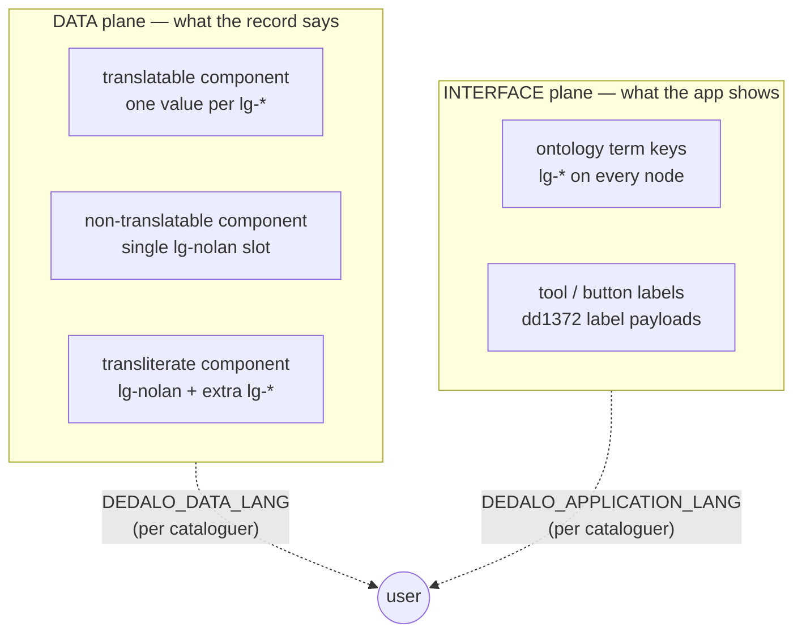

# Internationalization (i18n)

> See also: [Components introduction](../core/components/index.md#translatable-property) · [Glossary → translatable / lg-nolan / transliterate](../core/glossary.md#translatable--lg-nolan--transliterate) · [Glossary → TLD](../core/glossary.md#tld) · [Importing data → Multiple languages](../core/importing_data.md#multiple-languages)

Dédalo is multilingual to the core: the same record can hold a Spanish, English and Catalan version of every field, the application interface can be shown in any configured language, and content can be tagged with the language it is *in*. This page ties together how those mechanisms fit so a developer can reason about "what language is this string in, and where does it come from".

The single rule that makes the rest fall into place: **there are two independent translation planes**, and they almost never share a value.



- The **DATA plane** is the user's content — the title, the description, the inventory note. It is stored *per value* and resolved with [`DEDALO_DATA_LANG`](#the-language-config-constants).
- The **INTERFACE plane** is the chrome — field labels, menus, buttons, tool UI strings. It is stored as `lg-*` term keys on the ontology nodes and resolved with [`DEDALO_APPLICATION_LANG`](#the-language-config-constants).

A cataloguer can perfectly well edit the *Spanish* title of a record (`DEDALO_DATA_LANG = lg-spa`) while reading the field labels in *English* (`DEDALO_APPLICATION_LANG = lg-eng`). The two selectors in the [menu](../core/ui/menu.md) are independent unless [`DEDALO_DATA_LANG_SYNC`](#the-language-config-constants) forces them together.

## The `lg` TLD: how a language is a record

A Dédalo language is not a hard-coded enum — it is a thesaurus record. The languages live in the **languages section** `lg1` (`DEDALO_LANGS_SECTION_TIPO`), under the `lg` [top-level domain](../core/glossary.md#tld). Each language record carries:

- an **ISO 639-2/T alpha-3 code** in the `hierarchy41` component (e.g. `spa`, `eng`, `cat`), and
- a set of **multilingual name strings** in the `hierarchy25` term component (e.g. `{"lg-eng":"Spanish","lg-spa":"Castellano"}`).

Throughout the codebase a language is referred to by its **Dédalo lang code**: the prefix `lg-` plus that alpha-3 code — `lg-eng`, `lg-spa`, `lg-cat`, `lg-fra`, `lg-por`, … These codes are the keys used everywhere data is stored or resolved per language.

The server resolves between codes, records and names by reading the `matrix_langs` matrix table. The language-name and picker resolvers live in `src/core/resolve/lang_names.ts` and `src/core/relations/select_lang.ts`. Useful entry points:

| Symbol | Module | Returns |
| --- | --- | --- |
| `getLangNameFromCode(code, lang?)` | `resolve/lang_names.ts` | the human name of `lg-<code>` in the requested lang (fallback: install data lang, then any), read from `matrix_langs` |
| `getAlpha2FromCode('lg-eng')` | `resolve/lang_names.ts` | the fixed ISO 639-1 code the HTML5 `<track>` element expects |
| `selectLangDatalist(...)` | `relations/select_lang.ts` | the `component_select_lang` option list — one `lg1` record per project language, labeled + sorted |

All of these read the `matrix_langs` table, resolving names through the `hierarchy25` term tipo and codes through the `hierarchy41` code tipo.

!!! note "The `lg-nolan` sentinel"
    `lg-nolan` (`DEDALO_DATA_NOLAN`) is **not** a real `lg1` record — it is the reserved *no language* code for data that is not language-tagged (codes, technical literals, `root`, relations). The resolver returns `null` for it rather than attempting a lookup. See the [glossary](../core/glossary.md#lg-nolan).

## The language config constants

All language behaviour is configured by the `lang` domain of the typed config catalog (`src/config/config.ts`); set the values in `../private/.env`. The defining keys:

| Constant | Plane | Meaning |
| --- | --- | --- |
| `DEDALO_STRUCTURE_LANG` | interface | The ontology *authoring* language. Fixed at `lg-spa` — the master language of every ontology term. Do not change it. |
| `DEDALO_APPLICATION_LANGS` | interface | The map of `lg-* => name` the application UI can be displayed in (the interface-language picker's options). |
| `DEDALO_APPLICATION_LANGS_DEFAULT` | interface | Fallback application language when none is chosen (e.g. `lg-eng`). |
| `DEDALO_APPLICATION_LANG` | interface | The **current** interface language, resolved **per request** from the caller's session (see [request-scoped resolution](#request-scoped-language-resolution)); the install default (`APPLICATION_LANG`) applies when the user has not overridden it. Labels resolve to this. |
| `DEDALO_DATA_LANG_DEFAULT` | data | The installation's primary content language; the first fallback step when a value's own language is empty. |
| `DEDALO_DATA_LANG` | data | The **current** data language the cataloguer is editing/reading; also resolved **per request** from the session (install default `DATA_LANG`). Translatable components resolve in this language by default. |
| `DEDALO_DATA_LANG_SELECTOR` | data | Whether the data-language picker is shown in the [menu](../core/ui/menu.md). |
| `DEDALO_DATA_LANG_SYNC` | both | When `true`, forces `DEDALO_APPLICATION_LANG` and `DEDALO_DATA_LANG` to move together. |
| `DEDALO_DATA_NOLAN` | data | The `lg-nolan` sentinel (above). Do not change it. |
| `DEDALO_PROJECTS_DEFAULT_LANGS` | data | The list of `lg-*` codes the project actually catalogues in. This is the set of per-value slots offered for translatable components and the option list of [`component_select_lang`](../core/components/component_select_lang.md). |
| `DEDALO_DIFFUSION_LANGS` | data | Languages exported to diffusion targets; defaults to the project languages. |

!!! info "Two pickers, two constants"
    `DEDALO_APPLICATION_LANG` (interface) and `DEDALO_DATA_LANG` (data) are the two values driven by the two selectors in the top menu. Confusing them is the single most common i18n mistake: a missing field *label* is an `DEDALO_APPLICATION_LANGS` / ontology-term problem; a missing field *value* is a `DEDALO_PROJECTS_DEFAULT_LANGS` / per-value-slot problem.

### Request-scoped language resolution

The server is a single long-lived Bun process serving many concurrent users, so "the current language" can never be a module-level value — one caller's choice would bleed into every other request. `DEDALO_APPLICATION_LANG` and `DEDALO_DATA_LANG` therefore live in a **request-scoped `AsyncLocalStorage` scope** (`src/core/resolve/request_lang.ts`):

- The dispatch chokepoint (`dispatchRqo`, `src/core/api/dispatch.ts`) opens the scope once per RQO with `runWithRequestLangs({ applicationLang, dataLang }, …)`, seeded from the caller's session row.
- Leaf resolvers (label lookup, data reads, page globals) read the effective language through `currentApplicationLang()` / `currentDataLang()`.
- Outside any scope (unit tests calling resolvers directly, background jobs) the accessors fall back to the installation defaults from `config` — so behavior is identical whenever no user override is in effect.

The user's choice is persisted onto the session row by the `change_lang` action (`setSessionLangs()` in `src/core/security/session_store.ts`), which honors `DEDALO_DATA_LANG_SYNC` (couple the two when the install requests it). See [Runtime & request-scoped context](runtime_and_workers.md#request-scoped-ambient-state-asynclocalstorage) for the shared pattern.

## Plane 1 — DATA: language lives on the value

Every component is resolved **for a language** (see [Components → Instantiation](../core/components/index.md#instantiation)). What that language *means* depends on the component's `translatable` flag, declared in the ontology node and read when its data is resolved. There are three behaviours — they map one-to-one onto the [Components → Translatable property](../core/components/index.md#translatable-property) section.

### Translatable components

The default. The component stores **one value per project language**, keyed by `lang`, and an instance only ever exposes the slot it was instantiated with. A translatable [`component_input_text`](../core/components/component_input_text.md) holding a title in three languages stores ids paired across the language slots:

```json
[
    {"id": 1, "lang": "lg-eng", "value": "The cat Raspa"},
    {"id": 1, "lang": "lg-spa", "value": "El gato Raspa"},
    {"id": 1, "lang": "lg-cat", "value": "El gat Raspa"}
]
```

An instance in `lg-spa` sees only `El gato Raspa`. The available slots are exactly `DEDALO_PROJECTS_DEFAULT_LANGS`.

!!! note "Fallback when a slot is empty"
    If the requested language is empty, the component data reader (`src/core/resolve/component_data.ts`) walks a fallback hierarchy: **main lang** (`DEDALO_DATA_LANG_DEFAULT`) → **`lg-nolan`** → **every other project language in order**. The first non-empty wins and the resolved items surface as `data.fallback_value` (flagged so the UI can show they are borrowed from another language), never silently overwriting the empty slot.

### Non-translatable components

Some data has no language: a number, a date, a hashed password, a record's own id, an internal code. These components are declared `translatable: false` and are always instantiated with `lang = lg-nolan` (`DEDALO_DATA_NOLAN`). They store a single slot:

```json
[
    {"id": 1, "lang": "lg-nolan", "value": "Augustus"}
]
```

The component behaves identically to a translatable one — it just has exactly one language slot, `lg-nolan`. Examples: [`component_number`](../core/components/component_number.md), [`component_date`](../core/components/component_date.md), and every related component (a relation that points at a record is itself language-independent — which is why [`component_select_lang`](../core/components/component_select_lang.md), the language *picker*, is itself non-translatable).

### Transliterate components

The hybrid case, for things like personal names that have a canonical form plus script/spelling variants in other languages. Enabled with `with_lang_versions: true` on a string component: the **main value lives in `lg-nolan`**, but extra `lg-*` slots may be added (typically through [`tool_lang`](#plane-3-the-translation-workflow-tool_lang--tool_lang_multi)):

```json
[
    {"id": 1, "lang": "lg-nolan", "value": "Augustus"},
    {"id": 1, "lang": "lg-spa",   "value": "Augusto"}
]
```

The render layer shows the transliteration in parentheses (list) or as a `transliterate_value` line (edit), and the flag lets exports emit all language versions. See [`component_input_text` → `with_lang_versions`](../core/components/component_input_text.md#with_lang_versions).

!!! note "Server-side per-language data"
    On the server, per-language items are read and written **per language slot**: the translation flow reads the items in a *source* language and writes the translated items into a *target* language's slot, leaving the other slots untouched — the pattern [`tool_lang`](#plane-3-the-translation-workflow-tool_lang--tool_lang_multi) uses (read `source_lang`, write `target_lang`). This is the same per-key, per-lang isolation the save path guarantees for every translatable component.

### Tagging the language of content: `component_select_lang`

A per-value language slot answers "which translation of this field am I editing". A different question is "what language is this *content* in" — the original language of a work, the spoken language of an [audio track](../core/components/component_av.md), the language of an inscription. That is a **fact about the content**, not a UI choice, so it is modelled as data: [`component_select_lang`](../core/components/component_select_lang.md) stores a single [locator](../core/locator.md) into `lg1` and resolves it to a language code/name. It is itself non-translatable, its options come from `DEDALO_PROJECTS_DEFAULT_LANGS`, and it commonly pairs with a [`component_text_area`](../core/components/component_text_area.md) to declare that body's language. Do **not** use it for the per-language translation of a field's own text — that is the translatable-slot mechanism above.

## Plane 2 — INTERFACE / LABELS: ontology term keys

Field labels, section names, button captions, menu entries — the application chrome — are **not** component data. They are the `lg-*` term keys carried on the ontology nodes themselves. A component node declares its label in every language alongside its structural definition:

```json
{
    "tipo"         : "oh14",
    "model"        : "component_input_text",
    "parent"       : "oh1",
    "section_tipo" : "oh1",
    "lg-eng"       : "Title",
    "lg-spa"       : "Título",
    "translatable" : true
}
```

At build time the node label is resolved to the **current interface language** by `labelByTipo(tipo)` (`src/core/ontology/labels.ts`), which defaults its lang to `currentApplicationLang()` — the request-scoped `DEDALO_APPLICATION_LANG`. The resolved string is stamped into the component [context](../core/glossary.md#context) as `label`. If a node has no term in that language, resolution falls back to `DEDALO_STRUCTURE_LANG` (the master authoring language, `lg-spa`) and then to any available language, so a label never comes back empty.

!!! info "Why `DEDALO_STRUCTURE_LANG` is fixed at `lg-spa`"
    The ontology is *authored* in one language so that every term has a guaranteed canonical key. That language is `lg-spa` and must not be changed. It is the fallback floor for interface-label resolution and the language the ontology editor writes terms in — it is unrelated to what data or interface language any given installation uses day-to-day.

**Tool UI strings** are a special slice of the interface plane: each tool ships a `dd1372` label payload (a multi-language `component_json`) carrying its own button captions and progress strings across all project languages — see the tools [register.json reference](tools/register_json.md). The [`tool_dd_label`](tools/reference/index.md#language--i18n) helper exists to author these payloads.

## Plane 3 — the translation workflow: `tool_lang` / `tool_lang_multi`

Maintaining the parallel per-language values of the DATA plane is the job of two tools, both in the [Language / i18n](tools/reference/index.md#language--i18n) catalog group.

- **[`tool_lang`](tools/reference/tool_lang.md)** — side-by-side editing of **one text component of one record**. Left pane: the value in a *source* language (read-only). Right pane: the same component in a *target* language (editable). The cataloguer presses **Automatic translation** (through a configured engine) or **Copy to target** (verbatim). It is wired onto a component through that component's ontology `properties->tool_config->tool_lang`, and surfaces as an inline *Translation* button on the configured text component — only on translatable (or transliterate) components, never on non-translatable ones.
- **`tool_lang_multi`** — translate one source component into **several target languages at once**, in a single run. Its `automatic_translation` delegates to `tool_lang::automatic_translation()` (with its own defense-in-depth permission gate) and shares the in-browser engine. Listed in the [tools catalog](tools/reference/index.md#language--i18n).

Both expose two engine families: **server** engines (Babel, an Apertium-based service; "Google translator" is declared but not implemented) that run the single `automatic_translation` API action, and a **browser** engine ("Local AI translator", `browser_transformer`) that runs a translation model entirely in a Web Worker with no server round-trip. The server action reads the component's items in the **source** language, translates each value, and saves the result into the **target** language's slot, leaving every other slot untouched — exactly the DATA-plane mechanism described above. Full details, options table and security gate: [`tool_lang` reference](tools/reference/tool_lang.md).

## Worked example: a trilingual *Objects* catalogue

A museum catalogues *Objects* in Spanish, English and Catalan, and wants to publish trilingually.

**1 — Configure the project languages.** Set them in `../private/.env` as key/value entries (the server reads its config from there):

```shell
# project content languages (the per-value slots + component_select_lang options)
PROJECTS_DEFAULT_LANGS=["lg-spa","lg-eng","lg-cat"]
# install defaults for the two current-language values (overridable per session)
DATA_LANG=lg-spa            # primary content language (DEDALO_DATA_LANG default)
APPLICATION_LANG=lg-eng     # default UI language (DEDALO_APPLICATION_LANG default)
```

This single change makes the three per-value slots appear on every translatable component and the three choices appear in `component_select_lang` option lists. No table or schema change — languages are data and config.

!!! warning "The language keys are mandatory once configured"
    A configured install **refuses to boot** without `DEDALO_APPLICATION_LANGS` (the code→label map), `DEDALO_PROJECTS_DEFAULT_LANGS` (the code array), `DEDALO_APPLICATION_LANGS_DEFAULT` and `DEDALO_DATA_LANG_DEFAULT`. A missing or malformed value is an error, never a silent default — a server that guessed a language would quietly serve the wrong content. The installer writes all four; see [the install engine](ts_install_internals.md#languages-mandatory).

**2 — Catalogue the Spanish original.** A curator sets the data-language selector to **Spanish** (`DEDALO_DATA_LANG = lg-spa`) and the interface selector to **English** (`DEDALO_APPLICATION_LANG = lg-eng`). They see the field labels in English (resolved from each node's `lg-eng` term key) and type the *Description* ([`component_text_area`](../core/components/component_text_area.md)) in Spanish. The stored value:

```json
[ {"id": 1, "lang": "lg-spa", "value": "Vasija de cerámica ibérica..."} ]
```

The English and Catalan slots are still empty.

**3 — Translate with `tool_lang`.** On the *Description* component (configured with `properties->tool_config->tool_lang`) the curator presses the inline **Translation** button. They set **Source = Spanish**, **Target = English**, choose **Babel**, and run *Automatic translation*. The server reads `get_data_lang('lg-spa')`, translates, and writes the English slot:

```json
[
    {"id": 1, "lang": "lg-spa", "value": "Vasija de cerámica ibérica..."},
    {"id": 1, "lang": "lg-eng", "value": "Iberian ceramic vessel..."}
]
```

Switching the target to **Catalan** and repeating fills the third slot. (To do all targets in one pass, they would use `tool_lang_multi`.) Until a slot is filled, anyone reading that language sees the [fallback](#translatable-components) value (Spanish, then `lg-nolan`, then any other slot) flagged as borrowed.

**4 — Tag the language of a media track.** The object has an audio guide *in Italian*. A `component_select_lang` field on the media record stores a locator into `lg1` for Italian. Because Italian is not in the project's three languages, the picker still shows it (marked `Italian *`) — the out-of-project guard in `src/core/relations/select_lang.ts` keeps a stored value visible instead of silently dropping it. See [`component_select_lang` → Missing / out-of-project languages](../core/components/component_select_lang.md#data-model). The diffusion layer reads the resolved alpha-3 code (`lg-ita`) to set the published track's language.

**5 — Import/export round-trips preserve all slots.** A CSV re-import of the Description can carry all languages at once, either as a flat v7 array or a lang-keyed object — see [Importing data → Multiple languages](../core/importing_data.md#multiple-languages). Each present language replaces its slot; absent languages are preserved. Export emits one atom per value item in the current language (or the fallback items when empty); transliterables emit every language version — see [Exporting data](../core/exporting_data.md).

## How to add a new language

Adding a language is configuration plus (sometimes) one data step — never a schema change.

1. **Confirm the `lg1` record exists.** The languages section ships the full ISO 639-2 set, so the target language almost always already has a record (and therefore a stable `lg-xxx` code and `section_id`). If it does not, create the record in the languages section like any other thesaurus term: its alpha-3 code in `hierarchy41` and its names in `hierarchy25`.
2. **Add the code to the project languages** (`PROJECTS_DEFAULT_LANGS` in `../private/.env`, the `DEDALO_PROJECTS_DEFAULT_LANGS` concept). This is what makes the per-value slot appear on translatable components and adds the option to `component_select_lang`. (Diffusion picks it up automatically unless `DEDALO_DIFFUSION_LANGS` is overridden.)
3. **To offer it as an *interface* language too**, add the `lg-xxx => Name` entry to the application-langs map (`DEDALO_APPLICATION_LANGS`). The application UI will then resolve labels from each ontology node's `lg-xxx` term key (falling back to `DEDALO_STRUCTURE_LANG` for any node not yet translated).
4. **Translate the content** for the new slot. Existing records have an empty `lg-xxx` slot served by [fallback](#translatable-components) until filled; use [`tool_lang`](tools/reference/tool_lang.md) (or `tool_lang_multi` for bulk) to populate them, or re-import a CSV that carries the new language column.

!!! warning "Existing data does not move automatically"
    Adding a language only adds an *empty* slot to every translatable component; it does not back-translate stored content. Until each value's new slot is filled, readers in the new language get the [fallback](#translatable-components) value (flagged as borrowed), and out-of-project stored values in [`component_select_lang`](../core/components/component_select_lang.md) are surfaced with a trailing ` *`.

## See also

- [Components introduction → Translatable property](../core/components/index.md#translatable-property) — the per-component translatable / non-translatable / transliterate model.
- [`component_input_text`](../core/components/component_input_text.md) · [`component_text_area`](../core/components/component_text_area.md) — the translatable string components (`with_lang_versions` for transliterables).
- [`component_select_lang`](../core/components/component_select_lang.md) — tagging the language *of content* as data.
- [`tool_lang`](tools/reference/tool_lang.md) · [Tools catalog → Language / i18n](tools/reference/index.md#language--i18n) — the translation workflow tools (`tool_lang`, `tool_lang_multi`, `tool_dd_label`).
- [Menu](../core/ui/menu.md) — the two language selectors (interface and data) in the top bar.
- [Importing data → Multiple languages](../core/importing_data.md#multiple-languages) · [Exporting data](../core/exporting_data.md) — multi-language round-trips.
- [Glossary](../core/glossary.md#translatable--lg-nolan--transliterate) — `translatable` / `lg-nolan` / `transliterate` and the [`lg` TLD](../core/glossary.md#tld).
- Source: `src/config/config.ts` (the `lang` config domain), `src/core/resolve/request_lang.ts` (the request-scoped langs), `src/core/resolve/lang_names.ts` + `src/core/relations/select_lang.ts` (the `matrix_langs` resolvers), `src/core/resolve/component_data.ts` (the per-value language filter and the empty-slot fallback chain).
