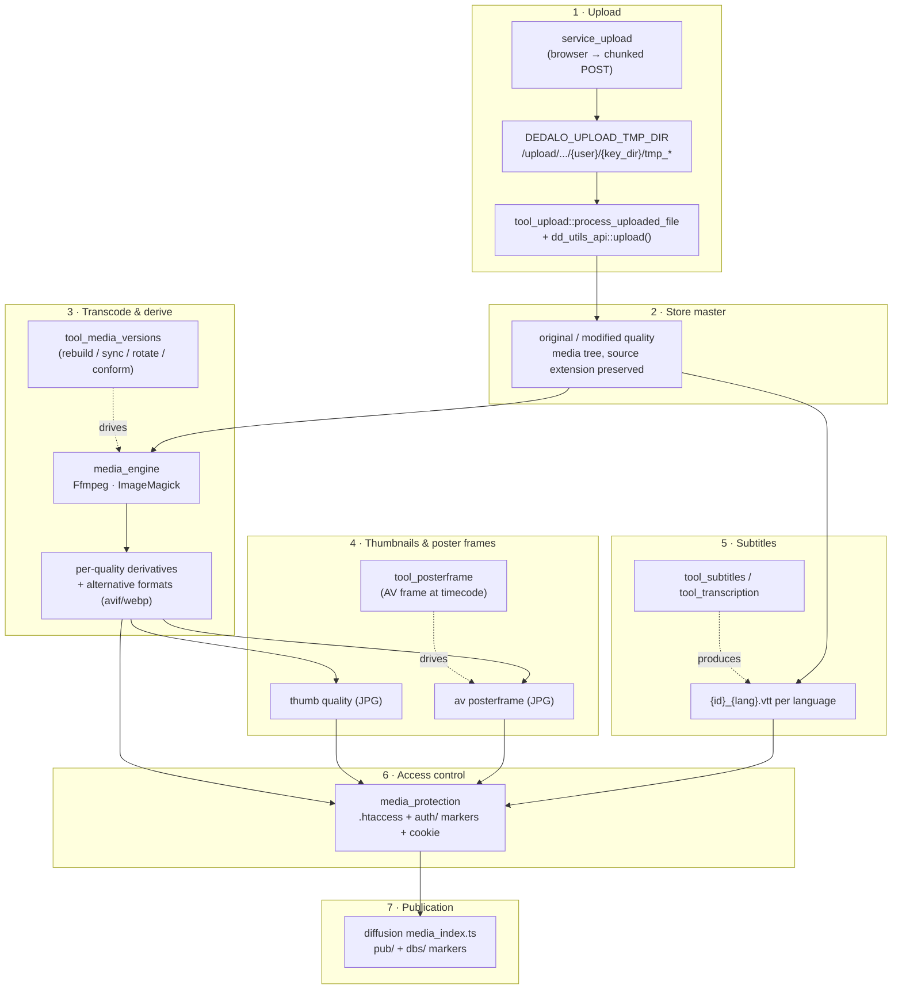

# Media pipeline

> The **end-to-end lifecycle** of a media file in Dédalo: from the browser upload,
> through master storage, transcoding/derivation, thumbnails and poster frames,
> subtitles, web-server access control, and finally publication to the diffusion
> system. This page is the **map** that ties the pieces together — each stage links
> to its own detailed reference rather than repeating it here.

> See also:
> [Using media components](./using_media_components.md) ·
> [Service Upload](./services/service_upload.md) ·
> [media_engine](../core/system/media_engine.md) ·
> [media_protection](../core/system/media_protection.md) ·
> [Architecture overview](../core/architecture_overview.md)

## Scope

A "media file" in Dédalo is never a blob in the database. It is a set of files on
disk (a preserved **master** plus generated **derivatives**) governed by a thin
JSON pointer stored in a media component's matrix column. Five media components
share this machinery —
[`component_image`](../core/components/component_image.md),
[`component_av`](../core/components/component_av.md),
[`component_pdf`](../core/components/component_pdf.md),
[`component_3d`](../core/components/component_3d.md) and
[`component_svg`](../core/components/component_svg.md) — all extending the abstract
`component_media_common` (see [base classes](../core/components/base_classes.md)).

The pipeline below is the same for every media type; only the engine called and
the qualities produced differ. The component is the **orchestrator** at every
stage: it decides *what file goes where*, the services/engine/tools do the work,
and [media protection](../core/system/media_protection.md) plus the diffusion
[media index](../diffusion/engine_internals.md) decide *who may read it*.

## The pipeline at a glance



**Prose walk-through.** A file is POSTed from the browser by
[`service_upload`](./services/service_upload.md) into a per-user temporary
directory; `tool_upload` (backed by `dd_utils_api::upload()`) then moves it into the
media tree and hands it to the component. The component preserves it untouched as
the **master** (`original`, and `modified` when an edited source exists). From the
master, [`media_engine`](../core/system/media_engine.md) (`Ffmpeg` for A/V,
`ImageMagick` for everything else) derives the web/streaming **qualities** and
**alternative formats**; [`tool_media_versions`](./tools/reference/tool_media_versions.md)
is the panel that re-drives this on demand. Thumbnails are produced for every
type; A/V additionally gets a **poster frame**
([`tool_posterframe`](./tools/reference/tool_posterframe.md)) and, for transcribed
recordings, per-language **subtitles**
([`tool_subtitles`](./tools/reference/tool_subtitles.md)). All of these files live
at predictable paths; [`media_protection`](../core/system/media_protection.md)
gates who may read them at the web-server level, and the diffusion
[media index](../diffusion/engine_internals.md) opens the published subset to
anonymous visitors.

## Stage 1 — Upload

The browser never writes to the media tree directly. Uploading is a two-step
hand-off:

1. **`service_upload`** ([Service Upload](./services/service_upload.md)) — the
   client-side, format-agnostic, optionally-chunked uploader. It is instantiated
   with a `caller` (normally a media component or a tool) and a list of
   `allowed_extensions`, and on completion fires the
   `upload_file_done_<caller.id>` event carrying the `file_data` descriptor. At
   that point the bytes sit in a temporary directory only:
   `DEDALO_UPLOAD_TMP_DIR/{user_id}/{key_dir}/{tmp_name}`.
2. **`tool_upload` + `dd_utils_api::upload()`** — the server side. The upload API
   action is permission-gated (`assert_section_permission`, write level 2),
   supports chunked transfers and confines the target path; `move_uploaded_file`
   then relocates the file. `tool_upload::process_uploaded_file` →
   `component_media_common::add_file` → the concrete component's
   `process_uploaded_file()` records the upload metadata and calls
   `regenerate_component()` to kick off stages 2–5.

See [Using media components](./using_media_components.md) for the full client
recipe (create section → build component → `open_tool` the upload UI → read back a
quality URL).

!!! note "The component is the single DB writer"
    Neither the service nor the engine touch the database. The component writes its
    thin JSON pointer through `section_record->save_component_data()` (the section
    is the only writer); the renderable bytes are always files on disk.

## Stage 2 — Store the master

`process_uploaded_file()` preserves the uploaded file untouched under the
**`original`** quality folder, keeping its source extension (e.g. `.mov`, `.tif`,
`.pdf`). When a retouched/edited source is supplied it is kept under the
**`modified`** quality. These master folders are the source of truth from which
every derivative is regenerated, and they are **never** served to anonymous users
(see Stage 6).

The on-disk path is deterministic and shared by all media types:

```text
DEDALO_MEDIA_PATH + folder + initial_media_path + '/' + quality + additional_path + '/' + id . '.' . extension
```

where `id = {component_tipo}_{section_tipo}_{section_id}` (`get_id()`) — this
filename grammar is **load-bearing** for Stage 6. `folder` is the per-type media
folder (`/image`, `/av`, `/pdf`, …); `additional_path` buckets files by
`max_items_folder` (e.g. `/0`, `/1000`) so no directory grows unbounded. Both
`get_media_path_dir()` and `get_media_url_dir()` run `sanitize_quality()`
(SEC-065) so a client-supplied quality can never escape the media root. The
`original_normalized_name` / `original_file_name` / `original_upload_date` fields
recorded on the pointer are exactly what cannot be reconstructed from disk; the
live per-quality `files_info` array is rebuilt on read by `get_files_info()`.

## Stage 3 — Transcode & derive qualities / alternative formats

From the master, the component derives every other **quality** (a target
resolution/profile) and any **alternative formats**, by calling
[`media_engine`](../core/system/media_engine.md). The engine is a pair of
stateless static wrappers — `Ffmpeg` (audio/video) and `ImageMagick` (image,
PDF/office raster, SVG, 3D preview) — that shell out to the installed binaries; it
owns no naming, no storage layout, no DB and no access control.

| Type | Engine | Qualities (from config constants) | Derivation |
| --- | --- | --- | --- |
| [image](../core/components/component_image.md) | `ImageMagick::convert` / `dd_thumb` | `original, modified, …, 1.5MB, thumb` (`DEDALO_IMAGE_AR_QUALITY`) | resize + CMYK→sRGB + flatten/alpha; `DEDALO_IMAGE_ALTERNATIVE_EXTENSIONS` (e.g. `avif`) per quality |
| [av](../core/components/component_av.md) | `Ffmpeg` (+ `ImageMagick::dd_thumb`) | `original, 1080, 720, 576, 404, 240, audio` (`DEDALO_AV_AR_QUALITY`) | `build_av_alternate_command` per setting file (`<quality>_<standard>_<aspect>`); `404` is the default streamed quality; `conform_header` for faststart |
| [pdf](../core/components/component_pdf.md) | `ImageMagick::convert` | `original, web` (`DEDALO_PDF_AR_QUALITY`) | `web` copy served by pdf.js; raster page alternatives; optional `pdftotext` / `ocrmypdf` |

`build_version(quality)` builds a single quality from the best available source
(modified > original > nearest higher quality). The A/V quality model is
settings-driven: a "quality" maps to a `lib/ffmpeg_settings/<name>.php` file that
is `require`d (treat it as code, not data — see the engine reference).

[`tool_media_versions`](./tools/reference/tool_media_versions.md) is the operator's
hands-on view of this stage. It compares the qualities recorded in the record
(`files_info_db`) against what is actually on disk (`files_info_disk`), flags
mismatches, and exposes per-quality **(re)build**, **delete**, **rotate** (image)
and **conform headers** (A/V) actions — each delegating to the component's own file
methods. Use it when derivatives are missing, broken, rotated, un-seekable or out
of sync; do not use it to ingest a new master (that is Stage 1).

## Stage 4 — Thumbnails & poster frames

Every media type emits a **thumbnail** bounded by `DEDALO_IMAGE_THUMB_WIDTH` /
`_HEIGHT` (a JPG `thumb` quality) via `ImageMagick::dd_thumb` — used in list,
mini and mosaic views.

Audiovisual adds a **poster frame**: a still JPG under `{folder}/posterframe…/`
that represents the recording in lists, grids and the player. The component
creates it at upload (`create_posterframe`, default capture at 10 s via
`Ffmpeg::create_posterframe`), then rasterizes it into the `thumb` quality.
[`tool_posterframe`](./tools/reference/tool_posterframe.md) lets a cataloguer scrub
the player to a representative frame and **Create**/**Delete** the poster frame,
and — via the `identifying_image` ontology property on a related section's portal
— capture the current frame and attach it as the *identifying image* of a related
record (creating that record's `component_image` and processing it through Stage 3).

!!! note "Two posterframe dispatch paths"
    The plain Create/Delete buttons delegate to `component_av`'s own methods through
    `dd_component_av_api` (the tool only hosts the player UI). Only **Create
    identifying image** is an actual `tool_posterframe` server action. See the
    [tool reference](./tools/reference/tool_posterframe.md).

## Stage 5 — Subtitles

For audiovisual recordings with a timecoded transcription, the pipeline produces
**VTT subtitle tracks** — one file per language, `{id}_{lang}.vtt`, under
`{folder}{DEDALO_SUBTITLES_FOLDER}/`. Unlike the media file (which is
non-translatable), subtitles are per-language: the AV edit datum carries a
`subtitles` block for the current `DEDALO_DATA_LANG`.

[`tool_subtitles`](./tools/reference/tool_subtitles.md) is the two-pane workbench
that builds them — the editable transcription (`component_text_area`) on the left,
the media player (`component_av`) on the right, and a `component_json` storing the
per-line subtitle model. It is **UI-only** (empty `API_ACTIONS`): all writes happen
through the hosted components and the shared `service_ckeditor` / `service_subtitles`
services. Generating the *raw* transcription (Whisper/Babel) belongs to
`tool_transcription`, not here.

## Stage 6 — Access control (web-server enforced)

One media tree serves two audiences at the same URLs.
[`media_protection`](../core/system/media_protection.md) (and its
[configuration](../config/media_protection.md)) is the pure/static PHP helper that
generates the web-server gate so authorization is a single `stat()` on a zero-byte
marker — no PHP in the file-serving path. The effective mode comes from
`DEDALO_MEDIA_ACCESS_MODE` (resolved by `get_mode()`):

| Mode | Logged-in users (rule A) | Anonymous (rule B) |
| --- | --- | --- |
| `false` | media world-readable | — |
| `'private'` | ✓ (cookie + `auth/` marker) | — |
| `'publication'` | ✓ | ✓ — **public qualities only**, when published |

- **Rule A** — logged-in users carry the fixed-name, daily-rotated
  `dedalo_media_auth` cookie (set by `login::init_cookie_auth()`), matched against
  a zero-byte marker in `.publication/auth/` (today + yesterday valid). This is
  PHP-owned and independent of the diffusion engine, so publication failures never
  lock out editors.
- **Rule B** — anonymous publication access is limited to the allowlisted
  **public qualities** (`get_public_qualities()`; `original`/`modified` masters are
  always refused) and only when a `.publication/pub/{section_tipo}_{section_id}`
  marker exists.

!!! warning "The filename grammar is the contract between Stages 2 and 6"
    Rule B derives the publication key by parsing the **last two underscore tokens**
    of the media filename (`…_{section_tipo}_{section_id}.<ext>`) — exactly the
    `get_id()` grammar from Stage 2. The same grammar/quality logic is implemented
    in three enforcement surfaces (the generated Apache `.htaccess`, the Nginx
    sample block, and the Bun `KEY_REGEX`); touch one, review all three. Files that
    do not parse the grammar stay login-only by design.

Enforcement is **fail-closed** and answers `404` (never `403`) so the existence of
unpublished media is never disclosed.

## Stage 7 — Publication (diffusion media index)

Marking the public subset is the diffusion system's job. When a record is published
to a target, the Bun engine (`diffusion/api/v1/lib/media_index.ts`, see
[engine internals](../diffusion/engine_internals.md)) writes the **rule-B markers**
*after* a successful SQL commit: per-target ground truth under
`.publication/dbs/{db}/{table}/{key}`, and the derived union under
`.publication/pub/{section_tipo}_{section_id}` (recomputed as a pure union, never
refcounted). The `section_tipo` needed to form the key is carried on the
publication wire contract. Drift heals via boot `reconcile()` and full `rebuild()`
(`rebuild_media_index`).

This is the only stage owned by Bun rather than PHP — consistent with the
**MariaDB-is-Bun's-responsibility** rule. PHP (`media_protection`) owns rule A;
Bun owns rule B; the two never call each other and stay coupled only through the
filename grammar.

## End-to-end example

```text
upload "memoria_oral.mov" on component_av oh18 (section oh1, id 5)
 1  service_upload    → POST → /upload/service_upload/tmp/1/component_av/tmp_memoria_oral.mov
 2  tool_upload       → move → /av/original/0/oh1_oh18_5.mov            (master, preserved)
 3  media_engine Ffmpeg
       build_version('404')  → /av/404/0/oh1_oh18_5.mp4                (default streamed)
       build_version('audio')→ /av/audio/0/oh1_oh18_5.mp4
 4  posterframe (10s) → /av/posterframe/0/oh1_oh18_5.jpg
       dd_thumb        → /av/thumb/0/oh1_oh18_5.jpg
 5  tool_subtitles    → /av/subtitles/oh1_oh18_5_lg-eng.vtt
 6  media_protection  → anon may read /av/404|posterframe|subtitles, never /av/original
 7  media_index (Bun) → .publication/pub/oh1_5  (record now public in ≥1 target)
```

## Related

- [Using media components](./using_media_components.md) — the client recipe for
  uploading and re-reading a media file from your own tool/component.
- [Service Upload](./services/service_upload.md) — Stage 1: the chunked upload
  service, its `upload_file_done` event and the temp-dir contract.
- [media_engine](../core/system/media_engine.md) — Stage 3: the `Ffmpeg` /
  `ImageMagick` wrappers, quality settings, thumbnails and poster frames.
- [media_protection](../core/system/media_protection.md) ·
  [configuration](../config/media_protection.md) — Stage 6: the `.htaccess` gate,
  the auth cookie + markers, the three enforcement surfaces.
- [tool_media_versions](./tools/reference/tool_media_versions.md) — Stage 3:
  inspect/rebuild/rotate/conform the derived qualities of an existing master.
- [tool_posterframe](./tools/reference/tool_posterframe.md) — Stage 4: extract an
  A/V frame and optionally attach it as a related record's identifying image.
- [tool_subtitles](./tools/reference/tool_subtitles.md) — Stage 5: the two-pane
  subtitle workbench producing per-language VTT.
- Media components: [component_image](../core/components/component_image.md) ·
  [component_av](../core/components/component_av.md) ·
  [component_pdf](../core/components/component_pdf.md) ·
  [component_3d](../core/components/component_3d.md) ·
  [component_svg](../core/components/component_svg.md) ·
  [base classes](../core/components/base_classes.md).
- [Diffusion engine internals](../diffusion/engine_internals.md) — Stage 7: where
  the Bun engine writes the `pub/` / `dbs/` publication markers.
- [Importing data](../core/importing_data.md) · [Exporting data](../core/exporting_data.md)
  — how media pointers behave on import/export (binaries ride the upload flow, not
  the row importer).
- [Tools catalog](./tools/reference/index.md) — every per-tool reference page,
  including `tool_upload`, `tool_transcription`, `tool_import_files` and
  `tool_image_rotation`.
