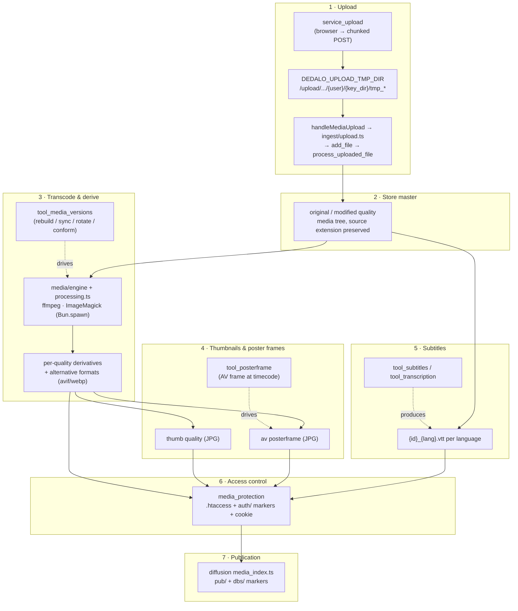

# Media pipeline

> The **end-to-end lifecycle** of a media file in Dédalo: from the browser upload,
> through master storage, transcoding/derivation, thumbnails and poster frames,
> subtitles, web-server access control, and finally publication to the diffusion
> system. This page is the **map** that ties the pieces together — each stage links
> to its own detailed reference rather than repeating it here.

> See also:
> [Using media components](./using_media_components.md) ·
> [Service Upload](./services/service_upload.md) ·
> [media_engine](../core/system/media_engine.md) ·
> [media_protection](../core/system/media_protection.md) ·
> [Architecture overview](../core/architecture_overview.md)

## Scope

A "media file" in Dédalo is never a blob in the database. It is a set of files on
disk (a preserved **master** plus generated **derivatives**) governed by a thin
`files_info` index stored in a media component's matrix column. Five media
component models share this machinery —
[`component_image`](../core/components/component_image.md),
[`component_av`](../core/components/component_av.md),
[`component_pdf`](../core/components/component_pdf.md),
[`component_3d`](../core/components/component_3d.md) and
[`component_svg`](../core/components/component_svg.md). The shared machinery lives
in the horizontal media engine under `src/core/media/` rather than in a class
hierarchy — the same code path serves every model, keyed by the type's config
catalog. The subsystem is defined in `engineering/MEDIA_SPEC.md`, and Stage 6 in
`engineering/MEDIA_PROTECTION.md`.

The pipeline below is the same for every media type; only the engine called and
the qualities produced differ. The media engine is the **orchestrator** at every
stage: it decides *what file goes where*, the upload/engine/tool modules do the
work, and [media protection](../core/system/media_protection.md) plus the diffusion
[media index](../diffusion/native_engine.md) decide *who may read it*.

!!! info "Formats, qualities and paths are configuration"
    Every quality ladder, extension, folder name, thumbnail dimension and binary
    path is **config**, not code — keyed under the `DEDALO_*` names in
    `src/config/config.ts` (`media` domain) and set in `../private/.env`. Modules
    never hardcode a quality/extension string; they read the typed accessor
    (`src/core/concepts/media.ts`). See `engineering/MEDIA_SPEC.md` §3.

## The pipeline at a glance



**Prose walk-through.** A file is POSTed from the browser by
[`service_upload`](./services/service_upload.md) into a per-user temporary
directory; the multipart route in `src/server.ts` (`handleMediaUpload` →
`src/core/media/ingest/upload.ts`) then moves it into the media tree and hands it
to the ingest pipeline. It is preserved untouched as the **master** (`original`,
and `modified` when an edited source exists). From the master, the media engine
(`src/core/media/engine/` + `processing.ts` — `ffmpeg` for A/V, `ImageMagick` for
everything else, both shelled via `Bun.spawn`) derives the web/streaming
**qualities** and **alternative formats**;
[`tool_media_versions`](./tools/reference/tool_media_versions.md) is the panel that
re-drives this on demand. Thumbnails are produced for every type; A/V additionally
gets a **poster frame**
([`tool_posterframe`](./tools/reference/tool_posterframe.md)) and, for transcribed
recordings, per-language **subtitles**
([`tool_subtitles`](./tools/reference/tool_subtitles.md)). All of these files live
at predictable paths; [`media_protection`](../core/system/media_protection.md)
gates who may read them at the web-server level, and the diffusion
[media index](../diffusion/native_engine.md) opens the published subset to
anonymous visitors.

## Stage 1 — Upload

The browser never writes to the media tree directly. Uploading is a two-step
hand-off:

1. **`service_upload`** ([Service Upload](./services/service_upload.md)) — the
   client-side, format-agnostic, optionally-chunked uploader. It is instantiated
   with a `caller` (normally a media component or a tool) and a list of
   `allowed_extensions`, and on completion fires the
   `upload_file_done_<caller.id>` event carrying the `file_data` descriptor. At
   that point the bytes sit in a temporary directory only:
   `DEDALO_UPLOAD_TMP_DIR/{user_id}/{key_dir}/{tmp_name}`.
2. **The multipart upload route (`handleMediaUpload`)** — the server side, in
   `src/server.ts` → `src/core/media/ingest/upload_endpoint.ts` →
   `ingest/upload.ts`. It is **fail-closed**: it requires a valid session and CSRF
   token before touching the body, supports chunked transfers with a magic-byte
   sniff (and a re-sniff after chunk join, SEC-066), and confines the target path
   (SEC-063). `ingest/add_file.ts` → `ingest/process_uploaded_file.ts` then records
   the upload metadata and drives the per-type `regenerate*` (`processing.ts`) to
   kick off stages 2–5 — A/V routing through the supervised job manager
   (`src/core/media/jobs.ts`).

See [Using media components](./using_media_components.md) for the full client
recipe (create section → build component → `open_tool` the upload UI → read back a
quality URL).

!!! note "The section save path is the single DB writer"
    Neither the upload route nor the engine touches the database directly. The
    thin `files_info` index is persisted through the ordinary section save path
    (`src/core/section/record/save_component.ts`, per-key `jsonb_set`); the
    renderable bytes are always files on disk. `files_info` is re-scanned from the
    filesystem, so the DB row is a cache of the disk, not its source of truth.

## Stage 2 — Store the master

`process_uploaded_file()` preserves the uploaded file untouched under the
**`original`** quality folder, keeping its source extension (e.g. `.mov`, `.tif`,
`.pdf`). When a retouched/edited source is supplied it is kept under the
**`modified`** quality. These master folders are the source of truth from which
every derivative is regenerated, and they are **never** served to anonymous users
(see Stage 6).

The on-disk path is deterministic and shared by all media types:

```text
DEDALO_MEDIA_PATH + folder + initial_media_path + '/' + quality + additional_path + '/' + id . '.' . extension
```

where `id = {component_tipo}_{section_tipo}_{section_id}` (`buildMediaIdentifier`,
`src/core/media/path.ts`) — this filename grammar is **load-bearing** for Stage 6.
`folder` is the per-type media folder (`/image`, `/av`, `/pdf`, …);
`additionalPath()` buckets files by `max_items_folder` (e.g. `/0`, `/1000`) so no
directory grows unbounded. `buildMediaLocation()` composes the full path, and
`assertInsideMediaRoot()` (SEC-065) is the single chokepoint every resolved path
passes through, so a client-supplied quality can never escape the media root. The
`original_normalized_name` / `original_file_name` / `original_upload_date` fields
recorded on the index are exactly what cannot be reconstructed from disk; the live
per-quality `files_info` array is rebuilt from the filesystem on read by the
scanner (`src/core/media/files_info.ts`).

## Stage 3 — Transcode & derive qualities / alternative formats

From the master, the media engine derives every other **quality** (a target
resolution/profile) and any **alternative formats** via
[`media_engine`](../core/system/media_engine.md). In the TS server the engine is a
set of stateless argv adapters under `src/core/media/engine/` — `ffmpeg.ts`
(audio/video), `imagemagick.ts` (image, SVG, 3D preview) and `pdf.ts` — that shell
out to the installed binaries through `spawn.ts` (**`Bun.spawn` with an explicit
argv and no shell**, so a filename can never be interpreted as a command). The
adapters own no naming, no storage layout, no DB and no access control; the
derivation choreography lives in `processing.ts`.

| Type | Engine module | Qualities (from config constants) | Derivation |
| --- | --- | --- | --- |
| [image](../core/components/component_image.md) | `imagemagick.ts` (`buildImageVersion` / `buildThumbVersion`) | `original, modified, …, 1.5MB, thumb` (`DEDALO_IMAGE_AR_QUALITY`) | pixel-budget resize (never upscale) + CMYK→sRGB + flatten/alpha; `DEDALO_IMAGE_ALTERNATIVE_EXTENSIONS` (e.g. `avif`) per quality |
| [av](../core/components/component_av.md) | `ffmpeg.ts` (+ `buildThumbVersion`) | `original, 1080, 720, 576, 404, 240, audio` (`DEDALO_AV_AR_QUALITY`) | one `ffmpeg_profiles.ts` argv recipe per quality; `404` is the default streamed quality; `qt-faststart` for streaming |
| [pdf](../core/components/component_pdf.md) | `pdf.ts` (`buildPdfCover`) | `original, web` (`DEDALO_PDF_AR_QUALITY`) | `web` copy served by pdf.js; raster page/cover alternatives; optional `pdftotext` / `ocrmypdf` |

The per-type `regenerate*` / `buildImageVersion` / `buildPdfCover` functions in
`processing.ts` build a single quality from the best available source
(`resolveOriginalSource`: modified > original > nearest higher quality), writing to
a temp file and atomically renaming so the `original` is never mutated. The A/V
quality model is profile-driven: a "quality" maps to one of the ~37 argv recipes
in `src/core/media/engine/ffmpeg_profiles.ts` — the recipes are **data**, not
executable code, so a profile can never smuggle a command into the spawn.

[`tool_media_versions`](./tools/reference/tool_media_versions.md) is the operator's
hands-on view of this stage. It compares the qualities recorded in the record
(`files_info_db`) against what is actually on disk (`files_info_disk`), flags
mismatches, and exposes per-quality **(re)build**, **delete**, **rotate** (image)
and **conform headers** (A/V) actions — each delegating to the component's own file
methods. Use it when derivatives are missing, broken, rotated, un-seekable or out
of sync; do not use it to ingest a new master (that is Stage 1).

## Stage 4 — Thumbnails & poster frames

Every media type emits a **thumbnail** bounded by `DEDALO_IMAGE_THUMB_WIDTH` /
`_HEIGHT` (a JPG `thumb` quality) via `buildThumbVersion` (`processing.ts`) — used
in list, mini and mosaic views.

Audiovisual adds a **poster frame**: a still JPG under `{folder}/posterframe…/`
that represents the recording in lists, grids and the player. The engine creates
it at upload (default capture at 10 s, `ffmpeg.ts`), then rasterizes it into the
`thumb` quality. [`tool_posterframe`](./tools/reference/tool_posterframe.md)
(`src/core/media/tools/posterframe.ts`) lets a cataloguer scrub
the player to a representative frame and **Create**/**Delete** the poster frame,
and — via the `identifying_image` ontology property on a related section's portal
— capture the current frame and attach it as the *identifying image* of a related
record (creating that record's `component_image` and processing it through Stage 3).

!!! note "Two posterframe dispatch paths"
    The plain Create/Delete buttons delegate to the AV media engine (the tool only
    hosts the player UI); **Create identifying image** is the actual
    `tool_posterframe` server action on the tool_request registry
    (`src/core/media/tools/posterframe.ts`). See the
    [tool reference](./tools/reference/tool_posterframe.md).

## Stage 5 — Subtitles

For audiovisual recordings with a timecoded transcription, the pipeline produces
**VTT subtitle tracks** — one file per language, `{id}_{lang}.vtt`, under
`{folder}{DEDALO_SUBTITLES_FOLDER}/`. Unlike the media file (which is
non-translatable), subtitles are per-language: the AV edit datum carries a
`subtitles` block for the current `DEDALO_DATA_LANG`.

[`tool_subtitles`](./tools/reference/tool_subtitles.md) is the two-pane workbench
that builds them — the editable transcription (`component_text_area`) on the left,
the media player (`component_av`) on the right, and a `component_json` storing the
per-line subtitle model. It is **UI-only** (empty `API_ACTIONS`): all writes happen
through the hosted components and the shared `service_ckeditor` / `service_subtitles`
services. The VTT files themselves are written server-side by the transcription
tool (`src/core/media/tools/transcription.ts`, the local half). Generating the
*raw* transcription belongs there too — but the **remote** Babel/Whisper API path
is out of scope for the TS rebuild (external network service + credentials; see
`engineering/MEDIA_SPEC.md`); only the local/`ffmpeg` seams ship here.

## Stage 6 — Access control (web-server enforced)

One media tree serves two audiences at the same URLs.
[`media_protection`](../core/system/media_protection.md) (and its
[configuration](../config/media_protection.md)) makes authorization a single
`stat()` on a zero-byte marker, **performed by the web server itself** — Apache or
Nginx, never a Bun process. That is the whole point of the design: no application
code sits in the file-serving path, so multi-GB media keeps native `sendfile`,
Range requests and the H.264 / nginx-mp4 `?start=` clipping handlers, and the gate
can never break streaming.

`src/core/media/protection.ts` **maintains the artifacts the web server reads**: it
generates the rule files (`buildHtaccess()` / `buildNginxConf()`, written by
`writeRuleFiles()`) and owns the `auth/` marker store. The effective mode comes from
`DEDALO_MEDIA_ACCESS_MODE` (resolved by `resolveMediaAccessMode()`):

| Mode | Logged-in users (rule A) | Anonymous (rule B) |
| --- | --- | --- |
| `false` | media world-readable | — |
| `'private'` | ✓ (cookie + `auth/` marker) | — |
| `'publication'` | ✓ | ✓ — **public qualities only**, when published |

- **Rule A** — logged-in users carry the fixed-name, daily-rotated
  `dedalo_media_auth` cookie, minted at login by `initMediaAuthCookie()`
  (`src/core/media/protection.ts`, called from `src/core/security/auth.ts` and set
  as a second `Set-Cookie` in `src/server.ts`). Its value must exist as a zero-byte
  marker in `.publication/auth/` (today + yesterday are valid, which is what makes
  the rotation seamless). Rule A is engine-owned and independent of publication
  state, so a diffusion failure can never lock editors out.
- **Rule B** — anonymous publication access is limited to the allowlisted
  **public qualities** (`getPublicQualities()`; `original`/`modified` masters are
  always refused) and only when a `.publication/pub/{section_tipo}_{section_id}`
  marker exists.

!!! note "Marker-store ownership is exclusive"
    Under `<media>/.publication/`, the `auth/` markers are written by
    `protection.ts` **and nothing else**, and the `pub/` + `dbs/` markers by
    `src/diffusion/targets/mediastore/media_index.ts` **and nothing else**. The two
    rules never call each other; they stay coupled only through the filename
    grammar below.

!!! warning "The filename grammar is the contract between Stages 2 and 6"
    Rule B derives the publication key by parsing the **last two underscore tokens**
    of the media filename (`…_{section_tipo}_{section_id}.<ext>`) — exactly the
    `buildMediaIdentifier` grammar from Stage 2. The same grammar/quality logic is implemented
    in three enforcement surfaces (the generated Apache `.htaccess`, the Nginx
    sample block, and the media-index `KEY_REGEX`); touch one, review all three.
    Files that do not parse the grammar stay login-only by design.

Enforcement is **fail-closed** and answers `404` (never `403`) so the existence of
unpublished media is never disclosed.

## Stage 7 — Publication (diffusion media index)

Marking the public subset is the diffusion system's job. When a record is published
to a target, the [diffusion engine](../diffusion/native_engine.md) writes the
**rule-B markers** *after* a successful SQL commit: per-target ground truth under
`.publication/dbs/{db}/{table}/{key}`, and the derived union under
`.publication/pub/{section_tipo}_{section_id}` (recomputed as a pure union, never
refcounted). Marker failures never fail a publication run, and markers only ever
*widen* access when present. Drift heals via boot `reconcile()` and full
`rebuild()` (the admin `rebuild_media_index` action).

Rule A (`media_protection`) and rule B (the diffusion markers) never call each
other and stay coupled only through the filename grammar.

## End-to-end example

```text
upload "memoria_oral.mov" on component_av oh18 (section oh1, id 5)
 1  service_upload       → POST → /upload/service_upload/tmp/1/component_av/tmp_memoria_oral.mov
 2  handleMediaUpload    → move → /av/original/0/oh1_oh18_5.mov         (master, preserved)
 3  ffmpeg.ts (Bun.spawn)
       regenerate '404'  → /av/404/0/oh1_oh18_5.mp4                    (default streamed)
       regenerate 'audio'→ /av/audio/0/oh1_oh18_5.mp4
 4  posterframe (10s)    → /av/posterframe/0/oh1_oh18_5.jpg
       buildThumbVersion → /av/thumb/0/oh1_oh18_5.jpg
 5  transcription.ts     → /av/subtitles/oh1_oh18_5_lg-eng.vtt
 6  media_protection     → anon may read /av/404|posterframe|subtitles, never /av/original
 7  media_index (Bun)    → .publication/pub/oh1_5  (record now public in ≥1 target)
```

## Related

- [Using media components](./using_media_components.md) — the client recipe for
  uploading and re-reading a media file from your own tool/component.
- [Service Upload](./services/service_upload.md) — Stage 1: the chunked upload
  service, its `upload_file_done` event and the temp-dir contract.
- [media_engine](../core/system/media_engine.md) — Stage 3: the `Ffmpeg` /
  `ImageMagick` wrappers, quality settings, thumbnails and poster frames.
- [media_protection](../core/system/media_protection.md) ·
  [configuration](../config/media_protection.md) — Stage 6: the `.htaccess` gate,
  the auth cookie + markers, the three enforcement surfaces.
- [tool_media_versions](./tools/reference/tool_media_versions.md) — Stage 3:
  inspect/rebuild/rotate/conform the derived qualities of an existing master.
- [tool_posterframe](./tools/reference/tool_posterframe.md) — Stage 4: extract an
  A/V frame and optionally attach it as a related record's identifying image.
- [tool_subtitles](./tools/reference/tool_subtitles.md) — Stage 5: the two-pane
  subtitle workbench producing per-language VTT.
- Media components: [component_image](../core/components/component_image.md) ·
  [component_av](../core/components/component_av.md) ·
  [component_pdf](../core/components/component_pdf.md) ·
  [component_3d](../core/components/component_3d.md) ·
  [component_svg](../core/components/component_svg.md) ·
  [base classes](../core/components/base_classes.md).
- [The diffusion engine](../diffusion/native_engine.md) — Stage 7: where
  the engine writes the `pub/` / `dbs/` publication markers.
- [Importing data](../core/importing_data.md) · [Exporting data](../core/exporting_data.md)
  — how media pointers behave on import/export (binaries ride the upload flow, not
  the row importer).
- [Tools catalog](./tools/reference/index.md) — every per-tool reference page,
  including `tool_upload`, `tool_transcription`, `tool_import_files` and
  `tool_image_rotation`.
