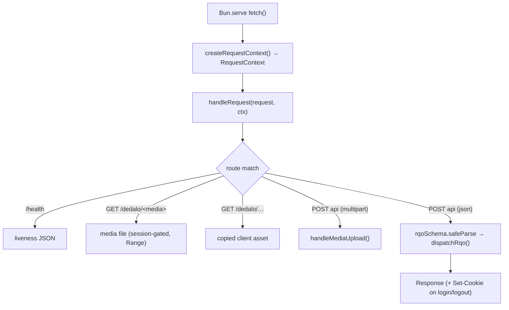
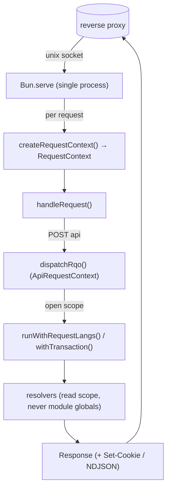

# Runtime & request-scoped context

> The Dédalo v7 TS work-system runtime: how the server runs as a **single long-lived Bun process**, the per-request `RequestContext` created in `src/server.ts`, the **request-scoped context** (`AsyncLocalStorage`) that replaces PHP's per-request state reset, session handling, response building and NDJSON streaming.

> See also: [`section`](../core/sections/section.md) · [Performance metrics](metrics.md) · [Internationalization](internationalization.md)

This page is the **developer reference** for the TS server's runtime
(`src/server.ts` and the request-scoped context primitives in
`src/core/resolve/request_lang.ts` / `src/core/db/postgres.ts`). It documents how
Dédalo's request handling runs inside a *persistent* process without the
cross-request state-bleed hazard that a shared-process PHP deployment has to
defend against.

!!! note "This is a rewrite of a PHP subsystem"
    The PHP work system historically ran either as a share-nothing CGI script
    (PHP-FPM: fresh process per request) or, later, inside a persistent
    **RoadRunner** worker that had to *manually* re-create share-nothing
    semantics on a shared process (a `worker/` subsystem: `cache_manager`,
    `common::clear()`, ~10 static-cache clearers, `header_remove()`). The TS
    server keeps the **persistent-process** performance win but makes the whole
    manual-reset machinery **structurally unnecessary** — see below. There is no
    `worker/` directory, no `cache_manager`, no `common::clear()`.

## Role

Historically, cross-request state bleed in a persistent PHP worker was the
dominant correctness hazard: a class-static cache populated for user A — already
permission-filtered, already project-scoped — would be served to user B on the
next loop iteration unless it was explicitly cleared. Every static, every
superglobal, every emitted header was a potential leak, and an entire `worker/`
subsystem existed to undo them before each request.

The TS server removes the hazard by construction rather than by discipline.
`src/server.ts` documents the invariant at the top of the file:

> **PERSISTENT-RUNTIME DISCIPLINE (spec §4):** every request gets its own
> `RequestContext` created HERE and threaded explicitly through all resolution
> code. Nothing request-dependent may live at module level. The context object
> is the one place request identity exists.

Because request identity lives in an explicit object (and, for a few ambient
values, an `AsyncLocalStorage` scope opened once per request), there is no
module-level "current user" / "current language" / "current section" that a
second concurrent request could observe. The class of bug that `SEC-023` and the
`WORKER-*` notes tracked in PHP is **gone**, not merely guarded.

!!! note "Bun is also the diffusion runtime"
    The work-system server documented here is a Bun process. The **diffusion
    subsystem** (which owns MariaDB and serves the public diffusion API) is a
    *separate* Bun process under `diffusion/api/v1/` with its own lifecycle. They
    do not share memory; do not conflate them.

## Responsibilities

`src/server.ts` is a thin host. Per boot and per request it:

- **Boots once** — build the frozen typed config (`src/config/config.ts`, which
  reads `../private/.env`), register the RAG save/delete hook
  (`initRagHooks()`, a no-op when RAG is off), remove any stale unix-socket file,
  and start `Bun.serve` (`startServer()`).
- **Creates a `RequestContext` per request** — `createRequestContext()` mints a
  `requestId` (`crypto.randomUUID()`) and a `startedAt` timestamp. This object is
  passed explicitly into `handleRequest()`; it never lives at module level.
- **Routes the request** — `handleRequest()` matches the URL against the health
  probe, the media route, the copied-client static assets, the tool asset roots,
  the raw/environment diagnostic views, and the API endpoint.
- **Resolves the session** — reads the TS-native session cookie
  (`SESSION_COOKIE`) from the `Cookie` header and looks it up via `getSession()`
  (`src/core/security/session_store.ts`).
- **Dispatches the API** — parses the JSON body, zod-validates it against
  `rqoSchema`, builds an `ApiRequestContext`, and calls `dispatchRqo()`
  (`src/core/api/dispatch.ts`), where the auth / CSRF / allowlist gates live.
- **Builds the response** — serializes the outcome, sets the `Set-Cookie` header
  on login/logout, and switches the content type for NDJSON stream responses
  (`tool_export`).

## The entry point

`src/server.ts` is intentionally small — all business logic lives downstream in
`core/api/dispatch.ts` and the resolvers. Its shape:

```ts
export function startServer() {
    initRagHooks();                       // once: register the RAG index-queue hook
    const socketPath = config.server.unixSocketPath;
    if (existsSync(socketPath)) unlinkSync(socketPath); // drop a stale socket
    const server = Bun.serve({
        unix: socketPath,
        fetch(request) {
            return handleRequest(request, createRequestContext()); // one ctx per request
        },
    });
    // Optional TCP dev listener (SERVER_TCP_PORT) so a browser can reach the
    // copied client + API directly during local development.
    return server;
}
```

The production listener is a **unix socket only**: the reverse proxy
(Apache/Nginx) owns TCP, serves static files/media, and forwards API traffic to
the socket — the same pattern the production diffusion engine uses. An optional
TCP dev listener is enabled by `SERVER_TCP_PORT` for local development, where a
browser cannot address a unix socket directly.

## The routing pipeline (`handleRequest()`)

`handleRequest(request, context)` is a plain exported function (not inlined in
`Bun.serve`) so tests can call it directly without a socket. The ordered checks,
first match wins:

1. **`GET /health`** — liveness probe for the reverse proxy / process manager;
   returns `{ result: 'ok', entity, request_id }`.
2. **`GET /dedalo/<mediaDir>/…`** — the dev media route (see below); **requires a
   valid session** and supports HTTP Range (206) for `<video>`/`<audio>`.
3. **`GET /dedalo/core/tools_common/…`** and **`GET /dedalo/tools/…`** — tool
   client machinery and per-tool package assets, served from the repo `tools/`
   roots (not the copied client tree).
4. **`GET /api/v1/raw` / `…/environment`** — the raw-record and environment
   diagnostic views (admin/developer tools); matched before the generic static
   handler because their client-relative twins live under `/dedalo/`.
5. **`GET /dedalo/…`** — the copied-client static assets (Phase 7 seam), served
   from `client/dedalo/` at the same paths the PHP deployment uses, with a
   path-traversal guard (`serveClientAsset()`).
6. **`POST` to an API path, multipart** — the media-upload branch
   (`handleMediaUpload()`); runs before JSON parsing because the body is
   form-data.
7. **`POST` to an API path, JSON** — the main API endpoint: parse → zod-validate
   (`rqoSchema`) → resolve session → `dispatchRqo()`.
8. **Anything else** — a plain `404`.



## Key concepts

### The `RequestContext`

`RequestContext` (defined in `src/server.ts`) is the one place request identity
exists at the HTTP layer:

```ts
export interface RequestContext {
    readonly requestId: string;   // crypto.randomUUID(), for tracing/log correlation
    readonly startedAt: number;   // performance.now(), for latency
}
```

Downstream, the API layer builds an `ApiRequestContext`
(`src/core/api/dispatch.ts`) that adds the resolved `session`, the raw
`sessionToken`, the `clientIp` (from the proxy's `X-Forwarded-For`), and the CSRF
candidate header. Both objects are **passed explicitly**; neither is ever stored
in a module-level variable.

### Request-scoped ambient state (`AsyncLocalStorage`)

A handful of values are genuinely ambient — the "current data/interface language"
and the "current DB transaction handle" — so threading them through every
function signature would be noise. For exactly these, the TS server uses
Node's `AsyncLocalStorage`, opened **once per request** at the dispatch
chokepoint and read by leaf resolvers:

| Scope | Module | What it carries | Opened by |
| --- | --- | --- | --- |
| Request langs | `src/core/resolve/request_lang.ts` | effective interface + data language (PHP `DEDALO_APPLICATION_LANG` / `DEDALO_DATA_LANG`) | `dispatchRqo()` via `runWithRequestLangs()` |
| Transaction | `src/core/db/postgres.ts` | the active DB transaction handle | `withTransaction()` |

This is the structural replacement for PHP's per-request constants and static
caches. In PHP, `DEDALO_APPLICATION_LANG` was effectively a per-request constant
seeded from the session at bootstrap — safe under share-nothing, a bleed vector
under a shared worker. Here the effective languages live in an
`AsyncLocalStorage` scope for the duration of one RQO's async tree; outside any
scope (unit tests calling resolvers directly, background jobs) the accessors fall
back to the installation defaults from `config`. See
[Internationalization](internationalization.md#request-scoped-language-resolution).

```ts
// src/core/api/dispatch.ts — the language scope is opened around the whole RQO
const { runWithRequestLangs } = await import('../resolve/request_lang.ts');
const result = await runWithRequestLangs(
    { applicationLang, dataLang },   // seeded from the caller's session row
    () => /* … resolve the action … */,
);
```

### Why the state-bleed hazard is structurally gone

The single most important property of this runtime: **there is no module-level
mutable request state to leak.**

- Request identity is an explicit `RequestContext` / `ApiRequestContext` argument.
- The two ambient values (langs, transaction) live in `AsyncLocalStorage`
  scopes that are torn down when the request's async tree completes — a
  concurrent request runs in its own scope and cannot observe another's.
- Config is built once at boot and **frozen** (`Object.freeze`), so it is
  read-only shared data by construction, not a mutable cache.

Contrast with PHP, where `common::clear()` + the `cache_manager` registry had to
run at the top of *every* request to purge `cache_structure_context`, the
datalist caches, the request-config caches, the main-lang map, the section/record
instance caches, and so on. None of that machinery exists here because none of
those caches are process-global mutable state keyed by request.

!!! warning "The contract for new ambient state"
    If you ever need a new piece of request-scoped ambient state, add a **new
    `AsyncLocalStorage` scope** (the boring, consistent pattern already used for
    langs and the transaction handle) and open it at the dispatch chokepoint —
    never a module-level `let`. A module-level mutable value shared across
    requests re-opens exactly the cross-request/cross-user bleed surface this
    architecture was built to eliminate.

### Intentionally cross-request caches

Some data is near-static and genuinely shared: the ontology, the tools registry.
Caching those across requests is a *win*, not a bleed. Where such a cache exists
it is either immutable (frozen config) or an explicit, time-bounded reader cache
(e.g. the tools registry reader cache, TTL `registryCacheTtlMs`, because the
co-resident PHP install can write the registry without notifying the TS process —
see `src/config/config.ts`). These are deliberate, documented decisions, never
accidental per-user state.

### Session handling

Sessions are TS-native and **not** PHP-session-compatible (spec: Argon2id via
`Bun.password`, rotating server-side sessions). `src/server.ts` reads the
`SESSION_COOKIE` from the request `Cookie` header and resolves it with
`getSession()` (`src/core/security/session_store.ts`). The session row carries the
user id, the CSRF token, and the per-session language overrides
(`applicationLang` / `dataLang`, null until the user picks from the menu).

Cookie lifecycle is handled at the response boundary:

- **Login** — `dispatchRqo()` returns `setSessionToken`; the server emits
  `Set-Cookie: <SESSION_COOKIE>=<token>; HttpOnly; SameSite=Lax; Path=/`.
  `Secure` is the reverse proxy's concern (TLS terminates there).
- **Logout** — `dispatchRqo()` returns `clearSessionCookie`; the server emits the
  same cookie with `Max-Age=0` so the browser drops it.
- **`change_lang`** — persists the language choice onto the session row via
  `setSessionLangs()` (`src/core/security/session_store.ts`), the analogue of PHP
  `change_lang → $_SESSION`.

### Media route (dev listener)

`GET /dedalo/<mediaDir>/…` serves record media so images/video render during
development. It is **session-gated** (fail-closed `404`, no existence leak) and
implements HTTP Range (RFC 7233): a `bytes=` request is answered with `206
Partial Content` so Safari/iOS `<video>`/`<audio>` seeking works. In production
the **reverse proxy** serves media and enforces the marker-based access control
(`media_protection`); this route exists only for the dev listener. See
`src/server.ts` (`MEDIA_ROOT` note) and [Media pipeline](media_pipeline.md).

### Response building & NDJSON streaming

For a normal request the server serializes `outcome.body` with `JSON.stringify`
and returns a `Response` with the dispatch-computed `status`. Two special cases:

- **Cookie headers** — set on login/logout as above.
- **NDJSON stream** — when the outcome body carries a string `ndjson` field
  (`tool_export`'s `ndjson_stream`), the content type switches to
  `application/x-ndjson; charset=utf-8` and the raw protocol lines are streamed —
  the TS analogue of PHP's `stream_export_grid`.

## How it fits with the rest of Dédalo

- `src/server.ts` is a **host**: it hydrates the request environment, resolves the
  session, and delegates to [`dispatchRqo()`](../core/system/api.md), which owns
  the six conceptual security gates (auth, CSRF, action allowlist, ACL, …).
- The request-scoped context is the runtime counterpart of what PHP achieved with
  the per-request `clear()` contract — but here it is enforced by the type system
  and the scope lifetime, not by a reset registry.
- [Performance metrics](metrics.md) covers what latency signal the runtime carries
  (`RequestContext.startedAt`) and the honest gap versus PHP's `metrics`
  subsystem.



## Examples

### Handling a request without a socket (tests)

Because `handleRequest` is exported and takes an explicit context, a test can
exercise the full routing/dispatch path in-process:

```ts
import { handleRequest } from '../../src/server.ts';

const request = new Request('http://x/api/v1/json', {
    method: 'POST',
    headers: { 'Content-Type': 'application/json' },
    body: JSON.stringify({ action: 'start', dd_api: 'dd_core_api', options: {} }),
});
const response = await handleRequest(request, { requestId: 't', startedAt: 0 });
```

### Adding request-scoped ambient state

When you have a genuinely ambient value (not just request identity), add a new
`AsyncLocalStorage` scope and open it at the chokepoint — the same shape as
`request_lang.ts`:

```ts
import { AsyncLocalStorage } from 'node:async_hooks';

const myStore = new AsyncLocalStorage<MyScope>();
export function runWithMyScope<T>(scope: MyScope, fn: () => T): T {
    return myStore.run(scope, fn);
}
export function currentMyScope(): MyScope {
    return myStore.getStore() ?? /* installation default */ defaultScope;
}
```

Do **not** reach for a module-level `let` — that is the one pattern this runtime
forbids.

## Related

- [`section`](../core/sections/section.md) — the section family; its resolution is
  request-scoped, never process-global.
- [API / `dd_manager`](../core/system/api.md) — the request dispatcher the server
  hosts; the conceptual security gates live in `core/api/dispatch.ts`.
- [Internationalization](internationalization.md) — the request-scoped language
  scope (`request_lang.ts`) in full.
- [Performance metrics](metrics.md) — latency signal and the honest gap vs PHP's
  `metrics` subsystem.
