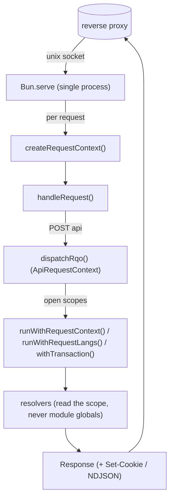

# Runtime & request-scoped context

> See also: [`section`](../core/sections/section.md) · [Performance metrics](metrics.md) · [Internationalization](internationalization.md)

The Dédalo work-system server runs as a **single long-lived Bun process**. This page is the developer reference for how one process serves many concurrent callers without ever letting one caller's identity, language or transaction leak into another's request — the per-request context created in `src/server.ts`, the three `AsyncLocalStorage` scopes opened at the dispatch chokepoint, session handling, response building and NDJSON streaming.

## Role

One process, many concurrent requests. The single load-bearing rule that makes this safe is stated at the top of `src/server.ts`:

> **PERSISTENT-RUNTIME DISCIPLINE (spec §4):** every request gets its own
> `RequestContext` created HERE and threaded explicitly through all resolution
> code. Nothing request-dependent may live at module level. The context object
> is the one place request identity exists.

Request identity lives in an explicit object that is passed down as an argument, and — for the few genuinely ambient values — in an `AsyncLocalStorage` scope opened once per request and torn down when that request's async tree completes. There is no module-level "current user", "current language" or "current section". A concurrent request runs in its own scope and cannot observe another's.

!!! note "Bun is also the diffusion runtime"
    The work-system server documented here is a Bun process. The **diffusion
    subsystem** (which owns MariaDB and serves the public diffusion API) is a
    *separate* Bun process under `diffusion/api/v1/` with its own lifecycle. They
    do not share memory; do not conflate them.

## Responsibilities

`src/server.ts` is a thin host. Per boot and per request it:

- **Boots once** — build the frozen typed config (`src/config/config.ts`, which
  reads `../private/.env`), register the RAG save/delete hook
  (`initRagHooks()`, a no-op when RAG is off), remove any stale unix-socket file,
  and start `Bun.serve` (`startServer()`).
- **Creates a request context per request** — `createRequestContext()` mints a
  `requestId` (`crypto.randomUUID()`) and a `startedAt` timestamp. This object is
  passed explicitly into `handleRequest()`; it never lives at module level.
- **Routes the request** — `handleRequest()` matches the URL against the health
  probe, the counters endpoint, the media route, the client static assets, the
  tool asset roots, the raw/environment diagnostic views, and the API endpoint.
- **Resolves the session** — reads the session cookie (`SESSION_COOKIE`) from the
  `Cookie` header and looks it up via `getSession()`
  (`src/core/security/session_store.ts`).
- **Dispatches the API** — parses the JSON body, zod-validates it against
  `rqoSchema`, builds an `ApiRequestContext`, and calls `dispatchRqo()`
  (`src/core/api/dispatch.ts`), where the auth / CSRF / allowlist gates live.
- **Builds the response** — serializes the outcome, sets the `Set-Cookie` headers
  on login/logout, and switches the content type for NDJSON stream responses
  (`tool_export`).

## The entry point

`src/server.ts` is intentionally small — all business logic lives downstream in
`core/api/dispatch.ts` and the resolvers. Its shape:

```ts
export function startServer() {
    initRagHooks();                       // once: register the RAG index-queue hook
    const socketPath = config.server.unixSocketPath;
    if (existsSync(socketPath)) unlinkSync(socketPath); // drop a stale socket
    const server = Bun.serve({
        unix: socketPath,
        fetch(request) {
            return handleRequest(request, createRequestContext()); // one ctx per request
        },
    });
    // Optional TCP dev listener (SERVER_TCP_PORT) so a browser can reach the
    // client + API directly during local development.
    return server;
}
```

The production listener is a **unix socket only**: the reverse proxy
(Apache/Nginx) owns TCP, serves static files/media, and forwards API traffic to
the socket — the same pattern the production diffusion engine uses. An optional
TCP dev listener is enabled by `SERVER_TCP_PORT` for local development, where a
browser cannot address a unix socket directly.

## The routing pipeline (`handleRequest()`)

`handleRequest(request, context)` is a plain exported function (not inlined in
`Bun.serve`) so tests can call it directly without a socket. The ordered checks,
first match wins:

1. **`GET /health`** — liveness probe for the reverse proxy / process manager;
   returns `{ result: 'ok', entity, request_id }`.
2. **`GET /api/v1/counters`** — the operational counters endpoint; session-gated
   and global-admin-only, fail-closed `404` (see [Performance metrics](metrics.md)).
3. **`GET /dedalo/<mediaDir>/…`** — the dev media route (see below); **requires a
   valid session** and supports HTTP Range (206) for `<video>`/`<audio>`.
4. **`GET /dedalo/core/tools_common/…`** and **`GET /dedalo/tools/…`** — tool
   client machinery and per-tool package assets, served from the repo `tools/`
   roots (not the client tree).
5. **`GET /api/v1/raw` / `…/environment`** — the raw-record and environment
   diagnostic views (admin/developer tools); matched before the generic static
   handler because their client-relative twins live under `/dedalo/`.
6. **`GET /dedalo/…`** — the client's static assets, served from `client/dedalo/`
   with a path-traversal guard (`serveClientAsset()`).
7. **`POST` to an API path, multipart** — the media-upload branch
   (`handleMediaUpload()`); runs before JSON parsing because the body is
   form-data.
8. **`POST` to an API path, JSON** — the main API endpoint: parse → zod-validate
   (`rqoSchema`) → resolve session → `dispatchRqo()`.
9. **Anything else** — a plain `404`.


## Key concepts

### The HTTP-layer request context

The context created in `src/server.ts` is the one place request identity exists
at the HTTP layer:

```ts
export interface RequestContext {
    readonly requestId: string;   // crypto.randomUUID(), for tracing/log correlation
    readonly startedAt: number;   // performance.now(), for latency
}
```

Downstream, the API layer builds an `ApiRequestContext`
(`src/core/api/dispatch.ts`) that adds the resolved `session`, the raw
`sessionToken`, the `clientIp` (from the proxy's `X-Forwarded-For`), and the CSRF
candidate header. Both objects are **passed explicitly**; neither is ever stored
in a module-level variable.

### Request-scoped ambient state (`AsyncLocalStorage`)

A handful of values are genuinely ambient — the caller's authenticated identity,
the current data/interface language, the current DB transaction handle — so
threading them through every single function signature would be noise. For
exactly these, and only these, the server uses Node's `AsyncLocalStorage`, opened
**once per request** at the dispatch chokepoint and read by leaf resolvers:

| Scope | Module | What it carries | Opened by |
| --- | --- | --- | --- |
| Request context | `src/core/security/request_context.ts` | the resolved `Principal`, the session row, `requestId`, `clientIp` | `dispatchRqo()` via `runWithRequestContext()` |
| Request langs | `src/core/resolve/request_lang.ts` | effective interface + data language | `dispatchRqo()` via `runWithRequestLangs()` |
| Transaction | `src/core/db/postgres.ts` | the active DB transaction handle | `withTransaction()` |

The two identity scopes are opened together, and the principal is resolved **once**
there rather than re-resolved lazily in each handler:

```ts
// src/core/api/dispatch.ts — the scopes are opened around the whole RQO
const { runWithRequestContext } = await import('../security/request_context.ts');
const { runWithRequestLangs } = await import('../resolve/request_lang.ts');

result = await runWithRequestContext(
    { principal, session, requestId, clientIp },   // seeded from the caller's session row
    () => runWithRequestLangs(
        { applicationLang, dataLang },
        () => /* … resolve the action … */,
    ),
);
```

!!! note "The scopes are a backstop, not a replacement for parameters"
    The dominant pattern stays **explicit**: `principal` is threaded as an ordinary
    parameter (`readSection(rqo, principal)`, `getPermissions(…)`), which is
    testable and obvious at every call site. `currentPrincipal()` exists as the
    single seed-source and as a backstop for leaf code that has no parameter to
    reach for — it is not a licence to stop threading arguments.

Outside any scope — a unit test calling a resolver directly, a background job —
the language accessors fall back to the installation defaults from `config`, and
`currentPrincipal()` returns `undefined`. See
[Internationalization](internationalization.md#request-scoped-language-resolution)
for the language scope in full.

### Why no request state can bleed

The single most important property of this runtime: **there is no module-level
mutable request state to leak.**

- Request identity is an explicit argument (`RequestContext` / `ApiRequestContext`).
- The three ambient values (identity, langs, transaction) live in
  `AsyncLocalStorage` scopes that are torn down when the request's async tree
  completes — a concurrent request runs in its own scope and cannot observe
  another's.
- Config is built once at boot and **frozen** (`Object.freeze`), so it is
  read-only shared data by construction, not a mutable cache.

!!! warning "The contract for new ambient state"
    If you ever need a new piece of request-scoped ambient state, add a **new
    `AsyncLocalStorage` scope** (the boring, consistent pattern already used for
    the three above) and open it at the dispatch chokepoint — never a
    module-level `let`. A module-level mutable value shared across requests
    re-opens exactly the cross-request/cross-user bleed surface this architecture
    was built to eliminate. `test/unit/module_state_tripwire.test.ts` enforces
    this mechanically.

### Intentionally cross-request caches

Some data is near-static and genuinely shared: the ontology, the tools registry.
Caching those across requests is a *win*, not a bleed. Where such a cache exists
it is either immutable (frozen config) or built through the shared cache factory
(`createOntologyCache` / `createDataCache`, `src/core/ontology/cache_factory.ts`),
which gives every cache one explicit invalidation seam. A cache is legitimate only
when its contents are **not** keyed by request identity: never cache a
permission-filtered or language-resolved result at module level.

### Session handling

Sessions are server-side and rotating, with Argon2id password verification via
`Bun.password`. `src/server.ts` reads the `SESSION_COOKIE` from the request
`Cookie` header and resolves it with `getSession()`
(`src/core/security/session_store.ts`). The session row carries the user id, the
CSRF token, and the per-session language overrides (`applicationLang` /
`dataLang`, null until the user picks from the menu).

Cookie lifecycle is handled at the response boundary:

- **Login** — `dispatchRqo()` returns `setSessionToken`; the server emits
  `Set-Cookie: <SESSION_COOKIE>=<token>; HttpOnly; SameSite=Lax; Path=/`.
  `Secure` is the reverse proxy's concern (TLS terminates there). A second
  cookie, the fixed-name `dedalo_media_auth`, is emitted alongside it when media
  protection is active — see [Media pipeline](media_pipeline.md).
- **Logout** — `dispatchRqo()` returns `clearSessionCookie`; the server emits the
  same cookies with `Max-Age=0` so the browser drops them.
- **`change_lang`** — persists the language choice onto the session row via
  `setSessionLangs()` (`src/core/security/session_store.ts`).

### Media route (dev listener)

`GET /dedalo/<mediaDir>/…` serves record media so images/video render during
development. It is **session-gated** (fail-closed `404`, no existence leak) and
implements HTTP Range (RFC 7233): a `bytes=` request is answered with `206
Partial Content` so Safari/iOS `<video>`/`<audio>` seeking works. In production
the **reverse proxy** serves media and enforces the marker-based access control
generated by `src/core/media/protection.ts`; this route exists only for the dev
listener. See `src/server.ts` (`MEDIA_ROOT` note) and
[Media pipeline](media_pipeline.md).

### Response building & NDJSON streaming

For a normal request the server serializes `outcome.body` with `JSON.stringify`
and returns a `Response` with the dispatch-computed `status`. Two special cases:

- **Cookie headers** — set on login/logout as above.
- **NDJSON stream** — when the outcome body carries a string `ndjson` field
  (`tool_export`'s `ndjson_stream`), the content type switches to
  `application/x-ndjson; charset=utf-8` and the raw protocol lines are streamed,
  so a large export never has to be buffered in memory.

## How it fits with the rest of Dédalo

- `src/server.ts` is a **host**: it hydrates the request environment, resolves the
  session, and delegates to [`dispatchRqo()`](../core/system/api.md), which owns
  the six conceptual security gates (auth, CSRF, action allowlist, ACL, …).
- [Performance metrics](metrics.md) covers the latency signal the runtime carries
  (`startedAt`) and the counters the access-log path feeds.



## Examples

### Handling a request without a socket (tests)

Because `handleRequest` is exported and takes an explicit context, a test can
exercise the full routing/dispatch path in-process:

```ts
import { handleRequest } from '../../src/server.ts';

const request = new Request('http://x/api/v1/json', {
    method: 'POST',
    headers: { 'Content-Type': 'application/json' },
    body: JSON.stringify({ action: 'start', dd_api: 'dd_core_api', options: {} }),
});
const response = await handleRequest(request, { requestId: 't', startedAt: 0 });
```

### Adding request-scoped ambient state

When you have a genuinely ambient value (not just request identity), add a new
`AsyncLocalStorage` scope and open it at the chokepoint — the same shape as
`request_lang.ts`:

```ts
import { AsyncLocalStorage } from 'node:async_hooks';

const myStore = new AsyncLocalStorage<MyScope>();
export function runWithMyScope<T>(scope: MyScope, fn: () => T): T {
    return myStore.run(scope, fn);
}
export function currentMyScope(): MyScope {
    return myStore.getStore() ?? /* installation default */ defaultScope;
}
```

Do **not** reach for a module-level `let` — that is the one pattern this runtime
forbids.

## Related

- [`section`](../core/sections/section.md) — the section family; its resolution is
  request-scoped, never process-global.
- [API](../core/system/api.md) — the request dispatcher the server hosts; the
  conceptual security gates live in `src/core/api/dispatch.ts`.
- [Internationalization](internationalization.md) — the request-scoped language
  scope (`request_lang.ts`) in full.
- [Performance metrics](metrics.md) — the latency signal and the operational
  counters.
- Definition of record: `engineering/REQUEST_ISOLATION.md`. Skill:
  *dedalo-ts-isolation-caching*.
