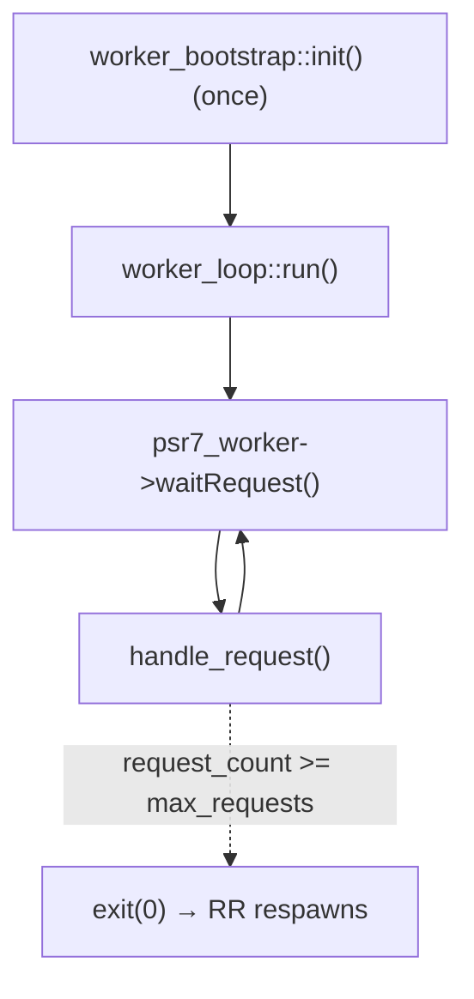
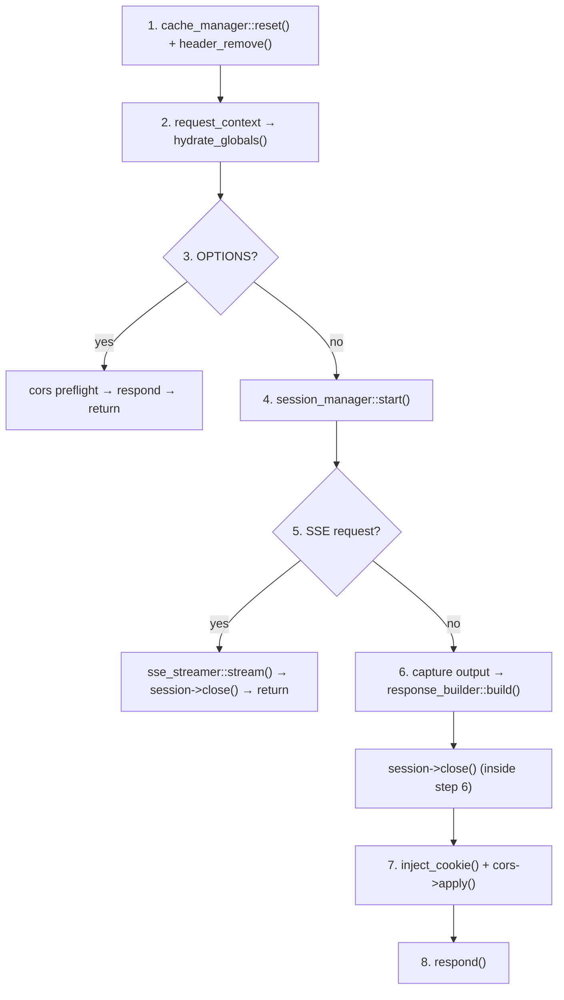
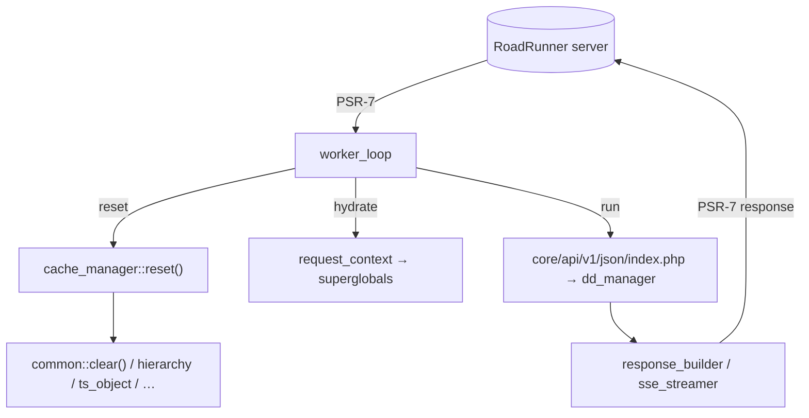

# Runtime & persistent workers

> The Dédalo v7 work-system runtime: how the PHP server runs as a long-lived **RoadRunner** worker process, the per-request loop in `worker/`, the mandatory per-request state reset (`cache_manager` + `common::clear()`), session handling, request-context hydration, response building and SSE streaming.

> See also: [`common` (clear / state bleed)](../core/system/common.md) · [`section`](../core/sections/section.md) · [OpcacheObjectManager](OpcacheObjectManager.md) · [Performance metrics](metrics.md)

This page is the **developer reference** for the `worker/` subsystem
(`worker/index.php` + the nine `class.*.php` modules it loads). It documents how
Dédalo's classic per-request PHP code runs unchanged inside a *persistent*
process, and the discipline that keeps that safe.

## Role

Historically Dédalo ran as a **share-nothing CGI script**: Apache/Nginx +
PHP-FPM started a fresh PHP process per request, ran
`core/api/v1/json/index.php`, and tore the process down. Every static, every
superglobal, every `header()` call died with the request — cross-request state
bleed was impossible by construction.

The **RoadRunner worker** keeps a single PHP process alive and feeds it requests
in a loop. This removes the per-request bootstrap cost (autoload, config,
ontology warm-up, DB connect) but breaks the share-nothing guarantee: anything
that survives between iterations — class statics, `$_SESSION`, emitted headers,
output buffers — now leaks from one user's request into the next unless it is
explicitly reset. The `worker/` subsystem exists to **re-create share-nothing
semantics on top of a shared process**.

!!! note "RoadRunner is the work-system runtime; Bun is the diffusion runtime"
    The persistent worker documented here runs the **work system** PHP API. It
    is distinct from the **Bun** runtime used by the diffusion subsystem (which
    owns MariaDB and serves the public diffusion API). They are separate
    processes with separate lifecycles; do not conflate them.

The same `core/api/v1/json/index.php` entry point serves **both** execution
paths. It branches on the `DEDALO_RR_WORKER` constant (set by
`worker_bootstrap`) only where the two genuinely differ — body reading
(`$GLOBALS['DEDALO_RAW_BODY']` vs `php://input`) and the output strategy
(buffered `echo` vs streaming). Everything else is shared, so the two entry
points cannot drift.

## Responsibilities

- **Bootstrap once** — autoload, RoadRunner worker + PSR-7, optional RPC/KV,
  Dédalo config, persistent DB connections, error-reporting setup
  (`worker_bootstrap`).
- **Run the loop** — `waitRequest()` → handle → respond, repeat; restart the
  worker after `max_requests` to bound memory growth (`worker_loop`).
- **Reset per-request state** — clear class-static caches, the raw-body global,
  the error sentinel and leftover `header()` state *before* every request
  (`cache_manager` + `header_remove()`); this is the heart of state-bleed
  prevention.
- **Hydrate globals** — rebuild `$_SERVER`/`$_GET`/`$_POST`/`$_COOKIE`/`$_FILES`/`$_REQUEST`
  and the raw body from the PSR-7 request (`request_context`,
  `file_upload_normalizer`).
- **Session lifecycle** — close the previous session, detect the session id from
  cookies, configure the save handler, start, write-close, and inject the
  `Set-Cookie` header into the PSR-7 response (`session_manager`,
  `RoadRunnerSessionHandler`).
- **CORS** — answer OPTIONS preflights and apply allow-listed CORS headers
  (`cors_middleware`).
- **Build the response** — capture buffered output, transfer PHP `header()`s to
  the PSR-7 response, set defaults (`response_builder`).
- **Stream SSE** — detect Generator-producing actions and forward yielded chunks
  to RoadRunner's chunked transport (`sse_streamer`).

## The files

All modules live in `worker/` under the `Dedalo\RoadRunner` namespace and are
loaded by `require_once` in `worker/index.php` (there is **no PSR-4 autoload**
for them).

| file | class | role |
| --- | --- | --- |
| `index.php` | — | Thin entry point: define `APP_ROOT`, load the modules, `worker_bootstrap::init()`, `worker_loop::from_context()->run()`. |
| `class.worker_bootstrap.php` | `worker_bootstrap` | One-time init: autoload, RR worker + PSR-7, RPC/KV factory, config, persistent connections, error reporting. |
| `class.worker_loop.php` | `worker_loop` | The request loop and the per-request pipeline (reset → hydrate → CORS → session → SSE/normal → respond). |
| `class.cache_manager.php` | `cache_manager` | Registry of per-request cache clearers; `reset()` runs them all. |
| `class.request_context.php` | `request_context` | PSR-7 → PHP superglobals value object. |
| `class.file_upload_normalizer.php` | `file_upload_normalizer` | PSR-7 uploaded-files tree → `$_FILES`-shaped array. |
| `class.session_manager.php` | `session_manager` | Per-request session start / close / cookie injection. |
| `class.roadrunner_session_handler.php` | `RoadRunnerSessionHandler` | Optional `SessionHandlerInterface` backed by RoadRunner KV (BoltDB). |
| `class.response_builder.php` | `response_builder` | Output capture + PSR-7 response construction. |
| `class.sse_streamer.php` | `sse_streamer` | Server-Sent-Events streaming via a Generator body. |

## Key concepts

### The request loop

`worker_loop::run()` blocks on `PSR7Worker::waitRequest()` and processes one
request per iteration. Each iteration is wrapped in a `try/catch` that logs to
the RoadRunner worker (a thrown request never kills the loop), and a counter
restarts the process via `exit(0)` once `max_requests` (default **50000**) is
reached — RoadRunner then spawns a fresh worker. This is a deliberate
belt-and-braces defence against any slow memory growth the per-request reset
does not catch.



### The per-request pipeline (`handle_request()`)

The ordered steps, exactly as `worker_loop::handle_request()` runs them:

1. **Reset state** — `cache_manager::reset()` clears the registered caches, then
   `header_remove()` (guarded by `headers_sent()`) drops any `header()` /
   `Set-Cookie` left by the previous request. This runs for **every** branch
   (normal / SSE / preflight); the SSE branch never reaches
   `response_builder::build()`, so without this a header emitted while streaming
   would bleed into the next request *(WORKER-02)*.
2. **Hydrate globals** — `request_context::from_request()` builds the value
   object, `hydrate_globals()` writes it into the superglobals and
   `$GLOBALS['DEDALO_RAW_BODY']`.
3. **CORS preflight** — `cors_middleware::handle_preflight()` short-circuits and
   responds to `OPTIONS` requests.
4. **Session start** — `session_manager::start()`.
5. **SSE detection** — parse the body; if `sse_streamer::is_stream_request()`,
   take the streaming path and `close()` the session.
6. **Normal request** — capture API output and build the response
   (`handle_normal_request()`).
7. **Cookie + CORS** — `session_manager::inject_cookie()` then
   `cors_middleware::apply()` on the PSR-7 response.
8. **Respond** — `psr7_worker->respond($response)`.



### Per-request reset and **why** — the dominant state-bleed root cause

In a persistent worker, **a class static that survives a request is the dominant
root cause of cross-request, cross-user data bleed** in this codebase. A static
cache populated for user A — already permission-filtered, already project-scoped
— is happily served to user B on the next loop iteration unless it is cleared.
This is exactly the failure class tracked under `SEC-023` and the `WORKER-*` /
`COMP-*` notes.

`cache_manager` is the single place that undoes this. Its constructor registers
named clearers; `reset()` runs each enabled one at the top of every request.
Each clearer is a **no-op when its class was not loaded** this request (it guards
with `class_exists(..., false)`), so the reset costs nothing for code paths a
request never touched.

| clearer | what it resets | why |
| --- | --- | --- |
| `metrics` | `metrics::reset()` + `section_record` / `section_record_data` counters | per-request diagnostics must not accumulate across requests (see [metrics](metrics.md)). |
| `raw_body` | `$GLOBALS['DEDALO_RAW_BODY'] = null` | stale request body must not be visible to the next request. |
| `error_sentinel` | `unset($_ENV['DEDALO_LAST_ERROR'])` | the last-error marker is per-request. |
| `common` | `common::clear()` | purges `cache_structure_context`, datalist-adjacent caches, request-config caches, main-lang map, etc. — the big one (see below). |
| `section` | *(currently a no-op)* | reserved; `section::clear()` is commented out here. |
| `hierarchy` | `hierarchy::clear()` | main-lang map, section-map elements, section instances. |
| `ts_object` | `ts_object::clear()` | term-resolution + resolved-children caches; a term edited in one request would otherwise keep serving its old string. |
| `component_common` | `component_common::clear()` | datalist (`list_of_values`) caches hold per-user, project-filtered option lists *(COMP-03)*. |
| `ontology` | *(intentional no-op)* | ontology is near-static shared structural data; clearing it every request would be a large regression with no correctness gain *(WORKER-06)*. |
| `section_record_instances_cache` | `::clear()` | per-request record instances; uncleared they serve stale/cross-user rows *(WORKER-06)*. |
| `component_instances_cache` | `::clear()` | per-request component instances; same bleed risk *(WORKER-06)*. |

!!! warning "The contract for new statics"
    Any new class-static cache you add **must** be reset between requests. The
    preferred pattern is to add the reset to the owning class's `clear()` and
    make sure `cache_manager` invokes that `clear()` (most route through
    `common::clear()`). A static that is *meant* to survive (like the ontology)
    must be an explicit, commented decision — never an accident. The
    authoritative list of `common`'s statics and `clear()` is in
    [`common`](../core/system/common.md#static-caches-and-clear).

The most important single clearer is `common` → `common::clear()`, because
`common` is the parent of every section, component and area, and is the home of
the structure-context cache, the request-config caches and the per-section
main-language map. The full inventory of those statics is documented on the
[`common` reference](../core/system/common.md).

### `header_remove()` is part of the reset

PHP's `header()` state is process-global, so it is just as much a state-bleed
vector as a class static. The pipeline removes headers in **two** places:

- at the **top** of `handle_request()` (`header_remove()` for every branch), and
- inside `response_builder::build()`, *after* capturing them with
  `headers_list()` and transferring them to the PSR-7 response.

The top-of-request clear is the safety net for branches (SSE, preflight) that
never reach `response_builder`.

### Bootstrap (once per worker) vs reset (once per request)

These are different lifecycles and must not be confused:

- `worker_bootstrap::init()` runs **once** when the process starts: autoload,
  `RoadRunner\Worker::create()` + `PSR7Worker`, the optional `Goridge` RPC and
  KV factory (failures here only `error_log` a warning — the worker still runs),
  the Dédalo `config.php`, `define('PERSISTENT_CONNECTION', true)` (so DB
  connections are reused across the loop), and
  `error_reporting(... & ~E_DEPRECATED ...)` + `display_errors=0` for clean JSON
  output. It also defines `DEDALO_RR_WORKER` and `DEDALO_RR_DEBUG`.
- `cache_manager::reset()` runs **once per request** to undo per-request state.

### Session handling

`session_manager` re-creates classic session semantics on a process that holds
session state between requests:

1. **Close the previous session** if one is still `PHP_SESSION_ACTIVE` (the
   previous loop iteration's leftover).
2. **Resolve the session name** as
   `dedalo_<MAJOR_VERSION>_<ENTITY>[_ssl]` (the `_ssl` suffix keyed off
   `DEDALO_PROTOCOL === 'https://'` — the *same* predicate as the cookie's
   `Secure` flag, so name and flag can never disagree *(WORKER-04)*), then
   detect the id from the request cookies and `session_id()` it.
3. **Configure the save handler** — `DEDALO_SESSION_HANDLER` /
   `DEDALO_SESSION_SAVE_PATH` (default Redis at `tcp://127.0.0.1:6379`). When set
   to `roadrunner`, it registers the `RoadRunnerSessionHandler` against the KV
   store; otherwise Dédalo's own handler is used.
4. **Start** via `session_start_manager()` (Dédalo's wrapper, in
   `shared/core_functions.php`) with `cookie_secure`, `cookie_samesite`
   (`Lax` in dev, `Strict` in prod) and `prevent_session_lock`.

`close()` calls `session_write_close()` when active. Note the loop closes the
session **early** — inside `handle_normal_request()`, right after the API runs
and *before* `inject_cookie()` reads `session_id()` / cookie params (which stay
valid after a write-close). There is therefore **no second `close()`** in
`handle_request()` *(WORKER-05)*. Closing early also frees the session lock so
concurrent requests from the same browser are not serialized.

`inject_cookie()` rebuilds the `Set-Cookie` header manually from
`session_get_cookie_params()` (PHP CLI does not reliably emit the session cookie
into `headers_list()`), always emitting a `SameSite` value, falling back to a
safe default when none is set *(AUTH-09)*.

!!! note "Secrets are never logged"
    All `debug_log` calls log **cookie/session key names only**, never values —
    the session id *is* the auth token and `$_SESSION` carries the CSRF token and
    secure salt. The session id is logged only as a short SHA-256 prefix
    *(AUTH-05)*.

`RoadRunnerSessionHandler` is a thin `SessionHandlerInterface` over the KV
store. Its `read()`/`write()`/`destroy()` all catch `Throwable`, `error_log` it
and **fail soft** (read → empty session, write/destroy → `false`) so a transient
backend outage degrades to "no session" rather than a fatal 500 *(AUTH-06)*.

### Request context & file uploads

`request_context::from_request()` is a pure PSR-7 → globals translator. It pulls
`getServerParams()`, `getQueryParams()`, `getParsedBody()`, `getCookieParams()`,
builds `$_REQUEST` as GET+POST, and:

- defaults `REQUEST_TIME_FLOAT` and a missing `REMOTE_ADDR` to the **empty
  string** — deliberately *not* loopback, so a missing peer is never
  (mis)treated as a trusted proxy *(AUTH-04)*;
- copies the `Host` header into `HTTP_HOST`;
- reads the raw body only for **non-multipart** requests (multipart bodies are
  consumed as uploaded files instead), exposing it as `raw_body` /
  `$GLOBALS['DEDALO_RAW_BODY']`.

`hydrate_globals()` then writes the value object into the real superglobals so
the legacy API code reads them exactly as under PHP-FPM.

`file_upload_normalizer` recursively converts the PSR-7 `UploadedFileInterface`
tree into a `$_FILES`-shaped array, deriving `tmp_name` from the stream URI and
preserving the original PSR-7 object under a `'psr7'` key so callers can still
`moveTo()` it.

### Response building

For a normal request, `worker_loop::handle_normal_request()` does:

```php
$output = response_builder::capture_output(function() : void {
    (function() : void {                 // isolated scope — no variable leakage
        require APP_ROOT . '/core/api/v1/json/index.php';
    })();
});
$this->session->close();                 // early write-close (WORKER-05)
return response_builder::build($output);
```

`response_builder::capture_output()`:

- runs the app inside `ob_start()` and a **fresh closure** so request-scoped
  variables cannot leak into the next iteration;
- catches any `Throwable`: it `error_log`s the full trace but only puts the real
  message into the response body when `SHOW_DEBUG === true` — otherwise a generic
  "Internal server error" *(SEC-016)*. Stack traces are never sent to the client
  in production.

`response_builder::build()`:

- warns (log only) if the output contains `}{` — a sign of two concatenated JSON
  objects ("fix at source");
- transfers headers captured via `headers_list()` onto the PSR-7 response
  (skipping `Content-Length`, which RoadRunner manages), then `header_remove()`s;
- falls back to `{}` for empty output and defaults `Content-Type` to
  `application/json; charset=utf-8` if the API did not set one.

Note that under the worker the JSON entry point disables its own streaming
handler (`if (defined('DEDALO_RR_WORKER')) $streamed = false;`) and `echo`s the
encoded string, because `ob_start()` already buffers everything and native
encoding is cheaper than PHP-side chunking.

### SSE streaming

Some actions return a **Generator** instead of a string, to push Server-Sent
Events chunk-by-chunk. `sse_streamer::is_stream_request()` detects these early
from the parsed body via either an explicit `is_stream === true` flag or a known
action name (`sse_ping`, `get_process_status`, `get_process_status_stream`).

When detected, `worker_loop::execute_api_for_stream()` runs a **minimal replica**
of the JSON entry point (it cannot capture a return value through the buffered
`require` path):

1. decode `$GLOBALS['DEDALO_RAW_BODY']`;
2. **`dd_manager::sanitize_client_rqo($rqo)`** — the *same* SQO + ddo-map
   security scrub the normal entry point applies; without it a client could
   smuggle raw SQL fields or flip `skip_projects_filter` through the stream path.
   The shared gate is what stops the two entry points drifting *(WORKER-01)*;
3. `dd_manager::bootstrap_csrf_token()`;
4. **close the session** (a long-lived stream must not hold the session lock);
5. `(new dd_manager())->manage_request($rqo)` and return the response (possibly a
   Generator).

`sse_streamer::stream()` then hands the Generator body to
`PSR7Worker::getHttpWorker()->respond(200, $generator, $headers)`, which
RoadRunner delegates to `respondStream()` for true per-chunk delivery. The SSE
headers are `text/event-stream`, `Cache-Control: no-cache`,
`Connection: keep-alive` and `X-Accel-Buffering: no`, merged with the CORS
headers. If the API unexpectedly returns a non-Generator, it falls back to a
normal JSON response.

### CORS

`cors_middleware` reads the `DEDALO_CORS` config constant once (cached on the
instance) and applies `Access-Control-*` headers. It reflects the request
`Origin` **only when it is in the configured `allowed_origins` allowlist**, and
only then adds `Access-Control-Allow-Credentials: true` — it never reflects an
arbitrary origin together with credentials *(SEC-003)*. `Vary: Origin` is always
set. `handle_preflight()` returns a `200` with these headers for `OPTIONS`,
`null` otherwise.

## How it fits with the rest of Dédalo

- The worker is a **host**: it does not contain business logic. It hydrates the
  environment, runs `core/api/v1/json/index.php` (which delegates to
  [`dd_manager::manage_request()`](../core/system/api.md)), and packages the
  result. Both entry points share `dd_manager::sanitize_client_rqo()` and
  `bootstrap_csrf_token()`.
- The per-request reset is the runtime counterpart of the **`clear()` contract**
  on the object classes. [`common::clear()`](../core/system/common.md) and
  [`section::clear()`](../core/sections/section.md) (plus `hierarchy`,
  `ts_object`, `component_common`, the instance caches) are what
  `cache_manager` actually invokes.
- **Metrics** are zeroed by the `metrics` clearer here; see
  [Performance metrics](metrics.md) for what survives a request and must be
  reset.
- The **[OpcacheObjectManager](OpcacheObjectManager.md)** is the *opposite* kind
  of cache — an intentionally cross-request, process-/SHM-wide store of
  (near-)static data (like the ontology). It is **not** cleared by
  `cache_manager` (cf. the `ontology` no-op); only per-user / per-request caches
  are.



## Examples

### The whole entry point

`worker/index.php` is intentionally tiny — all logic is in the modules:

```php
define('APP_ROOT', dirname(__DIR__));
// require_once each worker/class.*.php …
$context = worker_bootstrap::init();          // once
$loop    = worker_loop::from_context($context);
$loop->run();                                  // forever
```

### Adding a per-request cache clearer

When you introduce a new process-wide static cache, register its reset so the
worker undoes it every request:

```php
// in worker/class.cache_manager.php __construct()
$this->register('my_subsystem', function(): void {
    // class_exists(..., false): no-op if the class wasn't loaded this request
    if (class_exists('\my_subsystem', false) && method_exists('\my_subsystem', 'clear')) {
        \my_subsystem::clear();
    }
});
```

If the cache lives on a `common` subclass, prefer routing its reset through
`common::clear()` (already invoked by the `common` clearer) instead of adding a
new registry entry.

### Selectively enabling clearers (diagnostics)

`cache_manager::configure()` can narrow the active set — e.g. to bisect a
suspected bleed (`null` = all enabled, the default):

```php
$cache = new cache_manager();
$cache->configure(['common', 'ts_object']); // only these run this cycle
// ...
$cache->configure(null);                     // back to all (the secure default)
```

!!! danger "Do not ship a narrowed set"
    Every clearer is enabled by default **for security**. Narrowing the set is a
    debugging aid only; leaving it narrowed re-opens the state-bleed surface.

## Related

- [`common` — `clear()` & static caches](../core/system/common.md) — the
  authoritative inventory of the process-wide statics the worker must purge, and
  the "worker state bleed" warning.
- [`section`](../core/sections/section.md) — its `clear()` and instance-cache
  bounding are part of the same per-request discipline.
- [API / `dd_manager`](../core/system/api.md) — the request dispatcher the worker
  hosts; shared `sanitize_client_rqo()` / `bootstrap_csrf_token()` gates.
- [Performance metrics](metrics.md) — the `metrics` statics reset every request
  by `cache_manager`.
- [OpcacheObjectManager](OpcacheObjectManager.md) — the intentionally
  cross-request SHM cache layer that the per-request reset deliberately leaves
  alone.
